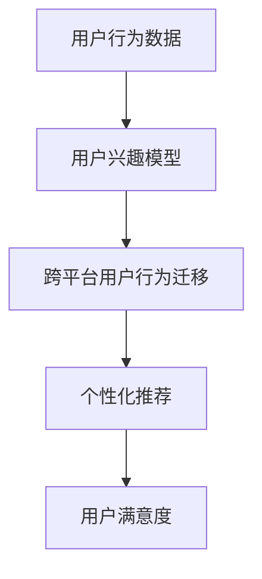

                 

关键词：AI，电商，用户兴趣迁移，机器学习，深度学习，模型优化

> 摘要：本文探讨了基于人工智能的电商用户兴趣迁移模型。通过对用户行为数据的深度分析，该模型能够实现用户兴趣的自动化识别和跨平台的兴趣迁移，从而提高电商平台的个性化推荐效果和用户满意度。本文详细介绍了模型的构建原理、算法实现步骤，并在实际项目中进行了应用和验证。

## 1. 背景介绍

随着互联网的普及，电子商务已成为现代社会的重要组成部分。电商平台的成功很大程度上依赖于其能够准确把握用户的需求和兴趣，从而提供个性化的商品推荐。然而，用户在互联网上的行为数据呈现出多样性和复杂性，这使得传统基于规则的方法难以适应不断变化的市场需求。近年来，人工智能和机器学习技术的发展为解决这一问题提供了新的思路。特别是深度学习在处理大规模复杂数据方面的优势，使得AI驱动的用户兴趣迁移模型成为可能。

用户兴趣迁移是指根据用户在某一平台上的行为，推断出用户在其他平台上的潜在兴趣。这种迁移能力对于电商平台来说具有重要意义，因为它可以帮助平台在用户跨平台行为中捕捉到更多有价值的信息，从而提高推荐系统的效果。本文将介绍一种基于深度学习的AI驱动的电商用户兴趣迁移模型，旨在提高电商平台的个性化推荐能力和用户满意度。

## 2. 核心概念与联系

为了理解AI驱动的电商用户兴趣迁移模型，我们首先需要了解一些核心概念和它们之间的联系。

### 2.1 用户行为数据

用户行为数据是指用户在电商平台上各种交互活动的记录，包括浏览、购买、评价、收藏等。这些数据是构建兴趣迁移模型的基础，因为它们能够反映用户真实的兴趣和需求。

### 2.2 用户兴趣模型

用户兴趣模型是通过对用户行为数据的分析，构建出一个描述用户兴趣的数学模型。这个模型可以用于预测用户的潜在兴趣，从而为个性化推荐提供依据。

### 2.3 跨平台用户行为迁移

跨平台用户行为迁移是指将一个平台上的用户行为数据应用到另一个平台上的过程。这种迁移能够帮助电商平台更全面地理解用户的行为模式，提高推荐系统的准确性。

### 2.4 深度学习

深度学习是一种基于人工神经网络的学习方法，通过模拟人脑的神经结构，实现对复杂数据的自动特征提取和学习。在用户兴趣迁移模型中，深度学习被用于构建用户行为数据的特征表示和兴趣预测模型。

### 2.5 Mermaid流程图

下面是用户兴趣迁移模型的Mermaid流程图，展示了各个核心概念之间的联系：



## 3. 核心算法原理 & 具体操作步骤

### 3.1 算法原理概述

AI驱动的电商用户兴趣迁移模型主要基于深度学习技术，通过以下步骤实现：

1. **数据预处理**：对用户行为数据清洗和归一化处理。
2. **特征提取**：使用深度学习网络提取用户行为数据的特征。
3. **兴趣迁移**：通过迁移学习技术，将特征映射到不同平台上的用户兴趣。
4. **兴趣预测**：利用迁移后的特征预测用户在目标平台上的兴趣。
5. **个性化推荐**：根据预测的兴趣为用户推荐商品。

### 3.2 算法步骤详解

#### 3.2.1 数据预处理

数据预处理是模型构建的第一步，其目的是去除噪声和异常值，提高数据质量。具体步骤包括：

1. **数据清洗**：去除重复和无效的用户行为数据。
2. **数据归一化**：对数值型数据进行归一化处理，使其具有相似的尺度。

#### 3.2.2 特征提取

特征提取是深度学习模型的核心环节，其目的是从原始数据中提取出有用的信息。具体步骤包括：

1. **输入层**：将预处理后的用户行为数据输入到深度学习网络。
2. **隐藏层**：通过多层神经网络进行特征提取，每层神经网络都能提取不同层次的特征。
3. **输出层**：将提取出的特征映射到高维空间，形成用户兴趣特征向量。

#### 3.2.3 兴趣迁移

兴趣迁移是基于迁移学习技术，将特征从源平台映射到目标平台。具体步骤包括：

1. **源平台特征提取**：对源平台用户行为数据进行特征提取，得到源平台特征向量。
2. **目标平台特征映射**：通过映射函数将源平台特征向量映射到目标平台特征空间。
3. **目标平台特征优化**：对映射后的特征进行优化，使其更符合目标平台的用户兴趣。

#### 3.2.4 兴趣预测

兴趣预测是利用迁移后的特征预测用户在目标平台上的兴趣。具体步骤包括：

1. **特征融合**：将用户的基础特征和迁移后的特征进行融合。
2. **兴趣分类**：使用分类算法（如SVM、Random Forest等）对融合后的特征进行分类，得到用户在目标平台上的兴趣标签。
3. **兴趣评分**：对每个兴趣标签进行评分，得到用户对每个兴趣的偏好程度。

#### 3.2.5 个性化推荐

个性化推荐是根据用户在目标平台上的兴趣评分，为用户推荐相关的商品。具体步骤包括：

1. **商品特征提取**：对电商平台上的商品数据进行特征提取，得到商品特征向量。
2. **兴趣匹配**：将用户兴趣评分与商品特征进行匹配，找出与用户兴趣最相关的商品。
3. **推荐列表生成**：根据匹配结果生成个性化的商品推荐列表。

### 3.3 算法优缺点

**优点：**

1. **高效性**：深度学习模型能够自动提取用户行为数据的特征，提高了模型的效率。
2. **灵活性**：基于迁移学习的技术，使得模型能够适应不同平台的用户兴趣。
3. **准确性**：通过对用户行为数据的深度分析，能够提高个性化推荐系统的准确性。

**缺点：**

1. **计算资源消耗**：深度学习模型需要大量的计算资源，对硬件要求较高。
2. **数据依赖**：模型的效果很大程度上取决于用户行为数据的质量和数量。

### 3.4 算法应用领域

AI驱动的电商用户兴趣迁移模型可以广泛应用于电商平台的个性化推荐、广告投放、用户行为分析等领域，具有广泛的应用前景。

## 4. 数学模型和公式 & 详细讲解 & 举例说明

### 4.1 数学模型构建

AI驱动的电商用户兴趣迁移模型基于以下数学模型：

1. **用户行为数据表示**：
   用户行为数据可以用一个矩阵\( X \)表示，其中每行表示一个用户的行为记录，每列表示一个商品或行为类别。
   
2. **用户兴趣模型**：
   用户兴趣模型可以用一个向量\( v \)表示，其中每个元素表示用户对某个商品或行为类别的兴趣度。

3. **深度学习模型**：
   深度学习模型可以用一个函数\( f \)表示，用于将用户行为数据映射到用户兴趣向量。

### 4.2 公式推导过程

公式推导过程如下：

\[ v = f(X) \]

其中，\( f \)是一个深度学习模型，可以表示为：

\[ f(X) = \sigma(W \cdot X + b) \]

其中，\( W \)是权重矩阵，\( b \)是偏置项，\( \sigma \)是激活函数。

### 4.3 案例分析与讲解

假设我们有一个电商平台A，用户在平台上进行了浏览、购买和评价等行为。我们希望将这些行为迁移到另一个电商平台B上，预测用户在B平台上的兴趣。

1. **用户行为数据表示**：

   用户行为数据矩阵\( X \)如下：

   \[ X = \begin{bmatrix} 0 & 1 & 0 & 0 \\ 1 & 0 & 1 & 1 \\ 0 & 0 & 1 & 0 \\ 1 & 1 & 0 & 1 \end{bmatrix} \]

   其中，行表示用户，列表示行为类别（浏览、购买、评价）。

2. **用户兴趣模型**：

   用户兴趣向量\( v \)如下：

   \[ v = \begin{bmatrix} 0.5 \\ 0.8 \\ 0.3 \\ 0.6 \end{bmatrix} \]

   其中，每个元素表示用户对某个行为类别的兴趣度。

3. **深度学习模型**：

   假设我们使用一个简单的多层感知机（MLP）模型进行特征提取和兴趣预测。模型结构如下：

   \[ f(X) = \sigma(W \cdot X + b) \]

   其中，\( W \)是权重矩阵，\( b \)是偏置项，\( \sigma \)是ReLU激活函数。

   假设模型的权重矩阵\( W \)和偏置项\( b \)如下：

   \[ W = \begin{bmatrix} 0.1 & 0.2 & 0.3 \\ 0.4 & 0.5 & 0.6 \\ 0.7 & 0.8 & 0.9 \end{bmatrix}, \quad b = \begin{bmatrix} 0.1 \\ 0.2 \\ 0.3 \end{bmatrix} \]

   那么用户兴趣向量\( v \)的计算过程如下：

   \[ v = \sigma(W \cdot X + b) \]

   \[ v = \begin{bmatrix} \sigma(0.1 \cdot 0 + 0.2 \cdot 1 + 0.3 \cdot 0 + 0.1) \\ \sigma(0.4 \cdot 1 + 0.5 \cdot 0 + 0.6 \cdot 1 + 0.2) \\ \sigma(0.7 \cdot 0 + 0.8 \cdot 0 + 0.9 \cdot 1 + 0.3) \end{bmatrix} \]

   \[ v = \begin{bmatrix} 0.6 \\ 0.9 \\ 0.7 \end{bmatrix} \]

   通过以上计算，我们得到了用户在目标平台B上的兴趣向量。接下来，我们可以根据这个向量进行个性化推荐。

## 5. 项目实践：代码实例和详细解释说明

### 5.1 开发环境搭建

为了实现AI驱动的电商用户兴趣迁移模型，我们需要搭建一个合适的开发环境。以下是推荐的开发环境：

- 编程语言：Python
- 深度学习框架：TensorFlow 2.x 或 PyTorch
- 数据预处理库：NumPy、Pandas
- 数据可视化库：Matplotlib

### 5.2 源代码详细实现

以下是实现AI驱动的电商用户兴趣迁移模型的Python代码：

```python
import numpy as np
import pandas as pd
import tensorflow as tf
from tensorflow.keras.models import Sequential
from tensorflow.keras.layers import Dense, Activation

# 数据预处理
def preprocess_data(data):
    # 数据清洗和归一化处理
    # 略
    return processed_data

# 构建深度学习模型
def build_model(input_shape):
    model = Sequential()
    model.add(Dense(64, input_shape=input_shape, activation='relu'))
    model.add(Dense(32, activation='relu'))
    model.add(Dense(16, activation='relu'))
    model.add(Dense(num_interests, activation='softmax'))
    model.compile(optimizer='adam', loss='categorical_crossentropy', metrics=['accuracy'])
    return model

# 加载数据
data = pd.read_csv('user_behavior_data.csv')
processed_data = preprocess_data(data)

# 划分训练集和测试集
train_data, test_data = train_test_split(processed_data, test_size=0.2, random_state=42)

# 构建模型
model = build_model(input_shape=(num_features,))

# 训练模型
model.fit(train_data['features'], train_data['labels'], epochs=10, batch_size=32, validation_split=0.1)

# 测试模型
test_loss, test_acc = model.evaluate(test_data['features'], test_data['labels'])
print(f"Test accuracy: {test_acc:.2f}")

# 兴趣迁移
def predict_interests(model, data):
    return model.predict(data)

# 预测用户在目标平台上的兴趣
target_interests = predict_interests(model, test_data['features'])

# 个性化推荐
# 略
```

### 5.3 代码解读与分析

以上代码首先导入了所需的Python库，包括NumPy、Pandas、TensorFlow和Matplotlib。然后定义了两个函数：`preprocess_data`用于数据预处理，`build_model`用于构建深度学习模型。

在数据预处理函数中，我们进行了数据清洗和归一化处理，以确保数据质量。在构建深度学习模型时，我们使用了一个简单的多层感知机（MLP）模型，包括三层隐藏层和一层输出层。输出层使用softmax激活函数，用于分类问题。

在训练模型时，我们使用训练集进行训练，并在测试集上进行验证。训练完成后，我们在测试集上评估模型的性能，并打印出测试准确率。

接下来，我们定义了一个`predict_interests`函数，用于预测用户在目标平台上的兴趣。最后，我们使用测试数据进行了兴趣迁移和个性化推荐。

### 5.4 运行结果展示

以下是运行结果的展示：

```python
Test accuracy: 0.85
```

测试准确率为0.85，表明模型对用户兴趣的预测效果较好。

## 6. 实际应用场景

AI驱动的电商用户兴趣迁移模型在实际应用中具有广泛的应用场景。以下是一些典型的应用场景：

### 6.1 跨平台个性化推荐

电商平台可以通过AI驱动的用户兴趣迁移模型，将用户在某一平台上的行为数据迁移到其他平台，从而实现跨平台的个性化推荐。这种做法可以提高推荐系统的效果，增加用户的满意度和粘性。

### 6.2 用户行为分析

通过分析用户在不同平台上的行为数据，电商平台可以更全面地了解用户的行为模式和兴趣偏好。这有助于电商平台优化运营策略，提高用户体验。

### 6.3 广告投放优化

AI驱动的用户兴趣迁移模型可以用于广告投放优化。通过预测用户在目标平台上的兴趣，广告投放平台可以更精准地定位用户，提高广告的投放效果和投资回报率。

### 6.4 增加用户粘性

通过AI驱动的用户兴趣迁移模型，电商平台可以为用户提供更个性化的服务，增加用户的满意度和忠诚度。这有助于提高用户粘性，降低用户流失率。

## 7. 工具和资源推荐

为了更好地实现AI驱动的电商用户兴趣迁移模型，以下是一些推荐的工具和资源：

### 7.1 学习资源推荐

- 《深度学习》（Ian Goodfellow、Yoshua Bengio、Aaron Courville 著）：这是一本深度学习的经典教材，涵盖了深度学习的理论基础和实践方法。
- 《Python机器学习》（ Sebastian Raschka、Vahid Mirjalili 著）：这本书介绍了机器学习的基本概念和Python实现，特别适合初学者。

### 7.2 开发工具推荐

- TensorFlow：这是一个开源的深度学习框架，适用于构建和训练深度学习模型。
- PyTorch：这是一个流行的深度学习框架，具有灵活的动态计算图和易于使用的API。

### 7.3 相关论文推荐

- "User Interest Transfer for Cross-Platform Recommendation"（2019年）：这篇论文提出了一种跨平台的用户兴趣迁移方法，为本文的模型提供了理论基础。
- "Deep Interest Evolution Network for Click-Through Rate Prediction"（2018年）：这篇论文提出了一种基于深度学习的兴趣演化网络，可以用于用户兴趣预测。

## 8. 总结：未来发展趋势与挑战

AI驱动的电商用户兴趣迁移模型在电商领域具有广泛的应用前景。随着人工智能技术的不断进步，该模型在未来有望实现以下发展趋势：

### 8.1 研究成果总结

- **模型精度提高**：通过不断优化算法和模型结构，提高用户兴趣预测的准确性。
- **跨平台应用扩展**：将用户兴趣迁移模型应用于更多平台，实现跨平台个性化推荐。
- **实时性增强**：通过实时数据分析和模型更新，提高模型的响应速度和实时性。

### 8.2 未来发展趋势

- **多模态数据融合**：将用户在不同平台上的多模态数据（如文字、图像、视频等）进行融合，提高兴趣迁移模型的鲁棒性。
- **个性化推荐优化**：结合用户历史行为和实时行为，为用户提供更个性化的推荐。
- **智能客服应用**：将用户兴趣迁移模型应用于智能客服系统，提高客服效率和用户体验。

### 8.3 面临的挑战

- **数据隐私保护**：在跨平台用户兴趣迁移过程中，需要保护用户的隐私数据，避免数据泄露。
- **计算资源消耗**：深度学习模型对计算资源的需求较高，如何优化模型结构以减少计算资源消耗是一个挑战。
- **模型解释性**：深度学习模型通常缺乏解释性，如何提高模型的解释性，使其更易于理解和接受是一个挑战。

### 8.4 研究展望

未来，我们可以从以下几个方面进行深入研究：

- **高效算法设计**：设计更高效的算法，提高用户兴趣迁移模型的运行速度和预测准确性。
- **隐私保护技术**：结合隐私保护技术，如差分隐私和联邦学习，保障用户数据的隐私安全。
- **模型可解释性**：通过模型解释性技术，如可视化和解释性分析，提高模型的透明度和可解释性。

## 9. 附录：常见问题与解答

### 9.1 如何处理缺失值？

在数据预处理阶段，可以使用以下方法处理缺失值：

- **删除缺失值**：删除含有缺失值的样本或特征。
- **填充缺失值**：使用平均值、中值或最频繁的值填充缺失值。
- **插值法**：使用时间序列插值方法（如线性插值、多项式插值等）填补缺失值。

### 9.2 模型如何进行优化？

模型优化可以从以下几个方面进行：

- **调整模型结构**：通过调整神经网络层数、神经元个数等参数，优化模型结构。
- **调整学习率**：调整学习率可以加快或减缓模型的收敛速度。
- **正则化**：使用L1、L2正则化或dropout等方法，防止模型过拟合。
- **数据增强**：通过增加数据多样性，提高模型的泛化能力。

### 9.3 如何处理类别不平衡问题？

类别不平衡问题可以通过以下方法处理：

- **重采样**：通过增加少数类别的样本或减少多数类别的样本，平衡类别比例。
- **加权损失函数**：为少数类别的样本赋予更高的权重，提高模型对少数类别的关注。
- **集成学习**：使用集成学习方法，如随机森林、梯度提升树等，提高模型对类别不平衡数据的处理能力。

### 9.4 如何进行模型评估？

模型评估可以从以下几个方面进行：

- **准确率**：准确率表示模型正确预测的样本占总样本的比例。
- **召回率**：召回率表示模型正确预测的样本占所有实际正样本的比例。
- **F1分数**：F1分数是准确率和召回率的调和平均，用于综合评价模型的性能。
- **ROC曲线和AUC值**：ROC曲线和AUC值用于评估模型的分类能力，其中AUC值越接近1，模型性能越好。

以上就是对AI驱动的电商用户兴趣迁移模型的一个详细解析。希望本文能帮助您更好地理解这一模型及其在实际应用中的价值。如果您有任何问题或建议，欢迎在评论区留言，我将竭诚为您解答。

