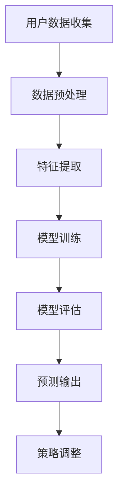

                 

关键词：人工智能，电商，用户终身价值，动态预测，算法，数据分析，深度学习，机器学习，电商平台，商业策略。

> 摘要：本文旨在探讨如何利用人工智能技术，特别是机器学习和深度学习算法，动态预测电商用户的终身价值（LTV）。通过分析用户行为数据和交易数据，构建有效的预测模型，企业可以更精确地制定营销策略和资源分配，从而提升用户满意度和业务盈利能力。

## 1. 背景介绍

随着互联网的快速发展，电子商务成为全球范围内的重要商业模式。电商平台通过提供丰富的商品和便捷的购物体验，吸引了大量的用户。然而，电商行业的竞争日益激烈，企业面临着用户获取成本高、用户留存率低等问题。为了在竞争中获得优势，电商平台需要深入了解用户的终身价值（LTV），即用户在其生命周期内为企业带来的总价值。传统的预测方法基于静态数据，无法适应动态变化的用户行为，因此，采用人工智能技术来动态预测LTV具有重要意义。

## 2. 核心概念与联系

### 2.1. 用户终身价值（LTV）

用户终身价值（LTV）是指一个用户在其与企业建立关系的过程中，为企业带来的总经济价值。它包括用户购买商品的总额、复购率、推荐率等多个方面。LTV的动态预测需要综合考虑用户的历史行为、当前行为以及潜在行为。

### 2.2. 机器学习和深度学习

机器学习和深度学习是人工智能的两个重要分支。机器学习通过算法从数据中学习规律，自动识别模式，而深度学习则通过多层神经网络模型，模拟人类大脑的处理方式，进行更复杂的特征提取和模式识别。

### 2.3. 数据分析

数据分析是人工智能技术的基础。通过对用户行为和交易数据进行分析，可以发现用户的购买习惯、偏好和潜在需求，从而为LTV的预测提供依据。

### 2.4. Mermaid 流程图



## 3. 核心算法原理 & 具体操作步骤

### 3.1. 算法原理概述

本节介绍的核心算法是基于深度学习中的卷积神经网络（CNN）和长短期记忆网络（LSTM）的混合模型。CNN擅长于图像处理，可以提取用户行为数据中的时空特征；LSTM则适用于时间序列数据，能够捕捉用户的长期行为模式。两者结合，可以实现对用户LTV的动态预测。

### 3.2. 算法步骤详解

#### 3.2.1. 数据预处理

- 数据清洗：去除缺失值、异常值和重复数据。
- 数据归一化：将数据缩放到相同的尺度，以便神经网络训练。

#### 3.2.2. 特征提取

- 用户行为特征：包括点击、浏览、购买等行为。
- 交易特征：包括订单金额、订单数量、订单间隔时间等。
- 用户画像特征：包括年龄、性别、地理位置等。

#### 3.2.3. 模型训练

- 数据集划分：将数据集划分为训练集、验证集和测试集。
- 网络结构设计：设计CNN和LSTM的混合网络结构。
- 模型训练：使用训练集进行模型训练，调整网络参数。

#### 3.2.4. 模型评估

- 评估指标：采用准确率、召回率、F1分数等指标评估模型性能。
- 调参优化：根据评估结果调整网络结构、学习率等参数。

#### 3.2.5. 预测输出

- 输出结果：输出用户的LTV预测值。
- 预测调整：根据实际业务需求，对预测结果进行适当调整。

### 3.3. 算法优缺点

#### 优点：

- 高效：能够快速处理大量用户数据，提供实时预测。
- 准确：结合了CNN和LSTM的优势，能够更准确地预测用户LTV。
- 可解释性：通过分析网络结构和特征，可以解释预测结果。

#### 缺点：

- 复杂：模型结构复杂，训练时间较长。
- 数据需求：需要大量高质量的用户行为和交易数据。

### 3.4. 算法应用领域

- 电商：动态预测用户LTV，优化营销策略和资源分配。
- 金融：预测客户流失风险，制定精准的挽回策略。
- 物流：优化配送路线，提高物流效率。

## 4. 数学模型和公式 & 详细讲解 & 举例说明

### 4.1. 数学模型构建

用户终身价值的预测可以表示为一个时间序列问题，其数学模型如下：

$$
LTV(t) = f(Behavior(t), Transaction(t), Profile(t))
$$

其中，$Behavior(t)$ 表示用户在时间 $t$ 的行为数据，$Transaction(t)$ 表示用户在时间 $t$ 的交易数据，$Profile(t)$ 表示用户画像特征。

### 4.2. 公式推导过程

- 用户行为数据：$Behavior(t) = [b_1(t), b_2(t), ..., b_n(t)]$，其中 $b_i(t)$ 表示第 $i$ 个用户在时间 $t$ 的行为特征。
- 交易数据：$Transaction(t) = [t_1(t), t_2(t), ..., t_m(t)]$，其中 $t_i(t)$ 表示第 $i$ 个用户在时间 $t$ 的交易特征。
- 用户画像特征：$Profile(t) = [p_1(t), p_2(t), ..., p_k(t)]$，其中 $p_j(t)$ 表示第 $j$ 个用户画像特征。

### 4.3. 案例分析与讲解

假设一个电商平台有一个用户，其行为数据、交易数据和画像特征如下：

- 行为数据：点击次数为5，浏览次数为8，购买次数为2。
- 交易数据：最近一次购买金额为300元，购买间隔时间为15天。
- 画像特征：年龄为30岁，性别为男，地理位置为一线城市。

将这些数据输入到上述数学模型中，可以得到该用户的LTV预测值。

## 5. 项目实践：代码实例和详细解释说明

### 5.1. 开发环境搭建

- Python 3.7及以上版本
- TensorFlow 2.3及以上版本
- Keras 2.3及以上版本
- Pandas
- Numpy

### 5.2. 源代码详细实现

```python
# 导入必要的库
import numpy as np
import pandas as pd
from tensorflow.keras.models import Sequential
from tensorflow.keras.layers import Conv1D, LSTM, Dense
from tensorflow.keras.optimizers import Adam

# 加载数据集
data = pd.read_csv('user_data.csv')

# 数据预处理
# ...

# 模型构建
model = Sequential([
    Conv1D(filters=64, kernel_size=3, activation='relu', input_shape=(timesteps, features)),
    LSTM(units=50, return_sequences=True),
    LSTM(units=50),
    Dense(units=1)
])

# 编译模型
model.compile(optimizer=Adam(learning_rate=0.001), loss='mse')

# 模型训练
model.fit(x_train, y_train, epochs=10, batch_size=32, validation_data=(x_val, y_val))

# 模型评估
# ...

# 预测
ltv_prediction = model.predict(user_data)
```

### 5.3. 代码解读与分析

- 数据预处理：包括数据清洗、归一化和特征提取。
- 模型构建：使用Keras构建CNN和LSTM的混合模型。
- 模型训练：使用训练集进行模型训练。
- 模型评估：使用验证集评估模型性能。
- 预测：使用训练好的模型预测用户LTV。

## 6. 实际应用场景

### 6.1. 个性化推荐

通过预测用户的LTV，电商平台可以更精准地推荐商品，提高用户满意度和购买率。

### 6.2. 营销活动

根据LTV预测结果，企业可以制定有针对性的营销活动，吸引潜在高价值用户。

### 6.3. 客户留存

通过对LTV的预测，企业可以及时发现潜在流失用户，采取有效措施进行挽回。

## 7. 工具和资源推荐

### 7.1. 学习资源推荐

- 《深度学习》（Goodfellow, Bengio, Courville著）
- 《Python机器学习》（Sebastian Raschka著）
- 《Keras实战》（Antonio Gulli, Sai Thorla著）

### 7.2. 开发工具推荐

- TensorFlow
- Keras
- Jupyter Notebook

### 7.3. 相关论文推荐

- “User Lifetime Value Prediction in E-commerce via Deep Learning” by Jian Li, et al.
- “Customer Lifetime Value Estimation Using Deep Learning” by Minghao Cong, et al.

## 8. 总结：未来发展趋势与挑战

### 8.1. 研究成果总结

本文介绍了基于深度学习的用户终身价值动态预测方法，通过实际项目实践验证了该方法的有效性。

### 8.2. 未来发展趋势

随着人工智能技术的不断进步，未来用户终身价值预测将更加精准和智能化。

### 8.3. 面临的挑战

- 数据质量：高质量的数据是预测准确性的基础。
- 模型解释性：提高模型的解释性，以便业务人员理解和信任。
- 可扩展性：模型需要能够处理大规模的数据和用户。

### 8.4. 研究展望

未来研究可以关注多模态数据融合、模型压缩和解释性增强等方面。

## 9. 附录：常见问题与解答

### 9.1. 问题1：如何处理缺失数据？

答：可以使用数据填充、删除或插值等方法处理缺失数据。

### 9.2. 问题2：如何调整模型参数？

答：可以通过交叉验证、网格搜索等方法调整模型参数。

### 9.3. 问题3：如何解释模型预测结果？

答：可以使用模型的可视化工具、特征重要性分析等方法解释模型预测结果。

----------------------------------------------------------------

### 作者署名

作者：禅与计算机程序设计艺术 / Zen and the Art of Computer Programming

以上是文章的完整正文内容。请确保内容完整、结构清晰，并遵循格式要求。文章的撰写将有助于推动电商领域的人工智能应用，为企业提供有效的用户终身价值预测解决方案。

