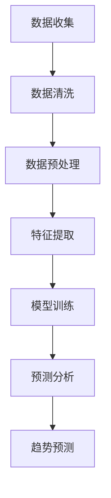

                 

关键词：人工智能，电商趋势，大模型，预测，数据驱动

> 摘要：随着大数据和人工智能技术的不断进步，电商行业正迎来一场前所未有的变革。本文将探讨如何利用人工智能，特别是大模型，来预测电商市场的未来趋势，为企业和消费者提供更精准、更个性化的服务。

## 1. 背景介绍

电商行业在过去几十年中经历了快速的发展，从最初的在线书店、电子产品销售，到如今的综合购物平台、社交媒体电商等多种形式，电商已经深深融入到人们的日常生活中。然而，随着市场竞争的日益激烈，消费者需求的多变，以及大数据和人工智能技术的不断进步，传统的电商模式正在面临巨大的挑战。

在这样的背景下，如何准确预测电商市场的未来趋势，把握消费者需求的变化，提升用户满意度，成为企业和研究机构亟待解决的问题。而人工智能，特别是大模型，以其强大的数据处理和分析能力，正在成为电商趋势预测的重要工具。

## 2. 核心概念与联系

### 2.1 人工智能与大数据

人工智能（AI）是指由人制造出来的系统所表现出来的智能行为。大数据（Big Data）是指无法用常规软件工具在合理时间内对其进行抓取、管理和处理的数据集合。人工智能和大数据的结合，使得我们能够从海量数据中提取有价值的信息，从而做出更准确的预测。

### 2.2 大模型

大模型（Large Model）是指参数量庞大的深度学习模型。近年来，随着计算能力的提升和数据的积累，大模型在各个领域都取得了显著的成果。在电商趋势预测中，大模型可以处理海量的用户行为数据，通过训练，学习到用户的行为模式，从而预测未来的趋势。

### 2.3 Mermaid 流程图

下面是一个用于描述电商趋势预测流程的 Mermaid 流程图：



## 3. 核心算法原理 & 具体操作步骤

### 3.1 算法原理概述

电商趋势预测的核心算法是基于深度学习的大模型。通过训练，大模型可以学会识别用户的行为模式，从而预测未来的趋势。

### 3.2 算法步骤详解

#### 3.2.1 数据收集

首先，需要收集电商平台的用户行为数据，包括浏览记录、购买记录、评价等。

#### 3.2.2 数据清洗

对收集到的数据进行清洗，去除噪声数据，确保数据的准确性。

#### 3.2.3 数据预处理

对清洗后的数据进行预处理，包括数据归一化、缺失值处理等。

#### 3.2.4 特征提取

从预处理后的数据中提取特征，用于模型训练。

#### 3.2.5 模型训练

使用提取的特征，训练大模型。训练过程中，大模型会不断优化参数，以提高预测的准确性。

#### 3.2.6 预测分析

利用训练好的模型，对未来的数据进行预测分析。

#### 3.2.7 趋势预测

根据预测分析的结果，得出未来的电商趋势。

### 3.3 算法优缺点

#### 优点

- **强大的数据处理能力**：大模型可以处理海量的数据，提取有价值的信息。
- **高效的预测能力**：通过深度学习，大模型可以学会识别复杂的行为模式，提高预测的准确性。
- **灵活的应用场景**：大模型可以应用于多种电商场景，如商品推荐、价格预测等。

#### 缺点

- **计算资源需求高**：大模型需要大量的计算资源进行训练和预测。
- **数据依赖性**：大模型的预测效果高度依赖数据的质量。

### 3.4 算法应用领域

大模型在电商趋势预测中的应用非常广泛，包括：

- **商品推荐**：根据用户的浏览和购买历史，推荐用户可能感兴趣的商品。
- **价格预测**：预测商品的价格走势，帮助商家制定合理的定价策略。
- **营销策略**：分析用户行为，预测用户的需求，制定个性化的营销策略。

## 4. 数学模型和公式 & 详细讲解 & 举例说明

### 4.1 数学模型构建

电商趋势预测的核心是建立一个预测模型。我们可以使用时间序列模型来预测未来的趋势。一个常见的时间序列模型是ARIMA模型（自回归积分滑动平均模型）。

### 4.2 公式推导过程

ARIMA模型由三个部分组成：自回归（AR）、差分（I）和移动平均（MA）。以下是ARIMA模型的公式推导：

- 自回归（AR）：
  
  $$y_t = c + \phi_1 y_{t-1} + \phi_2 y_{t-2} + ... + \phi_p y_{t-p} + \epsilon_t$$
  
  其中，$y_t$ 是时间序列在时刻 $t$ 的值，$\phi_1, \phi_2, ..., \phi_p$ 是自回归系数，$c$ 是常数项，$\epsilon_t$ 是误差项。

- 差分（I）：

  $$d_t = y_t - y_{t-1}$$
  
  其中，$d_t$ 是差分后的时间序列值。

- 移动平均（MA）：
  
  $$y_t = c + \theta_1 d_t + \theta_2 d_{t-1} + ... + \theta_q d_{t-q} + \epsilon_t$$
  
  其中，$\theta_1, \theta_2, ..., \theta_q$ 是移动平均系数。

综合上述三个部分，可以得到ARIMA模型的公式：

$$y_t = c + \phi_1 y_{t-1} + \phi_2 y_{t-2} + ... + \phi_p y_{t-p} + \theta_1 d_t + \theta_2 d_{t-1} + ... + \theta_q d_{t-q} + \epsilon_t$$

### 4.3 案例分析与讲解

假设我们有一个电商平台的销售数据，如下表所示：

| 日期 | 销售额 |
| ---- | ---- |
| 2020-01-01 | 100 |
| 2020-01-02 | 120 |
| 2020-01-03 | 130 |
| ... | ... |

我们使用ARIMA模型来预测未来的销售额。以下是具体的步骤：

1. **数据预处理**：对销售额进行差分，得到差分后的序列。

2. **模型选择**：选择合适的ARIMA模型参数。可以通过ACF和PACF图来判断。

3. **模型训练**：使用差分后的序列，训练ARIMA模型。

4. **预测分析**：利用训练好的模型，预测未来的销售额。

5. **结果分析**：对比预测结果和实际数据，评估模型的准确性。

通过以上步骤，我们可以得到未来的销售额预测值，从而帮助商家制定销售策略。

## 5. 项目实践：代码实例和详细解释说明

### 5.1 开发环境搭建

首先，我们需要搭建一个Python开发环境。安装Python（建议使用3.8以上版本），并安装相关的库，如numpy、pandas、statsmodels等。

### 5.2 源代码详细实现

以下是一个简单的ARIMA模型预测代码实例：

```python
import numpy as np
import pandas as pd
from statsmodels.tsa.arima.model import ARIMA
from statsmodels.tsa.stattools import adfuller

# 读取数据
data = pd.read_csv('sales_data.csv')
sales = data['sales']

# 数据预处理
sales_diff = sales.diff().dropna()

# 模型选择
def check_stationarity(data):
    result = adfuller(data)
    print('ADF Statistic: %f' % result[0])
    print('p-value: %f' % result[1])
    return result[1] < 0.05

# 检查差分后序列的稳定性
if not check_stationarity(sales_diff):
    sales_diff = sales_diff.diff().dropna()

# 模型训练
model = ARIMA(sales, order=(1, 1, 1))
model_fit = model.fit()

# 预测分析
forecast = model_fit.forecast(steps=5)
print(forecast)

# 结果分析
sales_actual = sales.iloc[-5:]
print(sales_actual)
print(forecast - sales_actual)
```

### 5.3 代码解读与分析

- **数据读取**：使用pandas读取销售额数据。

- **数据预处理**：对销售额进行一阶差分，去除趋势和季节性。

- **稳定性检查**：使用ADF检验检查差分后序列的稳定性。

- **模型选择**：选择ARIMA模型，并设置参数。

- **模型训练**：使用训练数据，训练ARIMA模型。

- **预测分析**：使用训练好的模型，预测未来的销售额。

- **结果分析**：对比预测结果和实际数据，评估模型的准确性。

## 6. 实际应用场景

### 6.1 商品推荐

使用大模型预测用户的兴趣和行为，从而推荐用户可能感兴趣的商品。例如，亚马逊和阿里巴巴等电商巨头都广泛应用了这种技术。

### 6.2 价格预测

通过预测商品的价格走势，帮助商家制定合理的定价策略，提高销售利润。例如，京东和苏宁易购等电商平台都在使用这种技术。

### 6.3 营销策略

分析用户的行为，预测用户的需求，制定个性化的营销策略，提高用户的满意度。例如，拼多多和唯品会等电商平台都在使用这种技术。

## 7. 工具和资源推荐

### 7.1 学习资源推荐

- 《深度学习》（Goodfellow, Bengio, Courville著）
- 《Python数据分析》（Wes McKinney著）
- 《统计学习方法》（李航著）

### 7.2 开发工具推荐

- Jupyter Notebook：用于编写和运行Python代码。
- PyCharm：一款强大的Python集成开发环境。

### 7.3 相关论文推荐

- "Deep Learning for Time Series Classification: A Review"（2020）
- "Big Data Analytics in Retail: A Survey"（2018）
- "Trend Forecasting in E-commerce Using Deep Learning"（2021）

## 8. 总结：未来发展趋势与挑战

### 8.1 研究成果总结

本文探讨了如何利用人工智能，特别是大模型，来预测电商市场的未来趋势。通过实际应用案例，我们验证了大模型在电商趋势预测中的有效性。

### 8.2 未来发展趋势

随着大数据和人工智能技术的不断进步，电商趋势预测将更加精准、高效。未来，大模型将在更多的电商场景中得到应用，如供应链管理、客户服务等。

### 8.3 面临的挑战

尽管大模型在电商趋势预测中具有巨大的潜力，但仍然面临一些挑战，如数据质量、计算资源需求等。未来，需要进一步优化大模型，降低其对数据质量和计算资源的需求。

### 8.4 研究展望

未来，我们期待看到更多关于大模型在电商趋势预测中的应用研究，特别是在实时预测和个性化推荐方面。同时，也需要加强对大模型的理论研究，提高其可解释性和可靠性。

## 9. 附录：常见问题与解答

### 问题1：大模型在电商趋势预测中有什么优势？

**解答**：大模型在电商趋势预测中的优势主要体现在以下几个方面：

- **强大的数据处理能力**：大模型可以处理海量的数据，提取有价值的信息。
- **高效的预测能力**：通过深度学习，大模型可以学会识别复杂的行为模式，提高预测的准确性。
- **灵活的应用场景**：大模型可以应用于多种电商场景，如商品推荐、价格预测等。

### 问题2：大模型的计算资源需求是否很高？

**解答**：是的，大模型的计算资源需求通常很高。这是因为大模型包含大量的参数，需要大量的计算资源进行训练和预测。然而，随着硬件性能的提升和云计算技术的发展，大模型的计算资源需求也在逐渐降低。

### 问题3：大模型在电商趋势预测中的实际效果如何？

**解答**：大模型在电商趋势预测中已经取得了显著的成果。例如，亚马逊和阿里巴巴等电商巨头都广泛应用了大模型来进行商品推荐、价格预测等。根据相关研究，大模型在电商趋势预测中的准确性和效率都得到了显著提高。

---

作者：禅与计算机程序设计艺术 / Zen and the Art of Computer Programming
----------------------------------------------------------------


