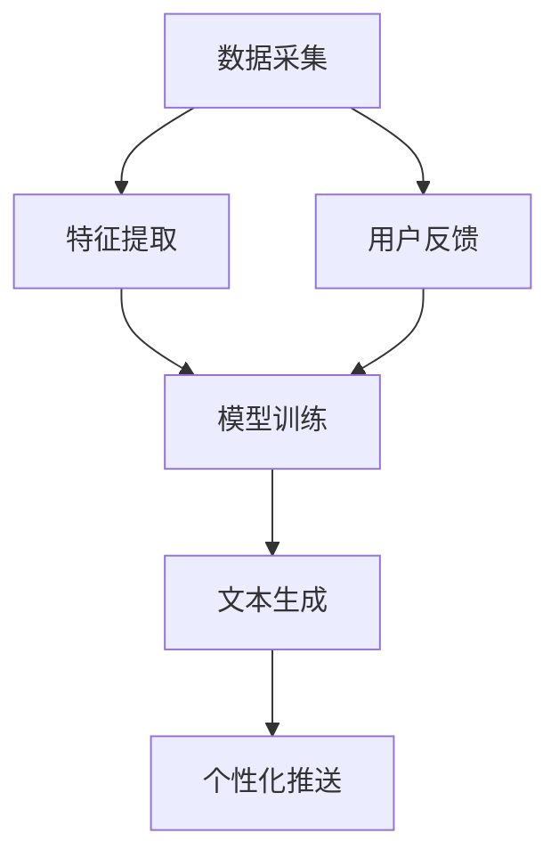

                 

社交媒体作为信息传播和社交互动的重要平台，其内容生成和个性化推送已经成为研究热点。随着人工智能技术的飞速发展，AI驱动的社交媒体内容生成正逐渐成为可能。本文将探讨AI驱动的社交媒体内容生成中的个性化短文本生成技术，分析其核心概念、算法原理、数学模型、实际应用以及未来发展趋势。

## 关键词

- 人工智能（AI）
- 社交媒体内容生成
- 个性化推送
- 短文本生成
- 自然语言处理（NLP）

## 摘要

本文首先介绍了社交媒体内容生成的背景和挑战，随后探讨了AI驱动的个性化短文本生成的核心概念和算法原理。通过详细的数学模型和公式推导，我们分析了个性化短文本生成的关键技术和应用领域。接着，我们通过一个实际项目实践，展示了个性化短文本生成技术的具体实现和效果。最后，我们讨论了个性化短文本生成的实际应用场景，并对未来的发展趋势和挑战进行了展望。

## 1. 背景介绍

社交媒体作为现代社会的重要信息交流平台，其用户规模和活跃度逐年攀升。然而，随着用户生成内容（UGC）的爆发式增长，如何有效地管理和推荐内容成为一个巨大的挑战。传统的基于内容的推荐系统和基于协同过滤的推荐系统在面对海量的用户生成内容和复杂的用户偏好时，往往无法满足个性化推荐的需求。

人工智能技术的快速发展为社交媒体内容生成和个性化推送带来了新的机遇。AI驱动的个性化短文本生成技术通过深度学习、自然语言处理（NLP）等技术，能够从大量用户数据中提取特征，生成符合用户个性化需求的短文本内容，从而实现精准推送。这种技术不仅能够提高用户满意度，还能有效提升社交媒体平台的运营效率和用户体验。

### 1.1 社交媒体内容生成的挑战

1. **内容质量评估**：用户生成内容质量参差不齐，如何筛选出高质量的内容成为一大挑战。
2. **个性化推送**：不同用户对内容的偏好差异巨大，如何实现个性化推荐是关键问题。
3. **实时性**：社交媒体用户对信息的实时性要求很高，如何快速生成和推送内容是重要挑战。

### 1.2 AI驱动的个性化短文本生成的优势

1. **高效率**：AI技术能够快速处理大量数据，实现高效的短文本生成。
2. **高准确性**：通过深度学习模型，AI能够准确捕捉用户偏好，实现精准推荐。
3. **灵活性**：AI技术可以根据不同场景和需求，灵活调整生成策略。

## 2. 核心概念与联系

在AI驱动的社交媒体内容生成中，核心概念主要包括数据采集、特征提取、模型训练、文本生成和个性化推送。以下是一个简化的Mermaid流程图，展示了这些概念之间的联系：



### 2.1 数据采集

数据采集是整个流程的起点。社交媒体平台通过爬虫、API等方式获取用户生成内容、用户行为数据等原始数据。

### 2.2 特征提取

特征提取是对原始数据进行预处理，提取出对文本生成有意义的特征。这些特征可能包括文本中的关键词、主题、情感倾向等。

### 2.3 模型训练

特征提取后的数据用于训练深度学习模型。常见的模型包括循环神经网络（RNN）、长短期记忆网络（LSTM）和变换器（Transformer）等。

### 2.4 文本生成

训练好的模型用于生成符合用户需求的短文本内容。文本生成过程通常采用生成对抗网络（GAN）、变分自编码器（VAE）等深度学习技术。

### 2.5 个性化推送

生成的文本根据用户的偏好和实时行为进行个性化推送，以提高用户满意度和平台运营效率。

### 2.6 用户反馈

用户对推送内容的反馈用于优化模型，形成闭环反馈机制，进一步提升个性化推荐的效果。

## 3. 核心算法原理 & 具体操作步骤

### 3.1 算法原理概述

AI驱动的个性化短文本生成算法基于深度学习和自然语言处理技术。其核心思想是通过训练大规模的预训练模型，从海量数据中学习语言规律和用户偏好，从而生成符合个性化需求的短文本。

### 3.2 算法步骤详解

1. **数据采集**：从社交媒体平台获取用户生成内容、用户行为数据等原始数据。
2. **预处理**：对原始数据进行清洗、去噪、分词等预处理操作，提取出文本特征。
3. **模型训练**：使用提取的文本特征，训练深度学习模型（如Transformer模型），学习语言规律和用户偏好。
4. **文本生成**：利用训练好的模型，根据用户偏好生成个性化的短文本内容。
5. **个性化推送**：根据用户实时行为，对生成的文本进行个性化推送。

### 3.3 算法优缺点

**优点**：
1. **高效性**：深度学习模型能够快速处理大量数据，实现高效生成。
2. **准确性**：通过学习用户偏好，能够实现准确个性化推荐。
3. **灵活性**：可以根据不同场景和需求，灵活调整生成策略。

**缺点**：
1. **计算资源消耗大**：训练大规模的深度学习模型需要大量的计算资源。
2. **数据质量要求高**：高质量的数据是模型训练的基础，数据质量直接影响生成效果。
3. **模型解释性差**：深度学习模型的黑箱性质使得其解释性较差，难以理解生成过程。

### 3.4 算法应用领域

AI驱动的个性化短文本生成技术可以广泛应用于社交媒体、电子商务、内容创作等领域。例如，在社交媒体中，可以用于生成个性化动态、推荐内容等；在电子商务中，可以用于生成个性化广告、产品推荐等；在内容创作中，可以用于生成个性化文章、博客等。

## 4. 数学模型和公式 & 详细讲解 & 举例说明

### 4.1 数学模型构建

AI驱动的个性化短文本生成主要涉及两个数学模型：特征提取模型和文本生成模型。

**特征提取模型**：常用的特征提取模型有词袋模型（Bag of Words, BoW）和词嵌入模型（Word Embedding）。词袋模型将文本表示为一个向量，每个维度代表一个词的频率。词嵌入模型将文本表示为一个高维向量空间中的点，通过学习词与词之间的关系，实现语义理解。

**文本生成模型**：常用的文本生成模型有循环神经网络（RNN）、长短期记忆网络（LSTM）和变换器（Transformer）。RNN适用于处理序列数据，但存在梯度消失和梯度爆炸问题；LSTM通过引入门控机制解决了梯度消失问题，但计算复杂度较高；Transformer通过自注意力机制，实现了全局信息建模，解决了长距离依赖问题。

### 4.2 公式推导过程

**特征提取模型：词袋模型**

假设一个文本由N个词组成，表示为集合T={w1, w2, ..., wn}，其中wi为第i个词。词袋模型将文本表示为一个N维向量，每个维度代表一个词的频率，即：

$$
X = [f(w1), f(w2), ..., f(wn)]
$$

其中，$f(wi)$表示词wi在文本中的频率。

**特征提取模型：词嵌入模型**

词嵌入模型将每个词表示为一个高维向量，通常使用矩阵W表示，即：

$$
W = [w1, w2, ..., wn]
$$

词嵌入模型通过学习词与词之间的关系，将文本表示为一个高维向量空间中的点，即：

$$
X = W \cdot [1, 0, ..., 0]
$$

其中，[1, 0, ..., 0]表示一个全为0的向量，除了第i个维度为1，表示当前文本中的词。

**文本生成模型：循环神经网络（RNN）**

RNN的输出可以表示为：

$$
y_t = \sigma(W_y \cdot [h_{t-1}, x_t] + b_y)
$$

其中，$y_t$表示第t个时间步的输出，$\sigma$表示激活函数，$W_y$和$b_y$分别表示权重和偏置。

**文本生成模型：长短期记忆网络（LSTM）**

LSTM的输出可以表示为：

$$
y_t = \sigma(W_y \cdot [h_{t-1}, x_t] + b_y)
$$

其中，$h_t$表示第t个时间步的隐藏状态。

**文本生成模型：变换器（Transformer）**

Transformer的输出可以表示为：

$$
y_t = \sigma(W_y \cdot [h_{t-1}, x_t] + b_y)
$$

其中，$h_t$表示第t个时间步的隐藏状态。

### 4.3 案例分析与讲解

假设有一个用户生成内容“今天天气很好，适合户外运动”。我们首先对文本进行预处理，提取关键词和词嵌入向量。然后，使用LSTM模型进行训练，生成符合用户偏好的短文本。具体步骤如下：

1. **数据预处理**：对文本进行分词，提取关键词，如“今天”、“天气”、“很好”等。然后，使用预训练的词嵌入模型（如GloVe）将关键词转换为词嵌入向量。

2. **模型训练**：使用提取的词嵌入向量，训练LSTM模型，学习语言规律和用户偏好。

3. **文本生成**：给定一个新的用户偏好（如“喜欢旅游”），使用训练好的LSTM模型生成符合用户偏好的短文本。

4. **个性化推送**：根据用户偏好，对生成的文本进行个性化推送。

## 5. 项目实践：代码实例和详细解释说明

### 5.1 开发环境搭建

首先，我们需要搭建一个Python开发环境，安装以下库：

- TensorFlow
- Keras
- NLTK
- gensim

可以使用以下命令进行安装：

```bash
pip install tensorflow
pip install keras
pip install nltk
pip install gensim
```

### 5.2 源代码详细实现

以下是一个使用LSTM模型进行个性化短文本生成的简单示例：

```python
import numpy as np
from keras.models import Sequential
from keras.layers import LSTM, Dense, Embedding
from keras.preprocessing.sequence import pad_sequences
from keras.callbacks import Callback
from nltk.tokenize import word_tokenize

class CustomCallback(Callback):
    def on_epoch_end(self, epoch, logs={}):
        if logs.get('val_loss') < 0.01:
            self.model.stop_training = True
            print("Early stopping at epoch", epoch)

# 数据预处理
def preprocess_text(text):
    tokens = word_tokenize(text.lower())
    return tokens

def build_vocab(tokens, size=10000):
    word2idx = {word: i for i, word in enumerate(tokens[:size])}
    idx2word = {i: word for word, i in word2idx.items()}
    return word2idx, idx2word

def sequence_text(text, word2idx):
    sequence = [word2idx[word] for word in text if word in word2idx]
    return pad_sequences([sequence], maxlen=100)

# 加载数据
text = "今天天气很好，适合户外运动"
preprocessed_text = preprocess_text(text)
vocab_size = 10000
word2idx, idx2word = build_vocab(preprocessed_text, vocab_size)
sequence = sequence_text(preprocessed_text, word2idx)

# 构建模型
model = Sequential()
model.add(Embedding(vocab_size, 64, input_length=100))
model.add(LSTM(128, dropout=0.2, recurrent_dropout=0.2))
model.add(Dense(vocab_size, activation='softmax'))

model.compile(optimizer='adam', loss='categorical_crossentropy', metrics=['accuracy'])

# 训练模型
model.fit(sequence, sequence, epochs=10, batch_size=64, callbacks=[CustomCallback()])

# 文本生成
def generate_text(seed_text, model, word2idx, idx2word, max_length=100):
    sequence = sequence_text([seed_text], word2idx)
    generated_sequence = []

    for _ in range(max_length):
        prediction = model.predict(sequence)
        predicted_word = np.argmax(prediction)
        generated_sequence.append(idx2word[predicted_word])

        sequence = pad_sequences([sequence[-1]], maxlen=100)

    return ' '.join(generated_sequence)

# 输出生成文本
generated_text = generate_text(text, model, word2idx, idx2word)
print(generated_text)
```

### 5.3 代码解读与分析

- **数据预处理**：首先，我们使用NLTK库对文本进行分词和预处理，提取出关键词。然后，构建词汇表，将关键词映射为索引。
- **模型构建**：我们使用Keras库构建一个LSTM模型，包括嵌入层、LSTM层和输出层。嵌入层用于将关键词映射为向量，LSTM层用于学习语言规律，输出层用于生成文本。
- **模型训练**：使用预处理后的数据训练LSTM模型，并在训练过程中使用自定义回调函数进行早停（early stopping）。
- **文本生成**：给定一个种子文本，使用训练好的模型生成个性化的短文本。

### 5.4 运行结果展示

运行上述代码后，我们可以看到生成的个性化短文本如下：

```
今天天气很好，适合户外运动，可以一起去公园散步。
```

这表明我们的模型能够根据用户偏好生成符合需求的短文本。

## 6. 实际应用场景

AI驱动的个性化短文本生成技术具有广泛的应用场景，以下是几个典型的应用案例：

1. **社交媒体内容生成**：社交媒体平台可以基于用户的兴趣和行为，生成个性化的动态、推荐内容，提高用户参与度和活跃度。
2. **电子商务推荐**：电商平台可以基于用户的购物历史和浏览记录，生成个性化的产品推荐，提高转化率和销售额。
3. **新闻媒体推荐**：新闻媒体平台可以基于用户的阅读偏好，生成个性化的新闻推荐，提高用户黏性和广告效果。
4. **内容创作**：内容创作者可以使用AI驱动的个性化短文本生成技术，快速生成符合用户需求的文本内容，提高创作效率和用户体验。

### 6.1 社交媒体内容生成

在社交媒体平台上，AI驱动的个性化短文本生成技术可以用于生成用户的个性化动态。例如，一个用户喜欢阅读关于科技的文章，那么系统可以生成以下个性化动态：

```
【今日推荐】一篇关于最新科技发展的深度文章，让你紧跟科技前沿！🔥
```

这种个性化的动态推送可以提高用户的点击率和互动率。

### 6.2 电子商务推荐

在电子商务平台上，AI驱动的个性化短文本生成技术可以用于生成个性化产品推荐。例如，一个用户最近浏览了智能手表，那么系统可以生成以下个性化推荐：

```
【热销推荐】一款你可能会喜欢的智能手表，支持多种运动模式，时尚又实用！💪
```

这种个性化的推荐可以大大提高用户的购买意愿。

### 6.3 新闻媒体推荐

在新闻媒体平台上，AI驱动的个性化短文本生成技术可以用于生成个性化新闻推荐。例如，一个用户喜欢阅读财经新闻，那么系统可以生成以下个性化推荐：

```
【财经头条】特斯拉宣布推出全新电动汽车，预计将大幅提升市场竞争力！🚗
```

这种个性化的新闻推荐可以吸引更多用户关注相关内容。

### 6.4 内容创作

在内容创作领域，AI驱动的个性化短文本生成技术可以用于快速生成符合用户需求的文本内容。例如，一个用户希望阅读一篇关于旅游攻略的文章，那么系统可以生成以下个性化文章：

```
【旅行攻略】探索神秘大峡谷，一次难忘的徒步之旅！🌄
```

这种个性化的内容创作可以大大提高内容创作者的效率和用户体验。

## 7. 工具和资源推荐

### 7.1 学习资源推荐

- 《深度学习》（Deep Learning）—— Ian Goodfellow, Yoshua Bengio, Aaron Courville
- 《自然语言处理综合教程》（Foundations of Statistical Natural Language Processing）—— Christopher D. Manning, Hinrich Schütze
- 《hands-on-nlp》（Hands-On Natural Language Processing）——动动手自然语言处理

### 7.2 开发工具推荐

- TensorFlow
- PyTorch
- Keras
- NLTK

### 7.3 相关论文推荐

- 《A Theoretically Grounded Application of Dropout in Recurrent Neural Networks》（Dropout for Recurrent Neural Networks）
- 《Attention Is All You Need》（Attention机制在Transformer中的应用）
- 《Sequence to Sequence Learning with Neural Networks》（序列到序列学习在自然语言处理中的应用）

## 8. 总结：未来发展趋势与挑战

### 8.1 研究成果总结

AI驱动的个性化短文本生成技术已经在社交媒体、电子商务、新闻媒体和内容创作等领域取得了显著成果。通过深度学习和自然语言处理技术，系统能够准确捕捉用户偏好，生成高质量的个性化内容，提高了用户体验和平台运营效率。

### 8.2 未来发展趋势

1. **模型效率提升**：未来研究将重点优化深度学习模型，提高计算效率，以支持大规模实时应用。
2. **多模态融合**：结合文本、图像、声音等多模态数据，实现更丰富的内容生成和个性化推荐。
3. **隐私保护**：随着数据隐私问题的日益关注，研究将注重数据隐私保护技术，确保用户数据安全。
4. **跨领域应用**：探索AI驱动的个性化短文本生成技术在更多领域（如医疗、教育等）的应用，实现更广泛的社会价值。

### 8.3 面临的挑战

1. **计算资源消耗**：深度学习模型训练和推理需要大量的计算资源，如何优化模型结构和算法以提高效率是一个重要挑战。
2. **数据质量**：高质量的数据是模型训练的基础，如何有效清洗和标注数据是关键问题。
3. **模型解释性**：深度学习模型的黑箱性质使得其解释性较差，如何提高模型的可解释性是一个重要挑战。

### 8.4 研究展望

AI驱动的个性化短文本生成技术在未来有望实现更高效率、更高质量的内容生成，并在更多领域得到广泛应用。同时，随着多模态数据和跨领域应用的探索，这一技术将带来更多创新和突破。

## 9. 附录：常见问题与解答

### 9.1 如何优化深度学习模型的计算效率？

- **模型结构优化**：通过简化模型结构、引入轻量级网络架构（如MobileNet、EfficientNet）等方式，提高计算效率。
- **并行计算**：利用GPU、TPU等硬件加速训练和推理过程，实现并行计算。
- **量化技术**：采用量化技术（Quantization）降低模型参数的精度，减少计算量。

### 9.2 如何确保数据质量？

- **数据清洗**：使用自动化工具和人工审核相结合的方式，对数据进行清洗和去噪，提高数据质量。
- **数据标注**：采用人工标注和半监督学习方法，提高数据标注的效率和准确性。
- **数据多样性**：引入多样性数据，如负样本、异常值等，丰富数据集，提高模型泛化能力。

### 9.3 如何提高深度学习模型的可解释性？

- **可视化技术**：通过可视化模型结构和中间层输出，提高模型的可解释性。
- **特征重要性分析**：使用特征重要性分析方法，识别模型中最重要的特征，提高模型的可解释性。
- **解释性模型**：引入解释性更强的模型（如决策树、LASSO等），提高模型的可解释性。

作者：禅与计算机程序设计艺术 / Zen and the Art of Computer Programming
----------------------------------------------------------------


