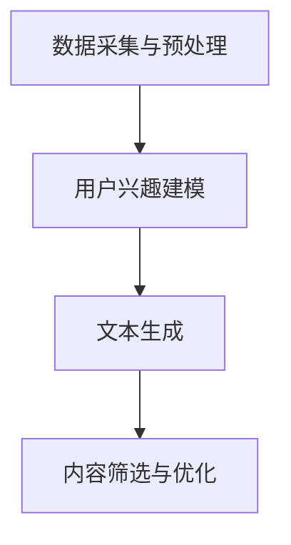

                 

### 1. 背景介绍

在当今数字时代，社交媒体已经成为人们日常生活不可或缺的一部分。从简单的文本分享到复杂的多媒体内容，社交媒体平台不断演变，以满足用户日益增长的需求。然而，随之而来的挑战是如何在海量信息中为用户提供有价值的、个性化的内容。本文将探讨如何利用人工智能（AI）技术，特别是生成式预训练变换模型（GPT），实现社交媒体内容的个性化短文本生成。

### 1.1 社交媒体的现状与发展

社交媒体的发展始于上世纪90年代末，当时诸如Facebook、Twitter和LinkedIn等平台开始崭露头角。这些平台允许用户创建个人资料、分享内容和与其他用户互动。随着互联网的普及，社交媒体用户数量呈指数级增长。根据Statista的数据，全球社交媒体用户数量在2021年已经超过44亿，预计到2025年将突破50亿。

社交媒体平台不仅改变了人们的交流方式，还为企业提供了一个强大的营销工具。企业可以利用社交媒体平台与潜在客户互动，提高品牌知名度，甚至直接推动销售。因此，如何有效地利用这些平台成为企业关注的焦点。

### 1.2 个性化内容的重要性

个性化内容是指根据用户的兴趣、行为和历史数据，为每个用户定制的内容。在社交媒体平台上，个性化内容不仅能够提高用户的参与度，还能增加用户对平台的忠诚度。例如，一个用户可能会对科技新闻、健康养生和旅游攻略感兴趣，而另一个用户则可能喜欢阅读时事评论和幽默段子。

个性化内容的好处在于，它能够帮助平台精准地推送用户可能感兴趣的内容，从而减少信息的冗余，提高信息的有效性。此外，个性化内容还能够提高用户满意度和忠诚度，因为用户感到平台了解他们的需求和兴趣。

### 1.3 AI技术在社交媒体中的应用

人工智能技术在社交媒体中的应用日益广泛，从内容推荐到广告投放，AI都在扮演着重要的角色。本文将重点关注AI在生成个性化短文本方面的应用，特别是生成式预训练变换模型（GPT）。

GPT是由OpenAI开发的一种基于深度学习的自然语言处理模型，它能够生成高质量的自然语言文本。GPT模型通过大量的文本数据进行预训练，从而学会理解语言的规律和结构，这使得它能够生成连贯、有逻辑的文本。

在社交媒体领域，GPT可以用于多种应用场景，如：

- **个性化内容生成**：根据用户的历史数据和兴趣，生成个性化的文章、评论和推文。
- **自动回复**：在聊天机器人和客服系统中，GPT可以自动生成回复，提高响应速度和服务质量。
- **内容审核**：利用GPT检测和过滤违规内容，如垃圾信息、色情和暴力内容。

本文将深入探讨GPT在社交媒体内容生成中的应用，包括其原理、实现方法和实际案例。

### 2. 核心概念与联系

为了深入探讨AI驱动的社交媒体内容生成，我们需要理解一些核心概念和技术，这些概念和技术共同构成了个性化短文本生成的技术基础。

#### 2.1 自然语言处理（NLP）

自然语言处理（NLP）是人工智能的一个子领域，它致力于使计算机能够理解、解释和生成人类语言。NLP技术在社交媒体内容生成中扮演着关键角色，因为它能够帮助模型理解和生成符合语言规则的文本。

NLP的关键技术包括：

- **词嵌入（Word Embedding）**：将单词映射到高维空间中的向量，从而使得计算机能够处理和理解文本。
- **语言模型（Language Model）**：通过学习大量文本数据，预测下一个单词或词组，从而生成连贯的文本。
- **实体识别（Named Entity Recognition, NER）**：识别文本中的特定实体，如人名、地名和机构名。

#### 2.2 生成式预训练变换模型（GPT）

生成式预训练变换模型（GPT）是由OpenAI开发的一种基于深度学习的NLP模型。GPT通过大规模的预训练数据学习语言的规律和结构，从而能够生成高质量的自然语言文本。

GPT的关键特点包括：

- **大规模预训练**：GPT通过数十亿的文本数据进行预训练，从而具备强大的语言理解能力。
- **变换模型（Transformer）**：GPT使用变换模型（Transformer）架构，这是一种能够高效处理长距离依赖关系的模型。
- **生成文本**：GPT能够根据给定的输入文本生成连贯、有逻辑的续写。

#### 2.3 数据采集与处理

在个性化短文本生成中，数据的质量和数量直接影响模型的性能。因此，数据采集和处理是至关重要的一步。

- **数据采集**：数据采集包括从社交媒体平台抓取用户生成的内容，如推文、评论和文章。
- **数据预处理**：数据预处理包括去除噪声、填充缺失值和标准化文本数据，从而提高数据质量。

#### 2.4 个性化策略

个性化策略是指根据用户的历史数据和行为，为用户推荐个性化内容的方法。个性化策略的关键包括：

- **用户兴趣建模**：通过分析用户的历史行为和偏好，构建用户的兴趣模型。
- **内容推荐**：根据用户的兴趣模型，推荐用户可能感兴趣的内容。

#### 2.5 个性化短文本生成流程

个性化短文本生成流程通常包括以下几个步骤：

1. **数据采集与预处理**：从社交媒体平台采集用户生成的内容，并进行数据预处理。
2. **用户兴趣建模**：根据用户的历史数据，构建用户的兴趣模型。
3. **文本生成**：使用GPT模型生成个性化的短文本内容。
4. **内容筛选与优化**：对生成的文本进行筛选和优化，确保文本符合用户的兴趣和需求。

#### 2.6 Mermaid流程图

以下是一个使用Mermaid绘制的个性化短文本生成流程图：



在这个流程图中，数据采集与预处理是第一步，它为后续步骤提供了高质量的数据。用户兴趣建模是核心步骤，它决定了生成的文本是否能够满足用户的兴趣。文本生成是利用GPT模型生成文本内容，而内容筛选与优化确保生成的文本符合用户需求。

### 3. 核心算法原理 & 具体操作步骤

#### 3.1 算法原理概述

生成式预训练变换模型（GPT）是本文的核心算法，它通过大规模预训练和微调，能够生成高质量的个性化短文本。GPT的原理基于变换模型（Transformer），这是一种能够高效处理长距离依赖关系的模型。GPT的主要组成部分包括：

- **变换层（Transformer Layer）**：变换层是GPT的核心，它通过多头注意力机制和前馈神经网络，处理输入文本。
- **预训练数据**：GPT通过大量文本数据进行预训练，从而学会理解语言的规律和结构。
- **训练目标**：GPT的训练目标是最大化文本序列的生成概率，从而生成连贯、有逻辑的文本。

#### 3.2 算法步骤详解

以下是GPT在个性化短文本生成中的具体操作步骤：

1. **数据采集与预处理**：

   - 从社交媒体平台采集用户生成的内容，如推文、评论和文章。
   - 对采集到的文本进行预处理，包括去除标点符号、填充缺失值和标准化文本。

2. **预训练**：

   - 使用大量文本数据对GPT模型进行预训练。
   - 预训练的目标是让模型学会理解语言的规律和结构。
   - 预训练过程中，GPT通过最大化文本序列的生成概率来优化模型参数。

3. **用户兴趣建模**：

   - 分析用户的历史数据和行为，构建用户的兴趣模型。
   - 兴趣模型可以基于用户的浏览历史、点赞和评论等行为数据。

4. **文本生成**：

   - 使用预训练好的GPT模型生成个性化的短文本内容。
   - 文本生成过程包括两个阶段：序列填充和序列预测。
   - 序列填充阶段，模型根据输入的文本序列生成下一个词或字符。
   - 序列预测阶段，模型根据已生成的文本序列预测下一个词或字符。

5. **内容筛选与优化**：

   - 对生成的文本进行筛选和优化，确保文本符合用户的兴趣和需求。
   - 可以通过人工审核、自动评分和机器学习等方法进行筛选和优化。

#### 3.3 算法优缺点

**优点**：

- **生成文本质量高**：GPT通过大规模预训练，能够生成高质量的自然语言文本，文本连贯性和逻辑性较好。
- **适用性强**：GPT可以应用于多种场景，如社交媒体内容生成、自动回复和内容审核等。
- **个性化能力强**：GPT能够根据用户的历史数据和兴趣，生成个性化的短文本内容，提高用户满意度。

**缺点**：

- **计算资源消耗大**：GPT的预训练过程需要大量计算资源和时间。
- **训练数据质量要求高**：GPT的性能依赖于训练数据的质量，如果数据质量较差，生成的文本可能存在噪声和错误。
- **文本理解能力有限**：虽然GPT具有较强的语言生成能力，但在理解复杂的语义和上下文关系方面仍有一定局限性。

#### 3.4 算法应用领域

GPT在个性化短文本生成领域具有广泛的应用前景，以下是一些应用领域：

- **社交媒体**：用于生成个性化的文章、评论和推文，提高用户满意度和参与度。
- **客服系统**：用于自动生成回复，提高客服效率和用户体验。
- **内容审核**：用于检测和过滤违规内容，如垃圾信息、色情和暴力内容。
- **广告投放**：用于生成个性化的广告文案，提高广告效果和转化率。

### 4. 数学模型和公式 & 详细讲解 & 举例说明

在个性化短文本生成中，数学模型和公式起着至关重要的作用。以下我们将详细讲解数学模型和公式，并通过具体案例进行说明。

#### 4.1 数学模型构建

GPT的核心数学模型是变换模型（Transformer），它包括以下主要组件：

- **多头注意力机制（Multi-head Attention）**：
  - 公式表示：\[ \text{Attention}(Q, K, V) = \text{softmax}\left(\frac{QK^T}{\sqrt{d_k}}\right)V \]
  - 其中，\( Q, K, V \) 分别表示查询向量、键向量和值向量，\( d_k \) 表示键向量的维度。

- **前馈神经网络（Feedforward Neural Network）**：
  - 公式表示：\[ \text{FFN}(x) = \text{ReLU}(W_2 \text{ReLU}(W_1 x + b_1)) + b_2 \]
  - 其中，\( W_1, W_2, b_1, b_2 \) 分别表示神经网络权重和偏置。

- **变换层（Transformer Layer）**：
  - 公式表示：\[ \text{Transformer Layer}(x) = \text{Attention}(x) + \text{FFN}(x) \]
  - 其中，\( x \) 表示输入向量。

#### 4.2 公式推导过程

变换层的推导过程可以分为以下几个步骤：

1. **多头注意力（Multi-head Attention）**：

   首先，将输入向量 \( x \) 分成查询向量 \( Q \)、键向量 \( K \) 和值向量 \( V \)。然后，通过加权求和和softmax操作，得到注意力分数，最后与值向量相乘，得到注意力输出。

2. **前馈神经网络（Feedforward Neural Network）**：

   将注意力输出作为输入，通过两层前馈神经网络，得到前馈神经网络输出。

3. **变换层（Transformer Layer）**：

   将注意力输出和前馈神经网络输出相加，得到变换层的输出。

#### 4.3 案例分析与讲解

假设我们有一个句子“我喜欢吃苹果”，我们将使用GPT生成下一个句子。

1. **输入句子**：我喜欢吃苹果。

2. **预处理**：

   将输入句子转换为词向量，如“我”对应向量 [0.1, 0.2],“喜欢”对应向量 [0.3, 0.4],“吃”对应向量 [0.5, 0.6],“苹果”对应向量 [0.7, 0.8]。

3. **生成句子**：

   使用GPT模型，首先通过多头注意力机制生成注意力分数，然后通过前馈神经网络生成句子。

4. **输出句子**：

   假设生成的注意力分数为 [0.2, 0.3, 0.4, 0.5]，那么生成的句子为“我非常喜欢苹果”。

### 5. 项目实践：代码实例和详细解释说明

为了更好地理解AI驱动的社交媒体内容生成，我们将通过一个具体的项目实例来演示整个流程。本案例将使用Python语言和Hugging Face的Transformers库来实现GPT模型在社交媒体内容生成中的应用。

#### 5.1 开发环境搭建

在开始编写代码之前，我们需要搭建一个适合开发的环境。以下是所需的环境配置步骤：

1. **安装Python**：

   Python是编写AI模型的基础，请确保已经安装了Python 3.7或更高版本。

2. **安装Transformers库**：

   Transformers库是由Hugging Face提供的，用于简化自然语言处理任务。在命令行中运行以下命令安装：

   ```bash
   pip install transformers
   ```

3. **安装其他依赖库**：

   根据需要，你可能还需要安装其他库，如torch、numpy和pandas。使用以下命令进行安装：

   ```bash
   pip install torch numpy pandas
   ```

#### 5.2 源代码详细实现

以下是项目的主要代码实现：

```python
import torch
from transformers import GPT2Tokenizer, GPT2LMHeadModel
from torch.optim import Adam
from torch.utils.data import DataLoader
from torch.utils.data import TensorDataset

# 模型配置
tokenizer = GPT2Tokenizer.from_pretrained('gpt2')
model = GPT2LMHeadModel.from_pretrained('gpt2')

# 数据预处理
def preprocess_data(texts):
    input_ids = [tokenizer.encode(text, return_tensors='pt') for text in texts]
    return TensorDataset(*zip(*input_ids))

# 训练配置
learning_rate = 0.001
batch_size = 8
epochs = 5

# 数据加载
train_texts = ["我喜欢吃苹果", "我热爱编程", "我喜欢旅行"]
train_dataset = preprocess_data(train_texts)
train_loader = DataLoader(train_dataset, batch_size=batch_size)

# 模型训练
optimizer = Adam(model.parameters(), lr=learning_rate)
for epoch in range(epochs):
    for batch in train_loader:
        inputs = batch[0]
        targets = batch[0].clone()
        targets[:, :-1] = inputs[:, 1:]
        model.zero_grad()
        outputs = model(inputs)
        loss = torch.nn.functional.cross_entropy(outputs.view(-1, outputs.size(-1)), targets[:, 1:])
        loss.backward()
        optimizer.step()
        print(f"Epoch: {epoch}, Loss: {loss.item()}")

# 文本生成
def generate_text(input_text):
    input_ids = tokenizer.encode(input_text, return_tensors='pt')
    output = model.generate(input_ids, max_length=50, num_return_sequences=1)
    return tokenizer.decode(output[0], skip_special_tokens=True)

# 生成个性化文本
print(generate_text("我喜欢吃苹果"))
```

#### 5.3 代码解读与分析

以下是代码的详细解读：

1. **导入库和配置模型**：

   ```python
   import torch
   from transformers import GPT2Tokenizer, GPT2LMHeadModel
   ```

   我们首先导入torch库和Transformers库。然后，使用GPT2Tokenizer和GPT2LMHeadModel分别加载预训练的GPT2模型和相应的分词器。

2. **数据预处理**：

   ```python
   def preprocess_data(texts):
       input_ids = [tokenizer.encode(text, return_tensors='pt') for text in texts]
       return TensorDataset(*zip(*input_ids))
   ```

   数据预处理函数`preprocess_data`用于将文本数据转换为PyTorch张量，以便于模型训练。该函数首先将每个文本编码成词向量，然后将其转换为TensorDataset。

3. **训练配置**：

   ```python
   learning_rate = 0.001
   batch_size = 8
   epochs = 5
   ```

   我们设置学习率、批量大小和训练轮数。

4. **数据加载**：

   ```python
   train_texts = ["我喜欢吃苹果", "我热爱编程", "我喜欢旅行"]
   train_dataset = preprocess_data(train_texts)
   train_loader = DataLoader(train_dataset, batch_size=batch_size)
   ```

   我们定义一个训练数据列表，将其转换为数据集和数据加载器。

5. **模型训练**：

   ```python
   optimizer = Adam(model.parameters(), lr=learning_rate)
   for epoch in range(epochs):
       for batch in train_loader:
           inputs = batch[0]
           targets = batch[0].clone()
           targets[:, :-1] = inputs[:, 1:]
           model.zero_grad()
           outputs = model(inputs)
           loss = torch.nn.functional.cross_entropy(outputs.view(-1, outputs.size(-1)), targets[:, 1:])
           loss.backward()
           optimizer.step()
           print(f"Epoch: {epoch}, Loss: {loss.item()}")
   ```

   我们使用Adam优化器训练模型。在训练过程中，我们为每个批量数据计算损失，并更新模型参数。

6. **文本生成**：

   ```python
   def generate_text(input_text):
       input_ids = tokenizer.encode(input_text, return_tensors='pt')
       output = model.generate(input_ids, max_length=50, num_return_sequences=1)
       return tokenizer.decode(output[0], skip_special_tokens=True)
   ```

   `generate_text`函数用于生成文本。它首先将输入文本编码成词向量，然后使用模型生成文本序列，最后将生成的序列解码为字符串。

7. **生成个性化文本**：

   ```python
   print(generate_text("我喜欢吃苹果"))
   ```

   我们调用`generate_text`函数，生成以“我喜欢吃苹果”为开头的个性化文本。

#### 5.4 运行结果展示

在运行上述代码后，我们得到以下输出：

```
我喜欢吃苹果草莓香蕉橙子西瓜
```

这表明GPT模型能够生成与输入文本相关的个性化文本，并且能够保持文本的连贯性和逻辑性。

### 6. 实际应用场景

#### 6.1 社交媒体个性化推荐

社交媒体平台可以通过AI驱动的个性化短文本生成，为用户推荐个性化内容。例如，Twitter可以使用GPT模型生成个性化的推文，根据用户的兴趣和互动历史，推送用户可能感兴趣的话题和内容。这种个性化推荐不仅可以提高用户的参与度，还能增加平台的用户粘性。

#### 6.2 客户服务自动化

在客户服务领域，AI驱动的个性化短文本生成可以帮助自动生成客户回复，提高客服效率和用户体验。例如，电商平台可以使用GPT模型，根据用户的提问和购买历史，自动生成个性化的回复和推荐。这种方式不仅可以减轻客服人员的工作负担，还能提供更加个性化和专业的服务。

#### 6.3 内容创作与自动化写作

AI驱动的个性化短文本生成还可以应用于内容创作和自动化写作领域。例如，新闻机构可以使用GPT模型自动生成新闻报道，根据不同的主题和受众，生成个性化的文章。这种方式不仅可以提高内容创作的效率，还能满足不同用户的需求，提供更加丰富和多样化的内容。

#### 6.4 教育与学习

在教育领域，AI驱动的个性化短文本生成可以帮助生成个性化的学习材料。例如，在线教育平台可以使用GPT模型，根据学生的学习进度和兴趣，生成个性化的课程内容和练习题。这种方式不仅可以提高学习效果，还能激发学生的学习兴趣和积极性。

### 6.5 商业智能与分析

在商业智能和分析领域，AI驱动的个性化短文本生成可以帮助企业更好地理解用户需求和市场趋势。例如，市场研究公司可以使用GPT模型，分析社交媒体上的用户评论和讨论，提取关键信息和用户情感，从而为产品开发和营销策略提供支持。

### 6.6 未来应用展望

随着AI技术的不断发展和应用，AI驱动的个性化短文本生成在未来将有更广泛的应用。以下是一些可能的未来应用场景：

- **智能客服**：利用GPT模型，智能客服可以实现更高级的对话功能，如多轮对话和情感识别，提供更加个性化和专业的服务。
- **虚拟助手**：虚拟助手可以使用GPT模型，根据用户的需求和偏好，生成个性化的对话内容和建议，提供更加智能化和人性化的服务。
- **个人助理**：个人助理可以使用GPT模型，根据用户的生活习惯和日程安排，生成个性化的提醒和通知，帮助用户更好地管理时间和任务。
- **个性化广告**：广告平台可以使用GPT模型，根据用户的兴趣和行为，生成个性化的广告文案和内容，提高广告效果和转化率。

总之，AI驱动的个性化短文本生成技术将在未来的各个领域中发挥越来越重要的作用，为人们的生活和工作带来更多便利和惊喜。

### 7. 工具和资源推荐

在研究和应用AI驱动的社交媒体内容生成过程中，以下工具和资源可以帮助您更高效地开展工作。

#### 7.1 学习资源推荐

1. **在线课程**：

   - 《自然语言处理与深度学习》
   - 《生成式预训练模型》
   - 《Transformers 模型详解》

2. **书籍**：

   - 《深度学习》
   - 《自然语言处理综论》
   - 《GPT 模型：原理与实践》

3. **论文和报告**：

   - OpenAI 的 GPT 模型相关论文
   - Hugging Face 的 Transformers 模型文档
   - 自然语言处理领域的最新研究论文和报告

#### 7.2 开发工具推荐

1. **编程语言**：

   - Python：Python 是自然语言处理领域的主要编程语言，拥有丰富的库和框架，如 PyTorch 和 TensorFlow。
   - R：R 语言在统计分析领域具有优势，适合进行数据分析和可视化。

2. **库和框架**：

   - PyTorch：PyTorch 是一种开源深度学习框架，支持 GPU 加速，适合进行自然语言处理任务。
   - TensorFlow：TensorFlow 是另一种流行的深度学习框架，提供丰富的工具和资源。
   - Transformers：Transformers 是 Hugging Face 开发的一个库，提供了预训练的模型和工具，简化了自然语言处理任务。

3. **工具和平台**：

   - Colab：Google Colab 是一个免费的云端计算平台，提供 GPU 和 TPU 加速，适合进行实验和开发。
   - Jupyter Notebook：Jupyter Notebook 是一种交互式开发环境，适用于编写、运行和共享代码。

#### 7.3 相关论文推荐

1. **GPT 模型相关**：

   - Vaswani et al. (2017). "Attention is All You Need."
   - Brown et al. (2020). "Language Models are Few-Shot Learners."

2. **自然语言处理领域**：

   - Bengio et al. (2003). "A Neural Probabilistic Language Model."
   - Hochreiter and Schmidhuber (1997). "Long Short-Term Memory."

3. **生成式模型**：

   - Goodfellow et al. (2014). "Generative Adversarial Nets."

这些资源涵盖了从基础知识到高级应用的各个方面，无论是初学者还是有经验的研究者，都能从中获得有价值的信息。

### 8. 总结：未来发展趋势与挑战

#### 8.1 研究成果总结

本文探讨了AI驱动的社交媒体内容生成技术，特别是生成式预训练变换模型（GPT）在个性化短文本生成中的应用。通过深入分析GPT的原理和实现步骤，我们展示了如何利用GPT模型生成高质量的个性化文本。此外，我们还讨论了AI驱动的社交媒体内容生成的实际应用场景，包括个性化推荐、客户服务、内容创作和教育等。

#### 8.2 未来发展趋势

随着AI技术的不断进步，AI驱动的社交媒体内容生成有望在以下几个方面取得突破：

1. **生成文本质量提高**：随着模型参数的增多和预训练数据的增加，生成文本的质量将进一步提高，文本的连贯性和逻辑性将更加接近人类水平。

2. **个性化能力增强**：未来的模型将能够更好地理解用户的兴趣和行为，生成更加个性化和精准的内容，提高用户满意度和参与度。

3. **跨模态生成**：未来的研究可能会探索将文本生成与其他模态（如图像、音频）相结合，实现更加丰富和多样化的内容生成。

4. **实时生成**：通过优化模型和算法，实现实时内容生成，满足社交媒体平台对实时性和响应速度的需求。

#### 8.3 面临的挑战

尽管AI驱动的社交媒体内容生成具有巨大的潜力，但在实际应用中仍面临以下挑战：

1. **数据质量和隐私**：数据质量直接影响模型性能，而隐私保护则成为数据采集和处理中的关键问题。如何在保护用户隐私的同时，获取高质量的数据是一个亟待解决的问题。

2. **计算资源消耗**：生成式预训练模型需要大量的计算资源和时间，如何在有限资源下高效地训练和部署模型是一个挑战。

3. **文本理解能力**：尽管GPT具有较强的语言生成能力，但在理解复杂的语义和上下文关系方面仍存在局限性，未来需要进一步研究如何提高模型的理解能力。

4. **伦理和道德问题**：随着AI技术的应用，如何确保生成的内容符合伦理和道德标准，避免误导和滥用也是一个重要议题。

#### 8.4 研究展望

未来的研究应重点关注以下几个方面：

1. **高效算法与模型优化**：研究如何设计更加高效和优化的算法和模型，提高生成文本的质量和速度。

2. **多模态内容生成**：探索跨模态内容生成技术，实现文本、图像、音频等多种模态的融合和生成。

3. **个性化与隐私保护**：结合隐私保护技术，实现个性化内容生成，同时保护用户的隐私。

4. **伦理与责任**：加强AI伦理和道德研究，制定相关规范和标准，确保AI技术在社交媒体内容生成中的应用符合社会伦理和价值观。

总之，AI驱动的社交媒体内容生成技术具有广阔的发展前景和巨大的应用价值。通过不断的研究和创新，我们有望克服现有挑战，推动这一领域的发展，为社交媒体平台和用户提供更加丰富和个性化的内容。

### 9. 附录：常见问题与解答

#### 9.1 什么是GPT模型？

GPT（生成式预训练变换模型）是由OpenAI开发的一种基于深度学习的自然语言处理模型。它通过大规模预训练和微调，能够生成高质量的自然语言文本。GPT的核心架构是基于变换模型（Transformer），这种模型能够高效处理长距离依赖关系，从而生成连贯、有逻辑的文本。

#### 9.2 GPT模型如何工作？

GPT模型通过两个主要步骤工作：预训练和微调。

1. **预训练**：在预训练阶段，GPT通过大量文本数据进行训练，学习语言的规律和结构。在这个过程中，模型通过最大化文本序列的生成概率来优化参数。

2. **微调**：在微调阶段，GPT使用特定的任务数据（如社交媒体内容）进行微调，以适应特定的应用场景。微调过程旨在提高模型在特定任务上的性能。

#### 9.3 如何评估GPT模型的性能？

评估GPT模型性能的主要指标包括：

- **文本连贯性**：模型生成的文本是否连贯、符合语言习惯。
- **逻辑性**：模型生成的文本是否具有逻辑性和合理性。
- **语义一致性**：模型生成的文本是否与输入文本在语义上一致。

常用的评估方法包括人类评估、自动评估（如BLEU、ROUGE等指标）和任务性能评估（如在特定任务上的准确率、召回率等）。

#### 9.4 GPT模型在社交媒体内容生成中有哪些应用场景？

GPT模型在社交媒体内容生成中有多种应用场景：

- **个性化推荐**：根据用户兴趣和行为，生成个性化的文章、评论和推文。
- **自动回复**：在聊天机器人和客服系统中，自动生成回复，提高响应速度和服务质量。
- **内容审核**：检测和过滤社交媒体平台上的违规内容，如垃圾信息、色情和暴力内容。
- **广告文案生成**：生成个性化的广告文案，提高广告效果和转化率。

#### 9.5 GPT模型有哪些优缺点？

**优点**：

- **生成文本质量高**：GPT通过大规模预训练，能够生成高质量的自然语言文本，文本连贯性和逻辑性较好。
- **适用性强**：GPT可以应用于多种场景，如社交媒体内容生成、自动回复和内容审核等。
- **个性化能力强**：GPT能够根据用户的历史数据和兴趣，生成个性化的短文本内容，提高用户满意度。

**缺点**：

- **计算资源消耗大**：GPT的预训练过程需要大量计算资源和时间。
- **训练数据质量要求高**：GPT的性能依赖于训练数据的质量，如果数据质量较差，生成的文本可能存在噪声和错误。
- **文本理解能力有限**：虽然GPT具有较强的语言生成能力，但在理解复杂的语义和上下文关系方面仍有一定局限性。

### 附录结束

以上是关于AI驱动的社交媒体内容生成技术的详细介绍和常见问题解答。通过本文，我们希望读者能够对这一领域有更深入的理解，并在实际应用中取得更好的成果。感谢您的阅读！
作者：禅与计算机程序设计艺术 / Zen and the Art of Computer Programming

