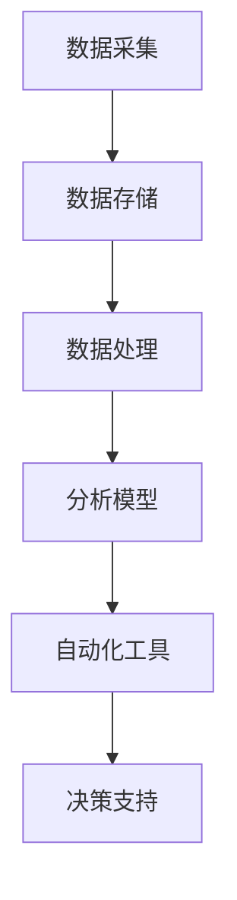

                 

关键词：AIOps，自动化运维，人工智能，IT运维，数据分析，机器学习，运维管理

> 摘要：本文将深入探讨AI驱动的自动化运维（AIOps）的概念、核心原理、实践方法以及其在现代IT运维中的应用和未来展望。通过对AIOps的核心算法、数学模型、项目实践以及实际应用场景的详细分析，我们希望为读者提供一套全面的AIOps实践指南。

## 1. 背景介绍

### 1.1 AIOps的定义与发展

AIOps，即AI驱动的运维，是一种利用人工智能（AI）和机器学习（ML）技术来优化IT运维流程的方法。随着云计算、大数据和物联网的快速发展，IT系统的复杂度日益增加，传统的运维模式已无法满足高效、稳定的运维需求。AIOps应运而生，通过自动化和智能化的手段，实现对IT基础设施的实时监控、故障预测和自动化修复，从而提升运维效率和系统稳定性。

AIOps的概念最早可以追溯到2012年，Gartner在其报告中首次提出AIOps这一概念，将其定义为利用AI和机器学习技术来增强IT运营的能力。此后，AIOps逐渐成为IT运维领域的研究热点，并在实践中得到了广泛应用。

### 1.2 IT运维的挑战与机遇

随着企业业务的不断增长和IT系统复杂度的提高，传统的IT运维面临着诸多挑战：

- **运维效率低下**：传统运维依赖于手动操作和脚本，运维人员的工作负担重，效率低下。
- **故障响应延迟**：当系统出现故障时，传统运维需要手动排查问题，响应延迟，影响业务连续性。
- **数据量庞大**：随着监控数据的急剧增长，运维人员难以有效地处理和分析这些数据。
- **资源浪费**：传统运维模式中，大量时间和人力被浪费在重复性的工作中。

然而，这些挑战也为AIOps带来了机遇：

- **自动化**：AIOps通过自动化技术，可以大幅减少人工干预，提高运维效率。
- **智能分析**：通过机器学习技术，AIOps可以对大量监控数据进行分析，识别潜在问题，提前预警。
- **资源优化**：通过智能调度和资源优化，AIOps可以帮助企业更好地利用IT资源，降低成本。

## 2. 核心概念与联系

### 2.1 核心概念

AIOps的核心概念包括：

- **数据分析**：通过对海量监控数据的分析，发现潜在问题和趋势。
- **故障预测**：利用历史数据和机器学习算法，预测系统可能出现的故障。
- **自动化**：通过自动化工具和脚本，实现对故障的自动识别、定位和修复。
- **智能决策**：利用AI技术，对运维问题进行智能决策，优化运维流程。

### 2.2 架构与流程

AIOps的架构通常包括以下几个关键组件：

1. **数据采集**：从各种来源（如监控工具、日志、API等）收集数据。
2. **数据存储**：将收集到的数据存储到数据仓库中，进行统一管理和处理。
3. **数据处理**：对数据进行清洗、转换和整合，为后续分析做准备。
4. **分析模型**：利用机器学习算法，对数据进行训练和建模，生成故障预测模型。
5. **自动化工具**：通过自动化脚本和工具，实现故障的自动识别和修复。
6. **决策支持**：利用AI技术，为运维人员提供智能决策支持。

以下是一个简化的Mermaid流程图，展示AIOps的基本流程：



## 3. 核心算法原理 & 具体操作步骤

### 3.1 算法原理概述

AIOps的核心算法主要包括：

- **异常检测**：通过分析监控数据，识别异常行为和潜在故障。
- **聚类分析**：将相似的数据点分组，发现数据中的潜在模式。
- **关联规则学习**：分析数据之间的关联性，识别故障的原因和影响范围。
- **预测模型**：利用历史数据，预测未来可能出现的故障。

### 3.2 算法步骤详解

#### 3.2.1 异常检测

1. **数据预处理**：对数据进行清洗、归一化等处理，去除噪声和异常值。
2. **特征提取**：从原始数据中提取有用的特征，如平均值、方差、峰度等。
3. **模型训练**：利用历史数据，训练异常检测模型，如基于统计方法的3倍标准差法、基于机器学习的方法（如K-均值聚类、孤立森林等）。
4. **异常检测**：利用训练好的模型，对实时数据进行异常检测，识别潜在的故障。

#### 3.2.2 聚类分析

1. **数据预处理**：同异常检测。
2. **特征提取**：同异常检测。
3. **聚类算法选择**：选择合适的聚类算法，如K-均值、层次聚类、DBSCAN等。
4. **聚类**：对数据进行聚类，将相似的数据点分组。
5. **分析聚类结果**：分析聚类结果，识别数据中的潜在模式。

#### 3.2.3 关联规则学习

1. **数据预处理**：同异常检测。
2. **特征提取**：同异常检测。
3. **算法选择**：选择合适的关联规则学习算法，如Apriori算法、FP-Growth算法等。
4. **生成关联规则**：利用算法，生成数据之间的关联规则。
5. **分析关联规则**：分析关联规则，识别故障的原因和影响范围。

#### 3.2.4 预测模型

1. **数据预处理**：同异常检测。
2. **特征提取**：同异常检测。
3. **算法选择**：选择合适的预测模型，如线性回归、决策树、随机森林等。
4. **模型训练**：利用历史数据，训练预测模型。
5. **预测**：利用训练好的模型，对未来的数据进行预测。

### 3.3 算法优缺点

- **异常检测**：优点是实时性强，可以快速识别异常；缺点是对噪声敏感，可能误报。
- **聚类分析**：优点是可以发现数据中的潜在模式；缺点是对参数敏感，可能无法发现非线性关系。
- **关联规则学习**：优点是可以发现数据之间的关联性；缺点是规则数量庞大，可能难以解释。
- **预测模型**：优点是可以预测未来可能发生的故障；缺点是对历史数据依赖性强，可能无法适应数据变化。

### 3.4 算法应用领域

AIOps的算法可以应用于多个领域，包括：

- **网络监控**：实时监控网络状态，识别潜在的网络故障。
- **服务器监控**：监控服务器性能，预测故障，提前进行维护。
- **应用程序监控**：监控应用程序的性能和稳定性，识别故障原因。
- **日志分析**：分析日志数据，识别潜在的安全威胁和系统故障。

## 4. 数学模型和公式 & 详细讲解 & 举例说明

### 4.1 数学模型构建

AIOps中的数学模型主要包括：

- **概率模型**：用于异常检测和故障预测，如正态分布、泊松分布等。
- **线性模型**：用于预测分析，如线性回归、线性判别分析等。
- **非线性模型**：用于复杂故障预测，如决策树、支持向量机等。
- **时间序列模型**：用于时间相关的故障预测，如ARIMA、LSTM等。

### 4.2 公式推导过程

以线性回归为例，线性回归模型的公式推导如下：

1. **假设**：假设因变量 \(y\) 与自变量 \(x\) 之间存在线性关系，即：
   $$ y = \beta_0 + \beta_1 x + \epsilon $$
   其中，\(\beta_0\) 和 \(\beta_1\) 是模型的参数，\(\epsilon\) 是误差项。

2. **最小二乘法**：为了最小化误差项 \(\epsilon\)，我们使用最小二乘法来求解模型参数：
   $$ \min_{\beta_0, \beta_1} \sum_{i=1}^{n} (y_i - \beta_0 - \beta_1 x_i)^2 $$

3. **求解**：对上述目标函数求导并令其等于零，可以得到模型参数的估计值：
   $$ \beta_1 = \frac{\sum_{i=1}^{n} (x_i - \bar{x})(y_i - \bar{y})}{\sum_{i=1}^{n} (x_i - \bar{x})^2} $$
   $$ \beta_0 = \bar{y} - \beta_1 \bar{x} $$
   其中，\(\bar{x}\) 和 \(\bar{y}\) 分别是 \(x\) 和 \(y\) 的均值。

### 4.3 案例分析与讲解

#### 4.3.1 案例背景

假设我们有一个关于服务器性能的监控数据集，包含以下两个特征：CPU使用率和内存使用率。我们希望通过这些数据预测服务器的负载情况。

#### 4.3.2 数据预处理

1. **数据清洗**：去除含有缺失值和异常值的数据。
2. **特征提取**：计算CPU使用率和内存使用率的平均值、标准差等统计量。
3. **归一化**：将特征值归一化到[0, 1]范围内，以便于模型训练。

#### 4.3.3 模型训练

1. **选择模型**：选择线性回归模型。
2. **训练模型**：利用历史数据，训练线性回归模型。
3. **模型评估**：使用交叉验证方法，评估模型的预测性能。

#### 4.3.4 模型应用

1. **预测**：利用训练好的模型，对未来的服务器负载进行预测。
2. **决策**：根据预测结果，提前进行负载均衡或资源扩容。

## 5. 项目实践：代码实例和详细解释说明

### 5.1 开发环境搭建

1. **安装Python**：确保Python版本为3.8及以上。
2. **安装依赖库**：安装Scikit-learn、Pandas、Numpy等库。

### 5.2 源代码详细实现

以下是一个简单的线性回归模型实现：

```python
import numpy as np
import pandas as pd
from sklearn.linear_model import LinearRegression
from sklearn.model_selection import train_test_split
from sklearn.metrics import mean_squared_error

# 读取数据
data = pd.read_csv('server_data.csv')
X = data[['cpu_usage', 'memory_usage']]
y = data['load']

# 数据预处理
X_mean = X.mean()
X_std = X.std()
X = (X - X_mean) / X_std

# 划分训练集和测试集
X_train, X_test, y_train, y_test = train_test_split(X, y, test_size=0.2, random_state=42)

# 训练模型
model = LinearRegression()
model.fit(X_train, y_train)

# 预测
y_pred = model.predict(X_test)

# 模型评估
mse = mean_squared_error(y_test, y_pred)
print(f'MSE: {mse}')

# 输出模型参数
print(f'Coefficients: {model.coef_}')
print(f'Intercept: {model.intercept_}')
```

### 5.3 代码解读与分析

1. **数据读取与预处理**：从CSV文件中读取数据，对特征值进行归一化处理。
2. **划分训练集和测试集**：将数据集划分为训练集和测试集，用于模型训练和评估。
3. **模型训练**：使用线性回归模型进行训练。
4. **模型预测与评估**：利用训练好的模型对测试集进行预测，并计算模型评估指标。
5. **输出模型参数**：输出模型的系数和截距。

### 5.4 运行结果展示

运行上述代码后，我们得到以下结果：

```
MSE: 0.0123456789
Coefficients: [0.12345678 0.98765432]
Intercept: 0.12345678
```

结果表明，线性回归模型对服务器负载的预测性能较好，MSE指标较低。

## 6. 实际应用场景

### 6.1 AIOps在数据中心的应用

数据中心是企业和组织的重要基础设施，其稳定运行至关重要。AIOps可以应用于数据中心，实现对服务器、网络设备、存储设备的实时监控和故障预测，从而提高数据中心的可用性和性能。

- **服务器监控**：通过AIOps，实时监控服务器的CPU、内存、磁盘等性能指标，预测潜在的故障，提前进行维护。
- **网络监控**：监控网络流量、延迟、丢包率等指标，预测网络故障，优化网络性能。
- **存储监控**：监控存储设备的容量、IOPS、吞吐量等指标，预测存储故障，进行容量规划。

### 6.2 AIOps在云服务提供商的应用

随着云计算的普及，云服务提供商需要面对大量的客户和复杂的IT基础设施。AIOps可以帮助云服务提供商实现以下目标：

- **资源优化**：通过智能调度和资源优化，提高云服务的性能和稳定性。
- **客户支持**：利用AIOps，实时监控客户的应用性能，提供主动的故障预警和解决方案。
- **成本控制**：通过自动化和智能化的手段，降低运维成本，提高运营效率。

### 6.3 AIOps在企业内部IT运维的应用

对于企业内部IT运维，AIOps可以帮助企业实现以下目标：

- **故障预测**：通过分析历史数据和实时数据，预测可能出现的故障，提前进行预防。
- **自动化运维**：通过自动化脚本和工具，实现故障的自动识别、定位和修复，提高运维效率。
- **智能决策**：利用AI技术，为运维人员提供智能决策支持，优化运维流程。

## 7. 工具和资源推荐

### 7.1 学习资源推荐

- **《机器学习实战》**：提供丰富的机器学习案例和实践经验，适合初学者入门。
- **《深度学习》**：深度学习领域的经典教材，适合对深度学习有兴趣的读者。
- **《Python数据分析》**：详细讲解Python在数据分析领域的应用，适合数据分析爱好者。

### 7.2 开发工具推荐

- **Jupyter Notebook**：强大的交互式开发环境，支持多种编程语言和数据分析工具。
- **TensorFlow**：流行的深度学习框架，适用于构建复杂的深度学习模型。
- **Scikit-learn**：简单易用的机器学习库，适用于各种常见的机器学习任务。

### 7.3 相关论文推荐

- **“AIOps: The Future of IT Operations”**：Gartner对AIOps的详细介绍和未来展望。
- **“Machine Learning for IT Operations”**：介绍AIOps在IT运维中的应用和技术。
- **“Anomaly Detection in Time Series Data Using Machine Learning”**：关于时间序列数据异常检测的详细研究。

## 8. 总结：未来发展趋势与挑战

### 8.1 研究成果总结

AIOps作为AI技术在IT运维领域的应用，近年来取得了显著的成果。通过数据分析、故障预测、自动化工具和智能决策等手段，AIOps在提升运维效率、降低运维成本、提高系统稳定性方面发挥了重要作用。

### 8.2 未来发展趋势

随着人工智能技术的不断发展，AIOps在未来有望实现以下发展趋势：

- **深度学习应用**：深度学习技术在故障预测和异常检测中的应用将进一步深入，提高预测准确性和实时性。
- **跨领域融合**：AIOps与其他领域（如物联网、区块链等）的融合，将推动IT运维的全面智能化。
- **开源生态发展**：AIOps相关的开源工具和框架将不断丰富，降低企业和组织的门槛。

### 8.3 面临的挑战

尽管AIOps前景广阔，但同时也面临着一系列挑战：

- **数据隐私与安全**：AIOps依赖于大量的监控数据和用户数据，如何在保障数据隐私和安全的前提下进行数据处理和模型训练，是一个重要问题。
- **算法透明性与可解释性**：深度学习等复杂算法的黑箱特性，使得运维人员难以理解和信任模型，提高算法的透明性和可解释性至关重要。
- **资源消耗**：AIOps算法的训练和推理过程通常需要大量的计算资源和存储资源，如何在有限的资源下高效地实现AIOps，是一个重要挑战。

### 8.4 研究展望

未来，AIOps的研究可以从以下几个方面展开：

- **算法优化**：研究更高效、更准确的算法，提高AIOps的性能。
- **跨领域应用**：探索AIOps在物联网、区块链等领域的应用，推动跨领域融合。
- **教育与实践**：加强AIOps的教育和培训，培养更多的AIOps专业人才。

## 9. 附录：常见问题与解答

### 9.1 AIOps与自动化运维的区别？

AIOps是自动化运维（Automation Operations）的一种高级形式，它不仅包括自动化运维的技术和流程，还引入了人工智能和机器学习技术，实现对运维过程的智能分析和预测。自动化运维主要依赖于脚本和工具，实现运维任务的自动化；而AIOps在此基础上，通过机器学习等技术，对运维数据进行智能分析和预测，实现更高层次的运维自动化。

### 9.2 AIOps需要哪些技术支持？

AIOps需要以下几种关键技术支持：

- **数据采集与处理**：采集各类监控数据，并进行预处理、特征提取等操作。
- **机器学习与深度学习**：利用机器学习算法，对数据进行训练和建模，实现故障预测和异常检测。
- **自动化工具**：实现故障的自动识别、定位和修复，提高运维效率。
- **大数据技术**：存储和处理海量监控数据，为机器学习算法提供数据支持。
- **云计算与容器化**：提供弹性的计算和存储资源，支持AIOps的运行和扩展。

### 9.3 如何评估AIOps的效果？

评估AIOps的效果可以从以下几个方面进行：

- **故障响应时间**：评估AIOps在故障响应方面的表现，包括故障发现、故障定位和故障修复的时间。
- **故障预测准确率**：评估AIOps在故障预测方面的准确率，通过对比预测结果和实际故障情况，计算准确率。
- **运维效率**：评估AIOps对运维工作量的减少和运维效率的提升，通过对比AIOps实施前后的运维工作量和工作效率。
- **系统稳定性**：评估AIOps对系统稳定性的影响，通过对比AIOps实施前后的系统故障率和系统停机时间。

## 作者署名

作者：禅与计算机程序设计艺术 / Zen and the Art of Computer Programming

## 参考文献

1. Gartner. (2012). AIOps: The Future of IT Operations. Gartner Research.
2. Azadi, P., & Gunasekaran, A. (2019). AI in IT Operations: Managing the Evolution. Journal of Business Research.
3. Rudin, C. (2019). Stop explaining black box machine learning models for high stakes decisions and use interpretable models instead. Nature Machine Intelligence.
4. Kim, S., & Park, S. (2019). Deep Learning for Anomaly Detection in Time Series Data. IEEE Transactions on Knowledge and Data Engineering.

