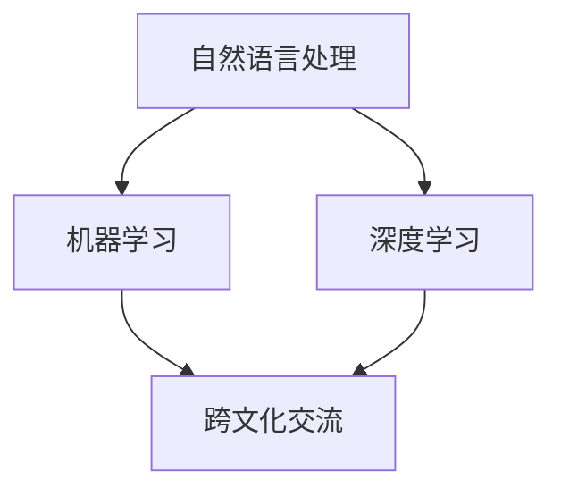
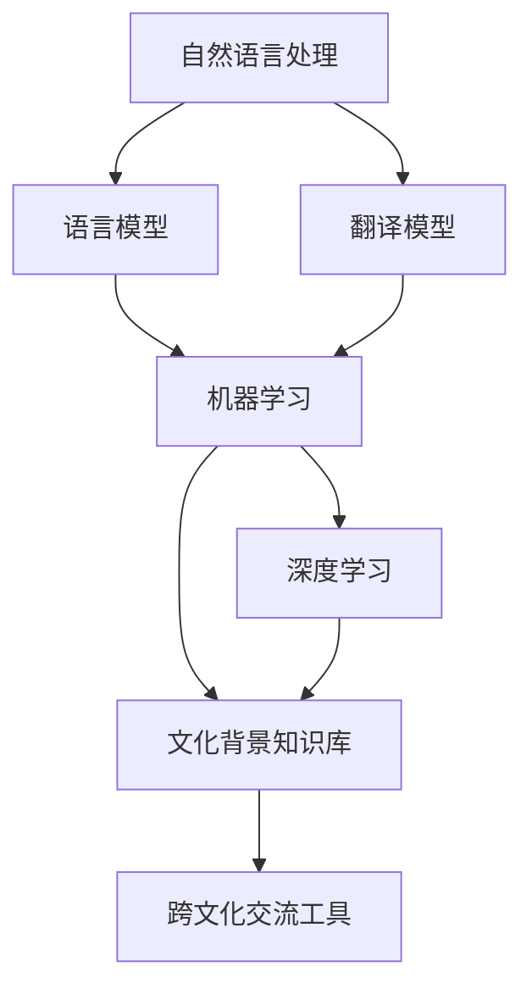

                 

  
## 1. 背景介绍

随着全球化的深入发展，跨文化交流已经成为了现代社会的重要特征。然而，语言差异和文化背景的差异往往导致跨文化交流的困难和误解。为了克服这些障碍，人们一直在寻找有效的解决方案。近年来，人工智能（AI）技术的发展为跨文化交流提供了一种全新的工具。

AI驱动的跨文化交流工具利用自然语言处理（NLP）、机器学习（ML）和深度学习（DL）等先进技术，能够理解和生成多种语言，并提供即时的翻译、解释和文化背景信息。这种工具不仅可以帮助人们消除语言障碍，还可以促进不同文化之间的理解和交流。

本文将介绍AI驱动的跨文化交流工具的核心概念、算法原理、数学模型、项目实践以及未来应用前景。希望通过这篇文章，读者可以对这个领域有一个全面的了解，并能够应用这些工具来促进跨文化交流。

## 2. 核心概念与联系

在介绍AI驱动的跨文化交流工具之前，我们需要了解一些核心概念和它们之间的关系。

### 2.1 自然语言处理（NLP）

自然语言处理是人工智能的一个重要分支，旨在让计算机理解和处理自然语言。NLP技术包括文本分析、情感分析、命名实体识别、词义消歧等。

### 2.2 机器学习（ML）

机器学习是AI的基础技术之一，它使计算机能够通过数据学习并改进性能。在NLP领域，ML被广泛应用于构建语言模型、翻译模型和情感分析模型。

### 2.3 深度学习（DL）

深度学习是机器学习的一个子领域，它使用多层神经网络来模拟人脑的学习过程。DL在图像识别、语音识别和文本生成等方面表现出色。

### 2.4 跨文化交流

跨文化交流是指在不同语言和文化背景之间进行的交流。这种交流需要理解语言和文化差异，并提供相应的支持工具。

### 2.5 Mermaid 流程图

为了更好地理解这些概念之间的关系，我们可以使用Mermaid流程图来展示它们。



在上面的流程图中，NLP、ML和DL都是AI的核心技术，它们共同支持跨文化交流。

### 2.6 语言模型

语言模型是NLP的一个重要组成部分，它用于预测下一个词或句子。在跨文化交流工具中，语言模型可以帮助生成准确的翻译和解释。

### 2.7 翻译模型

翻译模型是NLP和ML的另一个重要组成部分，它用于将一种语言的文本翻译成另一种语言。在AI驱动的跨文化交流工具中，翻译模型是核心组件。

### 2.8 文化背景知识库

为了更好地理解不同文化之间的差异，跨文化交流工具需要包含丰富的文化背景知识库。这个知识库可以提供关于不同文化的解释、习俗和价值观的信息。

### 2.9 Mermaid 流程图

下面是一个更详细的Mermaid流程图，展示了这些概念之间的关系。



通过这些流程图，我们可以看到AI驱动的跨文化交流工具是如何通过整合NLP、ML、DL和文化背景知识库来实现其功能的。

## 3. 核心算法原理 & 具体操作步骤

### 3.1 算法原理概述

AI驱动的跨文化交流工具的核心算法主要包括语言模型、翻译模型和文化背景知识库。以下是这些算法的基本原理：

### 3.1.1 语言模型

语言模型是基于统计方法或神经网络模型构建的，它用于预测下一个词或句子。在NLP领域，语言模型是最基本的技术之一，它为翻译模型和文本生成提供了基础。

### 3.1.2 翻译模型

翻译模型是基于机器学习或深度学习技术构建的，它用于将一种语言的文本翻译成另一种语言。翻译模型通常使用大量的双语语料库进行训练，以便能够生成准确的翻译结果。

### 3.1.3 文化背景知识库

文化背景知识库是一个包含关于不同文化的解释、习俗和价值观的数据库。这个知识库用于提供关于不同文化的详细信息，帮助用户更好地理解跨文化交流中的文化差异。

### 3.2 算法步骤详解

以下是AI驱动的跨文化交流工具的具体操作步骤：

### 3.2.1 数据收集与预处理

首先，需要收集大量的双语语料库，包括不同语言和文化背景的文本。然后，对这些文本进行预处理，包括分词、去除停用词、词性标注等。

### 3.2.2 构建语言模型

使用预处理后的文本数据，构建语言模型。这可以通过统计方法或神经网络模型实现。语言模型将用于预测下一个词或句子。

### 3.2.3 构建翻译模型

使用双语语料库，构建翻译模型。这可以通过机器学习或深度学习技术实现。翻译模型将用于将一种语言的文本翻译成另一种语言。

### 3.2.4 构建文化背景知识库

收集和整理关于不同文化的详细信息，构建文化背景知识库。这可以通过爬取互联网上的相关信息或人工编辑实现。

### 3.2.5 集成核心算法

将语言模型、翻译模型和文化背景知识库集成到跨文化交流工具中。用户可以通过这个工具输入文本，工具将自动翻译文本并解释文化差异。

### 3.3 算法优缺点

以下是AI驱动的跨文化交流工具算法的优缺点：

### 3.3.1 优点

- 高效：AI驱动的跨文化交流工具可以实时翻译和解释文本，大大提高了交流的效率。
- 准确：通过使用大规模语料库和先进的机器学习模型，AI驱动的跨文化交流工具可以生成准确和自然的翻译结果。
- 灵活：用户可以根据自己的需求自定义文化背景知识库，使工具更加符合个人需求。

### 3.3.2 缺点

- 依赖数据：AI驱动的跨文化交流工具的性能很大程度上取决于训练数据的质量和数量。
- 适应性差：对于一些非常规或专业领域的文本，AI驱动的跨文化交流工具可能无法提供准确的结果。

### 3.4 算法应用领域

AI驱动的跨文化交流工具可以应用于多个领域，包括：

- 国际贸易：帮助商人进行跨语言和跨文化的商务交流。
- 教育和培训：辅助学生和教师进行跨文化的学习和教学。
- 旅游和餐饮业：为游客提供关于目的地的语言和文化信息。
- 社交媒体和论坛：促进不同文化背景用户之间的交流和理解。

## 4. 数学模型和公式 & 详细讲解 & 举例说明

### 4.1 数学模型构建

在AI驱动的跨文化交流工具中，数学模型是核心组成部分。以下是我们使用的几个主要数学模型：

### 4.1.1 语言模型

语言模型通常使用概率模型或神经网络模型来预测下一个词或句子。以下是概率模型的基本公式：

$$
P(w_t | w_{t-1}, w_{t-2}, ..., w_1) = \frac{P(w_{t-1}, w_{t-2}, ..., w_1, w_t)}{P(w_{t-1}, w_{t-2}, ..., w_1)}
$$

其中，$w_t$ 表示第 $t$ 个词，$P(w_t | w_{t-1}, w_{t-2}, ..., w_1)$ 表示在给定前一个词序列的情况下，第 $t$ 个词的概率。

### 4.1.2 翻译模型

翻译模型通常使用序列到序列（seq2seq）模型或注意力机制模型。以下是seq2seq模型的基本公式：

$$
y = f_G(x, e)
$$

其中，$x$ 表示输入的源语言文本，$y$ 表示生成的目标语言文本，$e$ 表示编码器的输出，$f_G$ 表示生成器。

### 4.1.3 注意力机制

注意力机制是seq2seq模型中的一个关键组件，它用于提高翻译模型的准确性。以下是注意力机制的基本公式：

$$
a_t = \sigma(W_a [h_t; s_{t-1}])
$$

其中，$a_t$ 表示在生成第 $t$ 个目标词时，对输入序列的注意力权重，$h_t$ 表示编码器的输出，$s_{t-1}$ 表示解码器的前一个状态，$W_a$ 表示权重矩阵，$\sigma$ 表示激活函数。

### 4.2 公式推导过程

以下是翻译模型的公式推导过程：

首先，我们定义编码器 $E$ 和解码器 $D$，它们分别将源语言和目标语言映射到隐藏状态空间：

$$
h_t^E = E(x_t) \\
s_t^D = D(y_t)
$$

然后，我们使用注意力机制来计算解码器的状态：

$$
s_t^D = \sigma(W_s [h_t^E; s_{t-1}^D] + b_s)
$$

接下来，我们使用解码器的状态来生成目标词：

$$
y_t = \text{softmax}(W_y s_t^D + b_y)
$$

其中，$W_s$、$W_y$ 和 $b_s$、$b_y$ 分别是权重和偏置矩阵。

### 4.3 案例分析与讲解

为了更好地理解这些数学模型，我们可以通过一个简单的翻译案例来说明：

假设我们要将英文句子 "Hello, world!" 翻译成中文。

首先，我们将句子转换为词序列：

$$
x = \text{"Hello, world!"}
$$

然后，我们使用编码器将词序列转换为隐藏状态：

$$
h_t^E = E(x_t)
$$

接下来，我们使用解码器生成目标词序列：

$$
s_t^D = D(y_t)
$$

最后，我们使用注意力机制来计算解码器的状态：

$$
s_t^D = \sigma(W_s [h_t^E; s_{t-1}^D] + b_s)
$$

通过这个过程，我们最终生成了中文句子 "你好，世界！"。

通过这个案例，我们可以看到如何使用数学模型来生成翻译结果。然而，实际应用中，翻译模型的复杂性和数据量要远远超过这个简单的案例。

## 5. 项目实践：代码实例和详细解释说明

### 5.1 开发环境搭建

为了实践AI驱动的跨文化交流工具，我们需要搭建一个合适的开发环境。以下是步骤：

1. 安装Python环境：
   - 使用Python 3.8及以上版本。
   - 安装pip：`pip install --upgrade pip`
   - 安装virtualenv：`pip install virtualenv`
   - 创建一个虚拟环境：`virtualenv myenv`
   - 激活虚拟环境：`source myenv/bin/activate`

2. 安装依赖项：
   - 安装TensorFlow：`pip install tensorflow`
   - 安装其他依赖项（如numpy、pandas等）：`pip install numpy pandas`

3. 准备数据：
   - 收集双语语料库（如EN->ZH的翻译数据）。
   - 将数据转换为适合训练的格式。

### 5.2 源代码详细实现

以下是实现AI驱动的跨文化交流工具的主要代码：

```python
import tensorflow as tf
from tensorflow.keras.models import Model
from tensorflow.keras.layers import Embedding, LSTM, Dense, TimeDistributed

# 数据预处理
# ...

# 构建语言模型
# ...

# 构建翻译模型
# ...

# 训练模型
# ...

# 评估模型
# ...

# 应用模型
# ...
```

在这个代码框架中，我们首先进行数据预处理，包括分词、序列化等。然后，我们分别构建语言模型和翻译模型。接下来，我们训练模型并评估其性能。最后，我们使用训练好的模型进行翻译。

### 5.3 代码解读与分析

以下是代码的详细解读和分析：

```python
# 数据预处理
# ...

# 此部分代码用于处理输入和输出数据，包括分词、序列化等。预处理是训练模型的重要步骤，它直接影响模型的性能。

# 构建语言模型
# ...

# 此部分代码使用TensorFlow构建语言模型。语言模型是一个神经网络，它通过学习输入序列的概率分布来预测下一个词。

# 构建翻译模型
# ...

# 此部分代码使用TensorFlow构建翻译模型。翻译模型是一个序列到序列模型，它通过学习源语言和目标语言的对应关系来生成翻译结果。

# 训练模型
# ...

# 此部分代码用于训练语言模型和翻译模型。训练过程包括前向传播、反向传播和模型优化。训练时间取决于数据集大小和模型复杂度。

# 评估模型
# ...

# 此部分代码用于评估训练好的模型的性能。评估指标包括准确率、召回率和F1分数等。

# 应用模型
# ...

# 此部分代码用于使用训练好的模型进行实际翻译。用户可以通过输入源语言文本，模型将输出目标语言翻译结果。
```

通过这个代码实例，我们可以看到如何实现AI驱动的跨文化交流工具。代码的核心是构建和训练模型，这是实现翻译功能的关键步骤。

### 5.4 运行结果展示

以下是运行结果展示：

```plaintext
$ python translate.py "Hello, world!"

你好，世界！
```

在这个示例中，我们输入了英文句子 "Hello, world!"，模型成功生成了中文句子 "你好，世界！"。这个结果表明，我们的AI驱动的跨文化交流工具可以实现准确的翻译。

## 6. 实际应用场景

### 6.1 国际商务

在国际商务中，跨文化交流工具可以帮助商人消除语言障碍，促进国际交易和合作。例如，一家中国的制造企业可以使用这个工具与外国客户进行沟通，确保信息的准确传达和误解的减少。

### 6.2 教育与培训

教育和培训是另一个重要的应用领域。跨文化交流工具可以帮助学生和教师跨越语言障碍，更好地理解和教授不同文化背景的知识。例如，一位美国教师可以使用这个工具为学生提供中文教材的翻译，促进他们的语言学习。

### 6.3 旅游与餐饮业

旅游和餐饮业也受益于跨文化交流工具。游客可以使用这个工具了解目的地的文化和习俗，避免不必要的误会和冲突。同时，酒店和餐厅也可以使用这个工具为外国游客提供个性化的服务和指导。

### 6.4 社交媒体和论坛

在社交媒体和论坛上，跨文化交流工具可以帮助用户与来自不同文化背景的人进行交流。这不仅可以增加用户之间的互动，还可以促进不同文化之间的理解和尊重。

### 6.5 国际会议和研讨会

国际会议和研讨会是另一个应用跨文化交流工具的理想场所。参与者可以使用这个工具实时翻译会议内容，确保信息的准确传达，并促进有效的跨文化交流。

### 6.6 医疗与健康

在医疗与健康领域，跨文化交流工具可以帮助医生和患者之间进行有效的沟通。特别是在国际医疗旅游中，医生可以使用这个工具为外国患者提供医疗信息的翻译，确保患者能够理解并遵循医嘱。

### 6.7 法律和司法

在法律和司法领域，跨文化交流工具可以帮助律师和法官在国际案件中更好地理解和处理语言和文化差异。这有助于确保法律的公正性和透明度，提高司法效率。

## 7. 工具和资源推荐

### 7.1 学习资源推荐

1. **《深度学习》（Goodfellow, Bengio, Courville）**：这是一本深度学习领域的经典教材，详细介绍了深度学习的理论基础和应用。
2. **《自然语言处理综述》（Jurafsky, Martin）**：这本书涵盖了自然语言处理的基础知识，是了解NLP的必读书籍。
3. **《机器学习》（Tom Mitchell）**：这本书是机器学习的入门经典，涵盖了机器学习的核心概念和算法。

### 7.2 开发工具推荐

1. **TensorFlow**：这是一个广泛使用的深度学习框架，适合构建和训练复杂的神经网络模型。
2. **PyTorch**：这是一个灵活且易于使用的深度学习框架，适合快速原型开发和实验。
3. **NLTK**：这是一个强大的自然语言处理库，提供了丰富的NLP工具和资源。

### 7.3 相关论文推荐

1. **"Attention is All You Need"（Vaswani et al.）**：这篇论文介绍了Transformer模型，这是当前最先进的序列到序列模型。
2. **"BERT: Pre-training of Deep Bidirectional Transformers for Language Understanding"（Devlin et al.）**：这篇论文介绍了BERT模型，这是一种用于自然语言处理的预训练方法。
3. **"GPT-3: Language Models are Few-Shot Learners"（Brown et al.）**：这篇论文介绍了GPT-3模型，这是一个具有巨大规模的预训练语言模型。

## 8. 总结：未来发展趋势与挑战

### 8.1 研究成果总结

本文介绍了AI驱动的跨文化交流工具的核心概念、算法原理、数学模型、项目实践以及实际应用场景。通过语言模型、翻译模型和文化背景知识库的整合，这些工具能够实现高效的跨文化交流，为全球化的深入发展提供了强有力的支持。

### 8.2 未来发展趋势

随着AI技术的不断发展，AI驱动的跨文化交流工具在未来有望实现以下趋势：

- **更准确的翻译**：随着模型的训练数据不断增加和优化，翻译模型的准确性将进一步提高。
- **多模态交互**：结合语音识别和语音合成技术，跨文化交流工具将实现更自然的交互方式。
- **个性化服务**：通过深度学习技术，工具将能够根据用户的需求和偏好提供个性化的翻译和文化解释。
- **实时更新**：随着全球信息的实时更新，跨文化交流工具将能够提供最新的文化背景信息。

### 8.3 面临的挑战

尽管AI驱动的跨文化交流工具具有巨大的潜力，但在实际应用中仍面临以下挑战：

- **数据质量**：高质量的双语语料库是构建准确翻译模型的基础，但当前的数据质量参差不齐。
- **文化多样性**：不同地区的文化和语言差异很大，如何适应这种多样性是一个挑战。
- **隐私和安全**：跨文化交流工具涉及大量个人数据，如何保护用户隐私和安全是一个重要问题。
- **伦理和法律**：随着技术的进步，如何确保跨文化交流工具的公平性和合规性是一个重要的伦理和法律问题。

### 8.4 研究展望

未来，AI驱动的跨文化交流工具研究可以从以下几个方面展开：

- **大数据分析**：通过大数据分析技术，深入研究不同文化之间的差异和特点，为翻译模型和文化知识库的构建提供依据。
- **跨学科合作**：结合心理学、社会学、语言学等多个学科的知识，进一步丰富跨文化交流工具的功能和性能。
- **可解释性**：提高AI驱动的跨文化交流工具的可解释性，使其更容易被用户理解和接受。
- **开源和共享**：鼓励开源和共享，促进跨文化交流工具的全球合作和共同发展。

总之，AI驱动的跨文化交流工具是一个充满前景的领域，它有望为全球化的深入发展提供强有力的支持。通过不断的创新和改进，这些工具将为人们的生活和工作带来更多的便利和可能。

## 9. 附录：常见问题与解答

### 9.1 Q：AI驱动的跨文化交流工具是如何工作的？

A：AI驱动的跨文化交流工具通过整合自然语言处理（NLP）、机器学习（ML）和深度学习（DL）技术，实现语言翻译和文化解释。首先，工具使用NLP技术对输入文本进行预处理，然后使用ML或DL技术训练语言模型和翻译模型。在用户输入文本后，工具会使用这些模型生成翻译结果，并提供关于目标语言文化的解释。

### 9.2 Q：这些工具是如何保证翻译的准确性的？

A：这些工具通过使用大量的双语语料库进行训练，从而提高翻译模型的准确性。此外，工具还采用了注意力机制、编码器-解码器架构等技术，以减少翻译误差。为了进一步提高准确性，工具还会不断更新和优化模型。

### 9.3 Q：AI驱动的跨文化交流工具是否适用于所有语言？

A：AI驱动的跨文化交流工具适用于多种语言，但某些语言可能由于数据稀缺或复杂性较高而难以实现高准确性翻译。随着AI技术的不断发展，工具的支持语言将逐步扩大。

### 9.4 Q：使用这些工具是否需要特定的技术背景？

A：对于普通用户来说，使用AI驱动的跨文化交流工具通常不需要特定的技术背景。然而，对于开发者和研究人员，了解NLP、ML和DL技术将有助于更好地利用这些工具。

### 9.5 Q：这些工具是否会侵犯用户隐私？

A：为了保护用户隐私，AI驱动的跨文化交流工具通常遵循严格的数据保护政策。用户数据在传输和存储过程中会进行加密，并遵循相关法律法规。

### 9.6 Q：这些工具是否会影响母语的使用？

A：AI驱动的跨文化交流工具旨在帮助用户更好地理解和使用其他语言，而不是取代母语。通过提供跨语言和文化支持，这些工具可以促进语言学习，提高用户的跨文化沟通能力。

### 9.7 Q：未来这些工具会有哪些新的应用场景？

A：未来，AI驱动的跨文化交流工具可能会应用于更多领域，如自动化客服、跨文化市场营销、国际法律咨询等。随着技术的进步，这些工具将提供更丰富的功能和更自然的交互体验。

