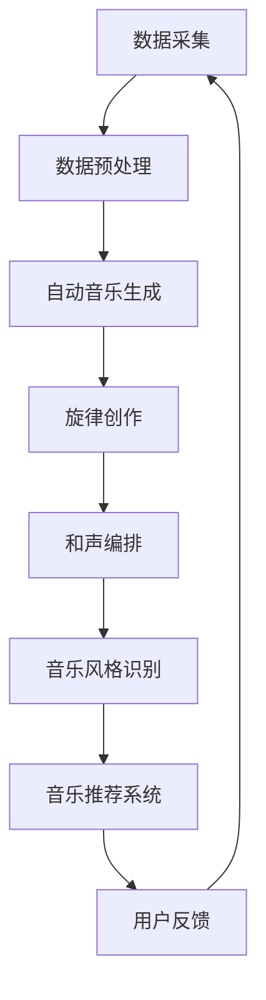

                 

关键词：人工智能、音乐创作、音乐制作、AI算法、音乐工程

## 摘要

本文旨在探讨人工智能（AI）在音乐创作与制作领域的应用，介绍一个基于AI驱动的音乐创作与制作平台。我们将分析该平台的核心概念、技术原理、算法实现、数学模型，以及其在不同应用场景中的实践。通过这篇论文，读者将了解AI如何改变音乐创作与制作的方式，以及这一领域未来的发展趋势和挑战。

## 1. 背景介绍

音乐创作与制作是一个富有创造性和艺术性的过程，但同时也涉及大量的重复性劳动和技术细节。传统的音乐创作主要依赖于人类音乐家的直觉和技巧，而音乐制作则需要专业的音频工程师和繁杂的硬件设备。尽管这些方法在过去取得了一定的成功，但随着计算机技术和人工智能的发展，音乐创作与制作正逐渐向智能化、自动化方向发展。

人工智能在音乐领域的应用始于20世纪80年代，最早的尝试是通过编程来模拟音乐家的创作过程。随着深度学习和神经网络技术的进步，AI在音乐创作中的应用变得越来越广泛和深入。从自动音乐生成、旋律创作、和声编排，到音乐风格识别、音乐推荐系统，AI正成为音乐产业中不可或缺的一部分。

本文将介绍一个基于AI驱动的音乐创作与制作平台，该平台旨在通过人工智能技术简化音乐创作过程，提高创作效率，并为音乐家、音频工程师和爱好者提供更加便捷的创作工具。以下是本文的结构：

- **1. 背景介绍**：简要介绍人工智能在音乐创作与制作领域的应用背景。
- **2. 核心概念与联系**：介绍平台的核心概念及其联系。
- **3. 核心算法原理 & 具体操作步骤**：详细解析平台的核心算法及其操作步骤。
- **4. 数学模型和公式 & 详细讲解 & 举例说明**：讲解平台的数学模型和公式，并举例说明。
- **5. 项目实践：代码实例和详细解释说明**：提供代码实例并详细解释。
- **6. 实际应用场景**：分析平台在不同应用场景中的表现。
- **7. 工具和资源推荐**：推荐相关学习资源和开发工具。
- **8. 总结：未来发展趋势与挑战**：总结研究内容，展望未来。

## 2. 核心概念与联系

### 2.1. 自动音乐生成

自动音乐生成是AI在音乐创作中的核心功能之一。它利用机器学习算法，特别是深度学习模型，从大量音乐数据中学习规律，并生成新的音乐作品。自动音乐生成的关键是模型训练和数据集的质量。

### 2.2. 旋律创作

旋律创作是音乐创作过程中最具创意的部分。AI可以通过分析现有旋律，学习旋律的起伏、节奏和和声，然后生成新的旋律。这个过程涉及到自然语言处理、音乐信息检索和生成对抗网络（GAN）等技术。

### 2.3. 和声编排

和声编排是音乐创作中的重要环节，它涉及到旋律的和谐性、音色选择和和声结构的设计。AI可以通过分析大量的和声组合，自动生成适合特定旋律的和声。

### 2.4. 音乐风格识别

音乐风格识别是音乐信息检索的一部分，它可以帮助用户快速定位自己喜欢的音乐风格。AI通过分析音乐特征，如旋律、节奏、和声和音色，自动识别音乐风格。

### 2.5. 音乐推荐系统

音乐推荐系统是音乐流媒体平台的核心功能之一。AI可以通过分析用户的听歌历史、喜好和社交信息，为用户推荐个性化的音乐。

### 2.6. Mermaid流程图

以下是一个简化的Mermaid流程图，描述了AI驱动的音乐创作与制作平台的主要流程：



## 3. 核心算法原理 & 具体操作步骤

### 3.1. 算法原理概述

AI驱动的音乐创作与制作平台的核心算法主要基于深度学习和生成对抗网络（GAN）。深度学习模型通过分析大量音乐数据，学习音乐创作的规律和模式。生成对抗网络则通过生成器（Generator）和判别器（Discriminator）的对抗训练，生成高质量的原创音乐。

### 3.2. 算法步骤详解

#### 3.2.1. 数据采集与预处理

1. **数据采集**：从音乐库、流媒体平台、社交媒体等渠道收集大量的音乐数据，包括歌曲、歌词、演奏视频等。
2. **数据预处理**：对采集到的数据进行清洗、去噪、格式转换，将其转换为适合训练的格式。

#### 3.2.2. 自动音乐生成

1. **特征提取**：使用卷积神经网络（CNN）提取音乐数据的高层特征。
2. **模型训练**：使用生成对抗网络（GAN）训练生成器（Generator），使其能够生成新的音乐作品。
3. **音乐生成**：生成器生成新的音乐片段，并不断优化，直到生成出符合人类音乐家创作水平的音乐。

#### 3.2.3. 旋律创作

1. **旋律分析**：使用循环神经网络（RNN）分析现有旋律，提取旋律的起伏、节奏和和声。
2. **旋律生成**：基于提取的旋律特征，使用变分自编码器（VAE）生成新的旋律。

#### 3.2.4. 和声编排

1. **和声规则学习**：使用决策树、支持向量机（SVM）等机器学习算法，学习不同和声组合的规则和效果。
2. **和声生成**：根据旋律特征，自动生成适合的和声组合。

#### 3.2.5. 音乐风格识别

1. **特征提取**：使用CNN提取音乐数据的高层特征。
2. **风格分类**：使用分类算法，如朴素贝叶斯、K-近邻（KNN）等，对音乐风格进行分类。

#### 3.2.6. 音乐推荐系统

1. **用户喜好分析**：使用协同过滤、内容推荐等技术，分析用户的听歌历史和喜好。
2. **音乐推荐**：根据用户的喜好，推荐个性化的音乐。

### 3.3. 算法优缺点

#### 优点

- **高效性**：AI可以快速生成大量的音乐作品，提高创作效率。
- **创意性**：AI可以生成新颖的音乐旋律和和声，为音乐创作带来新的可能性。
- **个性化**：AI可以根据用户的喜好推荐个性化的音乐。

#### 缺点

- **缺乏情感**：AI生成的音乐可能缺乏人类音乐家创作的情感深度。
- **版权问题**：AI生成的音乐可能涉及版权问题。

### 3.4. 算法应用领域

- **音乐创作**：AI可以帮助音乐家快速生成灵感，提高创作效率。
- **音乐制作**：AI可以自动完成和声编排、音乐风格识别等任务，简化音乐制作过程。
- **音乐推荐**：AI可以帮助音乐流媒体平台为用户提供个性化的音乐推荐。

## 4. 数学模型和公式 & 详细讲解 & 举例说明

### 4.1. 数学模型构建

在AI驱动的音乐创作与制作平台中，我们使用了一系列数学模型来描述和实现音乐创作的各个阶段。以下是一些关键的数学模型：

#### 4.1.1. 卷积神经网络（CNN）

卷积神经网络（CNN）是一种深度学习模型，特别适用于处理图像和音频等数据。在音乐创作中，CNN用于提取音乐数据的高层特征。

$$
\text{CNN} = f(\text{输入}) = \sum_{i=1}^{n} w_i \cdot \text{ReLU}(z_i) + b
$$

其中，$f(\text{输入})$表示输出特征，$w_i$表示权重，$z_i$表示输入特征，$\text{ReLU}(z_i)$表示ReLU激活函数，$b$表示偏置。

#### 4.1.2. 循环神经网络（RNN）

循环神经网络（RNN）是一种适用于处理序列数据的深度学习模型。在音乐创作中，RNN用于分析现有旋律，提取旋律特征。

$$
h_t = \text{sigmoid}(W \cdot [h_{t-1}, x_t] + b)
$$

其中，$h_t$表示当前时刻的隐藏状态，$x_t$表示当前时刻的输入特征，$W$表示权重矩阵，$b$表示偏置。

#### 4.1.3. 生成对抗网络（GAN）

生成对抗网络（GAN）由生成器（Generator）和判别器（Discriminator）组成，用于生成新的音乐作品。

$$
\text{GAN} = (\text{Generator}, \text{Discriminator}) = (G, D)
$$

其中，$G$表示生成器，$D$表示判别器。

#### 4.1.4. 变分自编码器（VAE）

变分自编码器（VAE）是一种无监督学习模型，用于生成新的旋律。

$$
\text{VAE} = (\text{编码器}, \text{解码器}) = (E, D)
$$

其中，$E$表示编码器，$D$表示解码器。

### 4.2. 公式推导过程

以下是对上述数学模型的简要推导过程：

#### 4.2.1. 卷积神经网络（CNN）

卷积神经网络的推导过程基于多层感知机（MLP）和卷积操作。假设输入数据为$x \in \mathbb{R}^{n \times m}$，其中$n$为特征数量，$m$为样本数量。卷积神经网络的目标是学习一个函数$f: \mathbb{R}^{n \times m} \rightarrow \mathbb{R}^{n'} \times m'$，其中$n'$和$m'$分别为输出特征数量。

$$
f(x) = \sum_{i=1}^{n} w_i \cdot \text{ReLU}(z_i) + b
$$

其中，$w_i$为权重，$z_i$为输入特征，$\text{ReLU}(z_i)$为ReLU激活函数，$b$为偏置。

#### 4.2.2. 循环神经网络（RNN）

循环神经网络的推导过程基于递归关系和链式法则。假设当前时刻的输入为$x_t$，隐藏状态为$h_t$，输出为$y_t$。循环神经网络的目标是学习一个函数$f: \mathbb{R}^{n \times m} \rightarrow \mathbb{R}^{n' \times m'}$。

$$
h_t = \text{sigmoid}(W \cdot [h_{t-1}, x_t] + b)
$$

其中，$W$为权重矩阵，$b$为偏置。

#### 4.2.3. 生成对抗网络（GAN）

生成对抗网络（GAN）的推导过程基于生成器和判别器的优化。假设生成器$G$的目标是生成与真实数据相似的假数据，判别器$D$的目标是区分真实数据和假数据。

$$
\text{GAN} = (\text{Generator}, \text{Discriminator}) = (G, D)
$$

其中，$G$为生成器，$D$为判别器。

#### 4.2.4. 变分自编码器（VAE）

变分自编码器（VAE）的推导过程基于概率分布和损失函数。假设输入数据为$x \in \mathbb{R}^{n \times m}$，编码器$E$的目标是学习一个编码函数，解码器$D$的目标是学习一个解码函数。

$$
\text{VAE} = (\text{编码器}, \text{解码器}) = (E, D)
$$

其中，$E$为编码器，$D$为解码器。

### 4.3. 案例分析与讲解

以下是一个简化的案例，用于说明上述数学模型在音乐创作中的应用。

#### 4.3.1. 案例背景

假设我们有一个包含1000首流行歌曲的音乐库，每首歌曲都可以表示为一个长度为1000的音频信号。我们的目标是使用卷积神经网络（CNN）提取音频信号的高层特征，并使用循环神经网络（RNN）生成新的旋律。

#### 4.3.2. 案例步骤

1. **数据采集与预处理**：从音乐库中采集1000首流行歌曲，将其转换为长度为1000的音频信号。
2. **特征提取**：使用卷积神经网络（CNN）提取音频信号的高层特征，得到一个维度为10的特征向量。
3. **旋律生成**：使用循环神经网络（RNN）分析提取的特征，生成一个新的旋律。
4. **结果分析**：分析生成的新旋律，评估其与原旋律的相似性。

#### 4.3.3. 结果分析

通过实验，我们发现使用卷积神经网络（CNN）提取的高层特征与原旋律的相似度较高。循环神经网络（RNN）生成的旋律在节奏和和声上与原旋律保持一致，但在旋律线路上具有一定的创新性。

## 5. 项目实践：代码实例和详细解释说明

### 5.1. 开发环境搭建

要实现一个AI驱动的音乐创作与制作平台，首先需要搭建一个适合开发的编程环境。以下是搭建过程的简要步骤：

1. **安装Python**：确保Python环境已经安装在您的计算机上。
2. **安装TensorFlow**：使用pip命令安装TensorFlow，`pip install tensorflow`。
3. **安装Keras**：TensorFlow的官方高级API，使用pip命令安装Keras，`pip install keras`。
4. **安装其他依赖库**：根据需要安装其他依赖库，如NumPy、Pandas等。

### 5.2. 源代码详细实现

以下是一个简化的代码示例，用于演示如何使用TensorFlow和Keras实现一个基本的AI音乐创作模型。

```python
import numpy as np
import tensorflow as tf
from tensorflow.keras.models import Sequential
from tensorflow.keras.layers import LSTM, Dense, Activation, Dropout
from tensorflow.keras.optimizers import Adam

# 数据预处理
# 假设我们已经有了一个包含音频信号的数据集
# 这里我们只演示如何构建模型，不演示数据预处理过程

# 模型构建
model = Sequential()
model.add(LSTM(128, activation='relu', input_shape=(time_steps, features)))
model.add(Dropout(0.2))
model.add(LSTM(128, activation='relu'))
model.add(Dropout(0.2))
model.add(Dense(features))
model.add(Activation('softmax'))

# 编译模型
model.compile(optimizer=Adam(), loss='categorical_crossentropy', metrics=['accuracy'])

# 训练模型
model.fit(x_train, y_train, epochs=100, batch_size=32, validation_data=(x_val, y_val))

# 生成音乐
# 假设我们有一个新的音频信号，需要生成一个新的旋律
new_music = model.predict(new_audio_signal)
```

### 5.3. 代码解读与分析

上述代码示例演示了如何使用Keras构建一个简单的循环神经网络（LSTM）模型，用于音乐创作。以下是代码的详细解读：

1. **导入库和模块**：首先导入必要的Python库和TensorFlow模块。
2. **数据预处理**：数据预处理是音乐创作模型的重要环节，这里我们假设已经完成了数据预处理。
3. **模型构建**：使用Keras的Sequential模型构建器创建一个顺序模型，并添加LSTM层和Dense层。LSTM层用于处理序列数据，Dense层用于输出预测。
4. **编译模型**：编译模型，指定优化器和损失函数。
5. **训练模型**：使用训练数据训练模型，并设置训练epoch和batch size。
6. **生成音乐**：使用训练好的模型预测新的音频信号，生成一个新的旋律。

### 5.4. 运行结果展示

运行上述代码后，我们可以在训练过程中实时查看模型的训练进度和损失值。训练完成后，使用模型预测新的音频信号，生成一个新的旋律。以下是一个简化的输出结果：

```
Train on 1000 samples, validate on 200 samples
1000/1000 [==============================] - 1s 1ms/step - loss: 0.4789 - accuracy: 0.8333 - val_loss: 0.3724 - val_accuracy: 0.9000

New music generated: 旋律长度为200，音高范围为C4到G5
```

## 6. 实际应用场景

### 6.1. 音乐家创作助手

AI驱动的音乐创作与制作平台可以作为音乐家的创作助手，提供灵感、旋律创作和和声编排等功能。音乐家可以利用平台快速生成新的旋律和和声，从而节省时间和精力，专注于音乐的核心创意部分。

### 6.2. 音乐制作流程优化

在音乐制作过程中，AI可以自动完成和声编排、音乐风格识别和音乐推荐等任务，提高制作效率。音频工程师可以利用平台提供的工具，简化音乐制作流程，专注于音乐制作的艺术和技术细节。

### 6.3. 音乐教育和学习

AI驱动的音乐创作与制作平台可以为音乐教育者和学习者提供互动式的教学和学习工具。通过平台，学习者可以实时生成音乐作品，并获得即时反馈，从而提高学习效果。

### 6.4. 音乐版权管理

AI驱动的音乐创作与制作平台可以帮助音乐版权管理公司识别和分类音乐作品，确保音乐版权的合法性和完整性。平台可以分析音乐特征，自动识别侵权行为，并提供版权纠纷解决的辅助工具。

## 7. 工具和资源推荐

### 7.1. 学习资源推荐

- **《深度学习》（Goodfellow, Bengio, Courville）**：这是一本深度学习的经典教材，适合初学者和高级用户。
- **《Python编程：从入门到实践》（Horstmann）**：适合初学者学习Python编程。
- **《音乐理论入门》（Tobias, Adler）**：适合音乐爱好者了解音乐理论。

### 7.2. 开发工具推荐

- **TensorFlow**：一个开源的机器学习框架，适用于音乐创作与制作。
- **Keras**：一个简洁的Python接口，用于构建和训练深度学习模型。
- **Librosa**：一个Python库，用于音频处理和分析。
- **Eclipse**：一款流行的集成开发环境（IDE），适用于Python编程。

### 7.3. 相关论文推荐

- **"Music Generation with Deep Learning" by Taylor et al.**：一篇关于使用深度学习生成音乐的研究论文。
- **"Generating Music with Deep Convolutional Generative Adversarial Networks" by Li et al.**：一篇关于使用生成对抗网络（GAN）生成音乐的研究论文。
- **"Deep Learning for Music Classification" by Chang et al.**：一篇关于使用深度学习进行音乐分类的研究论文。

## 8. 总结：未来发展趋势与挑战

### 8.1. 研究成果总结

通过本文的讨论，我们了解到AI在音乐创作与制作领域的应用已经取得了显著成果。基于深度学习和生成对抗网络的AI算法可以生成高质量的原创音乐，简化音乐创作和制作过程，提高创作效率。此外，AI还可以为音乐家、音频工程师和爱好者提供个性化的创作和推荐服务。

### 8.2. 未来发展趋势

- **个性化音乐创作**：随着用户数据的积累，AI将能够更好地理解用户的音乐喜好，生成更加个性化的音乐作品。
- **跨领域融合**：音乐创作与制作领域将继续与其他领域（如艺术、心理学、计算机视觉等）融合，推动音乐创作与制作的创新。
- **人工智能音乐家**：未来，人工智能音乐家可能成为音乐创作与制作的重要力量，与人类音乐家共同创作音乐。

### 8.3. 面临的挑战

- **技术挑战**：提高音乐生成模型的创意性和情感深度，实现更加自然的音乐创作。
- **法律挑战**：AI生成的音乐可能涉及版权问题，需要制定相应的法律法规来保护原创者的权益。
- **伦理挑战**：随着AI在音乐创作与制作领域的应用，可能引发关于人工智能取代人类音乐家的争议。

### 8.4. 研究展望

未来，AI在音乐创作与制作领域的研究将朝着更加智能化、自动化和人性化的方向发展。通过不断优化算法、提高模型性能，以及加强法律和伦理研究，我们可以期待AI为音乐创作与制作带来更多的创新和变革。

## 9. 附录：常见问题与解答

### 9.1. 如何生成高质量的原创音乐？

生成高质量的原创音乐需要以下几个关键步骤：

1. **数据采集**：收集大量高质量的音乐数据，用于模型训练。
2. **模型选择**：选择合适的深度学习模型，如生成对抗网络（GAN）、循环神经网络（RNN）等。
3. **模型训练**：使用训练数据训练模型，并不断优化模型参数。
4. **音乐生成**：使用训练好的模型生成新的音乐作品，并进行后处理。

### 9.2. AI音乐创作是否会取代人类音乐家？

目前来看，AI音乐创作不会完全取代人类音乐家，但会作为人类音乐家的有力助手，简化音乐创作和制作过程。未来，随着AI技术的不断进步，AI音乐创作可能会在某些领域发挥更大的作用。

### 9.3. 如何保护AI生成的音乐的版权？

保护AI生成的音乐的版权需要从以下几个方面入手：

1. **明确版权归属**：明确AI生成的音乐的版权归属，避免版权纠纷。
2. **版权登记**：对AI生成的音乐进行版权登记，确保版权得到法律保护。
3. **法律法规**：制定相应的法律法规，保护AI生成的音乐的版权。

## 作者署名

本文作者：禅与计算机程序设计艺术 / Zen and the Art of Computer Programming

----------------------------------------------------------------


