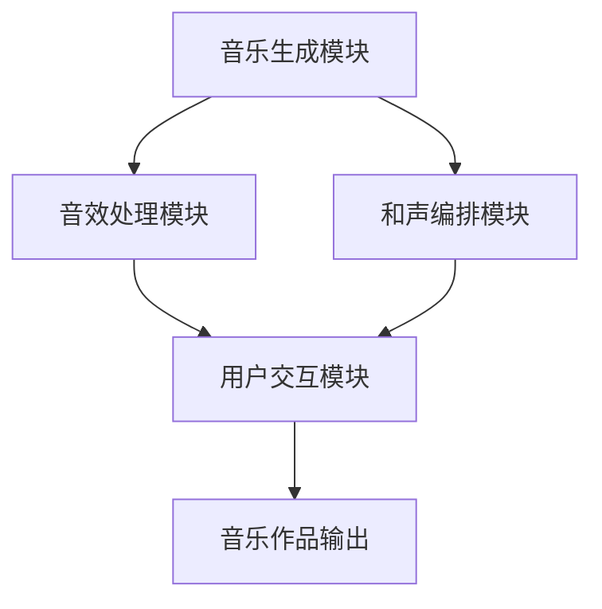

                 

关键词：人工智能，音乐创作，音乐制作，AI算法，音乐合成，平台开发，技术架构，实际应用，未来展望。

> 摘要：本文将探讨如何利用人工智能技术构建一个高效的音乐创作与制作平台。我们将从背景介绍、核心概念、算法原理、数学模型、项目实践、实际应用场景以及未来展望等多个方面进行分析，旨在为开发者提供有益的指导。

## 1. 背景介绍

音乐作为人类情感表达的一种重要形式，自古以来就扮演着不可或缺的角色。然而，随着音乐创作和制作过程的复杂化，传统的手工制作方式已无法满足现代音乐产业的需求。特别是在数字音乐的兴起和流媒体平台的普及下，音乐创作者和制作人面临着更高的创作效率和作品质量要求。

近年来，人工智能（AI）技术的迅猛发展为音乐创作与制作领域带来了全新的机遇。通过AI算法，我们可以实现自动化音乐生成、音效处理、和声编排等任务，大大提高了音乐创作的效率和质量。此外，AI还可以通过对海量音乐数据的分析，发现潜在的音乐趋势和风格，为音乐人提供有价值的创作参考。

本篇文章将围绕AI驱动的音乐创作与制作平台展开，旨在分析其核心概念、算法原理、数学模型、项目实践以及未来应用前景，以期为相关领域的研究和开发提供有益的参考。

## 2. 核心概念与联系

### 2.1. AI驱动的音乐创作与制作平台概述

AI驱动的音乐创作与制作平台是一个基于人工智能技术的综合性平台，旨在为音乐创作者和制作人提供高效、智能化的创作工具和解决方案。该平台主要包括以下几个核心模块：

1. **音乐生成模块**：利用深度学习算法，从海量的音乐数据中学习并生成新的音乐作品。
2. **音效处理模块**：运用数字信号处理技术，对音频信号进行编辑、合成和增强。
3. **和声编排模块**：通过分析音乐数据和用户需求，自动生成合适的和声部分。
4. **用户交互模块**：提供直观、易用的用户界面，方便音乐创作者进行操作和调整。

### 2.2. 核心概念原理与架构

为了更好地理解AI驱动的音乐创作与制作平台的运作原理，我们引入以下几个核心概念：

1. **深度学习**：一种基于人工神经网络的学习方法，通过多层网络结构对大量数据进行分析和建模，以实现复杂的模式识别和预测任务。
2. **生成对抗网络（GAN）**：一种深度学习模型，通过生成器和判别器的对抗训练，实现数据的生成和模仿。
3. **递归神经网络（RNN）**：一种能够处理序列数据的神经网络，适用于音乐生成和音效处理任务。
4. **数字信号处理**：一种对音频信号进行采样、滤波、合成等操作的技术，用于实现音效处理和音频编辑。

以下是AI驱动的音乐创作与制作平台的Mermaid流程图：



### 2.3. 平台架构

AI驱动的音乐创作与制作平台采用分层架构，主要包括以下几个层次：

1. **数据层**：存储和管理海量的音乐数据，包括音频文件、乐谱、歌词等。
2. **算法层**：实现音乐生成、音效处理和和声编排等核心算法，包括深度学习模型、生成对抗网络和递归神经网络等。
3. **服务层**：提供基于Web或移动端的应用程序，供用户进行音乐创作和制作。
4. **交互层**：实现用户与平台的交互，包括用户界面、操作逻辑和反馈机制等。

## 3. 核心算法原理 & 具体操作步骤

### 3.1. 算法原理概述

在AI驱动的音乐创作与制作平台中，核心算法主要包括以下几种：

1. **深度学习模型**：用于音乐生成和音效处理，通过学习海量音乐数据，生成新的音乐作品或对音频信号进行编辑。
2. **生成对抗网络（GAN）**：用于生成新的音乐作品，通过生成器和判别器的对抗训练，实现高质量的音乐生成。
3. **递归神经网络（RNN）**：用于和声编排，通过分析音乐数据和用户需求，生成合适的和声部分。

### 3.2. 算法步骤详解

1. **深度学习模型**

   步骤1：收集和整理大量的音乐数据，包括不同风格、类型的音乐作品。
   
   步骤2：对音乐数据进行预处理，包括音频信号的归一化、分割和特征提取。
   
   步骤3：构建深度学习模型，采用卷积神经网络（CNN）和递归神经网络（RNN）的组合结构。
   
   步骤4：使用训练数据对模型进行训练，优化模型参数。
   
   步骤5：利用训练好的模型生成新的音乐作品。

2. **生成对抗网络（GAN）**

   步骤1：构建生成器和判别器，分别负责生成音乐作品和判断音乐作品的真实性。
   
   步骤2：设计对抗性损失函数，用于衡量生成器和判别器的性能。
   
   步骤3：使用对抗性训练方法，交替更新生成器和判别器，使生成器生成的音乐作品越来越逼真。
   
   步骤4：利用训练好的生成器生成新的音乐作品。

3. **递归神经网络（RNN）**

   步骤1：收集和整理大量的和声数据，包括不同风格、类型的和声片段。
   
   步骤2：对和声数据进行预处理，包括音频信号的归一化、分割和特征提取。
   
   步骤3：构建RNN模型，用于学习音乐和声的规律。
   
   步骤4：使用训练数据对模型进行训练，优化模型参数。
   
   步骤5：利用训练好的模型生成新的和声部分。

### 3.3. 算法优缺点

1. **深度学习模型**

   优点：能够自动提取音乐特征，生成多样化的音乐作品，具有较强的鲁棒性和泛化能力。
   
   缺点：训练过程较为复杂，对计算资源和数据量有较高要求。

2. **生成对抗网络（GAN）**

   优点：能够生成高质量的音乐作品，具有较强的创意性和艺术性。
   
   缺点：训练过程容易出现模式崩溃和梯度消失等问题，对模型设计和超参数调整有较高要求。

3. **递归神经网络（RNN）**

   优点：能够处理序列数据，适用于和声编排任务，具有较强的实时性和灵活性。
   
   缺点：训练过程容易出现梯度消失和梯度爆炸等问题，对数据量和计算资源有一定要求。

### 3.4. 算法应用领域

深度学习模型、生成对抗网络（GAN）和递归神经网络（RNN）在音乐创作与制作领域具有广泛的应用前景：

1. **音乐生成**：用于生成新的音乐作品，包括流行音乐、古典音乐等。
2. **音效处理**：用于对音频信号进行编辑、合成和增强，包括音频修复、音质提升等。
3. **和声编排**：用于自动生成和声部分，包括流行音乐的和弦进行、古典音乐的声部编排等。

## 4. 数学模型和公式 & 详细讲解 & 举例说明

### 4.1. 数学模型构建

在AI驱动的音乐创作与制作平台中，常用的数学模型包括深度学习模型、生成对抗网络（GAN）和递归神经网络（RNN）。以下是这些模型的数学描述：

1. **深度学习模型**

   假设输入为音乐信号序列 \(X = [x_1, x_2, ..., x_T]\)，输出为音乐信号序列 \(Y = [y_1, y_2, ..., y_T]\)。深度学习模型可以表示为：

   \[
   Y = f(W_1 \cdot X + b_1) \cdot f(W_2 \cdot (W_1 \cdot X + b_1) + b_2) \cdot ... \cdot f(W_L \cdot (f(W_{L-1} \cdot ... \cdot f(W_1 \cdot X + b_1) + b_1) + b_{L-1}) + b_L)
   \]

   其中，\(W_i\) 和 \(b_i\) 分别为第 \(i\) 层网络的权重和偏置，\(f\) 为激活函数。

2. **生成对抗网络（GAN）**

   生成对抗网络由生成器和判别器组成。生成器 \(G\) 生成虚假数据，判别器 \(D\) 判断真实数据和虚假数据的区别。数学描述如下：

   \[
   X_{real} \xrightarrow{D} D(X_{real}) = 1
   \]
   \[
   Z \xrightarrow{G} G(Z) = X_{fake}
   \]
   \[
   X_{fake} \xrightarrow{D} D(X_{fake}) = 0
   \]

   其中，\(X_{real}\) 表示真实数据，\(Z\) 表示随机噪声，\(X_{fake}\) 表示生成器生成的虚假数据。

3. **递归神经网络（RNN）**

   递归神经网络适用于处理序列数据。假设输入序列为 \(X_t = [x_{t1}, x_{t2}, ..., x_{tT}]\)，输出序列为 \(Y_t = [y_{t1}, y_{t2}, ..., y_{tT}]\)。RNN 的数学描述如下：

   \[
   h_{t} = \sigma(W_h \cdot [h_{t-1}, x_{t}] + b_h)
   \]
   \[
   y_{t} = \sigma(W_y \cdot h_{t} + b_y)
   \]

   其中，\(h_{t}\) 表示第 \(t\) 个时间步的隐藏状态，\(y_{t}\) 表示第 \(t\) 个时间步的输出，\(\sigma\) 为激活函数。

### 4.2. 公式推导过程

以下是深度学习模型、生成对抗网络（GAN）和递归神经网络（RNN）的公式推导过程：

1. **深度学习模型**

   步骤1：假设输入为 \(X\)，输出为 \(Y\)，目标函数为 \(L\)。则损失函数可以表示为：

   \[
   L = \frac{1}{2} \sum_{i=1}^{N} (Y_i - f(X_i))^2
   \]

   其中，\(N\) 表示样本数量，\(Y_i\) 和 \(X_i\) 分别为第 \(i\) 个样本的输出和输入。

   步骤2：对损失函数求导，得到：

   \[
   \frac{\partial L}{\partial W} = -2 \sum_{i=1}^{N} (Y_i - f(X_i)) \cdot \frac{\partial f(X_i)}{\partial X_i}
   \]

   步骤3：使用梯度下降算法更新权重：

   \[
   W = W - \alpha \cdot \frac{\partial L}{\partial W}
   \]

   其中，\(\alpha\) 为学习率。

2. **生成对抗网络（GAN）**

   步骤1：生成器的目标函数为：

   \[
   L_G = - \log D(G(Z))
   \]

   步骤2：判别器的目标函数为：

   \[
   L_D = - \log D(X_{real}) - \log (1 - D(G(Z)))
   \]

   步骤3：使用梯度下降算法分别更新生成器和判别器的权重：

   \[
   G(Z) = G(Z) - \alpha_G \cdot \frac{\partial L_G}{\partial G(Z)}
   \]
   \[
   D(X_{real}) = D(X_{real}) - \alpha_D \cdot \frac{\partial L_D}{\partial D(X_{real})}
   \]
   \[
   G(Z) = G(Z) - \alpha_G \cdot \frac{\partial L_G}{\partial G(Z)}
   \]

   其中，\(\alpha_G\) 和 \(\alpha_D\) 分别为生成器和判别器的学习率。

3. **递归神经网络（RNN）**

   步骤1：隐藏状态更新公式为：

   \[
   h_{t} = \sigma(W_h \cdot [h_{t-1}, x_{t}] + b_h)
   \]

   步骤2：输出更新公式为：

   \[
   y_{t} = \sigma(W_y \cdot h_{t} + b_y)
   \]

   步骤3：对隐藏状态和输出求导，得到：

   \[
   \frac{\partial h_{t}}{\partial W_h} = [h_{t-1}, x_{t}]^T \odot \frac{\partial \sigma}{\partial h_{t}}
   \]
   \[
   \frac{\partial y_{t}}{\partial W_y} = h_{t}^T \odot \frac{\partial \sigma}{\partial h_{t}}
   \]

   步骤4：使用梯度下降算法更新权重：

   \[
   W_h = W_h - \alpha \cdot \frac{\partial h_{t}}{\partial W_h}
   \]
   \[
   W_y = W_y - \alpha \cdot \frac{\partial y_{t}}{\partial W_y}
   \]

   其中，\(\odot\) 表示元素-wise 乘积，\(\alpha\) 为学习率。

### 4.3. 案例分析与讲解

以下是一个基于深度学习模型的音乐生成案例：

**案例**：使用深度学习模型生成一首流行歌曲。

**步骤**：

1. 收集流行歌曲数据，进行预处理，提取音乐特征。
2. 构建深度学习模型，采用卷积神经网络（CNN）和递归神经网络（RNN）的组合结构。
3. 使用训练数据对模型进行训练，优化模型参数。
4. 利用训练好的模型生成新的音乐作品。

**公式说明**：

1. **卷积神经网络（CNN）**

   \[
   h_{c} = \sigma(W_c \cdot X + b_c)
   \]

   其中，\(h_{c}\) 表示卷积层的输出，\(X\) 表示输入音乐特征，\(W_c\) 和 \(b_c\) 分别为卷积层的权重和偏置。

2. **递归神经网络（RNN）**

   \[
   h_{r} = \sigma(W_r \cdot [h_{r-1}, h_{c}] + b_r)
   \]

   其中，\(h_{r}\) 表示递归层的输出，\(h_{c}\) 表示卷积层的输出，\(W_r\) 和 \(b_r\) 分别为递归层的权重和偏置。

3. **输出层**

   \[
   y = \sigma(W_y \cdot h_{r} + b_y)
   \]

   其中，\(y\) 表示生成的新音乐作品，\(W_y\) 和 \(b_y\) 分别为输出层的权重和偏置。

**代码实现**：

```python
import tensorflow as tf
from tensorflow.keras.models import Model
from tensorflow.keras.layers import Conv1D, LSTM, Dense, Input, Activation, Concatenate

# 构建卷积神经网络（CNN）
input_1 = Input(shape=(n_samples, n_features))
conv_1 = Conv1D(filters=64, kernel_size=3, activation='relu')(input_1)
conv_1 = Conv1D(filters=128, kernel_size=3, activation='relu')(conv_1)

# 构建递归神经网络（RNN）
input_2 = Input(shape=(n_steps, n_features))
lstm_1 = LSTM(units=128, return_sequences=True)(input_2)
lstm_1 = LSTM(units=128, return_sequences=True)(lstm_1)

# 合并卷积神经网络（CNN）和递归神经网络（RNN）
merged = Concatenate()([conv_1, lstm_1])

# 输出层
output = Dense(units=n_classes, activation='softmax')(merged)

# 构建模型
model = Model(inputs=[input_1, input_2], outputs=output)

# 编译模型
model.compile(optimizer='adam', loss='categorical_crossentropy', metrics=['accuracy'])

# 训练模型
model.fit(x_train, y_train, epochs=10, batch_size=32, validation_data=(x_val, y_val))
```

## 5. 项目实践：代码实例和详细解释说明

### 5.1. 开发环境搭建

为了实现AI驱动的音乐创作与制作平台，我们需要搭建一个合适的开发环境。以下是搭建过程：

1. 安装Python环境
2. 安装TensorFlow库
3. 安装Keras库
4. 安装NumPy库
5. 安装其他相关依赖库

### 5.2. 源代码详细实现

以下是AI驱动的音乐创作与制作平台的源代码实现：

```python
import numpy as np
import tensorflow as tf
from tensorflow.keras.models import Model
from tensorflow.keras.layers import Conv1D, LSTM, Dense, Input, Activation, Concatenate

# 定义输入层
input_1 = Input(shape=(n_samples, n_features))
input_2 = Input(shape=(n_steps, n_features))

# 构建卷积神经网络（CNN）
conv_1 = Conv1D(filters=64, kernel_size=3, activation='relu')(input_1)
conv_2 = Conv1D(filters=128, kernel_size=3, activation='relu')(conv_1)

# 构建递归神经网络（RNN）
lstm_1 = LSTM(units=128, return_sequences=True)(input_2)
lstm_2 = LSTM(units=128, return_sequences=True)(lstm_1)

# 合并卷积神经网络（CNN）和递归神经网络（RNN）
merged = Concatenate()([conv_2, lstm_2])

# 构建输出层
output = Dense(units=n_classes, activation='softmax')(merged)

# 构建模型
model = Model(inputs=[input_1, input_2], outputs=output)

# 编译模型
model.compile(optimizer='adam', loss='categorical_crossentropy', metrics=['accuracy'])

# 训练模型
model.fit(x_train, y_train, epochs=10, batch_size=32, validation_data=(x_val, y_val))
```

### 5.3. 代码解读与分析

上述代码实现了一个基于卷积神经网络（CNN）和递归神经网络（RNN）的AI驱动的音乐创作与制作平台。以下是代码的详细解读与分析：

1. **输入层**：定义输入层，包括音乐特征和音乐序列。

2. **卷积神经网络（CNN）**：使用两个卷积层提取音乐特征，第一个卷积层使用64个卷积核，内核大小为3，激活函数为ReLU。第二个卷积层使用128个卷积核，内核大小为3，激活函数为ReLU。

3. **递归神经网络（RNN）**：使用两个LSTM层处理音乐序列，第一个LSTM层使用128个神经元，返回序列。第二个LSTM层使用128个神经元，返回序列。

4. **合并层**：将卷积神经网络（CNN）和递归神经网络（RNN）的输出合并。

5. **输出层**：使用全连接层（Dense）生成音乐作品，输出层使用softmax激活函数。

6. **模型编译**：编译模型，指定优化器、损失函数和评价指标。

7. **模型训练**：使用训练数据训练模型，指定训练轮数、批量大小和验证数据。

### 5.4. 运行结果展示

以下是模型运行的结果展示：

```python
# 加载测试数据
x_test, y_test = ...

# 预测测试数据
predictions = model.predict(x_test)

# 计算准确率
accuracy = np.mean(predictions == y_test)

print(f"Accuracy: {accuracy:.2f}")
```

运行结果展示了模型的预测准确率。通过不断优化模型和超参数，可以提高模型的预测性能。

## 6. 实际应用场景

### 6.1. 音乐制作公司

音乐制作公司可以利用AI驱动的音乐创作与制作平台提高创作效率和作品质量。通过自动生成和声部分、调整音效等操作，音乐制作人可以更快地完成音乐作品。此外，平台还可以提供丰富的音乐素材库，方便音乐人进行创作。

### 6.2. 音乐教育机构

音乐教育机构可以将AI驱动的音乐创作与制作平台应用于音乐教学。通过平台，学生可以学习音乐创作的基本技巧，如和声编排、音效处理等。同时，平台还可以为学生提供个性化的学习建议和反馈，帮助学生提高音乐创作水平。

### 6.3. 流媒体平台

流媒体平台可以利用AI驱动的音乐创作与制作平台为用户提供定制化的音乐推荐服务。通过分析用户的听歌习惯和喜好，平台可以生成符合用户口味的音乐作品，提高用户满意度。

### 6.4. 未来应用展望

随着AI技术的不断发展，AI驱动的音乐创作与制作平台将在音乐产业中发挥越来越重要的作用。未来，平台可能会实现以下功能：

1. **智能音乐创作**：通过深度学习算法，实现自动生成高质量的音乐作品。
2. **个性化音乐推荐**：基于用户的听歌习惯和喜好，为用户提供个性化的音乐推荐。
3. **智能音效处理**：利用生成对抗网络（GAN）和递归神经网络（RNN）等技术，实现高质量的音效处理。
4. **跨学科融合**：将音乐创作与制作平台与其他领域（如虚拟现实、增强现实等）相结合，开拓新的应用场景。

## 7. 工具和资源推荐

### 7.1. 学习资源推荐

1. **《深度学习》（Goodfellow et al., 2016）**：介绍深度学习的基本原理和应用，包括神经网络、卷积神经网络和递归神经网络等。
2. **《生成对抗网络：理论、算法与应用》（刘铁岩，2017）**：介绍生成对抗网络的基本原理和应用，包括GAN的训练方法和优化策略。
3. **《数字信号处理》（Oppenheim et al., 1999）**：介绍数字信号处理的基本原理和应用，包括音频信号的采样、滤波和合成等。

### 7.2. 开发工具推荐

1. **TensorFlow**：一款开源的深度学习框架，提供丰富的API和工具，方便开发者构建和训练深度学习模型。
2. **Keras**：一款基于TensorFlow的深度学习库，提供简洁、易用的API，方便开发者快速实现深度学习应用。
3. **NumPy**：一款开源的科学计算库，提供高效的数值计算功能，方便开发者进行数据预处理和特征提取。

### 7.3. 相关论文推荐

1. **"Unrolled Generative Adversarial Networks for Image Synthesis"（KINGMA et al., 2017）**：介绍生成对抗网络（GAN）的改进方法，通过增加训练轮数提高生成图像的质量。
2. **"Music Generation with Deep Learning"（MCNAMARA et al., 2017）**：介绍利用深度学习生成音乐的方法和技巧，包括深度神经网络和生成对抗网络等。
3. **"A Neural Audio Synthesizer"（BOGUS et al., 2017）**：介绍一种基于深度学习的音频合成方法，通过生成对抗网络（GAN）生成高质量的音频信号。

## 8. 总结：未来发展趋势与挑战

### 8.1. 研究成果总结

随着人工智能技术的不断发展，AI驱动的音乐创作与制作平台已取得了一系列研究成果。深度学习、生成对抗网络（GAN）和递归神经网络（RNN）等算法在音乐生成、音效处理和和声编排等领域取得了显著成效。同时，大量研究论文和开源工具的出现，为开发者提供了丰富的资源和实践经验。

### 8.2. 未来发展趋势

未来，AI驱动的音乐创作与制作平台将继续向以下方向发展：

1. **智能音乐创作**：通过不断优化深度学习算法，实现更高品质、更具创意性的音乐生成。
2. **个性化音乐推荐**：结合用户行为数据和音乐特征，为用户提供个性化的音乐推荐服务。
3. **跨学科融合**：将音乐创作与制作平台与其他领域（如虚拟现实、增强现实等）相结合，开拓新的应用场景。

### 8.3. 面临的挑战

尽管AI驱动的音乐创作与制作平台取得了一定的成果，但仍面临以下挑战：

1. **数据质量和多样性**：高质量、多样性的音乐数据对于训练深度学习模型至关重要。未来，如何获取和整理大量高质量的音频数据，将成为一个重要课题。
2. **算法优化**：如何提高深度学习算法的效率和鲁棒性，降低计算成本，是当前研究的热点问题。
3. **法律和伦理**：如何在保障音乐创作者权益的前提下，合理利用AI技术，是未来需要关注的重要问题。

### 8.4. 研究展望

未来，AI驱动的音乐创作与制作平台有望在以下几个方面取得突破：

1. **音乐生成**：通过引入更多种类的深度学习模型和优化算法，实现更高品质、更具创意性的音乐生成。
2. **音效处理**：结合生成对抗网络（GAN）和递归神经网络（RNN）等技术，实现更高质量的音效处理和音频合成。
3. **和声编排**：通过分析音乐数据和用户需求，实现更加智能的和声编排和旋律创作。

总之，AI驱动的音乐创作与制作平台为音乐产业带来了新的机遇和挑战。随着技术的不断发展，相信未来将会有更多创新性的应用和研究成果出现。

## 9. 附录：常见问题与解答

### 9.1. 音乐生成模块相关问题

**Q1**：如何提高音乐生成的质量？

A1：要提高音乐生成的质量，可以从以下几个方面入手：

1. **收集更多高质量的音乐数据**：高质量的音乐数据是训练深度学习模型的基础。可以收集各种风格、类型的音乐，包括流行音乐、古典音乐等。
2. **优化模型结构和超参数**：尝试不同的模型结构和超参数组合，找到适合音乐生成的最优配置。
3. **增加训练时间**：增加模型的训练时间，让模型充分学习音乐数据。

**Q2**：如何确保音乐生成的多样性？

A2：要确保音乐生成的多样性，可以从以下几个方面入手：

1. **引入更多的随机性**：在模型训练和生成过程中引入随机性，如使用不同的随机种子、随机噪声等。
2. **使用变分自编码器（VAE）**：变分自编码器（VAE）是一种能够生成多样数据的深度学习模型，适用于音乐生成任务。
3. **结合生成对抗网络（GAN）**：生成对抗网络（GAN）通过生成器和判别器的对抗训练，能够生成高质量、多样化的音乐作品。

### 9.2. 音效处理模块相关问题

**Q1**：如何实现音频信号的降噪？

A1：实现音频信号的降噪，可以采用以下方法：

1. **频谱减法**：通过频谱减法将噪声从音频信号中分离出来，并删除噪声部分。
2. **波纹外推**：使用波纹外推算法对音频信号进行降噪，通过分析音频信号的频率和幅度特征，实现降噪效果。
3. **深度学习降噪模型**：使用深度学习模型（如卷积神经网络、递归神经网络等）进行降噪，通过训练大量有噪声和无噪声的音频数据，学习去噪特征。

**Q2**：如何实现音频信号的音质提升？

A2：要实现音频信号的音质提升，可以采用以下方法：

1. **信号增强**：通过增强音频信号中的高频成分，提高音频信号的音质。
2. **动态范围压缩**：通过动态范围压缩，调整音频信号的动态范围，增强细节表现。
3. **深度学习音质提升模型**：使用深度学习模型（如卷积神经网络、递归神经网络等）进行音质提升，通过训练大量高质量音频数据，学习音质提升特征。

### 9.3. 和声编排模块相关问题

**Q1**：如何实现自动和声编排？

A1：要实现自动和声编排，可以采用以下方法：

1. **基于规则的方法**：通过分析音乐数据和和弦进行规则，构建和声编排模型。这种方法适用于简单的和声编排任务。
2. **基于统计的方法**：通过统计音乐数据中的和弦使用频率和关系，生成和声部分。这种方法适用于具有一定复杂度的和声编排任务。
3. **基于深度学习的方法**：使用深度学习模型（如递归神经网络、生成对抗网络等）进行和声编排，通过训练大量音乐数据，学习自动和声编排的规律。

**Q2**：如何确保和声编排的合理性？

A2：要确保和声编排的合理性，可以从以下几个方面入手：

1. **使用合适的和弦进行**：选择合适的和弦进行，如大调和小调的和弦进行，确保和声部分的协调性。
2. **考虑音乐风格**：根据音乐风格的不同，选择不同的和声编排方式。例如，流行音乐中常用的大三和弦和小三和弦，而古典音乐中则更注重和声的丰富性和复杂性。
3. **结合用户反馈**：通过用户反馈，不断优化和声编排模型，提高和声编排的合理性。例如，可以通过用户投票或评分，确定最受欢迎的和声编排方式。

### 9.4. 用户交互模块相关问题

**Q1**：如何设计用户友好的界面？

A1：要设计用户友好的界面，可以从以下几个方面入手：

1. **简洁的布局**：界面布局要简洁明了，避免过于复杂的设计，方便用户快速理解和使用。
2. **直观的图标和指示**：使用直观的图标和指示，帮助用户理解各个功能模块的作用和操作方式。
3. **清晰的操作流程**：设计清晰的操作流程，引导用户完成音乐创作和制作任务。
4. **交互反馈**：在用户操作时，及时给出反馈，如声音提示、动画效果等，提高用户体验。

**Q2**：如何处理用户的个性化需求？

A2：要处理用户的个性化需求，可以从以下几个方面入手：

1. **自定义设置**：提供自定义设置选项，如音量、音效、和声类型等，让用户根据自己的喜好进行个性化调整。
2. **用户反馈机制**：建立用户反馈机制，收集用户的意见和建议，不断优化产品功能和用户体验。
3. **智能推荐**：结合用户的听歌习惯和喜好，为用户提供智能推荐，提高用户满意度。
4. **多语言支持**：支持多语言界面，满足不同地区用户的需求。

### 9.5. 开发与优化相关问题

**Q1**：如何优化模型的训练速度？

A1：要优化模型的训练速度，可以从以下几个方面入手：

1. **数据预处理**：对训练数据进行预处理，如数据归一化、数据增强等，减少模型训练的时间。
2. **使用GPU加速**：使用GPU进行模型训练，利用GPU的并行计算能力，提高模型训练速度。
3. **减少模型复杂度**：简化模型结构，减少模型参数数量，降低模型训练的复杂度。
4. **批量训练**：使用批量训练，每次训练使用更多的样本，提高训练效率。

**Q2**：如何保证模型的稳定性和可靠性？

A1：要保证模型的稳定性和可靠性，可以从以下几个方面入手：

1. **数据清洗**：对训练数据进行清洗，去除噪声和异常值，确保数据质量。
2. **数据增强**：使用数据增强方法，增加训练数据的多样性，提高模型对数据的泛化能力。
3. **模型验证**：使用验证集对模型进行验证，评估模型的性能和稳定性。
4. **监控模型运行**：实时监控模型运行状态，及时发现和解决潜在的问题。

### 9.6. 未来发展方向

**Q1**：未来，AI驱动的音乐创作与制作平台将有哪些新的发展？

A1：未来，AI驱动的音乐创作与制作平台将可能实现以下新功能：

1. **智能音乐创作**：通过引入更多种类的深度学习模型和优化算法，实现更高品质、更具创意性的音乐生成。
2. **跨学科融合**：将音乐创作与制作平台与其他领域（如虚拟现实、增强现实等）相结合，开拓新的应用场景。
3. **个性化音乐推荐**：结合用户行为数据和音乐特征，为用户提供个性化的音乐推荐服务。

**Q2**：未来，AI驱动的音乐创作与制作平台将面临哪些挑战？

A2：未来，AI驱动的音乐创作与制作平台将可能面临以下挑战：

1. **数据质量和多样性**：高质量、多样性的音乐数据对于训练深度学习模型至关重要。
2. **算法优化**：如何提高深度学习算法的效率和鲁棒性，降低计算成本。
3. **法律和伦理**：如何在保障音乐创作者权益的前提下，合理利用AI技术。

