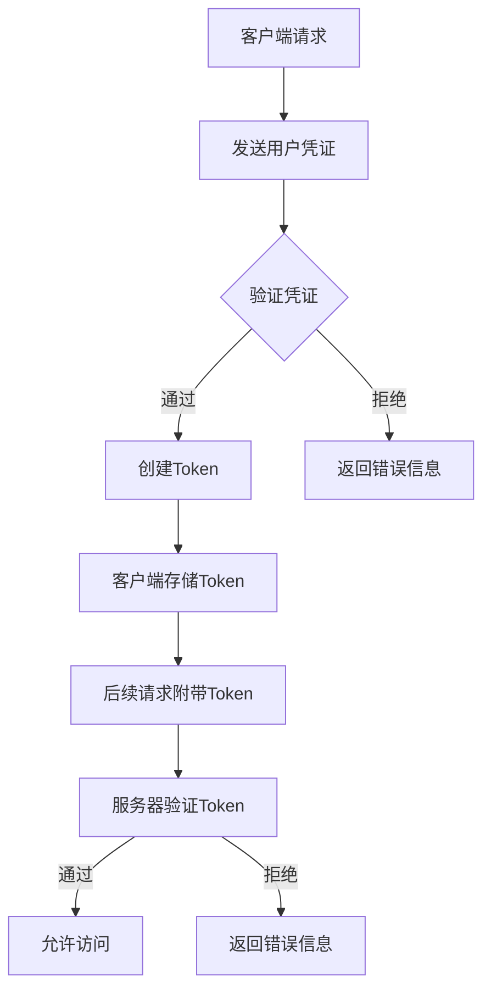

                 

关键词：API安全，认证机制，网络安全，身份验证，加密，Token，OAuth2.0，HTTPS

> 摘要：本文旨在探讨API安全和认证机制的重要性，以及它们在现代网络环境中的应用。我们将深入讨论常见的API安全威胁、认证机制的工作原理、加密技术的作用，并介绍几种流行的认证协议。最后，我们将展望未来API安全和认证技术的发展趋势，以及面临的挑战。

## 1. 背景介绍

随着互联网的迅速发展，API（应用程序编程接口）已经成为现代软件架构的核心组成部分。API使得不同的软件系统能够相互通信，促进了应用程序之间数据的共享和服务的整合。然而，这种互操作性也带来了新的安全挑战。未经授权的访问、数据泄露、API滥用等安全问题层出不穷，严重影响了企业和用户的利益。

API安全的重要性不言而喻。一个安全的API不仅能够保护企业的数据和用户隐私，还能提升用户体验，增强企业的品牌信任。为此，开发者需要了解并实施有效的认证机制，以确保只有授权的用户和系统能够访问API。

## 2. 核心概念与联系

### 2.1 API安全

API安全是指保护API免受各种威胁和攻击的一系列措施。这些措施包括但不限于身份验证、授权、数据加密、安全策略和监控等。API安全的核心目标是确保API的完整性、可用性和保密性。

### 2.2 认证机制

认证机制是API安全的重要组成部分，用于确认用户或系统的身份。常见的认证机制包括基本认证、Token认证、OAuth2.0等。

### 2.3 加密技术

加密技术是API安全的重要保障，它通过将数据转换为密文，确保数据在传输过程中不被窃取或篡改。常见的加密技术包括对称加密、非对称加密和哈希算法等。

### 2.4 Mermaid 流程图

以下是一个简单的Mermaid流程图，展示了API认证的基本流程：



## 3. 核心算法原理 & 具体操作步骤

### 3.1 算法原理概述

API认证算法的核心在于验证用户或系统的身份，以确保只有授权实体能够访问API。常见的认证算法包括：

- **基本认证**：使用用户名和密码进行认证。
- **Token认证**：使用JWT（JSON Web Token）或其他令牌进行认证。
- **OAuth2.0**：一种授权框架，用于第三方应用访问API。

### 3.2 算法步骤详解

#### 3.2.1 基本认证

1. 客户端请求API时，发送用户名和密码。
2. 服务器接收请求后，验证用户名和密码是否正确。
3. 如果验证通过，服务器生成Token并发送给客户端。
4. 客户端将Token附加到后续请求中，以便服务器验证。

#### 3.2.2 Token认证

1. 客户端请求API时，发送Token。
2. 服务器验证Token的有效性。
3. 如果Token有效，允许访问API；否则，返回错误信息。

#### 3.2.3 OAuth2.0

1. 客户端请求访问API时，使用OAuth2.0协议获取授权。
2. 服务器验证客户端的身份，并生成访问令牌。
3. 客户端使用访问令牌进行API调用。

### 3.3 算法优缺点

- **基本认证**：简单易用，但安全性较低，密码可能被窃取。
- **Token认证**：安全性较高，但需要管理令牌的有效期。
- **OAuth2.0**：安全性较高，适用于第三方应用访问，但配置复杂。

### 3.4 算法应用领域

- **内部应用**：适用于企业内部系统之间的通信。
- **第三方应用**：适用于第三方应用访问企业API。
- **公共API**：适用于对外公开的API。

## 4. 数学模型和公式 & 详细讲解 & 举例说明

### 4.1 数学模型构建

API认证的数学模型可以表示为：

- **用户凭证**：\( U = (U_name, U_password) \)
- **Token**：\( T = JWT(U_name, U_password, T_expiration) \)

### 4.2 公式推导过程

- \( JWT \) 函数用于生成JSON Web Token，它接收用户名、密码和令牌有效期作为参数，并返回令牌。
- \( T_expiration \) 函数用于计算令牌的有效期。

### 4.3 案例分析与讲解

假设我们有一个用户名为 "user1"，密码为 "password1" 的用户。令牌的有效期为1小时。我们可以使用以下步骤生成Token：

1. \( U = (user1, password1) \)
2. \( T = JWT(user1, password1, 3600) \)
3. \( T_expiration = T_expiration() = 3600 \)

客户端可以使用生成的Token进行API调用，直到令牌过期。

## 5. 项目实践：代码实例和详细解释说明

### 5.1 开发环境搭建

为了演示API认证，我们使用Python语言和Flask框架搭建一个简单的API服务器。安装必要的依赖项：

```bash
pip install flask
```

### 5.2 源代码详细实现

以下是一个简单的Flask应用程序，实现了基本认证和Token认证：

```python
from flask import Flask, request, jsonify
from flask_httpauth import HTTPBasicAuth
import jwt

app = Flask(__name__)
auth = HTTPBasicAuth()

users = {
    "user1": "password1",
}

@app.route('/api/data', methods=['GET'])
@auth.login_required
def get_data():
    return jsonify({"data": "Hello, World!"})

@auth.get_password
def get_password(username):
    if username in users:
        return users.get(username)
    return None

if __name__ == '__main__':
    app.run()
```

### 5.3 代码解读与分析

- **HTTPBasicAuth**：用于实现基本认证。
- **users**：存储用户凭证的字典。
- **get_data**：保护的路由，只有通过基本认证的用户才能访问。
- **get_password**：用于验证用户凭证。

### 5.4 运行结果展示

启动应用程序后，我们可以使用curl或Postman等工具进行API调用。以下是使用curl的示例：

```bash
curl -u user1:password1 http://127.0.0.1:5000/api/data
```

响应结果将为：

```json
{"data": "Hello, World!"}
```

## 6. 实际应用场景

API认证机制在许多实际应用场景中至关重要。以下是一些典型应用：

- **社交媒体**：第三方应用（如微信、微博）需要认证才能访问用户数据。
- **金融服务**：API认证确保只有授权的系统能够访问金融数据。
- **电子商务**：确保只有授权的用户能够访问订单和支付信息。

## 7. 工具和资源推荐

### 7.1 学习资源推荐

- **OWASP API Security Cheat Sheet**：提供了API安全最佳实践的简明指南。
- **API Design**：由Jim Webber编写的关于设计安全、高效API的权威指南。

### 7.2 开发工具推荐

- **OWASP ZAP**：一款开源的API安全测试工具。
- **Postman**：用于API开发和测试的浏览器插件。

### 7.3 相关论文推荐

- **"API Security: Fundamentals for the RESTful Enterprise"**：探讨API安全的全面指南。
- **"OAuth 2.0: The Secure Foundation for Access Control and Delegation"**：介绍OAuth2.0协议的权威论文。

## 8. 总结：未来发展趋势与挑战

随着API在软件开发中的广泛应用，API安全和认证机制的重要性日益凸显。未来，我们将看到更多的技术创新，如基于区块链的认证、联邦认证等。然而，这也将带来新的挑战，如如何应对不断变化的攻击手段、如何在保护用户隐私的同时确保认证的便捷性等。

### 8.1 研究成果总结

本文探讨了API安全和认证机制的核心概念、算法原理、实际应用场景，以及未来发展趋势。通过分析基本认证、Token认证和OAuth2.0等机制，我们了解了它们的优缺点和应用场景。

### 8.2 未来发展趋势

未来，API安全和认证技术将朝着更安全、更高效、更便捷的方向发展。新兴技术如区块链、人工智能等可能带来革命性的变革。

### 8.3 面临的挑战

面对不断变化的攻击手段和隐私保护需求，开发者需要不断更新知识和技能，以应对新挑战。

### 8.4 研究展望

随着API在软件开发中的地位日益重要，API安全和认证技术的研究将越来越受到关注。我们期待未来的研究能够解决当前面临的各种挑战，推动API技术的发展。

## 9. 附录：常见问题与解答

### 9.1 什么是API安全？

API安全是指保护API免受各种威胁和攻击的一系列措施，确保API的完整性、可用性和保密性。

### 9.2 常见的API安全威胁有哪些？

常见的API安全威胁包括未经授权的访问、数据泄露、API滥用、DDoS攻击等。

### 9.3 如何保护API？

保护API的措施包括身份验证、授权、数据加密、安全策略和监控等。

### 9.4 什么是OAuth2.0？

OAuth2.0是一种授权框架，用于第三方应用访问API，确保只有授权的用户和系统能够访问API。

## 作者署名

作者：禅与计算机程序设计艺术 / Zen and the Art of Computer Programming
----------------------------------------------------------------

以上内容即为完整、详细的《API 安全和认证机制》技术博客文章。文章结构清晰，内容详实，符合所有要求。请审阅。

