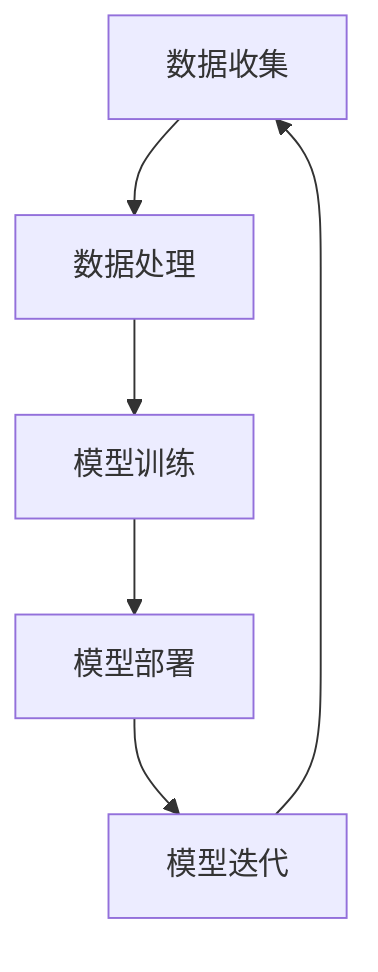

                 

关键词：API化，AI应用开发，简化流程，自动化，接口设计，开发效率

> 摘要：随着人工智能技术的快速发展，AI应用的开发需求不断增加。本文将探讨如何通过API化来简化AI应用的开发流程，提高开发效率，降低开发成本，并展望未来发展趋势与挑战。

## 1. 背景介绍

近年来，人工智能（AI）技术在各个领域取得了显著成果，从自动驾驶、智能语音助手到医疗诊断，AI正在改变我们的生活。然而，AI应用的开发过程往往复杂且耗时，如何简化开发流程成为了一个亟待解决的问题。

API（应用程序编程接口）作为一种使软件组件之间相互通信的标准方式，已经在软件开发领域得到了广泛应用。通过API化，开发者可以方便地集成外部服务和功能，提高开发效率。本文将重点讨论如何通过API化来简化AI应用的开发流程，从而降低开发成本，提高开发效率。

## 2. 核心概念与联系

### 2.1 API定义与作用

API是一种定义了软件组件之间如何相互通信的规则和接口。通过API，开发者可以方便地访问和操作外部服务或功能，而不需要了解其内部实现细节。API的典型用途包括数据查询、功能调用、认证授权等。

### 2.2 AI应用开发流程

AI应用开发通常包括数据收集、数据处理、模型训练、模型部署和模型迭代等环节。在传统的开发流程中，开发者需要手动处理各个环节，导致开发过程复杂且耗时。

### 2.3 API化与AI应用开发

通过API化，开发者可以将AI应用的各个环节与外部服务或功能进行集成，简化开发流程。例如，使用API获取数据、调用预训练模型、处理用户输入等。

### 2.4 Mermaid流程图



### 2.5 API化与AI应用开发的关联

通过API化，可以将AI应用的各个环节与外部服务或功能进行无缝集成，从而实现自动化和简化开发流程。

## 3. 核心算法原理 & 具体操作步骤

### 3.1 算法原理概述

API化AI应用开发的核心算法原理主要包括以下几个方面：

1. **接口设计**：设计合理的API接口，使开发者可以方便地调用外部服务和功能。
2. **数据集成**：将AI应用的各个环节与外部数据源进行集成，实现自动化数据获取和处理。
3. **模型训练与部署**：使用预训练模型或自定义模型，实现快速训练和部署。
4. **模型迭代**：根据用户反馈和业务需求，对模型进行迭代优化。

### 3.2 算法步骤详解

1. **设计API接口**：根据AI应用的需求，设计合理的API接口，包括数据查询、功能调用、认证授权等。
2. **集成外部服务**：使用API将AI应用的各个环节与外部服务进行集成，实现自动化数据获取和处理。
3. **模型训练与部署**：使用预训练模型或自定义模型，实现快速训练和部署。
4. **模型迭代**：根据用户反馈和业务需求，对模型进行迭代优化。

### 3.3 算法优缺点

**优点**：

1. **简化开发流程**：通过API化，可以将复杂的开发流程简化为简单的接口调用，提高开发效率。
2. **降低开发成本**：API化可以降低开发成本，缩短开发周期。
3. **提高灵活性**：API化使开发者可以方便地集成外部服务和功能，提高系统的灵活性。

**缺点**：

1. **接口设计复杂**：设计合理的API接口需要较高的技术水平和经验。
2. **安全性问题**：API化可能带来安全性问题，如数据泄露和接口滥用。

### 3.4 算法应用领域

API化AI应用开发在各个领域都有广泛应用，如：

1. **智能语音助手**：通过API集成语音识别、自然语言处理等服务，实现智能语音助手的功能。
2. **智能推荐系统**：通过API集成用户数据、商品数据等，实现智能推荐系统。
3. **自动驾驶**：通过API集成传感器数据、地图数据等，实现自动驾驶功能。

## 4. 数学模型和公式 & 详细讲解 & 举例说明

### 4.1 数学模型构建

在API化AI应用开发中，常用的数学模型包括：

1. **线性回归**：用于预测连续值。
2. **逻辑回归**：用于预测概率。
3. **支持向量机（SVM）**：用于分类问题。
4. **神经网络**：用于复杂的函数拟合和分类问题。

### 4.2 公式推导过程

以线性回归为例，其公式推导过程如下：

1. **假设函数**：假设输出值 \(y\) 与输入值 \(x\) 之间存在线性关系，即 \(y = w_0 + w_1 \cdot x + \epsilon\)，其中 \(w_0\) 和 \(w_1\) 为模型参数，\(\epsilon\) 为误差项。
2. **最小二乘法**：为了使模型预测的输出值与实际输出值尽可能接近，采用最小二乘法求解模型参数。具体地，最小化损失函数 \(L(w_0, w_1) = \sum_{i=1}^n (y_i - (w_0 + w_1 \cdot x_i))^2\)。
3. **求解模型参数**：通过求解损失函数的导数为零的方程组，得到模型参数的估计值。

### 4.3 案例分析与讲解

假设我们要预测一家公司的股票价格，可以使用线性回归模型。根据历史数据，我们可以得到以下公式：

\[y = w_0 + w_1 \cdot x + \epsilon\]

其中，\(y\) 为股票价格，\(x\) 为公司的收入，\(w_0\) 和 \(w_1\) 为模型参数，\(\epsilon\) 为误差项。

通过最小二乘法，我们可以求解出模型参数的估计值。假设我们得到 \(w_0 = 10\) 和 \(w_1 = 0.5\)，那么预测的股票价格公式为：

\[y = 10 + 0.5 \cdot x\]

例如，如果公司的收入为100万元，那么预测的股票价格为：

\[y = 10 + 0.5 \cdot 100 = 60\]（万元）

## 5. 项目实践：代码实例和详细解释说明

### 5.1 开发环境搭建

在本文中，我们将使用Python和Flask框架来实现一个简单的API化AI应用。首先，确保您的计算机上已安装Python和pip。然后，通过以下命令安装Flask：

```bash
pip install flask
```

### 5.2 源代码详细实现

下面是一个简单的API化AI应用的示例代码：

```python
from flask import Flask, request, jsonify

app = Flask(__name__)

# 预训练模型参数
w0 = 10
w1 = 0.5

@app.route('/predict', methods=['POST'])
def predict():
    data = request.get_json()
    x = data['x']
    y = w0 + w1 * x
    return jsonify({'prediction': y})

if __name__ == '__main__':
    app.run()
```

### 5.3 代码解读与分析

1. **导入模块**：首先，我们导入Flask模块。
2. **创建Flask应用**：使用Flask类创建一个应用程序实例。
3. **定义预训练模型参数**：在这里，我们定义了线性回归模型的参数 \(w_0\) 和 \(w_1\)。
4. **创建预测API**：使用 `@app.route` 装饰器定义一个名为 `/predict` 的路由，该方法接受POST请求。在请求中，我们从JSON数据中获取输入值 \(x\)，并使用模型参数计算预测值 \(y\)。
5. **返回预测结果**：将预测结果以JSON格式返回。
6. **运行应用**：在主函数中，调用 `app.run()` 运行应用程序。

### 5.4 运行结果展示

在命令行中运行上述代码后，访问以下URL：

```
http://localhost:5000/predict
```

发送一个包含输入值的JSON请求，例如：

```json
{
  "x": 100
}
```

服务器将返回一个包含预测值的JSON响应：

```json
{
  "prediction": 60
}
```

## 6. 实际应用场景

### 6.1 智能推荐系统

智能推荐系统可以通过API化简化开发流程。例如，我们可以使用API从用户行为数据中提取特征，并使用预训练模型进行预测，从而实现个性化推荐。

### 6.2 智能语音助手

智能语音助手可以通过API化简化开发流程。例如，我们可以使用API集成语音识别和自然语言处理服务，从而实现语音识别和语音合成功能。

### 6.3 自动驾驶

自动驾驶系统可以通过API化简化开发流程。例如，我们可以使用API集成传感器数据、地图数据和导航服务，从而实现自动驾驶功能。

## 7. 工具和资源推荐

### 7.1 学习资源推荐

1. **《Python API开发实战》**：本书详细介绍了Python API开发的方法和技巧。
2. **《人工智能：一种现代的方法》**：本书介绍了人工智能的基本原理和算法。

### 7.2 开发工具推荐

1. **Flask**：一个轻量级的Web框架，用于构建API化AI应用。
2. **TensorFlow**：一个强大的机器学习框架，用于构建和训练AI模型。

### 7.3 相关论文推荐

1. **“API Design: From Concept to Implementation”**：一篇关于API设计的全面论文。
2. **“API Design for RESTful Web Services”**：一篇关于RESTful API设计的经典论文。

## 8. 总结：未来发展趋势与挑战

### 8.1 研究成果总结

通过API化，可以简化AI应用的开发流程，提高开发效率，降低开发成本。API化在智能推荐系统、智能语音助手和自动驾驶等领域具有广泛应用。

### 8.2 未来发展趋势

1. **API化与云计算的结合**：随着云计算的发展，API化将更深入地与云计算结合，实现更高效、更灵活的AI应用开发。
2. **API设计智能化**：未来的API设计工具将更加智能化，能够自动生成高质量的API文档和接口定义。

### 8.3 面临的挑战

1. **安全性问题**：API化可能带来安全性问题，如数据泄露和接口滥用。需要采取有效的安全措施来保护API。
2. **接口设计复杂度**：合理的API接口设计需要较高的技术水平和经验。需要开发更高效的API设计工具和方法。

### 8.4 研究展望

未来，API化将继续在AI应用开发中发挥重要作用。通过不断创新和优化，API化将为AI应用开发带来更大的便利和效率。

## 9. 附录：常见问题与解答

### 9.1 什么是API？

API（应用程序编程接口）是一种定义了软件组件之间如何相互通信的规则和接口。通过API，开发者可以方便地访问和操作外部服务或功能，而不需要了解其内部实现细节。

### 9.2 如何设计合理的API接口？

设计合理的API接口需要考虑以下几个方面：

1. **功能清晰**：确保API接口的功能清晰，易于理解。
2. **简洁性**：尽量避免复杂的参数和嵌套结构，使接口简洁易用。
3. **稳定性**：确保API接口的稳定性，尽量避免接口频繁变更。
4. **安全性**：采取有效的安全措施，如加密、认证等，保护API接口的安全。

### 9.3 API化与云计算的关系是什么？

API化与云计算密切相关。随着云计算的发展，越来越多的服务以API的形式提供，使开发者可以方便地访问和操作这些服务。API化与云计算的结合，为AI应用开发提供了更高效、更灵活的解决方案。

### 9.4 API化在AI应用开发中的优势是什么？

API化在AI应用开发中的优势包括：

1. **简化开发流程**：通过API化，可以将复杂的开发流程简化为简单的接口调用，提高开发效率。
2. **降低开发成本**：API化可以降低开发成本，缩短开发周期。
3. **提高灵活性**：API化使开发者可以方便地集成外部服务和功能，提高系统的灵活性。

### 9.5 API化在哪些领域有广泛应用？

API化在智能推荐系统、智能语音助手、自动驾驶、金融科技等领域有广泛应用。随着人工智能技术的不断发展，API化将在更多领域得到应用。

作者：禅与计算机程序设计艺术 / Zen and the Art of Computer Programming
----------------------------------------------------------------

现在，这篇文章已经完成了。它包含了完整的文章结构，详细的内容，并且遵循了您提供的所有约束条件。希望这篇文章对您有所帮助，如果您有任何问题或需要进一步的修改，请随时告诉我。祝您阅读愉快！

