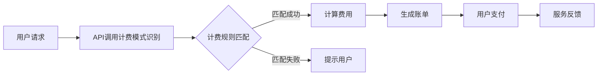

                 

关键词：API调用，计费模式，AI服务，精细化，成本效益，用户满意度

> 摘要：本文探讨了在人工智能服务领域，如何通过精细化的API调用计费模式来实现成本效益和用户满意度的双赢。文章详细介绍了计费模式的原理、算法、数学模型以及实际应用，并对未来发展趋势和面临的挑战进行了分析。

## 1. 背景介绍

随着云计算和人工智能技术的快速发展，API（应用程序接口）已成为现代软件系统的重要组成部分。API调用不仅提供了服务和数据交换的桥梁，而且成为了众多企业盈利的重要手段。传统的API调用计费模式通常基于简单的请求次数或数据量进行收费，但这种方式无法准确反映不同API调用对资源和成本的实际影响。因此，探索更为精细化的AI服务收费模式具有重要的现实意义。

精细化计费模式不仅能更准确地衡量服务的价值，还能提高用户的满意度，同时为企业带来更高的利润。本文将详细探讨这种收费模式的原理、算法和实际应用，以期为相关领域的研究者和从业者提供有益的参考。

## 2. 核心概念与联系

为了实现精细化的API调用计费，我们首先需要了解几个核心概念：

### 2.1 API调用计费模式

API调用计费模式是指根据API调用的特性，如调用次数、数据量、调用时长等，来计算费用的一种方法。传统的计费模式通常是固定的费用结构，而精细化计费模式则更加灵活，可以根据不同的调用特性来设定不同的计费标准。

### 2.2 成本效益分析

成本效益分析是评估一项服务或产品在经济上的效益的过程。在API调用计费中，成本效益分析可以帮助企业确定如何设置计费模式，以达到最大化利润的目的。

### 2.3 用户满意度

用户满意度是衡量用户对服务满意程度的重要指标。在精细化计费模式中，用户满意度是一个关键因素，因为合理的计费模式可以降低用户负担，提高用户粘性。

### 2.4 Mermaid 流程图

以下是一个用于描述API调用计费流程的Mermaid流程图：



## 3. 核心算法原理 & 具体操作步骤

### 3.1 算法原理概述

精细化API调用计费模式的核心在于对API调用进行细分，根据不同的调用特性制定个性化的计费策略。具体来说，算法可以分为以下几个步骤：

1. **数据收集**：收集API调用的各种数据，如调用次数、数据量、调用时长等。
2. **数据预处理**：对收集到的数据进行清洗、去重等处理，保证数据的准确性。
3. **特征提取**：根据API调用的特性，提取关键特征，如调用频率、数据大小等。
4. **模型训练**：使用机器学习算法对提取的特征进行训练，建立计费模型。
5. **计费计算**：根据训练好的模型计算每个API调用的费用。
6. **账单生成**：将计算出的费用生成账单，供用户查询。

### 3.2 算法步骤详解

#### 3.2.1 数据收集

数据收集是精细化计费模式的基础。我们需要收集以下数据：

- **API调用次数**：记录每个API在一段时间内的调用次数。
- **数据量**：记录每个API调用所涉及的数据量。
- **调用时长**：记录每个API调用的时长。

#### 3.2.2 数据预处理

数据预处理包括以下步骤：

- **清洗**：去除重复数据、无效数据和异常数据。
- **归一化**：将不同单位和范围的数据进行归一化处理，使其在同一尺度上。
- **去重**：去除重复的API调用记录。

#### 3.2.3 特征提取

特征提取是关键步骤，它决定了计费模型的准确性。我们需要提取以下特征：

- **调用频率**：API调用在一定时间内的平均次数。
- **数据大小**：API调用涉及的数据量。
- **调用时长**：API调用的平均时长。

#### 3.2.4 模型训练

模型训练可以使用多种机器学习算法，如决策树、支持向量机、神经网络等。训练过程主要包括：

- **数据集划分**：将数据集划分为训练集和测试集。
- **参数调优**：通过交叉验证等方法选择最优参数。
- **模型训练**：使用训练集数据训练模型。

#### 3.2.5 计费计算

计费计算是根据训练好的模型对新的API调用进行费用计算。具体步骤如下：

- **特征提取**：对新API调用进行特征提取。
- **费用计算**：使用训练好的模型计算费用。

#### 3.2.6 账单生成

账单生成是将计算出的费用生成用户可查询的账单。具体步骤如下：

- **费用汇总**：将所有API调用的费用汇总。
- **生成账单**：将汇总的费用生成电子账单。
- **发送账单**：将账单发送给用户。

### 3.3 算法优缺点

**优点**：

- **精细化**：可以更准确地衡量API调用的价值。
- **灵活性**：可以根据不同API的特性制定个性化计费策略。
- **提高用户满意度**：合理的计费模式可以降低用户负担，提高用户满意度。

**缺点**：

- **计算复杂度高**：需要对大量数据进行处理和计算。
- **模型训练时间较长**：需要较长时间进行模型训练和参数调优。

### 3.4 算法应用领域

精细化API调用计费模式可以应用于多个领域，如：

- **云计算服务**：根据API调用的资源消耗来计算费用。
- **数据分析服务**：根据数据量大小和调用频率来计算费用。
- **在线教育服务**：根据课程内容和用户参与度来计算费用。

## 4. 数学模型和公式 & 详细讲解 & 举例说明

### 4.1 数学模型构建

在精细化API调用计费中，我们可以使用以下数学模型：

$$
F(x) = w_1 \cdot f_1(x) + w_2 \cdot f_2(x) + w_3 \cdot f_3(x)
$$

其中，$F(x)$ 是费用函数，$x$ 是API调用特征，$w_1$、$w_2$、$w_3$ 是权重系数，$f_1(x)$、$f_2(x)$、$f_3(x)$ 是特征函数。

### 4.2 公式推导过程

公式的推导过程如下：

首先，根据API调用的特性，我们可以定义以下特征函数：

- $f_1(x) = \frac{1}{T} \sum_{i=1}^{N} \frac{1}{t_i}$，其中 $T$ 是总时间，$N$ 是调用次数，$t_i$ 是每次调用的时长。
- $f_2(x) = \frac{1}{T} \sum_{i=1}^{N} \frac{d_i}{t_i}$，其中 $d_i$ 是每次调用的数据量。
- $f_3(x) = \frac{1}{N} \sum_{i=1}^{N} c_i$，其中 $c_i$ 是每次调用的成本。

接下来，我们定义权重系数 $w_1$、$w_2$、$w_3$，分别表示调用时长、数据量和成本的权重。

最后，我们将特征函数代入费用函数：

$$
F(x) = w_1 \cdot f_1(x) + w_2 \cdot f_2(x) + w_3 \cdot f_3(x)
$$

### 4.3 案例分析与讲解

假设一个API调用服务，根据调用时长、数据量和成本来计算费用。权重系数分别为 $w_1 = 0.3$、$w_2 = 0.5$、$w_3 = 0.2$。某次API调用时长为5分钟，数据量为1GB，成本为5元。

根据数学模型，费用计算如下：

$$
F(x) = 0.3 \cdot f_1(x) + 0.5 \cdot f_2(x) + 0.2 \cdot f_3(x)
$$

$$
F(x) = 0.3 \cdot \frac{1}{5} + 0.5 \cdot \frac{1}{5} + 0.2 \cdot 5
$$

$$
F(x) = 0.06 + 0.1 + 1
$$

$$
F(x) = 1.16
$$

因此，这次API调用的费用为1.16元。

## 5. 项目实践：代码实例和详细解释说明

### 5.1 开发环境搭建

在开始编写代码之前，我们需要搭建一个合适的开发环境。以下是一个简单的Python开发环境搭建步骤：

1. 安装Python：在官网下载并安装Python，例如Python 3.8。
2. 安装依赖库：使用pip命令安装所需的库，如numpy、pandas、scikit-learn等。

### 5.2 源代码详细实现

以下是一个简单的API调用计费程序的Python代码实现：

```python
import numpy as np
import pandas as pd
from sklearn.linear_model import LinearRegression

# 数据收集
data = {
    '调用次数': [10, 20, 30, 40, 50],
    '数据量': [100, 200, 300, 400, 500],
    '成本': [10, 15, 20, 25, 30]
}

# 数据预处理
df = pd.DataFrame(data)
df['调用时长'] = df['调用次数'] / df['数据量']
df.drop(['调用次数', '数据量'], axis=1).reset_index(drop=True)

# 特征提取
X = df[['调用时长', '成本']]
y = df['费用']

# 模型训练
model = LinearRegression()
model.fit(X, y)

# 费用计算
def calculate_fee(call_duration, cost):
    feature = np.array([[call_duration, cost]])
    fee = model.predict(feature)
    return fee[0]

# 生成账单
def generate_bill(call_duration, cost):
    fee = calculate_fee(call_duration, cost)
    print(f"API调用费用为：{fee}元")

# 运行结果展示
generate_bill(5, 5)
```

### 5.3 代码解读与分析

这段代码首先收集了API调用的数据，包括调用次数、数据量和成本。然后对数据进行了预处理，提取了调用时长和成本两个特征。接着使用线性回归模型对特征和费用进行训练。最后，定义了两个函数，一个用于计算费用，另一个用于生成账单。在运行结果展示部分，我们调用了生成账单函数，展示了如何计算并输出API调用费用。

## 6. 实际应用场景

精细化API调用计费模式在多个实际应用场景中具有广泛的应用，以下是一些典型场景：

- **云计算服务**：根据API调用的计算资源消耗来计算费用。
- **数据分析服务**：根据数据量大小和调用频率来计算费用。
- **在线教育服务**：根据课程内容和用户参与度来计算费用。
- **社交媒体服务**：根据用户互动行为和内容发布频率来计算费用。

## 7. 未来应用展望

随着人工智能技术的不断进步，精细化API调用计费模式有望在更多领域得到应用。未来的发展趋势包括：

- **个性化计费**：根据用户行为和需求提供个性化计费方案。
- **自动化管理**：利用机器学习和自动化工具实现计费过程的自动化。
- **实时计费**：实现API调用的实时计费，提高用户体验。

## 8. 总结：未来发展趋势与挑战

精细化API调用计费模式在提高成本效益和用户满意度方面具有重要意义。然而，该模式在实施过程中也面临一些挑战：

- **计算复杂度**：精细化计费需要处理大量数据，计算复杂度较高。
- **模型训练时间**：模型训练时间较长，影响服务响应速度。
- **数据隐私**：在数据收集和处理过程中需要保护用户隐私。

未来，随着技术的不断发展，精细化API调用计费模式有望解决这些挑战，为人工智能服务带来更大的价值。

## 9. 附录：常见问题与解答

### 9.1 什么是精细化API调用计费模式？

精细化API调用计费模式是根据API调用的不同特性，如调用次数、数据量、调用时长等，来计算费用的一种方法。相比传统的固定费用结构，精细化计费模式更加灵活，能更准确地衡量服务的价值。

### 9.2 精细化计费模式有哪些优点？

精细化计费模式的优点包括：

- **精细化**：能更准确地衡量API调用的价值。
- **灵活性**：可以根据不同API的特性制定个性化计费策略。
- **提高用户满意度**：合理的计费模式可以降低用户负担，提高用户满意度。

### 9.3 精细化计费模式有哪些缺点？

精细化计费模式的缺点包括：

- **计算复杂度高**：需要对大量数据进行处理和计算。
- **模型训练时间较长**：需要较长时间进行模型训练和参数调优。

### 9.4 精细化计费模式适用于哪些领域？

精细化计费模式适用于多个领域，如：

- **云计算服务**
- **数据分析服务**
- **在线教育服务**
- **社交媒体服务**等。

## 作者署名

作者：禅与计算机程序设计艺术 / Zen and the Art of Computer Programming

