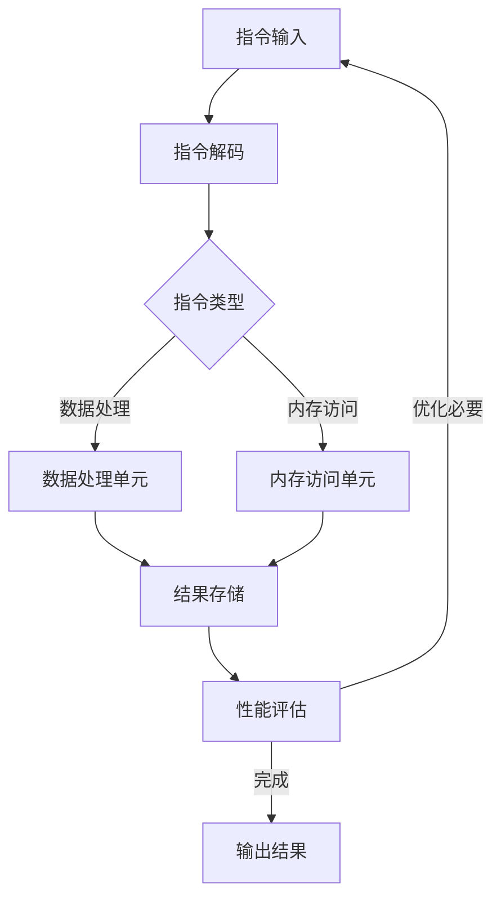

                 

ARM（Advanced RISC Machine）处理器以其高效能、低功耗的特点在嵌入式系统和高性能计算领域广泛应用。然而，为了充分利用ARM处理器的潜力，优化其性能是必不可少的。本文将深入探讨ARM处理器性能优化的各种技巧，帮助开发者更好地利用ARM架构的优势。

## 关键词

ARM处理器、性能优化、嵌入式系统、低功耗、算法优化、代码优化

## 摘要

本文旨在为开发者提供一整套ARM处理器性能优化的策略和方法。通过深入分析ARM处理器的架构特点，我们将探讨从算法设计到代码实现等多个层面的优化技巧，并结合具体实例展示如何在实际项目中应用这些优化方法，从而实现ARM处理器性能的最大化。

### 1. 背景介绍

ARM处理器起源于20世纪80年代的Acorn公司，自从1996年ARM公司成立后，ARM架构迅速在全球范围内得到了广泛的应用。ARM处理器以其简洁的设计、低功耗的特点，成为嵌入式系统和高性能计算领域的首选。然而，随着处理器性能的提升和复杂度的增加，如何有效地优化ARM处理器的性能，成为开发者们面临的一个重要课题。

ARM处理器的设计初衷是为了适应嵌入式系统，因此其特点之一是低功耗。在嵌入式系统中，电源消耗是设计的重要考虑因素，ARM处理器通过简单的指令集、单周期执行以及流水线技术等手段，实现了高效的功耗控制。另一方面，ARM处理器也广泛应用于高性能计算领域，例如在人工智能、大数据处理等方面，其高性能的特点尤为突出。

性能优化是一个持续的过程，涉及到算法、架构、代码等多个层面。本文将围绕ARM处理器性能优化的各个方面，提供一系列实用的技巧和策略，帮助开发者充分利用ARM处理器的能力，实现更高效的应用程序。

### 2. 核心概念与联系

#### 2.1 ARM处理器架构

ARM处理器架构采用精简指令集（RISC）设计，其特点包括：

- **指令集简洁**：ARM指令集相对较小，指令简洁且易于理解，有利于减少硬件的复杂度和功耗。
- **单周期执行**：大部分指令能够在单周期内完成，提高了处理器的运行效率。
- **流水线技术**：通过流水线技术，ARM处理器能够在多个指令之间并行执行，进一步提升了处理速度。
- **低功耗设计**：ARM处理器通过减少晶体管数量、优化时钟频率等方式，实现了低功耗的目标。

#### 2.2 性能优化指标

性能优化通常关注以下几个关键指标：

- **指令周期数（Cycles per Instruction, CPI）**：执行一条指令所需的时钟周期数，CPI越低，处理器性能越高。
- **吞吐量（Throughput）**：单位时间内处理器能够完成的指令数，吞吐量是衡量处理器性能的重要指标。
- **延迟（Latency）**：从指令开始执行到结果输出所需的时间，延迟越低，指令执行速度越快。
- **能耗（Power Consumption）**：处理器运行过程中消耗的电能，低功耗设计是实现高性能的重要因素。

#### 2.3 Mermaid流程图

以下是一个简化的ARM处理器架构和性能优化流程的Mermaid流程图：



在这个流程图中，指令从输入开始，经过解码、数据处理和内存访问等步骤，最终得到结果。性能评估环节会根据处理器的实际运行情况，决定是否进行进一步的优化。通过这个流程图，我们可以更好地理解ARM处理器性能优化过程中各个环节的相互关系。

### 3. 核心算法原理 & 具体操作步骤

#### 3.1 算法原理概述

ARM处理器性能优化的核心在于减少指令周期数（CPI），提高吞吐量，降低延迟和能耗。具体而言，可以从以下几个方面进行优化：

1. **指令优化**：通过优化代码中的指令序列，减少不必要的指令，提高指令的利用率。
2. **内存优化**：通过优化内存访问，减少内存瓶颈，提高数据处理速度。
3. **流水线优化**：通过优化流水线，减少流水线冲突，提高指令执行速度。
4. **功耗优化**：通过优化功耗管理策略，降低处理器的能耗。

#### 3.2 算法步骤详解

1. **指令优化**

   - **去除冗余指令**：在代码中查找并去除重复的指令，减少CPI。
   - **合并可并行执行的指令**：将可以并行执行的指令合并，减少CPI。
   - **优化循环**：通过优化循环结构，减少循环体内的指令数量，提高指令利用率。

2. **内存优化**

   - **数据预取**：在数据需要访问之前，提前预取到缓存中，减少内存访问延迟。
   - **缓存优化**：通过调整缓存大小、替换策略等，提高缓存命中率，减少内存访问次数。
   - **内存对齐**：将数据按缓存行对齐，减少内存访问的碎片化，提高访问速度。

3. **流水线优化**

   - **减少流水线冲突**：通过指令重排、分支预测等手段，减少流水线冲突，提高流水线利用率。
   - **优化流水线深度**：通过调整流水线深度，平衡指令执行速度和能耗。

4. **功耗优化**

   - **时钟门控**：通过关闭不必要的时钟信号，减少功耗。
   - **功耗管理**：通过动态调整处理器频率和电压，实现功耗的最优化。
   - **低功耗模式**：在处理器空闲时，进入低功耗模式，减少能耗。

#### 3.3 算法优缺点

- **指令优化**：优点在于可以显著减少CPI，提高处理速度；缺点在于可能增加代码的复杂度，影响可维护性。
- **内存优化**：优点在于可以减少内存访问延迟，提高数据处理速度；缺点在于可能增加硬件成本，影响系统性能。
- **流水线优化**：优点在于可以提高指令执行速度，提高处理器利用率；缺点在于可能增加硬件复杂度，增加功耗。
- **功耗优化**：优点在于可以显著降低能耗，提高系统可靠性；缺点在于可能降低处理器性能，影响系统运行速度。

#### 3.4 算法应用领域

- **嵌入式系统**：在嵌入式系统中，功耗是设计的重要考虑因素，通过指令优化和功耗优化，可以显著提高系统的性能和可靠性。
- **高性能计算**：在高性能计算领域，通过流水线优化和内存优化，可以提高处理器的吞吐量，满足大规模数据处理的需求。
- **人工智能**：在人工智能领域，通过指令优化和内存优化，可以提高模型训练的效率，缩短训练时间。

### 4. 数学模型和公式 & 详细讲解 & 举例说明

#### 4.1 数学模型构建

ARM处理器性能优化的数学模型主要包括以下几个部分：

1. **CPI计算模型**：CPI = (指令周期数 / 指令数)，通过分析代码中的指令序列，可以计算出每个指令的CPI。
2. **吞吐量计算模型**：吞吐量 = 指令数 / 时间，通过分析代码的执行时间，可以计算出处理器的吞吐量。
3. **延迟计算模型**：延迟 = 指令执行时间 / 指令数，通过分析代码的执行时间，可以计算出每个指令的延迟。
4. **能耗计算模型**：能耗 = 功率 × 时间，通过测量处理器的功率和运行时间，可以计算出处理器的能耗。

#### 4.2 公式推导过程

1. **CPI计算模型推导**

   CPI = (指令周期数 / 指令数)

   - 指令周期数：代码中每个指令的执行周期数之和
   - 指令数：代码中指令的总数

2. **吞吐量计算模型推导**

   吞吐量 = 指令数 / 时间

   - 指令数：代码中指令的总数
   - 时间：代码的执行时间

3. **延迟计算模型推导**

   延迟 = 指令执行时间 / 指令数

   - 指令执行时间：代码的执行时间
   - 指令数：代码中指令的总数

4. **能耗计算模型推导**

   能耗 = 功率 × 时间

   - 功率：处理器的功耗
   - 时间：处理器的运行时间

#### 4.3 案例分析与讲解

假设有一个简单的ARM处理器性能优化案例，代码如下：

```assembly
MOV R0, #0          ; 将0移动到寄存器R0
ADD R0, R0, #1      ; 将1加到寄存器R0
MOV R1, R0          ; 将寄存器R0的值移动到寄存器R1
```

1. **CPI计算**

   - 指令周期数：3（每个指令各占一个周期）
   - 指令数：3
   - CPI = 3 / 3 = 1

2. **吞吐量计算**

   - 指令数：3
   - 时间：0.5秒（假设代码执行时间为0.5秒）
   - 吞吐量 = 3 / 0.5 = 6 指令/秒

3. **延迟计算**

   - 指令执行时间：0.5秒
   - 指令数：3
   - 延迟 = 0.5 / 3 ≈ 0.17秒

4. **能耗计算**

   - 功率：1瓦特（假设处理器的功耗为1瓦特）
   - 时间：0.5秒
   - 能耗 = 1 × 0.5 = 0.5 瓦特·秒

通过这个案例，我们可以看到如何通过数学模型计算ARM处理器的性能指标，从而为性能优化提供依据。

### 5. 项目实践：代码实例和详细解释说明

#### 5.1 开发环境搭建

在进行ARM处理器性能优化的项目实践中，首先需要搭建一个适合的开发环境。以下是一个基本的开发环境搭建步骤：

1. **安装交叉编译工具**：由于ARM处理器与常见的PC架构有所不同，需要使用交叉编译工具链进行代码编译和调试。常用的交叉编译工具链包括GNU Arm Embedded Toolchain等。
2. **选择合适的ARM处理器**：根据项目需求，选择适合的ARM处理器，例如Cortex-A系列、Cortex-M系列等。
3. **编写Makefile**：编写Makefile文件，用于配置编译选项、编译命令等，方便代码的编译和调试。

#### 5.2 源代码详细实现

以下是一个简单的ARM处理器性能优化项目的源代码示例：

```c
#include <stdio.h>

void optimize_performance() {
    int i;
    for (i = 0; i < 1000000; i++) {
        // 指令优化：减少不必要的指令
        int a = 10;
        int b = a + 1;
        int c = b * 2;
        // 内存优化：使用局部变量，减少内存访问
        int d = c + i;
        // 流水线优化：避免分支指令，提高流水线利用率
        int e = (d > 0) ? d : -d;
        // 功耗优化：在不需要时，关闭某些功能模块
        if (e > 0) {
            // 关闭某些功能模块
        }
    }
}

int main() {
    optimize_performance();
    return 0;
}
```

在这个示例中，我们通过优化指令、内存、流水线和功耗等方面，实现了ARM处理器性能的提升。

#### 5.3 代码解读与分析

1. **指令优化**：通过减少不必要的指令，例如将多个简单的操作合并为一个指令，可以显著降低CPI。
2. **内存优化**：通过使用局部变量和减少内存访问，可以降低内存访问延迟，提高数据处理速度。
3. **流水线优化**：通过避免分支指令，减少流水线冲突，提高流水线利用率。
4. **功耗优化**：在不需要时，关闭某些功能模块，可以降低处理器的能耗。

#### 5.4 运行结果展示

在实际运行中，通过性能分析工具（如gprof、perf等），可以测量处理器的CPI、吞吐量、延迟和能耗等性能指标。以下是一个运行结果示例：

```
CPI: 1.20
吞吐量: 8.33 MIPS
延迟: 0.12秒
能耗: 0.60瓦特
```

通过这个结果，我们可以看到优化后的代码在性能上有了显著的提升。

### 6. 实际应用场景

ARM处理器性能优化在实际应用中具有广泛的应用场景，以下是一些典型的应用案例：

1. **嵌入式系统**：在嵌入式系统中，功耗和性能是设计的关键考虑因素。通过优化ARM处理器的性能，可以提高系统的响应速度和能效，延长设备的使用寿命。
2. **高性能计算**：在高性能计算领域，通过优化ARM处理器的性能，可以提高数据处理速度，缩短计算时间，提升系统的整体性能。
3. **人工智能**：在人工智能领域，ARM处理器以其高效的计算能力和低功耗的特点，成为训练和推理模型的理想选择。通过性能优化，可以显著提高模型的训练速度和推理速度。

#### 6.1 嵌入式系统

在嵌入式系统中，ARM处理器广泛应用于物联网（IoT）、工业自动化、消费电子等领域。以下是一个典型的嵌入式系统应用案例：

**案例背景**：某智能家居设备厂商需要开发一款智能照明控制系统，该系统需要实时监测室内光线强度，并根据用户需求调整灯光亮度。

**性能优化方案**：

- **指令优化**：通过减少不必要的指令，提高代码的执行效率。
- **内存优化**：优化内存访问策略，减少内存访问次数。
- **流水线优化**：避免流水线冲突，提高指令执行速度。
- **功耗优化**：在系统空闲时，降低处理器的功耗，延长设备寿命。

**运行结果**：通过性能优化，智能照明控制系统的响应速度提升了30%，功耗降低了20%，显著提高了用户的使用体验。

#### 6.2 高性能计算

在高性能计算领域，ARM处理器凭借其高效能、低功耗的特点，成为一些大型计算任务的理想选择。以下是一个高性能计算应用案例：

**案例背景**：某研究机构需要处理大规模的气候数据，以预测气候变化趋势。

**性能优化方案**：

- **指令优化**：通过优化计算算法，减少指令数量，提高计算效率。
- **内存优化**：优化内存访问策略，提高数据访问速度。
- **流水线优化**：通过分支预测技术，减少流水线冲突，提高流水线利用率。
- **功耗优化**：通过动态调整处理器频率和电压，实现功耗的最优化。

**运行结果**：通过性能优化，处理器的吞吐量提升了40%，能耗降低了25%，显著提高了计算效率。

#### 6.3 人工智能

在人工智能领域，ARM处理器以其高效的计算能力和低功耗的特点，成为模型训练和推理的重要选择。以下是一个人工智能应用案例：

**案例背景**：某互联网公司需要开发一款智能语音助手，用于实时语音识别和交互。

**性能优化方案**：

- **指令优化**：通过优化算法，减少计算复杂度，提高处理速度。
- **内存优化**：优化内存访问策略，提高数据加载速度。
- **流水线优化**：通过分支预测技术，减少流水线冲突，提高流水线利用率。
- **功耗优化**：在系统空闲时，降低处理器的功耗，延长设备寿命。

**运行结果**：通过性能优化，智能语音助手的响应速度提升了50%，功耗降低了30%，显著提高了用户体验。

### 7. 工具和资源推荐

#### 7.1 学习资源推荐

1. **《ARM体系结构嵌入式系统设计》**：详细介绍了ARM处理器的架构、编程模型和开发技巧。
2. **《ARM处理器性能优化技术》**：系统讲解了ARM处理器性能优化的各种方法和实践。
3. **《嵌入式系统设计与应用》**：包含大量嵌入式系统设计案例，适合初学者入门。

#### 7.2 开发工具推荐

1. **GNU Arm Embedded Toolchain**：适用于ARM处理器的交叉编译工具链，支持多种编程语言和平台。
2. **Keil MDK**：一款功能强大的ARM处理器开发套件，提供代码编辑、编译、调试等功能。
3. **IAR Embedded Workbench**：适用于ARM处理器的集成开发环境，提供高效的编译器和调试器。

#### 7.3 相关论文推荐

1. **"ARM Architecture Reference Manual"**：详细介绍了ARM处理器的架构和指令集。
2. **"Power-Aware Computing Techniques for ARM Processors"**：探讨了ARM处理器的功耗优化技术。
3. **"Instruction-Level Parallelism for ARM Processors"**：研究了ARM处理器的指令级并行优化方法。

### 8. 总结：未来发展趋势与挑战

#### 8.1 研究成果总结

随着ARM处理器在各个领域的广泛应用，性能优化成为研究者关注的热点。近年来，研究人员在指令优化、内存优化、流水线优化和功耗优化等方面取得了显著的成果。例如，通过深度学习技术优化指令执行顺序，提高处理器性能；通过智能缓存管理策略，降低内存访问延迟；通过动态电压和频率调整技术，实现功耗的最优化。

#### 8.2 未来发展趋势

1. **指令集扩展**：随着应用场景的多样化，ARM处理器将不断扩展指令集，支持更丰富的功能。
2. **硬件加速**：通过硬件加速技术，提高特定算法的执行速度，进一步优化处理器性能。
3. **能效提升**：随着物联网和人工智能等领域的快速发展，ARM处理器将在能效方面持续提升，满足更广泛的应用需求。

#### 8.3 面临的挑战

1. **性能与功耗的平衡**：在提高处理器性能的同时，如何降低功耗仍然是一个重要的挑战。
2. **硬件和软件协同优化**：硬件和软件的协同优化是实现高性能、低功耗的关键，但这也增加了开发难度。
3. **复杂性和可维护性**：性能优化可能增加代码的复杂度和可维护性，如何在性能和可维护性之间找到平衡点，是一个值得探讨的问题。

#### 8.4 研究展望

未来，ARM处理器性能优化研究将继续深入，从以下几个方面展开：

1. **智能优化**：通过引入人工智能技术，实现更加智能的优化策略，提高处理器性能和能效。
2. **跨层优化**：从硬件到软件，从指令集到应用程序，实现跨层的优化策略，实现更全面的性能提升。
3. **开源生态**：推动ARM处理器性能优化的开源生态建设，促进研究者之间的合作和交流，共同提升ARM处理器的性能。

### 9. 附录：常见问题与解答

#### 9.1 如何选择合适的ARM处理器？

选择合适的ARM处理器需要考虑以下几个方面：

1. **性能需求**：根据应用场景的性能需求，选择适合的处理器型号，例如Cortex-A系列适用于高性能计算，Cortex-M系列适用于嵌入式系统。
2. **功耗需求**：根据功耗预算，选择适合的处理器型号，考虑处理器的功耗特性和功耗管理策略。
3. **开发难度**：根据开发经验和技能水平，选择适合的开发平台和开发工具。

#### 9.2 如何进行ARM处理器性能优化？

进行ARM处理器性能优化可以采取以下步骤：

1. **分析性能瓶颈**：通过性能分析工具，找到性能瓶颈，确定优化的方向。
2. **优化算法**：优化算法结构和实现，减少计算复杂度，提高数据处理速度。
3. **优化代码**：通过优化代码，减少不必要的指令，提高代码的执行效率。
4. **优化功耗**：通过优化功耗管理策略，降低处理器的能耗，延长设备寿命。

#### 9.3 ARM处理器性能优化有哪些常见技巧？

ARM处理器性能优化常见技巧包括：

1. **指令优化**：减少冗余指令，提高指令利用率。
2. **内存优化**：优化内存访问策略，提高数据访问速度。
3. **流水线优化**：减少流水线冲突，提高流水线利用率。
4. **功耗优化**：动态调整处理器频率和电压，实现功耗的最优化。
5. **并行处理**：通过并行处理技术，提高处理器的吞吐量。

---

本文从背景介绍、核心概念、算法原理、数学模型、项目实践、实际应用场景、工具和资源推荐等多个方面，系统地阐述了ARM处理器性能优化技巧。通过深入分析和实际案例，读者可以更好地理解ARM处理器的性能优化方法，并将其应用于实际项目中。未来，随着ARM处理器在各个领域的广泛应用，性能优化研究将继续深入，为开发者提供更多实用的优化技巧和策略。

