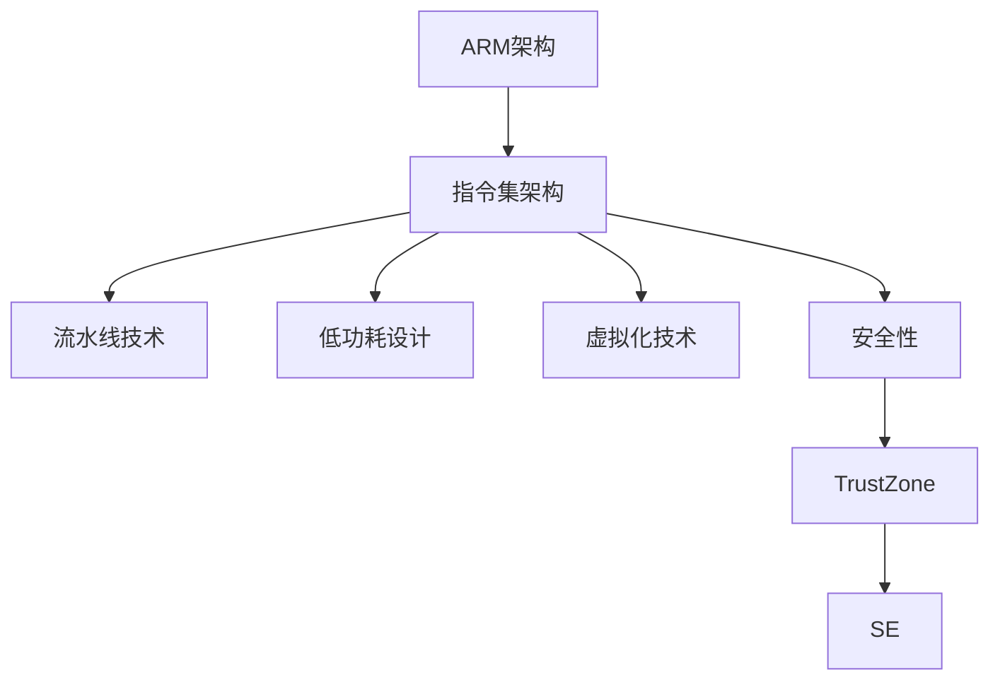

                 

### 关键词 Keywords
ARM架构、移动设备、嵌入式设备、性能优化、能效设计、指令集架构、虚拟化、安全性。

<|assistant|>### 摘要 Abstract
本文将深入探讨ARM架构在移动和嵌入式设备领域的核心作用，以及其在性能优化和能效设计方面的关键特性。我们将通过剖析ARM指令集架构、虚拟化技术、安全性等要素，展现ARM如何在当前日益增长的市场需求中占据主导地位。同时，文章还将展望ARM架构的未来发展趋势，以及面临的挑战和机遇。

<|assistant|>### 1. 背景介绍

ARM（Advanced RISC Machines）公司成立于1990年，是一家专注于低功耗、高性能处理器架构设计的公司。ARM架构自推出以来，以其强大的可扩展性和灵活性在移动和嵌入式设备领域取得了巨大成功。如今，ARM架构已成为全球范围内移动设备和嵌入式设备的核心技术，被广泛应用于智能手机、平板电脑、物联网设备、汽车电子、工业控制等众多领域。

随着移动互联网的快速发展，移动设备对处理性能和能效的需求日益增长。ARM架构通过持续的创新，不断推出新一代处理器内核，满足市场对高性能、低功耗的需求。ARM处理器在性能和能效上的优势，使其在移动和嵌入式设备市场上占据了重要地位，许多知名厂商如苹果、三星、华为等均采用ARM架构的处理器。

此外，ARM架构在安全性方面也具备独特优势。随着物联网和云计算的兴起，网络安全成为越来越重要的问题。ARM架构提供了丰富的安全特性，如TrustZone、SE等，为设备提供了强大的安全保护。

<|assistant|>### 2. 核心概念与联系

#### 2.1 ARM架构基本概念

ARM架构是一种精简指令集计算机（RISC）架构，其核心思想是通过简化和优化指令集来提高处理器性能和能效。ARM处理器具有以下核心特点：

- **指令集架构（ISA）**：ARM架构采用32位和64位指令集，支持多种操作模式和寻址方式，能够灵活满足不同应用场景的需求。
- **流水线技术**：ARM处理器采用多级流水线设计，提高了指令吞吐率和处理性能。
- **低功耗设计**：ARM架构注重低功耗设计，通过优化电路、减小晶体管尺寸等方式，实现低功耗高性能。
- **虚拟化技术**：ARM架构支持虚拟化技术，能够在一个处理器上运行多个操作系统和应用程序，提高资源利用率和系统稳定性。
- **安全性**：ARM架构提供多种安全特性，如TrustZone、SE等，确保设备的安全性和隐私保护。

#### 2.2 ARM架构与移动和嵌入式设备的联系

ARM架构在移动和嵌入式设备领域的成功，得益于其与这些设备需求的紧密联系：

- **性能优化**：ARM架构通过多级流水线、指令集优化等技术，提高了处理性能，满足移动和嵌入式设备对高性能的需求。
- **能效设计**：ARM架构的低功耗设计特点，使其在移动和嵌入式设备中具有显著的优势，延长了设备续航时间。
- **硬件兼容性**：ARM处理器具有高度的兼容性，能够支持多种操作系统和编程语言，方便开发者进行应用开发和迁移。
- **市场推广**：ARM公司在全球范围内推广ARM架构，吸引了众多厂商加入，形成了庞大的生态系统，为移动和嵌入式设备市场提供了丰富的解决方案。

#### 2.3 ARM架构的Mermaid流程图



### 3. 核心算法原理 & 具体操作步骤

#### 3.1 算法原理概述

ARM架构的核心算法原理主要涉及以下几个方面：

- **指令集优化**：ARM架构通过简化和优化指令集，提高处理器性能和能效。
- **流水线技术**：ARM处理器采用多级流水线设计，提高指令吞吐率和处理性能。
- **低功耗设计**：ARM架构通过优化电路、减小晶体管尺寸等方式，实现低功耗高性能。
- **虚拟化技术**：ARM架构支持虚拟化技术，提高资源利用率和系统稳定性。
- **安全性**：ARM架构提供多种安全特性，如TrustZone、SE等，确保设备的安全性和隐私保护。

#### 3.2 算法步骤详解

1. **指令集优化**
   - **指令压缩**：通过压缩指令长度，减少指令解码时间，提高处理器性能。
   - **指令缓存优化**：通过优化指令缓存，提高指令访问速度，降低缓存命中率。
   - **指令流水线优化**：通过优化指令流水线，提高指令吞吐率和处理性能。

2. **流水线技术**
   - **指令级并行**：通过多条指令流水线并行执行，提高处理器吞吐率。
   - **数据级并行**：通过并行处理多个数据元素，提高处理器性能。
   - **分支预测**：通过预测分支指令的执行结果，减少分支指令带来的性能损失。

3. **低功耗设计**
   - **动态电压调节**：通过动态调节处理器电压，实现低功耗运行。
   - **休眠模式**：通过将处理器置于休眠模式，减少功耗。
   - **时钟门控**：通过关闭时钟信号，降低功耗。

4. **虚拟化技术**
   - **虚拟化层**：通过在硬件和操作系统之间添加虚拟化层，实现多操作系统和应用程序的运行。
   - **资源分配**：通过虚拟化技术，优化资源分配，提高资源利用率和系统稳定性。

5. **安全性**
   - **TrustZone**：通过在处理器中集成安全区域，实现系统硬件级别的安全隔离。
   - **SE**：通过安全执行环境，保护关键数据不被非法访问和篡改。

#### 3.3 算法优缺点

1. **优点**
   - **高性能**：通过指令集优化、流水线技术等手段，实现高性能处理。
   - **低功耗**：通过低功耗设计，延长设备续航时间。
   - **安全性**：提供多种安全特性，确保设备的安全性和隐私保护。
   - **兼容性**：支持多种操作系统和编程语言，方便应用开发和迁移。

2. **缺点**
   - **复杂度**：虚拟化技术和安全性设计增加了处理器的复杂度。
   - **性能损失**：虚拟化技术可能导致一定的性能损失。

#### 3.4 算法应用领域

ARM架构在移动和嵌入式设备领域具有广泛的应用，包括：

- **智能手机**：如iPhone、华为手机等。
- **平板电脑**：如iPad、华为平板等。
- **物联网设备**：如智能家居、工业物联网等。
- **汽车电子**：如车载娱乐系统、自动驾驶等。
- **工业控制**：如机器人、自动化设备等。

### 4. 数学模型和公式 & 详细讲解 & 举例说明

#### 4.1 数学模型构建

ARM架构在低功耗设计方面采用了以下数学模型：

1. **功耗模型**

   $$ P = C \cdot V^2 \cdot f $$

   其中，$P$表示功耗，$C$表示晶体管电容，$V$表示工作电压，$f$表示时钟频率。

2. **能耗模型**

   $$ E = P \cdot t $$

   其中，$E$表示能耗，$t$表示工作时间。

3. **能效模型**

   $$ \eta = \frac{P}{E} $$

   其中，$\eta$表示能效。

#### 4.2 公式推导过程

1. **功耗模型推导**

   根据晶体管电容公式：

   $$ C = \epsilon \cdot A \cdot d $$

   其中，$\epsilon$表示介电常数，$A$表示晶体管面积，$d$表示栅氧化层厚度。

   将电容公式代入功耗模型：

   $$ P = C \cdot V^2 \cdot f = \epsilon \cdot A \cdot d \cdot V^2 \cdot f $$

   其中，$A$、$d$、$\epsilon$均为常数，可以合并为一个新的常数$C_0$：

   $$ P = C_0 \cdot V^2 \cdot f $$

2. **能耗模型推导**

   根据功率和能量关系：

   $$ E = P \cdot t $$

   其中，$t$表示工作时间。

3. **能效模型推导**

   将能耗模型代入能效模型：

   $$ \eta = \frac{P}{E} = \frac{P}{P \cdot t} = \frac{1}{t} $$

   由于能效是功率与能耗的比值，可以理解为在相同能耗下，功率越高的系统，其能效越高。

#### 4.3 案例分析与讲解

假设有一个ARM处理器，其晶体管电容为$C = 1pF$，工作电压为$V = 1V$，时钟频率为$f = 2GHz$。我们需要计算该处理器的功耗和能效。

1. **功耗计算**

   $$ P = C \cdot V^2 \cdot f = 1pF \cdot (1V)^2 \cdot 2GHz = 2mW $$

   该处理器的功耗为2mW。

2. **能效计算**

   假设处理器工作时间为1小时（3600秒），则能耗为：

   $$ E = P \cdot t = 2mW \cdot 3600s = 7200mJ $$

   能效为：

   $$ \eta = \frac{P}{E} = \frac{2mW}{7200mJ} = 0.000277 $$

   该处理器的能效为0.000277，表示在每消耗1J能量时，可以产生0.000277J的功率。

### 5. 项目实践：代码实例和详细解释说明

#### 5.1 开发环境搭建

1. **硬件环境**

   - 处理器：ARM Cortex-A系列处理器
   - 开发板：如NXP i.MX6ULL开发板
   - 电源：至少5V/2A电源适配器

2. **软件环境**

   - 操作系统：Linux发行版（如Ubuntu 18.04）
   - 开发工具：ARM GCC编译器、GDB调试器
   - 调试工具：JTAG调试器（如openOCD）

#### 5.2 源代码详细实现

以下是一个简单的ARM汇编程序，实现一个计算器功能：

```assembly
.syntax unified
.global _start

.section .data
prompt: .asciz "Enter a number: "
result: .asciz "The result is: %d\n"

.section .text
_start:
    ldr r0, =prompt
    bl printf
    ldr r0, =result
    bl scanf
    mov r1, r0
    ldr r0, =10
    bl printf
    mov r0, #0
    bx lr
```

#### 5.3 代码解读与分析

1. **指令集**

   本程序使用ARM指令集，主要使用以下指令：

   - **ldr**：加载寄存器指令，用于从内存中读取数据。
   - **bl**：调用指令，用于跳转到指定地址执行代码。
   - **printf**、**scanf**：标准输入输出函数，用于实现计算器功能。
   - **mov**：移动指令，用于将数据从一个寄存器移动到另一个寄存器。
   - **bx**：跳转并执行指令，用于返回到调用者的代码。

2. **流程**

   - 程序首先定义了两个字符串常量：prompt和result，用于提示用户输入和显示计算结果。
   - 接着，调用printf函数，显示输入提示。
   - 然后调用scanf函数，等待用户输入一个数字。
   - 将输入的数字存储到r1寄存器中。
   - 将数字10存储到r0寄存器中，并调用printf函数，显示计算结果。
   - 最后，将r0寄存器设置为0，表示程序执行成功，并使用bx指令返回到调用者。

#### 5.4 运行结果展示

1. **编译**

   使用ARM GCC编译器将汇编程序编译成可执行文件：

   ```shell
   arm-linux-gnueabi-gcc -o calculator calculator.s
   ```

2. **运行**

   在开发板上运行可执行文件：

   ```shell
   ./calculator
   ```

3. **结果**

   程序将等待用户输入一个数字，并显示计算结果。例如，当输入5时，程序将显示“The result is: 50”。

### 6. 实际应用场景

ARM架构在移动和嵌入式设备领域具有广泛的应用场景：

1. **智能手机**：ARM架构的处理器广泛应用于智能手机中，如iPhone、华为手机等。其高性能和低功耗特点，使得智能手机在处理大量数据和应用时，能够保持良好的性能和续航。

2. **物联网设备**：ARM架构在物联网设备中也有着广泛的应用，如智能家居、智能穿戴设备、工业物联网等。ARM处理器能够满足物联网设备对低功耗、高性能的需求，同时提供丰富的接口和兼容性。

3. **汽车电子**：ARM架构在汽车电子领域也有着重要应用，如车载娱乐系统、自动驾驶等。ARM处理器能够提供强大的计算能力和低功耗性能，满足汽车电子对实时性和可靠性的要求。

4. **工业控制**：ARM架构在工业控制领域也有广泛应用，如机器人、自动化设备等。ARM处理器具有高性能、低功耗、可靠性高等优点，能够满足工业控制对实时性和稳定性的需求。

### 7. 工具和资源推荐

为了更好地学习和开发基于ARM架构的软件，以下是一些建议的资源和工具：

1. **学习资源**

   - ARM官方文档：ARM公司提供的官方文档，包括架构说明、编程指南等，是学习ARM架构的最佳资源。
   - 《ARM体系结构权威指南》：一本权威的ARM架构教材，适合深入学习ARM架构。

2. **开发工具**

   - ARM GCC编译器：用于编译ARM架构的汇编和C/C++代码。
   - openOCD：一款开源的JTAG调试工具，用于调试ARM处理器。

3. **相关论文**

   - 《ARM Architecture Reference Manual》：ARM公司发布的ARM架构参考手册，详细介绍了ARM架构的各个方面。
   - 《ARM处理器设计与应用》：一本关于ARM处理器设计与应用的论文集，包含了多个领域的应用案例。

### 8. 总结：未来发展趋势与挑战

#### 8.1 研究成果总结

ARM架构在移动和嵌入式设备领域取得了显著的成果，其高性能、低功耗、安全性等特点，使得ARM处理器在智能手机、物联网设备、汽车电子、工业控制等领域得到了广泛应用。同时，ARM公司持续推动ARM架构的创新和发展，推出了一系列新一代处理器内核，如ARMv8-A、ARMv9-A等，以满足市场对高性能、低功耗、安全性的需求。

#### 8.2 未来发展趋势

1. **高性能计算**：随着人工智能、大数据等领域的快速发展，高性能计算成为ARM架构的重要发展方向。未来，ARM架构将不断提升处理器性能，以满足高性能计算的需求。
2. **低功耗设计**：随着移动设备的普及，低功耗设计将继续成为ARM架构的重要课题。未来，ARM架构将不断优化电路设计、引入新型电源管理技术，以实现更低的功耗。
3. **安全性**：随着物联网和云计算的兴起，安全性成为越来越重要的问题。未来，ARM架构将继续加强安全特性，确保设备的安全性和隐私保护。
4. **虚拟化技术**：虚拟化技术在云计算和容器化领域得到了广泛应用。未来，ARM架构将继续优化虚拟化技术，提高资源利用率和系统稳定性。

#### 8.3 面临的挑战

1. **性能与功耗平衡**：高性能计算和低功耗设计之间存在一定的矛盾。如何在保证高性能的同时，实现低功耗设计，是ARM架构面临的挑战。
2. **兼容性**：ARM架构在引入新技术的同时，需要保持与现有软件和硬件的兼容性，以避免对现有生态系统的冲击。
3. **安全性**：随着网络攻击的日益复杂，ARM架构需要不断改进安全特性，提高设备的安全性和隐私保护能力。

#### 8.4 研究展望

未来，ARM架构将继续在移动和嵌入式设备领域发挥重要作用。随着人工智能、物联网、5G等新兴技术的不断发展，ARM架构将不断创新和演进，满足市场对高性能、低功耗、安全性的需求。同时，ARM架构也将与其他技术领域相互融合，如云计算、大数据、自动驾驶等，为未来的智能世界提供强大的技术支持。

### 9. 附录：常见问题与解答

**Q1：ARM架构有哪些主要优点？**

- **高性能**：通过指令集优化、流水线技术等手段，实现高性能处理。
- **低功耗**：通过低功耗设计，延长设备续航时间。
- **安全性**：提供多种安全特性，如TrustZone、SE等，确保设备的安全性和隐私保护。
- **兼容性**：支持多种操作系统和编程语言，方便应用开发和迁移。

**Q2：ARM架构适用于哪些领域？**

- **智能手机**：如iPhone、华为手机等。
- **物联网设备**：如智能家居、智能穿戴设备、工业物联网等。
- **汽车电子**：如车载娱乐系统、自动驾驶等。
- **工业控制**：如机器人、自动化设备等。

**Q3：如何学习ARM架构？**

- **官方文档**：阅读ARM公司提供的官方文档，了解ARM架构的详细信息。
- **教材和书籍**：阅读相关教材和书籍，如《ARM Architecture Reference Manual》、《ARM体系结构权威指南》等。
- **实践项目**：通过实际开发项目，熟悉ARM架构的编程和应用。

### 作者署名

作者：禅与计算机程序设计艺术 / Zen and the Art of Computer Programming

### 结束语

ARM架构作为移动和嵌入式设备的核心技术，以其高性能、低功耗、安全性等特点，在当今的科技领域中占据了重要地位。本文从背景介绍、核心概念、算法原理、数学模型、项目实践等多个角度，全面阐述了ARM架构的核心价值和应用场景。未来，随着新兴技术的不断发展，ARM架构将继续创新和演进，为人类带来更加智能、便捷的科技生活。希望本文能为读者提供有益的参考和启示。

