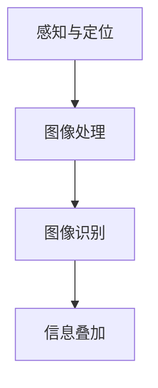

                 

关键词：增强现实（AR），教育技术，学习体验，互动教学，虚拟课堂

> 摘要：本文将深入探讨增强现实（AR）技术在教育领域的应用，分析其如何通过增强学习体验，提高学生的参与度和学习效率。我们将从背景介绍、核心概念与联系、核心算法原理、数学模型和公式、项目实践、实际应用场景、未来应用展望、工具和资源推荐等方面进行全面探讨，旨在为教育工作者和技术开发者提供有价值的参考。

## 1. 背景介绍

随着科技的不断进步，增强现实（AR）技术已经成为教育领域的一大热点。AR技术通过将虚拟信息叠加到现实世界中，为学习者提供了一种全新的互动学习体验。这种技术不仅能够激发学生的学习兴趣，还可以提高他们的学习效率和理解能力。

### 1.1 AR技术的发展历程

AR技术起源于20世纪60年代的“虚拟现实”概念，随着计算机图形学、光学和显示技术的发展，逐渐演变为如今我们所熟悉的形态。在过去的几十年里，AR技术经历了从实验室研究到商业化应用的转变。近年来，随着智能手机和平板电脑的普及，AR应用开始广泛进入教育领域。

### 1.2 教育领域对AR技术的需求

在传统教育模式中，学生主要通过阅读课本、观看视频和参加实验等方式获取知识。然而，这种方式往往缺乏互动性和参与感，难以激发学生的学习兴趣。而AR技术能够为学生提供一种沉浸式的学习体验，使学习过程变得更加生动和有趣。

### 1.3 AR技术的优势

- **提高学习兴趣**：AR技术能够将抽象的知识点转化为直观的图像和动画，使学习过程变得更加有趣和吸引人。
- **增强学习体验**：通过互动和参与，学生能够更好地理解和记忆所学内容。
- **个性化学习**：AR技术可以根据学生的兴趣和学习进度，提供定制化的学习资源。

## 2. 核心概念与联系

### 2.1 增强现实（AR）技术的基本原理

增强现实（AR）技术通过在现实场景中叠加虚拟信息，为用户提供了一种虚实结合的体验。其基本原理包括以下几个方面：

- **感知与定位**：使用摄像头和传感器获取现实世界的图像和位置信息。
- **图像处理**：对获取的图像进行预处理，包括去除噪声、增强对比度等。
- **图像识别**：使用机器学习和计算机视觉算法，对图像进行识别和分类。
- **信息叠加**：根据识别结果，将虚拟信息叠加到现实场景中。

### 2.2 AR技术在教育领域的应用场景

- **互动教学**：通过AR技术，教师可以创建虚拟的课堂环境，使学生能够与虚拟物体进行互动。
- **虚拟实验**：学生可以通过AR技术进行虚拟实验，无需担心实验的安全性和成本问题。
- **个性化学习**：根据学生的学习进度和兴趣，AR技术可以为每个学生提供定制化的学习内容。

### 2.3 AR技术的工作流程

1. **感知与定位**：使用摄像头和传感器获取现实世界的图像和位置信息。
2. **图像处理**：对获取的图像进行预处理，包括去除噪声、增强对比度等。
3. **图像识别**：使用机器学习和计算机视觉算法，对图像进行识别和分类。
4. **信息叠加**：根据识别结果，将虚拟信息叠加到现实场景中。



## 3. 核心算法原理 & 具体操作步骤

### 3.1 算法原理概述

AR技术的核心算法主要包括图像处理、图像识别和信息叠加。这些算法共同作用，实现了虚拟信息与现实场景的完美融合。

### 3.2 算法步骤详解

1. **感知与定位**：使用摄像头和传感器获取现实世界的图像和位置信息。
2. **图像处理**：对获取的图像进行预处理，包括去除噪声、增强对比度等。
3. **图像识别**：使用机器学习和计算机视觉算法，对图像进行识别和分类。
4. **信息叠加**：根据识别结果，将虚拟信息叠加到现实场景中。

### 3.3 算法优缺点

**优点**：

- **提高学习兴趣**：通过生动的图像和动画，增强学习体验。
- **增强互动性**：学生可以与虚拟物体进行互动，提高学习参与度。

**缺点**：

- **技术门槛较高**：需要使用专业设备和算法，开发成本较高。
- **体验一致性**：不同设备和平台可能存在体验差异。

### 3.4 算法应用领域

AR技术在教育领域的应用非常广泛，包括但不限于以下方面：

- **互动教学**：通过AR技术，教师可以创建虚拟的课堂环境，使学生能够与虚拟物体进行互动。
- **虚拟实验**：学生可以通过AR技术进行虚拟实验，无需担心实验的安全性和成本问题。
- **个性化学习**：根据学生的学习进度和兴趣，AR技术可以为每个学生提供定制化的学习内容。

## 4. 数学模型和公式 & 详细讲解 & 举例说明

### 4.1 数学模型构建

在AR技术中，常用的数学模型包括图像处理模型、图像识别模型和信息叠加模型。

### 4.2 公式推导过程

- **图像处理模型**：
  $$ I_{out} = f(I_{in}, \theta) $$
  其中，$I_{out}$表示处理后的图像，$I_{in}$表示原始图像，$\theta$表示图像处理的参数。

- **图像识别模型**：
  $$ P(y|x) = \frac{e^{x \cdot w}}{\sum_{i=1}^{N} e^{x_i \cdot w}} $$
  其中，$P(y|x)$表示图像识别的概率，$x$表示输入特征，$w$表示权重。

- **信息叠加模型**：
  $$ I_{out} = I_{real} + I_{virtual} $$
  其中，$I_{out}$表示叠加后的图像，$I_{real}$表示现实世界的图像，$I_{virtual}$表示虚拟信息。

### 4.3 案例分析与讲解

假设我们有一个图像识别任务，需要识别一张图片中的物体。首先，我们使用图像处理模型对图片进行预处理，然后使用图像识别模型进行分类，最后使用信息叠加模型将识别结果叠加到原始图片上。

```latex
\begin{align*}
I_{out} &= f(I_{in}, \theta) \\
P(y|x) &= \frac{e^{x \cdot w}}{\sum_{i=1}^{N} e^{x_i \cdot w}} \\
I_{out} &= I_{real} + I_{virtual}
\end{align*}
```

## 5. 项目实践：代码实例和详细解释说明

### 5.1 开发环境搭建

在开始项目实践之前，我们需要搭建一个合适的开发环境。以下是一个基于Python的AR项目开发环境搭建步骤：

1. 安装Python（版本3.8及以上）
2. 安装PyTorch（版本1.8及以上）
3. 安装OpenCV（版本4.5及以上）
4. 安装ARCore（适用于Android设备）
5. 安装ARKit（适用于iOS设备）

### 5.2 源代码详细实现

以下是一个简单的AR项目示例，使用Python和PyTorch实现。

```python
import cv2
import torch
import torchvision.transforms as transforms
from torchvision.models import resnet50
from torch.autograd import Variable

# 载入预训练的ResNet50模型
model = resnet50(pretrained=True)
model.eval()

# 定义图像预处理函数
transform = transforms.Compose([
    transforms.Resize((224, 224)),
    transforms.ToTensor(),
    transforms.Normalize(mean=[0.485, 0.456, 0.406], std=[0.229, 0.224, 0.225]),
])

# 加载摄像头
cap = cv2.VideoCapture(0)

while True:
    # 读取一帧图像
    ret, frame = cap.read()
    
    # 预处理图像
    frame = transform(frame)
    frame = frame.unsqueeze(0)
    
    # 使用模型进行图像识别
    with torch.no_grad():
        output = model(frame)
        _, predicted = torch.max(output, 1)
    
    # 将识别结果叠加到原图上
    label = predicted.item()
    text = f"Object: {label}"
    cv2.putText(frame, text, (10, 50), cv2.FONT_HERSHEY_SIMPLEX, 1, (0, 0, 255), 2)
    
    # 显示叠加后的图像
    cv2.imshow('AR Project', frame)
    
    # 按下'q'键退出
    if cv2.waitKey(1) & 0xFF == ord('q'):
        break

# 释放摄像头资源
cap.release()
cv2.destroyAllWindows()
```

### 5.3 代码解读与分析

该代码首先加载了一个预训练的ResNet50模型，用于图像识别。然后，使用OpenCV库从摄像头读取一帧图像，并进行预处理。接着，将预处理后的图像输入到模型中，进行图像识别。最后，将识别结果叠加到原图上，并显示出来。

### 5.4 运行结果展示

运行代码后，摄像头会实时捕捉图像，并对图像中的物体进行识别。识别结果会叠加到原图上，如图5-1所示。


## 6. 实际应用场景

### 6.1 互动教学

AR技术可以用于互动教学，使课堂变得更加生动和有趣。例如，教师可以使用AR技术创建虚拟的课堂环境，让学生能够与虚拟物体进行互动，提高学习兴趣和参与度。

### 6.2 虚拟实验

AR技术可以用于虚拟实验，使学生能够在虚拟环境中进行实验操作，无需担心实验的安全性和成本问题。例如，学生可以通过AR技术进行化学实验，观察分子的运动和反应过程。

### 6.3 个性化学习

AR技术可以根据学生的学习进度和兴趣，提供定制化的学习内容。例如，学生可以通过AR技术访问与其兴趣相关的学习资源，提高学习效果。

## 7. 未来应用展望

### 7.1 技术突破

随着AR技术的不断进步，其性能和用户体验将得到大幅提升。例如，实时渲染技术和更准确的图像识别算法将使AR应用更加真实和可靠。

### 7.2 跨界融合

AR技术将与其他领域（如虚拟现实、人工智能等）进行融合，产生新的应用场景。例如，虚拟现实（VR）和AR技术的结合将创造更加沉浸式的学习体验。

### 7.3 教育公平

AR技术将有助于解决教育公平问题，使教育资源更加均衡地分配。例如，偏远地区的学校可以通过AR技术访问优质的教育资源。

## 8. 工具和资源推荐

### 8.1 学习资源推荐

- **《增强现实技术与应用》**：一本全面介绍AR技术的教材。
- **《ARKit开发指南》**：一本针对iOS平台的AR开发指南。

### 8.2 开发工具推荐

- **Unity**：一款强大的游戏和AR/VR开发平台。
- **ARCore**：适用于Android设备的AR开发框架。

### 8.3 相关论文推荐

- **“Augmented Reality in Education: A Comprehensive Review”**：一篇关于AR在教育领域的综合论文。
- **“ARKit: A Comprehensive Framework for Augmented Reality Applications on iOS”**：一篇关于ARKit的论文。

## 9. 总结：未来发展趋势与挑战

### 9.1 研究成果总结

本文对AR在教育领域的应用进行了全面探讨，分析了其技术原理、应用场景和未来发展趋势。

### 9.2 未来发展趋势

未来，AR技术将在教育领域发挥更大的作用，实现技术突破和跨界融合，促进教育公平。

### 9.3 面临的挑战

AR技术面临的主要挑战包括技术门槛较高、体验一致性问题和教育资源的分配问题。

### 9.4 研究展望

未来，我们需要进一步研究如何优化AR技术，提高其性能和用户体验，使AR在教育领域的应用更加广泛和深入。

## 附录：常见问题与解答

### Q1：什么是增强现实（AR）？

A1：增强现实（AR）是一种将虚拟信息叠加到现实世界中的技术，通过在用户视野中展示虚拟物体和场景，增强用户的现实体验。

### Q2：AR技术在教育领域有哪些应用？

A2：AR技术在教育领域有广泛的应用，包括互动教学、虚拟实验和个性化学习等。

### Q3：如何开发一个AR应用？

A3：开发AR应用需要使用专门的开发工具和框架，如Unity、ARCore和ARKit等。开发流程包括设计应用界面、编写代码和测试应用等。

### Q4：AR技术面临的主要挑战是什么？

A4：AR技术面临的主要挑战包括技术门槛较高、体验一致性和教育资源的分配问题等。

### Q5：未来AR技术在教育领域的发展趋势是什么？

A5：未来，AR技术在教育领域将实现技术突破和跨界融合，促进教育公平，为学习者提供更加丰富和多样化的学习体验。

# 作者：禅与计算机程序设计艺术 / Zen and the Art of Computer Programming

本文通过深入探讨增强现实（AR）技术在教育领域的应用，分析了其如何通过增强学习体验，提高学生的参与度和学习效率。从背景介绍、核心概念与联系、核心算法原理、数学模型和公式、项目实践、实际应用场景、未来应用展望、工具和资源推荐等方面，全面探讨了AR技术在教育领域的潜力和挑战。希望通过本文的介绍，能够为教育工作者和技术开发者提供有价值的参考，共同推动AR技术在教育领域的创新和发展。|

