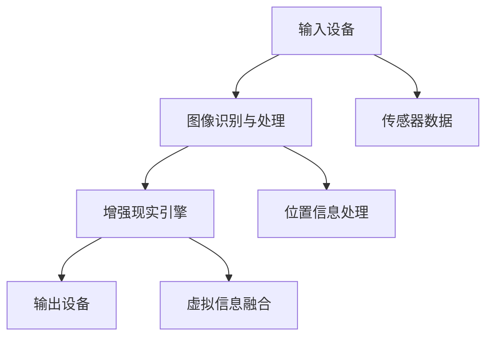

                 

关键词：增强现实，教育技术，学习体验，AR工具，教学方法

> 摘要：本文探讨了增强现实（AR）技术在教育领域的应用，分析了AR如何通过增强学习体验，提高学生参与度和学习效果。文章首先介绍了AR的基本概念和原理，然后详细阐述了AR在教育中的应用场景，最后提出了AR在教育领域的未来发展趋势和面临的挑战。

## 1. 背景介绍

随着技术的不断进步，教育领域也迎来了新的变革。传统的课堂教学模式逐渐显现出其局限性，无法满足现代学生对于互动性和趣味性的需求。在这种情况下，增强现实（Augmented Reality，AR）技术的出现为教育带来了新的机遇。

AR是一种将虚拟信息与真实环境相结合的技术，通过在现实场景中叠加虚拟元素，使用户能够与之互动。与虚拟现实（VR）不同，AR不要求用户完全沉浸在虚拟环境中，而是在现实世界中增强体验。

在教育领域，AR技术的应用不仅可以提高学生的学习兴趣，还能提供丰富的学习资源和交互式学习体验。本篇文章将深入探讨AR在教育中的应用，分析其增强学习体验的效果，以及面临的挑战和未来发展的趋势。

## 2. 核心概念与联系

### 2.1 增强现实（AR）的基本概念

增强现实（AR）是一种将计算机生成的虚拟信息叠加到真实环境中的技术。通过使用AR设备（如智能手机、平板电脑、头戴显示器等），用户可以看到现实世界中的物体与虚拟物体同时存在。

AR的核心技术包括图像识别、计算机视觉、增强现实引擎和用户体验设计。这些技术的结合使得虚拟信息能够与现实环境无缝融合，提供更加自然和沉浸式的交互体验。

### 2.2 AR在教育中的应用场景

AR技术在教育中的应用非常广泛，以下是几个典型的应用场景：

#### 2.2.1 教学辅助

教师可以利用AR技术创建互动式课件，将抽象的概念和知识以三维立体的形式展示给学生，从而提高学生的理解和记忆。例如，在生物学课上，教师可以使用AR课件展示人体器官的三维结构，帮助学生更好地理解人体运作机制。

#### 2.2.2 交互式学习

AR技术可以创建交互式的学习环境，让学生通过动手操作来学习知识。例如，在历史课上，学生可以通过AR设备探索历史遗址，与历史人物进行虚拟对话，从而增强学习的趣味性和参与度。

#### 2.2.3 实景教学

AR技术可以将虚拟物体或信息叠加到现实环境中，为学生提供更加真实的学习体验。例如，在地理课上，学生可以通过AR设备观察地球表面的地形和气候，从而更好地理解地理概念。

#### 2.2.4 远程教育

AR技术可以打破空间限制，实现远程教育。学生可以通过AR设备与远方的教师或同学进行互动，参与虚拟实验或共同学习。这为偏远地区的学生提供了更多的学习机会。

### 2.3 AR技术的架构与工作原理

AR系统的架构通常包括以下几个部分：

#### 2.3.1 输入设备

输入设备包括摄像头、传感器等，用于捕捉现实环境的图像和位置信息。

#### 2.3.2 图像识别与处理

通过图像识别算法，系统可以识别并标记现实环境中的物体。

#### 2.3.3 增强现实引擎

增强现实引擎负责将虚拟信息与真实环境融合，并实时更新显示。

#### 2.3.4 输出设备

输出设备将增强后的场景呈现给用户，通常是显示屏或头戴显示器。

### 2.4 Mermaid 流程图

以下是一个简化的AR技术架构的Mermaid流程图：



## 3. 核心算法原理 & 具体操作步骤

### 3.1 算法原理概述

AR技术的核心算法包括图像识别、虚拟信息生成和融合。以下是对这三个核心算法的概述：

#### 3.1.1 图像识别

图像识别算法用于识别和标记现实环境中的物体。常见的图像识别算法包括深度学习中的卷积神经网络（CNN）和目标检测算法（如YOLO、SSD等）。

#### 3.1.2 虚拟信息生成

虚拟信息生成算法用于创建虚拟物体或场景。常见的虚拟信息生成算法包括基于几何模型的3D建模和基于深度学习的生成对抗网络（GAN）。

#### 3.1.3 虚拟信息融合

虚拟信息融合算法负责将虚拟物体或场景与真实环境融合。常用的融合算法包括透视变换、多视图几何和图像融合算法（如复合高斯图像融合）。

### 3.2 算法步骤详解

以下是一个简化的AR算法步骤：

#### 3.2.1 输入设备捕捉图像

输入设备（如摄像头）捕捉现实环境中的图像。

#### 3.2.2 图像识别

利用图像识别算法（如YOLO）识别图像中的物体，并标记物体的位置和类别。

#### 3.2.3 生成虚拟信息

根据识别的物体，生成相应的虚拟物体或场景。例如，使用3D建模工具创建一个虚拟物体。

#### 3.2.4 虚拟信息融合

利用透视变换和多视图几何算法，将虚拟物体与真实环境融合。调整虚拟物体的位置、大小和透明度，使其与现实环境中的物体匹配。

#### 3.2.5 输出显示

将融合后的图像输出到显示屏或头戴显示器，用户可以看到增强后的现实场景。

### 3.3 算法优缺点

#### 3.3.1 优点

- 提高学习兴趣：AR技术可以提供丰富的交互式学习体验，激发学生的学习兴趣。
- 增强理解记忆：通过直观的视觉和触觉反馈，学生可以更好地理解和记忆知识。
- 提高参与度：学生可以更积极地参与课堂活动，提高课堂参与度。

#### 3.3.2 缺点

- 技术门槛：开发AR应用需要较高的技术门槛，对开发人员的要求较高。
- 资源消耗：AR应用通常需要较高的计算资源和存储空间，对设备和网络的要求较高。
- 隐私和安全：AR应用可能会涉及到用户隐私和数据安全问题，需要妥善处理。

### 3.4 算法应用领域

AR技术在教育、医疗、娱乐等多个领域都有广泛的应用。以下是一些典型的应用领域：

- 教育领域：教学辅助、交互式学习、实景教学。
- 医疗领域：医学影像增强、手术指导、患者教育。
- 娱乐领域：游戏、虚拟旅游、演出。

## 4. 数学模型和公式 & 详细讲解 & 举例说明

### 4.1 数学模型构建

AR技术中的核心数学模型包括图像识别模型、3D建模模型和图像融合模型。以下是对这些模型的详细讲解。

#### 4.1.1 图像识别模型

图像识别模型通常是基于深度学习算法构建的，如卷积神经网络（CNN）。以下是一个简化的CNN模型：

$$
\text{Input: } \text{Image} \\
\text{Layer 1: } \text{Convolution} \rightarrow \text{Pooling} \\
\text{Layer 2: } \text{Convolution} \rightarrow \text{Pooling} \\
\text{Layer 3: } \text{Fully Connected} \rightarrow \text{Output} \\
$$

其中，卷积层用于提取图像特征，池化层用于降低模型复杂度，全连接层用于分类输出。

#### 4.1.2 3D建模模型

3D建模模型通常基于几何建模和基于深度学习的生成模型。以下是一个基于几何建模的3D建模模型：

$$
\text{Input: } \text{Mesh Parameters} \\
\text{Process: } \text{Geometry Construction} \rightarrow \text{Mesh Optimization} \\
\text{Output: } \text{3D Model} \\
$$

其中，几何建模用于构建三维模型，优化用于提高模型的精度和效率。

#### 4.1.3 图像融合模型

图像融合模型用于将虚拟信息与真实环境融合。以下是一个基于透视变换的图像融合模型：

$$
\text{Input: } \text{Real Image} \rightarrow \text{Virtual Image} \\
\text{Process: } \text{Perspective Transformation} \rightarrow \text{Image Fusion} \\
\text{Output: } \text{Fused Image} \\
$$

其中，透视变换用于将虚拟物体映射到真实环境中，融合用于调整虚拟物体的透明度，使其与现实环境匹配。

### 4.2 公式推导过程

以下是对图像融合模型中透视变换的公式推导过程：

设虚拟图像为 \( I_v \)，真实图像为 \( I_r \)，透视变换矩阵为 \( T \)。

首先，对虚拟图像进行透视变换，将其映射到真实坐标系中：

$$
I_v' = T \cdot I_v
$$

然后，对真实图像进行透明度调整：

$$
I_r' = (1 - \alpha) \cdot I_r + \alpha \cdot I_v'
$$

其中，\( \alpha \) 为透明度参数。

最后，将融合后的图像输出：

$$
I_f = I_r'
$$

### 4.3 案例分析与讲解

#### 4.3.1 案例背景

假设我们在一个教室中使用AR技术展示一个虚拟的地球模型。真实图像是教室内的全景图像，虚拟图像是地球模型的三维图像。

#### 4.3.2 案例步骤

1. **输入图像**：使用AR设备捕捉教室的全景图像。

2. **图像识别**：利用图像识别模型识别教室中的物体，特别是窗户和墙壁。

3. **3D建模**：使用3D建模工具创建一个虚拟的地球模型。

4. **透视变换**：计算透视变换矩阵，将虚拟地球模型映射到教室的全景图像中。

5. **图像融合**：调整虚拟地球模型的透明度，使其与真实教室图像融合。

6. **输出显示**：将融合后的图像显示在AR设备的屏幕上。

#### 4.3.3 案例结果

用户可以通过AR设备看到教室中悬浮着一个虚拟的地球模型，可以旋转和缩放地球，学习地球的构造和运行机制。

## 5. 项目实践：代码实例和详细解释说明

### 5.1 开发环境搭建

为了实践AR技术在教育领域的应用，我们需要搭建一个开发环境。以下是推荐的开发环境：

- **操作系统**：Windows、Linux或macOS
- **编程语言**：Python
- **AR开发框架**：ARCore（Google）、ARKit（Apple）、ARFoundation（Unity）
- **图像识别框架**：TensorFlow、PyTorch
- **3D建模工具**：Blender、Maya

### 5.2 源代码详细实现

以下是使用Python和ARKit实现的一个简单的AR教育应用实例。这个实例将创建一个虚拟的分子模型，并叠加到真实环境中。

```python
import cv2
import numpy as np
import arkit

# 初始化ARKit环境
session = arkit.AREarthSession()

# 创建一个虚拟的分子模型
molecule_model = arkit.AREarthModel(molecule_name="molecule")

# 将分子模型添加到地球场景中
session.scene.models.append(molecule_model)

# 定义透视变换矩阵
perspective_matrix = np.array([
    [1, 0, 0, 0],
    [0, 1, 0, 0],
    [0, 0, 1, -1],
    [0, 0, 0, 1]
])

# 定义图像融合函数
def image_fusion(image, virtual_image, alpha=0.5):
    image = cv2.resize(image, (virtual_image.shape[1], virtual_image.shape[0]))
    image = (1 - alpha) * image + alpha * virtual_image
    return image

# 运行AR地球场景
session.run()

# 获取AR地球场景的实时图像
while True:
    image = session.capture()
    virtual_image = arkit.AREarthModel.render_molecule(molecule_model)
    fused_image = image_fusion(image, virtual_image)
    cv2.imshow('AR Earth', fused_image)
    if cv2.waitKey(1) & 0xFF == ord('q'):
        break

# 关闭AR地球场景
session.shutdown()
```

### 5.3 代码解读与分析

这段代码首先初始化ARKit环境，并创建一个虚拟的分子模型。然后，将分子模型添加到地球场景中，并定义了透视变换矩阵和图像融合函数。在运行AR地球场景的过程中，代码会捕获实时图像，并使用图像融合函数将虚拟分子模型叠加到真实环境中。最后，将融合后的图像显示在窗口中。

### 5.4 运行结果展示

运行这段代码后，用户可以看到一个虚拟的分子模型叠加在真实环境中，可以旋转和缩放分子模型，从而学习分子的构造和运行机制。

## 6. 实际应用场景

### 6.1 教学辅助

在教学中，AR技术可以用于辅助教学，提高学生的理解和记忆。例如，在数学课上，教师可以使用AR技术创建三维立体的几何图形，帮助学生更好地理解几何概念。在科学课上，教师可以使用AR技术展示复杂的生物结构或化学实验，使学生能够直观地观察和理解。

### 6.2 交互式学习

AR技术可以创建交互式的学习环境，让学生通过动手操作来学习知识。例如，在历史课上，学生可以通过AR设备探索历史遗址，与历史人物进行虚拟对话，从而增强学习的趣味性和参与度。在物理课上，学生可以通过AR设备进行虚拟实验，观察物理现象的变化。

### 6.3 实景教学

AR技术可以将虚拟物体或信息叠加到现实环境中，为学生提供更加真实的学习体验。例如，在地理课上，学生可以通过AR设备观察地球表面的地形和气候，从而更好地理解地理概念。在生物课上，学生可以通过AR设备观察植物的生长过程，了解生态系统的运作。

### 6.4 远程教育

AR技术可以打破空间限制，实现远程教育。学生可以通过AR设备与远方的教师或同学进行互动，参与虚拟实验或共同学习。这为偏远地区的学生提供了更多的学习机会。例如，偏远地区的学生可以通过AR设备与城市中的教师进行实时互动，学习先进的知识。

## 7. 工具和资源推荐

### 7.1 学习资源推荐

- **书籍**：
  - 《增强现实技术基础》
  - 《计算机视觉基础》
  - 《深度学习》

- **在线课程**：
  - Coursera上的《增强现实开发》
  - Udacity上的《计算机视觉》
  - edX上的《深度学习》

### 7.2 开发工具推荐

- **AR开发框架**：
  - ARCore（Google）
  - ARKit（Apple）
  - ARFoundation（Unity）

- **图像识别框架**：
  - TensorFlow
  - PyTorch

- **3D建模工具**：
  - Blender
  - Maya

### 7.3 相关论文推荐

- “Augmented Reality in Education: A Review”
- “Enhancing Learning with Augmented Reality”
- “Augmented Reality Applications in Higher Education”

## 8. 总结：未来发展趋势与挑战

### 8.1 研究成果总结

AR技术在教育领域的应用取得了显著的成果，提高了学生的学习兴趣和参与度，增强了学习体验。通过AR技术，学生可以更直观地理解抽象的概念，进行互动式的学习，从而提高学习效果。

### 8.2 未来发展趋势

- **技术进步**：随着计算能力和图像处理技术的不断提升，AR设备的性能和用户体验将得到大幅提升。
- **场景拓展**：AR技术在教育、医疗、娱乐等领域的应用将不断拓展，提供更加丰富和多样化的体验。
- **教学模式创新**：AR技术将推动教育模式的创新，实现个性化学习和混合式教学。

### 8.3 面临的挑战

- **技术门槛**：AR技术对开发人员的技术要求较高，需要掌握多种技术知识和技能。
- **设备成本**：AR设备的成本较高，对学校和家庭的经济负担较大。
- **隐私和安全**：AR应用可能涉及到用户隐私和数据安全问题，需要加强保护措施。

### 8.4 研究展望

未来，AR技术在教育领域的应用将更加深入和广泛。通过不断优化技术和降低成本，AR技术将为教育带来更多的创新和变革。同时，教育领域的研究者将继续探索AR技术的应用场景和教学模式，推动教育技术的发展。

## 9. 附录：常见问题与解答

### 9.1 AR技术如何提高学习效果？

AR技术通过提供直观的视觉和触觉反馈，使学生能够更直观地理解抽象的概念，提高学习效果。此外，AR技术还可以提供互动式的学习环境，激发学生的学习兴趣和参与度。

### 9.2 AR技术在教育领域的应用有哪些？

AR技术在教育领域的应用非常广泛，包括教学辅助、交互式学习、实景教学和远程教育等。通过AR技术，学生可以更直观地学习抽象的概念，进行互动式的学习，提高学习效果。

### 9.3 AR技术的应用前景如何？

AR技术在教育、医疗、娱乐等多个领域都有广泛的应用前景。随着技术的不断进步和成本的降低，AR技术将在未来得到更广泛的应用，为教育、医疗和娱乐等领域带来更多的创新和变革。

### 9.4 AR技术有哪些挑战？

AR技术的挑战主要包括技术门槛、设备成本和隐私安全等方面。为了推广AR技术，需要降低技术门槛和设备成本，并加强隐私保护和安全措施。

作者：禅与计算机程序设计艺术 / Zen and the Art of Computer Programming
----------------------------------------------------------------

