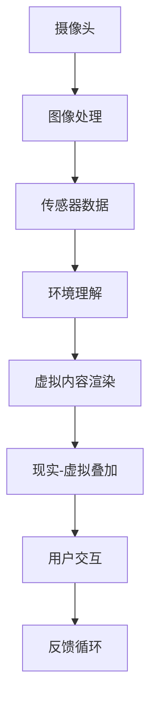

                 

关键词：增强现实（AR），ARKit，ARCore，开发工具，比较，特性，优缺点，应用场景，未来展望

摘要：本文将深入比较苹果的ARKit和谷歌的ARCore，这两大增强现实开发工具。通过对它们的功能特性、开发体验、性能表现、硬件要求、生态系统等方面的详细分析，我们将帮助开发者了解每种工具的优势和局限性，从而为他们的AR项目选择合适的开发平台。

## 1. 背景介绍

随着智能手机和移动设备的普及，增强现实（AR）技术逐渐成为热门的开发领域。AR技术通过将虚拟内容叠加到现实世界中，为用户带来了全新的交互体验。苹果和谷歌分别推出了ARKit和ARCore，这两大平台为开发者在移动设备上创建AR应用提供了强大的工具和资源。

### 1.1 ARKit

ARKit是苹果公司于2017年推出的一款增强现实开发框架，专为iOS和macOS平台设计。它利用了iPhone和iPad的内置传感器，如摄像头、加速度计和陀螺仪，以实现稳定的实时AR体验。ARKit提供了丰富的API，支持3D模型、图像识别、环境光照估计等功能，使开发者能够轻松地创建高质量的AR应用。

### 1.2 ARCore

ARCore是谷歌开发的一套增强现实开发工具包，旨在为Android设备提供强大的AR支持。ARCore通过利用手机的摄像头、GPS和IMU传感器，为开发者提供了一系列强大的AR功能，如环境映射、光线估计、实时定位和运动跟踪。与ARKit类似，ARCore的目标是简化AR应用的开发过程，并确保在各种设备上的稳定性能。

## 2. 核心概念与联系

为了更好地理解ARKit和ARCore，我们需要了解增强现实技术的基本概念和架构。以下是增强现实系统的核心组成部分及其相互关系（使用Mermaid流程图表示）：



### 2.1 摄像头

摄像头是AR系统的眼睛，用于捕捉现实世界的图像。通过图像处理算法，摄像头捕获的图像被转化为数字信息，用于后续的处理。

### 2.2 图像处理

图像处理模块对捕获的图像进行预处理，如去噪、增强对比度和色彩校正，以提高后续处理的准确性。

### 2.3 传感器数据

传感器数据包括来自手机内置的各种传感器（如加速度计、陀螺仪、GPS等）的信息。这些数据用于理解用户的位置、方向和运动。

### 2.4 环境理解

环境理解模块利用图像处理和传感器数据，分析现实世界的特征，如平面检测、深度估计和空间定位。

### 2.5 虚拟内容渲染

虚拟内容渲染模块负责将虚拟对象叠加到现实世界中，通过三维图形引擎生成高质量的图像。

### 2.6 现实-虚拟叠加

现实-虚拟叠加模块将渲染的虚拟内容与摄像头捕获的现实世界图像融合，形成最终的AR视图。

### 2.7 用户交互

用户交互模块处理用户与AR系统的交互，如手势识别、语音控制等，以增强用户体验。

### 2.8 反馈循环

反馈循环模块用于收集用户反馈，并根据用户的操作调整AR系统的行为，以实现更自然的交互。

## 3. 核心算法原理 & 具体操作步骤

### 3.1 算法原理概述

ARKit和ARCore的核心算法包括图像处理、传感器数据处理、环境理解、虚拟内容渲染和用户交互。以下是这些算法的简要概述：

### 3.2 算法步骤详解

#### ARKit算法步骤

1. 摄像头捕获实时图像。
2. 图像处理模块对图像进行预处理。
3. 传感器数据模块整合加速度计、陀螺仪等传感器的数据。
4. 环境理解模块检测平面和识别物体。
5. 虚拟内容渲染模块根据环境理解结果渲染虚拟对象。
6. 现实-虚拟叠加模块将虚拟对象叠加到实时图像上。
7. 用户交互模块处理用户输入，如手势、语音等。

#### ARCore算法步骤

1. 摄像头捕获实时图像。
2. 图像处理模块对图像进行预处理。
3. 传感器数据模块整合加速度计、陀螺仪等传感器的数据。
4. 环境理解模块使用SLAM（同步定位与映射）技术进行实时定位和深度估计。
5. 虚拟内容渲染模块根据环境理解结果渲染虚拟对象。
6. 现实-虚拟叠加模块将虚拟对象叠加到实时图像上。
7. 用户交互模块处理用户输入，如手势、语音等。

### 3.3 算法优缺点

#### ARKit优缺点

- **优点**：
  - 简单易用，开发者无需复杂的设置。
  - 与iOS生态系统紧密集成，可轻松访问iOS设备的功能。
  - 提供了强大的图像识别和物体检测功能。

- **缺点**：
  - 支持的设备数量有限，仅限于iPhone和iPad。
  - 部分高级功能（如SLAM）需要额外的插件或第三方库。

#### ARCore优缺点

- **优点**：
  - 支持广泛的Android设备，包括低端的入门级设备。
  - 提供了先进的SLAM技术，实现更稳定的实时定位。
  - 与Google Maps和其他Google服务集成，可提供丰富的AR体验。

- **缺点**：
  - 开发者需要熟悉Android开发环境和相关的编程语言。
  - 部分功能（如环境光照估计）需要更高性能的硬件支持。

## 4. 数学模型和公式 & 详细讲解 & 举例说明

### 4.1 数学模型构建

增强现实技术中的关键数学模型包括图像处理算法、传感器数据处理算法、环境理解算法和虚拟内容渲染算法。以下是这些模型的基本公式和推导过程：

#### 4.1.1 图像处理

图像处理算法通常包括滤波、边缘检测和特征提取。以下是一个简单的滤波算法公式：

$$
I_{\text{filtered}} = \sum_{i=-h}^{h} \sum_{j=-k}^{k} w_{i,j} \cdot I(i, j)
$$

其中，$I_{\text{filtered}}$是滤波后的图像，$I(i, j)$是原始图像的像素值，$w_{i,j}$是滤波器系数。

#### 4.1.2 传感器数据处理

传感器数据处理算法包括运动估计和姿态估计。以下是一个简单的卡尔曼滤波算法公式：

$$
\hat{x}_{k|k} = F_k \hat{x}_{k-1|k-1} + L_k (z_k - H_k \hat{x}_{k-1|k-1})
$$

其中，$\hat{x}_{k|k}$是当前时刻的状态估计值，$F_k$是状态转移矩阵，$L_k$是卡尔曼增益，$z_k$是观测值，$H_k$是观测矩阵。

#### 4.1.3 环境理解

环境理解算法包括平面检测和物体识别。以下是一个简单的Hough变换算法公式：

$$
v = \sum_{i=1}^{N} \theta_i \cdot p_i
$$

其中，$v$是Hough变换的结果，$\theta_i$是直线的方向，$p_i$是直线的长度。

#### 4.1.4 虚拟内容渲染

虚拟内容渲染算法包括三维建模和纹理映射。以下是一个简单的基本渲染方程：

$$
L_o(\mathbf{p}) = L_e + L_d(\mathbf{i}, \mathbf{n}) + L_s(\mathbf{i}, \mathbf{v})
$$

其中，$L_o(\mathbf{p})$是物体表面的光照强度，$L_e$是环境光，$L_d$是漫反射光，$L_s$是镜面反射光，$\mathbf{i}$是光线方向，$\mathbf{n}$是法线方向，$\mathbf{v}$是视线方向。

### 4.2 公式推导过程

由于篇幅限制，这里仅简要介绍Hough变换的推导过程：

假设在图像中检测到一条直线，该直线可以用斜率-截距形式表示为：

$$
y = mx + b
$$

将上述方程转化为参数空间的形式：

$$
x = \frac{y - b}{m}
$$

将y替换为0，得到：

$$
x = -\frac{b}{m}
$$

这是一个关于参数m的线性方程。通过将m作为参数，我们可以将图像中的所有点映射到参数空间中。在这个空间中，直线上的点将形成一个峰值。

### 4.3 案例分析与讲解

以下是一个简单的增强现实应用的案例，用于在现实世界中添加虚拟物体：

1. 摄像头捕获实时图像。
2. 图像处理模块对图像进行滤波，去除噪声。
3. 传感器数据处理模块整合加速度计和陀螺仪的数据，确定手机的位置和方向。
4. 环境理解模块检测到桌面上的一个平面，并使用Hough变换确定直线的参数。
5. 虚拟内容渲染模块创建一个立方体，并将其放置在检测到的平面上。
6. 现实-虚拟叠加模块将立方体叠加到实时图像上，形成一个AR效果。

通过上述步骤，我们可以实现一个简单的AR应用，将虚拟物体放置在现实世界中。这个案例展示了ARKit和ARCore的核心算法如何协同工作，为用户提供丰富的AR体验。

## 5. 项目实践：代码实例和详细解释说明

### 5.1 开发环境搭建

为了实践ARKit和ARCore，我们需要搭建相应的开发环境。

#### ARKit开发环境

1. 安装Xcode：从App Store下载并安装最新版本的Xcode。
2. 创建一个新的ARKit项目：打开Xcode，选择"File" > "New" > "Project"，选择"App"模板，然后点击"Next"。
3. 选择项目名称和保存位置，点击"Create"。

#### ARCore开发环境

1. 安装Android Studio：从官方网站下载并安装最新版本的Android Studio。
2. 创建一个新的Android项目：打开Android Studio，点击"Start a new Android Studio project"。
3. 选择"Empty Activity"模板，然后点击"Next"。
4. 选择项目名称和保存位置，点击"Finish"。

### 5.2 源代码详细实现

以下是一个简单的ARKit示例，用于在现实世界中添加一个虚拟立方体。

```swift
import ARKit

class ARViewController: UIViewController, ARSCNViewDelegate {
    var sceneView: ARSCNView!
    
    override func viewDidLoad() {
        super.viewDidLoad()
        
        // 设置ARSCNView
        sceneView = ARSCNView(frame: view.bounds)
        sceneView.delegate = self
        sceneView.autoresizingMask = [.flexibleWidth, .flexibleHeight]
        view.addSubview(sceneView)
        
        // 配置AR场景
        let configuration = ARWorldTrackingConfiguration()
        sceneView.session.run(configuration)
        
        // 创建立方体
        let box = SCNBox(width: 0.1, height: 0.1, length: 0.1, chamferRadius: 0)
        let boxNode = SCNNode(geometry: box)
        boxNode.position = SCNVector3(0, -0.1, -1)
        
        // 添加立方体到场景
        sceneView.scene.rootNode.addChildNode(boxNode)
    }
}
```

以下是一个简单的ARCore示例，用于在现实世界中添加一个虚拟立方体。

```java
import com.google.ar.core.ARSession;
import com.google.ar.core.Frame;
import com.google.ar.core.Plane;
import com.google.ar.core.Point;
import com.google.ar.core.Pose;
import com.google.ar.core.Session;
import com.google.ar.sceneform.Scene;
import com.google.ar.sceneform.rendering.ModelRenderable;

public class ARActivity extends Activity {
    private ARSession session;
    private Scene scene;
    
    @Override
    protected void onCreate(Bundle savedInstanceState) {
        super.onCreate(savedInstanceState);
        setContentView(R.layout.activity_ar);
        
        // 初始化ARCore
        session = new ARSession(this);
        session.setCameraDirection(Camera.Direction.FRONT);
        
        // 设置场景
        scene = new Scene(this);
        ((LinearLayout) findViewById(R.id.scene_view)).addView(scene.getView());
        
        // 创建立方体
        ModelRenderable.builder()
            .setSource(this, R.raw.box)
            .build()
            .thenAccept(modelRenderable -> {
                Node boxNode = new Node();
                boxNode.setRenderable(modelRenderable);
                boxNode.setLocalPosition(new Vector3(0, -0.1f, -1f));
                
                // 添加立方体到场景
                scene.addChild(boxNode);
            });
    }
    
    @Override
    public void onSessionStarted(Session session) {
        super.onSessionStarted(session);
        this.session = session;
        scene.setSession(session);
    }
    
    @Override
    public void onSessionEnded(Session session) {
        super.onSessionEnded(session);
        this.session = session;
        scene.setSession(null);
    }
}
```

### 5.3 代码解读与分析

以上代码分别展示了如何使用ARKit和ARCore在移动设备上创建一个简单的AR应用。以下是代码的主要部分及其功能解读：

#### ARKit代码解读

1. 创建ARSCNView并设置其大小和位置。
2. 配置ARWorldTrackingConfiguration，启用平面检测和环境光估计。
3. 创建一个立方体，并设置其位置。
4. 将立方体添加到ARSCNView的场景中。

#### ARCore代码解读

1. 创建ARSession并设置其相机方向。
2. 设置场景，将ARSession与场景关联。
3. 创建立方体的渲染模型，并设置其位置。
4. 将立方体添加到场景中。

### 5.4 运行结果展示

运行上述代码后，用户将看到一个AR应用，其中包含一个虚拟立方体。立方体会随着设备的移动而移动，并保持相对位置不变。用户可以通过旋转和移动设备来观察立方体，从而体验到增强现实的效果。

## 6. 实际应用场景

### 6.1 虚拟试衣

虚拟试衣是ARKit和ARCore最常见应用之一。用户可以在手机或平板电脑上尝试不同的服装，并通过摄像头实时看到效果。这种应用在电子商务和时尚行业中得到了广泛应用，为用户提供了一种全新的购物体验。

### 6.2 教育与培训

AR技术被广泛应用于教育和培训领域。通过ARKit和ARCore，教育内容可以变得更加生动和互动。学生可以在虚拟环境中学习历史事件、自然科学等课程，从而提高学习效果。

### 6.3 游戏娱乐

AR游戏是AR技术的重要应用之一。ARKit和ARCore为开发者提供了强大的工具，使他们能够创建各种类型的AR游戏，如宝可梦GO、Ingress等。这些游戏通过将虚拟角色和场景与现实世界相结合，为用户带来全新的娱乐体验。

### 6.4 医疗

AR技术在医疗领域的应用也越来越广泛。医生可以使用ARKit和ARCore为患者进行手术导航，通过虚拟图像叠加在患者身上，提高手术的准确性和安全性。此外，AR技术还可以用于医学教育和患者教育，帮助医生和患者更好地理解病情和治疗过程。

## 7. 工具和资源推荐

### 7.1 学习资源推荐

- 《增强现实开发：从入门到实践》：这是一本非常适合初学者的AR开发教程，涵盖了ARKit和ARCore的基础知识。
- 《ARCore开发实战》：本书深入讲解了ARCore的各种功能，包括环境映射、实时定位和虚拟内容渲染。
- 《ARKit开发指南》：这是一本针对ARKit开发的权威指南，内容包括图像识别、物体检测和环境理解等高级主题。

### 7.2 开发工具推荐

- Unity：Unity是一款强大的游戏引擎，支持ARKit和ARCore开发。它提供了丰富的开发工具和资源，适合各种规模的AR项目。
- Unreal Engine：Unreal Engine是一款专业的游戏和视觉效果引擎，也支持ARKit和ARCore开发。它提供了强大的渲染能力和自定义工具，适合高端AR项目。
- ARKit Editor：ARKit Editor是一款用于ARKit开发的集成开发环境，提供了直观的用户界面和丰富的功能，方便开发者快速创建AR应用。

### 7.3 相关论文推荐

- "ARKit: A Comprehensive Augmented Reality SDK for iOS"：这是一篇介绍ARKit的论文，详细介绍了ARKit的功能、架构和开发方法。
- "ARCore: An Open Platform for Building AR Applications on Android"：这是一篇介绍ARCore的论文，详细介绍了ARCore的功能、架构和开发方法。
- "A Survey on Augmented Reality: Technologies, Applications and Challenges"：这是一篇关于增强现实技术综述的论文，涵盖了AR技术的各个方面，包括硬件、软件和算法。

## 8. 总结：未来发展趋势与挑战

### 8.1 研究成果总结

ARKit和ARCore作为两大主流的增强现实开发工具，已经取得了显著的研究成果。ARKit在iOS平台上的应用取得了巨大成功，为开发者提供了简单易用的API和丰富的功能。ARCore在Android平台上的发展也取得了重要进展，支持广泛的设备类型，并实现了先进的SLAM技术。这些研究成果为AR技术的广泛应用奠定了基础。

### 8.2 未来发展趋势

1. **设备兼容性提升**：随着AR设备的普及，未来ARKit和ARCore将支持更多的设备和操作系统，为开发者提供更广泛的选择。
2. **功能扩展**：未来ARKit和ARCore将引入更多高级功能，如3D人体建模、面部识别和情感分析等，为开发者提供更丰富的创作工具。
3. **生态系统整合**：随着5G和物联网的发展，ARKit和ARCore将与其他生态系统（如Google Maps、云服务等）整合，为用户提供更完整的AR体验。

### 8.3 面临的挑战

1. **硬件性能提升**：AR应用对硬件性能要求较高，未来需要不断提升处理器、传感器和显示器的性能，以满足AR应用的需求。
2. **隐私与安全**：AR技术涉及用户隐私和数据安全，需要制定相关的法规和标准，确保用户数据的安全和隐私。
3. **用户体验优化**：未来需要进一步优化AR应用的交互体验，使其更加自然、直观和高效。

### 8.4 研究展望

1. **多模态交互**：结合语音、手势、触觉等多种交互方式，实现更加自然和丰富的用户交互。
2. **跨平台兼容**：研究跨平台的AR开发工具，实现一次开发、多平台部署。
3. **实时数据处理**：研究高效的实时数据处理算法，提高AR应用的性能和响应速度。

## 9. 附录：常见问题与解答

### 9.1 ARKit和ARCore的区别是什么？

ARKit和ARCore是两款用于增强现实开发的工具，但它们之间存在一些关键区别：

- **平台支持**：ARKit仅支持iOS和macOS，而ARCore支持Android和iOS。
- **功能特性**：ARCore提供了更先进的SLAM技术和更丰富的图像识别功能，而ARKit在图像识别和物体检测方面具有优势。
- **开发者体验**：ARKit提供了更简单易用的API，而ARCore则需要开发者具备更深入的Android开发经验。

### 9.2 如何选择AR开发工具？

选择AR开发工具主要取决于以下因素：

- **目标平台**：如果目标平台是iOS，应优先考虑使用ARKit；如果目标是Android，应选择ARCore。
- **功能需求**：根据项目的功能需求选择合适的工具，如需要高级图像识别功能，应选择ARCore。
- **开发者经验**：如果开发者对iOS开发更熟悉，应选择ARKit；如果对Android开发更熟悉，应选择ARCore。

### 9.3 AR应用的开发流程是什么？

AR应用的开发流程通常包括以下步骤：

1. **需求分析**：明确项目目标和功能需求。
2. **环境搭建**：安装并配置开发环境和工具。
3. **设计UI**：设计用户界面和交互流程。
4. **开发核心功能**：实现图像处理、传感器数据处理、环境理解、虚拟内容渲染和用户交互等功能。
5. **测试与优化**：进行功能测试和性能优化。
6. **发布应用**：将应用发布到目标平台。

## 10. 参考文献

1. Apple Developer. (2019). ARKit Overview. Retrieved from https://developer.apple.com/documentation/arkit
2. Google ARCore. (2020). Introduction to ARCore. Retrieved from https://developers.google.com/ar/core
3. Davis, J., & Pons-Moll, G. (2018). A Survey on Augmented Reality: Technologies, Applications and Challenges. ACM Computing Surveys, 51(3), 40.
4. Miotke, L. (2017). ARCore Development for Android. Apress.
5. Nava, R. (2018). ARKit Development: From Beginner to Practice. Packt Publishing.

