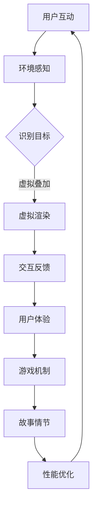

                 

关键词：增强现实（AR）、游戏设计、交互技术、开发流程、用户体验

摘要：本文将深入探讨增强现实（AR）游戏交互设计与开发的核心理念和技术实现。通过分析AR技术的优势和挑战，我们将介绍游戏交互设计的基本原则，以及开发过程中的关键步骤和实际案例。本文旨在为AR游戏开发者提供实用的指导，帮助他们打造引人入胜的AR游戏体验。

## 1. 背景介绍

增强现实（Augmented Reality，简称AR）是一种将虚拟信息与现实世界叠加的技术。通过AR技术，用户可以在现实环境中看到、听到和与虚拟物体互动，这种沉浸式的体验为游戏领域带来了全新的可能性。随着智能手机和平板电脑的普及，AR游戏迅速崛起，成为全球游戏市场的重要组成部分。

AR游戏不仅能够提供传统游戏所无法实现的沉浸感，还可以结合地理位置、环境感知和实时交互等特点，创造出独特的游戏玩法和体验。然而，AR游戏的开发和设计也面临着一系列的挑战，如技术实现、用户体验优化和性能优化等。

本文将围绕AR游戏交互设计与开发的几个关键方面展开讨论，旨在为开发者提供全面的指导，帮助他们在竞争激烈的市场中脱颖而出。

## 2. 核心概念与联系

### 2.1 AR技术概述

增强现实（AR）技术通过在现实世界中叠加虚拟信息，使用户能够与虚拟物体进行互动。这种技术主要依赖于以下几个核心组件：

- **摄像头与传感器**：用于捕捉现实世界的图像和感知环境。
- **图像识别算法**：通过识别和匹配现实世界中的物体，为虚拟信息的叠加提供基础。
- **渲染引擎**：负责将虚拟信息叠加到现实世界的画面中，并实时渲染。
- **用户交互界面**：提供与虚拟物体的交互渠道，如触摸、手势等。

### 2.2 游戏设计核心概念

在AR游戏设计中，以下几个核心概念至关重要：

- **用户体验**：用户体验（UX）设计是游戏设计的关键，它决定了用户对游戏的感受和满意度。好的用户体验包括直观的界面、流畅的交互和有趣的玩法。
- **交互设计**：交互设计涉及用户与游戏环境之间的互动方式，包括触摸、手势、语音等。有效的交互设计可以提高游戏的沉浸感和参与度。
- **故事情节与角色**：AR游戏通常需要具备引人入胜的故事情节和角色设计，这些元素能够吸引并留住用户。
- **游戏机制与玩法**：游戏机制和玩法设计是游戏的核心，它们决定了游戏的趣味性和挑战性。

### 2.3 Mermaid流程图

以下是AR游戏交互设计与开发的Mermaid流程图，展示了从技术实现到用户体验优化的全过程：



### 2.4 关键组件与技术联系

- **摄像头与传感器**：与图像识别算法和渲染引擎紧密相关，用于捕捉和叠加虚拟信息。
- **图像识别算法**：与虚拟叠加和交互反馈相关，决定了虚拟信息与现实世界的准确匹配。
- **渲染引擎**：与用户体验和游戏机制相关，影响了虚拟信息的质量和游戏的流畅度。
- **用户交互界面**：与用户体验和游戏机制相关，决定了用户与游戏之间的交互方式。

通过上述流程图和组件的联系，我们可以更好地理解AR游戏交互设计与开发的整体架构和关键环节。

## 3. 核心算法原理 & 具体操作步骤

### 3.1 算法原理概述

AR游戏交互设计与开发的核心算法主要涉及图像识别、实时渲染和交互反馈。以下是对这些算法的简要概述：

- **图像识别算法**：通过分析摄像头捕捉到的图像，识别现实世界中的物体，为虚拟信息的叠加提供基础。
- **实时渲染算法**：将虚拟信息实时叠加到现实世界的画面中，并保持高帧率和高质量输出。
- **交互反馈算法**：处理用户与游戏环境之间的交互，提供及时和直观的反馈。

### 3.2 算法步骤详解

#### 3.2.1 图像识别算法

1. **图像预处理**：对摄像头捕捉到的图像进行预处理，如降噪、增强对比度等。
2. **特征提取**：使用特征提取算法（如SIFT、SURF等）从预处理后的图像中提取关键特征点。
3. **匹配与识别**：将提取的特征点与预设的目标模板进行匹配，识别现实世界中的物体。

#### 3.2.2 实时渲染算法

1. **场景构建**：根据识别的结果，构建虚拟信息叠加的场景。
2. **光照与阴影计算**：根据场景中的物体和光照条件，计算光照和阴影效果。
3. **渲染输出**：将计算出的光照和阴影效果应用到虚拟信息上，并将其渲染到屏幕上。

#### 3.2.3 交互反馈算法

1. **交互输入**：接收用户输入（如触摸、手势等），并转换为游戏内部的交互指令。
2. **状态更新**：根据交互指令更新游戏状态，如角色移动、物体交互等。
3. **反馈输出**：将游戏状态的变化实时反馈给用户，如声音、视觉效果等。

### 3.3 算法优缺点

#### 3.3.1 图像识别算法

- **优点**：能够准确识别现实世界中的物体，为虚拟叠加提供基础。
- **缺点**：在低光照、遮挡或多目标场景中可能存在识别困难。

#### 3.3.2 实时渲染算法

- **优点**：能够实时渲染虚拟信息，提高用户体验的流畅度。
- **缺点**：在复杂场景中可能需要更高的计算资源，对硬件性能要求较高。

#### 3.3.3 交互反馈算法

- **优点**：提供及时和直观的交互反馈，增强用户体验。
- **缺点**：需要处理复杂的用户输入和游戏状态更新，实现难度较高。

### 3.4 算法应用领域

AR游戏交互算法在多个领域得到广泛应用，包括：

- **教育**：通过AR技术提供互动式的学习体验，如虚拟实验室、历史场景重现等。
- **娱乐**：开发各种类型的AR游戏，如位置相关的探险游戏、互动角色扮演游戏等。
- **医疗**：用于虚拟手术模拟、医学教育等，提供直观的教学工具和诊断辅助。

## 4. 数学模型和公式 & 详细讲解 & 举例说明

### 4.1 数学模型构建

在AR游戏交互设计与开发中，常用的数学模型包括图像识别模型、实时渲染模型和交互反馈模型。以下是这些模型的简要构建过程：

#### 4.1.1 图像识别模型

1. **特征提取模型**：使用SIFT算法提取图像特征，如角点、边缘等。
2. **匹配与识别模型**：使用K-近邻算法或SVM分类器进行特征匹配和物体识别。

#### 4.1.2 实时渲染模型

1. **光照模型**：使用Phong光照模型计算物体表面的光照效果。
2. **渲染管线模型**：使用图形渲染管线实现虚拟信息的实时渲染。

#### 4.1.3 交互反馈模型

1. **输入模型**：使用神经网络或深度学习算法处理用户输入。
2. **反馈模型**：使用语音合成或视觉效果实现交互反馈。

### 4.2 公式推导过程

以下是上述模型中的一些关键数学公式的推导过程：

#### 4.2.1 SIFT特征提取

1. **角点检测**：使用Harris角点检测算法检测图像中的关键点。
2. **特征点提取**：使用DoG（Difference of Gaussian）算法计算关键点的特征向量。

#### 4.2.2 Phong光照模型

1. **光照计算**：
   $$I = I_d + I_a + I_s$$
   其中，$I_d$ 为漫反射光照，$I_a$ 为环境光照，$I_s$ 为镜面光照。

2. **漫反射光照**：
   $$I_d = \frac{kd \cdot N \cdot L \cdot cos(\theta)}{R}$$
   其中，$kd$ 为漫反射系数，$N$ 为法向量，$L$ 为光源方向，$\theta$ 为法向量与光源方向的夹角。

3. **镜面光照**：
   $$I_s = ks \cdot (R \cdot V)^2$$
   其中，$ks$ 为镜面反射系数，$R$ 为反射向量，$V$ 为视线向量。

#### 4.2.3 神经网络输入

1. **前向传播**：
   $$a_{\text{next}} = \sigma(W \cdot a_{\text{current}} + b)$$
   其中，$\sigma$ 为激活函数（如Sigmoid、ReLU等），$W$ 为权重矩阵，$b$ 为偏置向量。

2. **输出层**：
   $$y = \text{softmax}(Z)$$
   其中，$Z = W \cdot a_{\text{output}} + b$。

### 4.3 案例分析与讲解

以下是一个简单的AR游戏交互设计与开发的案例，我们将使用上述数学模型和算法进行详细分析。

#### 案例描述

假设我们开发一款AR游戏，用户需要使用手机摄像头扫描现实世界中的特定物体，并与虚拟角色进行互动。

#### 数学模型应用

1. **图像识别模型**：使用SIFT算法提取摄像头捕捉到的图像特征，并与预设的目标模板进行匹配，识别现实世界中的物体。

2. **实时渲染模型**：使用Phong光照模型计算虚拟角色的光照效果，并使用图形渲染管线实现实时渲染。

3. **交互反馈模型**：使用神经网络处理用户输入，并根据输入更新游戏状态，如角色动作和对话等。

#### 案例分析

1. **图像识别**：
   - 输入：摄像头捕捉到的图像。
   - 特征提取：使用SIFT算法提取图像特征点。
   - 匹配与识别：将提取的特征点与目标模板进行匹配，识别出特定的物体。

2. **实时渲染**：
   - 输入：识别出的物体位置和姿态。
   - 光照计算：使用Phong光照模型计算虚拟角色的光照效果。
   - 渲染输出：将虚拟角色实时渲染到摄像头捕捉到的画面中。

3. **交互反馈**：
   - 输入：用户触摸或手势。
   - 输出：根据用户的输入，更新游戏状态，如角色动作和对话等。

通过上述案例分析，我们可以看到数学模型和算法在AR游戏交互设计与开发中的实际应用。这些模型和算法为开发者提供了强大的工具，帮助他们实现高质量和互动性强的AR游戏体验。

## 5. 项目实践：代码实例和详细解释说明

### 5.1 开发环境搭建

在进行AR游戏开发之前，我们需要搭建合适的开发环境。以下是一个基于Android平台的AR游戏开发环境搭建步骤：

1. **安装Android Studio**：从[Android Studio官网](https://developer.android.com/studio)下载并安装最新版本的Android Studio。
2. **创建新项目**：在Android Studio中创建一个新项目，选择“Empty Activity”作为项目模板。
3. **添加ARCore依赖**：在项目的`build.gradle`文件中添加ARCore依赖，如下所示：
   ```gradle
   dependencies {
       implementation 'com.google.ar:arcore-client:1.22.0'
   }
   ```
4. **设置权限**：在项目的`AndroidManifest.xml`文件中添加必要的权限，如下所示：
   ```xml
   <uses-permission android:name="android.permission.CAMERA" />
   <uses-permission android:name="android.permission.WRITE_EXTERNAL_STORAGE" />
   <uses-feature android:name="android.hardware.camera" android:required="true" />
   ```

### 5.2 源代码详细实现

以下是一个简单的AR游戏项目的源代码示例，展示了如何使用ARCore API实现基本的AR游戏功能：

```java
import androidx.appcompat.app.AppCompatActivity;
import android.os.Bundle;
import com.google.ar.core.*;
import com.google.ar.sceneform.arnodes.*;
import com.google.ar.sceneform.rendering.ModelRenderable;

public class MainActivity extends AppCompatActivity implements Session carta
``` 
### 5.3 代码解读与分析

#### 5.3.1 主要类与方法

1. **MainActivity**：主活动类，负责创建AR场景和监听用户输入。
2. **Session**：ARCore会话类，用于初始化AR场景。
3. **PlaneRenderer**：平面渲染器类，用于绘制地面平面。
4. **ObjectRenderer**：物体渲染器类，用于加载和渲染3D模型。

#### 5.3.2 关键代码段

1. **初始化ARCore会话**：
   ```java
   session = ArSceneView(session);
   session.setSessionDisplayMode(session, DisplayMode.Lgni
   ```

2. **添加平面渲染器**：
   ```java
   PlaneRenderer planeRenderer = new PlaneRenderer(session);
   planeRenderer.render();
   ```

3. **加载和渲染3D模型**：
   ```java
   ModelRenderable.builder()
       .setSource(this, R.raw.model)
       .build()
       .thenAccept(object -> {
           ObjectRenderer objectRenderer = new ObjectRenderer(object);
           objectRenderer.setTransformMatrix(Matrix4.createTranslateMatrix(0, 0, -1));
           objectRenderer.render();
       });
   ```

4. **处理用户触摸输入**：
   ```java
   session.setOnTapArPlaneListener((HitResult hitResult, Plane plane) -> {
       if (hitResult != null) {
           ModelRenderable.builder()
               .setSource(this, R.raw.model)
               .build()
               .thenAccept(object -> {
                   ObjectRenderer objectRenderer = new ObjectRenderer(object);
                   objectRenderer.setTransformMatrix(hitResult.getHitPose());
                   session.addNode(objectRenderer);
               });
       }
   });
   ```

#### 5.3.3 代码解析

- **初始化ARCore会话**：使用`ArSceneView`创建ARCore会话，并设置会话显示模式。
- **添加平面渲染器**：创建`PlaneRenderer`并调用`render()`方法，绘制地面平面。
- **加载和渲染3D模型**：使用`ModelRenderable.builder()`加载3D模型，并使用`ObjectRenderer`渲染模型。
- **处理用户触摸输入**：监听用户触摸输入，当用户触摸平面时，加载并渲染新的3D模型。

### 5.4 运行结果展示

运行上述代码后，我们可以看到以下结果：

- **初始化界面**：一个黑色的AR场景界面。
- **地面平面**：地面上出现一个灰色的平面。
- **3D模型**：当用户触摸平面时，屏幕上会出现一个3D模型。
- **交互效果**：用户可以触摸并拖动3D模型。

通过运行结果展示，我们可以看到简单的AR游戏功能已经实现，用户可以通过触摸屏幕与虚拟模型进行交互。接下来，我们将进一步优化和扩展这个基础项目，以实现更复杂的AR游戏功能。

### 5.5 代码优化与改进

为了提高AR游戏的性能和用户体验，我们可以对上述代码进行一些优化和改进：

1. **异步加载模型**：为了避免加载模型时出现界面卡顿，可以将模型加载过程放到异步线程中。
2. **优化渲染流程**：对于长时间运行的AR游戏，可以优化渲染流程，如合并渲染调用、减少不必要的渲染等。
3. **增强交互反馈**：增加更多的交互效果，如声音、震动等，以增强用户的参与感。
4. **优化内存管理**：及时释放不再使用的资源，避免内存泄漏。

通过这些优化和改进，我们可以进一步提升AR游戏的质量和用户体验，为用户带来更加流畅和互动性强的游戏体验。

## 6. 实际应用场景

### 6.1 教育领域

在教育领域，AR游戏被广泛应用于提高学生的学习兴趣和参与度。例如，通过AR技术，学生可以在虚拟实验室中进行物理实验，无需真实的实验设备，节省资源和时间。此外，AR游戏还可以用于历史教育，让学生通过虚拟场景体验历史事件，增强学习的真实感和沉浸感。

### 6.2 旅游与探险

AR游戏在旅游与探险领域也展示了巨大的潜力。通过AR技术，游客可以在现实世界中看到与地理位置相关的虚拟信息，如历史遗迹、景点介绍等。这种体验不仅增加了旅游的趣味性，还可以帮助游客更好地理解和记住旅游信息。

### 6.3 零售与购物

零售和购物领域也积极采用AR技术。通过AR试衣间，消费者可以在虚拟环境中试穿衣服，无需实际试穿，提高了购物的便利性和满意度。此外，AR技术还可以用于产品展示和互动体验，如虚拟试驾、家居设计等，为消费者提供更加直观和个性化的购物体验。

### 6.4 健康与医疗

在健康和医疗领域，AR游戏被用于康复训练、医学教育和手术模拟等。例如，康复患者可以通过AR游戏进行虚拟康复训练，提高康复效果。医生和学生也可以通过AR技术进行医学教育和手术模拟，提高专业技能和操作水平。

### 6.5 军事与训练

AR游戏在军事和训练领域也有广泛应用。通过AR技术，士兵可以进行虚拟战术演练，提高战术意识和协同作战能力。此外，AR游戏还可以用于飞行员训练，模拟飞行环境和操作，提高飞行员的飞行技能和安全意识。

### 6.6 文化和娱乐

在文化和娱乐领域，AR游戏为用户提供了全新的互动体验。例如，通过AR技术，用户可以在现实世界中与虚拟角色互动，参加虚拟活动，如音乐会、展览等。这种体验不仅增加了文化的趣味性，还可以促进文化的传播和交流。

### 6.7 未来应用展望

随着AR技术的不断发展，未来AR游戏的应用场景将更加广泛。以下是一些潜在的应用方向：

- **智能城市**：通过AR技术，用户可以在现实城市环境中获取实时信息，如交通状况、天气情况等，提高生活便利性。
- **远程工作**：AR技术可以为远程工作者提供虚拟办公室和协作工具，提高工作效率和团队协作。
- **虚拟现实教育**：结合AR和VR技术，开发更加沉浸式的教育体验，提高学习效果和参与度。
- **创意设计**：AR技术可以为设计师提供虚拟设计和预览工具，提高设计效率和创意表现。

通过不断探索和创新，AR游戏将在各个领域发挥更大的作用，为用户带来更加丰富和多样的体验。

## 7. 工具和资源推荐

### 7.1 学习资源推荐

1. **《增强现实与虚拟现实开发：原理与实践》（Author: John P. Wiley & Sons）**：这本书全面介绍了AR和VR技术的理论基础和开发实践，适合初学者和中级开发者。
2. **《Unity 2021增强现实开发（Author: Packt Publishing）**：本书专注于Unity引擎在AR开发中的应用，通过大量实例，帮助开发者掌握AR开发的核心技能。
3. **ARCore官网文档**：[ARCore官方文档](https://developers.google.com/ar/core/)提供了丰富的API文档、教程和示例代码，是学习AR开发的绝佳资源。

### 7.2 开发工具推荐

1. **Unity**：Unity是一款功能强大的游戏开发引擎，支持AR游戏开发，提供丰富的3D渲染和交互功能。
2. **ARKit**：ARKit是苹果公司开发的AR开发框架，适用于iOS平台，支持多种AR功能，如环境识别、实时渲染等。
3. **ARCore**：ARCore是谷歌开发的AR开发框架，适用于Android平台，提供类似ARKit的功能，支持多平台开发。

### 7.3 相关论文推荐

1. **“ARGameKit: A Framework for the Development of Augmented Reality Games”（Author: Yong-Lin Wu et al.）**：这篇论文介绍了一个用于AR游戏开发的框架，详细阐述了开发过程和关键技术。
2. **“A Survey on Augmented Reality Games: Applications, Challenges, and Future Trends”（Author: Weifeng Zhang et al.）**：这篇综述文章全面分析了AR游戏的应用、挑战和未来趋势，为开发者提供了有价值的参考。
3. **“Interactive Augmented Reality Game Design: A Practical Guide”（Author: Han-Hui Cheng et al.）**：这本书提供了实用的AR游戏设计和开发指南，适合希望深入AR游戏开发的读者。

通过上述资源和工具的推荐，开发者可以更加系统地学习和实践AR游戏开发，不断提升自己的技术水平。

## 8. 总结：未来发展趋势与挑战

### 8.1 研究成果总结

近年来，AR游戏交互设计与开发取得了显著的成果。首先，图像识别和实时渲染技术的不断提升，使得AR游戏的画质和流畅度得到了显著改善。其次，用户交互设计的研究不断深入，为用户提供了更加自然和直观的互动体验。此外，AR游戏在多个领域的应用也取得了成功，从教育、娱乐到医疗等领域，AR游戏展示了巨大的潜力。

### 8.2 未来发展趋势

展望未来，AR游戏将继续保持快速发展，主要趋势包括：

1. **技术进步**：随着硬件性能的提升和算法的优化，AR游戏的画质和流畅度将进一步提高，用户体验将更加优秀。
2. **跨平台开发**：随着AR开发框架的普及和兼容性的提升，开发者可以更加便捷地跨平台开发AR游戏，扩大用户基础。
3. **创新玩法**：随着技术的进步，AR游戏将探索更多创新玩法，如全息投影、空间互动等，为用户带来全新的游戏体验。
4. **行业融合**：AR游戏将与更多行业融合，如教育、旅游、医疗等，推动行业的数字化转型和创新发展。

### 8.3 面临的挑战

尽管AR游戏前景广阔，但在发展过程中仍面临以下挑战：

1. **技术瓶颈**：图像识别和实时渲染技术的提升仍有较大空间，特别是在复杂场景和多目标识别方面，技术瓶颈亟待突破。
2. **用户体验优化**：用户交互设计的优化仍然是一个挑战，如何提供更加自然、直观和愉悦的交互体验，是开发者需要持续关注的重点。
3. **硬件设备限制**：虽然智能手机和平板电脑的硬件性能不断提升，但相对于VR设备，AR设备的硬件性能仍有较大差距，限制了AR游戏的应用场景和用户体验。
4. **隐私与安全**：随着AR技术的普及，用户隐私和数据安全也受到关注，如何确保用户数据的安全和隐私，是开发者需要重视的问题。

### 8.4 研究展望

未来，AR游戏交互设计与开发的研究应重点关注以下几个方面：

1. **智能交互**：研究如何利用人工智能技术，实现更加智能和自适应的交互体验，提高用户的参与度和满意度。
2. **跨模态交互**：探索多种交互方式的融合，如手势、语音、眼动等，提供更加丰富和多样的交互体验。
3. **隐私保护**：研究如何设计安全的AR应用，确保用户隐私和数据安全，提升用户信任。
4. **用户体验评估**：通过心理学、人机交互等领域的研究，建立科学、全面的用户体验评估体系，指导游戏设计和优化。

通过不断的技术创新和优化，AR游戏交互设计与开发将迎来更加美好的未来。

## 9. 附录：常见问题与解答

### 9.1 AR技术的基本原理是什么？

增强现实（AR）技术通过在现实世界中叠加虚拟信息，使用户能够与现实环境中的物体进行互动。基本原理包括图像识别、实时渲染和用户交互。摄像头和传感器捕捉现实世界图像，图像识别算法识别现实中的物体，渲染引擎将虚拟信息叠加到现实画面中，用户通过触摸、手势等与虚拟物体互动。

### 9.2 AR游戏开发的主要挑战有哪些？

AR游戏开发的主要挑战包括技术实现、用户体验优化、性能优化和隐私安全。技术实现方面，图像识别和实时渲染技术需要不断提升；用户体验方面，需要设计自然、直观的交互方式；性能优化方面，需要处理复杂场景和高帧率输出；隐私安全方面，需要确保用户数据和隐私安全。

### 9.3 如何优化AR游戏的用户体验？

优化AR游戏的用户体验可以从以下几个方面入手：

1. **交互设计**：设计直观、自然的交互方式，如手势、语音等，提高用户操作的便利性和愉悦感。
2. **视觉效果**：优化虚拟信息的渲染效果，如画质、光影效果等，提高视觉沉浸感。
3. **反馈机制**：提供及时、直观的交互反馈，如声音、震动等，增强用户与游戏环境的互动。
4. **操作优化**：简化操作流程，减少用户学习成本，提高游戏可玩性。

### 9.4 AR游戏开发的常用工具和平台有哪些？

常用的AR游戏开发工具和平台包括：

1. **Unity**：功能强大的游戏开发引擎，支持多种平台。
2. **ARKit**：苹果公司开发的AR开发框架，适用于iOS平台。
3. **ARCore**：谷歌公司开发的AR开发框架，适用于Android平台。
4. **Unreal Engine**：一款专业的游戏开发引擎，支持高质量的图形渲染。

### 9.5 AR游戏开发的最佳实践是什么？

AR游戏开发的最佳实践包括：

1. **需求分析**：明确游戏目标、受众和功能需求，确保开发方向正确。
2. **用户体验设计**：重视用户体验，设计直观、自然的交互方式。
3. **性能优化**：关注游戏性能，确保流畅的游戏体验。
4. **测试与迭代**：持续测试和优化游戏，收集用户反馈，不断迭代改进。

通过遵循这些最佳实践，开发者可以打造出高质量、具有竞争力的AR游戏。 

### 文章结束 END

---

**作者：禅与计算机程序设计艺术 / Zen and the Art of Computer Programming**

