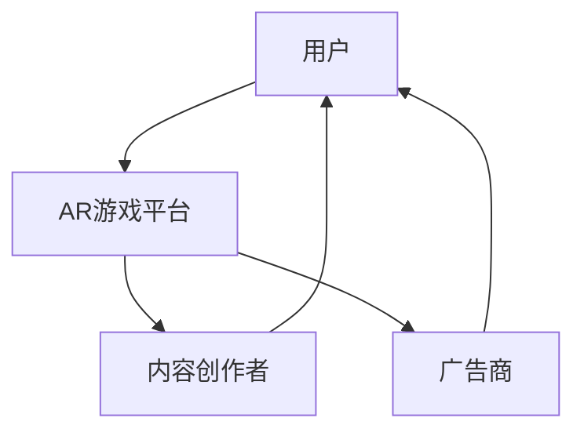

                 

关键词：增强现实（AR），注意力经济，游戏设计，用户参与，商业应用

> 摘要：本文将探讨增强现实（AR）技术在游戏领域的应用，特别是在构建注意力经济方面的潜力。通过分析AR游戏的核心原理、设计技巧、应用案例以及未来的发展趋势，本文旨在为读者提供对这一新兴领域的深入理解。

## 1. 背景介绍

随着技术的不断进步，增强现实（AR）技术已经成为一个备受关注的话题。AR技术通过在现实环境中叠加数字信息，为用户提供了更为丰富和互动的体验。游戏作为娱乐和社交的载体，自然成为了AR技术的重要应用领域。AR游戏不仅结合了虚拟与现实，还通过沉浸式体验和社交互动，极大地提升了用户的参与度和注意力。

### 注意力经济的概念

注意力经济是指利用用户注意力作为资源进行交换和商业化的经济模式。在这个模式中，用户注意力被视为一种稀缺资源，企业和内容创作者通过提供有价值的信息和体验来吸引和留住用户。在数字时代，如何获取和保持用户的注意力成为了企业和创业者的重要课题。

## 2. 核心概念与联系

### AR游戏的核心概念

AR游戏的核心概念在于将虚拟游戏元素叠加到现实世界中，使用户在真实环境中能够与虚拟对象进行交互。这种技术不仅增强了游戏的沉浸感，还提升了用户的参与度和乐趣。

### 注意力经济的关联

AR游戏与注意力经济有着紧密的联系。通过提供新颖、互动和有趣的体验，AR游戏能够吸引并保持用户的注意力，从而为企业和开发者带来商业价值。

### Mermaid 流程图



### 解读

- 用户通过AR游戏平台接入AR游戏，并通过互动获得娱乐和价值。
- 内容创作者通过设计游戏内容吸引用户，提升品牌影响力。
- 广告商通过游戏平台触达用户，实现商业宣传和品牌推广。

## 3. 核心算法原理 & 具体操作步骤

### 3.1 算法原理概述

AR游戏的实现依赖于多个核心算法，包括图像识别、位置追踪、渲染和用户交互等。这些算法共同作用，确保虚拟游戏元素能够在现实环境中准确、稳定地呈现。

### 3.2 算法步骤详解

1. **图像识别**：使用图像识别算法对现实环境中的特定图像或标识进行识别。
2. **位置追踪**：通过摄像头和传感器获取现实环境中的坐标信息，实时跟踪虚拟对象的运动轨迹。
3. **渲染**：将虚拟对象渲染到现实环境中，使其与现实环境融合。
4. **用户交互**：通过触屏或手势识别等方式，实现用户与虚拟对象的互动。

### 3.3 算法优缺点

#### 优点：

- **沉浸感强**：用户能够在现实环境中体验到虚拟游戏的互动，提高参与度。
- **创新性**：AR游戏提供了全新的游戏体验，吸引了大量用户。

#### 缺点：

- **技术复杂**：实现高质量的AR游戏需要复杂的算法和技术支持。
- **性能瓶颈**：处理大量数据和高频交互可能会影响游戏性能。

### 3.4 算法应用领域

AR游戏在多个领域具有广泛的应用前景，包括教育、医疗、市场营销和娱乐等。例如，教育领域的AR应用可以提供互动式的学习体验，提高学生的学习兴趣和效果。

## 4. 数学模型和公式 & 详细讲解 & 举例说明

### 4.1 数学模型构建

在AR游戏中，位置追踪算法是一个核心部分。常用的位置追踪算法包括视觉追踪和惯性测量单元（IMU）追踪。以下是一个基于视觉追踪的位置追踪模型：

\[ P(t) = A \cdot P(t-1) + B \cdot V(t) \]

其中，\( P(t) \) 表示当前时刻的位置向量，\( A \) 是位置预测矩阵，\( B \) 是控制矩阵，\( V(t) \) 是过程噪声。

### 4.2 公式推导过程

位置追踪模型通常由两部分组成：状态空间模型和观测模型。

#### 状态空间模型：

\[ x(t) = A(t-1) \cdot x(t-1) + B(t) \cdot u(t-1) + w(t-1) \]

\[ z(t) = H(t) \cdot x(t) + v(t) \]

其中，\( x(t) \) 表示状态向量，\( u(t-1) \) 是控制输入，\( w(t-1) \) 是过程噪声，\( z(t) \) 是观测向量，\( v(t) \) 是观测噪声。

#### 观测模型：

\[ P(t) = A \cdot P(t-1) + B \cdot V(t) \]

\[ y(t) = P(t) + e(t) \]

其中，\( P(t) \) 是位置预测，\( e(t) \) 是观测误差。

### 4.3 案例分析与讲解

假设我们使用一个AR游戏来追踪用户手中的卡片。在这个游戏中，卡片上的图案是追踪的关键。以下是一个简单的例子：

```latex
\[
\begin{aligned}
    x(t) &= [x(t-1), y(t-1)]^T \\
    P(t) &= \begin{bmatrix}
        x(t) \\
        y(t)
    \end{bmatrix} \\
    A &= \begin{bmatrix}
        1 & 0 \\
        0 & 1
    \end{bmatrix} \\
    B &= \begin{bmatrix}
        0 \\
        0
    \end{bmatrix} \\
    H &= \begin{bmatrix}
        1 & 0 \\
        0 & 1
    \end{bmatrix} \\
    e(t) &= \begin{bmatrix}
        e_x(t) \\
        e_y(t)
    \end{bmatrix} \\
    v(t) &= \begin{bmatrix}
        v_x(t) \\
        v_y(t)
    \end{bmatrix}
\end{aligned}
\]
```

在这个例子中，我们假设用户手中的卡片是静止的，因此控制输入 \( u(t-1) \) 为零。通过这个模型，我们可以预测卡片的位置，并在每次观测到卡片时更新预测值。

## 5. 项目实践：代码实例和详细解释说明

### 5.1 开发环境搭建

为了实践AR游戏的位置追踪算法，我们需要搭建一个开发环境。以下是一个简单的环境搭建步骤：

1. 安装Unity游戏引擎。
2. 安装ARKit或ARCore等AR开发工具。
3. 安装相关编程语言（如C#）的集成开发环境（IDE）。

### 5.2 源代码详细实现

以下是AR游戏位置追踪的简单C#代码示例：

```csharp
using UnityEngine;

public class PositionTracker : MonoBehaviour
{
    public Transform virtualObject;
    public Camera arCamera;

    private Vector3 currentPosition;

    void Start()
    {
        currentPosition = virtualObject.position;
    }

    void Update()
    {
        // 使用ARKit或ARCore的位置追踪功能获取真实世界的位置
        Vector3 newPosition = GetNewPositionFromAR();

        // 更新虚拟对象的预测位置
        currentPosition = Vector3.Lerp(currentPosition, newPosition, Time.deltaTime);
        virtualObject.position = currentPosition;
    }

    private Vector3 GetNewPositionFromAR()
    {
        // 实现AR位置追踪逻辑，例如使用ARKit或ARCore的API获取位置信息
        // 这里只是示例代码，实际实现会有更多细节
        return new Vector3(0, 0, 0);
    }
}
```

### 5.3 代码解读与分析

这段代码实现了基本的AR游戏位置追踪功能。在`Start`方法中，我们初始化了虚拟对象的初始位置。在`Update`方法中，我们每次帧更新时获取新的位置信息，并使用插值方法将当前位置逐步更新到新的位置。

### 5.4 运行结果展示

当运行这段代码时，虚拟对象将根据现实世界的位置信息进行动态追踪，并在Unity编辑器中显示出来。

## 6. 实际应用场景

AR游戏在多个领域都有广泛的应用。以下是一些实际应用场景：

### 6.1 教育领域

AR游戏可以提供互动式的学习体验，帮助学生更好地理解和记忆知识。例如，通过AR游戏模拟生物解剖、化学实验等，可以增强学生的动手能力和学习兴趣。

### 6.2 市场营销

AR游戏可以用于市场营销活动，吸引消费者的注意力，提高品牌知名度。例如，品牌可以通过AR游戏推出新产品，并与消费者进行互动，从而增强品牌与消费者之间的联系。

### 6.3 娱乐行业

AR游戏为娱乐行业带来了新的可能性，提供了新颖的娱乐体验。例如，玩家可以通过AR游戏探索虚拟世界，与虚拟角色互动，甚至参与现实世界的游戏挑战。

## 7. 未来应用展望

随着技术的不断进步，AR游戏在未来有望在更多领域得到应用。以下是一些未来应用展望：

### 7.1 更高的沉浸感

未来AR游戏将更加注重提升用户的沉浸感，通过更先进的视觉和听觉效果，提供更为逼真的虚拟体验。

### 7.2 更广泛的应用场景

AR游戏将在更多领域得到应用，包括医疗、建筑、设计等。通过AR技术，用户可以更直观地了解和体验这些领域的内容。

### 7.3 更强的社交互动

未来AR游戏将更加强调社交互动，用户可以通过AR游戏与朋友一起游戏，分享游戏体验。

## 8. 总结：未来发展趋势与挑战

### 8.1 研究成果总结

本文探讨了AR游戏在注意力经济中的潜力，分析了AR游戏的核心算法原理和具体操作步骤，并通过实际项目实践展示了AR游戏的应用效果。

### 8.2 未来发展趋势

未来AR游戏将更加注重用户体验，通过技术创新提升沉浸感和互动性。同时，AR游戏将在更多领域得到应用，拓展其商业价值。

### 8.3 面临的挑战

AR游戏在技术实现、用户体验和市场推广等方面仍面临诸多挑战。例如，如何提高AR游戏的性能和稳定性，如何吸引更多的用户和开发者，都是需要解决的问题。

### 8.4 研究展望

未来研究可以关注AR游戏的设计原则、用户体验评估、商业模式的创新等方面，为AR游戏的持续发展提供新的思路和方向。

## 9. 附录：常见问题与解答

### 9.1 AR游戏与虚拟现实（VR）的区别是什么？

AR游戏和VR技术虽然都是虚拟与现实的结合，但它们的应用场景和体验方式有所不同。AR游戏通常将虚拟元素叠加到现实环境中，用户可以在现实世界中与虚拟对象互动。而VR技术则提供完全沉浸式的虚拟体验，用户通过VR设备进入一个完全虚拟的世界。

### 9.2 AR游戏对硬件有哪些要求？

AR游戏的硬件要求因游戏内容而异，但通常需要支持高分辨率摄像头、传感器和定位系统。例如，iOS设备通常使用ARKit，而Android设备可能需要使用ARCore。高性能的处理器和内存也是保证游戏流畅运行的重要因素。

### 9.3 AR游戏开发有哪些常用的工具和框架？

AR游戏开发常用的工具和框架包括Unity、Unreal Engine、ARKit、ARCore和Vuforia等。这些工具和框架提供了丰富的API和资源，帮助开发者实现AR游戏的功能和效果。

---

作者：禅与计算机程序设计艺术 / Zen and the Art of Computer Programming

