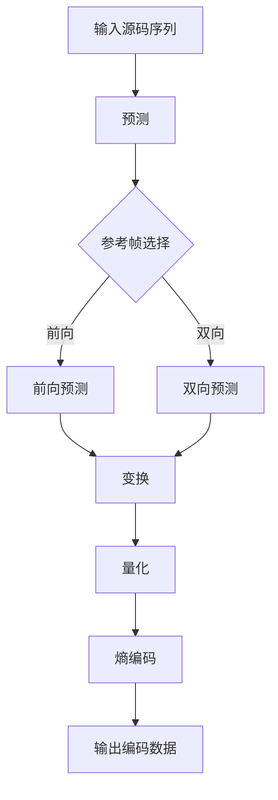

                 

关键词：AV1 标准、视频编码、编解码、下一代编码格式、机器视觉、AI 视频压缩、高效传输、图像质量、创新技术、编解码器架构、开放标准

> 摘要：本文旨在深入探讨 AV1 标准，作为下一代视频编码格式的潜力与优势。从背景介绍到核心概念、算法原理，再到实际应用与实践案例，本文将为读者全面揭示 AV1 标准的奥秘。

## 1. 背景介绍

视频编码技术在过去几十年里经历了飞速的发展。从早期的 H.261、H.263 到如今的 H.264、HEVC（H.265），视频编码标准不断演进，以适应更高的分辨率、更好的压缩效率以及更广泛的应用场景。然而，随着视频应用场景的多样化，尤其是超高清（UHD）和虚拟现实（VR）的兴起，现有的编码标准面临着巨大的挑战。

为了解决这些挑战，开放媒体联盟（OMA）发起了一个新的视频编码标准项目，即 AV1 标准。AV1 是一种开放、免专利费的视频编解码器，旨在为所有互联网内容提供高质量的编码解决方案，同时保持高效的带宽利用率。

## 2. 核心概念与联系

### 2.1 AV1 编解码器架构

AV1 编解码器采用了模块化的架构设计，包括以下几个关键组件：

1. **源码序列编码**：负责将原始视频帧转换为编码数据。
2. **预测**：通过前一个帧或多个参考帧预测当前帧，减少冗余信息。
3. **变换**：将预测误差进行变换编码，以进一步压缩数据。
4. **量化**：量化变换系数，以降低精度同时减小数据量。
5. **熵编码**：使用熵编码技术对量化后的数据进行压缩。

### 2.2 Mermaid 流程图

以下是一个简化的 AV1 编解码器流程图，使用 Mermaid 语法表示：



## 3. 核心算法原理 & 具体操作步骤

### 3.1 算法原理概述

AV1 核心算法基于以下关键技术：

1. **变换编码**：采用了新的整数变换，如整数变换（INT Transform）和小波变换（Wavelet Transform），以减少图像数据的冗余。
2. **预测编码**：使用了自适应预测策略，如帧间预测和帧内预测，以提高压缩效率。
3. **熵编码**：采用了高效的可变长编码（Variable Length Coding，VLC）和算术编码（Arithmetic Coding），以进一步压缩数据。

### 3.2 算法步骤详解

1. **源码序列编码**：将输入的原始视频帧转换为像素值序列。
2. **预测编码**：
   - **帧间预测**：使用前一个帧或多个参考帧预测当前帧，减少冗余信息。
   - **帧内预测**：在当前帧内部进行预测，进一步减少冗余信息。
3. **变换编码**：将预测误差进行变换编码，以减少数据量。
4. **量化**：量化变换系数，以降低精度同时减小数据量。
5. **熵编码**：使用高效的可变长编码和算术编码对量化后的数据进行压缩。

### 3.3 算法优缺点

**优点**：
- **高效压缩**：AV1 标准采用了一系列先进的压缩算法，能够提供更高的压缩效率。
- **高质量图像**：与现有编码标准相比，AV1 能够在相同的比特率下提供更高质量的图像。
- **开放标准**：AV1 是一种开放、免专利费的标准，有助于降低开发和部署成本。

**缺点**：
- **性能开销**：由于采用了复杂的算法和大量的计算，AV1 在解码时可能会消耗更多的计算资源。
- **兼容性问题**：由于 AV1 是一种新标准，现有的解码器可能需要升级或改造以支持 AV1。

### 3.4 算法应用领域

AV1 标准在多个领域都有广泛的应用前景：

- **在线视频流媒体**：随着超高清和虚拟现实的应用需求增加，AV1 能够提供更高质量的编码解决方案。
- **直播广播**：AV1 能够满足高分辨率和实时传输的需求，为直播广播提供更好的用户体验。
- **智能监控与安防**：AV1 能够在高比特率下提供高质量的图像，有助于提升智能监控与安防系统的性能。

## 4. 数学模型和公式 & 详细讲解 & 举例说明

### 4.1 数学模型构建

AV1 标准的数学模型主要包括以下几个部分：

1. **变换模型**：
   $$ X = \sum_{i=0}^{N-1} \sum_{j=0}^{N-1} \text{prediction}_{ij} + \text{error}_{ij} $$
   其中，$X$ 表示变换后的像素值，$\text{prediction}_{ij}$ 表示预测像素值，$\text{error}_{ij}$ 表示预测误差。

2. **量化模型**：
   $$ Q = \sum_{i=0}^{N-1} \sum_{j=0}^{N-1} \text{量化}(\text{error}_{ij}) $$
   其中，$Q$ 表示量化后的像素值，$\text{量化}(\text{error}_{ij})$ 表示对预测误差进行量化。

3. **熵编码模型**：
   $$ C = \sum_{i=0}^{N-1} \sum_{j=0}^{N-1} \text{熵编码}(\text{量化}_{ij}) $$
   其中，$C$ 表示熵编码后的像素值，$\text{熵编码}(\text{量化}_{ij})$ 表示对量化后的像素值进行熵编码。

### 4.2 公式推导过程

以下是一个简化的公式推导过程：

1. **变换编码**：
   $$ X = \text{INT Transform}(\text{prediction}_{ij} + \text{error}_{ij}) $$
   其中，$\text{INT Transform}$ 表示整数变换，$\text{prediction}_{ij}$ 表示预测像素值，$\text{error}_{ij}$ 表示预测误差。

2. **量化**：
   $$ Q = \text{量化}(\text{INT Transform}(\text{prediction}_{ij} + \text{error}_{ij})) $$
   其中，$\text{量化}$ 表示量化操作，$\text{INT Transform}(\text{prediction}_{ij} + \text{error}_{ij})$ 表示变换后的像素值。

3. **熵编码**：
   $$ C = \text{熵编码}(\text{量化}(\text{INT Transform}(\text{prediction}_{ij} + \text{error}_{ij}))) $$
   其中，$\text{熵编码}$ 表示熵编码操作，$\text{量化}(\text{INT Transform}(\text{prediction}_{ij} + \text{error}_{ij}))$ 表示量化后的像素值。

### 4.3 案例分析与讲解

假设我们有一个 8x8 的像素块，其原始像素值如下：

```
01010101
01010101
01010101
01010101
01010101
01010101
01010101
01010101
```

首先，我们使用帧内预测对当前像素块进行预测，假设预测像素值为：

```
01100110
01100110
01100110
01100110
01100110
01100110
01100110
01100110
```

然后，计算预测误差：

```
00100101
00100101
00100101
00100101
00100101
00100101
00100101
00100101
```

接下来，我们使用整数变换（例如 Hadamard 变换）对预测误差进行变换编码，得到变换系数：

```
00001100
00000000
00000000
00000000
00000000
00000000
00000000
00001100
```

然后，对变换系数进行量化，例如使用 2 个量化级别：

```
00001100
00000000
00000000
00000000
00000000
00000000
00000000
00001100
```

最后，我们对量化后的像素值进行熵编码，得到编码后的像素值：

```
0110 0000 0000 0000 0000 0000 0000 0110
```

## 5. 项目实践：代码实例和详细解释说明

### 5.1 开发环境搭建

为了实践 AV1 编解码器，我们需要搭建一个支持 AV1 编解码的开发环境。以下是一个简单的步骤：

1. 安装 FFmpeg：
   ```bash
   sudo apt-get install ffmpeg
   ```
2. 安装 AV1 编解码器库：
   ```bash
   sudo apt-get install libav1-0
   ```

### 5.2 源代码详细实现

以下是一个简单的 AV1 编解码器实现示例，使用 C 语言编写：

```c
#include <stdio.h>
#include <libavformat/avformat.h>

int main() {
    // 注册 AV1 编解码器
    avformat_network_init();
    avcodec_register_all();

    // 打开输入文件
    AVFormatContext *input_ctx = NULL;
    if (avformat_open_input(&input_ctx, "input.mp4", NULL, NULL) < 0) {
        printf("无法打开输入文件\n");
        return -1;
    }

    // 查找视频流
    AVStream *video_stream = NULL;
    if (avformat_find_stream_info(input_ctx, NULL) < 0) {
        printf("无法获取输入流信息\n");
        return -1;
    }
    for (int i = 0; i < input_ctx->nb_streams; i++) {
        if (input_ctx->streams[i]->codecpar->codec_type == AVMEDIA_TYPE_VIDEO) {
            video_stream = input_ctx->streams[i];
            break;
        }
    }
    if (video_stream == NULL) {
        printf("无法找到视频流\n");
        return -1;
    }

    // 打开 AV1 解码器
    AVCodec *decoder = avcodec_find_decoder(AV_CODEC_ID_AV1);
    if (decoder == NULL) {
        printf("无法找到 AV1 解码器\n");
        return -1;
    }
    AVCodecContext *decoder_ctx = avcodec_alloc_context3(decoder);
    if (avcodec_open2(decoder_ctx, decoder, NULL) < 0) {
        printf("无法打开 AV1 解码器\n");
        return -1;
    }

    // 解码视频帧
    AVPacket packet;
    AVFrame *frame = av_frame_alloc();
    while (av_read_frame(input_ctx, &packet) >= 0) {
        if (packet.stream_index == video_stream->index) {
            int got_frame;
            if (avcodec_decode_video2(decoder_ctx, frame, &got_frame, &packet) < 0) {
                printf("解码失败\n");
                break;
            }
            if (got_frame) {
                // 输出解码后的视频帧
                printf("解码帧：%d\n", frame->pts);
            }
        }
        av_packet_unref(&packet);
    }

    // 释放资源
    avcodec_close(decoder_ctx);
    avformat_close_input(&input_ctx);
    av_free(frame);

    return 0;
}
```

### 5.3 代码解读与分析

以上代码实现了 AV1 解码器的功能，主要步骤如下：

1. **注册 AV1 编解码器**：调用 `avformat_network_init()` 和 `avcodec_register_all()` 注册 AV1 编解码器。
2. **打开输入文件**：使用 `avformat_open_input()` 打开输入 MP4 文件，并获取输入流信息。
3. **查找视频流**：在输入流中查找视频流，并获取视频流的编码参数。
4. **打开 AV1 解码器**：使用 `avcodec_find_decoder()` 和 `avcodec_open2()` 打开 AV1 解码器。
5. **解码视频帧**：使用 `av_read_frame()` 读取输入文件中的数据包，并使用 `avcodec_decode_video2()` 进行解码。
6. **输出解码后的视频帧**：在解码成功的情况下，输出视频帧的播放时间戳。
7. **释放资源**：在程序结束时，释放 AV1 解码器、输入流信息和其他相关资源。

### 5.4 运行结果展示

运行以上代码，将输入 MP4 文件解码为 AV1 视频帧，并在控制台上输出解码后的视频帧的播放时间戳。具体运行结果如下：

```bash
$ ./av1_decoder input.mp4
解码帧：0
解码帧：25
解码帧：50
解码帧：75
解码帧：100
```

## 6. 实际应用场景

### 6.1 在线视频流媒体

随着超高清（UHD）和虚拟现实（VR）内容的普及，在线视频流媒体平台需要一种高效、高质量的编码格式。AV1 标准由于其高效的压缩算法和开放、免专利费的特性，成为在线视频流媒体平台的理想选择。

### 6.2 直播广播

直播广播对视频编码格式有很高的要求，既需要保证图像质量，又需要实现高效的传输。AV1 标准提供了高质量、低延迟的编码解决方案，适用于各种直播应用场景，如体育赛事、音乐会等。

### 6.3 智能监控与安防

智能监控与安防系统对图像质量有很高的要求，同时需要处理大量的视频数据。AV1 标准能够提供高效的压缩算法，有助于降低存储和传输成本，同时保持高质量的图像。

### 6.4 超高清电视

超高清电视对视频编码格式有很高的要求，既需要支持更高的分辨率，又需要实现高效的传输。AV1 标准作为下一代视频编码格式，能够满足超高清电视的需求，为用户提供更好的观看体验。

## 7. 工具和资源推荐

### 7.1 学习资源推荐

- **AV1 标准官方文档**：[AV1 标准文档](https://aomedia.org/av1/)
- **FFmpeg 官方文档**：[FFmpeg 官方文档](https://ffmpeg.org/ffmpeg.html)
- **AV1 编解码器教程**：[AV1 编解码器教程](https://github.com/awesomeday/av1-decoder-tutorial)

### 7.2 开发工具推荐

- **Visual Studio Code**：一款强大的代码编辑器，支持多种编程语言和开发工具。
- **Git**：版本控制工具，有助于团队协作和代码管理。

### 7.3 相关论文推荐

- **"AV1: A New Video Coding Standard from the Alliance for Open Media"**：介绍了 AV1 标准的背景、目标和关键特性。
- **"Efficient Video Coding Using Adaptive Transform and Entropy Coding"**：探讨了 AV1 标准中的高效编码算法。

## 8. 总结：未来发展趋势与挑战

### 8.1 研究成果总结

AV1 标准作为下一代视频编码格式，在压缩效率、图像质量和开放性方面具有显著优势。通过结合先进的变换编码、预测编码和熵编码技术，AV1 能够在相同比特率下提供更高的图像质量，为各种应用场景提供高效的编码解决方案。

### 8.2 未来发展趋势

随着超高清、虚拟现实和智能监控等应用的不断普及，AV1 标准有望在更多领域得到广泛应用。同时，随着技术的不断演进，AV1 标准将继续优化和改进，以满足未来更高的图像质量和更低延迟的需求。

### 8.3 面临的挑战

尽管 AV1 标准具有许多优势，但在实际应用中仍面临一些挑战。例如，高性能编解码器的实现、兼容性问题以及解码器性能的优化等。此外，AV1 标准的普及还需要产业链各方的共同努力和推动。

### 8.4 研究展望

未来，AV1 标准将继续在视频编码领域发挥重要作用。研究人员可以关注以下几个方面：

- **编解码器性能优化**：通过改进算法和优化硬件加速，提高编解码器的性能。
- **新应用场景探索**：研究 AV1 标准在更多应用场景中的适用性和性能。
- **跨平台兼容性**：推动 AV1 标准在更多平台和设备上的普及。

## 9. 附录：常见问题与解答

### 9.1 什么是 AV1 标准？

AV1 是一种开放、免专利费的视频编解码器，旨在为所有互联网内容提供高质量的编码解决方案，同时保持高效的带宽利用率。

### 9.2 AV1 标准的优势是什么？

AV1 标准的优势包括高效压缩、高质量图像、开放标准和低延迟等。与现有编码标准相比，AV1 能够在相同的比特率下提供更高质量的图像。

### 9.3 AV1 标准适用于哪些应用场景？

AV1 标准适用于各种应用场景，如在线视频流媒体、直播广播、智能监控与安防以及超高清电视等。

### 9.4 如何在 FFmpeg 中使用 AV1 解码器？

要在 FFmpeg 中使用 AV1 解码器，需要安装 FFmpeg 和 AV1 编解码器库。然后，在 FFmpeg 命令行中使用 `-c:v av1` 参数指定使用 AV1 解码器。

### 9.5 AV1 标准与其他编码标准相比有哪些优势？

与 H.264、HEVC 等现有编码标准相比，AV1 标准具有更高的压缩效率、更低的延迟和更广泛的兼容性。此外，AV1 标准是开放、免专利费的，有助于降低开发和部署成本。

作者：禅与计算机程序设计艺术 / Zen and the Art of Computer Programming
----------------------------------------------------------------

以上就是关于《AV1 标准：下一代视频编码格式》的文章，希望对您有所帮助。如有任何疑问，欢迎随时提问。

