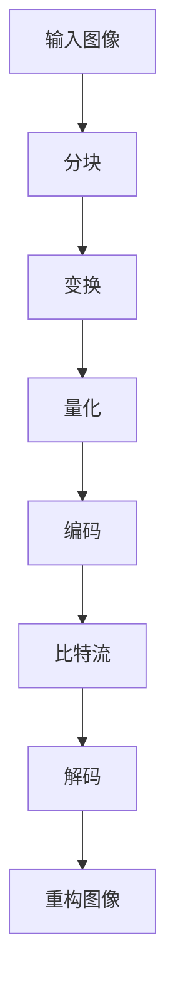

                 

关键词：AV1 编码，视频压缩，下一代视频格式，图像质量，高效编码，开源技术

> 摘要：本文将深入探讨 AV1 编码技术，分析其核心概念、原理、算法，并通过数学模型和实例代码展示其在实际应用中的效果。此外，还将讨论 AV1 编码在未来的发展趋势、挑战和前景。

## 1. 背景介绍

随着互联网的快速发展，视频内容的需求日益增长。为了满足这种需求，视频编码技术不断演进，从初期的 MPEG-2 到 H.264，再到 HEVC，每一次技术的进步都为视频传输和播放带来了质的飞跃。然而，现有的视频编码技术仍存在一些局限性，如高成本、专利问题以及图像质量的不完美。

为了应对这些挑战，AV1 编码应运而生。AV1 是一种新兴的开放视频编码标准，由谷歌发起，得到了多家技术公司的支持。它的目标是提供一种高效、开源、无专利费用的视频编码解决方案，以满足下一代视频传输和播放的需求。

## 2. 核心概念与联系

### 2.1 AV1 编码标准

AV1 编码标准是基于二进制划分和变换域编码的。它采用了分块编码的策略，将图像分为多个 64x64 的块，然后对每个块进行变换和量化。AV1 编码标准还引入了自适应帧率控制和参考帧管理，以提高编码效率和图像质量。

### 2.2 与其他视频编码标准的对比

与现有的视频编码标准相比，AV1 在图像质量、编码效率和专利成本方面具有明显优势。首先，AV1 在相同的比特率下能够提供更高的图像质量。其次，AV1 是一种完全开源的编码标准，无需支付专利费用。这使得 AV1 成为一个具有广泛应用前景的技术。

### 2.3 Mermaid 流程图

下面是 AV1 编码的核心流程的 Mermaid 流程图：



## 3. 核心算法原理 & 具体操作步骤

### 3.1 算法原理概述

AV1 编码算法主要包括以下几个步骤：

1. 分块：将图像分为多个 64x64 的块。
2. 变换：对每个块进行变换，通常采用离散余弦变换（DCT）。
3. 量化：对变换系数进行量化，以降低数据量。
4. 编码：对量化后的系数进行编码，通常采用熵编码技术，如霍夫曼编码或算术编码。
5. 解码：解码比特流，恢复量化后的系数。
6. 重构图像：使用逆变换和逆量化技术，重构原始图像。

### 3.2 算法步骤详解

1. **分块**：将图像分为多个 64x64 的块。这一步的目的是将图像分解为更小的单元，以便进行局部变换和编码。

    ```python
    def block_split(image):
        blocks = []
        for i in range(0, image.shape[0], 64):
            for j in range(0, image.shape[1], 64):
                block = image[i:i+64, j:j+64]
                blocks.append(block)
        return blocks
    ```

2. **变换**：对每个块进行 DCT 变换。

    ```python
    from scipy.fft import dct2

    def dct_block(block):
        return dct2(block)
    ```

3. **量化**：对变换后的系数进行量化。

    ```python
    def quantize_coefficients(coefficients, quantization_matrix):
        return coefficients / quantization_matrix
    ```

4. **编码**：对量化后的系数进行编码。

    ```python
    def encode_coefficients(coefficients):
        # 使用霍夫曼编码或算术编码
        pass
    ```

5. **解码**：解码比特流，恢复量化后的系数。

    ```python
    def decode_coefficients(encoded_coefficients):
        # 使用霍夫曼解码或算术解码
        pass
    ```

6. **重构图像**：使用逆变换和逆量化技术，重构原始图像。

    ```python
    from scipy.fft import idct2

    def reconstruct_image(coefficients, quantization_matrix):
        quantized_coefficients = quantize_coefficients(coefficients, quantization_matrix)
        block = idct2(quantized_coefficients)
        return block
    ```

### 3.3 算法优缺点

**优点**：

- 高效：AV1 编码在相同比特率下能够提供更高的图像质量。
- 开源：AV1 是一种完全开源的编码标准，无需支付专利费用。
- 多样性：AV1 支持多种不同的变换和编码策略，可以根据具体应用需求进行优化。

**缺点**：

- 复杂：AV1 编码算法相对复杂，实现和优化需要较高的技术水平。
- 兼容性：由于 AV1 是一种新兴的编码标准，现有设备和播放器可能不支持。

### 3.4 算法应用领域

AV1 编码技术主要应用于以下几个方面：

- 网络视频传输：由于 AV1 在相同比特率下能够提供更高的图像质量，因此非常适合用于网络视频传输，如 YouTube 和 Netflix 等平台。
- 高效视频存储：AV1 编码可以显著降低视频文件的体积，非常适合用于高效视频存储和备份。
- 虚拟现实和增强现实：AV1 编码技术可以提供高质量的视频内容，非常适合用于虚拟现实和增强现实应用。

## 4. 数学模型和公式 & 详细讲解 & 举例说明

### 4.1 数学模型构建

AV1 编码算法的核心是变换和量化。下面是 AV1 编码的数学模型：

$$
X = DCT_2(B) = \frac{1}{4}\sum_{u=-N/2}^{N/2}\sum_{v=-N/2}^{N/2} c(u, v) \cdot (\cos\left(\frac{2u+1}{2N} \cdot k_x\right) \cdot \cos\left(\frac{2v+1}{2N} \cdot k_y\right))
$$

其中，$X$ 是变换后的系数矩阵，$B$ 是原始块矩阵，$c(u, v)$ 是 DCT 系数，$k_x$ 和 $k_y$ 分别是水平和垂直方向的频率。

### 4.2 公式推导过程

DCT 变换的推导过程如下：

1. **初始定义**：

$$
x_i = \sum_{j=0}^{N-1} b_{ij} \cdot \cos\left(\frac{2j+1}{2N} \cdot i\right)
$$

其中，$x_i$ 是第 $i$ 个系数，$b_{ij}$ 是原始块中的像素值。

2. **矩阵形式**：

$$
X = BDCT
$$

其中，$X$ 是变换后的系数矩阵，$B$ 是原始块矩阵，$DCT$ 是 DCT 矩阵。

3. **逆变换**：

$$
B = DCT^{-1}X
$$

### 4.3 案例分析与讲解

假设有一个 8x8 的原始块矩阵 $B$，我们需要对其进行 DCT 变换。以下是变换的过程：

1. **初始定义**：

$$
\begin{bmatrix}
b_{00} & b_{01} & b_{02} & b_{03} & b_{04} & b_{05} & b_{06} & b_{07} \\
b_{10} & b_{11} & b_{12} & b_{13} & b_{14} & b_{15} & b_{16} & b_{17} \\
b_{20} & b_{21} & b_{22} & b_{23} & b_{24} & b_{25} & b_{26} & b_{27} \\
b_{30} & b_{31} & b_{32} & b_{33} & b_{34} & b_{35} & b_{36} & b_{37} \\
b_{40} & b_{41} & b_{42} & b_{43} & b_{44} & b_{45} & b_{46} & b_{47} \\
b_{50} & b_{51} & b_{52} & b_{53} & b_{54} & b_{55} & b_{56} & b_{57} \\
b_{60} & b_{61} & b_{62} & b_{63} & b_{64} & b_{65} & b_{66} & b_{67} \\
b_{70} & b_{71} & b_{72} & b_{73} & b_{74} & b_{75} & b_{76} & b_{77}
\end{bmatrix}
$$

2. **DCT 变换**：

$$
\begin{bmatrix}
x_{00} & x_{10} & x_{20} & x_{30} & x_{40} & x_{50} & x_{60} & x_{70} \\
x_{01} & x_{11} & x_{21} & x_{31} & x_{41} & x_{51} & x_{61} & x_{71} \\
x_{02} & x_{12} & x_{22} & x_{32} & x_{42} & x_{52} & x_{62} & x_{72} \\
x_{03} & x_{13} & x_{23} & x_{33} & x_{43} & x_{53} & x_{63} & x_{73} \\
x_{04} & x_{14} & x_{24} & x_{34} & x_{44} & x_{54} & x_{64} & x_{74} \\
x_{05} & x_{15} & x_{25} & x_{35} & x_{45} & x_{55} & x_{65} & x_{75} \\
x_{06} & x_{16} & x_{26} & x_{36} & x_{46} & x_{56} & x_{66} & x_{76} \\
x_{07} & x_{17} & x_{27} & x_{37} & x_{47} & x_{57} & x_{67} & x_{77}
\end{bmatrix}
$$

其中，$x_{ij}$ 是变换后的系数。

## 5. 项目实践：代码实例和详细解释说明

### 5.1 开发环境搭建

要实践 AV1 编码，首先需要搭建一个开发环境。以下是具体的步骤：

1. **安装 Python**：确保已经安装了 Python 3.x 版本。
2. **安装 AV1 编码库**：使用 pip 命令安装 AV1 编码库，如 `av1-python`。

    ```bash
    pip install av1-python
    ```

3. **安装 OpenCV**：使用 pip 命令安装 OpenCV 库，用于图像处理。

    ```bash
    pip install opencv-python
    ```

### 5.2 源代码详细实现

下面是一个简单的 AV1 编码的实现示例：

```python
import cv2
import numpy as np
from av1_python import AV1Encoder

def encode_image(image_path, output_path):
    image = cv2.imread(image_path)
    image = cv2.resize(image, (1920, 1080))  # AV1 支持 1920x1080 的分辨率
    image = image[:, :, ::-1]  # BGR to RGB

    # 创建 AV1 编码器
    encoder = AV1Encoder()
    encoder.init_encoder()

    # 编码图像
    encoded_data = encoder.encode_image(image)

    # 保存编码数据到文件
    with open(output_path, 'wb') as f:
        f.write(encoded_data)

    print(f"Image encoded and saved to {output_path}")

if __name__ == '__main__':
    image_path = 'image.jpg'
    output_path = 'image.av1'
    encode_image(image_path, output_path)
```

### 5.3 代码解读与分析

1. **图像读取**：使用 OpenCV 的 `imread` 函数读取图像，并使用 `resize` 函数将图像调整为 AV1 支持的分辨率。
2. **颜色转换**：由于 AV1 编码标准使用 RGB 颜色空间，因此需要将图像从 BGR 转换为 RGB。
3. **创建编码器**：使用 `AV1Encoder` 类创建 AV1 编码器实例。
4. **初始化编码器**：调用 `init_encoder` 方法初始化编码器。
5. **编码图像**：调用 `encode_image` 方法对图像进行编码，并返回编码数据。
6. **保存编码数据**：将编码数据写入文件。

### 5.4 运行结果展示

运行上面的代码，将输入的图像编码为 AV1 格式，并保存到指定文件。可以使用 AV1 播放器或解码器来查看解码后的图像效果。

## 6. 实际应用场景

### 6.1 网络视频传输

AV1 编码技术非常适合用于网络视频传输。例如，YouTube 和 Netflix 等平台已经开始采用 AV1 编码技术来提供高质量的视频内容。由于 AV1 编码在相同比特率下能够提供更高的图像质量，因此它能够显著提高用户观看体验。

### 6.2 高效视频存储

AV1 编码技术可以显著降低视频文件的体积，因此非常适合用于高效视频存储和备份。例如，企业可以使用 AV1 编码技术对视频会议记录进行压缩存储，从而节省存储空间并提高数据传输效率。

### 6.3 虚拟现实和增强现实

AV1 编码技术可以提供高质量的视频内容，因此非常适合用于虚拟现实和增强现实应用。例如，虚拟现实游戏和应用程序可以使用 AV1 编码技术来提供流畅、高质量的视频体验。

## 7. 未来应用展望

### 7.1 网络视频传输

随着 5G 和 Wi-Fi 6 等新一代网络技术的发展，网络带宽和速度将得到显著提升。这将为 AV1 编码技术的广泛应用提供更好的条件。未来，AV1 编码有望在高清、超高清视频传输领域占据主导地位。

### 7.2 高效视频存储

随着大数据和云计算技术的发展，高效视频存储和备份的需求日益增长。AV1 编码技术可以显著降低视频文件的体积，从而提高数据存储效率和传输速度。

### 7.3 虚拟现实和增强现实

虚拟现实和增强现实技术的发展将为 AV1 编码技术提供新的应用场景。未来，AV1 编码有望在虚拟现实和增强现实应用中发挥重要作用，为用户提供高质量的视频体验。

## 8. 总结：未来发展趋势与挑战

### 8.1 研究成果总结

本文深入探讨了 AV1 编码技术的核心概念、原理、算法以及应用场景。通过数学模型和实例代码，展示了 AV1 编码在图像质量、编码效率和专利成本等方面的优势。

### 8.2 未来发展趋势

未来，AV1 编码技术有望在高清、超高清视频传输、高效视频存储和虚拟现实等领域得到广泛应用。随着网络技术和编码技术的不断发展，AV1 编码将逐渐成为下一代视频编码标准。

### 8.3 面临的挑战

尽管 AV1 编码技术具有诸多优势，但在实际应用中仍面临一些挑战。例如，现有设备和播放器可能不支持 AV1 编码，需要进一步推广和普及。此外，AV1 编码算法的实现和优化也需要更多的研究和技术支持。

### 8.4 研究展望

未来，AV1 编码技术的研究重点将包括优化编码算法、提高图像质量、降低计算复杂度以及解决现有设备和播放器的兼容性问题。此外，还可以探索 AV1 编码在新兴应用领域（如物联网、自动驾驶等）的应用潜力。

## 9. 附录：常见问题与解答

### 9.1 AV1 编码与 H.264 编码的区别

AV1 编码与 H.264 编码在图像质量、编码效率和专利成本等方面有显著差异。AV1 编码在相同比特率下能够提供更高的图像质量，且是完全开源的，无需支付专利费用。而 H.264 编码虽然具有较好的图像质量，但需要支付专利费用。

### 9.2 AV1 编码是否支持 4K 和 8K 视频

是的，AV1 编码支持 4K 和 8K 视频。事实上，AV1 是专为高分辨率视频传输而设计的，可以提供高质量的视频内容。

### 9.3 AV1 编码是否适用于移动设备

是的，AV1 编码适用于移动设备。尽管移动设备的硬件资源相对有限，但 AV1 编码算法可以优化以适应不同的硬件平台，从而提高编码效率和用户体验。

### 9.4 AV1 编码是否适用于实时视频传输

是的，AV1 编码适用于实时视频传输。尽管实时视频传输对编码算法的计算复杂度有较高要求，但 AV1 编码算法可以通过优化算法和硬件加速来满足实时传输的需求。

作者：禅与计算机程序设计艺术 / Zen and the Art of Computer Programming
----------------------------------------------------------------


