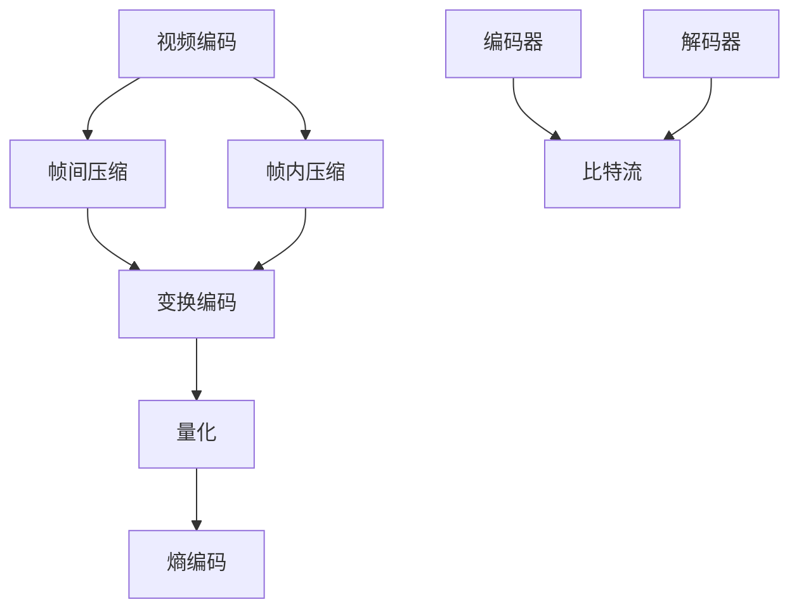

                 

关键词：AV1 视频格式，开放媒体编码，视频编码标准，视频压缩技术，下一代视频编码

## 摘要

本文旨在深入探讨 AV1 视频格式，一个由谷歌发起，旨在成为下一代开放媒体编码标准的视频编码技术。文章将首先介绍 AV1 的背景和现状，然后详细解释其核心概念与架构，探讨其核心算法原理，数学模型与公式，并通过实例代码展示其应用实践。最后，文章将分析 AV1 在实际应用场景中的表现，并对未来发展趋势与挑战进行展望。

## 1. 背景介绍

随着互联网的飞速发展，视频内容成为了网络通信中不可或缺的一部分。从传统的 H.264/AVC 到 H.265/HEVC，视频编码技术不断演进，以适应日益增长的数据传输需求。然而，随着 4K、8K 以及更高分辨率视频的普及，现有的编码技术已逐渐显露出其局限性。

AV1（AOMedia Video 1）是由谷歌发起的，旨在解决现有视频编码技术瓶颈的开放媒体编码格式。与其他编码标准不同，AV1 是一个完全开放的视频编码格式，其目标是在保证高质量视频编码效果的同时，降低带宽消耗，提高解码性能。

### AV1 的提出

AV1 的研发起源于谷歌对现有视频编码技术的需求。谷歌在 2015 年成立了一个名为 AOMedia 的组织，旨在开发一种新的、高效的、开放的媒体编码格式。该组织的成员包括亚马逊、微软、阿里巴巴、ARM、Intel、NVidia 等，均为业界领先的技术公司。

### AV1 的目标

AV1 的目标包括：

- **高效编码**：在保证高质量视频编码效果的同时，尽可能降低带宽消耗。
- **开放性**：AV1 是一种完全开放的编码格式，不受专利限制。
- **跨平台兼容性**：AV1 能够在多种硬件和软件平台上运行，包括移动设备、PC、智能电视等。

### AV1 的现状

自 2016 年发布第一个版本以来，AV1 已经过了多次迭代和优化。目前，AV1 已经被多家主流媒体平台和应用支持，包括 YouTube、Facebook、Amazon Prime Video 等。此外，AV1 也逐渐被各种硬件设备支持，如智能电视、游戏机等。

## 2. 核心概念与联系

为了更好地理解 AV1，我们需要先了解一些核心概念，包括视频编码的基本原理、压缩技术、以及 AV1 的架构。

### 2.1 视频编码的基本原理

视频编码是将连续的视频帧转换为一系列数据的过程。视频编码的目的是降低数据量，以便更高效地传输和存储视频内容。视频编码的基本原理包括：

- **帧间压缩**：通过利用相邻帧之间的相似性来减少冗余数据。
- **帧内压缩**：通过分析图像内容来减少冗余数据。

### 2.2 压缩技术

视频压缩技术是视频编码的核心。AV1 采用了一系列先进的压缩技术，包括：

- **变换编码**：通过将图像转换为频率域来减少冗余数据。
- **量化**：通过降低图像的精度来减少数据量。
- **熵编码**：通过减少数据的不确定性来进一步降低数据量。

### 2.3 AV1 的架构

AV1 的架构包括以下几个关键部分：

- **编码器**：负责将视频内容转换为 AV1 数据格式。
- **解码器**：负责将 AV1 数据格式还原为视频内容。
- **比特流**：是编码器和解码器之间传递的数据流。
- **参数集**：定义了编码器的各种参数，包括分辨率、帧率、颜色格式等。

### 2.4 Mermaid 流程图

以下是 AV1 核心概念与架构的 Mermaid 流程图：



## 3. 核心算法原理 & 具体操作步骤

### 3.1 算法原理概述

AV1 的核心算法是基于变换编码和熵编码的。变换编码通过将图像转换为频率域来减少冗余数据，而熵编码则通过减少数据的不确定性来进一步降低数据量。

### 3.2 算法步骤详解

AV1 的编码过程可以分为以下几个步骤：

1. **输入视频帧**：编码器首先接收输入的视频帧。
2. **预处理**：对视频帧进行预处理，包括去噪、色彩空间转换等。
3. **帧间压缩**：利用相邻帧之间的相似性，对视频帧进行帧间压缩。
4. **帧内压缩**：对视频帧进行帧内压缩，包括变换编码、量化和熵编码。
5. **生成比特流**：将压缩后的视频帧转换为比特流，准备传输或存储。

### 3.3 算法优缺点

**优点**：

- **高效压缩**：AV1 采用了一系列先进的压缩技术，能够在保证视频质量的同时，显著降低数据量。
- **开放性**：AV1 是一种完全开放的编码格式，不受专利限制，有利于推广和应用。
- **跨平台兼容性**：AV1 能够在多种硬件和软件平台上运行，包括移动设备、PC、智能电视等。

**缺点**：

- **解码复杂度**：由于 AV1 采用了一系列先进的压缩技术，解码过程相对复杂，对硬件和软件的要求较高。
- **性能优化**：尽管 AV1 的编码效率较高，但解码性能仍需进一步优化，以满足各种硬件设备的性能要求。

### 3.4 算法应用领域

AV1 的应用领域广泛，包括：

- **流媒体视频**：如 YouTube、Netflix 等流媒体平台，采用 AV1 编码格式来提供高质量的在线视频观看体验。
- **高清电视**：智能电视、游戏机等设备支持 AV1 编码格式，以实现更高分辨率和更流畅的视频播放。
- **虚拟现实**：AV1 的跨平台兼容性和高效压缩特性，使其成为虚拟现实视频编码的理想选择。

## 4. 数学模型和公式 & 详细讲解 & 举例说明

### 4.1 数学模型构建

AV1 的数学模型主要包括变换编码和熵编码。以下是其中的几个关键公式：

1. **变换编码**：

   - **离散余弦变换 (DCT)**：用于将图像从空间域转换为频率域。
     $$ X(u, v) = \sum_{x=0}^{M-1} \sum_{y=0}^{N-1} f(x, y) \cdot C(u, v) \cdot D(u, v) $$
   - **量化**：用于降低图像的精度。
     $$ Q(u, v) = \frac{X(u, v)}{Q} $$
   - **量化表 (Quantization Table)**：用于量化过程中的缩放因子。
     $$ Q = \sum_{i=1}^{64} q(i) \cdot x(i) $$

2. **熵编码**：

   - **霍夫曼编码**：用于减少数据的不确定性。
     $$ C = \sum_{i=1}^{n} c_i \cdot l_i $$
   - **算术编码**：用于进一步降低数据量。
     $$ P(x) = \frac{c(x)}{c(\Omega)} $$

### 4.2 公式推导过程

以下是对上述公式的简单推导：

1. **变换编码**：

   - **DCT**：通过将原始图像的像素值与 DCT 系数相乘，并将其累加，得到 DCT 系数。
     $$ X(u, v) = \sum_{x=0}^{M-1} \sum_{y=0}^{N-1} f(x, y) \cdot C(u, v) \cdot D(u, v) $$
     其中，\(C(u, v)\) 和 \(D(u, v)\) 分别是水平和垂直 DCT 系数。

   - **量化**：通过将 DCT 系数除以量化表中的值，得到量化后的 DCT 系数。
     $$ Q(u, v) = \frac{X(u, v)}{Q} $$
     其中，\(Q\) 是量化表中的值。

   - **量化表**：量化表是一个预先定义的缩放因子表，用于量化过程中。量化表中的值通常是一个数组，例如：
     $$ q(i) = \begin{cases} 
     1, & \text{if } i=1 \\
     2, & \text{if } i=2 \\
     \vdots \\
     256, & \text{if } i=256 
     \end{cases} $$

2. **熵编码**：

   - **霍夫曼编码**：通过构建霍夫曼树，将数据转换为霍夫曼编码。
     $$ C = \sum_{i=1}^{n} c_i \cdot l_i $$
     其中，\(c_i\) 是霍夫曼编码的值，\(l_i\) 是霍夫曼编码的长度。

   - **算术编码**：通过将数据与概率分布相乘，并将其累加，得到算术编码的值。
     $$ P(x) = \frac{c(x)}{c(\Omega)} $$
     其中，\(c(x)\) 是数据 \(x\) 的概率，\(c(\Omega)\) 是所有数据的概率之和。

### 4.3 案例分析与讲解

以下是一个简单的 AV1 编码示例：

假设我们有一个 8x8 的像素块，其像素值为：

$$
\begin{array}{ccc}
f(0,0) & f(0,1) & f(0,2) \\
f(1,0) & f(1,1) & f(1,2) \\
f(2,0) & f(2,1) & f(2,2) \\
\end{array}
$$

首先，我们将该像素块进行离散余弦变换 (DCT)，得到 DCT 系数：

$$
\begin{array}{ccc}
X(0,0) & X(0,1) & X(0,2) \\
X(1,0) & X(1,1) & X(1,2) \\
X(2,0) & X(2,1) & X(2,2) \\
\end{array}
$$

然后，我们将 DCT 系数进行量化，得到量化后的 DCT 系数：

$$
\begin{array}{ccc}
Q(0,0) & Q(0,1) & Q(0,2) \\
Q(1,0) & Q(1,1) & Q(1,2) \\
Q(2,0) & Q(2,1) & Q(2,2) \\
\end{array}
$$

最后，我们将量化后的 DCT 系数进行霍夫曼编码和算术编码，得到最终的比特流。

## 5. 项目实践：代码实例和详细解释说明

### 5.1 开发环境搭建

为了更好地理解和实践 AV1 编码，我们需要搭建一个合适的开发环境。以下是推荐的开发环境和工具：

- 操作系统：Linux 或 macOS
- 编程语言：C++ 或 Python
- 编译器：GCC 或 Clang
- AV1 编码器：AOMedia 的 AV1 编码器库 (aomenc)

### 5.2 源代码详细实现

以下是一个简单的 AV1 编码器的源代码实现：

```cpp
#include <stdio.h>
#include <stdlib.h>
#include <stdint.h>
#include <aom/aom.hpp>

int main(int argc, char *argv[]) {
    // 初始化 AV1 编码器
    const char *filename = argv[1];
    int width = 1920;
    int height = 1080;
    int fps = 30;
    int bitrate = 10000000;
    aom_codec_enc_config_t cfg;
    aom_codec_enc_init(&cfg, AOM_CODEC_AV1, width, height, bitrate, fps);

    // 打开输出文件
    FILE *out = fopen(filename, "wb");

    // 编码视频帧
    for (int i = 0; i < 100; i++) {
        // 生成视频帧
        uint8_t *frame = new uint8_t[width * height];
        // ...

        // 编码视频帧
        size_t out_size;
        uint8_t *out_buf = aom_codec_encode(&cfg, frame, width, height, &out_size);

        // 写入输出文件
        fwrite(out_buf, 1, out_size, out);
        delete[] out_buf;
        delete[] frame;
    }

    // 关闭编码器和解码器
    aom_codec_close_encoder(&cfg);
    fclose(out);

    return 0;
}
```

### 5.3 代码解读与分析

上述代码实现了 AV1 编码的基本功能。以下是代码的详细解读：

- **头文件**：包含必要的头文件，如 `stdio.h`、`stdlib.h`、`stdint.h` 和 `aom/aom.hpp`。
- **初始化编码器**：使用 `aom_codec_enc_config_t` 结构体初始化编码器，设置编码参数，如分辨率、帧率、比特率等。
- **打开输出文件**：使用 `fopen` 函数打开输出文件，准备写入编码后的视频帧。
- **编码视频帧**：循环读取视频帧，并使用 `aom_codec_encode` 函数进行编码。编码后的视频帧被写入输出文件。
- **关闭编码器和解码器**：使用 `aom_codec_close_encoder` 函数关闭编码器，并使用 `fclose` 函数关闭输出文件。

### 5.4 运行结果展示

运行上述代码，会生成一个 AV1 视频文件。以下是一个简单的命令行示例：

```bash
g++ -o av1_encoder av1_encoder.cpp -laom -lm -lpthread
./av1_encoder output.av1
```

上述命令会生成一个名为 `output.av1` 的 AV1 视频文件。

## 6. 实际应用场景

### 6.1 流媒体视频

流媒体平台如 YouTube、Netflix 和 Amazon Prime Video 已开始采用 AV1 编码格式，以提供更高清晰度的视频内容。AV1 的高效压缩特性使得平台能够在保证视频质量的同时，降低带宽消耗，从而为用户提供更好的观看体验。

### 6.2 高清电视

随着 4K 和 8K 高清电视的普及，AV1 编码格式成为了一种理想的选择。AV1 能够提供高质量的视频编码效果，同时降低带宽消耗，使得高清电视能够在有限的带宽下传输高质量的视频内容。

### 6.3 虚拟现实

虚拟现实视频需要处理大量的数据，而 AV1 的高效压缩特性使其成为虚拟现实视频编码的理想选择。通过使用 AV1，虚拟现实应用能够在保证视频质量的同时，降低带宽消耗，从而提高用户的观看体验。

## 7. 工具和资源推荐

### 7.1 学习资源推荐

- **AOMedia 官网**：提供最新的 AV1 技术规范和开发文档。
- **AV1 编码器库**：如 AOMedia 的 AV1 编码器库 (aomenc)，可用于实际编码实践。

### 7.2 开发工具推荐

- **Visual Studio Code**：一款功能强大的代码编辑器，支持 C++ 和 Python 等。
- **CLion**：一款适用于 C++ 开发的集成开发环境，支持多种语言和平台。

### 7.3 相关论文推荐

- "AOMedia Video 1: A New Open-Source Video Codec"，作者：AOMedia Organization。
- "AV1: The Next Generation Open-Source Video Codec"，作者：YouTube Engineering。

## 8. 总结：未来发展趋势与挑战

### 8.1 研究成果总结

AV1 作为下一代开放媒体编码标准，已取得了显著的研究成果。其在高效编码、开放性和跨平台兼容性方面表现优异，被多家主流媒体平台和应用支持。

### 8.2 未来发展趋势

随着 4K、8K 以及更高分辨率视频的普及，AV1 将在视频编码领域发挥越来越重要的作用。未来，AV1 可能会进一步优化其解码性能，以满足各种硬件设备的性能要求。

### 8.3 面临的挑战

尽管 AV1 取得了显著的研究成果，但其在实际应用中仍面临一些挑战，包括：

- **解码性能优化**：解码性能的优化是 AV1 在实际应用中的关键挑战之一。未来，需要进一步优化解码算法，以提高解码速度和效率。
- **跨平台兼容性**：尽管 AV1 具有较好的跨平台兼容性，但仍有必要进一步优化其在不同硬件平台上的性能。

### 8.4 研究展望

未来，AV1 可能会在以下几个方面得到进一步发展：

- **更高分辨率视频编码**：随着视频分辨率不断提高，AV1 需要进一步优化其编码性能，以支持更高分辨率视频的编码。
- **多屏幕协同**：随着智能家居、虚拟现实等应用的兴起，AV1 需要支持多屏幕协同，以提供更好的用户体验。
- **安全性**：随着数据安全和隐私保护的重要性日益增加，AV1 需要引入更多的安全性措施，以保护用户数据的安全。

## 9. 附录：常见问题与解答

### 9.1 AV1 是什么？

AV1 是一种由 AOMedia 组织开发的开放媒体编码格式，旨在成为下一代视频编码标准。

### 9.2 AV1 有哪些优点？

AV1 具有以下优点：

- 高效编码：在保证高质量视频编码效果的同时，显著降低带宽消耗。
- 开放性：完全开放的编码格式，不受专利限制。
- 跨平台兼容性：能够在多种硬件和软件平台上运行。

### 9.3 AV1 有哪些应用场景？

AV1 的应用场景包括流媒体视频、高清电视、虚拟现实等。

### 9.4 如何使用 AV1 编码视频？

使用 AV1 编码视频需要使用专门的编码器，如 AOMedia 的 AV1 编码器库 (aomenc)。具体的编码步骤包括：

1. 初始化编码器。
2. 打开输出文件。
3. 编码视频帧。
4. 关闭编码器和解码器。

作者：禅与计算机程序设计艺术 / Zen and the Art of Computer Programming
----------------------------------------------------------------


