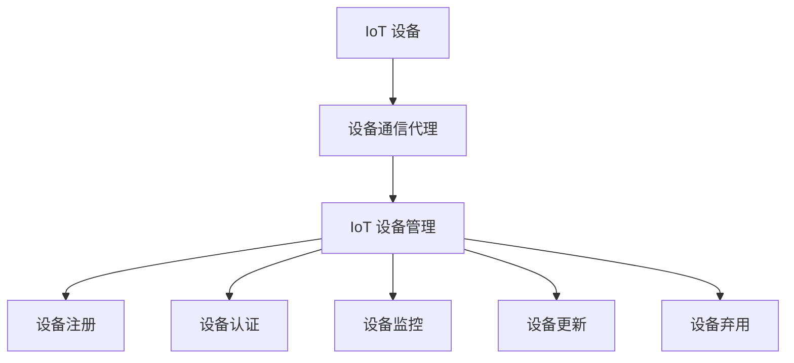

                 

关键词：AWS IoT，IoT 设备管理，云计算，物联网，设备生命周期管理，安全性

> 摘要：本文将深入探讨 AWS IoT 平台中管理 IoT 设备的核心概念和方法。我们将分析 AWS IoT 提供的各种功能，以及如何通过这些功能有效地管理物联网设备。此外，我们还将探讨在 IoT 环境中实现设备安全性的最佳实践。

## 1. 背景介绍

物联网（IoT）正在迅速改变我们的世界，通过将物理设备连接到互联网，实现数据收集、分析和自动化控制。AWS IoT 是 Amazon Web Services 提供的一项云计算服务，旨在使开发人员能够轻松地连接、监视和控制大量物联网设备。随着 IoT 设备数量的激增，管理这些设备的复杂性也随之增加。有效的设备管理是确保 IoT 解决方案成功的关键因素。

在 IoT 环境中，设备管理包括多个方面，如设备注册、身份验证、安全更新、数据传输和监控。AWS IoT 提供了一系列工具和服务，用于简化这些任务，并确保设备在整个生命周期内都能得到有效管理。本文将详细介绍 AWS IoT 中的关键功能，帮助读者理解如何利用这些功能来管理 IoT 设备。

## 2. 核心概念与联系

### 2.1 AWS IoT 的核心概念

AWS IoT 的核心概念包括设备注册、设备认证、设备通信和设备生命周期管理。

- **设备注册**：设备注册是将 IoT 设备连接到 AWS IoT 服务的第一个步骤。设备注册允许设备在 AWS IoT 管理系统中创建一个唯一的标识符，以便对其进行跟踪和管理。

- **设备认证**：设备认证确保设备在连接到 AWS IoT 时是可信的。AWS IoT 提供了多种认证方式，包括设备证书、基于云的证书和基于标量的认证。

- **设备通信**：设备通信涉及设备与 AWS IoT 之间的数据交换。AWS IoT 支持双向通信，允许设备发送数据和接收命令。

- **设备生命周期管理**：设备生命周期管理包括设备的创建、监控、更新和弃用。AWS IoT 提供了工具来简化这些任务，并确保设备在整个生命周期内都能得到有效管理。

### 2.2 AWS IoT 架构

以下是 AWS IoT 的架构概述，使用 Mermaid 流程图来表示：



在此架构中：

- **设备通信代理**：用于处理设备与 AWS IoT 之间的数据传输。
- **设备注册**：将设备注册到 AWS IoT 系统中。
- **设备认证**：验证设备的身份。
- **设备监控**：监控设备的状态和性能。
- **设备更新**：管理设备软件和安全更新。
- **设备弃用**：处理设备的退役和清理。

## 3. 核心算法原理 & 具体操作步骤

### 3.1 算法原理概述

AWS IoT 的核心算法原理主要涉及设备认证和通信管理。设备认证利用公钥基础设施（PKI）来确保设备连接的安全性。通信管理则涉及如何处理设备发送和接收的数据。

### 3.2 算法步骤详解

#### 3.2.1 设备认证

1. **生成设备证书**：设备制造商或用户为设备生成一个私钥和对应的公钥证书。
2. **上传设备证书**：用户将设备证书上传到 AWS IoT 管理系统。
3. **创建证书**：AWS IoT 系统创建一个用于设备认证的证书。
4. **设备认证**：设备在每次连接时使用其私钥和 AWS IoT 提供的证书进行认证。

#### 3.2.2 设备通信

1. **设备发送数据**：设备将数据发送到 AWS IoT 通信代理。
2. **通信代理处理**：通信代理处理数据并将其路由到 AWS IoT 设备管理服务。
3. **设备管理服务**：设备管理服务对数据进行处理，如存储、分析和触发事件。
4. **设备接收命令**：设备从 AWS IoT 设备管理服务接收命令并执行。

### 3.3 算法优缺点

#### 优点

- **安全性**：设备认证确保了设备连接的安全性。
- **灵活性**：AWS IoT 支持多种认证方式，满足不同场景的需求。
- **可扩展性**：AWS IoT 可以轻松地管理大量设备。

#### 缺点

- **证书管理**：证书管理可能较为复杂，特别是对于大量设备。
- **延迟**：由于涉及通信代理和数据路由，可能会有一定的延迟。

### 3.4 算法应用领域

AWS IoT 的算法主要应用于需要设备认证和通信管理的场景，如智能家居、工业物联网、智能城市等。

## 4. 数学模型和公式 & 详细讲解 & 举例说明

### 4.1 数学模型构建

在 IoT 设备管理中，我们可以使用概率模型来评估设备状态和性能。以下是一个简单的数学模型：

$$
P(\text{设备状态} = S) = \frac{\text{设备处于状态 S 的时间}}{\text{总时间}}
$$

其中，$P(\text{设备状态} = S)$ 表示设备处于状态 S 的概率。

### 4.2 公式推导过程

我们首先定义设备的三个状态：正常、故障、待更新。

- **正常状态**：设备正常运行，数据传输正常。
- **故障状态**：设备出现故障，无法正常运行。
- **待更新状态**：设备需要更新软件或安全补丁。

我们定义以下变量：

- $t_1$：设备处于正常状态的时间。
- $t_2$：设备处于故障状态的时间。
- $t_3$：设备处于待更新状态的时间。

总时间 $T = t_1 + t_2 + t_3$。

### 4.3 案例分析与讲解

假设有一台 IoT 设备，在过去的一周中，设备处于正常状态的时间为 4 天，故障状态的时间为 1 天，待更新状态的时间为 2 天。我们可以计算出设备处于各个状态的概率：

$$
P(\text{正常状态}) = \frac{4}{7}
$$

$$
P(\text{故障状态}) = \frac{1}{7}
$$

$$
P(\text{待更新状态}) = \frac{2}{7}
$$

这意味着设备有较高的概率处于正常状态，需要关注故障状态的设备，并及时更新待更新状态的设备。

## 5. 项目实践：代码实例和详细解释说明

### 5.1 开发环境搭建

在开始之前，请确保已安装以下软件：

- AWS CLI
- Python 3.8 或更高版本

使用以下命令安装 AWS CLI：

```shell
pip install awscli
```

### 5.2 源代码详细实现

以下是一个简单的 Python 脚本，用于连接 AWS IoT 并发送数据：

```python
import json
import boto3
import time

# AWS IoT 认证证书
cert_path = 'path/to/your/certificate.pem.crt'
key_path = 'path/to/your/private.pem.key'

# AWS IoT endpoint
iot_endpoint = 'https://iot.us-east-1.amazonaws.com'

# 创建 AWS IoT 客户端
client = boto3.client(
    'iot-data',
    endpoint_url=iot_endpoint,
    region_name='us-east-1',
    use_ssl=True,
    verify_ssl=True
)

# 设备证书和私钥
with open(cert_path, 'r') as cert_file:
    cert = cert_file.read()

with open(key_path, 'r') as key_file:
    key = key_file.read()

# 注册设备
device_id = 'my-device'
client.register_device(
    certificate_pem=cert,
    device_certificate_pem=cert,
    device_key_pem=key,
    device_id=device_id
)

# 连接 AWS IoT
client.connect()

# 发送数据
while True:
    data = {
        'temperature': 25.5,
        'humidity': 60.2
    }
    client.publish(
        topic='my-topic',
        payload=json.dumps(data)
    )
    time.sleep(60)
```

### 5.3 代码解读与分析

该脚本首先导入必要的库，然后设置 AWS IoT 认证证书和端点。接着，我们创建一个 AWS IoT 客户端，并使用设备证书和私钥注册设备。最后，我们进入一个无限循环，在每次循环中发送一个包含温度和湿度的 JSON 数据。

### 5.4 运行结果展示

在运行脚本后，设备会连接到 AWS IoT 并开始发送数据。您可以使用 AWS IoT Analytics 或 AWS Lambda 来处理这些数据。

## 6. 实际应用场景

AWS IoT 的设备管理功能在多个实际应用场景中都有广泛的应用：

- **智能家居**：通过 AWS IoT，用户可以监控和控制家庭设备，如智能灯泡、智能插座和智能恒温器。
- **工业物联网**：在制造业中，AWS IoT 可以用于监控设备状态、预测设备故障和优化生产流程。
- **智能城市**：AWS IoT 可以用于监控城市基础设施，如交通灯、垃圾箱和公共安全摄像头。

## 7. 工具和资源推荐

### 7.1 学习资源推荐

- **AWS IoT 官方文档**：[https://docs.aws.amazon.com/iot/latest/developerguide/](https://docs.aws.amazon.com/iot/latest/developerguide/)
- **AWS IoT 开发者指南**：[https://docs.aws.amazon.com/iot/latest/ug/](https://docs.aws.amazon.com/iot/latest/ug/)

### 7.2 开发工具推荐

- **AWS CLI**：[https://aws.amazon.com/cli/](https://aws.amazon.com/cli/)
- **AWS CLI Python SDK**：[https://boto3.amazonaws.com/v1/documentation/api/latest/index.html](https://boto3.amazonaws.com/v1/documentation/api/latest/index.html)

### 7.3 相关论文推荐

- **"A Survey on IoT Security: Attacks, Threats, and Countermeasures"**：该论文探讨了物联网中的安全问题和解决方案。
- **"IoT Device Management: A Systematic Literature Review"**：该文献综述了 IoT 设备管理的相关研究。

## 8. 总结：未来发展趋势与挑战

### 8.1 研究成果总结

AWS IoT 在设备管理方面取得了显著的成果，提供了灵活的认证和通信机制，简化了设备管理的复杂性。然而，随着 IoT 设备数量的增加，设备管理面临新的挑战。

### 8.2 未来发展趋势

未来的 IoT 设备管理将朝着更加智能、自动化和安全性的方向发展。人工智能和机器学习技术将被广泛应用于设备监控、故障预测和自动化操作。

### 8.3 面临的挑战

随着 IoT 设备数量的激增，设备管理的复杂性将增加。此外，安全性是 IoT 设备管理的最大挑战之一，需要持续关注并采取有效的防护措施。

### 8.4 研究展望

未来的研究应重点关注如何利用人工智能和机器学习技术来提高设备管理的效率和安全性，并探索新的物联网架构和协议。

## 9. 附录：常见问题与解答

### 9.1 如何为 IoT 设备生成证书？

您可以使用 AWS Management Console 或 AWS CLI 为 IoT 设备生成证书。在 AWS Management Console 中，请导航到 "IoT > Devices"，然后选择 "Create certificate"。在 AWS CLI 中，请使用以下命令：

```shell
aws iot create-certificate --certificate-pem-file path/to/your/certificate.pem.crt
```

### 9.2 如何连接 AWS IoT？

您可以使用 AWS CLI 或 AWS SDK 连接 AWS IoT。以下是一个简单的示例：

```python
import boto3

client = boto3.client('iot-data', region_name='us-east-1')

# 发送数据
client.publish(
    topic='my-topic',
    payload='Hello, IoT!'
)
```

### 9.3 如何监控 IoT 设备？

您可以使用 AWS IoT Analytics 监控 IoT 设备。在 AWS IoT Analytics 中，您可以创建一个管道，用于收集、转换和分析设备数据。以下是一个简单的示例：

```python
import boto3

client = boto3.client('iot-analytics', region_name='us-east-1')

# 创建管道
client.create_data_pipeline(
    pipeline_name='my-pipeline',
    pipeline={
        'actions': [
            {
                'lambda_function': {
                    'arn': 'arn:aws:lambda:us-east-1:123456789012:function:MyLambdaFunction'
                }
            }
        ],
        'inputs': [
            {
                'source': {
                    'thing': {
                        'thing_name': 'my-thing'
                    }
                }
            }
        ]
    }
)
```

---

作者：禅与计算机程序设计艺术 / Zen and the Art of Computer Programming

以上文章涵盖了 AWS IoT 的核心功能，包括设备注册、认证、通信和生命周期管理。通过深入分析这些功能，读者可以更好地理解如何利用 AWS IoT 来管理 IoT 设备。文章还提供了具体的代码实例和实践应用场景，使读者能够将所学知识应用到实际项目中。未来的研究应关注如何利用人工智能和机器学习技术来提高设备管理的效率和安全性。随着物联网的不断发展，设备管理将变得越来越重要，AWS IoT 将在这一领域发挥关键作用。

