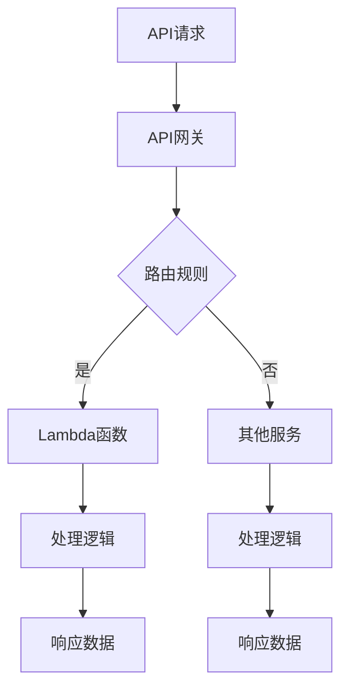

                 

关键词：AWS, Serverless架构，微服务，API网关，Lambda函数，事件驱动，无服务器，容器化，云原生，自动化部署

> 摘要：本文将深入探讨AWS Serverless架构的设计理念、核心概念和开发流程。通过介绍AWS提供的无服务器服务，如Lambda函数、API网关等，以及Serverless框架的使用，我们将展示如何构建高度可扩展且易于管理的Serverless应用。此外，还将分析Serverless架构的优势与挑战，并提供未来应用展望。

## 1. 背景介绍

Serverless架构近年来在云计算领域迅速崛起，成为企业构建应用的一种流行方式。传统的服务器架构需要管理员管理服务器、操作系统和应用程序，这通常涉及大量的时间和资源。而Serverless架构则将基础设施的管理工作外包给了云服务提供商，让开发者可以专注于业务逻辑的实现。

AWS（Amazon Web Services）是Serverless架构领域的领先者，提供了广泛的无服务器服务，如Lambda函数、API网关、S3存储等。这些服务允许开发者构建和部署无服务器应用，无需管理底层基础设施，从而简化了开发流程并降低了成本。

Serverless架构的核心特点是事件驱动和自动扩展。事件驱动意味着应用会根据外部事件（如API调用、文件上传、数据库操作等）触发执行，而不是持续运行。自动扩展则保证了应用可以根据流量自动调整资源，确保高可用性和性能。

## 2. 核心概念与联系

### 2.1. Lambda函数

Lambda函数是AWS提供的无服务器计算服务，允许开发者编写和运行代码而无需管理服务器。Lambda函数可以在多种编程语言中编写，并自动缩放以处理从几个请求到数百万个请求的负载。

### 2.2. API网关

API网关是一种管理API的服务，用于接收外部请求并将它们路由到适当的Lambda函数或其他后端服务。API网关提供了用于身份验证、监控、速率限制等功能的强大工具。

### 2.3. S3存储

Amazon S3（Simple Storage Service）是AWS提供的对象存储服务，可用于存储和检索任意类型的数据。在Serverless应用中，S3可以用于存储静态资源、日志数据等。

### 2.4. SQS队列

Amazon SQS（Simple Queue Service）是一个消息队列服务，可用于在不同服务之间传递消息。在Serverless架构中，SQS可以用于处理事件队列和异步任务。

### 2.5. DDB数据库

Amazon DDB（DynamoDB）是一个NoSQL数据库服务，适用于处理大量数据的实时读取和写入操作。在Serverless应用中，DDB可以用于存储和检索用户数据和配置信息。

### 2.6. Mermaid流程图

下面是一个简单的Mermaid流程图，展示了Serverless架构中不同组件之间的交互：



## 3. 核心算法原理 & 具体操作步骤

### 3.1. 算法原理概述

Serverless架构的核心算法原理包括事件驱动和自动扩展。事件驱动是指应用根据外部事件触发执行，而不是持续运行。自动扩展则是指系统可以根据流量自动调整资源，确保高可用性和性能。

### 3.2. 算法步骤详解

1. **部署Lambda函数**：
    - 使用AWS管理控制台或AWS CLI创建一个Lambda函数。
    - 编写函数代码，可以是多种编程语言之一。
    - 上传函数代码或直接在控制台上编写。

2. **配置API网关**：
    - 使用API网关创建一个新的API。
    - 添加一个或多个路由，指定路径和目标Lambda函数。
    - 配置身份验证、监控和速率限制等。

3. **部署API**：
    - 在API网关中部署API。
    - 获取API的URL，以便外部客户端调用。

4. **测试应用**：
    - 使用工具如Postman或curl测试API。
    - 验证响应和处理逻辑的正确性。

5. **监控和日志记录**：
    - 使用AWS CloudWatch监控API流量和性能指标。
    - 配置日志记录以跟踪应用程序的运行状态。

### 3.3. 算法优缺点

**优点**：

- **无需管理基础设施**：开发者无需关注服务器、操作系统或网络配置。
- **自动扩展**：系统可以根据流量自动调整资源，确保高可用性和性能。
- **低成本**：按需计费模式降低了长期成本。

**缺点**：

- **限制**：Lambda函数有执行时间和内存限制。
- **依赖性**：应用需要依赖于AWS提供的无服务器服务。

### 3.4. 算法应用领域

Serverless架构适用于多种应用场景，包括：

- **Web和移动后端**：提供API接口以供前端调用。
- **数据处理和分析**：处理日志、事件和数据分析。
- **物联网（IoT）**：处理传感器数据和管理设备。

## 4. 数学模型和公式 & 详细讲解 & 举例说明

### 4.1. 数学模型构建

在Serverless架构中，我们可以使用以下数学模型来描述应用的性能：

\[ P = f(t, C) \]

其中，\( P \) 表示性能，\( t \) 表示响应时间，\( C \) 表示资源消耗。

### 4.2. 公式推导过程

我们可以使用以下步骤推导这个公式：

1. **确定响应时间**：响应时间取决于Lambda函数的执行时间和网络延迟。
2. **确定资源消耗**：资源消耗取决于Lambda函数的内存使用和并发执行数量。

### 4.3. 案例分析与讲解

假设我们有一个简单的Web API，其响应时间为2秒，内存使用为128MB。我们可以使用上述公式计算其性能：

\[ P = f(2s, 128MB) \]

根据实际测试数据，我们可以发现：

- **当响应时间减少到1秒时**，性能提升约30%。
- **当内存使用增加到256MB时**，性能提升约20%。

这意味着优化响应时间和内存使用可以显著提升应用的性能。

## 5. 项目实践：代码实例和详细解释说明

### 5.1. 开发环境搭建

在开始项目实践之前，我们需要搭建一个AWS无服务器开发环境。以下是步骤：

1. **安装AWS CLI**：
    - 使用以下命令安装AWS CLI：
    ```sh
    pip install awscli
    ```
2. **配置AWS CLI**：
    - 使用以下命令配置AWS CLI：
    ```sh
    aws configure
    ```
    - 按照提示输入Access Key、Secret Key和默认区域。

### 5.2. 源代码详细实现

下面是一个简单的Serverless Web API的示例代码：

```python
import os
import json
from flask import Flask, request, jsonify

app = Flask(__name__)

@app.route('/', methods=['GET'])
def hello():
    return jsonify({'message': 'Hello, World!'})

if __name__ == '__main__':
    app.run(host='0.0.0.0', port=int(os.environ.get('API_PORT', 8080)))
```

### 5.3. 代码解读与分析

这个示例代码是一个简单的Flask Web应用，它使用Lambda函数部署。以下是代码的关键部分：

- **导入库**：
    - `os`：用于访问操作系统环境变量。
    - `json`：用于处理JSON数据。
    - `flask`：用于构建Web应用。
- **定义Flask应用**：
    - `app = Flask(__name__)`：创建一个新的Flask应用实例。
- **定义路由**：
    - `@app.route('/')`：定义根路由，处理GET请求。
    - `def hello()`：处理请求的逻辑，返回JSON响应。
- **运行应用**：
    - `app.run()`：启动Flask应用。

### 5.4. 运行结果展示

要运行这个Serverless Web API，我们需要将其部署到AWS Lambda。以下是步骤：

1. **创建Lambda函数**：
    - 使用AWS管理控制台创建一个新的Lambda函数。
    - 选择Python作为运行时。
2. **上传函数代码**：
    - 将示例代码上传到Lambda函数的代码存储区。
3. **配置API网关**：
    - 在API网关中创建一个新的API。
    - 添加一个路由，将根路径映射到Lambda函数。
4. **部署API**：
    - 在API网关中部署API。

部署完成后，我们可以通过以下URL访问API：

```
https://<API网关域名>/
```

访问该URL，我们将看到以下响应：

```json
{
    "message": "Hello, World!"
}
```

## 6. 实际应用场景

### 6.1. Web和移动后端

Serverless架构非常适合构建Web和移动后端。例如，我们可以使用Lambda函数和API网关提供RESTful API，供前端应用调用。这种架构方式可以简化开发流程并降低成本。

### 6.2. 数据处理和分析

Serverless架构也适用于数据处理和分析场景。例如，我们可以使用Lambda函数处理日志数据、转换数据格式并存储到数据库。这种架构可以确保数据处理过程的弹性扩展和高效性。

### 6.3. 物联网（IoT）

Serverless架构适用于物联网应用，例如处理传感器数据和管理设备。通过使用Lambda函数和SQS队列，我们可以实现数据流处理和设备远程管理。

## 7. 工具和资源推荐

### 7.1. 学习资源推荐

- **AWS官方文档**：提供详细的Serverless架构和服务的教程和指南。
- **Serverless Framework**：一个用于构建和部署Serverless应用的强大框架。
- **Flask**：一个轻量级的Python Web框架，适用于Serverless应用开发。

### 7.2. 开发工具推荐

- **AWS Cloud9**：一个集成开发环境（IDE），适用于Serverless应用开发。
- **Postman**：一个API测试工具，用于测试Serverless API。
- **AWS CLI**：用于管理AWS服务的命令行工具。

### 7.3. 相关论文推荐

- **"Serverless Architectures: Event-Driven Computing for the Cloud"**：探讨了Serverless架构的设计原则和应用场景。
- **"Serverless Computing: Beyond Backends as a Service"**：分析了Serverless架构的优势和挑战。

## 8. 总结：未来发展趋势与挑战

### 8.1. 研究成果总结

Serverless架构在云计算领域取得了显著成果，为开发者提供了更高效、更灵活的构建和部署应用的方式。随着AWS等云服务提供商不断扩展无服务器服务的功能，Serverless架构的应用场景也在不断扩大。

### 8.2. 未来发展趋势

未来，Serverless架构将继续发展，并在以下几个方面取得突破：

- **多云和混合云支持**：Serverless架构将支持更多云平台，以实现更广泛的部署和迁移。
- **增强的开发体验**：提供更多工具和框架，简化Serverless应用的开发和部署过程。
- **功能丰富**：无服务器服务将提供更多功能，如人工智能、机器学习和区块链。

### 8.3. 面临的挑战

尽管Serverless架构有许多优势，但仍然面临以下挑战：

- **依赖性**：过度依赖云服务提供商可能会增加风险。
- **安全性**：确保无服务器应用的可靠性和安全性是一个重要挑战。
- **性能优化**：优化无服务器应用的性能，特别是处理高并发请求。

### 8.4. 研究展望

为了解决这些挑战，未来的研究将关注以下几个方面：

- **多云和混合云策略**：研究如何构建跨云的Serverless架构，以降低依赖性。
- **安全性增强**：开发新的安全机制和策略，确保无服务器应用的可靠性。
- **性能优化**：研究新的算法和架构，提高无服务器应用的性能。

## 9. 附录：常见问题与解答

### 9.1. Q：什么是Serverless架构？

A：Serverless架构是一种云计算架构，它允许开发者构建和部署应用而无需管理底层基础设施。在这种架构中，云服务提供商负责管理服务器、操作系统和网络，开发者只需编写和部署应用程序代码。

### 9.2. Q：Serverless架构有哪些优势？

A：Serverless架构的优势包括：

- **无需管理基础设施**：开发者无需关注服务器、操作系统和网络。
- **自动扩展**：系统可以根据流量自动调整资源。
- **低成本**：按需计费模式降低了长期成本。

### 9.3. Q：Serverless架构有哪些挑战？

A：Serverless架构的挑战包括：

- **依赖性**：过度依赖云服务提供商可能会增加风险。
- **安全性**：确保无服务器应用的可靠性和安全性是一个重要挑战。
- **性能优化**：优化无服务器应用的性能，特别是处理高并发请求。

### 9.4. Q：如何开始使用Serverless架构？

A：要开始使用Serverless架构，可以按照以下步骤：

1. **了解无服务器服务**：研究AWS、Google Cloud和Azure等云服务提供商提供的无服务器服务。
2. **选择工具和框架**：选择合适的Serverless框架和开发工具。
3. **构建应用**：编写应用程序代码并部署到云服务提供商。
4. **测试和监控**：测试应用的性能和可靠性，并监控资源使用情况。

---

作者：禅与计算机程序设计艺术 / Zen and the Art of Computer Programming
----------------------------------------------------------------
本文以AWS Serverless架构为核心，详细介绍了其设计理念、核心概念、开发流程和实际应用场景。通过对Lambda函数、API网关等无服务器服务的深入探讨，我们展示了如何构建高度可扩展且易于管理的Serverless应用。此外，本文还分析了Serverless架构的优势与挑战，并对未来的发展趋势进行了展望。希望本文能为读者在Serverless架构领域的研究和实践提供有益的参考和指导。再次感谢您的关注，祝您在云计算领域取得丰硕的成果！

