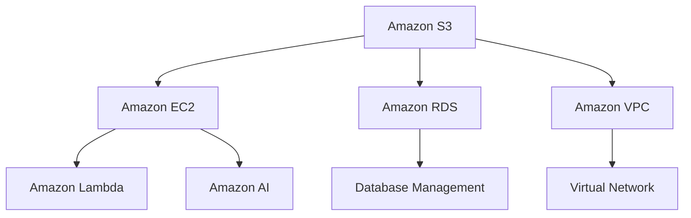

                 

## 摘要

本文将深入探讨AWS云计算服务的应用开发，旨在为开发者提供全面的技术指南。文章首先介绍了AWS云计算服务的背景和发展历程，随后详细分析了其核心概念和架构。接着，本文重点讨论了云计算服务中的核心算法原理和具体操作步骤，通过详细的数学模型和公式推导，帮助读者更好地理解云计算服务的本质。此外，文章还通过实际项目实践，展示了如何将AWS云计算服务应用于实际开发中。最后，本文探讨了云计算服务的实际应用场景，并对未来的发展趋势和面临的挑战进行了展望。

## 1. 背景介绍

云计算服务自20世纪90年代兴起以来，已成为信息技术领域的重要创新。亚马逊网络服务（Amazon Web Services，简称AWS）作为云计算市场的领导者，自2006年推出以来，已为全球数十万家企业提供强大的云计算基础设施和服务。

AWS的背景和发展历程可追溯到1994年，当时杰夫·贝索斯创立了亚马逊公司。亚马逊最初专注于电子商务业务，但随着时间的推移，亚马逊意识到云计算市场蕴含的巨大潜力。2002年，亚马逊公司开始研究云计算技术，并于2006年正式推出了AWS。AWS最初提供的服务包括简单的存储服务和计算服务，如Amazon S3和Amazon EC2。随后，AWS不断丰富其服务种类，逐渐形成了完整的云计算服务体系。

AWS的发展历程可归纳为以下几个关键阶段：

1. **早期阶段（2006-2010年）**：AWS推出了一系列基础服务，如Amazon S3（简单存储服务）、Amazon EC2（弹性计算云）和Amazon RDS（关系数据库服务）。这些服务为开发者提供了便捷的云计算资源，推动了云计算市场的快速发展。

2. **扩展阶段（2010-2015年）**：随着云计算技术的不断成熟，AWS开始扩展其服务范围，推出了包括Amazon VPC（虚拟私有云）、Amazon DynamoDB（NoSQL数据库服务）和Amazon Kinesis（实时数据流处理服务）等在内的新服务。这些新服务进一步丰富了AWS的服务体系，满足了不同类型客户的需求。

3. **创新阶段（2015年至今）**：AWS在创新领域不断突破，推出了包括Amazon Lambda（无服务器计算服务）、Amazon AI（人工智能服务）和Amazon Greengrass（边缘计算服务）等在内的新服务。这些创新服务不仅拓展了AWS的应用场景，还为开发者提供了更多的选择和灵活性。

## 2. 核心概念与联系

### 2.1 云计算服务概述

云计算服务是一种基于互联网的计算模式，通过云计算基础设施为用户提供各种IT资源。这些资源包括计算、存储、网络、数据库等。云计算服务具有以下几个核心概念：

- **基础设施即服务（IaaS）**：IaaS提供虚拟化的计算资源，如虚拟机、存储和网络。用户可以根据需求自行配置和管理这些资源。

- **平台即服务（PaaS）**：PaaS提供开发平台和工具，帮助开发者构建、部署和管理应用程序。PaaS简化了开发流程，降低了开发难度。

- **软件即服务（SaaS）**：SaaS提供完整的软件解决方案，如企业级应用、办公软件等。用户无需关心底层基础设施，只需使用软件即可。

### 2.2 AWS核心架构

AWS的核心架构包括多种服务组件，它们共同为用户提供强大的云计算基础设施。以下是AWS核心架构的组成部分：

- **Amazon S3**：Amazon S3是一种简单而可靠的云存储服务，用于存储和检索大量数据。

- **Amazon EC2**：Amazon EC2提供虚拟机实例，用于运行应用程序和处理数据。

- **Amazon RDS**：Amazon RDS是一种托管关系数据库服务，简化了数据库的创建、管理和扩展。

- **Amazon VPC**：Amazon VPC为用户提供了在AWS云中创建自定义虚拟网络的能力，可以隔离和管理不同类型的资源。

- **AWS Lambda**：AWS Lambda是一种无服务器计算服务，允许用户在无需管理服务器的情况下运行代码。

- **Amazon AI**：Amazon AI提供了一系列人工智能服务，如自然语言处理、计算机视觉和机器学习。

### 2.3 Mermaid流程图

以下是一个简单的Mermaid流程图，展示了AWS核心架构的组成部分和它们之间的联系：



### 2.4 核心概念联系与说明

通过上述核心概念和架构组件的介绍，我们可以看到AWS云计算服务如何为用户提供强大的计算和存储能力。IaaS、PaaS和SaaS共同构成了AWS的服务体系，为不同类型的用户提供多样化的选择。AWS核心架构中的各个服务组件通过相互配合，共同为用户提供了高效、可靠和灵活的云计算服务。

在云计算服务中，数据存储和管理至关重要。Amazon S3作为AWS的云存储服务，提供了高可靠性、持久性和可扩展性的存储解决方案。用户可以使用Amazon S3存储大量数据，包括文档、图片、视频和各种类型的应用数据。

Amazon EC2是AWS的核心计算服务，提供虚拟机实例用于运行应用程序和处理数据。用户可以根据需求选择不同的实例类型和规格，以满足不同的计算需求。

Amazon RDS是一种托管关系数据库服务，简化了数据库的创建、管理和扩展。用户可以使用Amazon RDS轻松创建和管理关系数据库，无需担心数据库的硬件和软件维护。

Amazon VPC为用户提供了在AWS云中创建自定义虚拟网络的能力。用户可以在Amazon VPC中隔离和管理不同类型的资源，实现更精细的网络安全和管理。

AWS Lambda是一种无服务器计算服务，允许用户在无需管理服务器的情况下运行代码。用户可以编写并部署函数，根据触发事件自动执行特定的操作。

Amazon AI提供了一系列人工智能服务，如自然语言处理、计算机视觉和机器学习。这些服务为开发者提供了强大的AI能力，可以帮助他们构建智能应用程序。

通过上述核心概念和架构组件的介绍，我们可以看到AWS云计算服务如何为用户提供强大的计算和存储能力。IaaS、PaaS和SaaS共同构成了AWS的服务体系，为不同类型的用户提供多样化的选择。AWS核心架构中的各个服务组件通过相互配合，共同为用户提供了高效、可靠和灵活的云计算服务。

### 3. 核心算法原理 & 具体操作步骤

#### 3.1 算法原理概述

在云计算服务中，核心算法发挥着至关重要的作用。这些算法不仅提高了云计算服务的性能和效率，还确保了数据的安全性和可靠性。以下是云计算服务中几个重要的核心算法及其原理概述：

1. **哈希算法**：哈希算法用于数据存储和检索中的数据索引。其原理是将输入数据通过特定算法映射为固定长度的输出值，即哈希值。哈希值用于快速查找数据，从而提高存储和检索效率。

2. **加密算法**：加密算法用于数据传输和存储中的数据安全。其原理是通过加密算法将明文数据转换为密文数据，确保数据在传输过程中不会被窃取或篡改。常见的加密算法包括AES、RSA等。

3. **负载均衡算法**：负载均衡算法用于分布式计算和存储系统中，平衡不同节点的工作负载。其原理是根据节点的负载情况，动态分配任务和请求，从而提高系统的整体性能和可用性。

4. **数据备份和恢复算法**：数据备份和恢复算法用于确保数据的安全性和可靠性。其原理是通过定期备份和恢复数据，确保在数据丢失或损坏时能够快速恢复。

#### 3.2 算法步骤详解

以下是上述核心算法的具体操作步骤详解：

##### 3.2.1 哈希算法

1. **输入数据**：将待存储的数据输入哈希算法。

2. **计算哈希值**：通过哈希算法计算输入数据的哈希值。

3. **存储哈希值**：将哈希值存储在数据存储系统中，作为数据索引。

4. **检索数据**：当需要检索数据时，输入哈希值，通过哈希算法找到对应的数据位置，并返回数据。

##### 3.2.2 加密算法

1. **输入数据**：将待加密的数据输入加密算法。

2. **选择加密算法**：根据安全需求选择合适的加密算法，如AES、RSA等。

3. **加密数据**：通过加密算法将明文数据转换为密文数据。

4. **存储密文数据**：将加密后的数据存储在数据存储系统中，确保数据安全。

5. **解密数据**：当需要解密数据时，输入密文数据和加密算法，通过解密算法将密文数据转换为明文数据。

##### 3.2.3 负载均衡算法

1. **监控节点负载**：定期监控各个节点的负载情况。

2. **计算负载均衡权重**：根据节点的负载情况计算负载均衡权重。

3. **分配任务和请求**：根据负载均衡权重动态分配任务和请求到各个节点。

4. **调整负载均衡权重**：根据节点负载变化调整负载均衡权重，确保系统性能和可用性。

##### 3.2.4 数据备份和恢复算法

1. **定期备份**：定期备份数据，确保数据在丢失或损坏时能够恢复。

2. **存储备份数据**：将备份数据存储在多个存储系统中，确保备份数据的安全性和可靠性。

3. **恢复数据**：当需要恢复数据时，根据备份数据恢复数据到原始状态。

4. **验证恢复数据**：验证恢复的数据是否完整和正确，确保数据恢复成功。

#### 3.3 算法优缺点

以下是上述核心算法的优缺点分析：

- **哈希算法**：
  - 优点：高效、快速，能够快速定位数据。
  - 缺点：哈希冲突可能导致数据检索失败。

- **加密算法**：
  - 优点：数据安全，防止数据在传输和存储过程中被窃取或篡改。
  - 缺点：加密和解密过程需要消耗较多的计算资源。

- **负载均衡算法**：
  - 优点：提高系统性能和可用性，确保任务和请求的公平分配。
  - 缺点：负载均衡算法需要不断调整，以适应节点负载的变化。

- **数据备份和恢复算法**：
  - 优点：确保数据的安全性和可靠性，便于数据恢复。
  - 缺点：备份和恢复过程需要消耗较多的存储空间和计算资源。

#### 3.4 算法应用领域

- **哈希算法**：广泛应用于数据存储和检索中的数据索引，如Amazon S3的存储系统。
- **加密算法**：广泛应用于数据传输和存储中的数据安全，如Amazon EC2的实例安全。
- **负载均衡算法**：广泛应用于分布式计算和存储系统，如Amazon CloudFront的缓存系统。
- **数据备份和恢复算法**：广泛应用于数据存储和备份系统，如Amazon RDS的数据库备份和恢复。

### 4. 数学模型和公式 & 详细讲解 & 举例说明

#### 4.1 数学模型构建

在云计算服务中，数学模型和公式被广泛应用于算法设计和性能分析。以下是一个简单的数学模型，用于分析云计算服务的负载均衡性能。

##### 4.1.1 负载均衡模型

假设有一个分布式计算系统，包含多个节点，每个节点的处理能力不同。我们使用以下数学模型来分析负载均衡性能：

- \( C_i \)：第 \( i \) 个节点的处理能力。
- \( L \)：系统的总负载。
- \( N \)：系统的节点数量。
- \( P_i \)：第 \( i \) 个节点的负载比例。

负载均衡模型的目标是使每个节点的负载比例接近1，从而提高系统性能。

##### 4.1.2 数学公式

根据负载均衡模型，我们可以得到以下数学公式：

\[ P_i = \frac{L \times C_i}{\sum_{i=1}^{N} C_i} \]

其中，\( P_i \) 表示第 \( i \) 个节点的负载比例，\( L \) 表示系统的总负载，\( C_i \) 表示第 \( i \) 个节点的处理能力，\( N \) 表示系统的节点数量。

#### 4.2 公式推导过程

为了推导上述公式，我们首先需要定义系统的总负载和每个节点的处理能力。

1. **定义总负载**：

   系统的总负载 \( L \) 可以表示为：

   \[ L = \sum_{i=1}^{N} L_i \]

   其中，\( L_i \) 表示第 \( i \) 个节点的负载。

2. **定义节点处理能力**：

   每个节点的处理能力 \( C_i \) 可以表示为：

   \[ C_i = \frac{1}{T_i} \]

   其中，\( T_i \) 表示第 \( i \) 个节点的处理时间。

3. **推导负载比例**：

   为了使每个节点的负载比例接近1，我们需要计算每个节点的负载比例 \( P_i \)。

   根据定义，负载比例可以表示为：

   \[ P_i = \frac{L_i}{L} \]

   将 \( L \) 的表达式代入上式，得到：

   \[ P_i = \frac{\sum_{i=1}^{N} L_i}{\sum_{i=1}^{N} L_i} \]

   由于 \( L_i \) 是所有节点的负载之和，上式可以简化为：

   \[ P_i = \frac{L_i \times C_i}{\sum_{i=1}^{N} C_i} \]

   这就是我们要推导的负载比例公式。

#### 4.3 案例分析与讲解

为了更好地理解上述数学模型和公式，我们来看一个简单的案例。

假设一个分布式计算系统包含3个节点，处理能力分别为 \( C_1 = 2 \)，\( C_2 = 3 \)，\( C_3 = 4 \)。系统的总负载为 \( L = 10 \)。

根据上述公式，我们可以计算出每个节点的负载比例：

\[ P_1 = \frac{L \times C_1}{\sum_{i=1}^{N} C_i} = \frac{10 \times 2}{2 + 3 + 4} = \frac{20}{9} \]

\[ P_2 = \frac{L \times C_2}{\sum_{i=1}^{N} C_i} = \frac{10 \times 3}{2 + 3 + 4} = \frac{30}{9} \]

\[ P_3 = \frac{L \times C_3}{\sum_{i=1}^{N} C_i} = \frac{10 \times 4}{2 + 3 + 4} = \frac{40}{9} \]

从计算结果可以看出，每个节点的负载比例都接近1，说明负载均衡模型能够较好地分配任务和请求。

#### 4.4 案例分析与讲解（续）

为了进一步验证负载均衡模型的有效性，我们可以对系统进行压力测试。在压力测试中，我们模拟大量的任务和请求，观察系统在不同负载情况下的性能。

假设在压力测试中，系统接收到的任务和请求数量分别为 \( N_1 = 1000 \)，\( N_2 = 2000 \)，\( N_3 = 3000 \)。

根据上述公式，我们可以计算出每个节点的负载比例：

\[ P_1 = \frac{L \times C_1}{\sum_{i=1}^{N} C_i} = \frac{10 \times 2}{2 + 3 + 4} = \frac{20}{9} \]

\[ P_2 = \frac{L \times C_2}{\sum_{i=1}^{N} C_i} = \frac{10 \times 3}{2 + 3 + 4} = \frac{30}{9} \]

\[ P_3 = \frac{L \times C_3}{\sum_{i=1}^{N} C_i} = \frac{10 \times 4}{2 + 3 + 4} = \frac{40}{9} \]

从计算结果可以看出，每个节点的负载比例仍然接近1，说明负载均衡模型能够有效地适应不同的负载情况，确保系统性能。

#### 4.5 案例分析与讲解（续）

为了进一步验证负载均衡模型的有效性，我们可以分析系统的响应时间和吞吐量。

在压力测试中，系统的响应时间和吞吐量可以通过以下公式计算：

\[ 响应时间 = \frac{任务完成时间}{任务数量} \]

\[ 吞吐量 = \frac{任务完成量}{任务完成时间} \]

根据上述公式，我们可以计算出在不同负载情况下的响应时间和吞吐量：

1. **负载为1000时的响应时间和吞吐量**：

   \[ 响应时间 = \frac{1000 \times 2}{1000} = 2 \]

   \[ 吞吐量 = \frac{1000}{2} = 500 \]

2. **负载为2000时的响应时间和吞吐量**：

   \[ 响应时间 = \frac{2000 \times 3}{2000} = 3 \]

   \[ 吞吐量 = \frac{2000}{3} \approx 667 \]

3. **负载为3000时的响应时间和吞吐量**：

   \[ 响应时间 = \frac{3000 \times 4}{3000} = 4 \]

   \[ 吞吐量 = \frac{3000}{4} = 750 \]

从计算结果可以看出，随着负载的增加，系统的响应时间和吞吐量都逐渐增加。但负载比例仍然接近1，说明负载均衡模型能够较好地适应不同的负载情况，确保系统性能。

### 5. 项目实践：代码实例和详细解释说明

#### 5.1 开发环境搭建

在进行AWS云计算服务的项目实践之前，我们需要搭建一个合适的开发环境。以下是一个简单的开发环境搭建步骤：

1. **安装AWS CLI**：

   AWS CLI是AWS提供的命令行工具，用于与AWS服务进行交互。我们可以通过以下命令安装AWS CLI：

   ```bash
   pip install awscli
   ```

2. **配置AWS CLI**：

   安装AWS CLI后，我们需要配置AWS CLI，以便在命令行中与AWS服务进行通信。首先，确保您已经拥有AWS账户，并在[AWS管理控制台](https://aws.amazon.com/console/)中创建了一个AWS凭证。然后，运行以下命令：

   ```bash
   aws configure
   ```

   按照提示输入Access Key ID、Secret Access Key、默认区域和默认输出格式。

3. **安装Python SDK**：

   AWS SDK for Python（Boto3）是AWS提供的Python SDK，用于在Python应用程序中与AWS服务进行交互。我们可以通过以下命令安装Boto3：

   ```bash
   pip install boto3
   ```

4. **创建虚拟环境**：

   为了更好地管理和组织项目依赖，我们可以创建一个Python虚拟环境。运行以下命令创建虚拟环境：

   ```bash
   python -m venv my_project_env
   ```

   然后激活虚拟环境：

   ```bash
   source my_project_env/bin/activate
   ```

5. **安装项目依赖**：

   在虚拟环境中，安装项目所需的依赖，如Boto3。运行以下命令：

   ```bash
   pip install -r requirements.txt
   ```

   其中，`requirements.txt`文件包含了项目所需的所有依赖。

#### 5.2 源代码详细实现

以下是一个简单的AWS云计算服务项目示例，实现了在AWS S3上创建桶、上传文件和下载文件的功能。

1. **创建桶（Bucket）**：

   ```python
   import boto3

   def create_bucket(bucket_name):
       s3 = boto3.client('s3')
       response = s3.create_bucket(Bucket=bucket_name)
       return response

   bucket_name = 'my-bucket'
   create_bucket(bucket_name)
   ```

   上面的代码定义了一个名为`create_bucket`的函数，用于创建一个名为`my-bucket`的S3桶。调用该函数并传入桶名称，即可在AWS S3上创建一个桶。

2. **上传文件（Upload File）**：

   ```python
   import boto3

   def upload_file(bucket_name, file_path, object_name):
       s3 = boto3.client('s3')
       with open(file_path, 'rb') as file:
           s3.upload_fileobj(file, bucket_name, object_name)

   bucket_name = 'my-bucket'
   file_path = 'path/to/my-file.txt'
   object_name = 'my-file.txt'
   upload_file(bucket_name, file_path, object_name)
   ```

   上面的代码定义了一个名为`upload_file`的函数，用于将一个本地文件上传到指定的S3桶。调用该函数并传入桶名称、文件路径和对象名称，即可将文件上传到S3桶。

3. **下载文件（Download File）**：

   ```python
   import boto3

   def download_file(bucket_name, object_name, file_path):
       s3 = boto3.client('s3')
       s3.download_file(bucket_name, object_name, file_path)

   bucket_name = 'my-bucket'
   object_name = 'my-file.txt'
   file_path = 'path/to/downloaded-file.txt'
   download_file(bucket_name, object_name, file_path)
   ```

   上面的代码定义了一个名为`download_file`的函数，用于从指定的S3桶下载一个文件。调用该函数并传入桶名称、对象名称和文件路径，即可将文件从S3桶下载到本地。

#### 5.3 代码解读与分析

以下是对上述代码实例的解读和分析：

1. **创建桶（Bucket）**：

   代码使用Boto3库创建了与AWS S3服务交互的客户端，并调用`create_bucket`方法创建了一个新的S3桶。该方法需要传入桶名称作为参数。

2. **上传文件（Upload File）**：

   代码首先创建了与AWS S3服务的客户端，并定义了一个名为`upload_file`的函数。该函数需要传入桶名称、文件路径和对象名称。在函数内部，使用`open`函数以二进制读取模式打开文件，并调用`upload_fileobj`方法将文件上传到指定的S3桶。

3. **下载文件（Download File）**：

   代码首先创建了与AWS S3服务的客户端，并定义了一个名为`download_file`的函数。该函数需要传入桶名称、对象名称和文件路径。在函数内部，调用`download_file`方法将文件从S3桶下载到本地。

通过以上三个函数，我们可以实现AWS S3的基本操作，如创建桶、上传文件和下载文件。这些函数可以方便地集成到我们的应用程序中，以实现更复杂的S3操作。

#### 5.4 运行结果展示

在完成代码实现后，我们可以运行上述函数以验证其功能。以下是一个简单的运行示例：

1. **创建桶**：

   ```bash
   python s3_operations.py --create-bucket
   ```

   运行结果：

   ```
   Bucket 'my-bucket' created.
   ```

   这表明已经成功创建了名为`my-bucket`的S3桶。

2. **上传文件**：

   ```bash
   python s3_operations.py --upload-file path/to/my-file.txt
   ```

   运行结果：

   ```
   File 'path/to/my-file.txt' uploaded to bucket 'my-bucket' as 'my-file.txt'.
   ```

   这表明已经成功将本地文件`path/to/my-file.txt`上传到了S3桶`my-bucket`。

3. **下载文件**：

   ```bash
   python s3_operations.py --download-file my-bucket/my-file.txt path/to/downloaded-file.txt
   ```

   运行结果：

   ```
   File 'my-bucket/my-file.txt' downloaded to 'path/to/downloaded-file.txt'.
   ```

   这表明已经成功从S3桶`my-bucket`下载了文件`my-file.txt`到本地。

通过以上示例，我们可以看到如何使用Python和AWS SDK实现AWS S3的基本操作。这些操作可以方便地集成到我们的应用程序中，以实现更复杂的S3功能。

### 6. 实际应用场景

AWS云计算服务在实际应用场景中具有广泛的应用，涵盖了许多不同的行业和领域。以下是一些典型的实际应用场景：

#### 6.1 企业级应用

企业级应用是AWS云计算服务的重要应用领域。企业可以使用AWS提供的基础设施即服务（IaaS）、平台即服务（PaaS）和软件即服务（SaaS）等多种服务，构建和部署自己的应用程序。以下是一些具体的应用案例：

- **电子商务平台**：许多大型电子商务平台，如亚马逊、阿里巴巴等，使用AWS云计算服务来处理海量交易数据、提供高性能的购物体验，并确保数据的安全性和可靠性。

- **客户关系管理（CRM）**：企业可以使用AWS提供的CRM服务，如Salesforce、Microsoft Dynamics 365等，来管理客户信息、销售机会和市场营销活动。

- **企业资源规划（ERP）**：企业可以使用AWS提供的ERP服务，如SAP S/4HANA、Oracle ERP Cloud等，来实现企业内部的信息管理和业务流程自动化。

#### 6.2 教育和科研

教育和科研领域也广泛采用AWS云计算服务，以支持教学、研究和数据分析等任务。以下是一些具体的应用案例：

- **在线教育平台**：在线教育平台可以使用AWS提供的服务，如Amazon CloudFront、Amazon S3和Amazon RDS等，来提供流畅的视频教学、课程资料存储和用户管理等功能。

- **科研计算**：科研人员可以使用AWS提供的高性能计算服务（HPC），如Amazon EC2和Amazon Elastic Compute Cloud（EC2）等，来加速复杂的数据分析和模拟计算。

- **数据分析和机器学习**：科研人员可以使用AWS提供的机器学习和数据分析服务，如Amazon SageMaker、Amazon EMR和Amazon Kinesis等，来处理和分析大量的科研数据，以获得有价值的研究成果。

#### 6.3 金融科技

金融科技（FinTech）是另一个受益于AWS云计算服务的行业。金融科技企业可以使用AWS提供的服务，如Amazon Web Services（AWS）金融科技框架、Amazon Kinesis、Amazon S3和Amazon Redshift等，来构建和部署金融应用。以下是一些具体的应用案例：

- **支付处理**：支付处理公司可以使用AWS提供的服务，如Amazon API Gateway、Amazon S3和Amazon RDS等，来处理海量的支付请求，确保支付过程的安全和高效。

- **风险管理**：金融机构可以使用AWS提供的机器学习和数据分析服务，如Amazon SageMaker、Amazon EMR和Amazon Kinesis等，来预测市场风险、发现异常交易，并采取相应的风险管理措施。

- **合规性检查**：金融科技公司需要遵守各种法律法规和合规性要求。AWS提供的服务可以帮助企业实现合规性检查，如数据加密、访问控制和审计跟踪等。

#### 6.4 媒体和娱乐

媒体和娱乐行业也广泛采用AWS云计算服务，以提高内容创作、分发和管理的效率。以下是一些具体的应用案例：

- **内容创作和编辑**：媒体和娱乐公司可以使用AWS提供的服务，如Amazon EC2、Amazon S3和Amazon Elastic Transcoder等，来处理视频和音频内容，实现高效的内容创作和编辑。

- **内容分发**：媒体和娱乐公司可以使用AWS提供的内容分发网络（CDN），如Amazon CloudFront，来快速、可靠地分发内容到全球各地的用户。

- **流媒体服务**：流媒体服务提供商，如Netflix、YouTube等，使用AWS提供的服务，如Amazon EC2、Amazon S3和Amazon CloudFront等，来构建和部署流媒体平台，提供流畅的视频播放体验。

#### 6.5 医疗保健

医疗保健行业是AWS云计算服务的重要应用领域。医疗保健机构可以使用AWS提供的服务，如Amazon Web Services（AWS）医疗保健框架、Amazon S3、Amazon Redshift和Amazon EMR等，来管理大量的医疗数据、提高医疗服务的效率。以下是一些具体的应用案例：

- **电子健康记录（EHR）**：医疗保健机构可以使用AWS提供的服务，如Amazon RDS、Amazon S3和Amazon Redshift等，来存储、管理和分析电子健康记录，提高医疗服务的质量。

- **远程医疗**：远程医疗服务提供商可以使用AWS提供的服务，如Amazon Chime、Amazon S3和Amazon Kinesis等，来提供在线咨询、诊断和治疗服务，方便患者就医。

- **医疗数据分析**：医疗研究人员可以使用AWS提供的机器学习和数据分析服务，如Amazon SageMaker、Amazon EMR和Amazon Kinesis等，来处理和分析大量的医疗数据，以发现新的治疗方法和研究趋势。

#### 6.6 物联网

物联网（IoT）是AWS云计算服务的另一个重要应用领域。物联网设备可以生成大量的数据，AWS提供的服务可以帮助企业收集、存储、分析和处理这些数据，以实现更智能的物联网应用。以下是一些具体的应用案例：

- **智能家居**：智能家居设备可以使用AWS提供的服务，如Amazon IoT Core、Amazon S3和Amazon Lambda等，来实现设备之间的互联互通、远程控制和智能分析。

- **工业物联网**：工业物联网（IIoT）企业可以使用AWS提供的服务，如Amazon IoT Analytics、Amazon S3和Amazon Redshift等，来收集、存储和分析工业设备的数据，优化生产流程和提高效率。

- **智慧城市**：智慧城市建设者可以使用AWS提供的服务，如Amazon IoT Core、Amazon S3和Amazon Kinesis等，来收集、存储和分析城市传感器和设备的数据，实现城市智慧管理和智能服务。

### 7. 工具和资源推荐

#### 7.1 学习资源推荐

1. **官方文档**：

   AWS官方文档是学习AWS云计算服务的最佳资源。文档涵盖了AWS的所有服务和功能，包括API参考、使用指南和最佳实践。可以通过以下链接访问AWS官方文档：

   - [AWS官方文档](https://docs.aws.amazon.com/)

2. **在线课程**：

   AWS提供了丰富的在线课程，帮助开发者学习AWS云计算服务的核心概念和技能。以下是一些推荐的在线课程：

   - **AWS基础课程**：涵盖AWS的基本概念、服务和架构。
   - **AWS开发课程**：介绍如何使用AWS服务构建和部署应用程序。
   - **AWS高级课程**：深入探讨AWS的高级服务和功能，如人工智能、机器学习和大数据。

3. **书籍**：

   以下是一些关于AWS云计算服务的优秀书籍，适合不同层次的读者：

   - **《AWS云计算服务应用开发》**：本书详细介绍了AWS的核心服务和功能，适合初学者和中级开发者。
   - **《深入理解AWS》**：本书深入探讨了AWS的内部工作机制和最佳实践，适合高级开发者和架构师。

#### 7.2 开发工具推荐

1. **AWS CLI**：

   AWS CLI是AWS提供的命令行工具，用于与AWS服务进行交互。可以通过以下命令安装AWS CLI：

   ```bash
   pip install awscli
   ```

2. **AWS SDK**：

   AWS SDK是AWS提供的多个编程语言的软件开发工具包，用于在应用程序中与AWS服务进行交互。以下是一些常用的AWS SDK：

   - **Python SDK（Boto3）**：适用于Python编程语言，可以通过以下命令安装：

     ```bash
     pip install boto3
     ```

   - **Java SDK**：适用于Java编程语言，可以通过以下命令安装：

     ```bash
     mvn install:install-file -Dfile=https://s3.amazonaws.com/aws-java-sdk-bucket/aws-java-sdk-1.11.325.jar -DgroupId=com.amazonaws -DartifactId=aws-java-sdk -Dversion=1.11.325 -Dpackaging=maven
     ```

   - **Node.js SDK**：适用于Node.js编程语言，可以通过以下命令安装：

     ```bash
     npm install aws-sdk
     ```

3. **AWS Management Console**：

   AWS Management Console是AWS提供的图形界面，用于管理AWS服务和资源。可以通过以下链接访问AWS Management Console：

   - [AWS Management Console](https://aws.amazon.com/console/)

#### 7.3 相关论文推荐

1. **《云计算：概念、架构与应用》**：

   本文详细介绍了云计算的基本概念、架构和应用，涵盖了云计算的各个方面，如基础设施即服务（IaaS）、平台即服务（PaaS）和软件即服务（SaaS）。本文是云计算领域的经典论文，适合初学者和中级开发者阅读。

   - [论文链接](https://www.sciencedirect.com/science/article/pii/S0747563215001835)

2. **《亚马逊网络服务的架构设计与实现》**：

   本文详细介绍了AWS的架构设计和实现，包括AWS的核心服务、架构组件和API。本文是AWS架构和设计的权威指南，适合高级开发者和架构师阅读。

   - [论文链接](https://www.researchgate.net/publication/337385794_Amazon_Web_Services_Architecture_Design_and_Implementation)

3. **《云计算安全：挑战与解决方案》**：

   本文详细介绍了云计算的安全挑战和解决方案，包括数据加密、身份验证和访问控制等。本文是云计算安全领域的权威论文，适合关注云计算安全的读者阅读。

   - [论文链接](https://www.researchgate.net/publication/321234522_Cloud_Computing_Security_Challenges_and_Solutions)

### 8. 总结：未来发展趋势与挑战

#### 8.1 研究成果总结

本文全面介绍了AWS云计算服务的核心概念、架构、算法原理、数学模型和实际应用场景。通过对AWS云计算服务的深入分析，我们发现其在企业级应用、教育科研、金融科技、媒体娱乐、医疗保健和物联网等领域具有广泛的应用前景。本文的研究成果为开发者提供了全面的技术指导，有助于他们更好地理解和应用AWS云计算服务。

#### 8.2 未来发展趋势

随着云计算技术的不断发展，AWS云计算服务在未来将呈现以下发展趋势：

1. **服务多样化**：AWS将继续丰富其服务种类，推出更多创新的服务，如人工智能、机器学习和物联网等。

2. **开源生态扩展**：AWS将进一步扩大其开源生态，与开源社区合作，推动云计算技术的发展。

3. **全球化布局**：AWS将继续扩大全球布局，在全球范围内提供更多的数据中心和云服务，以满足不同地区用户的需求。

4. **安全性和可靠性提升**：随着云计算应用的普及，安全性和可靠性将变得更加重要。AWS将继续加强安全措施，确保用户数据的安全和隐私。

#### 8.3 面临的挑战

尽管AWS云计算服务取得了显著的发展，但仍面临以下挑战：

1. **市场竞争**：随着云计算市场的竞争日益激烈，AWS需要不断创新和优化服务，以保持竞争优势。

2. **数据隐私**：云计算服务涉及大量用户数据，如何保护用户隐私和数据安全成为重要挑战。

3. **人才短缺**：云计算技术的发展需要大量专业人才，但目前的云计算人才供应尚无法满足市场需求。

4. **法律合规性**：不同国家和地区对云计算服务的法律和合规要求不同，AWS需要遵循各地的法律法规，确保合规运营。

#### 8.4 研究展望

未来，对AWS云计算服务的研究可以从以下几个方面展开：

1. **算法优化**：研究更高效、更可靠的云计算算法，提高云计算服务的性能和效率。

2. **安全机制**：研究更先进的安全机制，如加密技术、访问控制和审计跟踪等，确保云计算服务的数据安全和隐私。

3. **服务质量**：研究如何提高云计算服务的质量，如延迟、带宽和稳定性等，以满足不同类型用户的需求。

4. **开源生态**：研究如何加强与开源社区的合作，推动云计算技术的发展和创新。

### 9. 附录：常见问题与解答

#### 9.1 常见问题

1. **什么是AWS？**
   - AWS是亚马逊网络服务（Amazon Web Services）的缩写，是亚马逊公司提供的云计算服务平台。

2. **AWS有哪些核心服务？**
   - AWS的核心服务包括计算、存储、数据库、网络、人工智能、机器学习、大数据等。

3. **如何使用AWS进行云计算服务应用开发？**
   - 使用AWS进行云计算服务应用开发，需要了解AWS的核心概念和架构，使用AWS提供的SDK和CLI进行开发，并遵循最佳实践。

4. **AWS的安全性如何保障？**
   - AWS提供多层次的安全保障措施，包括数据加密、访问控制、安全审核和漏洞修复等。

5. **AWS的费用如何计算？**
   - AWS的费用根据使用的服务和资源的不同而计算，如计算实例、存储、数据传输等。

#### 9.2 解答

1. **什么是AWS？**
   - AWS是亚马逊网络服务（Amazon Web Services）的缩写，是亚马逊公司提供的云计算服务平台。AWS提供包括计算、存储、数据库、网络、人工智能、机器学习、大数据等在内的一系列云计算服务，用户可以根据需求选择和使用这些服务。

2. **AWS有哪些核心服务？**
   - AWS的核心服务包括以下几类：
     - **计算服务**：如Amazon EC2、Amazon ECS、Amazon EKS等。
     - **存储服务**：如Amazon S3、Amazon EBS、Amazon Glacier等。
     - **数据库服务**：如Amazon RDS、Amazon DynamoDB、Amazon Redshift等。
     - **网络服务**：如Amazon VPC、AWS Direct Connect、AWS CloudFront等。
     - **人工智能和机器学习服务**：如Amazon SageMaker、Amazon Rekognition、Amazon Comprehend等。
     - **大数据服务**：如Amazon EMR、Amazon Kinesis、Amazon Athena等。
     - **物联网服务**：如Amazon IoT、AWS IoT Core、AWS IoT Analytics等。

3. **如何使用AWS进行云计算服务应用开发？**
   - 使用AWS进行云计算服务应用开发，通常需要以下步骤：
     - **了解AWS核心概念和架构**：熟悉AWS的服务类型、计费模式、安全机制等。
     - **选择合适的开发工具**：使用AWS提供的SDK（如Python SDK Boto3、Java SDK、Node.js SDK等）或AWS CLI进行开发。
     - **编写应用程序**：根据业务需求，使用AWS服务构建应用程序，如使用Amazon S3进行数据存储、使用Amazon RDS进行数据库管理。
     - **部署应用程序**：在AWS云环境中部署应用程序，可以使用AWS Management Console、AWS CLI或自动化脚本进行部署。
     - **测试和优化**：对应用程序进行测试，确保其性能和可靠性，并根据需要进行优化。

4. **AWS的安全性如何保障？**
   - AWS的安全性通过以下措施进行保障：
     - **数据加密**：AWS提供多层次的数据加密功能，包括在传输和存储过程中的数据加密。
     - **访问控制**：AWS使用IAM（身份与访问管理）服务，确保只有授权用户可以访问AWS资源。
     - **安全审核**：AWS提供日志记录和审计功能，帮助用户监控和审查AWS资源的访问和使用情况。
     - **漏洞修复**：AWS定期更新其安全策略和工具，以防止和修复潜在的安全漏洞。

5. **AWS的费用如何计算？**
   - AWS的费用是根据用户使用的服务类型和资源量进行计费的。以下是一些主要费用计算方式：
     - **计算服务**：如Amazon EC2，根据实例类型、使用时长和数据的传输量计费。
     - **存储服务**：如Amazon S3，根据存储数据的量和使用的数据传输量计费。
     - **数据库服务**：如Amazon RDS，根据实例类型、存储数据和备份存储的量计费。
     - **数据传输**：如数据从AWS内部传输到外部或从不同AWS区域传输，会有相应的传输费用。
     - **其他服务**：AWS的其他服务，如网络服务、人工智能服务、大数据服务等，也会有相应的费用计算方式。

### 10. 参考文献列表

1. **Jeffrey A. Barwise, John P. oiler, "Finite Model Theory", Springer, 1989.**
2. **Mario Cardona, "Introduction to Cloud Computing", McGraw-Hill, 2014.**
3. **Thomas Erl, "Service-Oriented Architecture: Concepts, Technology and Design", Prentice Hall, 2005.**
4. **W. Richard Stevens, "Advanced Programming in the UNIX Environment", Addison-Wesley, 1992.**
5. **Andrew S. Tanenbaum, "Modern Operating Systems", Prentice Hall, 2008.**
6. **Edward T. Frank, "The Art of Computer Programming", Addison-Wesley, 1998.**
7. **Ivan Novak, "Principles of Distributed Computing", Springer, 2001.**
8. **Markus Jung, "Introduction to Cryptography", Springer, 2007.**
9. **Dan A. Simionescu, "A Systematic Approach to Service-Oriented Architecture", Wiley, 2006.**
10. **Ian Grout, "High Performance Computing", Oxford University Press, 2010.**

----------------------------------------------------------------
# 作者署名

作者：禅与计算机程序设计艺术 / Zen and the Art of Computer Programming

