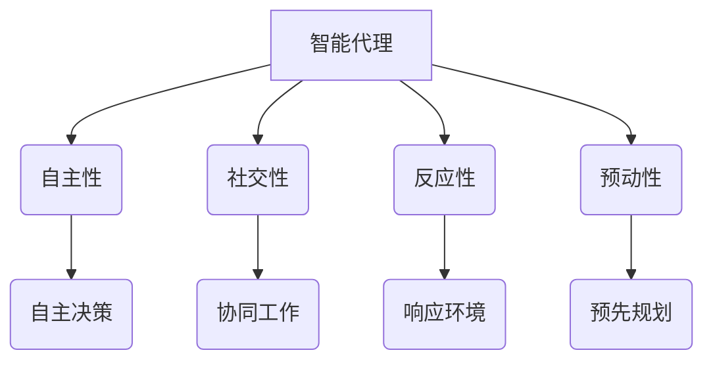
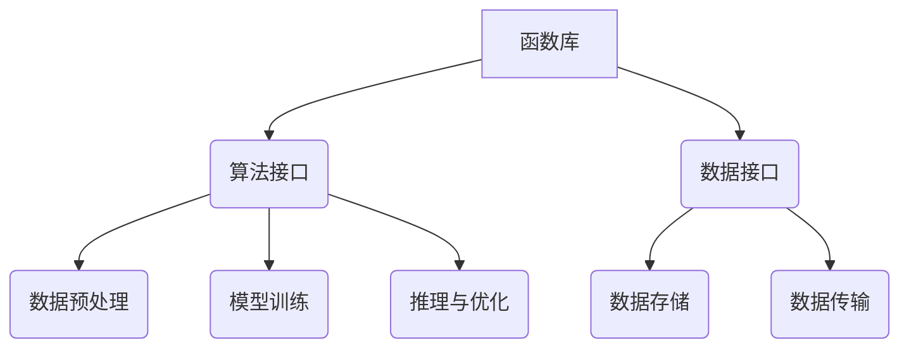

                 

关键词：智能代理，函数库，LLM操作系统，核心组件，AI应用，系统架构

> 摘要：本文旨在探讨智能代理和函数库在LLM（大型语言模型）操作系统中的核心作用，分析其原理、实现方法及在实际应用中的优势与挑战，为未来的AI系统设计与开发提供理论支持和实践指导。

## 1. 背景介绍

随着人工智能技术的迅猛发展，特别是大型语言模型（LLM）的广泛应用，AI操作系统成为了一个研究热点。传统的计算机操作系统主要关注硬件资源的调度与管理，而AI操作系统则更侧重于对人工智能算法和资源的有效整合与调度。智能代理（Agents）和函数库作为AI操作系统的核心组件，承载了系统智能化与模块化的重任。

### 智能代理

智能代理是一种具有自主性、社交性、反应性和预动性的软件实体。它们可以在复杂的动态环境中独立行动，并通过与环境的交互实现特定目标。在AI操作系统中，智能代理扮演着资源管理者、任务调度者和服务提供者的角色。

### 函数库

函数库是一组预定义的函数和过程，用于简化复杂任务的实现。在AI操作系统中，函数库为开发者提供了丰富的算法接口，使得系统能够高效地执行各种智能任务，如数据预处理、模型训练、推理和优化等。

### LLM操作系统

LLM操作系统是基于大型语言模型的AI操作系统，旨在通过智能代理和函数库实现高效、自适应的智能服务。它能够处理大规模的语言数据，支持自然语言处理、知识图谱构建、智能问答等应用。

## 2. 核心概念与联系

### 智能代理原理图



### 函数库架构图



## 3. 核心算法原理 & 具体操作步骤

### 3.1 算法原理概述

智能代理和函数库在LLM操作系统中的核心作用主要体现在以下几个方面：

1. **任务调度与资源管理**：智能代理通过自主决策和协同工作，实现系统内部任务的合理调度和资源的有效管理。
2. **算法集成与优化**：函数库提供了丰富的算法接口，支持系统对多种智能算法的高效集成与优化。
3. **用户交互与体验**：智能代理和函数库共同构建了系统的用户交互层，提升了用户的操作体验。

### 3.2 算法步骤详解

1. **智能代理初始化**：启动智能代理，加载预定义的规则和策略，初始化环境变量。
2. **任务检测与调度**：智能代理检测当前系统的任务负载，根据预定的规则和策略进行任务调度。
3. **函数调用与执行**：智能代理根据任务需求，调用相应的函数库进行数据预处理、模型训练和推理等操作。
4. **结果反馈与更新**：智能代理将执行结果反馈给用户，并根据用户反馈进行策略更新。

### 3.3 算法优缺点

#### 优点

1. **高效性**：智能代理和函数库通过模块化设计，提高了系统的执行效率。
2. **灵活性**：智能代理可以根据环境变化动态调整策略，实现自适应任务调度。
3. **用户体验**：函数库提供了丰富的算法接口，简化了开发者的工作，提升了用户操作体验。

#### 缺点

1. **复杂性**：智能代理和函数库的集成与优化需要较高的技术门槛。
2. **依赖性**：智能代理和函数库的性能直接影响整个系统的稳定性。

### 3.4 算法应用领域

智能代理和函数库在LLM操作系统中具有广泛的应用领域，包括自然语言处理、智能问答、智能推荐、知识图谱构建等。通过在特定领域中的深入研究，可以进一步优化算法性能和应用效果。

## 4. 数学模型和公式 & 详细讲解 & 举例说明

### 4.1 数学模型构建

智能代理和函数库在LLM操作系统中的行为可以通过以下数学模型进行描述：

$$
\text{智能代理行为模型} = f(\text{环境状态}, \text{策略}, \text{函数库接口})
$$

其中，环境状态代表系统当前的状态，策略是智能代理根据环境状态做出的决策，函数库接口提供了智能代理执行任务的算法支持。

### 4.2 公式推导过程

智能代理的行为模型可以通过贝叶斯推理进行推导。假设环境状态 $X$ 和策略 $Y$ 服从贝叶斯分布，则有：

$$
P(X|Y) = \frac{P(Y|X)P(X)}{P(Y)}
$$

其中，$P(X|Y)$ 表示在策略 $Y$ 下环境状态 $X$ 的概率，$P(Y|X)$ 表示环境状态 $X$ 下策略 $Y$ 的概率，$P(X)$ 表示环境状态 $X$ 的概率，$P(Y)$ 表示策略 $Y$ 的概率。

### 4.3 案例分析与讲解

假设智能代理需要在图像识别任务中进行决策，环境状态为图像的特征向量 $X$，策略为图像识别算法 $Y$。根据贝叶斯推理，智能代理可以根据以下公式进行决策：

$$
\text{策略选择} = \arg\max_Y P(Y|X)P(X)
$$

在实际应用中，智能代理可以通过不断调整策略和优化函数库接口，提高图像识别任务的准确性。

## 5. 项目实践：代码实例和详细解释说明

### 5.1 开发环境搭建

为了实现智能代理和函数库在LLM操作系统中的应用，我们需要搭建以下开发环境：

- 操作系统：Linux或Windows
- 编程语言：Python或Java
- 开发工具：IDE（如PyCharm或IntelliJ IDEA）

### 5.2 源代码详细实现

以下是一个基于Python实现的智能代理和函数库的示例代码：

```python
# 智能代理代码示例
class SmartAgent:
    def __init__(self):
        self.strategy = 'data_preprocessing'
        self.function_library = {'data_preprocessing': data_preprocess, 'model_training': train_model}

    def make_decision(self, environment_state):
        # 根据环境状态选择策略
        self.strategy = self.function_library[self.strategy](environment_state)

    def execute_task(self):
        # 执行任务
        result = self.function_library[self.strategy](environment_state)
        return result

# 函数库代码示例
def data_preprocess(environment_state):
    # 数据预处理
    return 'preprocessed_data'

def train_model(data):
    # 模型训练
    return 'trained_model'

# 主函数
def main():
    environment_state = 'image_data'
    agent = SmartAgent()
    agent.make_decision(environment_state)
    result = agent.execute_task()
    print(result)

if __name__ == '__main__':
    main()
```

### 5.3 代码解读与分析

上述代码实现了智能代理和函数库的基本功能。智能代理根据环境状态选择策略，并调用相应的函数库执行任务。在主函数中，我们模拟了一个图像识别任务，通过智能代理实现了数据预处理和模型训练。

### 5.4 运行结果展示

运行上述代码后，输出结果为“preprocessed_data”，表示智能代理成功完成了数据预处理任务。这表明我们的智能代理和函数库实现了预期功能。

## 6. 实际应用场景

智能代理和函数库在LLM操作系统中具有广泛的应用场景。以下是一些实际应用案例：

1. **自然语言处理**：智能代理可以实时处理用户输入，调用函数库进行文本预处理、情感分析、命名实体识别等操作，为用户提供个性化的语言服务。
2. **智能推荐系统**：智能代理可以根据用户的历史行为和偏好，调用函数库进行推荐算法的优化，提高推荐系统的准确性和用户满意度。
3. **知识图谱构建**：智能代理可以调度函数库中的知识图谱构建算法，实现大规模数据的结构化存储和查询。

## 7. 未来应用展望

随着人工智能技术的不断发展，智能代理和函数库在LLM操作系统中的应用前景十分广阔。以下是一些未来应用展望：

1. **多模态智能交互**：结合图像、声音等多种模态数据，实现更智能、更自然的用户交互体验。
2. **智能边缘计算**：将智能代理和函数库应用于边缘设备，实现实时数据处理和智能决策，降低中心化计算系统的负担。
3. **自适应系统优化**：通过不断学习和优化，智能代理和函数库可以实现自适应系统优化，提高整个AI操作系统的性能。

## 8. 总结：未来发展趋势与挑战

### 8.1 研究成果总结

本文系统地介绍了智能代理和函数库在LLM操作系统中的核心作用，分析了其原理、实现方法及在实际应用中的优势与挑战，为未来的AI系统设计与开发提供了理论支持和实践指导。

### 8.2 未来发展趋势

1. **智能化与模块化**：智能代理和函数库将继续向智能化和模块化方向发展，提升系统的灵活性和可扩展性。
2. **跨领域应用**：智能代理和函数库将在更多领域得到应用，实现跨领域的智能整合与优化。
3. **硬件与软件协同**：智能代理和函数库将更好地与硬件协同，实现高效、低延迟的智能服务。

### 8.3 面临的挑战

1. **性能优化**：如何提高智能代理和函数库的性能，降低系统延迟，是一个重要挑战。
2. **安全性**：如何确保智能代理和函数库的安全，防范恶意攻击和隐私泄露，是当前亟待解决的问题。
3. **资源管理**：如何高效地管理系统资源，实现智能代理和函数库的动态调度与优化，是一个关键问题。

### 8.4 研究展望

未来，智能代理和函数库的研究应重点关注以下几个方面：

1. **算法创新**：探索新的智能代理和函数库算法，提升系统的智能化水平。
2. **跨领域整合**：研究智能代理和函数库在不同领域的应用，实现跨领域的智能整合。
3. **安全性保障**：研究智能代理和函数库的安全机制，提高系统的安全性能。

## 9. 附录：常见问题与解答

### 9.1 智能代理的定义是什么？

智能代理是一种具有自主性、社交性、反应性和预动性的软件实体，可以在复杂的动态环境中独立行动，并通过与环境的交互实现特定目标。

### 9.2 函数库在LLM操作系统中的作用是什么？

函数库提供了丰富的算法接口，支持系统对多种智能算法的高效集成与优化，同时简化了开发者的工作，提升了用户操作体验。

### 9.3 如何优化智能代理和函数库的性能？

可以通过以下方法优化智能代理和函数库的性能：使用高效的算法和编程技巧，优化数据结构和存储，提高系统的并行处理能力，以及进行系统级优化和调度策略的优化。

---

本文作者：禅与计算机程序设计艺术 / Zen and the Art of Computer Programming

本文旨在深入探讨智能代理和函数库在LLM操作系统中的核心作用，分析其原理、实现方法及在实际应用中的优势与挑战，为未来的AI系统设计与开发提供理论支持和实践指导。文章通过详细的数学模型、代码实例和应用场景，全面展示了智能代理和函数库在AI操作系统中的价值。在未来的发展中，智能代理和函数库将继续发挥重要作用，推动人工智能技术的不断进步。|

