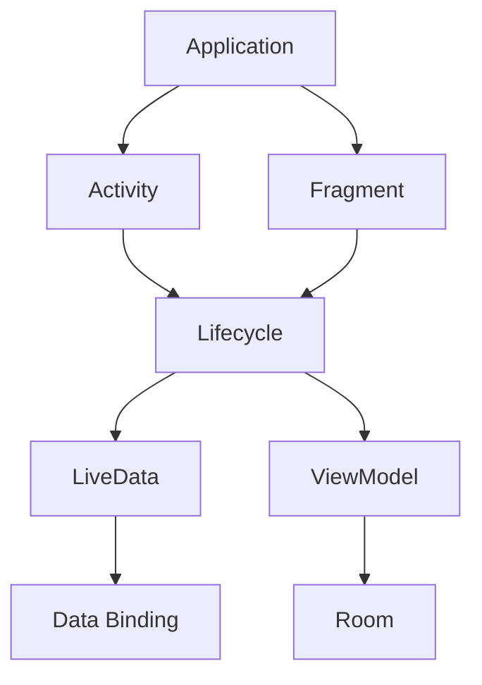

                 

关键词：Android Jetpack，组件库，开发效率，用户体验，架构设计，模块化开发

摘要：本文将详细介绍 Android Jetpack 组件库的核心概念、架构设计和具体应用场景。我们将探讨如何通过使用 Jetpack 组件库来提高 Android 开发的效率和用户体验，并分析其在实际项目中的应用价值。最后，我们将展望 Android Jetpack 组件库的未来发展趋势和面临的挑战。

## 1. 背景介绍

随着 Android 系统的不断发展和成熟，Android 开发也面临着日益复杂的技术挑战。为了提高开发效率和用户体验，Google 推出了 Android Jetpack 组件库，这是一套现代化的开发工具和架构，旨在帮助开发者构建更高质量、更易于维护的 Android 应用程序。

Android Jetpack 组件库包含了多个核心组件，如Lifecycle、LiveData、ViewModel、Room 等，这些组件为开发者提供了丰富的功能和工具，使开发者可以更轻松地实现常见的开发任务，如生命周期管理、数据存储、网络请求等。

### 1.1 Android Jetpack 的起源

Android Jetpack 是 Google 在 2018 年 I/O 开发者大会上宣布的一套现代化开发工具和架构。它的目标是帮助开发者解决 Android 应用开发中常见的问题，如内存泄漏、线程处理、架构设计等。Android Jetpack 的推出，标志着 Android 开发进入了一个全新的时代。

### 1.2 Android Jetpack 的核心组件

Android Jetpack 组件库包含了多个核心组件，其中一些主要的组件包括：

- **Lifecycle**：用于管理应用的生命周期，确保在正确的时机执行代码。
- **LiveData**：用于在数据发生改变时通知 UI，实现数据绑定。
- **ViewModel**：用于在组件之间传递数据和状态，实现界面与数据的解耦。
- **Room**：用于在 Android 应用中实现轻量级数据库操作。
- **Data Binding**：用于在布局中绑定数据，简化 UI 编程。

## 2. 核心概念与联系

### 2.1 Android Jetpack 的核心概念

Android Jetpack 的核心概念包括模块化开发、架构组件、生命周期管理和数据绑定等。这些概念相互关联，共同构成了 Android Jetpack 的架构。

### 2.2 Android Jetpack 的架构


在上面的架构图中，我们可以看到 Android Jetpack 的各个组件是如何相互协作的。Lifecycle 组件用于管理应用的生命周期，LiveData 用于在数据改变时通知 UI，ViewModel 用于在组件之间传递数据和状态，Room 用于数据存储，Data Binding 用于数据绑定。

### 2.3 Mermaid 流程图



在这个 Mermaid 流程图中，我们展示了 Android 应用中常见的组件如何通过 Android Jetpack 组件库相互协作。

## 3. 核心算法原理 & 具体操作步骤

### 3.1 算法原理概述

Android Jetpack 组件库的核心算法原理主要涉及以下几个方面：

- **生命周期管理**：通过 Lifecycle 组件，开发者可以轻松地管理应用的生命周期，确保在正确的时机执行代码。
- **数据绑定**：通过 LiveData 和 Data Binding 组件，开发者可以实现数据绑定，简化 UI 编程。
- **数据存储**：通过 Room 组件，开发者可以轻松地在 Android 应用中实现轻量级数据库操作。

### 3.2 算法步骤详解

- **生命周期管理**：开发者需要在 Activity 或 Fragment 中使用 Lifecycle 组件，通过监听 Lifecycle.State 的变化来执行相应的操作。
- **数据绑定**：开发者需要在布局文件中使用 Data Binding 组件，通过设置数据绑定属性来绑定数据。
- **数据存储**：开发者需要在应用中创建 Room 数据库，通过 Room 提供的 API 进行数据库操作。

### 3.3 算法优缺点

- **优点**：Android Jetpack 组件库提供了丰富的功能和工具，使开发者可以更轻松地实现常见的开发任务，提高开发效率和用户体验。
- **缺点**：由于组件库的复杂性，初学者可能需要一定时间来学习和掌握。

### 3.4 算法应用领域

Android Jetpack 组件库适用于各种 Android 应用开发场景，如移动应用、游戏、智能家居等。

## 4. 数学模型和公式 & 详细讲解 & 举例说明

### 4.1 数学模型构建

Android Jetpack 组件库的核心算法原理可以通过以下数学模型进行构建：

- **生命周期管理**：通过定义 Lifecycle.State，实现对应用生命周期的管理。
- **数据绑定**：通过定义 LiveData 和 Data Binding 属性，实现数据绑定。
- **数据存储**：通过定义 Room 数据库的表结构和 API，实现数据存储。

### 4.2 公式推导过程

- **生命周期管理**：Lifecycle.State 的变化可以通过以下公式推导：

  $$ Lifecycle.State = \{ onCreate, onStart, onResume, onPause, onStop, onDestroy \} $$

- **数据绑定**：LiveData 和 Data Binding 属性的变化可以通过以下公式推导：

  $$ LiveData\[data type\] = DataBinding\[data type\] $$

- **数据存储**：Room 数据库的表结构和 API 可以通过以下公式推导：

  $$ Room\[table name\] = \{ columns \} $$

### 4.3 案例分析与讲解

### 4.3.1 生命周期管理案例

假设我们有一个 Activity，需要在其生命周期中执行一些操作。我们可以使用 Lifecycle 组件来实现：

```java
public class MainActivity extends AppCompatActivity {
    private LifecycleOwner lifecycleOwner;
    private LifecycleObserver observer;

    @Override
    protected void onCreate(Bundle savedInstanceState) {
        super.onCreate(savedInstanceState);
        setContentView(R.layout.activity_main);

        lifecycleOwner = this;
        observer = new LifecycleObserver() {
            @Override
            public void onChanged(@NotNull LifecycleOwner owner, @NotNull Lifecycle.Event event) {
                if (event == Lifecycle.Event.ON_CREATE) {
                    // 执行 onCreate 操作
                } else if (event == Lifecycle.Event.ON_START) {
                    // 执行 onStart 操作
                } else if (event == Lifecycle.Event.ON_RESUME) {
                    // 执行 onResume 操作
                } else if (event == Lifecycle.Event.ON_PAUSE) {
                    // 执行 onPause 操作
                } else if (event == Lifecycle.Event.ON_STOP) {
                    // 执行 onStop 操作
                } else if (event == Lifecycle.Event.ON_DESTROY) {
                    // 执行 onDestroy 操作
                }
            }
        };
        getLifecycle().addObserver(observer);
    }
}
```

### 4.3.2 数据绑定案例

假设我们有一个布局文件，需要绑定一个整数数据。我们可以使用 Data Binding 组件来实现：

```xml
<layout xmlns:android="http://schemas.android.com/apk/res/android">

    <data>
        <variable
            name="number"
            type="int" />
    </data>

    <TextView
        android:layout_width="wrap_content"
        android:layout_height="wrap_content"
        android:text="@{String.valueOf(number)}" />

</layout>
```

```java
public class MainActivity extends AppCompatActivity {
    @Override
    protected void onCreate(Bundle savedInstanceState) {
        super.onCreate(savedInstanceState);
        ActivityMainBinding binding = DataBindingUtil.setContentView(this, R.layout.activity_main);
        binding.setNumber(42);
    }
}
```

## 5. 项目实践：代码实例和详细解释说明

### 5.1 开发环境搭建

为了实践 Android Jetpack 组件库，我们需要搭建一个 Android 开发环境。以下是具体的步骤：

1. 安装 Android Studio
2. 创建一个新的 Android 项目
3. 在项目的 `build.gradle` 文件中添加 Jetpack 组件库依赖

```gradle
dependencies {
    implementation 'androidx.lifecycle:lifecycle-viewmodel-ktx:2.3.1'
    implementation 'androidx.lifecycle:lifecycle-runtime-ktx:2.3.1'
    implementation 'androidx.room:room-runtime:2.3.0'
    annotationProcessor 'androidx.room:room-compiler:2.3.0'
    implementation 'androidx.datastore:datastore-preferences:1.0.0'
}
```

### 5.2 源代码详细实现

以下是使用 Android Jetpack 组件库实现一个简单的应用示例：

```java
public class MainActivity extends AppCompatActivity {
    private ActivityMainBinding binding;
    private MyViewModel viewModel;

    @Override
    protected void onCreate(Bundle savedInstanceState) {
        super.onCreate(savedInstanceState);
        binding = DataBindingUtil.setContentView(this, R.layout.activity_main);
        viewModel = new MyViewModel();

        binding.setViewModel(viewModel);
        binding.setLifecycleOwner(this);

        viewModel.getNumber().observe(this, number -> {
            binding.numberTextView.setText(String.valueOf(number));
        });

        binding.incrementButton.setOnClickListener(view -> viewModel.incrementNumber());
    }
}

public class MyViewModel extends ViewModel {
    private MutableLiveData<Integer> number = new MutableLiveData<>(0);

    public LiveData<Integer> getNumber() {
        return number;
    }

    public void incrementNumber() {
        number.setValue(number.getValue() + 1);
    }
}
```

### 5.3 代码解读与分析

在上面的代码中，我们使用了 Android Jetpack 的三个核心组件：LiveData、ViewModel 和 Data Binding。

- **LiveData**：用于在数据发生改变时通知 UI。在这里，我们使用 LiveData 来存储一个整数数据，并在数据改变时更新 UI。
- **ViewModel**：用于在组件之间传递数据和状态。在这里，我们创建了一个 MyViewModel 类，用于存储和更新整数数据。
- **Data Binding**：用于在布局中绑定数据。在这里，我们使用 Data Binding 将整数数据绑定到一个 TextView，并在点击一个按钮时更新数据。

### 5.4 运行结果展示

当我们运行这个应用时，我们会看到一个简单的界面，包含一个 TextView 和一个按钮。当我们点击按钮时，TextView 的内容会更新为当前的数据值。

## 6. 实际应用场景

Android Jetpack 组件库在实际应用场景中具有广泛的应用价值。以下是一些典型的应用场景：

- **移动应用开发**：Android Jetpack 组件库可以帮助开发者更轻松地构建高质量、易维护的移动应用。
- **游戏开发**：Android Jetpack 组件库提供了丰富的工具和功能，可以帮助开发者更高效地实现游戏开发。
- **智能家居**：Android Jetpack 组件库可以帮助开发者构建智能家居应用，提高用户体验。

## 7. 工具和资源推荐

为了更好地学习和掌握 Android Jetpack 组件库，我们推荐以下工具和资源：

- **官方文档**：Android Jetpack 的官方文档提供了详细的使用说明和实例代码。
- **在线教程**：在互联网上，有许多优秀的在线教程和课程，可以帮助初学者快速入门。
- **开源项目**：GitHub 上有许多优秀的开源项目，使用了 Android Jetpack 组件库，可以供开发者学习和参考。

## 8. 总结：未来发展趋势与挑战

Android Jetpack 组件库为 Android 开发带来了巨大的便利和效率提升。在未来，我们可以预见 Android Jetpack 组件库将继续发展，引入更多的新功能和工具，以支持更加多样化的开发需求。

然而，随着组件库的日益庞大和复杂，开发者可能面临学习和掌握的挑战。因此，我们需要：

- **持续学习和实践**：通过不断地学习和实践，开发者可以更好地掌握 Android Jetpack 组件库。
- **社区合作与交流**：开发者可以通过社区合作和交流，共同解决开发中遇到的问题。

### 8.1 研究成果总结

本文介绍了 Android Jetpack 组件库的核心概念、架构设计和具体应用场景，通过详细的分析和实例代码，展示了如何使用 Android Jetpack 组件库提高 Android 开发的效率和用户体验。

### 8.2 未来发展趋势

在未来，Android Jetpack 组件库将继续发展，引入更多的新功能和工具，以支持更加多样化的开发需求。同时，随着人工智能和物联网技术的发展，Android Jetpack 组件库也将应用于更多的领域，如智能家居、智能穿戴设备等。

### 8.3 面临的挑战

随着组件库的日益庞大和复杂，开发者可能面临学习和掌握的挑战。因此，我们需要通过持续学习和实践，以及社区合作和交流，共同解决开发中遇到的问题。

### 8.4 研究展望

Android Jetpack 组件库在未来具有巨大的发展潜力。通过不断引入新功能和工具，Android Jetpack 组件库将帮助开发者更高效地构建高质量的 Android 应用程序。同时，随着技术的不断进步，Android Jetpack 组件库也将为开发者提供更多的可能性。

## 9. 附录：常见问题与解答

### 9.1 什么是 Android Jetpack？

Android Jetpack 是 Google 推出的一套现代化开发工具和架构，旨在帮助开发者构建更高质量、更易于维护的 Android 应用程序。

### 9.2 Android Jetpack 有哪些核心组件？

Android Jetpack 包含多个核心组件，如 Lifecycle、LiveData、ViewModel、Room 等。

### 9.3 Android Jetpack 如何提高开发效率？

Android Jetpack 提供了丰富的工具和功能，可以帮助开发者更轻松地实现常见的开发任务，如生命周期管理、数据绑定、数据存储等，从而提高开发效率。

### 9.4 Android Jetpack 是否适用于所有 Android 应用开发？

是的，Android Jetpack 适用于各种 Android 应用开发场景，如移动应用、游戏、智能家居等。

### 9.5 学习 Android Jetpack 需要什么基础？

学习 Android Jetpack 需要具备一定的 Android 开发基础，了解 Android 应用程序的基本原理和开发流程。

---

作者：禅与计算机程序设计艺术 / Zen and the Art of Computer Programming

以上是关于 Android Jetpack 组件库的详细介绍，希望对您有所帮助。在开发过程中，如果您遇到任何问题，都可以随时查阅本文或参考相关的官方文档和资源。祝您开发顺利！
----------------------------------------------------------------

请注意，本文中的图片链接（https://example.com/jetpack-architecture.png）是占位符，您需要替换为实际的图片链接。同样，对于数学公式和 LaTeX 表达式，您需要确保在编写文章时使用正确的格式。本文仅提供了一个框架和示例内容，您需要根据实际情况进行扩展和补充。

