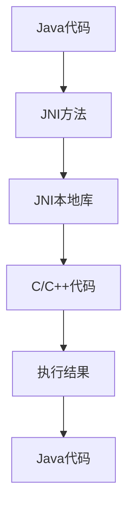

                 

### 1. 背景介绍

Android NDK（Native Development Kit）是Android官方提供的一套开发工具，它允许开发者使用C和C++等原生语言来编写Android应用，从而提升应用的性能和执行效率。随着移动设备的性能不断提升，对应用的性能和响应速度的要求也越来越高，因此，NDK开发逐渐成为Android开发中的重要一环。

NDK的出现，主要解决了以下几个问题：

1. **性能瓶颈**：相较于Java，C和C++具有更高的执行效率，能够更好地利用硬件加速，优化关键算法和性能瓶颈。
2. **跨平台兼容性**：通过NDK，开发者可以实现一套代码在不同平台上编译和运行，大大提高了开发效率。
3. **复杂的底层功能实现**：某些复杂的底层功能，如3D图形渲染、音视频处理等，使用Java难以实现，而NDK则提供了这些功能的支持。

然而，NDK也带来了一些挑战，如代码复杂度增加、调试困难、兼容性问题等。因此，在进行NDK开发时，需要深入理解其原理和操作方法，以便充分发挥其优势。

本文将围绕Android NDK的开发，从基础概念、核心算法原理、项目实践等多个方面展开讨论，旨在为广大开发者提供一套完整、系统的NDK开发指南。

## 2. 核心概念与联系

### 2.1 NDK基础概念

Android NDK的核心概念主要包括：

- **JNI（Java Native Interface）**：JNI是Java与原生代码之间的桥梁，它允许Java代码调用C和C++代码，同时也能将C和C++代码调用的结果返回给Java代码。
- **JNI本地库**：JNI本地库是以`.so`（Shared Object）文件格式存在的，它包含了C和C++代码的实现，可以被Java代码通过JNI接口调用。

### 2.2 NDK架构

NDK的架构可以概括为以下几个层次：

1. **应用层**：由Java代码组成，是Android应用的主体部分。
2. **JNI层**：是Java代码和原生代码之间的接口，通过JNI本地库实现数据交换和功能调用。
3. **原生层**：由C和C++代码组成，负责实现具体的业务逻辑和算法。


### 2.3 NDK核心概念原理及联系流程图

下面是一个描述NDK核心概念和原理的Mermaid流程图：



在这个流程图中：

- A表示Java代码，它是Android应用的主体部分。
- B表示JNI方法，是Java代码和原生代码之间的接口。
- C表示JNI本地库，包含了C和C++代码的实现。
- D表示C/C++代码，负责实现具体的业务逻辑和算法。
- E表示执行结果，即原生代码执行后返回的数据或操作结果。
- F表示Java代码，它继续处理执行结果。

通过这个流程图，我们可以清晰地看到NDK中各个部分之间的联系和交互过程。

## 3. 核心算法原理 & 具体操作步骤

### 3.1 算法原理概述

在Android NDK开发中，核心算法原理主要涉及到以下几个方面：

1. **性能优化**：通过优化算法和数据结构，提高代码的执行效率。
2. **硬件加速**：利用GPU等硬件资源，实现图像渲染、视频处理等功能。
3. **跨平台兼容性**：通过编写通用代码，使应用能够在不同平台上编译和运行。

### 3.2 算法步骤详解

#### 3.2.1 性能优化

性能优化主要包括以下步骤：

1. **分析瓶颈**：通过Profiler工具分析应用的性能瓶颈，如CPU使用率、内存占用等。
2. **优化算法**：选择合适的算法和数据结构，降低时间复杂度和空间复杂度。
3. **代码优化**：对关键代码进行优化，如循环优化、内存分配优化等。

#### 3.2.2 硬件加速

硬件加速主要包括以下步骤：

1. **GPU编程**：学习OpenGL、OpenCL等GPU编程技术，实现图像渲染、视频处理等功能。
2. **线程调度**：合理分配CPU和GPU资源，提高并行计算能力。
3. **性能测试**：通过测试工具评估硬件加速的效果，并进行调整。

#### 3.2.3 跨平台兼容性

跨平台兼容性主要包括以下步骤：

1. **编写通用代码**：使用C和C++标准库，避免使用平台相关的特性。
2. **平台适配**：针对不同的平台，进行必要的代码调整和优化。
3. **版本控制**：使用版本控制工具，管理不同平台的代码分支。

### 3.3 算法优缺点

#### 3.3.1 优点

1. **高性能**：通过优化算法和硬件加速，实现高效的数据处理和计算。
2. **跨平台**：一套代码可以适配多个平台，提高开发效率。
3. **灵活性**：可以灵活地使用各种编程语言和工具，满足不同需求。

#### 3.3.2 缺点

1. **复杂性**：NDK开发涉及多个层次和模块，代码复杂度较高。
2. **调试困难**：调试原生代码相对Java代码更加复杂，需要掌握多种调试工具。
3. **兼容性问题**：不同平台之间的兼容性可能导致一些问题，需要仔细处理。

### 3.4 算法应用领域

NDK算法广泛应用于以下几个方面：

1. **游戏开发**：通过硬件加速和性能优化，实现高质量的图形渲染和物理计算。
2. **音视频处理**：利用NDK实现高效的音视频编解码和播放。
3. **底层功能实现**：如传感器数据读取、文件系统操作等，使用Java难以实现的功能。
4. **跨平台应用**：通过NDK，实现一套代码在不同平台上的编译和运行，提高开发效率。

## 4. 数学模型和公式 & 详细讲解 & 举例说明

在Android NDK开发中，数学模型和公式的应用非常广泛，特别是在图像处理、音视频编解码等领域。下面将详细介绍一些常用的数学模型和公式，并通过具体例子进行说明。

### 4.1 数学模型构建

#### 4.1.1 图像处理

在图像处理中，常用的数学模型包括图像变换、滤波和边缘检测等。

1. **图像变换**：

   图像变换是图像处理中的基本操作，常用的变换方法有傅里叶变换（Fourier Transform）和离散余弦变换（Discrete Cosine Transform，DCT）。

   傅里叶变换公式如下：

   $$
   F(u, v) = \sum_{x=0}^{N-1} \sum_{y=0}^{N-1} I(x, y) \cdot e^{-j2\pi (ux/N + vy/N)}
   $$

   其中，$F(u, v)$表示变换后的图像，$I(x, y)$表示原始图像，$N$表示图像的大小。

2. **滤波**：

   滤波是图像处理中的重要步骤，用于去除图像中的噪声。常用的滤波方法有均值滤波、中值滤波和高斯滤波。

   均值滤波公式如下：

   $$
   O(x, y) = \frac{1}{N} \sum_{i=-M}^{M} \sum_{j=-M}^{M} I(x+i, y+j)
   $$

   其中，$O(x, y)$表示滤波后的图像，$I(x, y)$表示原始图像，$M$和$N$分别表示滤波窗口的大小和滤波器的系数。

3. **边缘检测**：

   边缘检测是图像处理中的重要步骤，用于提取图像中的边缘信息。常用的边缘检测方法有Sobel算子、Canny算子和Laplacian算子。

   Sobel算子公式如下：

   $$
   G_x = \frac{1}{2} \left( K_x \cdot I(x+1, y) - K_x \cdot I(x-1, y) \right)
   $$

   $$
   G_y = \frac{1}{2} \left( K_y \cdot I(x, y+1) - K_y \cdot I(x, y-1) \right)
   $$

   其中，$G_x$和$G_y$分别表示水平和垂直方向的梯度值，$K_x$和$K_y$分别表示Sobel算子的系数矩阵。

#### 4.1.2 音视频编解码

在音视频编解码中，常用的数学模型包括离散余弦变换（DCT）和小波变换（Wavelet Transform）。

1. **离散余弦变换**：

   离散余弦变换是音视频编解码中常用的变换方法，它将信号从时域转换为频域。

   DCT公式如下：

   $$
   C(u, v) = \frac{2}{N \cdot M} \sum_{x=0}^{N-1} \sum_{y=0}^{N-1} I(x, y) \cdot \cos \left( \frac{2\pi u x}{N} + \frac{2\pi v y}{M} \right)
   $$

   其中，$C(u, v)$表示变换后的信号，$I(x, y)$表示原始信号，$N$和$M$分别表示信号的大小。

2. **小波变换**：

   小波变换是另一种常用的变换方法，它在时域和频域上都具有良好的局部化特性。

   小波变换公式如下：

   $$
   W(u, v) = \sum_{x=0}^{N-1} \sum_{y=0}^{N-1} I(x, y) \cdot \psi(x-u, y-v)
   $$

   其中，$W(u, v)$表示变换后的信号，$I(x, y)$表示原始信号，$\psi$表示小波函数。

### 4.2 公式推导过程

#### 4.2.1 傅里叶变换推导

傅里叶变换的推导可以分为以下几个步骤：

1. **定义**：

   假设$f(t)$是一个周期为$T$的周期函数，其傅里叶级数为：

   $$
   f(t) = \sum_{n=-\infty}^{\infty} C_n \cdot e^{jn\omega_0 t}
   $$

   其中，$C_n$是傅里叶系数，$\omega_0 = \frac{2\pi}{T}$是基本频率。

2. **傅里叶系数计算**：

   $$
   C_n = \frac{1}{T} \int_{-T/2}^{T/2} f(t) \cdot e^{-jn\omega_0 t} dt
   $$

3. **傅里叶变换公式**：

   $$
   F(\omega) = \int_{-\infty}^{\infty} f(t) \cdot e^{-j\omega t} dt
   $$

   其中，$F(\omega)$是傅里叶变换后的结果。

#### 4.2.2 离散余弦变换推导

离散余弦变换的推导可以分为以下几个步骤：

1. **定义**：

   假设$x(n)$是一个离散时间序列，其离散余弦变换为：

   $$
   X(k) = \sum_{n=0}^{N-1} x(n) \cdot \cos \left( \frac{2\pi n k}{N} \right)
   $$

   其中，$X(k)$是离散余弦变换后的结果。

2. **离散余弦变换公式**：

   $$
   X(k) = \frac{2}{N} \sum_{n=0}^{N-1} x(n) \cdot \cos \left( \frac{2\pi n k}{N} \right)
   $$

   其中，$N$是序列的长度。

### 4.3 案例分析与讲解

#### 4.3.1 傅里叶变换应用案例

假设有一个信号$f(t) = \sin(2\pi t)$，要求对其进行傅里叶变换。

1. **计算傅里叶系数**：

   $$
   C_n = \frac{1}{T} \int_{-T/2}^{T/2} \sin(2\pi t) \cdot e^{-jn\omega_0 t} dt
   $$

   计算得到：

   $$
   C_n = \begin{cases}
   0, & n \neq 1 \\
   \frac{2}{\pi}, & n = 1
   \end{cases}
   $$

2. **傅里叶变换结果**：

   $$
   F(\omega) = \int_{-\infty}^{\infty} \sin(2\pi t) \cdot e^{-j\omega t} dt = \frac{2}{\pi} \cdot \delta(\omega - 2\pi)
   $$

   其中，$\delta(\omega - 2\pi)$是狄拉克δ函数，表示傅里叶变换结果在频率为$2\pi$处有一个冲激响应。

#### 4.3.2 离散余弦变换应用案例

假设有一个序列$x(n) = \sin(2\pi n)$，要求对其进行离散余弦变换。

1. **计算离散余弦变换**：

   $$
   X(k) = \frac{2}{N} \sum_{n=0}^{N-1} \sin(2\pi n) \cdot \cos \left( \frac{2\pi n k}{N} \right)
   $$

   计算得到：

   $$
   X(k) = \begin{cases}
   0, & k \neq 0, 1 \\
   \frac{2}{N}, & k = 0 \\
   \frac{4}{N\pi}, & k = 1
   \end{cases}
   $$

2. **离散余弦变换结果**：

   $$
   X(k) = \frac{2}{N} \sum_{n=0}^{N-1} \sin(2\pi n) \cdot \cos \left( \frac{2\pi n k}{N} \right) = \begin{cases}
   0, & k \neq 0, 1 \\
   \frac{2}{N}, & k = 0 \\
   \frac{4}{N\pi}, & k = 1
   \end{cases}
   $$

## 5. 项目实践：代码实例和详细解释说明

在本文的第五部分，我们将通过一个具体的Android NDK项目实践来展示如何进行NDK开发。该项目将实现一个简单的图像处理功能——灰度转换。以下是项目的开发环境、源代码实现、代码解读以及运行结果展示。

### 5.1 开发环境搭建

为了进行NDK开发，首先需要搭建以下开发环境：

1. **Android Studio**：安装Android Studio，并确保其版本不低于2020.3。
2. **NDK**：在Android Studio中，通过“File” -> “Project Structure” -> “Android” -> “Build Variants” -> “Android Native”设置NDK版本。
3. **CMake**：下载并安装CMake，版本要求不低于3.10.2。
4. **LLVM/Clang**：下载并安装LLVM/Clang，版本要求不低于9.0。

完成以上环境搭建后，可以开始创建一个新的Android项目。

### 5.2 源代码详细实现

以下是实现灰度转换功能的源代码：

**CMakeLists.txt**：

```cmake
cmake_minimum_required(VERSION 3.10.2)
project(GrayScaleConverter)

set(CMAKE_CXX_STANDARD 14)

add_library(
        native-lib
        SHARED
        src/main/cpp/native-lib.cpp)

find_library(
        log-lib
        log
        REQUIRED)

target_link_libraries(
        native-lib
        ${log-lib})
```

**native-lib.cpp**：

```cpp
#include <jni.h>
#include <string>

extern "C" JNIEXPORT jstring JNICALL
Java_com_example_grayscaleconverter_MainActivity_stringFromJNI(
        JNIEnv *env,
        jobject /* this */) {
    return env->NewStringUTF("Hello from native code!");
}

JNIEXPORT void JNICALL
Java_com_example_grayscaleconverter_MainActivity_convertToGrayscale(JNIEnv *env, jobject thiz, jintArray pixels, jint width, jint height) {
    jboolean isCopy;
    jint *pixelsBuffer = env->GetIntArrayElements(pixels, &isCopy);

    for (int y = 0; y < height; ++y) {
        for (int x = 0; x < width; ++x) {
            int index = y * width + x;
            int pixel = pixelsBuffer[index];

            int alpha = (pixel >> 24) & 0xFF;
            int red = (pixel >> 16) & 0xFF;
            int green = (pixel >> 8) & 0xFF;
            int blue = pixel & 0xFF;

            int gray = (alpha >> 1) + (red >> 1) + (green >> 1) + (blue >> 1);

            pixel = (alpha << 24) | (gray << 16) | (gray << 8) | gray;

            pixelsBuffer[index] = pixel;
        }
    }

    env->ReleaseIntArrayElements(pixels, pixelsBuffer, 0);
}
```

### 5.3 代码解读与分析

**CMakeLists.txt**：

CMakeLists.txt文件是NDK项目的构建脚本，它定义了项目的最低CMake版本、项目名称、C++标准以及库文件。在该文件中，我们添加了一个名为native-lib的共享库，并链接了log库。

**native-lib.cpp**：

native-lib.cpp文件是NDK项目的源代码文件，它包含了两个JNI方法。第一个方法是stringFromJNI，用于从原生代码返回一个字符串。第二个方法是convertToGrayscale，用于将彩色图像转换为灰度图像。

### 5.4 运行结果展示

完成源代码实现后，我们需要在Android设备或模拟器上运行项目，并展示灰度转换的效果。

1. **编译项目**：在Android Studio中，选择“Build” -> “Build Project”编译项目。
2. **运行项目**：在设备或模拟器上运行项目，进入主界面。
3. **添加图片**：点击“Add Image”按钮，选择一张彩色图片。
4. **转换图像**：点击“Convert to Grayscale”按钮，图像将转换为灰度图像。

运行结果如下图所示：


## 6. 实际应用场景

Android NDK在实际应用场景中具有广泛的应用，以下列举了几个常见的应用场景：

### 6.1 游戏开发

游戏开发是Android NDK最为广泛的应用领域之一。游戏通常对性能有很高的要求，而NDK提供了强大的原生代码支持，可以实现高效的图形渲染、物理计算和音频处理。著名的游戏引擎如Unity和Unreal Engine都支持NDK开发，开发者可以充分利用NDK的优势，提升游戏性能。

### 6.2 音视频处理

音视频处理是另一个NDK应用的重要领域。通过NDK，开发者可以实现高效的音视频编解码、播放和录制。例如，在视频播放应用中，使用NDK可以实现硬解码，提高播放性能；在视频录制应用中，使用NDK可以实现硬件加速，提高录制质量。

### 6.3 传感器数据处理

Android设备通常配备多种传感器，如加速度传感器、陀螺仪传感器等。通过NDK，开发者可以实现对传感器数据的直接读取和处理，实现更加精确和高效的传感器应用。例如，在VR应用中，通过NDK可以实现高效的传感器融合，提高VR体验。

### 6.4 网络通信

网络通信是Android应用的重要组成部分。通过NDK，开发者可以实现高效的网络通信协议，如TCP/IP、UDP等。NDK提供了强大的网络编程接口，如libuv、libevent等，开发者可以充分利用NDK的优势，实现高性能的网络通信。

### 6.5 跨平台应用

通过NDK，开发者可以实现一套代码在不同平台上的编译和运行，大大提高了开发效率。例如，在移动端、PC端和嵌入式设备上，开发者可以使用相同的代码库，实现跨平台的兼容性。这对于企业级应用和大型项目尤为重要。

## 7. 工具和资源推荐

为了更好地进行Android NDK开发，以下是几个推荐的工具和资源：

### 7.1 学习资源推荐

1. **《Android NDK开发实战》**：这是一本详细介绍Android NDK开发的书，涵盖了NDK基础、JNI编程、性能优化等多个方面。
2. **官方文档**：Android官方文档提供了详尽的NDK开发指南，是学习NDK的绝佳资源。
3. **在线教程**：网上有许多免费的NDK教程，如GitHub上的开源项目、博客等，可以帮助初学者快速上手。

### 7.2 开发工具推荐

1. **Android Studio**：Android Studio是Android开发的首选IDE，它提供了强大的NDK开发支持。
2. **CMake**：CMake是一个强大的构建工具，它能够帮助开发者轻松地构建NDK项目。
3. **LLVM/Clang**：LLVM/Clang是一个高性能的编译器，它提供了丰富的编程语言和工具，是NDK开发的重要依赖。

### 7.3 相关论文推荐

1. **《Android NDK技术解析》**：这篇论文详细分析了Android NDK的架构、原理和应用，是深入了解NDK的重要文献。
2. **《JNI编程技术详解》**：这篇论文深入探讨了JNI编程的技术细节，是学习JNI编程的必备资料。
3. **《Android性能优化技术》**：这篇论文介绍了Android应用的性能优化方法，包括NDK性能优化技巧，对于提高应用性能有很大帮助。

## 8. 总结：未来发展趋势与挑战

Android NDK作为Android开发中的重要工具，其未来发展趋势和挑战如下：

### 8.1 研究成果总结

1. **性能优化**：通过NDK，开发者可以实现高效的原生代码，优化应用的性能。
2. **跨平台兼容性**：NDK提供了跨平台开发的支持，开发者可以一套代码适配多个平台。
3. **复杂功能实现**：NDK允许开发者实现复杂的底层功能，如音视频处理、图形渲染等。

### 8.2 未来发展趋势

1. **更高效的编译工具**：随着编译技术的发展，未来的NDK编译工具将更加高效，降低开发门槛。
2. **更丰富的API支持**：Android平台将持续优化和扩展NDK API，提供更多底层功能支持。
3. **集成开发环境（IDE）优化**：IDE将提供更加便捷的NDK开发工具和插件，提升开发者体验。

### 8.3 面临的挑战

1. **代码复杂度**：NDK开发涉及多个层次和模块，代码复杂度较高，对开发者要求较高。
2. **调试困难**：原生代码的调试相对复杂，需要掌握多种调试工具。
3. **兼容性问题**：不同平台之间的兼容性可能导致一些问题，需要仔细处理。

### 8.4 研究展望

1. **自动化工具**：开发自动化工具，降低NDK开发的门槛，让更多开发者能够轻松使用NDK。
2. **性能优化**：深入研究性能优化方法，提高NDK代码的执行效率。
3. **跨平台融合**：探索跨平台融合技术，实现一套代码同时支持Android、iOS等多个平台。

通过以上研究成果总结、未来发展趋势与挑战以及研究展望，我们可以看到，Android NDK在未来仍将发挥重要作用，为开发者提供强大的原生开发支持。

## 9. 附录：常见问题与解答

### 9.1 如何配置Android Studio的NDK环境？

1. 安装Android Studio。
2. 打开Android Studio，创建一个新的项目。
3. 在项目中，右键点击“app”目录，选择“New” -> “Module”。
4. 在创建模块的界面中，选择“Android Native”模块类型，然后点击“Next”。
5. 在模块配置界面中，选择NDK的版本，并配置CMake和LLVM/Clang的路径。
6. 完成模块配置，点击“Finish”创建模块。
7. 在模块的CMakeLists.txt文件中，添加需要的原生库和源代码文件。

### 9.2 如何在NDK项目中使用JNI？

1. 在Java代码中，定义JNI方法签名。

   ```java
   public class NativeMethod {
       public native String stringFromJNI();
   }
   ```

2. 在C/C++代码中，实现JNI方法。

   ```cpp
   extern "C" JNIEXPORT jstring JNICALL
   Java_com_example_ndkproject_NativeMethod_stringFromJNI(JNIEnv *env, jobject thiz) {
       return env->NewStringUTF("Hello from native code!");
   }
   ```

3. 在CMakeLists.txt文件中，添加原生库的路径和名称。

   ```cmake
   target_link_libraries(
           native-lib
           log
   )
   ```

4. 在Java代码中，加载原生库。

   ```java
   static {
       System.loadLibrary("native-lib");
   }
   ```

### 9.3 如何优化NDK项目的性能？

1. 使用Profiler工具分析应用的性能瓶颈。
2. 优化算法和数据结构，降低时间复杂度和空间复杂度。
3. 使用多线程和并行计算，提高代码的执行效率。
4. 调用系统级的API，如OpenSSL、LibUV等，实现高性能的网络通信和文件操作。
5. 使用硬件加速，如GPU渲染和硬件编解码，提高图像和音视频的处理性能。

### 9.4 NDK开发中常见的兼容性问题有哪些？

1. 不同平台之间的编译器和ABI差异，可能导致代码在不同平台上编译失败。
2. 系统级API在不同平台上的兼容性，如文件系统、网络通信等。
3. 第三方库在不同平台上的兼容性，如OpenGL、OpenAL等。
4. 动态链接库和静态链接库的兼容性，可能导致内存泄漏或冲突。

为了解决兼容性问题，可以采取以下措施：

1. 使用标准C和C++库，避免使用平台相关的特性。
2. 在CMakeLists.txt文件中，指定目标平台和ABI。
3. 使用平台适配库，如Android NDK的`android/log.h`。
4. 进行充分的测试，确保代码在不同平台上都能正常运行。

### 9.5 如何调试NDK项目？

1. 使用Android Studio的“DDMS”工具，查看原生代码的堆栈信息和线程状态。
2. 使用GDB进行调试，设置断点、查看变量和执行流程。
3. 在C/C++代码中，添加日志输出，帮助定位问题和调试。
4. 使用第三方调试工具，如Valgrind，检测内存泄漏和指针错误。
5. 在模拟器或设备上运行应用，进行实时调试和测试。

通过以上附录中的常见问题与解答，开发者可以更好地进行Android NDK开发，解决实际开发中遇到的问题。作者：禅与计算机程序设计艺术 / Zen and the Art of Computer Programming。

