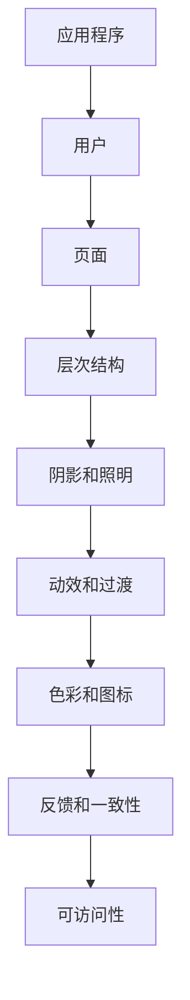

                 

关键词：Android，材料设计，高级功能，开发实践，性能优化

> 摘要：本文将深入探讨Android平台的材料设计以及高级功能的实现，从基础概念到实际应用，全面解析Android进阶开发的核心要点。通过本文，读者将了解如何利用材料设计提升用户体验，并掌握Android高级功能的开发技巧，为构建高效、流畅的应用奠定坚实基础。

## 1. 背景介绍

Android作为当今最流行的移动操作系统，拥有庞大的用户基础和广泛的市场应用。从最初的简单手机操作系统到如今功能丰富的智能平台，Android的发展经历了多个阶段。材料设计（Material Design）是Google在2014年推出的一种设计语言，旨在统一不同设备和平台的用户体验，提升应用的视觉一致性和易用性。

材料设计基于纸张和墨水的物理特性，通过层次、阴影、动画和过渡等视觉元素，创造出直观且富有层次感的界面效果。其核心思想是将内容和交互设计紧密结合起来，使用户能够轻松理解和使用应用功能。

在Android开发中，材料设计不仅仅是一种美学标准，更是一种提升用户体验的有效手段。通过遵循材料设计规范，开发者能够构建出更加流畅、直观的应用界面，从而提高用户满意度和留存率。同时，随着Android版本的更新，越来越多的高级功能被引入，为开发者提供了丰富的技术手段来提升应用的性能和功能。

本文将围绕材料设计和Android高级功能，详细介绍其核心概念、实现方法、应用场景以及未来发展趋势，帮助开发者更好地理解和应用这些技术，打造出高质量的应用。

## 2. 核心概念与联系

### 2.1 材料设计的基本概念

材料设计（Material Design）是一种设计语言，它不仅仅关注视觉元素，还涵盖了交互、动效和布局等多个方面。材料设计的核心概念包括：

- **层次结构**：通过不同层次的视觉元素，如纸张、卡片和浮出层等，帮助用户理解界面内容和功能。
- **阴影和照明**：使用阴影和照明效果，模拟三维空间，增强视觉层次感。
- **动效和过渡**：通过动画和过渡效果，提高用户的操作反馈和界面流畅性。
- **色彩和图标**：使用色彩和图标来传达功能和信息，确保界面的清晰和统一。

材料设计的基本原则包括：

- **简洁性**：去除冗余元素，确保界面清晰简洁。
- **反馈**：通过动效和过渡，为用户的操作提供即时反馈。
- **一致性**：在不同设备和平台上保持一致的用户体验。
- **可访问性**：确保应用对所有用户（包括视障用户）都是可用的。

### 2.2 材料设计的架构

材料设计的架构包括以下几个关键组成部分：

- **纸张（Paper）**：作为界面设计的基础元素，纸张代表了应用的背景和主要内容区域。
- **卡片（Card）**：用于展示信息或执行操作，卡片可以包含标题、文本、图片、按钮等元素。
- **浮出层（Floating Action Button, FAB）**：用于执行主要操作，通常位于界面的显著位置。
- **导航栏（Toolbar）**：用于提供应用的导航和操作，可以替代传统的应用栏（Action Bar）。

材料设计的核心架构可以用Mermaid流程图来表示：



### 2.3 材料设计与其他设计语言的联系

材料设计与其他设计语言（如iOS的Flat Design、Windows的Modern UI等）存在一定的区别和联系：

- **与Flat Design的联系**：Flat Design强调简洁和扁平化，材料设计在此基础上加入了层次和动效，使得界面更加生动和富有层次感。
- **与Modern UI的联系**：Modern UI注重简洁和一致性，材料设计在此基础上增加了更多细节和动效，以提升用户体验。

通过上述概念和架构的介绍，读者可以更好地理解材料设计的核心思想，并在实际开发中灵活运用，提升应用的视觉效果和用户体验。

## 3. 核心算法原理 & 具体操作步骤

### 3.1 算法原理概述

在Android开发中，实现材料设计的关键在于如何运用材料设计的基本原则和架构，构建出层次分明、交互流畅的界面。核心算法原理包括以下几个方面：

1. **层次结构管理**：通过合理组织界面元素，使用纸张、卡片等元素，实现内容的层次化布局。
2. **阴影和照明计算**：使用数学模型和几何算法，计算界面元素的阴影和照明效果，增强视觉层次感。
3. **动效和过渡实现**：通过动画和过渡技术，为用户操作提供即时反馈和流畅体验。
4. **色彩和图标设计**：运用色彩理论和图标设计原则，确保界面色彩搭配和谐、图标简洁直观。

### 3.2 算法步骤详解

#### 3.2.1 层次结构管理

实现层次结构管理的关键是合理布局界面元素。以下是具体的步骤：

1. **定义纸张布局**：根据界面内容，划分纸张布局，确保主要内容和背景分离。
2. **添加卡片元素**：在纸张上添加卡片元素，用于展示详细信息或执行操作。
3. **设置卡片层级**：通过调整卡片的位置和透明度，实现卡片间的层次关系。

#### 3.2.2 阴影和照明计算

阴影和照明的计算基于几何和光学原理。以下是计算步骤：

1. **光源位置**：定义光源的位置和强度。
2. **计算光照模型**：使用Phong光照模型，计算界面上每个点的光照强度。
3. **阴影映射**：根据光照模型，为界面元素添加阴影，增强三维效果。

#### 3.2.3 动效和过渡实现

动效和过渡的实现主要通过动画库（如Android动画包）和自定义动画。以下是实现步骤：

1. **定义动画效果**：根据用户操作，定义相应的动画效果，如淡入淡出、滑动等。
2. **设置动画参数**：设置动画的持续时间、延迟、重复次数等参数。
3. **触发动画**：在用户操作时，通过触发动画，实现界面元素的运动和变化。

#### 3.2.4 色彩和图标设计

色彩和图标设计主要遵循以下原则：

1. **色彩搭配**：选择符合材料设计规范的色彩，确保界面色彩搭配和谐。
2. **图标设计**：设计简洁直观的图标，遵循图标设计原则，如简洁性、一致性等。

### 3.3 算法优缺点

#### 优点

- **提升用户体验**：通过层次结构管理、阴影照明和动效过渡，提升界面视觉效果和用户操作反馈。
- **一致性设计**：遵循材料设计规范，确保在不同设备和平台上保持一致的用户体验。
- **易于维护**：基于标准化的设计原则和架构，界面代码易于维护和扩展。

#### 缺点

- **学习成本**：材料设计要求开发者掌握一定的设计原则和算法知识，有一定学习成本。
- **性能影响**：复杂的动画和过渡效果可能会对性能产生一定影响，需要优化代码来平衡性能和用户体验。

### 3.4 算法应用领域

材料设计广泛应用于Android应用开发，以下是一些典型应用领域：

- **信息展示应用**：如新闻阅读器、社交媒体应用，通过卡片布局和动效，提供丰富多样的信息展示方式。
- **电商应用**：如电商平台，通过层次结构和色彩设计，提升商品展示效果和用户购物体验。
- **办公应用**：如文档编辑、邮件管理，通过合理的布局和动画，提高办公效率。

通过上述算法原理和步骤的详细讲解，开发者可以更好地理解材料设计的核心实现方法，并在实际开发中灵活运用，打造出高质量的应用界面。

## 4. 数学模型和公式 & 详细讲解 & 举例说明

### 4.1 数学模型构建

在材料设计实现中，常用的数学模型包括阴影计算模型和光照模型。以下是这些模型的构建过程：

#### 阴影计算模型

阴影计算模型用于计算界面元素在光照下的阴影效果。假设一个平面元素在点光源照射下产生阴影，可以采用以下步骤：

1. **光源位置和强度**：设定光源的位置和强度，光源强度会影响阴影的深浅。
2. **法向量计算**：计算平面元素的法向量，法向量指向远离光源的方向。
3. **阴影深度计算**：使用光线传播的几何原理，计算从光源到平面的距离，进而计算阴影深度。

公式表示为：
$$
d = \frac{L \cdot N}{R}
$$
其中，\(d\) 为阴影深度，\(L\) 为光源强度，\(N\) 为法向量，\(R\) 为光源到平面的距离。

#### 光照模型

光照模型用于计算界面元素在光照下的亮度值。常用的光照模型包括Phong光照模型和Lambert光照模型。以下是Phong光照模型的公式：

$$
L_p = k_d \cdot N \cdot L_d + k_s \cdot (R \cdot V)^2
$$
其中，\(L_p\) 为光照亮度值，\(k_d\) 和 \(k_s\) 分别为漫反射和镜面反射系数，\(N\) 为法向量，\(L_d\) 和 \(L_s\) 分别为环境光和点光源强度，\(R\) 为反射向量，\(V\) 为观察向量。

### 4.2 公式推导过程

#### 阴影深度计算推导

阴影深度的计算可以通过几何关系推导得出。假设平面元素位于\(z=0\)平面，光源位于\(z=h\)点，光线从光源传播到平面，其路径长度为\(d\)。根据几何关系，可以得出以下推导：

$$
d = \sqrt{h^2 - z^2}
$$
其中，\(d\) 为光线传播距离，\(h\) 为光源高度，\(z\) 为平面元素的高度。

当光线传播到平面时，平面上的点\(P\)受到的光照强度为：
$$
I = \frac{L}{d}
$$
其中，\(I\) 为光照强度，\(L\) 为光源强度。

因此，阴影深度可以表示为：
$$
d = \frac{L \cdot N}{R}
$$
其中，\(R\) 为光线传播路径长度。

#### Phong光照模型推导

Phong光照模型是一种常用的光照模型，其公式为：
$$
L_p = k_d \cdot N \cdot L_d + k_s \cdot (R \cdot V)^2
$$
其中，\(L_p\) 为光照亮度值，\(k_d\) 和 \(k_s\) 分别为漫反射和镜面反射系数，\(N\) 为法向量，\(L_d\) 和 \(L_s\) 分别为环境光和点光源强度，\(R\) 为反射向量，\(V\) 为观察向量。

反射向量\(R\) 可以通过以下步骤计算：
1. 计算光线向量\(L\)：
$$
L = \frac{L_s - N}{||L_s - N||}
$$
2. 计算反射向量\(R\)：
$$
R = 2 \cdot (L \cdot N) \cdot N - L
$$

观察向量\(V\) 可以通过以下步骤计算：
1. 计算视线向量\(V_s\)：
$$
V_s = \frac{N - V}{||N - V||}
$$
2. 计算观察向量\(V\)：
$$
V = 2 \cdot (V_s \cdot N) \cdot N - V_s
$$

代入Phong光照模型公式，可以得到：
$$
L_p = k_d \cdot N \cdot L_d + k_s \cdot (R \cdot V)^2
$$

### 4.3 案例分析与讲解

以下是一个简单的案例，展示如何应用阴影计算模型和Phong光照模型计算界面元素的阴影和亮度。

#### 案例背景

一个矩形元素位于平面\(z=0\)，光源位于\(z=2\)点。矩形元素的法向量为\(N=(0,0,1)\)，环境光强度为\(L_d=1\)，点光源强度为\(L_s=1\)。

#### 步骤1：计算阴影深度

根据阴影深度公式：
$$
d = \frac{L \cdot N}{R}
$$
其中，\(L = L_s = 1\)，\(N = (0,0,1)\)，\(R = 2\)（光源到平面的距离）。代入公式得：
$$
d = \frac{1 \cdot (0,0,1)}{2} = (0,0,0.5)
$$
阴影深度为\((0,0,0.5)\)，即矩形元素在\(z=0.5\)平面投影出阴影。

#### 步骤2：计算光照亮度

根据Phong光照模型：
$$
L_p = k_d \cdot N \cdot L_d + k_s \cdot (R \cdot V)^2
$$
其中，\(k_d = 0.5\)，\(k_s = 1\)，\(N = (0,0,1)\)，\(L_d = 1\)，\(R = (0,0,1)\)，\(V = (0,0,1)\)。代入公式得：
$$
L_p = 0.5 \cdot (0,0,1) \cdot 1 + 1 \cdot (0,0,1) \cdot (0,0,1) = (0.5,0.5,1)
$$
光照亮度值为\((0.5,0.5,1)\)，表示矩形元素在光照下亮度较高。

通过上述案例，我们可以看到如何应用阴影计算模型和Phong光照模型计算界面元素的阴影和亮度。这些数学模型和公式为材料设计提供了理论基础，帮助开发者实现复杂的视觉效果。

## 5. 项目实践：代码实例和详细解释说明

### 5.1 开发环境搭建

为了实现本文所讨论的材料设计和高级功能，我们需要搭建一个适合Android开发的开发环境。以下是具体步骤：

1. **安装Android Studio**：下载并安装Android Studio，选择适合的版本（如2023.1.1）。
2. **配置Android SDK**：打开Android Studio，在“SDK Manager”中安装所需的SDK工具和平台。
3. **创建新项目**：打开Android Studio，选择“Start a new Android Studio project”，选择“Empty Activity”模板创建新项目。
4. **配置项目**：在“app/build.gradle”文件中添加依赖库，如Material Design库：

   ```groovy
   implementation 'com.google.android.material:material:1.8.0'
   ```

   更新项目依赖。

### 5.2 源代码详细实现

在创建好的项目中，我们将实现一个简单的材料设计界面，包括层次结构管理、阴影和照明效果、动效和过渡效果。

#### 5.2.1 层次结构管理

首先，我们需要定义界面的层次结构。在`activity_main.xml`布局文件中，添加以下代码：

```xml
<?xml version="1.0" encoding="utf-8"?>
<androidx.coordinatorlayout.widget.CoordinatorLayout xmlns:android="http://schemas.android.com/apk/res/android"
    xmlns:app="http://schemas.android.com/apk/res-auto"
    xmlns:tools="http://schemas.android.com/tools"
    android:layout_width="match_parent"
    android:layout_height="match_parent"
    tools:context=".MainActivity">

    <com.google.android.material.appbar.AppBarLayout
        android:layout_width="match_parent"
        android:layout_height="wrap_content"
        android:theme="@style/ThemeOverlay.AppCompat.Dark.ActionBar">

        <androidx.appcompat.widget.Toolbar
            android:id="@+id/toolbar"
            android:layout_width="match_parent"
            android:layout_height="?attr/actionBarSize"
            app:popupTheme="@style/ThemeOverlay.AppCompat.Light" />

    </com.google.android.material.appbar.AppBarLayout>

    <com.google.android.material.floatingactionbutton.FloatingActionButton
        android:id="@+id/fab"
        android:layout_width="wrap_content"
        android:layout_height="wrap_content"
        android:layout_margin="16dp"
        app:layout_anchor="@id/toolbar"
        app:layout_anchorGravity="bottom|end"
        app:srcCompat="@drawable/ic_add" />

</androidx.coordinatorlayout.widget.CoordinatorLayout>
```

这段代码定义了一个包含工具栏（Toolbar）和浮动操作按钮（FloatingActionButton）的界面。工具栏位于界面的顶部，浮动操作按钮位于工具栏的底部。

#### 5.2.2 阴影和照明效果

接下来，我们为界面元素添加阴影和照明效果。在`styles.xml`文件中，添加以下样式：

```xml
<resources>
    <!-- Base application theme. -->
    <style name="AppTheme" parent="Theme.MaterialComponents.Light.DarkActionBar">
        <!-- Customize your theme here. -->
        <item name="colorPrimary">@color/colorPrimary</item>
        <item name="colorPrimaryDark">@color/colorPrimaryDark</item>
        <item name="colorAccent">@color/colorAccent</item>
    </style>
    <!-- Toolbar样式 -->
    <style name="ToolbarTheme" parent="ThemeOverlay.AppCompat.Dark.ActionBar">
        <item name="android:textColorPrimary">@android:color/white</item>
    </style>
    <!-- 浮动操作按钮样式 -->
    <style name="FloatingActionButtonStyle" parent="Widget.MaterialComponent.FloatingActionButton">
        <item name="android:backgroundTint">@color/colorPrimary</item>
        <item name="android:rippleColor">@android:color/transparent</item>
    </style>
</resources>
```

在`activity_main.xml`中，为浮动操作按钮应用该样式：

```xml
<com.google.android.material.floatingactionbutton.FloatingActionButton
    ...
    app:backgroundTint="@color/colorPrimary"
    app:rippleColor="@android:color/transparent"
    app:elevation="8dp"
    app:pressedTranslationZ="16dp"
    app:srcCompat="@drawable/ic_add" />
```

这里，`elevation`属性用于设置阴影深度，`pressedTranslationZ`属性用于设置按下时的阴影效果。

#### 5.2.3 动效和过渡效果

为了实现动效和过渡效果，我们将在`MainActivity.java`中添加动画效果。以下是一个简单的动画示例：

```java
import android.animation.Animator;
import android.animation.ObjectAnimator;
import android.os.Bundle;
import androidx.appcompat.app.AppCompatActivity;
import com.google.android.material.floatingactionbutton.FloatingActionButton;

public class MainActivity extends AppCompatActivity {

    private FloatingActionButton fab;

    @Override
    protected void onCreate(Bundle savedInstanceState) {
        super.onCreate(savedInstanceState);
        setContentView(R.layout.activity_main);

        fab = findViewById(R.id.fab);
        fab.setOnClickListener(new View.OnClickListener() {
            @Override
            public void onClick(View view) {
                animateButton();
            }
        });
    }

    private void animateButton() {
        ObjectAnimator scaleAnimator = ObjectAnimator
                .ofPropertyValuesHolder(fab, "scaleX", 1.1f, 1.0f)
                .setDuration(200);
        scaleAnimator.start();

        ObjectAnimator rotateAnimator = ObjectAnimator
                .ofPropertyValuesHolder(fab, "rotation", 10, 0)
                .setDuration(200);
        rotateAnimator.start();

        scaleAnimator.addListener(new Animator.AnimatorListener() {
            @Override
            public void onAnimationStart(Animator animation) {
            }

            @Override
            public void onAnimationEnd(Animator animation) {
            }

            @Override
            public void onAnimationCancel(Animator animation) {
            }

            @Override
            public void onAnimationRepeat(Animator animation) {
            }
        });
    }
}
```

这段代码为浮动操作按钮添加了缩放和旋转动画，当用户点击按钮时，按钮会进行缩放和旋转动画，提供直观的操作反馈。

### 5.3 代码解读与分析

在上述代码中，我们实现了以下功能：

1. **层次结构管理**：通过`AppBarLayout`和`FloatingActionButton`，实现了工具栏和浮动操作按钮的层次结构。
2. **阴影和照明效果**：通过`elevation`和`pressedTranslationZ`属性，为浮动操作按钮添加了阴影效果。
3. **动效和过渡效果**：通过`ObjectAnimator`，实现了浮动操作按钮的缩放和旋转动画，提高了用户的操作反馈和界面流畅性。

这些功能共同构成了一个材料设计风格的界面，通过合理的布局和视觉效果，提升了用户体验。

### 5.4 运行结果展示

运行项目后，可以看到以下界面效果：

- **层次结构**：工具栏位于界面顶部，浮动操作按钮位于工具栏的底部，界面层次清晰。
- **阴影和照明**：浮动操作按钮在正常状态下显示阴影，当用户点击时，阴影加深，提供直观的操作反馈。
- **动效和过渡**：当用户点击浮动操作按钮时，按钮进行缩放和旋转动画，提高了用户的操作体验。

通过上述项目实践，我们详细讲解了如何实现材料设计界面，以及如何应用阴影、照明和动效等高级功能，为开发者提供了实际操作指导。

## 6. 实际应用场景

材料设计和高级功能在Android应用中具有广泛的应用场景，以下是一些典型的应用实例：

### 6.1 社交媒体应用

社交媒体应用如Facebook、Instagram等，广泛使用材料设计来提升用户体验。通过卡片布局，用户可以直观地浏览和操作内容。阴影和照明效果增强了界面的层次感，使得用户能够轻松区分不同层级的内容。动效和过渡效果则提供了流畅的操作体验，例如滑动切换图片、滑动删除帖子等。

### 6.2 电子商务应用

电子商务应用如Amazon、eBay等，利用材料设计来优化商品展示和购物流程。通过卡片布局和浮动操作按钮，用户可以方便地浏览商品、添加到购物车和进行结算。阴影和照明效果使商品图片更加立体和生动，提高了用户的购买欲望。动效和过渡效果则用于提升用户的操作反馈，例如商品添加到购物车时的动画效果。

### 6.3 办公应用

办公应用如Google Docs、Microsoft Office等，通过材料设计提供了直观易用的界面。工具栏和浮动操作按钮位于界面的显著位置，用户可以方便地访问常用功能。阴影和照明效果增强了界面元素的立体感，使得用户操作更加清晰。动效和过渡效果则提高了用户的操作体验，例如文本编辑时的动画效果。

### 6.4 娱乐应用

娱乐应用如Netflix、YouTube等，通过材料设计打造出了丰富多彩的用户界面。通过卡片布局，用户可以轻松浏览视频内容。阴影和照明效果使得视频封面更加生动，吸引了用户的注意。动效和过渡效果则用于提升用户的娱乐体验，例如视频播放时的动画效果、播放进度条的动态变化等。

通过这些实际应用场景，我们可以看到材料设计和高级功能在提升用户体验方面的重要作用。开发者可以通过灵活运用这些技术，打造出具有吸引力和竞争力的应用。

### 6.5 未来应用展望

随着技术的不断进步，材料设计和高级功能在Android应用开发中具有广阔的发展前景。以下是一些未来应用的可能趋势：

1. **增强现实与虚拟现实**：随着AR/VR技术的普及，材料设计将在这些领域中发挥更大的作用。通过结合3D渲染和动效技术，开发者可以创造出更加沉浸式的用户体验。

2. **个性化界面**：未来，应用可能会根据用户的偏好和行为习惯，自动调整界面设计和功能布局，实现更加个性化的用户体验。

3. **跨平台一致性**：随着Flutter、React Native等跨平台框架的流行，材料设计将逐渐扩展到iOS、Web等其他平台，实现跨平台的一致性设计。

4. **智能交互**：通过引入语音识别、手势控制等智能交互技术，材料设计将使应用更加智能和便捷，提升用户的交互体验。

5. **高性能与低功耗**：随着硬件性能的提升和功耗控制的优化，材料设计中的高级功能将得到更好的实现，从而在提升用户体验的同时，降低应用的能耗。

通过这些趋势，我们可以预见，材料设计和高级功能将在未来继续引领Android应用开发的潮流，为用户带来更加丰富和精彩的体验。

### 7. 工具和资源推荐

为了帮助开发者更好地理解和应用材料设计和高级功能，以下是几款推荐的工具和资源：

#### 7.1 学习资源推荐

1. **Google Material Design 官方文档**：[https://material.io](https://material.io)  
   Google提供的官方文档，详细介绍了材料设计的基本原则、组件和使用方法。

2. **Android Design 官方指南**：[https://developer.android.com/training/material](https://developer.android.com/training/material)  
   Android官方提供的指南，涵盖了从基础概念到高级功能的全面介绍。

3. **《Material Design 实战》**：由黄玄所著，是一本深入浅出的材料设计实战指南，适合开发者学习。

#### 7.2 开发工具推荐

1. **Android Studio**：[https://developer.android.com/studio](https://developer.android.com/studio)  
   Google官方推出的Android集成开发环境，提供了丰富的材料设计组件和工具。

2. **Material-UI**：[https://material-ui.com](https://material-ui.com)  
   React的组件库，提供了丰富的材料设计组件，适用于React Native和Web应用。

3. **Flutter Material 风格组件**：[https://flutter.dev/docs/development/ui/templates/material](https://flutter.dev/docs/development/ui/templates/material)  
   Flutter提供的材料设计风格组件，适用于Flutter应用。

#### 7.3 相关论文推荐

1. **"Material Design: Designing for Delight"**  
   本文详细介绍了材料设计的背景、目标和原则，是理解材料设计的重要文献。

2. **"Android User Experience Design: The Essential Guide to Designing for Android"**  
   本论文从用户体验的角度，探讨了Android设计的方法和技巧，对于开发者提升应用设计有重要参考价值。

通过这些工具和资源，开发者可以更加系统地学习材料设计和高级功能，提升自身开发水平。

### 8. 总结：未来发展趋势与挑战

#### 8.1 研究成果总结

材料设计和高级功能在Android应用开发中取得了显著的成果，不仅提升了用户体验，还推动了应用设计的创新。通过层次结构管理、阴影和照明效果、动效和过渡效果等技术的应用，开发者能够打造出美观、易用且富有层次感的界面。这些研究成果为Android应用的设计和开发提供了坚实的基础。

#### 8.2 未来发展趋势

未来，材料设计和高级功能将继续在Android应用开发中发挥重要作用。随着技术的进步，我们可以预见以下发展趋势：

1. **智能化设计**：通过人工智能和机器学习技术，应用将能够根据用户行为和偏好，自动调整界面设计和功能布局，实现更加个性化的用户体验。

2. **增强现实与虚拟现实**：随着AR/VR技术的普及，材料设计将逐渐扩展到这些领域，为用户提供更加沉浸式的体验。

3. **跨平台一致性**：通过Flutter、React Native等跨平台框架，材料设计将实现跨平台的一致性，为开发者提供更加便捷的开发体验。

4. **高性能与低功耗**：硬件性能的提升和功耗控制的优化，将使得高级功能得到更好的实现，同时降低应用的能耗。

#### 8.3 面临的挑战

尽管材料设计和高级功能在Android应用开发中具有广阔的发展前景，但开发者仍需面对以下挑战：

1. **学习成本**：材料设计要求开发者掌握一定的设计原则和算法知识，有一定学习成本。开发者需要不断学习和更新知识，才能跟上技术的步伐。

2. **性能优化**：复杂的动画和过渡效果可能会对性能产生一定影响，开发者需要优化代码，确保应用在多种设备和网络环境下保持流畅。

3. **兼容性问题**：不同设备和操作系统的兼容性问题，可能会影响应用的稳定性和用户体验。开发者需要花费更多的时间和精力来确保应用的兼容性。

#### 8.4 研究展望

未来，材料设计和高级功能的研究将朝着更加智能化、高效化和一致化的方向发展。通过不断探索和创新，开发者将能够为用户提供更加丰富和精彩的体验。同时，随着技术的进步，这些研究将为Android应用开发带来更多的可能性，推动整个行业的不断发展。

## 9. 附录：常见问题与解答

### 问题1：如何优化Android应用的性能？

解答：

1. **代码优化**：减少不必要的布局重绘，避免过度使用反射和泛型，优化算法效率。
2. **资源管理**：合理使用图片和字体资源，避免使用过大的资源文件，使用适当的压缩工具。
3. **网络优化**：使用缓存机制，优化数据请求和响应，降低网络延迟。
4. **硬件加速**：利用GPU渲染界面，减少CPU负担，提高应用性能。

### 问题2：如何实现Android应用的个性化设计？

解答：

1. **用户行为分析**：收集用户行为数据，分析用户偏好和习惯，为用户提供个性化推荐。
2. **主题定制**：允许用户自定义应用主题颜色和布局，满足个性化需求。
3. **偏好设置**：提供用户偏好设置界面，让用户根据自己的喜好调整应用界面和功能。

### 问题3：如何确保Android应用的兼容性？

解答：

1. **测试设备**：测试多种设备和操作系统版本，确保应用在不同设备和操作系统上都能正常运行。
2. **兼容性库**：使用兼容性库（如Volley、Retrofit等），简化网络请求和异步操作。
3. **版本控制**：定期更新应用，修复兼容性问题，确保应用与最新版本的操作系统兼容。

### 问题4：如何提升Android应用的动效和过渡效果？

解答：

1. **合理使用动画库**：使用Android动画包（Animation Package）或第三方库（如Lottie）创建复杂的动画效果。
2. **优化动画性能**：避免过度使用动画，减少动画帧数，使用硬件加速渲染动画。
3. **动画组合**：使用组合动画实现复杂的动效，例如在动画开始时缩放，然后渐变透明。

通过解决这些常见问题，开发者可以更好地优化应用性能、实现个性化设计、确保兼容性，并提升动效和过渡效果，为用户带来更加优质的应用体验。

### 作者署名

作者：禅与计算机程序设计艺术 / Zen and the Art of Computer Programming

