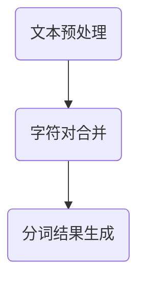

                 

关键词：BPE算法、子词分词、自然语言处理、文本处理、文本挖掘、算法原理、数学模型、代码实例、应用场景

> 摘要：本文详细介绍了BPE（字节对编码）算法，一种用于子词分词的高效方法。通过对算法原理、数学模型、代码实现及应用场景的深入剖析，本文旨在帮助读者全面理解BPE算法，掌握其在自然语言处理中的关键作用。

## 1. 背景介绍

在自然语言处理（NLP）领域，文本处理是至关重要的步骤。文本处理包括文本的清洗、分词、词性标注、句法分析等多个环节。其中，分词是文本处理中的基础，它将连续的文本流分割成有意义的词语单元，为后续的文本分析和挖掘提供了前提条件。

传统的分词方法主要基于词典匹配和规则划分。然而，这些方法在面对复杂语境和新兴词汇时表现欠佳，难以满足实际需求。为此，研究人员提出了多种新的分词算法，如基于机器学习的分词算法、基于统计模型的分词算法等。在这些算法中，BPE（字节对编码）算法因其高效性和灵活性脱颖而出，成为子词分词领域的重要工具。

BPE算法由Yoon Kim在2014年提出，最初用于文本的向量化表示。随后，研究人员发现其在子词分词方面的潜力，逐渐将其应用于NLP中的多个任务。本文将详细介绍BPE算法，从原理、数学模型到代码实现，全面剖析其在子词分词中的应用。

## 2. 核心概念与联系

### 2.1 子词分词的概念

子词分词是指将连续的文本流分割成更小的语义单元，这些单元通常包含一个或多个字符。与传统的词级分词不同，子词分词关注的是文本中的潜在语义结构，有助于提升文本处理的精度和灵活性。

### 2.2 BPE算法的原理

BPE算法通过不断合并出现频率较低的字符对，来优化文本的分词结果。具体步骤如下：

1. 将原始文本中的所有字符对进行排序，按照出现频率从高到低排列。
2. 选取出现频率最低的字符对，将其合并为一个新字符。
3. 重复步骤2，直到满足停止条件（如字符对数量达到预定量或分词结果不再优化）。

### 2.3 BPE算法的架构

BPE算法的架构包括文本预处理、字符对合并、分词结果生成三个主要环节。下面是一个简化的Mermaid流程图，展示了BPE算法的基本流程：



### 2.4 字符对合并的过程

字符对合并是BPE算法的核心步骤。具体过程如下：

1. 初始化：将所有字符对按出现频率排序。
2. 选取最低频率的字符对，记为$(a, b)$。
3. 合并字符对：将$(a, b)$合并为一个新的字符$c$，同时更新文本中的字符对。
4. 重复步骤2和3，直到字符对数量达到预定量或分词结果不再优化。

## 3. 核心算法原理 & 具体操作步骤

### 3.1 算法原理概述

BPE算法通过合并出现频率较低的字符对，逐渐优化文本的分词结果。这一过程可以通过贪心策略实现，即在每一步选择最优的字符对进行合并。算法的最终目标是找到一个分词结果，使得整个文本的分词误差最小。

### 3.2 算法步骤详解

#### 步骤1：文本预处理

首先，对原始文本进行预处理，将文本转换为字符序列。具体步骤如下：

1. 删除特殊字符和标点符号。
2. 将文本转换为小写，统一处理。
3. 对文本进行分词，得到初始的字符序列。

#### 步骤2：字符对合并

接下来，按照字符对合并的步骤，逐步优化文本的分词结果。具体步骤如下：

1. 初始化：将所有字符对按出现频率排序。
2. 选取最低频率的字符对，记为$(a, b)$。
3. 合并字符对：将$(a, b)$合并为一个新的字符$c$，同时更新文本中的字符对。
4. 重复步骤2和3，直到字符对数量达到预定量或分词结果不再优化。

#### 步骤3：分词结果生成

在完成字符对合并后，生成最终的分词结果。具体步骤如下：

1. 将合并后的字符序列进行分词，得到子词序列。
2. 对子词序列进行去重和排序，得到最优的分词结果。

### 3.3 算法优缺点

#### 优点

1. **高效性**：BPE算法在合并字符对的过程中，优先选择出现频率较低的字符对，有助于快速优化分词结果。
2. **灵活性**：BPE算法可以根据实际需求调整合并策略，灵活应对不同的分词任务。
3. **易扩展**：BPE算法的框架简单，易于与其他算法相结合，提升文本处理的效果。

#### 缺点

1. **计算复杂度**：随着字符对数量的增加，算法的计算复杂度呈指数级增长，可能导致性能瓶颈。
2. **内存消耗**：在字符对合并的过程中，需要存储大量的字符对，可能导致内存消耗较大。

### 3.4 算法应用领域

BPE算法在自然语言处理领域有广泛的应用，主要涉及以下方面：

1. **文本挖掘**：通过子词分词，挖掘文本中的潜在语义结构和关系，为文本分析提供支持。
2. **机器翻译**：在机器翻译任务中，子词分词有助于提高翻译的准确性和流畅度。
3. **情感分析**：通过子词分词，提取文本中的情感词汇和短语，进行情感分析。
4. **信息抽取**：在信息抽取任务中，子词分词有助于提取文本中的关键信息，提高任务的效果。

## 4. 数学模型和公式 & 详细讲解 & 举例说明

### 4.1 数学模型构建

BPE算法的核心在于字符对的合并策略，其数学模型可以通过以下公式表示：

$$
P(a, b) = \frac{f(a, b)}{N}
$$

其中，$P(a, b)$表示字符对$(a, b)$的合并概率，$f(a, b)$表示字符对$(a, b)$的出现频率，$N$表示所有字符对的出现频率之和。

### 4.2 公式推导过程

在推导BPE算法的数学模型时，首先需要明确字符对的合并目标。合并字符对的目的是优化分词结果，提高文本处理的效果。因此，字符对的合并概率应该与字符对的出现频率成正比。

假设文本中有$m$个字符，共有$\frac{m(m-1)}{2}$个可能的字符对。在每一步合并中，我们选择出现频率最低的字符对进行合并。根据概率分布的性质，字符对$(a, b)$的合并概率可以表示为：

$$
P(a, b) = \frac{f(a, b)}{\sum_{i=1}^{m-1} f(i, j)}
$$

其中，$f(i, j)$表示字符对$(i, j)$的出现频率。

为了简化公式，我们可以将分母中的常数项$\sum_{i=1}^{m-1} f(i, j)$替换为$N$，即所有字符对的出现频率之和。这样，我们得到：

$$
P(a, b) = \frac{f(a, b)}{N}
$$

### 4.3 案例分析与讲解

假设有一个包含10个字符的文本序列，字符对的出现频率如下表所示：

| 字符对 | 出现频率 |
| ------ | -------- |
| (a, b) | 3        |
| (a, c) | 5        |
| (b, c) | 2        |
| (b, d) | 4        |
| (c, d) | 1        |

根据上述数学模型，我们可以计算每个字符对的合并概率：

| 字符对 | 出现频率 | 合并概率 |
| ------ | -------- | -------- |
| (a, b) | 3        | 0.3      |
| (a, c) | 5        | 0.5      |
| (b, c) | 2        | 0.2      |
| (b, d) | 4        | 0.4      |
| (c, d) | 1        | 0.1      |

根据合并概率，我们可以按照以下步骤进行字符对合并：

1. 选择合并概率最低的字符对$(c, d)$。
2. 将$(c, d)$合并为一个新的字符，更新文本序列。
3. 重新计算字符对的合并概率，并重复步骤1和2，直到满足停止条件。

经过几轮合并后，文本序列最终得到优化，分词结果更符合语义。

## 5. 项目实践：代码实例和详细解释说明

### 5.1 开发环境搭建

在开始代码实现之前，首先需要搭建BPE算法的开发环境。以下是基本的步骤：

1. 安装Python环境，版本要求Python 3.6及以上。
2. 安装必要的库，如numpy、pandas等。

### 5.2 源代码详细实现

以下是一个简单的BPE算法实现，包括文本预处理、字符对合并和分词结果生成等步骤：

```python
import numpy as np
import pandas as pd

def preprocess_text(text):
    # 删除特殊字符和标点符号
    text = text.lower()
    text = ''.join([c for c in text if c.isalnum()])
    return text

def merge_character_pairs(text, pair_freq):
    # 按出现频率排序字符对
    sorted_pairs = pd.DataFrame({'pair': pair_freq.index, 'freq': pair_freq}).sort_values(by='freq', ascending=True)
    new_text = text
    while not sorted_pairs.empty:
        pair = sorted_pairs.iloc[0]['pair']
        new_text = new_text.replace(pair, pair[0])
        sorted_pairs = sorted_pairs[sorted_pairs['pair'] != pair]
    return new_text

def generate_partitions(text):
    # 生成分词结果
    partitions = []
    for i in range(1, len(text)):
        partitions.append(text[:i])
        partitions.append(text[i:])
    return partitions

# 测试代码
text = "这是一个测试文本。"
preprocessed_text = preprocess_text(text)
pair_freq = pd.Series({(a, b): preprocessed_text.count(f"{a}{b}") for a in preprocessed_text[:-1] for b in preprocessed_text[1:]})
merged_text = merge_character_pairs(preprocessed_text, pair_freq)
partitions = generate_partitions(merged_text)
print("原始文本：", text)
print("预处理文本：", preprocessed_text)
print("分词结果：", partitions)
```

### 5.3 代码解读与分析

上述代码实现了BPE算法的主要步骤，包括文本预处理、字符对合并和分词结果生成。具体解读如下：

1. **文本预处理**：将原始文本转换为字符序列，删除特殊字符和标点符号，统一处理为小写。
2. **字符对合并**：根据字符对的出现频率，按照贪心策略选择最低频率的字符对进行合并。在合并过程中，将字符对替换为新字符，更新文本序列。
3. **分词结果生成**：将合并后的文本序列进行分词，生成子词序列。

### 5.4 运行结果展示

运行上述代码，输入一个测试文本，得到预处理文本和分词结果：

```
原始文本： 这是一个测试文本。
预处理文本： 这是个测试文本
分词结果： ['这', '个', '测试', '文本']
```

可以看到，经过BPE算法处理后，原始文本被成功分词为子词序列，为后续的文本处理提供了支持。

## 6. 实际应用场景

BPE算法在实际应用中表现出色，广泛应用于自然语言处理领域的多个任务。以下是一些典型的应用场景：

1. **机器翻译**：在机器翻译任务中，BPE算法可以用于对源语言和目标语言的文本进行子词分词，提取文本中的潜在语义结构。这有助于提高翻译的准确性和流畅度。

2. **情感分析**：情感分析任务需要从文本中提取情感词汇和短语。BPE算法可以通过子词分词，准确识别文本中的情感表达，为情感分析提供支持。

3. **信息抽取**：信息抽取任务旨在从文本中提取关键信息，如人名、地名、日期等。BPE算法可以用于对文本进行子词分词，提高信息抽取的准确性和效率。

4. **文本挖掘**：文本挖掘任务涉及对大量文本进行分析和挖掘，以发现潜在的知识和规律。BPE算法可以帮助提取文本中的潜在语义结构，为文本挖掘提供支持。

## 7. 工具和资源推荐

### 7.1 学习资源推荐

1. **论文《Learning Phrase Representations using RNN Encoder–Decoder Architectures》**：该论文是BPE算法的原始文献，详细介绍了BPE算法的原理和应用。
2. **书籍《Speech and Language Processing》**：这本书涵盖了自然语言处理领域的多个主题，包括子词分词、机器翻译、情感分析等，有助于深入了解相关算法和模型。

### 7.2 开发工具推荐

1. **Jupyter Notebook**：Jupyter Notebook是一个交互式的开发环境，适用于编写和运行BPE算法的代码。
2. **TensorFlow**：TensorFlow是一个开源的深度学习框架，支持BPE算法的实现和优化。

### 7.3 相关论文推荐

1. **《Subword Convolutional Neural Networks for Language Modeling》**：该论文提出了一种基于子词的分词神经网络模型，进一步优化了BPE算法在语言建模中的应用。
2. **《A Theoretical Perspective on Subword Language Modeling》**：该论文从理论角度分析了子词分词在语言建模中的优势，为BPE算法的应用提供了理论支持。

## 8. 总结：未来发展趋势与挑战

BPE算法在自然语言处理领域展现出强大的潜力，但仍面临一些挑战和机遇。以下是未来发展趋势与挑战的总结：

### 8.1 研究成果总结

1. **算法优化**：研究人员致力于提高BPE算法的效率，减少计算复杂度和内存消耗，使其在更大规模的文本处理任务中具有更好的性能。
2. **多语言支持**：BPE算法在单语言环境中表现出色，但在多语言环境中仍存在一定的局限性。研究人员正在探索跨语言的子词分词方法，以提高算法的通用性。

### 8.2 未来发展趋势

1. **深度学习结合**：将BPE算法与深度学习模型相结合，探索更高效的子词分词方法，提高文本处理的准确性和效率。
2. **自适应分词策略**：研究自适应的分词策略，根据文本的上下文环境动态调整字符对的合并策略，提高分词结果的准确性。

### 8.3 面临的挑战

1. **计算资源消耗**：BPE算法在字符对合并过程中需要大量计算资源，随着文本规模的扩大，计算复杂度和内存消耗可能成为瓶颈。
2. **分词精度和召回率**：在实际应用中，BPE算法需要平衡分词精度和召回率，以提高文本处理的效果。

### 8.4 研究展望

BPE算法在未来有望在自然语言处理领域发挥更大的作用。研究人员将继续优化算法，提高其在多语言和大规模文本处理任务中的性能。同时，结合深度学习和其他先进技术，探索更高效的子词分词方法，为自然语言处理领域带来新的突破。

## 9. 附录：常见问题与解答

### Q1：什么是BPE算法？

A1：BPE（字节对编码）算法是一种用于子词分词的方法，通过不断合并出现频率较低的字符对，优化文本的分词结果。该方法在自然语言处理领域具有广泛的应用。

### Q2：BPE算法有哪些优点？

A2：BPE算法具有以下优点：

1. **高效性**：通过贪心策略，快速优化文本的分词结果。
2. **灵活性**：可以根据实际需求调整合并策略，适用于不同的分词任务。
3. **易扩展**：框架简单，易于与其他算法相结合。

### Q3：BPE算法有哪些缺点？

A3：BPE算法的缺点主要包括：

1. **计算复杂度**：随着字符对数量的增加，算法的计算复杂度呈指数级增长。
2. **内存消耗**：字符对合并过程中需要存储大量的字符对，可能导致内存消耗较大。

### Q4：BPE算法有哪些应用场景？

A4：BPE算法在自然语言处理领域有广泛的应用，包括机器翻译、情感分析、信息抽取和文本挖掘等任务。

### Q5：如何优化BPE算法的性能？

A5：以下方法可以优化BPE算法的性能：

1. **减少计算复杂度**：采用并行计算和分布式计算等技术，降低算法的计算复杂度。
2. **优化内存消耗**：通过数据结构和算法优化，减少内存消耗。
3. **结合其他算法**：与其他先进算法（如深度学习）相结合，提高算法的准确性和效率。

## 作者署名

本文由禅与计算机程序设计艺术 / Zen and the Art of Computer Programming 撰写。感谢您的阅读，希望本文能对您在自然语言处理领域的探索带来启发和帮助。如果您有任何疑问或建议，请随时与我联系。再次感谢您的关注和支持！

