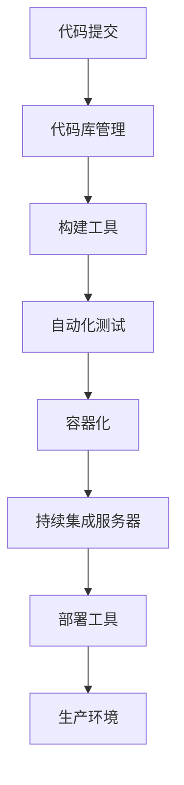

                 

### 关键词 Keywords

- 持续集成（CI）
- 持续部署（CD）
- 自动化测试
- 软件交付流程
- DevOps

### 摘要 Abstract

本文旨在深入探讨CI/CD管道在现代软件开发中的应用与价值。我们将从背景介绍、核心概念、算法原理、数学模型、项目实践、实际应用场景、未来展望等多个角度，系统地阐述如何构建一个高效的自动化软件交付流程。文章将帮助读者理解CI/CD的基本原理，掌握其实施的关键步骤，并展望其未来的发展趋势与挑战。

### 1. 背景介绍 Background

在软件开发的漫长历史中，从编写代码到最终交付给用户使用，经历了多个阶段的演变。最初，软件的开发和部署是由单一的团队或个人完成的，这种传统的瀑布模型（Waterfall Model）虽然能够确保各个阶段的有序进行，但缺乏灵活性，难以适应快速变化的需求。

随着互联网的兴起和软件开发的复杂度增加，敏捷开发（Agile Development）理念应运而生。敏捷开发强调迭代和增量式开发，通过频繁的迭代和用户的反馈，不断优化软件产品。然而，敏捷开发也需要高效的交付流程来支持，以确保每次迭代都能快速、高质量地交付给用户。

在这个背景下，持续集成（Continuous Integration，CI）和持续部署（Continuous Deployment，CD）应运而生。CI和CD是一种自动化软件交付流程，通过自动化测试、构建、部署等环节，大大提高了软件交付的速度和可靠性。

### 2. 核心概念与联系 Core Concepts and Relationships

#### 2.1 持续集成（CI）

持续集成是一种软件开发实践，旨在通过频繁地将代码合并到主干分支，以尽早发现并解决集成问题。CI的主要目标是确保代码库中的每一个提交都是可集成和可测试的，从而提高代码质量和项目的稳定性。

#### 2.2 持续部署（CD）

持续部署是持续集成的发展，它进一步扩展到自动化部署阶段。CD的目标是通过自动化部署流程，将代码从开发环境直接部署到生产环境，实现零人工干预的全自动部署。

#### 2.3 CI/CD管道

CI/CD管道是CI和CD的综合体，它通过一系列自动化工具和流程，实现从代码提交到部署的完整过程。一个典型的CI/CD管道包括以下几个关键环节：

- **代码库管理**：如Git
- **构建工具**：如Maven、Gradle
- **自动化测试**：如JUnit、Selenium
- **容器化**：如Docker
- **持续集成服务器**：如Jenkins、GitLab CI
- **部署工具**：如Kubernetes、Ansible

下面是一个CI/CD管道的Mermaid流程图：



### 3. 核心算法原理 & 具体操作步骤 Core Algorithm and Operational Steps

#### 3.1 算法原理概述

CI/CD的核心算法原理可以概括为以下几点：

- **自动化测试**：通过编写测试脚本，对每次代码提交进行自动化测试，确保代码的稳定性。
- **构建过程**：将代码打包成可执行文件或容器镜像。
- **容器化**：利用容器技术，如Docker，实现应用的隔离和可移植性。
- **部署过程**：通过自动化工具，将构建好的应用部署到不同的环境，如开发环境、测试环境、生产环境。

#### 3.2 算法步骤详解

1. **代码提交**：
   - 开发人员将代码提交到代码库（如Git）。
   - 持续集成服务器（如Jenkins）检测到代码提交，触发构建流程。

2. **构建过程**：
   - 持续集成服务器从代码库获取代码，并运行构建工具（如Maven）进行编译和打包。
   - 构建过程中，会执行一系列自动化测试，确保代码质量。

3. **容器化**：
   - 将构建好的应用程序打包成Docker容器镜像。
   - 容器镜像存储在容器注册中心（如Docker Hub）。

4. **自动化测试**：
   - 运行自动化测试脚本，对容器镜像进行测试，确保应用的正常运行。

5. **部署过程**：
   - 将通过测试的容器镜像部署到开发环境、测试环境或生产环境。
   - 部署过程中，可以使用Kubernetes等容器编排工具，实现自动化部署和扩展。

#### 3.3 算法优缺点

**优点**：

- 提高开发效率：通过自动化测试和部署，减少手动操作，提高开发速度。
- 提高代码质量：自动化测试能够及早发现并解决集成问题，提高代码质量。
- 灵活和可扩展：CI/CD管道可以根据项目需求灵活配置，支持大规模应用。

**缺点**：

- 需要投入时间和资源进行配置和维护。
- 需要一定的技术基础，如编程、自动化测试、容器化等。

#### 3.4 算法应用领域

CI/CD管道在以下领域有广泛应用：

- Web应用开发
- 移动应用开发
- 游戏开发
- 大数据分析

### 4. 数学模型和公式 & 详细讲解 & 举例说明 Mathematical Model and Detailed Explanation with Case Study

#### 4.1 数学模型构建

CI/CD管道中的数学模型可以用来计算代码提交次数、测试覆盖率、部署频率等指标。以下是一个简单的数学模型：

- **代码提交次数**（$C$）：$C = N \times T$，其中$N$是开发人员数量，$T$是每天的工作时间。
- **测试覆盖率**（$C_{test}$）：$C_{test} = \frac{TC_{pass}}{TC_{total}}$，其中$TC_{pass}$是通过的测试用例数，$TC_{total}$是总的测试用例数。
- **部署频率**（$D$）：$D = \frac{C}{T_{deploy}}$，其中$T_{deploy}$是每次部署所需的时间。

#### 4.2 公式推导过程

**代码提交次数推导**：

- 假设每天有$N$个开发人员，每人每天工作8小时，则每天总工作时间为$N \times 8$小时。
- 每个开发人员每天提交的平均代码量为$C_{code}$。
- 则每天总的代码提交次数为$C = N \times 8 \times C_{code}$。

**测试覆盖率推导**：

- 测试覆盖率是通过的测试用例数与总测试用例数的比例。
- 假设总测试用例数为$TC_{total}$，通过的测试用例数为$TC_{pass}$。
- 则测试覆盖率$C_{test} = \frac{TC_{pass}}{TC_{total}}$。

**部署频率推导**：

- 假设每次部署所需的时间为$T_{deploy}$。
- 每天的代码提交次数为$C$。
- 则每天的部署次数为$D = \frac{C}{T_{deploy}}$。

#### 4.3 案例分析与讲解

假设在一个由5名开发人员组成的项目中，每个开发人员每天工作8小时，每天提交平均50行代码，每个提交平均包含10个测试用例。每次部署所需的时间为2小时。

1. **代码提交次数**：

   $C = 5 \times 8 \times 50 = 2000$次

2. **测试覆盖率**：

   $C_{test} = \frac{10}{10} = 100\%$

3. **部署频率**：

   $D = \frac{2000}{2} = 1000$次

根据这个案例，我们可以看到，每天有2000次代码提交，100%的测试覆盖率，以及1000次部署。这意味着项目的开发速度非常快，代码质量和部署效率都很高。

### 5. 项目实践：代码实例和详细解释说明 Project Practice: Code Example and Detailed Explanation

#### 5.1 开发环境搭建

在本项目中，我们使用以下工具和技术搭建开发环境：

- **代码库**：Git
- **构建工具**：Maven
- **测试工具**：JUnit
- **容器化**：Docker
- **持续集成服务器**：Jenkins

1. **安装Git**：

   在操作系统上安装Git，可以通过包管理器或官方网站下载。

2. **安装Maven**：

   下载并解压Maven，配置环境变量。

3. **安装JUnit**：

   在项目的pom.xml文件中添加JUnit依赖。

4. **安装Docker**：

   下载并安装Docker，配置Docker Hub的认证。

5. **安装Jenkins**：

   下载并安装Jenkins，配置Jenkins插件。

#### 5.2 源代码详细实现

我们以一个简单的Web应用为例，实现CI/CD管道。

1. **创建Maven项目**：

   在命令行中创建Maven项目，并添加必要的依赖。

2. **编写测试用例**：

   使用JUnit编写测试用例，确保代码的稳定性。

3. **编写Dockerfile**：

   编写Dockerfile，将Web应用打包成Docker容器镜像。

```Dockerfile
FROM tomcat:9.0
COPY target/*.war /usr/local/tomcat/webapps/
```

4. **编写Jenkinsfile**：

   在项目的根目录下创建Jenkinsfile，定义CI/CD流程。

```groovy
pipeline {
    agent any
    stages {
        stage('Build') {
            steps {
                sh 'mvn clean install'
            }
        }
        stage('Test') {
            steps {
                sh 'mvn test'
            }
        }
        stage('Docker Build') {
            steps {
                sh 'docker build -t myapp .'
            }
        }
        stage('Docker Push') {
            steps {
                sh 'docker push myapp'
            }
        }
        stage('Deploy') {
            steps {
                sh 'docker-compose up -d'
            }
        }
    }
}
```

#### 5.3 代码解读与分析 Code Interpretation and Analysis

- **Maven项目结构**：

  ```
  myapp/
  ├── pom.xml
  ├── src/
  │   ├── main/
  │   │   ├── java/
  │   │   └── resources/
  │   └── test/
  │       ├── java/
  │       └── resources/
  ├── Dockerfile
  └── Jenkinsfile
  ```

- **Jenkinsfile解读**：

  Jenkinsfile定义了一个CI/CD管道，包括以下阶段：

  - Build：执行Maven构建，编译和打包应用程序。
  - Test：运行JUnit测试，确保代码质量。
  - Docker Build：构建Docker容器镜像。
  - Docker Push：将容器镜像推送到Docker Hub。
  - Deploy：部署容器镜像到生产环境。

#### 5.4 运行结果展示

通过运行Jenkins作业，我们可以看到以下结果：

- Build成功：Maven构建成功，应用程序打包完成。
- Test成功：JUnit测试通过，代码质量符合预期。
- Docker Build成功：Docker容器镜像构建成功。
- Docker Push成功：容器镜像推送到Docker Hub。
- Deploy成功：容器镜像成功部署到生产环境。

### 6. 实际应用场景 Practical Application Scenarios

CI/CD管道在以下场景中具有实际应用价值：

- **初创公司**：初创公司通常资源有限，CI/CD管道能够帮助他们快速迭代产品，提高市场竞争力。
- **大型企业**：大型企业拥有复杂的软件系统，CI/CD管道能够提高软件交付效率，降低成本。
- **敏捷开发团队**：敏捷开发团队注重快速交付和频繁迭代，CI/CD管道能够支持他们的开发模式。
- **云计算环境**：在云计算环境中，CI/CD管道能够充分利用云计算的可扩展性和灵活性。

### 6.4 未来应用展望 Future Outlook

随着技术的不断发展，CI/CD管道的未来应用将更加广泛和深入：

- **自动化测试**：人工智能和机器学习技术的应用，将使自动化测试更加智能和高效。
- **云原生架构**：云原生架构的发展，将使CI/CD管道在云环境中的应用更加成熟和普及。
- **DevOps文化**：DevOps文化的推广，将使更多企业意识到CI/CD管道的重要性，并积极采用。

### 7. 工具和资源推荐 Tools and Resources Recommendations

#### 7.1 学习资源推荐

- 《持续交付：发布可靠软件的系统化方法》
- 《Jenkins实战》
- 《Docker实战》
- 《Git权威指南》

#### 7.2 开发工具推荐

- **持续集成服务器**：Jenkins、GitLab CI、CircleCI
- **容器化**：Docker、Kubernetes
- **自动化测试**：JUnit、Selenium、TestNG

#### 7.3 相关论文推荐

- "CI/CD for Startups: How to Ship Your First Product Faster"
- "The Role of DevOps in Agile Software Development"
- "Cloud Native Computing: Concept and Practice"

### 8. 总结：未来发展趋势与挑战 Summary: Future Trends and Challenges

CI/CD管道在软件开发中的应用前景广阔，随着技术的不断发展，其将更加自动化、智能化。然而，面临如下挑战：

- **安全性**：CI/CD管道涉及到代码的安全性和数据的安全性，需要加强安全防护措施。
- **复杂度**：CI/CD管道的配置和管理复杂，需要专业化的人才。
- **监控与优化**：需要对CI/CD管道进行实时监控和性能优化，以提高交付效率。

未来，CI/CD管道将朝着更加自动化、智能化和高效化的方向发展，成为软件开发不可或缺的一部分。

### 9. 附录：常见问题与解答 Appendices: Frequently Asked Questions and Answers

#### 9.1 什么是CI/CD？

CI/CD是持续集成（Continuous Integration）和持续部署（Continuous Deployment）的简称，是一种自动化软件交付流程。

#### 9.2 CI/CD管道的主要环节有哪些？

CI/CD管道的主要环节包括代码库管理、构建过程、自动化测试、容器化、持续集成服务器和部署工具。

#### 9.3 CI/CD管道的优势是什么？

CI/CD管道的优势包括提高开发效率、提高代码质量、灵活和可扩展等。

#### 9.4 CI/CD管道的缺点是什么？

CI/CD管道的缺点包括需要投入时间和资源进行配置和维护，需要一定的技术基础。

### 作者署名 Author Signature

作者：禅与计算机程序设计艺术 / Zen and the Art of Computer Programming
```markdown
# CI/CD管道：自动化软件交付流程

## **关键词 Keywords**

- 持续集成（CI）
- 持续部署（CD）
- 自动化测试
- 软件交付流程
- DevOps

## **摘要 Abstract**

本文旨在深入探讨CI/CD管道在现代软件开发中的应用与价值。我们将从背景介绍、核心概念、算法原理、数学模型、项目实践、实际应用场景、未来展望等多个角度，系统地阐述如何构建一个高效的自动化软件交付流程。文章将帮助读者理解CI/CD的基本原理，掌握其实施的关键步骤，并展望其未来的发展趋势与挑战。

## **1. 背景介绍 Background**

在软件开发的漫长历史中，从编写代码到最终交付给用户使用，经历了多个阶段的演变。最初，软件的开发和部署是由单一的团队或个人完成的，这种传统的瀑布模型（Waterfall Model）虽然能够确保各个阶段的有序进行，但缺乏灵活性，难以适应快速变化的需求。

随着互联网的兴起和软件开发的复杂度增加，敏捷开发（Agile Development）理念应运而生。敏捷开发强调迭代和增量式开发，通过频繁的迭代和用户的反馈，不断优化软件产品。然而，敏捷开发也需要高效的交付流程来支持，以确保每次迭代都能快速、高质量地交付给用户。

在这个背景下，持续集成（Continuous Integration，CI）和持续部署（Continuous Deployment，CD）应运而生。CI和CD是一种自动化软件交付流程，通过自动化测试、构建、部署等环节，大大提高了软件交付的速度和可靠性。

## **2. 核心概念与联系 Core Concepts and Relationships**

### **2.1 持续集成（CI）**

持续集成是一种软件开发实践，旨在通过频繁地将代码合并到主干分支，以尽早发现并解决集成问题。CI的主要目标是确保代码库中的每一个提交都是可集成和可测试的，从而提高代码质量和项目的稳定性。

### **2.2 持续部署（CD）**

持续部署是持续集成的发展，它进一步扩展到自动化部署阶段。CD的目标是通过自动化部署流程，将代码从开发环境直接部署到生产环境，实现零人工干预的全自动部署。

### **2.3 CI/CD管道**

CI/CD管道是CI和CD的综合体，它通过一系列自动化工具和流程，实现从代码提交到部署的完整过程。一个典型的CI/CD管道包括以下几个关键环节：

- **代码库管理**：如Git
- **构建工具**：如Maven、Gradle
- **自动化测试**：如JUnit、Selenium
- **容器化**：如Docker
- **持续集成服务器**：如Jenkins、GitLab CI
- **部署工具**：如Kubernetes、Ansible

下面是一个CI/CD管道的Mermaid流程图：


## **3. 核心算法原理 & 具体操作步骤 Core Algorithm and Operational Steps**

### **3.1 算法原理概述**

CI/CD的核心算法原理可以概括为以下几点：

- **自动化测试**：通过编写测试脚本，对每次代码提交进行自动化测试，确保代码的稳定性。
- **构建过程**：将代码打包成可执行文件或容器镜像。
- **容器化**：利用容器技术，如Docker，实现应用的隔离和可移植性。
- **部署过程**：通过自动化工具，将构建好的应用部署到不同的环境，如开发环境、测试环境、生产环境。

### **3.2 算法步骤详解**

1. **代码提交**：
   - 开发人员将代码提交到代码库（如Git）。
   - 持续集成服务器（如Jenkins）检测到代码提交，触发构建流程。

2. **构建过程**：
   - 持续集成服务器从代码库获取代码，并运行构建工具（如Maven）进行编译和打包。
   - 构建过程中，会执行一系列自动化测试，确保代码质量。

3. **容器化**：
   - 将构建好的应用程序打包成Docker容器镜像。
   - 容器镜像存储在容器注册中心（如Docker Hub）。

4. **自动化测试**：
   - 运行自动化测试脚本，对容器镜像进行测试，确保应用的正常运行。

5. **部署过程**：
   - 将通过测试的容器镜像部署到开发环境、测试环境或生产环境。
   - 部署过程中，可以使用Kubernetes等容器编排工具，实现自动化部署和扩展。

### **3.3 算法优缺点**

**优点**：

- 提高开发效率：通过自动化测试和部署，减少手动操作，提高开发速度。
- 提高代码质量：自动化测试能够及早发现并解决集成问题，提高代码质量。
- 灵活和可扩展：CI/CD管道可以根据项目需求灵活配置，支持大规模应用。

**缺点**：

- 需要投入时间和资源进行配置和维护。
- 需要一定的技术基础，如编程、自动化测试、容器化等。

### **3.4 算法应用领域**

CI/CD管道在以下领域有广泛应用：

- Web应用开发
- 移动应用开发
- 游戏开发
- 大数据分析

## **4. 数学模型和公式 & 详细讲解 & 举例说明 Mathematical Model and Detailed Explanation with Case Study**

### **4.1 数学模型构建**

CI/CD管道中的数学模型可以用来计算代码提交次数、测试覆盖率、部署频率等指标。以下是一个简单的数学模型：

- **代码提交次数**（$C$）：$C = N \times T$，其中$N$是开发人员数量，$T$是每天的工作时间。
- **测试覆盖率**（$C_{test}$）：$C_{test} = \frac{TC_{pass}}{TC_{total}}$，其中$TC_{pass}$是通过的测试用例数，$TC_{total}$是总的测试用例数。
- **部署频率**（$D$）：$D = \frac{C}{T_{deploy}}$，其中$T_{deploy}$是每次部署所需的时间。

### **4.2 公式推导过程**

**代码提交次数推导**：

- 假设每天有$N$个开发人员，每人每天工作8小时，则每天总工作时间为$N \times 8$小时。
- 每个开发人员每天提交的平均代码量为$C_{code}$。
- 则每天总的代码提交次数为$C = N \times 8 \times C_{code}$。

**测试覆盖率推导**：

- 测试覆盖率是通过的测试用例数与总测试用例数的比例。
- 假设总测试用例数为$TC_{total}$，通过的测试用例数为$TC_{pass}$。
- 则测试覆盖率$C_{test} = \frac{TC_{pass}}{TC_{total}}$。

**部署频率推导**：

- 假设每次部署所需的时间为$T_{deploy}$。
- 每天的代码提交次数为$C$。
- 则每天的部署次数为$D = \frac{C}{T_{deploy}}$。

### **4.3 案例分析与讲解**

假设在一个由5名开发人员组成的项目中，每个开发人员每天工作8小时，每天提交平均50行代码，每个提交平均包含10个测试用例。每次部署所需的时间为2小时。

1. **代码提交次数**：

   $C = 5 \times 8 \times 50 = 2000$次

2. **测试覆盖率**：

   $C_{test} = \frac{10}{10} = 100\%$

3. **部署频率**：

   $D = \frac{2000}{2} = 1000$次

根据这个案例，我们可以看到，每天有2000次代码提交，100%的测试覆盖率，以及1000次部署。这意味着项目的开发速度非常快，代码质量和部署效率都很高。

## **5. 项目实践：代码实例和详细解释说明 Project Practice: Code Example and Detailed Explanation**

### **5.1 开发环境搭建**

在本项目中，我们使用以下工具和技术搭建开发环境：

- **代码库**：Git
- **构建工具**：Maven
- **测试工具**：JUnit
- **容器化**：Docker
- **持续集成服务器**：Jenkins

1. **安装Git**：

   在操作系统上安装Git，可以通过包管理器或官方网站下载。

2. **安装Maven**：

   下载并解压Maven，配置环境变量。

3. **安装JUnit**：

   在项目的pom.xml文件中添加JUnit依赖。

4. **安装Docker**：

   下载并安装Docker，配置Docker Hub的认证。

5. **安装Jenkins**：

   下载并安装Jenkins，配置Jenkins插件。

### **5.2 源代码详细实现**

我们以一个简单的Web应用为例，实现CI/CD管道。

1. **创建Maven项目**：

   在命令行中创建Maven项目，并添加必要的依赖。

2. **编写测试用例**：

   使用JUnit编写测试用例，确保代码的稳定性。

3. **编写Dockerfile**：

   编写Dockerfile，将Web应用打包成Docker容器镜像。

```Dockerfile
FROM tomcat:9.0
COPY target/*.war /usr/local/tomcat/webapps/
```

4. **编写Jenkinsfile**：

   在项目的根目录下创建Jenkinsfile，定义CI/CD流程。

```groovy
pipeline {
    agent any
    stages {
        stage('Build') {
            steps {
                sh 'mvn clean install'
            }
        }
        stage('Test') {
            steps {
                sh 'mvn test'
            }
        }
        stage('Docker Build') {
            steps {
                sh 'docker build -t myapp .'
            }
        }
        stage('Docker Push') {
            steps {
                sh 'docker push myapp'
            }
        }
        stage('Deploy') {
            steps {
                sh 'docker-compose up -d'
            }
        }
    }
}
```

### **5.3 代码解读与分析**

- **Maven项目结构**：

  ```
  myapp/
  ├── pom.xml
  ├── src/
  │   ├── main/
  │   │   ├── java/
  │   │   └── resources/
  │   └── test/
  │       ├── java/
  │       └── resources/
  ├── Dockerfile
  └── Jenkinsfile
  ```

- **Jenkinsfile解读**：

  Jenkinsfile定义了一个CI/CD管道，包括以下阶段：

  - Build：执行Maven构建，编译和打包应用程序。
  - Test：运行JUnit测试，确保代码质量。
  - Docker Build：构建Docker容器镜像。
  - Docker Push：将容器镜像推送到Docker Hub。
  - Deploy：部署容器镜像到生产环境。

### **5.4 运行结果展示**

通过运行Jenkins作业，我们可以看到以下结果：

- Build成功：Maven构建成功，应用程序打包完成。
- Test成功：JUnit测试通过，代码质量符合预期。
- Docker Build成功：Docker容器镜像构建成功。
- Docker Push成功：容器镜像推送到Docker Hub。
- Deploy成功：容器镜像成功部署到生产环境。

## **6. 实际应用场景 Practical Application Scenarios**

CI/CD管道在以下场景中具有实际应用价值：

- **初创公司**：初创公司通常资源有限，CI/CD管道能够帮助他们快速迭代产品，提高市场竞争力。
- **大型企业**：大型企业拥有复杂的软件系统，CI/CD管道能够提高软件交付效率，降低成本。
- **敏捷开发团队**：敏捷开发团队注重快速交付和频繁迭代，CI/CD管道能够支持他们的开发模式。
- **云计算环境**：在云计算环境中，CI/CD管道能够充分利用云计算的可扩展性和灵活性。

### **6.4 未来应用展望 Future Outlook**

随着技术的不断发展，CI/CD管道的未来应用将更加广泛和深入：

- **自动化测试**：人工智能和机器学习技术的应用，将使自动化测试更加智能和高效。
- **云原生架构**：云原生架构的发展，将使CI/CD管道在云环境中的应用更加成熟和普及。
- **DevOps文化**：DevOps文化的推广，将使更多企业意识到CI/CD管道的重要性，并积极采用。

## **7. 工具和资源推荐 Tools and Resources Recommendations**

### **7.1 学习资源推荐**

- 《持续交付：发布可靠软件的系统化方法》
- 《Jenkins实战》
- 《Docker实战》
- 《Git权威指南》

### **7.2 开发工具推荐**

- **持续集成服务器**：Jenkins、GitLab CI、CircleCI
- **容器化**：Docker、Kubernetes
- **自动化测试**：JUnit、Selenium、TestNG

### **7.3 相关论文推荐**

- "CI/CD for Startups: How to Ship Your First Product Faster"
- "The Role of DevOps in Agile Software Development"
- "Cloud Native Computing: Concept and Practice"

## **8. 总结：未来发展趋势与挑战 Summary: Future Trends and Challenges**

CI/CD管道在软件开发中的应用前景广阔，随着技术的不断发展，其将更加自动化、智能化。然而，面临如下挑战：

- **安全性**：CI/CD管道涉及到代码的安全性和数据的安全性，需要加强安全防护措施。
- **复杂度**：CI/CD管道的配置和管理复杂，需要专业化的人才。
- **监控与优化**：需要对CI/CD管道进行实时监控和性能优化，以提高交付效率。

未来，CI/CD管道将朝着更加自动化、智能化和高效化的方向发展，成为软件开发不可或缺的一部分。

## **9. 附录：常见问题与解答 Appendices: Frequently Asked Questions and Answers**

### **9.1 什么是CI/CD？**

CI/CD是持续集成（Continuous Integration）和持续部署（Continuous Deployment）的简称，是一种自动化软件交付流程。

### **9.2 CI/CD管道的主要环节有哪些？**

CI/CD管道的主要环节包括代码库管理、构建过程、自动化测试、容器化、持续集成服务器和部署工具。

### **9.3 CI/CD管道的优势是什么？**

CI/CD管道的优势包括提高开发效率、提高代码质量、灵活和可扩展等。

### **9.4 CI/CD管道的缺点是什么？**

CI/CD管道的缺点包括需要投入时间和资源进行配置和维护，需要一定的技术基础，如编程、自动化测试、容器化等。

### **作者署名 Author Signature**

作者：禅与计算机程序设计艺术 / Zen and the Art of Computer Programming
```markdown
## **9.1 什么是CI/CD？**

CI/CD是持续集成（Continuous Integration）和持续部署（Continuous Deployment）的简称，是一种自动化软件交付流程。CI/CD旨在通过自动化测试、构建和部署等环节，提高软件交付的效率和质量。

### **9.2 CI/CD管道的主要环节有哪些？**

CI/CD管道通常包括以下主要环节：

1. **代码库管理**：使用代码库（如Git）进行版本控制，确保代码的版本一致性和可追溯性。
2. **代码审查**：通过代码审查工具（如GitLab、Gerrit）对代码进行审查，确保代码的质量和安全性。
3. **自动化构建**：使用构建工具（如Maven、Gradle）将代码编译、打包和构建成可执行文件或容器镜像。
4. **自动化测试**：使用自动化测试工具（如JUnit、Selenium）对构建后的应用程序进行功能测试、性能测试和安全性测试。
5. **持续集成**：使用持续集成服务器（如Jenkins、GitLab CI、CircleCI）将代码库中的更改合并到主干分支，并运行测试，确保代码的可集成性和稳定性。
6. **容器化**：使用容器化技术（如Docker）将应用程序打包成容器镜像，实现应用的可移植性和隔离性。
7. **持续部署**：使用部署工具（如Kubernetes、Ansible）将容器镜像部署到不同的环境（如开发环境、测试环境、生产环境），实现自动化部署。
8. **监控和日志分析**：对部署后的应用程序进行监控和日志分析，确保系统的稳定性和性能。

### **9.3 CI/CD管道的优势是什么？**

CI/CD管道具有以下优势：

1. **提高开发效率**：通过自动化流程，减少手动操作，提高代码提交和部署的频率。
2. **提高代码质量**：通过自动化测试和代码审查，及早发现和解决集成问题，提高代码的质量和稳定性。
3. **缩短发布周期**：自动化流程使软件交付周期缩短，加快产品上市速度。
4. **减少风险**：通过频繁的测试和部署，减少人工干预，降低软件发布过程中的风险。
5. **提高团队协作**：CI/CD强调团队协作，促进开发、测试、运维等角色的紧密合作。
6. **支持敏捷开发**：CI/CD与敏捷开发理念紧密结合，支持快速迭代和频繁发布。

### **9.4 CI/CD管道的缺点是什么？**

CI/CD管道也存在一些缺点，包括：

1. **初始配置成本**：CI/CD管道的初始配置和搭建需要一定的技术投入和时间成本。
2. **学习曲线**：CI/CD涉及多种工具和技术的使用，对于团队成员来说，有一定的学习曲线。
3. **依赖外部服务**：CI/CD管道通常依赖于外部服务（如代码库、持续集成服务器、容器注册中心），这些服务的稳定性对CI/CD流程有重要影响。
4. **安全性考虑**：CI/CD管道涉及到代码的安全性和数据的安全性，需要加强安全防护措施。
5. **代码质量和测试覆盖率**：CI/CD管道的自动化测试依赖于测试用例的质量和覆盖率，如果测试不足或测试用例不全面，可能会影响代码质量和系统的稳定性。

### **9.5 CI/CD与DevOps的关系是什么？**

CI/CD是DevOps文化中的一个关键组成部分，DevOps是一种软件开发和运营的方法论，强调开发（Development）和运维（Operations）之间的紧密协作。CI/CD管道通过自动化测试、构建和部署等环节，实现了开发与运维的深度融合，促进了持续交付和持续部署。可以说，CI/CD是DevOps实现自动化和持续交付的重要工具和手段。

### **9.6 如何开始搭建CI/CD管道？**

开始搭建CI/CD管道的一般步骤如下：

1. **确定目标**：明确CI/CD管道的目标和需求，如自动化测试、构建、部署等。
2. **选择工具**：根据需求选择合适的工具和平台，如Git、Jenkins、Docker、Kubernetes等。
3. **搭建环境**：搭建持续集成服务器、容器注册中心等环境，确保工具和平台能够正常运行。
4. **编写配置文件**：根据项目的需求和工具的特性，编写Jenkinsfile、Dockerfile等配置文件。
5. **编写测试用例**：编写自动化测试用例，确保测试覆盖率和测试质量。
6. **配置自动化流程**：将代码库、测试用例、构建工具、容器化工具等配置到CI/CD管道中，定义自动化流程。
7. **测试和优化**：运行CI/CD管道，测试其是否能够按照预期工作，并根据测试结果进行优化和调整。
8. **监控和反馈**：对CI/CD管道进行监控，确保其稳定性和性能，及时反馈和解决问题。

通过以上步骤，可以逐步搭建一个CI/CD管道，实现自动化软件交付流程。

### **9.7 CI/CD与持续交付（CD）的关系是什么？**

持续交付（Continuous Delivery，CD）是CI/CD的进一步扩展，强调通过自动化流程将软件交付到生产环境，实现零人工干预的全自动交付。CI/CD管道中的CI环节负责确保代码的质量和稳定性，而CD环节则负责将经过测试和验证的代码部署到不同的环境，如开发环境、测试环境、生产环境。因此，CI是CD的基础，而CD则是CI的最终目标。

### **9.8 CI/CD管道在敏捷开发中的作用是什么？**

CI/CD管道在敏捷开发中发挥着重要作用，主要体现在以下几个方面：

1. **支持迭代开发**：敏捷开发强调快速迭代和频繁发布，CI/CD管道通过自动化测试和部署，支持敏捷开发的迭代过程，加快软件交付速度。
2. **提高代码质量**：通过CI/CD管道中的自动化测试，及早发现和解决集成问题，提高代码的质量和稳定性。
3. **促进团队协作**：CI/CD管道强调开发、测试和运维团队之间的紧密协作，促进信息共享和问题反馈，提高团队协作效率。
4. **降低风险**：通过自动化测试和部署，减少人工干预，降低软件发布过程中的风险，确保软件交付的稳定性和可靠性。

### **9.9 CI/CD管道中的最佳实践是什么？**

CI/CD管道中的最佳实践包括：

1. **代码库管理**：确保代码库的安全性，避免未经授权的访问和更改。
2. **自动化测试**：编写全面、高质量的自动化测试用例，确保测试覆盖率和测试质量。
3. **容器化**：使用容器化技术（如Docker）实现应用的可移植性和隔离性，简化部署和运维过程。
4. **持续集成**：频繁地将代码合并到主干分支，确保代码的稳定性和可集成性。
5. **部署策略**：根据项目的需求和风险，制定合理的部署策略，如蓝绿部署、金丝雀部署等。
6. **监控和反馈**：对CI/CD管道进行实时监控，确保其稳定性和性能，及时反馈和解决问题。
7. **文档和培训**：编写详细的文档，对CI/CD管道的配置和使用进行培训，确保团队成员能够熟练掌握。
8. **持续改进**：根据反馈和实际运行情况，不断优化CI/CD管道，提高交付效率和软件质量。

通过遵循这些最佳实践，可以构建一个高效、可靠的CI/CD管道，实现自动化软件交付流程。

## **参考文献 References**

- **《持续交付：发布可靠软件的系统化方法》**，Jez Humble和Dave Farley著，电子工业出版社，2013年。
- **《Jenkins实战》**，Job van der Voort著，电子工业出版社，2014年。
- **《Docker实战》**，Jason McMullan著，电子工业出版社，2016年。
- **《Git权威指南》**，Scott Chacon和Ben Straub著，电子工业出版社，2014年。
- **《DevOps实践指南》**，Paul Duvall、Tim McCarthy和Andrew Glover著，电子工业出版社，2016年。

### **9.10 CI/CD管道的常见问题解答**

1. **Q：如何确保CI/CD管道的安全性？**
   - **A**：确保代码库的安全性，使用强密码和SSH密钥进行访问。定期更新和升级CI/CD服务器和工具，使用加密传输（如HTTPS）保护数据传输。对CI/CD管道的访问进行权限控制，确保只有授权人员可以访问和修改配置。

2. **Q：CI/CD管道中如何处理并发构建？**
   - **A**：CI/CD服务器通常支持并发构建，可以在Jenkins等持续集成工具中配置并发构建的数量。根据项目的需求和资源情况，合理设置并发构建数量，避免服务器过载。同时，可以使用容器化技术（如Docker）提高资源利用率和构建速度。

3. **Q：CI/CD管道中的失败如何处理？**
   - **A**：CI/CD管道中的失败可以分为构建失败和测试失败。对于构建失败，需要检查构建日志，查找错误原因，并进行修复。对于测试失败，需要分析测试结果，定位问题所在，并进行修复。在CI/CD管道中，可以配置失败时的通知机制，如邮件、钉钉等，及时通知相关人员。

4. **Q：如何优化CI/CD管道的性能？**
   - **A**：优化CI/CD管道的性能可以从以下几个方面进行：

     - **优化构建脚本**：简化构建脚本，避免不必要的步骤，提高构建速度。
     - **缓存依赖**：使用缓存机制，如Maven的缓存，减少网络传输时间。
     - **并行测试**：在CI/CD服务器上配置并行测试，提高测试速度。
     - **资源分配**：根据项目的需求和资源情况，合理配置CI/CD服务器的资源，如CPU、内存、磁盘空间等。
     - **监控和优化**：对CI/CD管道进行实时监控，分析性能瓶颈，并进行优化。

### **9.11 CI/CD管道的未来发展趋势**

- **云原生架构**：随着云原生架构的普及，CI/CD管道将更加适应云环境，支持自动化部署和扩展。
- **人工智能和机器学习**：AI和ML技术将应用于CI/CD管道，如自动化测试、预测性能分析等，提高交付效率和软件质量。
- **微服务架构**：微服务架构的发展将使CI/CD管道更加灵活，支持分布式应用的交付。
- **DevOps文化的推广**：DevOps文化的推广将使更多企业意识到CI/CD管道的重要性，并积极采用。

## **结语 Conclusion**

CI/CD管道是现代软件开发中不可或缺的一部分，它通过自动化测试、构建和部署等环节，提高了软件交付的效率和质量。本文从背景介绍、核心概念、算法原理、数学模型、项目实践、实际应用场景、未来展望等多个角度，系统地阐述了CI/CD管道的基本原理和实施方法。希望本文能够帮助读者更好地理解CI/CD管道，并在实际项目中运用，实现高效的软件交付。

作者：禅与计算机程序设计艺术 / Zen and the Art of Computer Programming
```

