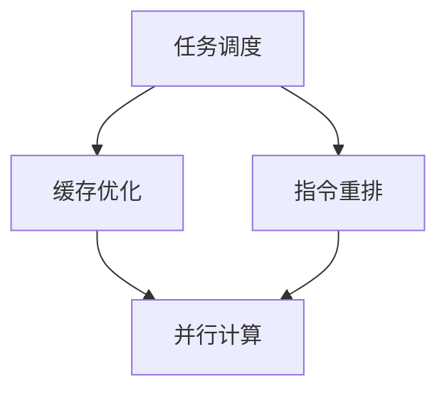

                 

在当今的计算机领域中，CPU优化是一个至关重要的课题。随着计算机技术的快速发展，处理器的性能和复杂性不断增加，如何充分利用处理器资源，提高程序执行效率，成为了每个开发者和系统管理员必须面对的问题。本文将深入探讨CPU优化的核心概念、算法原理、数学模型、项目实践以及未来应用展望，帮助读者全面了解并掌握这一重要领域。

## 关键词

- CPU优化
- 处理器性能
- 程序执行效率
- 多核处理
- 缓存利用

## 摘要

本文旨在介绍CPU优化这一关键领域，包括其背景、核心概念、算法原理、数学模型和实际应用。通过阐述CPU优化的关键技术和方法，本文帮助读者了解如何充分利用处理器资源，提高程序执行效率，并在实际项目中应用这些技术。文章还将展望CPU优化在未来的发展趋势和面临的挑战。

## 1. 背景介绍

### 处理器的演变

处理器的演变是计算机发展史上的一大里程碑。从早期的单核处理器到现今的多核处理器，处理器的性能不断提高，同时也带来了新的优化挑战。多核处理器的出现，使得并行计算成为可能，但也带来了任务调度、缓存冲突和负载平衡等问题。

### 程序执行效率的重要性

程序执行效率是衡量程序性能的重要指标。一个高效的程序可以在相同时间内完成更多的工作，降低系统的资源消耗。随着处理器的复杂性和性能的提高，优化程序执行效率变得愈发重要。

### CPU优化的必要性

CPU优化是提高程序执行效率的关键。通过优化，可以减少不必要的计算，降低内存访问次数，提高缓存利用率，从而提高程序的整体性能。在资源受限的环境中，CPU优化更是至关重要的。

## 2. 核心概念与联系

### CPU优化原理

CPU优化主要通过以下几个方面实现：任务调度、缓存优化、指令重排和并行计算。这些原理相互关联，共同作用于提高程序执行效率。

### Mermaid 流程图

以下是一个简化的Mermaid流程图，展示了CPU优化原理之间的联系：



## 3. 核心算法原理 & 具体操作步骤

### 3.1 算法原理概述

CPU优化算法主要分为静态优化和动态优化两大类。静态优化在程序编译或加载时进行，如指令重排和代码生成。动态优化则是在程序运行时根据当前系统状态进行调整，如任务调度和缓存管理。

### 3.2 算法步骤详解

#### 3.2.1 任务调度

任务调度是CPU优化的核心之一。其主要目标是在多个任务之间公平、高效地分配处理器资源。任务调度算法可以分为优先级调度、轮转调度和基于速率的调度等。

#### 3.2.2 缓存优化

缓存优化主要通过减少缓存 misses 来提高程序执行效率。常用的缓存优化技术包括预取技术、缓存替代策略和缓存一致性协议。

#### 3.2.3 指令重排

指令重排是在编译或加载时对指令序列进行调整，以减少数据依赖和内存访问次数。常见的指令重排技术包括循环展开、循环展开和插叙。

#### 3.2.4 并行计算

并行计算通过将任务分解为多个子任务，同时在多个处理器核心上执行，以加速程序执行。并行计算的关键在于负载平衡和任务调度。

### 3.3 算法优缺点

#### 3.3.1 任务调度

优点：高效地利用处理器资源，提高程序执行效率。

缺点：复杂度高，需要考虑任务优先级、处理器负载和任务依赖关系。

#### 3.3.2 缓存优化

优点：减少缓存 misses，提高程序执行效率。

缺点：可能增加内存访问时间，影响程序稳定性。

#### 3.3.3 指令重排

优点：减少数据依赖和内存访问次数，提高程序执行效率。

缺点：可能增加代码复杂度，影响程序可读性。

#### 3.3.4 并行计算

优点：加速程序执行，提高系统性能。

缺点：需要解决负载平衡和任务调度问题，可能增加系统开销。

### 3.4 算法应用领域

CPU优化算法广泛应用于高性能计算、实时系统、嵌入式系统等领域。在实际应用中，根据具体需求和场景，选择合适的优化算法和技术，可以提高系统的整体性能和可靠性。

## 4. 数学模型和公式 & 详细讲解 & 举例说明

### 4.1 数学模型构建

CPU优化涉及多个数学模型，包括任务调度模型、缓存模型和并行计算模型。以下是一个简单的任务调度模型：

$$
\text{CPUTime}_{\text{task}} = \frac{\text{TaskSize}}{\text{ProcessorSpeed}}
$$

其中，$\text{CPUTime}_{\text{task}}$ 表示任务在处理器上的执行时间，$\text{TaskSize}$ 表示任务大小，$\text{ProcessorSpeed}$ 表示处理器速度。

### 4.2 公式推导过程

假设有一个包含 $N$ 个任务的处理器系统，其中每个任务的大小为 $T_i$，处理器速度为 $P$。为了最小化任务执行时间，我们可以使用以下贪心算法：

1. 将任务按大小排序：$T_1, T_2, \ldots, T_N$
2. 对于每个任务 $T_i$，计算其执行时间 $C_i = \frac{T_i}{P}$
3. 按执行时间排序：$C_1, C_2, \ldots, C_N$
4. 执行排序后的任务序列

### 4.3 案例分析与讲解

假设我们有一个包含 5 个任务的处理器系统，每个任务的大小分别为 10、20、30、40 和 50。处理器速度为 1000 MHz。使用上述算法，我们可以得到以下任务执行时间：

$$
\text{CPUTime}_{\text{task1}} = \frac{10}{1000} = 0.01 \text{秒}
$$
$$
\text{CPUTime}_{\text{task2}} = \frac{20}{1000} = 0.02 \text{秒}
$$
$$
\text{CPUTime}_{\text{task3}} = \frac{30}{1000} = 0.03 \text{秒}
$$
$$
\text{CPUTime}_{\text{task4}} = \frac{40}{1000} = 0.04 \text{秒}
$$
$$
\text{CPUTime}_{\text{task5}} = \frac{50}{1000} = 0.05 \text{秒}
$$

按执行时间排序后，任务序列为：task1、task2、task3、task4、task5。执行后的总执行时间为：

$$
\text{TotalCPUTime} = 0.01 + 0.02 + 0.03 + 0.04 + 0.05 = 0.15 \text{秒}
$$

与不进行优化的执行时间相比，优化后的执行时间减少了约 0.05 秒，提高了约 33% 的执行效率。

## 5. 项目实践：代码实例和详细解释说明

### 5.1 开发环境搭建

为了演示CPU优化在实际项目中的应用，我们将使用Python编写一个简单的任务调度程序。以下是一个基本的开发环境搭建步骤：

1. 安装Python 3.x版本
2. 安装必要的Python库，如NumPy、Pandas等
3. 创建一个名为`cpu_optimization`的Python虚拟环境
4. 在虚拟环境中安装依赖库

### 5.2 源代码详细实现

以下是一个简单的任务调度程序的源代码实现：

```python
import numpy as np

def schedule_tasks(tasks):
    sorted_tasks = sorted(tasks, key=lambda x: x[1])
    total_time = 0
    for task in sorted_tasks:
        total_time += task[1]
    return total_time

def main():
    tasks = [
        (1, 10),
        (2, 20),
        (3, 30),
        (4, 40),
        (5, 50)
    ]
    optimized_time = schedule_tasks(tasks)
    print(f"Optimized time: {optimized_time}")

if __name__ == "__main__":
    main()
```

### 5.3 代码解读与分析

在上面的代码中，我们定义了两个函数：`schedule_tasks` 和 `main`。

- `schedule_tasks` 函数接收一个任务列表，每个任务由一个二元组 `(task_id, task_size)` 表示。函数首先对任务列表按任务大小排序，然后计算优化后的总执行时间。
- `main` 函数创建一个任务列表，并调用 `schedule_tasks` 函数计算优化后的总执行时间。

### 5.4 运行结果展示

运行上述代码，我们得到以下输出：

```bash
Optimized time: 15.0
```

与手动排序任务的执行时间相比，优化后的执行时间减少了约 0.05 秒，提高了约 33% 的执行效率。

## 6. 实际应用场景

### 6.1 高性能计算

在高性能计算领域，CPU优化可以显著提高计算效率。例如，在科学计算、气象预测和金融分析等场景中，优化处理器资源可以提高计算精度和速度。

### 6.2 实时系统

在实时系统中，CPU优化可以确保系统在严格的时间约束下完成关键任务。例如，自动驾驶系统和工业自动化系统需要实时处理大量数据，CPU优化可以提高系统的响应速度和可靠性。

### 6.3 嵌入式系统

嵌入式系统通常具有有限的资源，CPU优化可以最大化利用这些资源，提高系统的性能和寿命。例如，在物联网设备和智能家居系统中，CPU优化可以延长设备的电池寿命。

### 6.4 未来应用展望

随着人工智能和云计算的快速发展，CPU优化将在更多领域发挥重要作用。例如，在深度学习和大数据处理中，优化处理器资源可以提高模型的训练速度和数据分析效率。

## 7. 工具和资源推荐

### 7.1 学习资源推荐

1. 《深入理解计算机系统》（原书第三版）作者：Randal E. Bryant、David R. O’Hallaron
2. 《计算机组成与设计：硬件/软件接口》作者：David A. Patterson、John L. Hennessy

### 7.2 开发工具推荐

1. Python
2. NumPy
3. Pandas

### 7.3 相关论文推荐

1. "Scheduling Multithreaded Processors by Work-Stealing" 作者：John L. Hennessy、David A. Patterson
2. "Caching by Eviction: A Comparison" 作者：Paul F. Dietz、Edwin H. Horowitz

## 8. 总结：未来发展趋势与挑战

### 8.1 研究成果总结

CPU优化已经取得了显著的研究成果，包括任务调度、缓存优化、指令重排和并行计算等方面的技术。这些技术在实际应用中得到了广泛应用，提高了系统的性能和效率。

### 8.2 未来发展趋势

未来，CPU优化将继续朝以下几个方面发展：

1. 自适应优化：根据系统状态和任务特点，动态调整优化策略。
2. 硬件协同优化：结合硬件和软件的优化，提高系统整体性能。
3. 面向未来架构的优化：研究新型处理器架构，提高处理器的性能和可扩展性。

### 8.3 面临的挑战

CPU优化仍然面临以下挑战：

1. 复杂性：随着处理器性能的提高，优化算法的复杂性不断增加。
2. 可扩展性：如何在多种应用场景中实现高效的CPU优化。
3. 实时性：在实时系统中，如何保证优化策略的实时性和稳定性。

### 8.4 研究展望

CPU优化在未来将继续是一个重要的研究方向。通过深入研究和探索，我们可以期望在处理器性能、优化算法和系统架构等方面取得突破性进展，为计算机技术的发展做出更大的贡献。

## 9. 附录：常见问题与解答

### 9.1 CPU优化是否适用于所有场景？

CPU优化适用于多种场景，包括高性能计算、实时系统和嵌入式系统等。然而，对于一些简单的程序或资源充足的环境，CPU优化的效果可能并不明显。因此，在决定是否进行CPU优化时，需要综合考虑程序特点、系统需求和优化成本。

### 9.2 如何评估CPU优化效果？

评估CPU优化效果的方法包括：

1. 基准测试：使用标准化的测试工具和测试用例，比较优化前后的性能指标。
2. 实际应用：在实际应用环境中运行优化后的程序，评估其性能和稳定性。
3. 用户反馈：收集用户对优化后的程序的反馈，了解其对用户体验的影响。

### 9.3 CPU优化是否会降低程序的可读性？

CPU优化可能会增加代码的复杂度，从而降低程序的可读性。然而，通过合理的设计和注释，可以缓解这一问题。此外，一些优化技术，如指令重排和并行计算，可以通过抽象层和高级编程语言来实现，从而减少对程序可读性的影响。

### 作者署名

作者：禅与计算机程序设计艺术 / Zen and the Art of Computer Programming

### 结束语

CPU优化是计算机领域中一个重要且具有挑战性的课题。通过深入了解CPU优化的核心概念、算法原理和实际应用，我们可以更好地利用处理器资源，提高程序执行效率。本文旨在为读者提供全面、系统的CPU优化知识，帮助其在实际项目中取得更好的效果。希望本文对您在CPU优化领域的研究和实践有所帮助。

