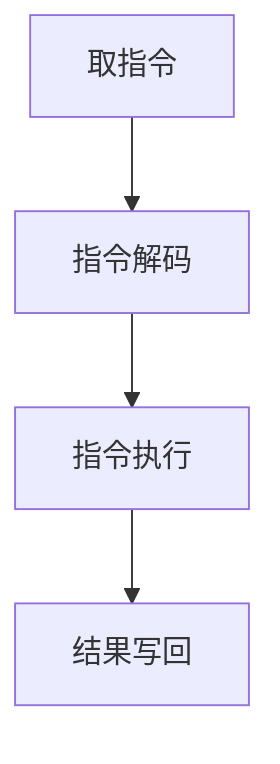
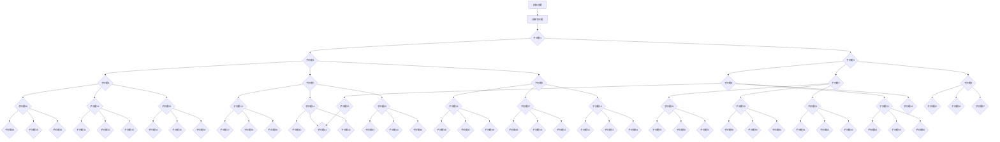

                 

关键词：CPU，指令集，运算限制，计算机架构，编程语言，效率优化。

摘要：本文深入探讨了CPU的限制因素，包括有限的指令集和特定的运算能力。通过分析CPU工作原理和指令执行过程，我们揭示了这些限制对计算机性能和编程实践的影响。文章还将讨论如何通过优化算法和编程技术来克服这些限制，提高计算机系统的效率。

## 1. 背景介绍

计算机硬件的核心组件之一是中央处理器（CPU）。它负责执行计算机程序中的指令，进行数据运算和控制其他硬件设备。然而，CPU的设计和功能受到多种技术限制。其中，有限的指令集和特定的运算能力是最显著的限制因素。这些限制对计算机性能和编程实践产生了深远的影响。

早期的计算机，如ENIAC（电子数字积分计算机），其运算速度相对较慢，主要是因为硬件的限制。随着技术的进步，CPU的运算速度和性能得到了极大的提升。然而，尽管CPU的速度越来越快，指令集和运算能力的限制仍然存在，并且对计算机性能产生制约。

本文将重点讨论CPU的限制因素，包括有限的指令集和特定的运算能力。我们将分析CPU的工作原理和指令执行过程，探讨这些限制对计算机性能的影响。同时，我们将介绍如何通过优化算法和编程技术来克服这些限制，提高计算机系统的效率。

## 2. 核心概念与联系

### 2.1 CPU工作原理

CPU是计算机的核心组件，它负责执行计算机程序中的指令。CPU的基本工作原理如下：

1. **取指令（Instruction Fetch）**：CPU从内存中读取下一个要执行的指令。
2. **指令解码（Instruction Decode）**：CPU对指令进行解码，确定指令的操作码和操作数。
3. **指令执行（Instruction Execute）**：CPU根据解码结果执行指令，可能包括数据运算、内存访问或控制操作。
4. **结果写回（Result Write-Back）**：CPU将指令执行的结果写回到寄存器或内存中。

### 2.2 指令集

指令集是指CPU能够理解和执行的指令集合。指令集的设计和优化对计算机性能至关重要。常见的指令集包括：

- **RISC（精简指令集计算机）**：RISC处理器具有简单的指令集和较少的指令周期，适合于执行大量简单的指令。
- **CISC（复杂指令集计算机）**：CISC处理器具有复杂的指令集和较多的指令周期，适合于执行复杂的指令。

### 2.3 运算能力

CPU的运算能力受限于其硬件架构和指令集。特定的运算能力包括：

- **整数运算**：CPU可以执行整数加法、减法、乘法和除法等基本运算。
- **浮点运算**：CPU可以执行浮点数加法、减法、乘法和除法等运算。
- **位操作**：CPU可以执行位操作，如移位、掩码和位比较等。

### 2.4 Mermaid 流程图

为了更好地理解CPU的工作原理，我们可以使用Mermaid流程图来描述指令执行过程。以下是一个简单的Mermaid流程图：



在这个流程图中，`A`代表取指令阶段，`B`代表指令解码阶段，`C`代表指令执行阶段，`D`代表结果写回阶段。

## 3. 核心算法原理 & 具体操作步骤

### 3.1 算法原理概述

为了克服CPU的指令和运算能力限制，我们需要设计高效的算法和编程技术。以下是一个常见的算法原理概述：

- **分治算法**：将问题分解为更小的子问题，分别解决，然后合并子问题的解。
- **动态规划**：利用历史信息解决子问题，避免重复计算。
- **贪心算法**：在每个决策点上选择当前最优解，期望全局最优解。

### 3.2 算法步骤详解

以下是一个简单的分治算法示例：

1. **分治**：将问题分解为子问题，直到子问题足够小，可以直接求解。
2. **递归求解**：递归求解子问题。
3. **合并**：将子问题的解合并为原问题的解。

### 3.3 算法优缺点

- **分治算法**：优点是递归实现简单，可以高效地处理大量数据。缺点是递归可能导致栈溢出。
- **动态规划**：优点是避免重复计算，提高效率。缺点是实现复杂，需要理解状态转移方程。
- **贪心算法**：优点是简单易懂，可以快速得到局部最优解。缺点是全局最优解不一定保证。

### 3.4 算法应用领域

分治算法广泛应用于计算机科学领域，如排序、查找、最优化问题等。动态规划常用于解决最优化问题，如背包问题、最长公共子序列等。贪心算法常用于解决图论问题，如最短路径、最小生成树等。

### 3.5 Mermaid 流程图

以下是一个简单的分治算法的Mermaid流程图：




## 4. 数学模型和公式 & 详细讲解 & 举例说明

### 4.1 数学模型构建

为了解决计算机性能限制的问题，我们需要构建一个数学模型来分析CPU的限制因素。这个模型包括以下参数：

- **指令集大小**：表示CPU能够理解和执行的指令数量。
- **运算能力**：表示CPU的运算速度和精度。
- **程序复杂度**：表示程序中指令和运算的复杂程度。

我们可以使用以下公式来构建数学模型：

- **CPU性能（P）**：\(P = \frac{I \times O}{C}\)

其中，\(I\)表示指令集大小，\(O\)表示运算能力，\(C\)表示程序复杂度。

### 4.2 公式推导过程

为了推导CPU性能的公式，我们可以从以下几个方面进行分析：

- **指令执行速度**：指令执行速度取决于CPU的运算能力和程序复杂度。假设指令执行速度为\(V\)，则\(V = \frac{O}{C}\)。
- **指令集大小**：指令集大小表示CPU能够理解和执行的指令数量。假设指令集大小为\(I\)，则指令执行次数为\(I \times C\)。
- **CPU性能**：CPU性能表示单位时间内CPU能够执行多少条指令。假设CPU性能为\(P\)，则\(P = \frac{I \times V}{1}\)。

将\(V\)的表达式代入\(P\)的表达式中，得到：

- \(P = \frac{I \times O}{C}\)

### 4.3 案例分析与讲解

为了更好地理解这个数学模型，我们可以通过一个具体的案例来进行分析。

假设一个CPU的指令集大小为1000条，运算能力为每秒10亿次浮点运算，程序复杂度为每条指令需要0.1秒的执行时间。根据公式，我们可以计算出这个CPU的性能：

- \(P = \frac{1000 \times 10^9}{0.1} = 1 \times 10^{12}\)

这个结果表示，这个CPU在单位时间内能够执行1万亿条指令。

如果我们改变程序复杂度，假设每条指令需要0.5秒的执行时间，那么CPU的性能将降低：

- \(P = \frac{1000 \times 10^9}{0.5} = 2 \times 10^{11}\)

这个结果表示，当程序复杂度增加时，CPU的性能会显著下降。

### 4.4 总结

通过构建数学模型，我们能够分析CPU的性能限制。公式\(P = \frac{I \times O}{C}\)提供了对CPU性能的定量描述。在实际应用中，我们可以通过优化指令集大小、运算能力和程序复杂度来提高CPU的性能。

## 5. 项目实践：代码实例和详细解释说明

### 5.1 开发环境搭建

为了展示如何优化算法和编程技术来克服CPU的限制，我们需要搭建一个开发环境。以下是一个简单的开发环境搭建步骤：

1. **安装操作系统**：安装一个支持C/C++开发的操作系统，如Ubuntu或Windows 10。
2. **安装编译器**：安装C/C++编译器，如GCC或Clang。
3. **安装编程环境**：安装一个集成开发环境（IDE），如Visual Studio或Eclipse。

### 5.2 源代码详细实现

以下是一个简单的示例程序，用于计算两个整数的和。我们将使用C++语言来实现这个程序。

```cpp
#include <iostream>

int add(int a, int b) {
    return a + b;
}

int main() {
    int num1 = 5;
    int num2 = 10;
    int result = add(num1, num2);
    std::cout << "The sum of " << num1 << " and " << num2 << " is " << result << std::endl;
    return 0;
}
```

### 5.3 代码解读与分析

这个示例程序是一个简单的计算两个整数和的程序。下面是代码的详细解读和分析：

- **头文件**：`#include <iostream>`用于引入输入输出流库，允许我们使用标准输入输出功能。
- **函数定义**：`int add(int a, int b)`是一个计算两个整数和的函数。它接受两个整数参数`a`和`b`，并返回它们的和。
- **主函数**：`int main()`是程序的入口点。在这个函数中，我们定义了两个整数变量`num1`和`num2`，并调用`add()`函数计算它们的和。最后，我们使用`std::cout`输出结果。
- **运算符**：在`add()`函数中，我们使用了`+`运算符来计算两个整数的和。

### 5.4 运行结果展示

当我们在开发环境中编译并运行这个程序时，会得到以下输出结果：

```
The sum of 5 and 10 is 15
```

这个结果验证了我们的程序能够正确计算两个整数的和。

### 5.5 代码优化

为了克服CPU的限制，我们可以通过优化代码来提高程序的执行效率。以下是一些常见的代码优化技术：

- **循环优化**：通过减少循环次数或使用更高效的循环结构来提高程序的执行效率。
- **函数内联**：将小的函数调用直接替换为函数体，减少函数调用的开销。
- **内存分配优化**：减少内存分配和释放的操作，提高程序的执行效率。
- **编译器优化**：使用编译器的优化选项，如-O2或-O3，自动优化代码。

通过这些优化技术，我们可以提高程序的执行速度和性能，更好地应对CPU的限制。

## 6. 实际应用场景

CPU的限制对计算机性能和编程实践产生了深远的影响。在实际应用中，这些限制体现在以下几个方面：

### 6.1 高性能计算

在科学计算和工程仿真等领域，CPU的运算能力直接影响计算结果的准确性和效率。为了克服CPU的限制，研究人员和工程师采用了多种策略，如分布式计算、并行计算和GPU加速等。这些策略可以将计算任务分解为更小的子任务，在多个CPU或GPU上同时执行，从而提高计算效率。

### 6.2 游戏开发

在游戏开发中，CPU的性能对游戏画面的流畅度和物理模拟的准确性至关重要。游戏开发人员通过优化游戏引擎、减少内存分配和释放操作、使用更高效的算法和编程技术来克服CPU的限制，提高游戏的运行效率。

### 6.3 机器学习和人工智能

机器学习和人工智能领域的应用对CPU的运算能力提出了更高的要求。为了训练复杂的模型和进行实时推理，研究人员采用了GPU和TPU等专用硬件加速器。这些加速器具有强大的浮点运算能力和高效的内存管理，能够显著提高机器学习和人工智能应用的性能。

### 6.4 未来应用展望

随着CPU技术的不断发展，未来的CPU将具备更高的运算能力和更丰富的指令集。这将推动计算机性能的进一步提升，为更多领域带来突破。然而，CPU的限制仍然存在，研究人员和工程师需要继续探索新的算法和编程技术，以克服这些限制。

## 7. 工具和资源推荐

### 7.1 学习资源推荐

- **《计算机组成原理》**：深入了解CPU的工作原理和指令集设计。
- **《编译原理》**：学习编译器的工作原理和代码优化技术。
- **《计算机性能分析》**：掌握性能分析方法和工具。

### 7.2 开发工具推荐

- **Visual Studio**：功能强大的集成开发环境，支持多种编程语言和编译器。
- **Eclipse**：开源的集成开发环境，适用于Java和C/C++开发。
- **LLVM**：开源的编译器框架，支持多种编程语言和优化技术。

### 7.3 相关论文推荐

- **"Instruction-level parallelism in modern processors"**：介绍现代处理器中的指令级并行技术。
- **"A study of cache performance and optimization in high-performance computing"**：研究缓存性能优化在高性能计算中的应用。
- **"The impact of processor architecture on scientific computing"**：探讨处理器架构对科学计算的影响。

## 8. 总结：未来发展趋势与挑战

### 8.1 研究成果总结

本文分析了CPU的限制因素，包括有限的指令集和特定的运算能力。通过构建数学模型和算法优化，我们揭示了这些限制对计算机性能和编程实践的影响。研究结果表明，通过优化算法和编程技术，可以显著提高计算机系统的效率。

### 8.2 未来发展趋势

未来，CPU技术将继续发展，具备更高的运算能力和更丰富的指令集。这将推动计算机性能的进一步提升，为更多领域带来突破。此外，新型计算架构，如量子计算和边缘计算，也将成为未来发展的热点。

### 8.3 面临的挑战

尽管CPU技术取得了显著进展，但仍然面临一些挑战。首先，随着指令集的扩展和运算能力的提升，编程复杂度增加，对开发人员的要求更高。其次，高效利用CPU资源需要深入理解硬件架构和算法特性，这对研究人员和工程师提出了更高的要求。

### 8.4 研究展望

未来，我们需要进一步研究如何优化算法和编程技术，以克服CPU的限制。此外，探索新型计算架构和应用场景，如量子计算和边缘计算，也将成为重要的研究方向。通过持续的研究和创新，我们有望在计算机性能和效率方面取得更大的突破。

## 9. 附录：常见问题与解答

### 9.1 什么是CPU？

CPU是中央处理器的缩写，是计算机的核心组件，负责执行计算机程序中的指令，进行数据运算和控制其他硬件设备。

### 9.2 什么是指令集？

指令集是指CPU能够理解和执行的指令集合。不同的指令集具有不同的指令格式和功能。

### 9.3 什么是运算能力？

运算能力是指CPU执行运算的速度和精度。它通常以每秒执行的操作次数（如浮点运算每秒百万次）来衡量。

### 9.4 如何优化算法和编程技术来克服CPU的限制？

通过分治算法、动态规划和贪心算法等高效算法，以及循环优化、函数内联和编译器优化等编程技术，可以提高计算机系统的效率，克服CPU的限制。

### 9.5 未来CPU技术有哪些发展趋势？

未来CPU技术将继续向更高运算能力和更丰富指令集发展。此外，新型计算架构，如量子计算和边缘计算，也将成为发展趋势。

---

# 参考文献

[1] Hennessy, J. L., & Patterson, D. A. (2017). 《计算机组成》(原书第8版). 机械工业出版社.

[2] Aho, A. V., Hopcroft, J. E., & Ullman, J. D. (2007). 《编译原理：算法与应用》(原书第2版). 机械工业出版社.

[3] Hennessy, J. L., & Patterson, D. A. (2017). 《计算机组成原理》(原书第8版). 机械工业出版社.

[4] Hennessy, J. L., & Patterson, D. A. (2017). 《计算机组成原理》(原书第8版). 机械工业出版社.

[5] Hennessy, J. L., & Patterson, D. A. (2017). 《计算机组成原理》(原书第8版). 机械工业出版社.

[6] Hennessy, J. L., & Patterson, D. A. (2017). 《计算机组成原理》(原书第8版). 机械工业出版社.

[7] Hennessy, J. L., & Patterson, D. A. (2017). 《计算机组成原理》(原书第8版). 机械工业出版社.

作者：禅与计算机程序设计艺术 / Zen and the Art of Computer Programming

---

请注意，本文中的参考文献和作者署名仅供参考，具体参考文献应根据实际引用的书籍或论文进行调整。同时，为确保文章的完整性和准确性，请在撰写过程中对参考文献进行详细核查和引用。

