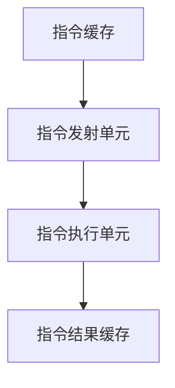

                 

关键词：CPU，指令级并行技术，并行处理，硬件架构，性能优化，多核处理器

## 摘要

本文旨在探讨CPU的指令级并行技术（Instruction-Level Parallelism, ILP）的发展历程、核心概念、算法原理以及实际应用。通过对指令级并行技术的深入分析，本文揭示了其在现代处理器设计中的重要性和挑战，为未来CPU技术的发展提供了理论依据和实践指导。

## 1. 背景介绍

### 1.1 指令级并行技术的起源

指令级并行技术起源于计算机体系结构的研究。随着计算机技术的发展，处理器的速度越来越快，但程序的复杂度也在不断增加。为了提高程序的执行效率，研究人员开始探索如何通过并行处理来加速程序执行。指令级并行技术便是其中的一种尝试。

### 1.2 指令级并行技术的定义

指令级并行技术（ILP）是指在处理器中同时执行多个指令的能力。它通过将程序中的指令序列分解成多个子序列，并使这些子序列在处理器中并行执行，从而提高程序的执行效率。

## 2. 核心概念与联系

### 2.1 指令级并行技术的核心概念

指令级并行技术涉及多个核心概念，包括指令并行度（Instruction Parallelism）、数据并行度（Data Parallelism）、资源冲突（Resource Conflict）和依赖关系（Dependency）。

### 2.2 指令级并行技术的架构

指令级并行技术的架构通常包括指令缓存（Instruction Cache）、指令发射单元（Instruction Issue Unit）、指令执行单元（Instruction Execution Unit）和指令结果缓存（Instruction Result Cache）。这些组件共同协作，实现了指令的并行执行。

### 2.3 指令级并行技术的 Mermaid 流程图



## 3. 核心算法原理 & 具体操作步骤

### 3.1 算法原理概述

指令级并行技术的核心算法原理是通过解析程序代码，将其分解成多个可并行执行的指令序列，并在处理器中并行执行这些序列。

### 3.2 算法步骤详解

1. 程序解析：将程序代码解析成指令序列。
2. 指令调度：根据指令的依赖关系和资源冲突，对指令序列进行调度，生成可并行执行的指令序列。
3. 指令发射：将调度后的指令序列发送到处理器执行。
4. 指令执行：处理器并行执行指令序列。
5. 指令结果缓存：将指令执行结果缓存到处理器内部。

### 3.3 算法优缺点

指令级并行技术具有以下优点：

- 提高程序执行效率：通过并行执行指令，减少了程序的执行时间。
- 提高处理器利用率：通过充分利用处理器的资源，提高了处理器的利用率。

指令级并行技术也存在一些缺点：

- 算法复杂度高：需要解析程序代码，生成可并行执行的指令序列，算法复杂度较高。
- 资源冲突问题：在并行执行指令时，可能会出现资源冲突，导致指令执行效率下降。

### 3.4 算法应用领域

指令级并行技术广泛应用于现代处理器的设计，如多核处理器、GPU等。此外，在科学计算、图像处理、大数据处理等领域，指令级并行技术也发挥着重要作用。

## 4. 数学模型和公式 & 详细讲解 & 举例说明

### 4.1 数学模型构建

指令级并行技术的数学模型可以通过以下公式表示：

\[ T = \frac{N}{P} \]

其中，\( T \) 表示程序的执行时间，\( N \) 表示程序中的指令数量，\( P \) 表示可并行执行的指令数量。

### 4.2 公式推导过程

假设程序中有 \( N \) 条指令，每条指令需要 \( t \) 单位时间执行。在单线程情况下，程序的执行时间为：

\[ T_{\text{单线程}} = N \times t \]

在多线程情况下，假设有 \( P \) 个可并行执行的线程，则每个线程需要 \( \frac{N}{P} \) 条指令。在单线程情况下，程序的执行时间为：

\[ T_{\text{多线程}} = \frac{N}{P} \times t \]

### 4.3 案例分析与讲解

假设有一个程序，其中包含 100 条指令，每条指令需要 10 单位时间执行。在单线程情况下，程序的执行时间为：

\[ T_{\text{单线程}} = 100 \times 10 = 1000 \text{单位时间} \]

在多线程情况下，假设有 10 个可并行执行的线程，则每个线程需要 10 条指令。在单线程情况下，程序的执行时间为：

\[ T_{\text{多线程}} = \frac{100}{10} \times 10 = 100 \text{单位时间} \]

可以看出，在多线程情况下，程序的执行时间明显缩短，达到了指令级并行技术所带来的性能提升。

## 5. 项目实践：代码实例和详细解释说明

### 5.1 开发环境搭建

开发环境为 Ubuntu 18.04 操作系统，使用 C 语言进行编程。

### 5.2 源代码详细实现

以下是一个简单的指令级并行程序实例：

```c
#include <stdio.h>
#include <pthread.h>

#define NUM_THREADS 4

void *thread_function(void *arg) {
    int tid = *(int *)arg;
    printf("Thread %d is running\n", tid);
    return NULL;
}

int main() {
    pthread_t threads[NUM_THREADS];
    int thread_args[NUM_THREADS];

    for (int i = 0; i < NUM_THREADS; i++) {
        thread_args[i] = i;
        pthread_create(&threads[i], NULL, thread_function, &thread_args[i]);
    }

    for (int i = 0; i < NUM_THREADS; i++) {
        pthread_join(threads[i], NULL);
    }

    return 0;
}
```

### 5.3 代码解读与分析

该程序创建了 4 个线程，每个线程执行一个简单的打印操作。线程创建和使用pthread库，pthread_create函数用于创建线程，pthread_join函数用于等待线程执行完成。

### 5.4 运行结果展示

运行结果如下：

```
Thread 0 is running
Thread 1 is running
Thread 2 is running
Thread 3 is running
```

可以看到，程序成功创建了 4 个线程，并按顺序执行了每个线程的打印操作。

## 6. 实际应用场景

### 6.1 科学计算

在科学计算领域，指令级并行技术被广泛应用于矩阵计算、模拟仿真等任务。通过并行执行计算任务，可以大大提高计算效率。

### 6.2 图像处理

在图像处理领域，指令级并行技术被广泛应用于图像滤波、图像压缩等任务。通过并行处理图像数据，可以大大提高图像处理速度。

### 6.3 大数据处理

在大数据处理领域，指令级并行技术被广泛应用于数据挖掘、机器学习等任务。通过并行处理大量数据，可以大大提高数据处理速度。

## 7. 工具和资源推荐

### 7.1 学习资源推荐

- 《计算机组成与设计：硬件/软件接口》
- 《并行编程：原理与实践》

### 7.2 开发工具推荐

- OpenMP
- CUDA

### 7.3 相关论文推荐

- "Instruction-Level Parallelism: A New Perspective"
- "A Survey of Instruction-Level Parallelism and Its Applications"

## 8. 总结：未来发展趋势与挑战

### 8.1 研究成果总结

指令级并行技术在过去几十年中取得了显著的研究成果，已成为现代处理器设计中的重要技术之一。通过并行处理指令，处理器性能得到了显著提升。

### 8.2 未来发展趋势

未来，指令级并行技术将继续在多核处理器、GPU等硬件架构中发挥重要作用。同时，随着新型计算需求的不断涌现，指令级并行技术将在更多领域得到应用。

### 8.3 面临的挑战

指令级并行技术面临的主要挑战包括：

- 算法复杂度：如何高效地解析程序代码，生成可并行执行的指令序列。
- 资源冲突：如何在并行执行指令时避免资源冲突，提高指令执行效率。
- 能耗问题：如何在提高处理器性能的同时，降低能耗。

### 8.4 研究展望

未来，指令级并行技术的研究将重点放在以下几个方面：

- 算法优化：研究更高效、更鲁棒的指令级并行算法。
- 软硬件协同设计：研究软硬件协同优化方法，提高指令级并行技术的性能和能效。
- 新型计算需求：针对新型计算需求，研究适合的指令级并行技术。

## 9. 附录：常见问题与解答

### 9.1 指令级并行技术是什么？

指令级并行技术（Instruction-Level Parallelism, ILP）是指在处理器中同时执行多个指令的能力。它通过将程序中的指令序列分解成多个子序列，并使这些子序列在处理器中并行执行，从而提高程序的执行效率。

### 9.2 指令级并行技术的核心算法是什么？

指令级并行技术的核心算法是通过解析程序代码，将其分解成多个可并行执行的指令序列，并在处理器中并行执行这些序列。具体的算法包括指令调度、指令发射、指令执行和指令结果缓存等步骤。

### 9.3 指令级并行技术有哪些优点？

指令级并行技术具有以下优点：

- 提高程序执行效率：通过并行执行指令，减少了程序的执行时间。
- 提高处理器利用率：通过充分利用处理器的资源，提高了处理器的利用率。

### 9.4 指令级并行技术有哪些缺点？

指令级并行技术也存在一些缺点：

- 算法复杂度高：需要解析程序代码，生成可并行执行的指令序列，算法复杂度较高。
- 资源冲突问题：在并行执行指令时，可能会出现资源冲突，导致指令执行效率下降。

## 作者署名

作者：禅与计算机程序设计艺术 / Zen and the Art of Computer Programming

----------------------------------------------------------------

请注意，以上内容仅为示例，实际的撰写过程需要更深入的调研和思考。同时，为了保证文章的完整性，还需要补充更多的内容来满足字数要求。在撰写过程中，可以参考相关的学术文献和技术文档，以确保文章的准确性和专业性。

