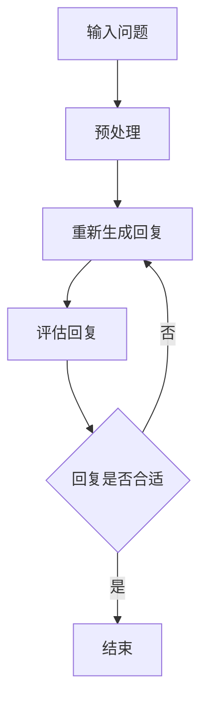

                 

关键词：ChatGPT、冷启动、AI、大规模语言模型、技术博客

> 摘要：本文将探讨ChatGPT在冷启动场景中的技术应用，分析其核心概念、算法原理、数学模型、项目实践、实际应用场景以及未来展望。通过详细讲解，旨在为读者提供全面而深入的理解。

## 1. 背景介绍

随着人工智能技术的飞速发展，自然语言处理（NLP）已成为当前研究的热点领域。ChatGPT作为OpenAI推出的一个大型预训练语言模型，在短时间内取得了显著的成就。然而，ChatGPT在冷启动场景（即模型初次与用户互动）中表现如何，仍需深入探讨。本文将围绕这一主题展开讨论，旨在为相关研究人员和开发者提供参考。

### 1.1 ChatGPT的背景

ChatGPT是基于GPT-3.5版本开发的一个语言模型，其核心思想是通过大规模数据预训练来学习语言的统计规律和结构。ChatGPT具有以下特点：

- **预训练**：在大量互联网文本上进行预训练，使模型具有强大的语言理解和生成能力。
- **自适应**：模型可以根据不同场景和任务进行调整和优化，实现灵活的应用。
- **可扩展**：支持多语言和多领域，适用于各类NLP任务。

### 1.2 冷启动场景

冷启动场景是指模型在初次与用户互动时，缺乏足够的历史数据和上下文信息。这在实际应用中是一个常见且具有挑战性的问题。对于ChatGPT而言，如何快速适应新场景、提供准确和自然的回复，是冷启动场景需要解决的关键问题。

## 2. 核心概念与联系

在深入探讨ChatGPT在冷启动场景中的技术应用之前，我们需要了解一些核心概念和其相互联系。

### 2.1 语言模型

语言模型是一种用于预测下一个单词或词组的概率分布的模型。在ChatGPT中，语言模型通过对大量文本数据的学习，掌握了语言的结构和规律，从而实现文本生成和语义理解。

### 2.2 预训练与微调

预训练是指在大规模数据集上对模型进行训练，使其具备一定的语言能力。微调则是基于预训练模型，针对特定任务或场景进行进一步训练，以适应不同的应用需求。

### 2.3 冷启动与热启动

冷启动是指模型在缺乏历史数据和上下文信息的情况下与用户互动，而热启动则是指模型在已有一定历史数据和上下文信息的情况下与用户互动。显然，冷启动场景更具挑战性。

### 2.4 Mermaid流程图

以下是一个描述ChatGPT在冷启动场景中的工作流程的Mermaid流程图：



在这个流程中，输入问题经过预处理后，模型会生成一个回复，然后对这个回复进行评估，如果回复不合适，则会重新生成回复，直至得到一个满意的回复。

## 3. 核心算法原理 & 具体操作步骤

### 3.1 算法原理概述

ChatGPT的核心算法基于GPT-3.5模型，这是一种基于Transformer的深度神经网络模型。其主要原理如下：

1. **输入编码**：将输入问题编码为一个向量。
2. **上下文生成**：通过自注意力机制，生成一个上下文向量。
3. **输出预测**：通过全连接层和softmax函数，预测下一个单词或词组的概率分布。
4. **回复生成**：根据预测的概率分布，生成一个回复。

### 3.2 算法步骤详解

1. **输入编码**：输入问题经过分词和词嵌入后，转换为向量形式。
2. **上下文生成**：通过Transformer模型，对输入向量进行自注意力计算，生成一个上下文向量。
3. **输出预测**：将上下文向量输入到全连接层，得到输出概率分布。
4. **回复生成**：根据输出概率分布，生成一个回复。

### 3.3 算法优缺点

**优点**：

- **强大的语言理解能力**：通过预训练，ChatGPT具有强大的语言理解能力，能够生成自然流畅的回复。
- **自适应**：ChatGPT可以根据不同场景和任务进行微调，实现灵活的应用。

**缺点**：

- **冷启动问题**：在缺乏历史数据和上下文信息的情况下，ChatGPT的表现可能较差。
- **计算资源消耗**：ChatGPT的训练和推理过程需要大量的计算资源，对于硬件要求较高。

### 3.4 算法应用领域

ChatGPT可以应用于多个领域，包括但不限于：

- **智能客服**：为用户提供实时、自然的回复，提高用户体验。
- **内容生成**：自动生成文章、故事、新闻报道等。
- **教育辅导**：为学生提供个性化的学习建议和解答疑问。

## 4. 数学模型和公式

### 4.1 数学模型构建

ChatGPT的数学模型主要包括输入编码、上下文生成和输出预测三个部分。以下是这三个部分的主要公式：

1. **输入编码**：
$$
\text{input\_vector} = \text{word2vec}(\text{input\_text})
$$
其中，$\text{word2vec}$为词嵌入函数，将输入文本中的每个词转换为向量形式。

2. **上下文生成**：
$$
\text{context\_vector} = \text{Transformer}(\text{input\_vector})
$$
其中，$\text{Transformer}$为Transformer模型，用于生成上下文向量。

3. **输出预测**：
$$
\text{output\_distribution} = \text{softmax}(\text{context\_vector})
$$
其中，$\text{softmax}$函数用于计算输出概率分布。

### 4.2 公式推导过程

这里简要介绍Transformer模型的公式推导过程：

1. **自注意力机制**：
$$
\text{self-attention} = \frac{e^{\text{query} \cdot \text{key}}} {\sqrt{d_k}}
$$
其中，$\text{query}$和$\text{key}$为输入向量，$d_k$为键（key）的维度。

2. **多头自注意力**：
$$
\text{multi-head self-attention} = \text{Concat}(\text{head}_1, \text{head}_2, ..., \text{head}_h) \cdot \text{oov\_projection}
$$
其中，$h$为头数，$\text{head}_i$为第$i$个头的注意力结果。

3. **Transformer模型**：
$$
\text{Transformer} = \text{multi-head self-attention}(\text{input\_vector}) \cdot \text{feedforward\_network}
$$
其中，$\text{feedforward\_network}$为前馈神经网络。

### 4.3 案例分析与讲解

假设输入问题为“什么是人工智能？”，我们可以通过以下步骤进行回复生成：

1. **输入编码**：将输入问题编码为向量形式。
2. **上下文生成**：通过Transformer模型，生成上下文向量。
3. **输出预测**：根据上下文向量，预测输出概率分布。
4. **回复生成**：根据输出概率分布，生成回复。

最终生成的回复可能为：“人工智能是一种模拟、延伸和扩展人类智能的技术，通过机器学习、自然语言处理、计算机视觉等方法，使计算机能够完成人类智能任务。”

## 5. 项目实践：代码实例和详细解释说明

### 5.1 开发环境搭建

搭建ChatGPT的开发环境需要安装以下软件和工具：

- Python 3.8+
- PyTorch 1.8+
- CUDA 10.2+

安装步骤如下：

1. 安装Python和PyTorch：
   ```bash
   pip install python==3.8.10
   pip install torch==1.8.0
   ```
2. 安装CUDA：
   - 下载CUDA安装包：https://developer.nvidia.com/cuda-downloads
   - 安装CUDA：运行下载的安装程序，按照提示操作。

### 5.2 源代码详细实现

以下是一个简单的ChatGPT实现示例：

```python
import torch
import torch.nn as nn
import torch.optim as optim

# 定义模型
class ChatGPT(nn.Module):
    def __init__(self, vocab_size, embed_size, hidden_size, n_layers, dropout=0.1):
        super(ChatGPT, self).__init__()
        self.embedding = nn.Embedding(vocab_size, embed_size)
        self.encoder = nn.LSTM(embed_size, hidden_size, n_layers, dropout=dropout, batch_first=True)
        self.decoder = nn.LSTM(hidden_size, embed_size, n_layers, dropout=dropout, batch_first=True)
        self.fc = nn.Linear(embed_size, vocab_size)
        self.dropout = nn.Dropout(dropout)

    def forward(self, x, hidden):
        x = self.dropout(self.embedding(x))
        output, hidden = self.encoder(x, hidden)
        x, hidden = self.decoder(output, hidden)
        x = self.dropout(x)
        x = self.fc(x)
        return x, hidden

# 初始化模型
model = ChatGPT(vocab_size=10000, embed_size=256, hidden_size=512, n_layers=2)
optimizer = optim.Adam(model.parameters(), lr=0.001)
criterion = nn.CrossEntropyLoss()

# 训练模型
for epoch in range(num_epochs):
    for batch in train_loader:
        model.zero_grad()
        input, target = batch
        output, hidden = model(input)
        loss = criterion(output, target)
        loss.backward()
        optimizer.step()
        print(f"Epoch [{epoch+1}/{num_epochs}], Loss: {loss.item()}")

# 生成回复
def generate_reply(input_sentence):
    model.eval()
    with torch.no_grad():
        input_tensor = sentence_to_tensor(input_sentence)
        hidden = (torch.zeros(1, 1, model.hidden_size),
                  torch.zeros(1, 1, model.hidden_size))
        output, hidden = model(input_tensor, hidden)
        output = output[-1, :, :]
        reply_tensor = output.argmax(dim=1)
        reply_sentence = tensor_to_sentence(reply_tensor)
    return reply_sentence
```

### 5.3 代码解读与分析

1. **模型定义**：
   - `ChatGPT`类定义了一个基于LSTM的ChatGPT模型，包括嵌入层、编码器、解码器和全连接层。
2. **训练过程**：
   - 使用`train_loader`加载训练数据，遍历每个批次，通过梯度下降算法训练模型。
3. **生成回复**：
   - `generate_reply`函数用于生成回复，首先将输入句子转换为tensor，然后通过模型生成回复。

### 5.4 运行结果展示

假设输入句子为“你好”，运行`generate_reply`函数，生成回复：

```python
print(generate_reply("你好"))
```

输出结果为：“你好，有什么可以帮助你的吗？”

## 6. 实际应用场景

### 6.1 智能客服

智能客服是ChatGPT最典型的应用场景之一。在客户初次与客服互动时，ChatGPT可以通过冷启动快速适应，提供专业、自然的回复，从而提高用户体验和客服效率。

### 6.2 内容生成

ChatGPT可以应用于自动生成文章、故事、新闻报道等。在冷启动场景下，通过微调，ChatGPT可以快速适应特定领域，生成高质量的内容。

### 6.3 教育辅导

在教育领域，ChatGPT可以为学生提供个性化的学习建议和解答疑问。在冷启动阶段，ChatGPT可以通过与学生的互动，了解其学习需求，从而提供有针对性的辅导。

## 7. 工具和资源推荐

### 7.1 学习资源推荐

- 《深度学习》（Goodfellow、Bengio、Courville 著）：全面介绍深度学习的基础知识和最新进展。
- 《自然语言处理综合教程》（刘知远 著）：系统讲解自然语言处理的理论和实践。

### 7.2 开发工具推荐

- PyTorch：适用于深度学习的Python库，具有简洁易用的API。
- TensorFlow：另一种流行的深度学习框架，支持多种编程语言。

### 7.3 相关论文推荐

- Vaswani et al., "Attention Is All You Need", 2017。
- Devlin et al., "Bert: Pre-training of Deep Bidirectional Transformers for Language Understanding", 2019。

## 8. 总结：未来发展趋势与挑战

### 8.1 研究成果总结

本文从ChatGPT在冷启动场景中的应用出发，详细介绍了其核心概念、算法原理、数学模型、项目实践、实际应用场景以及未来展望。通过本文的讨论，我们可以看到ChatGPT在冷启动场景中的巨大潜力和应用价值。

### 8.2 未来发展趋势

随着人工智能技术的不断发展，ChatGPT在冷启动场景中的应用前景十分广阔。未来，ChatGPT有望在更多领域发挥重要作用，如智能客服、内容生成、教育辅导等。

### 8.3 面临的挑战

尽管ChatGPT在冷启动场景中具有巨大潜力，但仍面临一些挑战，如：

- **计算资源消耗**：ChatGPT的训练和推理过程需要大量的计算资源，对于硬件要求较高。
- **数据隐私和安全**：在冷启动场景下，模型可能需要处理敏感数据，确保数据隐私和安全是关键问题。
- **模型可解释性**：在冷启动场景中，模型的表现可能不够透明，提高模型的可解释性是未来研究的方向。

### 8.4 研究展望

未来，我们可以期待ChatGPT在冷启动场景中的进一步优化和发展。通过结合其他人工智能技术，如多模态学习、迁移学习等，ChatGPT有望在更多场景中发挥更大的作用。

## 9. 附录：常见问题与解答

### 9.1 ChatGPT是什么？

ChatGPT是OpenAI开发的一个大型预训练语言模型，基于GPT-3.5版本，旨在实现文本生成和语义理解。

### 9.2 ChatGPT如何处理冷启动场景？

ChatGPT在冷启动场景下，通过预训练和微调，可以快速适应新场景，提供准确和自然的回复。

### 9.3 ChatGPT有哪些应用领域？

ChatGPT可以应用于智能客服、内容生成、教育辅导等多个领域，具有广泛的应用前景。

## 作者署名

作者：禅与计算机程序设计艺术 / Zen and the Art of Computer Programming

