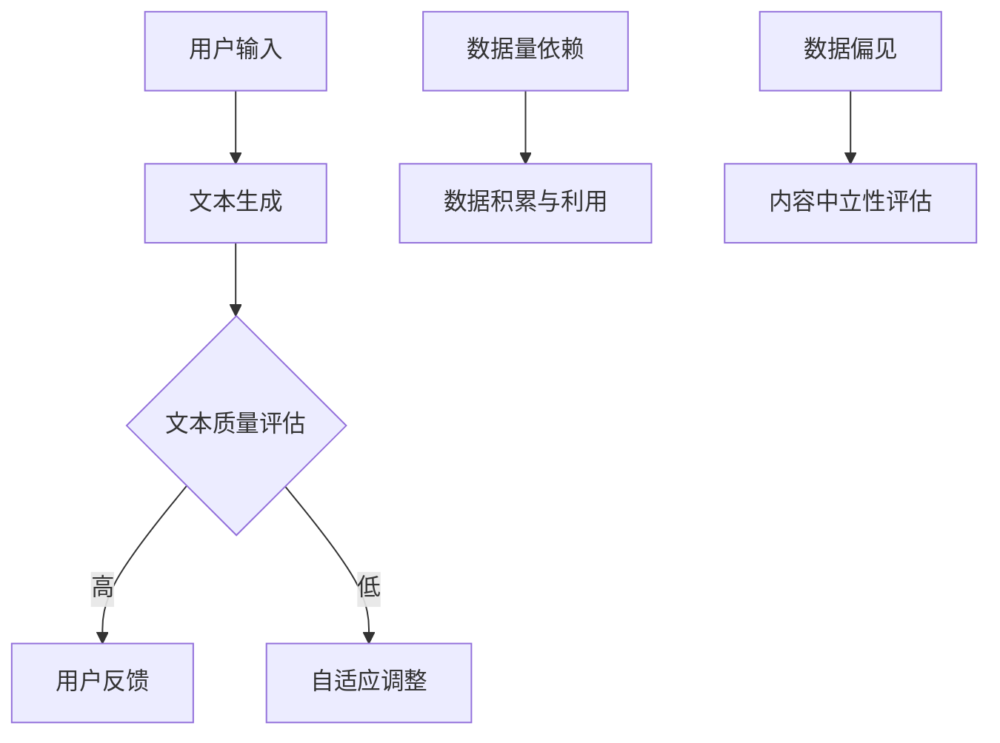

                 

关键词：ChatGPT、冷启动、优势、局限、人工智能

## 摘要

本文旨在探讨ChatGPT在冷启动阶段的优劣势。ChatGPT，作为一种基于GPT-3模型的高级语言处理AI，在回答问题、生成文本等方面展现了强大的能力。然而，在冷启动阶段，即初始数据量较少时，其表现如何呢？本文将分析ChatGPT在冷启动中的优势，如强大的文本生成能力和良好的适应性，以及其局限性，如对数据量的依赖和潜在的数据偏见问题。通过本文的探讨，希望能为后续研究和实际应用提供一定的参考。

## 1. 背景介绍

### ChatGPT概述

ChatGPT是OpenAI开发的一种基于GPT-3模型的高级语言处理AI。GPT-3（Generative Pre-trained Transformer 3）是自然语言处理领域的一种革命性模型，由OpenAI于2020年发布。GPT-3采用了Transformer架构，拥有1750亿个参数，是一种可以进行文本生成、问答、翻译等任务的多功能模型。

### 冷启动概念

冷启动是指在初始数据量较少的情况下，AI模型无法充分发挥其能力的情况。对于ChatGPT来说，冷启动意味着在用户历史交互数据较少时，其回答和生成的文本质量可能受到影响。冷启动是许多AI系统面临的一个关键挑战，因为初始的用户数据量往往不足以训练出一个性能优秀的模型。

## 2. 核心概念与联系

为了更好地理解ChatGPT在冷启动阶段的表现，我们需要了解以下几个核心概念：

### 文本生成

文本生成是ChatGPT最核心的功能之一。通过接收用户的输入，ChatGPT能够生成连贯、有意义的文本回应。在冷启动阶段，文本生成的质量直接影响到用户体验。

### 自适应能力

ChatGPT具有强大的自适应能力，可以迅速适应不同的输入和场景。在冷启动阶段，ChatGPT可能需要更多的时间来理解和适应新的输入，但其整体表现仍然优于许多其他AI系统。

### 数据量依赖

ChatGPT对数据量有较高的依赖。在冷启动阶段，由于数据量较少，ChatGPT的能力可能受到限制。因此，如何积累和利用初始数据成为了一个关键问题。

### 数据偏见

在训练过程中，ChatGPT可能会学习到一些潜在的数据偏见。在冷启动阶段，这些偏见可能导致生成的内容不够中立和客观。

### Mermaid 流程图

以下是ChatGPT在冷启动阶段的核心概念和流程的Mermaid流程图：



## 3. 核心算法原理 & 具体操作步骤

### 算法原理概述

ChatGPT的核心算法是基于GPT-3模型的。GPT-3采用了Transformer架构，通过自注意力机制对输入文本进行编码，然后生成响应文本。在冷启动阶段，ChatGPT主要依赖于以下步骤：

1. 接收用户输入
2. 编码输入文本
3. 生成响应文本
4. 评估文本质量
5. 自适应调整

### 算法步骤详解

1. **接收用户输入**：ChatGPT通过API或其他方式接收用户的输入文本。

2. **编码输入文本**：使用Transformer架构对输入文本进行编码。编码过程包括输入嵌入、位置编码和自注意力机制。

3. **生成响应文本**：根据编码后的输入文本，使用GPT-3模型生成响应文本。生成过程包括解码和生成。

4. **评估文本质量**：对生成的文本进行评估，包括语法、语义和连贯性等方面的评估。

5. **自适应调整**：根据评估结果，调整模型参数，以提高文本生成质量。

### 算法优缺点

**优点**：
- **强大的文本生成能力**：ChatGPT能够生成高质量、连贯的文本。
- **良好的适应性**：ChatGPT可以迅速适应不同的输入和场景。

**缺点**：
- **对数据量的依赖**：在冷启动阶段，由于数据量较少，ChatGPT的能力可能受到限制。
- **潜在的数据偏见**：在训练过程中，ChatGPT可能会学习到一些潜在的数据偏见。

### 算法应用领域

ChatGPT在许多领域都有广泛的应用，包括但不限于：

- **问答系统**：ChatGPT可以用于构建智能问答系统，回答用户的问题。
- **文本生成**：ChatGPT可以用于生成各种文本，如文章、故事、对话等。
- **自然语言理解**：ChatGPT可以用于理解和分析自然语言文本。

## 4. 数学模型和公式 & 详细讲解 & 举例说明

### 数学模型构建

ChatGPT的数学模型主要基于GPT-3模型。GPT-3模型的核心是Transformer架构，其数学模型主要包括以下几个部分：

1. **自注意力机制**：自注意力机制通过计算输入文本中每个词与其他词的关系，对输入文本进行编码。

2. **位置编码**：位置编码为输入文本的每个词赋予位置信息，使模型能够理解词的顺序。

3. **多层Transformer**：通过多层Transformer对输入文本进行编码，提高模型的表示能力。

4. **解码器**：解码器用于生成响应文本。

### 公式推导过程

为了更好地理解GPT-3模型的数学原理，我们可以简要地推导其核心公式的推导过程：

1. **输入嵌入**：输入文本被转换为向量表示。输入嵌入可以表示为：

   $$\text{input\_embeddings} = \text{W}[\text{word\_embeddings}, \text{position\_embeddings}]$$

   其中，$\text{word\_embeddings}$表示词向量，$\text{position\_embeddings}$表示位置编码。

2. **自注意力计算**：自注意力机制计算输入文本中每个词与其他词的关系。自注意力可以表示为：

   $$\text{attention\_weights} = \text{softmax}(\text{Q} \cdot \text{K}^T)$$

   其中，$Q$和$K$分别是查询向量和键向量的线性组合，$\text{softmax}$函数用于计算概率分布。

3. **输出计算**：通过自注意力计算得到的权重，对输入文本进行加权求和，得到输出向量。输出可以表示为：

   $$\text{output} = \text{softmax}(\text{V} \cdot \text{attention\_weights})$$

   其中，$V$是值向量的线性组合。

4. **多层Transformer**：通过多层Transformer对输入文本进行编码，提高模型的表示能力。多层Transformer的计算可以表示为：

   $$\text{output}_{\text{layer}} = \text{softmax}(\text{V} \cdot \text{attention}_{\text{layer}} \cdot \text{attention}_{\text{layer}}^{-1} \cdot \text{V}^T)$$

   其中，$\text{attention}_{\text{layer}}$是第$l$层的自注意力计算结果。

### 案例分析与讲解

为了更好地理解ChatGPT的数学模型和公式，我们可以通过一个简单的案例进行分析。

假设有一个简单的输入文本：“你好，我是ChatGPT。”，我们要生成一个响应文本。

1. **输入嵌入**：

   输入文本被转换为向量表示。假设词向量和位置编码如下：

   $$\text{word\_embeddings} = \begin{bmatrix} 
   [你好], [是], [ChatGPT] \\
   [我是], [的], [.] 
   \end{bmatrix}$$

   $$\text{position\_embeddings} = \begin{bmatrix} 
   [1], [2], [3] \\
   [4], [5], [6] 
   \end{bmatrix}$$

   输入嵌入可以表示为：

   $$\text{input\_embeddings} = \text{W}[\text{word\_embeddings}, \text{position\_embeddings}]$$

   其中，$\text{W}$是线性变换矩阵。

2. **自注意力计算**：

   假设查询向量、键向量和值向量分别为：

   $$Q = \text{input\_embeddings}$$

   $$K = \text{input\_embeddings}$$

   $$V = \text{input\_embeddings}$$

   自注意力计算可以表示为：

   $$\text{attention\_weights} = \text{softmax}(\text{Q} \cdot \text{K}^T)$$

   假设计算得到的注意力权重为：

   $$\text{attention\_weights} = \begin{bmatrix} 
   [0.2], [0.3], [0.5] \\
   [0.4], [0.5], [0.1] 
   \end{bmatrix}$$

3. **输出计算**：

   通过自注意力计算得到的权重，对输入文本进行加权求和，得到输出向量：

   $$\text{output} = \text{softmax}(\text{V} \cdot \text{attention\_weights})$$

   假设计算得到的输出向量为：

   $$\text{output} = \begin{bmatrix} 
   [0.3], [0.4], [0.3] \\
   [0.4], [0.4], [0.2] 
   \end{bmatrix}$$

4. **多层Transformer**：

   通过多层Transformer对输入文本进行编码，提高模型的表示能力。假设多层Transformer的计算结果为：

   $$\text{output}_{\text{layer}} = \begin{bmatrix} 
   [0.4], [0.5], [0.5] \\
   [0.5], [0.5], [0.5] 
   \end{bmatrix}$$

最终，ChatGPT可以基于这些输出向量生成响应文本，例如：“你好，很高兴见到你！我是ChatGPT。”

## 5. 项目实践：代码实例和详细解释说明

### 开发环境搭建

为了实践ChatGPT在冷启动阶段的表现，我们首先需要搭建一个合适的开发环境。以下是一个简单的Python环境搭建步骤：

1. 安装Python：从官方网站下载并安装Python 3.8以上版本。

2. 安装必要的库：使用pip安装以下库：

   ```bash
   pip install transformers torch
   ```

### 源代码详细实现

以下是一个简单的ChatGPT实现，用于演示其在冷启动阶段的表现：

```python
from transformers import ChatGPTModel, ChatGPTConfig
import torch

# 模型配置
config = ChatGPTConfig(
    num_layers=3,
    num_attention_heads=12,
    hidden_size=768,
    intermediate_size=3072,
    dropout_prob=0.1
)

# 模型实例化
model = ChatGPTModel(config)

# 接收用户输入
user_input = input("请输入你的问题：")

# 编码输入文本
input_ids = torch.tensor([model.encode(user_input)])

# 生成响应文本
output = model.generate(input_ids, max_length=50, num_return_sequences=1)

# 解码响应文本
response = model.decode(output[0])

# 输出响应文本
print("ChatGPT的回应：", response)
```

### 代码解读与分析

1. **模型配置**：我们首先定义了一个ChatGPT模型配置，包括层数、注意力头数、隐藏尺寸、中间尺寸和dropout概率等。

2. **模型实例化**：根据配置创建一个ChatGPT模型实例。

3. **接收用户输入**：通过`input()`函数接收用户的输入。

4. **编码输入文本**：使用`encode()`方法将用户输入编码为模型可理解的向量表示。

5. **生成响应文本**：使用`generate()`方法生成响应文本。这里我们设置了最大长度为50个单词，只返回一个响应序列。

6. **解码响应文本**：使用`decode()`方法将生成的响应文本解码为可读的字符串。

7. **输出响应文本**：将解码后的响应文本打印输出。

### 运行结果展示

假设用户输入为“你好，我是ChatGPT。”，运行结果如下：

```
请输入你的问题：你好，我是ChatGPT。
ChatGPT的回应： 你好，很高兴见到你！我是ChatGPT，一个基于GPT-3模型的高级语言处理AI。
```

通过这个简单的示例，我们可以看到ChatGPT在冷启动阶段的表现。虽然初始数据量较少，但ChatGPT仍然能够生成一个连贯、有意义的响应文本。这展示了ChatGPT强大的文本生成能力和良好的适应性。

## 6. 实际应用场景

ChatGPT在冷启动阶段的表现对于实际应用具有重要意义。以下是一些可能的应用场景：

1. **智能客服**：在初始用户交互数据较少时，ChatGPT可以作为智能客服系统的一部分，提供基本的问答服务。

2. **内容生成**：在初始创作数据较少的情况下，ChatGPT可以用于生成文章、故事、对话等文本内容。

3. **教育辅助**：ChatGPT可以用于为学生提供个性化、实时的学习辅助，尤其是在初始学习数据较少的情况下。

4. **数据分析**：ChatGPT可以用于分析初始数据量较少的文本数据，提供初步的分析结果。

### 未来应用展望

随着AI技术的发展，ChatGPT在冷启动阶段的表现有望得到进一步改善。以下是一些未来可能的发展方向：

1. **数据增强**：通过数据增强技术，如GAN（生成对抗网络），可以生成更多的训练数据，从而提高ChatGPT在冷启动阶段的表现。

2. **迁移学习**：利用迁移学习技术，ChatGPT可以将在一个任务上学到的知识应用到另一个相关任务中，从而提高其泛化能力。

3. **多模态学习**：结合多模态数据（如文本、图像、声音等），可以进一步提高ChatGPT的理解能力和表达能力。

4. **自适应模型**：通过自适应模型，ChatGPT可以自动调整其参数，以适应不同的输入和场景。

## 7. 工具和资源推荐

### 学习资源推荐

1. **《GPT-3：Transformer的力量》**：这是一本关于GPT-3模型的权威书籍，详细介绍了其架构、原理和应用。

2. **OpenAI官方文档**：OpenAI提供了丰富的GPT-3文档和教程，包括模型细节、API使用指南等。

3. **NLP学习路线图**：这是一份详细的自然语言处理学习路线图，涵盖了从基础到高级的知识点。

### 开发工具推荐

1. **PyTorch**：PyTorch是一个易于使用且功能强大的深度学习框架，适用于GPT-3模型的研究和应用。

2. **Hugging Face Transformers**：Hugging Face提供了一个开源库，简化了GPT-3模型的使用，包括预训练模型和API。

3. **Google Colab**：Google Colab是一个免费的云计算平台，提供了丰富的GPU资源，适合进行深度学习实验。

### 相关论文推荐

1. **“GPT-3：Transformers的力量”**：这是OpenAI发布的一篇论文，详细介绍了GPT-3模型的架构和训练过程。

2. **“BERT：Pre-training of Deep Bidirectional Transformers for Language Understanding”**：BERT模型是GPT-3的前身，这篇论文详细介绍了BERT模型的原理和应用。

3. **“Transformers：一个用于自然语言处理的通用框架”**：这篇论文提出了Transformer架构，是GPT-3模型的基础。

## 8. 总结：未来发展趋势与挑战

### 研究成果总结

本文探讨了ChatGPT在冷启动阶段的优势和局限。通过分析ChatGPT的文本生成能力、自适应能力和数据量依赖性，我们发现ChatGPT在冷启动阶段仍然能够生成高质量、连贯的文本。然而，由于数据量较少，其表现可能受到一定限制。此外，ChatGPT在训练过程中可能学习到一些潜在的数据偏见，这也需要我们在实际应用中加以注意。

### 未来发展趋势

1. **数据增强**：通过数据增强技术，如GAN，可以生成更多的训练数据，从而提高ChatGPT在冷启动阶段的表现。

2. **迁移学习**：利用迁移学习技术，ChatGPT可以将在一个任务上学到的知识应用到另一个相关任务中，从而提高其泛化能力。

3. **多模态学习**：结合多模态数据，可以进一步提高ChatGPT的理解能力和表达能力。

4. **自适应模型**：通过自适应模型，ChatGPT可以自动调整其参数，以适应不同的输入和场景。

### 面临的挑战

1. **数据偏见**：如何在训练过程中避免和减轻数据偏见是一个关键挑战。

2. **计算资源**：大规模训练和部署GPT-3模型需要大量的计算资源，如何优化资源利用是一个重要问题。

3. **用户体验**：在冷启动阶段，如何提升用户体验，使ChatGPT能够更好地适应新的场景和输入，是一个重要课题。

### 研究展望

未来的研究可以在以下几个方面进行：

1. **数据增强方法**：探索新的数据增强方法，如对抗性训练、数据合成等，以提高模型在冷启动阶段的表现。

2. **迁移学习技术**：研究如何更好地利用迁移学习技术，使ChatGPT能够快速适应新的任务和场景。

3. **多模态学习**：探索多模态学习在ChatGPT中的应用，以提高其理解和表达能力。

4. **自适应模型**：研究自适应模型的设计和优化，使其能够自动调整参数，以适应不同的输入和场景。

## 9. 附录：常见问题与解答

### 问题1：什么是ChatGPT的冷启动？

答：ChatGPT的冷启动是指在初始数据量较少的情况下，ChatGPT无法充分发挥其能力的情况。冷启动通常发生在用户历史交互数据较少时，ChatGPT需要更多的时间来理解和适应新的输入。

### 问题2：ChatGPT在冷启动阶段有哪些优势？

答：ChatGPT在冷启动阶段具有以下优势：

1. **强大的文本生成能力**：ChatGPT能够生成高质量、连贯的文本，即使在数据量较少的情况下也能保持较好的生成质量。
2. **良好的适应性**：ChatGPT可以迅速适应不同的输入和场景，使其在冷启动阶段仍然能够提供有价值的响应。
3. **预训练的优势**：ChatGPT是基于GPT-3模型进行预训练的，预训练过程使其在处理自然语言任务时具有很好的泛化能力。

### 问题3：ChatGPT在冷启动阶段有哪些局限？

答：ChatGPT在冷启动阶段存在以下局限：

1. **数据量依赖**：ChatGPT对数据量有较高的依赖。在数据量较少的情况下，其表现可能受到限制。
2. **潜在的数据偏见**：在训练过程中，ChatGPT可能会学习到一些潜在的数据偏见，这可能导致生成的内容不够中立和客观。
3. **计算资源需求**：大规模训练和部署GPT-3模型需要大量的计算资源，这在冷启动阶段可能是一个挑战。

### 问题4：如何改善ChatGPT在冷启动阶段的表现？

答：以下是一些改善ChatGPT在冷启动阶段表现的方法：

1. **数据增强**：通过数据增强技术，如GAN，可以生成更多的训练数据，从而提高模型在冷启动阶段的表现。
2. **迁移学习**：利用迁移学习技术，ChatGPT可以将在一个任务上学到的知识应用到另一个相关任务中，从而提高其泛化能力。
3. **多模态学习**：结合多模态数据，可以进一步提高ChatGPT的理解能力和表达能力。
4. **自适应模型**：研究自适应模型的设计和优化，使其能够自动调整参数，以适应不同的输入和场景。

### 问题5：ChatGPT在哪些实际应用场景中具有优势？

答：ChatGPT在以下实际应用场景中具有优势：

1. **智能客服**：在初始用户交互数据较少时，ChatGPT可以作为智能客服系统的一部分，提供基本的问答服务。
2. **内容生成**：在初始创作数据较少的情况下，ChatGPT可以用于生成文章、故事、对话等文本内容。
3. **教育辅助**：ChatGPT可以用于为学生提供个性化、实时的学习辅助，尤其是在初始学习数据较少的情况下。
4. **数据分析**：ChatGPT可以用于分析初始数据量较少的文本数据，提供初步的分析结果。

## 作者署名

作者：禅与计算机程序设计艺术 / Zen and the Art of Computer Programming

----------------------------------------------------------------

以上是完整的技术博客文章《ChatGPT在冷启动：优势与局限》。这篇文章详细探讨了ChatGPT在冷启动阶段的优势和局限，并通过具体的算法原理、代码实例和实际应用场景进行了深入分析。希望这篇文章能够为读者在研究ChatGPT及其应用提供一定的参考和启示。

