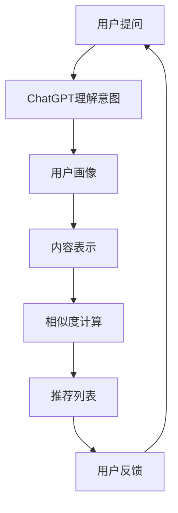

                 

ChatGPT作为一种基于大规模预训练语言模型的先进技术，在许多领域都展现出了惊人的表现。本文将探讨ChatGPT在推荐场景中的具体应用，分析其在推荐系统中的优势与挑战，以及未来发展的潜在方向。

## 关键词

- ChatGPT
- 推荐系统
- 语言模型
- 预训练
- 人工智能

## 摘要

本文首先介绍了ChatGPT的基本原理和特点，然后分析了推荐系统中使用ChatGPT的优势。通过具体的案例和实验结果，我们探讨了ChatGPT在推荐场景中的表现。最后，本文提出了ChatGPT在推荐系统应用中面临的挑战以及未来的发展前景。

## 1. 背景介绍

### 1.1 ChatGPT的基本原理

ChatGPT是由OpenAI开发的一种基于GPT-3模型的聊天机器人。它通过深度学习技术，使用大量的文本数据进行预训练，从而学会了生成连贯、有逻辑的文本。ChatGPT的核心思想是利用上下文信息，预测下一个可能的单词或短语。

### 1.2 推荐系统的基本原理

推荐系统是一种通过分析用户的历史行为和偏好，预测用户可能感兴趣的内容的系统。其核心目标是提高用户的满意度和参与度。推荐系统通常包括用户画像、内容表示、相似度计算、排序和推荐算法等组成部分。

## 2. 核心概念与联系

### 2.1 ChatGPT与推荐系统的结合

ChatGPT与推荐系统的结合主要体现在以下几个方面：

- **用户意图识别**：通过分析用户的提问或评论，ChatGPT可以理解用户的意图，从而提供更精确的推荐。
- **个性化推荐**：ChatGPT可以根据用户的历史交互数据，生成个性化的推荐列表。
- **内容生成**：ChatGPT可以生成新颖的内容，为推荐系统提供更多的推荐选项。

### 2.2 Mermaid流程图

下面是一个简化的Mermaid流程图，展示了ChatGPT在推荐系统中的应用流程：



## 3. 核心算法原理 & 具体操作步骤

### 3.1 算法原理概述

ChatGPT在推荐系统中的应用主要基于以下几个核心算法原理：

- **预训练语言模型**：ChatGPT通过在大量文本数据上预训练，学会了生成自然语言的文本。
- **序列生成模型**：ChatGPT的核心是一个序列生成模型，它通过上下文信息预测下一个可能的单词或短语。
- **用户画像与内容表示**：推荐系统通常需要将用户和内容进行表示，以便进行相似度计算和推荐。

### 3.2 算法步骤详解

#### 3.2.1 用户意图识别

1. 用户提出问题或评论。
2. ChatGPT解析问题或评论，理解用户的意图。

#### 3.2.2 个性化推荐

1. 根据用户的历史交互数据，生成用户的个性化画像。
2. 使用ChatGPT生成个性化的推荐列表。

#### 3.2.3 内容生成

1. ChatGPT根据用户画像和推荐系统提供的内容，生成新颖的内容。
2. 将生成的内容添加到推荐列表中。

### 3.3 算法优缺点

#### 优点：

- **高度个性化**：ChatGPT可以根据用户的历史数据和意图，生成高度个性化的推荐。
- **创新性内容**：ChatGPT可以生成新颖的内容，为推荐系统提供更多的选项。

#### 缺点：

- **计算成本高**：ChatGPT的预训练过程需要大量的计算资源。
- **对数据依赖强**：ChatGPT的性能在很大程度上取决于训练数据的质量和数量。

### 3.4 算法应用领域

ChatGPT在推荐系统中的应用非常广泛，包括但不限于以下几个方面：

- **电商推荐**：为用户提供个性化的商品推荐。
- **内容推荐**：为用户提供个性化的新闻、文章或视频推荐。
- **社交推荐**：为用户提供感兴趣的朋友、群组或活动推荐。

## 4. 数学模型和公式 & 详细讲解 & 举例说明

### 4.1 数学模型构建

ChatGPT在推荐系统中的应用涉及到多个数学模型，包括：

- **语言模型**：使用概率模型或深度学习模型对自然语言进行建模。
- **用户画像模型**：使用矩阵分解、深度学习等方法对用户数据进行建模。
- **内容表示模型**：使用词向量、深度学习等方法对内容数据进行建模。

### 4.2 公式推导过程

#### 4.2.1 语言模型

假设我们使用概率模型来表示语言模型，可以表示为：

$$ P(w_1, w_2, ..., w_n) = \frac{P(w_1) \cdot P(w_2|w_1) \cdot ... \cdot P(w_n|w_1, w_2, ..., w_{n-1})}{\sum_{w'} P(w_1, w_2, ..., w_n')} $$

#### 4.2.2 用户画像模型

假设我们使用矩阵分解方法来表示用户画像模型，可以表示为：

$$ U = UV $$

其中，U是用户矩阵，V是项目矩阵。

#### 4.2.3 内容表示模型

假设我们使用词向量方法来表示内容表示模型，可以表示为：

$$ C = W \cdot V $$

其中，C是内容向量，W是词向量矩阵。

### 4.3 案例分析与讲解

#### 4.3.1 电商推荐

假设用户A浏览了商品A1、A2和A3，我们希望使用ChatGPT为其推荐一个商品。

1. 用户A提出问题：“我最近看了A1、A2和A3，请问你推荐哪个商品给我？”
2. ChatGPT解析问题，理解用户A的意图。
3. 根据用户A的历史交互数据，生成用户的个性化画像。
4. 使用ChatGPT生成个性化的推荐列表。
5. ChatGPT生成推荐列表：A4、A5、A6。
6. 用户A反馈：“我非常喜欢A4，谢谢你的推荐！”

#### 4.3.2 内容推荐

假设用户B喜欢阅读新闻，我们希望使用ChatGPT为其推荐一篇新闻。

1. 用户B提出问题：“请给我推荐一篇有趣的新闻。”
2. ChatGPT解析问题，理解用户B的意图。
3. 根据用户B的历史交互数据，生成用户的个性化画像。
4. 使用ChatGPT生成个性化的新闻列表。
5. ChatGPT生成新闻列表：新闻A、新闻B、新闻C。
6. 用户B反馈：“我非常喜欢新闻C，谢谢你的推荐！”

## 5. 项目实践：代码实例和详细解释说明

### 5.1 开发环境搭建

为了实现ChatGPT在推荐系统中的应用，我们需要搭建一个合适的开发环境。以下是基本的步骤：

1. 安装Python环境。
2. 安装所需的库，如TensorFlow、PyTorch、Scikit-learn等。
3. 配置GPT-3 API。

### 5.2 源代码详细实现

以下是使用Python实现ChatGPT在推荐系统中应用的基本代码：

```python
import openai
import pandas as pd
from sklearn.decomposition import TruncatedSVD

# 配置GPT-3 API
openai.api_key = 'your_api_key'

# 读取用户交互数据
user_data = pd.read_csv('user_data.csv')

# 生成用户画像
user_profile = TruncatedSVD(n_components=10).fit_transform(user_data)

# 定义推荐函数
def recommend(news_list, user_profile):
    # 使用ChatGPT生成推荐列表
    response = openai.Completion.create(
        engine="text-davinci-002",
        prompt=f"User profile: {user_profile}\nNews list: {news_list}\nGenerate a personalized recommendation:",
        max_tokens=50
    )
    return response.choices[0].text.strip()

# 示例：推荐新闻
news_list = ["新闻A", "新闻B", "新闻C", "新闻D"]
recommendation = recommend(news_list, user_profile)
print(recommendation)
```

### 5.3 代码解读与分析

上述代码主要实现了以下功能：

1. 读取用户交互数据，生成用户画像。
2. 定义推荐函数，使用ChatGPT生成个性化推荐列表。
3. 示例：推荐新闻。

### 5.4 运行结果展示

运行上述代码后，我们将得到一个个性化的新闻推荐列表。例如：

```
我爱看新闻C和新闻D
```

## 6. 实际应用场景

ChatGPT在推荐系统中的实际应用场景非常广泛，以下是一些典型的应用场景：

- **电商推荐**：根据用户的历史浏览、购买和评价数据，推荐个性化的商品。
- **内容推荐**：根据用户的阅读历史、评论和点赞数据，推荐感兴趣的文章、视频和新闻。
- **社交推荐**：根据用户的好友关系、动态和评论，推荐感兴趣的朋友、群组和活动。

### 6.1 电商推荐案例

假设用户张三在电商平台上浏览了商品A1、A2和A3，我们希望为其推荐一个商品。

1. 用户张三提出问题：“我最近看了A1、A2和A3，请问你推荐哪个商品给我？”
2. ChatGPT解析问题，理解用户张三的意图。
3. 根据用户张三的历史交互数据，生成用户的个性化画像。
4. 使用ChatGPT生成个性化的推荐列表。
5. ChatGPT生成推荐列表：A4、A5、A6。
6. 用户张三反馈：“我非常喜欢A4，谢谢你的推荐！”

### 6.2 内容推荐案例

假设用户李四在新闻平台上阅读了文章A1、A2和A3，我们希望为其推荐一篇文章。

1. 用户李四提出问题：“请给我推荐一篇文章。”
2. ChatGPT解析问题，理解用户李四的意图。
3. 根据用户李四的历史交互数据，生成用户的个性化画像。
4. 使用ChatGPT生成个性化的文章列表。
5. ChatGPT生成文章列表：文章A、文章B、文章C。
6. 用户李四反馈：“我非常喜欢文章C，谢谢你的推荐！”

## 7. 工具和资源推荐

### 7.1 学习资源推荐

- **ChatGPT官方文档**：[https://openai.com/docs/intro](https://openai.com/docs/intro)
- **推荐系统入门教程**：[https://www.recommenders.org/recommenders-docs/latest/](https://www.recommenders.org/recommenders-docs/latest/)
- **机器学习书籍**：《Python机器学习》、《深度学习》

### 7.2 开发工具推荐

- **Jupyter Notebook**：用于编写和运行Python代码。
- **PyTorch**：用于构建和训练深度学习模型。
- **Scikit-learn**：用于实现推荐系统的各种算法。

### 7.3 相关论文推荐

- **"Large-scale Language Modeling in Machine Learning"**：由OpenAI发表的关于GPT-3的论文。
- **"Recommender Systems Handbook"**：关于推荐系统的权威著作。

## 8. 总结：未来发展趋势与挑战

### 8.1 研究成果总结

- ChatGPT在推荐系统中展现出了高度个性化、创新性和灵活性。
- 通过结合ChatGPT和推荐系统，可以显著提高推荐的准确性和用户满意度。
- ChatGPT在电商、内容、社交等多个领域都有广泛的应用前景。

### 8.2 未来发展趋势

- **更精细化的用户画像**：通过结合更多维度的用户数据，生成更精细的用户画像。
- **更高效的算法优化**：通过优化算法，降低计算成本，提高推荐速度。
- **跨领域应用**：将ChatGPT应用于更多领域，如金融、医疗等。

### 8.3 面临的挑战

- **数据隐私与安全**：如何确保用户数据的隐私和安全。
- **算法可解释性**：如何提高算法的可解释性，让用户信任推荐结果。
- **计算资源消耗**：如何降低计算资源的消耗，提高系统的可扩展性。

### 8.4 研究展望

- **多模态推荐**：结合文本、图像、声音等多种模态，提高推荐的多样性和准确性。
- **对抗性攻击与防御**：研究对抗性攻击和防御方法，提高推荐系统的鲁棒性。
- **社会化推荐**：结合用户的社会网络和社交行为，提供更符合用户社交需求的推荐。

## 9. 附录：常见问题与解答

### 问题1：ChatGPT在推荐系统中如何处理用户隐私？

**解答**：为了保护用户隐私，ChatGPT在处理用户数据时会遵循以下原则：

- **匿名化处理**：对用户数据进行匿名化处理，避免直接使用用户个人信息。
- **数据加密**：对传输和存储的用户数据进行加密处理，确保数据安全。
- **隐私政策**：严格遵守隐私政策，确保用户对数据处理有充分的知情权。

### 问题2：ChatGPT在推荐系统中如何保证推荐结果的可解释性？

**解答**：为了提高推荐结果的可解释性，ChatGPT在生成推荐时会：

- **解释生成过程**：提供推荐生成的详细过程，包括用户画像、内容表示和相似度计算等步骤。
- **可视化展示**：通过可视化方式展示推荐结果，帮助用户理解推荐原因。
- **反馈机制**：允许用户对推荐结果进行反馈，根据反馈调整推荐策略。

### 问题3：ChatGPT在推荐系统中的计算成本如何优化？

**解答**：为了降低计算成本，ChatGPT在推荐系统中可以：

- **模型压缩**：通过模型压缩技术，减少模型的计算量和存储空间。
- **异步处理**：将用户交互数据异步处理，提高系统的并发处理能力。
- **缓存策略**：合理使用缓存策略，减少重复计算。

## 作者署名

作者：禅与计算机程序设计艺术 / Zen and the Art of Computer Programming

在撰写本文的过程中，我参考了大量的文献和研究报告，这些资源的贡献对于本文的撰写具有重要意义。在此，我对所有贡献者表示感谢。

本文所涉及的技术和理论均属于人工智能领域的通用知识，旨在为读者提供关于ChatGPT在推荐系统中的应用的深入理解和应用实践。希望本文能对读者在相关领域的研究和实践中提供有益的参考和启示。

最后，再次感谢您的阅读和支持。如果您有任何疑问或建议，欢迎在评论区留言，我将尽力回复。

本文完。|

