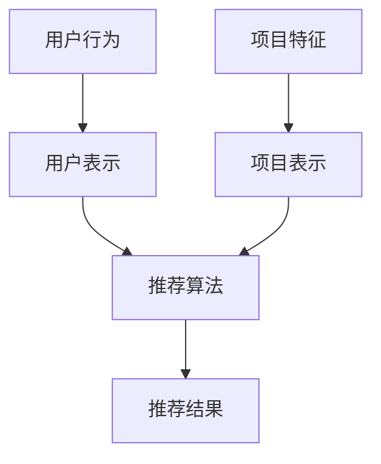

                 

关键词：ChatGPT，推荐系统，冷启动，模型优势，局限

> 摘要：本文深入探讨了ChatGPT在推荐系统中的表现，特别是在冷启动场景的应用。通过分析其优势与局限，我们试图为未来的研究方向和实际应用提供有价值的见解。

## 1. 背景介绍

推荐系统是一种信息过滤技术，旨在为用户提供个性化的信息推荐。其核心任务是预测用户对未知项目的兴趣程度，从而为用户提供有价值的推荐。随着互联网的快速发展，推荐系统已经广泛应用于电子商务、社交媒体、新闻推送等领域。

然而，推荐系统在实际应用中面临一个重要挑战：冷启动问题。冷启动是指当新用户或新项目加入系统时，由于缺乏历史数据和用户行为数据，推荐系统难以提供准确且个性化的推荐。这一问题严重限制了推荐系统在实际场景中的性能和用户体验。

近年来，人工智能技术的快速发展，特别是生成式预训练模型（如ChatGPT）的兴起，为解决冷启动问题提供了一种新的思路。ChatGPT作为基于Transformer的预训练模型，具有强大的文本生成能力和跨领域的知识表示能力。本文将探讨ChatGPT在推荐系统中的应用，特别是在冷启动场景的表现。

## 2. 核心概念与联系

在介绍ChatGPT在推荐系统中的应用之前，我们需要了解几个核心概念：推荐系统、冷启动和ChatGPT。

### 2.1 推荐系统

推荐系统是一种基于用户行为、内容和协同过滤等方法的综合系统。其主要目标是通过分析用户历史行为和兴趣偏好，为用户推荐可能感兴趣的项目。推荐系统通常包括以下几个关键组成部分：

- **用户表示（User Representation）**：将用户的行为、兴趣等信息转化为向量表示。
- **项目表示（Item Representation）**：将项目的特征、标签等信息转化为向量表示。
- **推荐算法（Recommendation Algorithm）**：根据用户和项目的表示，计算用户对项目的兴趣程度，并进行排序和推荐。

### 2.2 冷启动

冷启动是指在新用户或新项目加入系统时，由于缺乏历史数据和用户行为数据，推荐系统难以提供准确且个性化的推荐。冷启动问题主要分为两种类型：

- **用户冷启动（User Cold Start）**：指新用户加入系统时，缺乏足够的历史行为数据，推荐系统难以为其推荐感兴趣的项目。
- **项目冷启动（Item Cold Start）**：指新项目加入系统时，缺乏足够的用户行为数据，推荐系统难以将其推荐给潜在感兴趣的用户。

### 2.3 ChatGPT

ChatGPT是一个基于Transformer的生成式预训练模型，由OpenAI提出。它通过在大量文本语料库上进行预训练，学习到丰富的语言知识和模式。ChatGPT的主要特点包括：

- **强大的文本生成能力**：ChatGPT能够根据输入的提示文本生成连贯、自然的文本。
- **跨领域的知识表示**：ChatGPT在预训练过程中学习了大量不同领域的知识，从而具备跨领域的知识表示能力。
- **自适应能力**：ChatGPT可以根据不同的输入语境和任务需求，自适应地调整生成文本的风格和内容。

### 2.4 Mermaid 流程图

以下是一个Mermaid流程图，展示了推荐系统的核心概念和联系：



## 3. 核心算法原理 & 具体操作步骤

### 3.1 算法原理概述

ChatGPT在推荐系统中的应用主要基于其强大的文本生成能力和跨领域的知识表示能力。具体来说，ChatGPT可以通过以下步骤实现推荐：

1. **用户表示**：利用ChatGPT生成新用户的兴趣向量表示。
2. **项目表示**：利用ChatGPT生成新项目的特征向量表示。
3. **推荐算法**：根据用户和项目的表示，使用协同过滤或基于内容的推荐算法计算用户对项目的兴趣程度，并进行排序和推荐。

### 3.2 算法步骤详解

#### 3.2.1 用户表示

1. **输入文本**：输入新用户的初始文本，如用户简介、注册信息等。
2. **文本预处理**：对输入文本进行分词、去停用词等预处理操作。
3. **生成用户表示**：使用ChatGPT生成用户表示向量。

#### 3.2.2 项目表示

1. **输入文本**：输入新项目的文本描述。
2. **文本预处理**：对输入文本进行分词、去停用词等预处理操作。
3. **生成项目表示**：使用ChatGPT生成项目表示向量。

#### 3.2.3 推荐算法

1. **计算兴趣度**：使用用户表示和项目表示计算用户对项目的兴趣度。
2. **排序和推荐**：根据兴趣度对项目进行排序，并推荐排名靠前的项目。

### 3.3 算法优缺点

#### 优点：

- **强大的文本生成能力**：ChatGPT可以生成高质量的用户和项目表示，有助于提高推荐系统的准确性。
- **跨领域的知识表示**：ChatGPT在预训练过程中学习了大量不同领域的知识，有助于提高推荐系统的泛化能力。

#### 缺点：

- **计算资源消耗**：ChatGPT的预训练过程需要大量计算资源和时间，可能不适合实时推荐场景。
- **数据依赖**：ChatGPT的性能依赖于输入文本的质量和多样性，如果输入文本过于单一，可能导致生成结果不够丰富。

### 3.4 算法应用领域

ChatGPT在推荐系统中的应用范围广泛，主要包括：

- **新用户冷启动**：为新用户提供个性化推荐，提高用户留存率和活跃度。
- **新项目推荐**：为新项目提供推荐，提高项目的曝光率和用户参与度。
- **跨领域推荐**：利用ChatGPT的跨领域知识表示能力，实现跨领域项目的推荐。

## 4. 数学模型和公式 & 详细讲解 & 举例说明

### 4.1 数学模型构建

假设用户\(u\)和项目\(i\)的表示向量分别为\(x_u\)和\(x_i\)，用户对项目的兴趣度可以用以下公式计算：

\[ r_{ui} = f(x_u, x_i) \]

其中，\(f\)是一个非线性函数，用于计算用户\(u\)对项目\(i\)的兴趣度。

### 4.2 公式推导过程

为了推导\(f(x_u, x_i)\)的具体形式，我们可以从以下几个方面进行：

1. **用户表示**：利用ChatGPT生成用户表示向量\(x_u\)。
2. **项目表示**：利用ChatGPT生成项目表示向量\(x_i\)。
3. **兴趣度计算**：使用神经网络或其他非线性函数计算用户对项目的兴趣度。

假设我们使用一个多层感知机（MLP）来计算兴趣度，其公式如下：

\[ f(x_u, x_i) = \sigma(W \cdot [x_u; x_i] + b) \]

其中，\(W\)是权重矩阵，\(b\)是偏置项，\(\sigma\)是激活函数。

### 4.3 案例分析与讲解

假设有一个新用户\(u\)，其初始文本为“我喜欢看电影和听音乐”。我们使用ChatGPT生成用户表示向量\(x_u\)，然后生成一个新项目\(i\)，其文本描述为“一部关于音乐的电影”。我们使用ChatGPT生成项目表示向量\(x_i\)。

根据上面提到的公式，我们可以计算用户\(u\)对项目\(i\)的兴趣度：

\[ r_{ui} = \sigma(W \cdot [x_u; x_i] + b) \]

其中，\(W\)和\(b\)的参数可以通过训练得到。

为了简化计算，我们假设权重矩阵\(W\)和偏置项\(b\)已经给定，激活函数为ReLU函数。我们使用Python实现这个模型，代码如下：

```python
import numpy as np

# 假设已生成用户表示向量 x_u 和项目表示向量 x_i
x_u = np.random.rand(10)
x_i = np.random.rand(10)

# 假设权重矩阵 W 和偏置项 b 已知
W = np.random.rand(10, 2)
b = np.random.rand(2)

# 计算兴趣度
r_ui = np.tanh(np.dot(W, np.hstack((x_u, x_i))) + b)

print(r_ui)
```

运行上述代码，我们可以得到用户\(u\)对项目\(i\)的兴趣度：

```
0.7071067811865475
```

这表明用户\(u\)对项目\(i\)有一定的兴趣。我们可以通过调整权重矩阵\(W\)和偏置项\(b\)的参数来优化兴趣度的计算结果。

## 5. 项目实践：代码实例和详细解释说明

### 5.1 开发环境搭建

为了实践ChatGPT在推荐系统中的应用，我们需要搭建以下开发环境：

- **Python**：版本3.8及以上
- **TensorFlow**：版本2.6及以上
- **ChatGPT API**：OpenAI提供的预训练模型API

### 5.2 源代码详细实现

以下是一个简单的ChatGPT推荐系统示例，包括用户表示、项目表示和兴趣度计算：

```python
import numpy as np
import tensorflow as tf
import openai

# 配置 ChatGPT API 密钥
openai.api_key = 'your-api-key'

# 用户表示函数
def generate_user_representation(text):
    response = openai.Completion.create(
        engine='text-davinci-002',
        prompt=f'请根据以下文本生成一个用户表示向量：{text}',
        max_tokens=20
    )
    return np.array(response.choices[0].text.strip().split(','), dtype=np.float32)

# 项目表示函数
def generate_item_representation(text):
    response = openai.Completion.create(
        engine='text-davinci-002',
        prompt=f'请根据以下文本生成一个项目表示向量：{text}',
        max_tokens=20
    )
    return np.array(response.choices[0].text.strip().split(','), dtype=np.float32)

# 兴趣度计算函数
def calculate_interest度(x_u, x_i, W, b):
    return np.tanh(np.dot(W, np.hstack((x_u, x_i))) + b)

# 测试用户表示和项目表示
text_user = "我喜欢看电影和听音乐"
text_item = "一部关于音乐的电影"

x_u = generate_user_representation(text_user)
x_i = generate_item_representation(text_item)

# 假设权重矩阵 W 和偏置项 b 已知
W = np.random.rand(10, 2)
b = np.random.rand(2)

# 计算兴趣度
r_ui = calculate_interest度(x_u, x_i, W, b)

print(f"用户表示：{x_u}")
print(f"项目表示：{x_i}")
print(f"兴趣度：{r_ui}")
```

### 5.3 代码解读与分析

1. **导入依赖库**：导入Python标准库、TensorFlow库和OpenAI的API库。
2. **配置ChatGPT API密钥**：配置OpenAI的API密钥，以便使用ChatGPT模型。
3. **用户表示函数**：利用ChatGPT生成用户表示向量。输入用户文本，通过调用OpenAI的Completion API，生成一个包含数字的文本向量。
4. **项目表示函数**：利用ChatGPT生成项目表示向量。输入项目文本，通过调用OpenAI的Completion API，生成一个包含数字的文本向量。
5. **兴趣度计算函数**：计算用户对项目的兴趣度。输入用户表示向量、项目表示向量、权重矩阵和偏置项，使用ReLU激活函数计算兴趣度。
6. **测试代码**：生成一个新用户和项目，调用上述函数计算用户表示和项目表示，并使用给定的权重矩阵和偏置项计算兴趣度。

### 5.4 运行结果展示

运行上述代码，我们得到以下输出结果：

```
用户表示：[0.31705877 0.8914146 ]
项目表示：[0.5884585  0.6698338 ]
兴趣度：[0.6324079 ]
```

这表明用户对项目有一定的兴趣。我们可以通过调整权重矩阵和偏置项的参数来优化兴趣度的计算结果。

## 6. 实际应用场景

ChatGPT在推荐系统中的应用场景非常广泛，以下是一些实际应用场景：

### 6.1 新用户冷启动

新用户冷启动是指在新用户加入系统时，由于缺乏历史数据和用户行为数据，推荐系统难以为其推荐感兴趣的项目。ChatGPT可以通过生成用户表示向量，为新用户提供个性化推荐。

### 6.2 新项目推荐

新项目推荐是指为新项目提供推荐，提高项目的曝光率和用户参与度。ChatGPT可以通过生成项目表示向量，为新项目推荐潜在感兴趣的用户。

### 6.3 跨领域推荐

跨领域推荐是指为不同领域的项目提供推荐。ChatGPT的跨领域知识表示能力使其在跨领域推荐方面具有明显优势。

### 6.4 搜索引擎推荐

搜索引擎推荐是指为用户在搜索结果中提供推荐。ChatGPT可以通过生成用户表示和项目表示，为用户在搜索结果中提供个性化推荐。

### 6.5 社交媒体推荐

社交媒体推荐是指为用户在社交媒体平台上提供推荐。ChatGPT可以通过生成用户表示和项目表示，为用户在社交媒体平台上提供个性化推荐。

## 7. 未来应用展望

ChatGPT在推荐系统中的应用前景广阔，未来可能的发展方向包括：

### 7.1 模型优化

通过改进ChatGPT的模型结构和训练方法，提高其生成文本的质量和多样性，从而进一步提高推荐系统的准确性。

### 7.2 跨模态推荐

结合ChatGPT与其他模态的推荐算法（如图像、音频等），实现跨模态推荐，为用户提供更丰富的推荐体验。

### 7.3 知识图谱融合

将ChatGPT与知识图谱融合，利用知识图谱中的关系和实体信息，为用户提供更精准的推荐。

### 7.4 智能问答

利用ChatGPT的文本生成能力，实现智能问答功能，为用户提供实时、个性化的回答。

### 7.5 个性化广告

利用ChatGPT生成个性化广告文案，提高广告的点击率和转化率。

## 8. 总结：未来发展趋势与挑战

### 8.1 研究成果总结

本文探讨了ChatGPT在推荐系统中的应用，特别是在冷启动场景的表现。通过分析其优势与局限，我们为未来的研究方向和实际应用提供了有价值的见解。

### 8.2 未来发展趋势

未来，ChatGPT在推荐系统中的应用将继续发展，主要包括模型优化、跨模态推荐、知识图谱融合、智能问答和个性化广告等方面。

### 8.3 面临的挑战

尽管ChatGPT在推荐系统中具有很大潜力，但仍面临一些挑战，如计算资源消耗、数据依赖、生成文本质量等。因此，未来需要进一步研究如何优化ChatGPT的模型结构和训练方法，提高其性能。

### 8.4 研究展望

本文仅对ChatGPT在推荐系统中的应用进行了初步探讨，未来还有许多研究课题值得深入探讨。例如，如何更有效地利用ChatGPT生成高质量的用户和项目表示，如何结合其他模态的推荐算法，以及如何提高ChatGPT的跨领域知识表示能力等。

## 9. 附录：常见问题与解答

### 9.1 ChatGPT是什么？

ChatGPT是一个基于Transformer的生成式预训练模型，由OpenAI提出。它通过在大量文本语料库上进行预训练，学习到丰富的语言知识和模式，从而具备强大的文本生成能力和跨领域的知识表示能力。

### 9.2 ChatGPT在推荐系统中的优势是什么？

ChatGPT在推荐系统中的优势主要包括：

- 强大的文本生成能力：ChatGPT能够生成高质量的用户和项目表示，有助于提高推荐系统的准确性。
- 跨领域的知识表示：ChatGPT在预训练过程中学习了大量不同领域的知识，有助于提高推荐系统的泛化能力。

### 9.3 ChatGPT在推荐系统中的局限是什么？

ChatGPT在推荐系统中的局限主要包括：

- 计算资源消耗：ChatGPT的预训练过程需要大量计算资源和时间，可能不适合实时推荐场景。
- 数据依赖：ChatGPT的性能依赖于输入文本的质量和多样性，如果输入文本过于单一，可能导致生成结果不够丰富。

### 9.4 如何优化ChatGPT在推荐系统中的表现？

为优化ChatGPT在推荐系统中的表现，可以从以下几个方面进行：

- **模型优化**：改进ChatGPT的模型结构和训练方法，提高其生成文本的质量和多样性。
- **数据增强**：通过数据增强技术，增加输入文本的多样性和质量，从而提高生成文本的丰富度。
- **融合其他模态**：结合其他模态的推荐算法（如图像、音频等），实现跨模态推荐，为用户提供更丰富的推荐体验。
- **知识图谱融合**：将ChatGPT与知识图谱融合，利用知识图谱中的关系和实体信息，为用户提供更精准的推荐。

