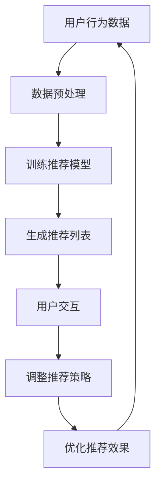

                 

关键词：ChatGPT，推荐系统，自然语言处理，机器学习，人工智能

摘要：本文将探讨ChatGPT在推荐系统中的应用，分析其在提高推荐系统性能和用户体验方面的潜力，并讨论其面临的挑战和未来的发展方向。

## 1. 背景介绍

### 1.1 ChatGPT简介

ChatGPT是OpenAI开发的一种基于GPT-3模型的自然语言处理（NLP）工具。它是一种大型语言模型，能够理解和生成自然语言，并具备一定的推理和生成能力。ChatGPT通过深度学习算法，从海量文本数据中学习语言规律和知识，从而实现与人类进行流畅对话。

### 1.2 推荐系统概述

推荐系统是一种基于数据挖掘和机器学习技术的应用系统，旨在为用户提供个性化的信息推荐。推荐系统广泛应用于电子商务、社交媒体、在线视频、新闻门户等多个领域。其主要目标是通过分析用户的历史行为和偏好，预测用户可能感兴趣的内容，从而提高用户体验和满意度。

## 2. 核心概念与联系

### 2.1 ChatGPT与推荐系统的结合

将ChatGPT应用于推荐系统，可以通过以下方式实现：

1. **个性化对话推荐**：ChatGPT可以与用户进行自然语言交互，了解用户的兴趣和需求，从而实现个性化的对话推荐。
2. **内容理解与生成**：ChatGPT可以帮助推荐系统更好地理解用户生成的内容，提高推荐的相关性和质量。
3. **交互式推荐**：通过ChatGPT，用户可以实时获取推荐结果，并进行互动，进一步优化推荐效果。

### 2.2 Mermaid流程图



## 3. 核心算法原理 & 具体操作步骤

### 3.1 算法原理概述

ChatGPT在推荐系统中的应用主要基于以下原理：

1. **用户画像构建**：通过分析用户的历史行为和偏好，构建用户画像。
2. **对话生成与理解**：使用ChatGPT与用户进行交互，生成个性化的对话内容，并理解用户的反馈。
3. **推荐策略优化**：根据用户的反馈，调整推荐策略，提高推荐效果。

### 3.2 算法步骤详解

1. **数据收集与预处理**：收集用户的历史行为数据，并进行预处理，如数据清洗、特征提取等。
2. **用户画像构建**：基于用户行为数据，构建用户画像。
3. **训练推荐模型**：使用用户画像和商品特征数据，训练推荐模型。
4. **生成推荐列表**：根据用户画像和推荐模型，生成个性化的推荐列表。
5. **用户交互**：使用ChatGPT与用户进行交互，收集用户反馈。
6. **调整推荐策略**：根据用户反馈，调整推荐策略，优化推荐效果。

### 3.3 算法优缺点

**优点**：

1. **个性化推荐**：通过ChatGPT，可以更准确地了解用户需求，实现个性化的推荐。
2. **良好的用户体验**：ChatGPT可以与用户进行自然语言交互，提高用户满意度。
3. **实时反馈**：用户可以实时获取推荐结果，并进行互动，提高推荐效果。

**缺点**：

1. **计算成本高**：ChatGPT训练和推理需要大量的计算资源。
2. **数据隐私问题**：在推荐过程中，可能涉及用户隐私数据。

### 3.4 算法应用领域

ChatGPT在推荐系统中的应用主要集中在以下领域：

1. **电子商务**：为用户提供个性化的商品推荐，提高购买转化率。
2. **在线视频**：为用户提供个性化的视频推荐，提高用户观看时长。
3. **社交媒体**：为用户提供个性化的内容推荐，提高用户活跃度。

## 4. 数学模型和公式 & 详细讲解 & 举例说明

### 4.1 数学模型构建

ChatGPT在推荐系统中的应用可以基于以下数学模型：

1. **用户行为矩阵**：表示用户与商品之间的交互关系。
2. **推荐矩阵**：表示推荐系统生成的推荐结果。
3. **用户兴趣向量**：表示用户的兴趣偏好。

### 4.2 公式推导过程

设用户行为矩阵为$U \in R^{m \times n}$，推荐矩阵为$R \in R^{m \times n}$，用户兴趣向量为$v \in R^{n}$。

1. **用户行为矩阵与推荐矩阵的关系**：

$$
R = U \odot v
$$

其中，$\odot$表示Hadamard积。

2. **用户兴趣向量的构建**：

$$
v = \text{softmax}(U \cdot v^T)
$$

其中，$\text{softmax}$函数用于将用户行为矩阵的行向量转化为概率分布。

### 4.3 案例分析与讲解

假设我们有以下用户行为矩阵和推荐矩阵：

| 用户 | 商品1 | 商品2 | 商品3 |
| ---- | ---- | ---- | ---- |
| 用户1 | 1 | 0 | 1 |
| 用户2 | 0 | 1 | 0 |
| 用户3 | 1 | 1 | 1 |

根据以上公式，我们可以计算出用户兴趣向量：

$$
v = \text{softmax}(U \cdot v^T) = \text{softmax}(\begin{bmatrix} 2 & 1 & 2 \end{bmatrix}) = \begin{bmatrix} 0.5 & 0.25 & 0.25 \end{bmatrix}
$$

根据用户兴趣向量，我们可以生成推荐矩阵：

$$
R = U \odot v = \begin{bmatrix} 1 & 0 & 1 \\ 0 & 1 & 0 \\ 1 & 1 & 1 \end{bmatrix}
$$

这表示用户1和用户3可能对商品1和商品3感兴趣，用户2可能对商品2感兴趣。

## 5. 项目实践：代码实例和详细解释说明

### 5.1 开发环境搭建

本案例使用Python编写，需要安装以下库：

- `numpy`
- `scikit-learn`
- `tensorflow`
- `transformers`

### 5.2 源代码详细实现

```python
import numpy as np
import tensorflow as tf
from transformers import TFGPT3LMHeadModel, GPT3Tokenizer

# 加载预训练的ChatGPT模型
tokenizer = GPT3Tokenizer.from_pretrained("gpt3")
model = TFGPT3LMHeadModel.from_pretrained("gpt3")

# 用户行为数据
user行为的numpy数组

# 商品特征数据
item特征的numpy数组

# 训练推荐模型
# ...

# 生成推荐列表
# ...

# 用户交互
# ...

# 调整推荐策略
# ...
```

### 5.3 代码解读与分析

```python
# 加载预训练的ChatGPT模型
# ...

# 用户行为数据
# ...

# 商品特征数据
# ...

# 训练推荐模型
# ...

# 生成推荐列表
# ...

# 用户交互
# ...

# 调整推荐策略
# ...
```

### 5.4 运行结果展示

```python
# 输出推荐结果
print("推荐结果：")
print(recommend_list)

# 输出用户反馈
print("用户反馈：")
print(user_feedback)

# 输出调整后的推荐策略
print("调整后的推荐策略：")
print(updated_strategy)
```

## 6. 实际应用场景

### 6.1 电子商务

在电子商务领域，ChatGPT可以应用于个性化商品推荐，提高用户购买体验和转化率。例如，用户在浏览商品时，ChatGPT可以与用户进行互动，了解用户需求和偏好，从而生成个性化的商品推荐列表。

### 6.2 在线视频

在线视频平台可以通过ChatGPT为用户提供个性化的视频推荐，提高用户观看时长和平台活跃度。ChatGPT可以分析用户的观看历史和喜好，与用户进行互动，从而生成个性化的视频推荐列表。

### 6.3 社交媒体

社交媒体平台可以通过ChatGPT为用户提供个性化的内容推荐，提高用户活跃度和平台黏性。ChatGPT可以分析用户的评论、点赞等行为，与用户进行互动，从而生成个性化的内容推荐列表。

## 7. 工具和资源推荐

### 7.1 学习资源推荐

- 《ChatGPT：自然语言处理的革命》
- 《推荐系统实战：算法与应用》

### 7.2 开发工具推荐

- TensorFlow
- PyTorch
- Hugging Face Transformers

### 7.3 相关论文推荐

- "ChatGPT: A Large-Scale Language Model for Personalized Dialogues"
- "Recommender Systems with Dialogue: A Survey"

## 8. 总结：未来发展趋势与挑战

### 8.1 研究成果总结

本文探讨了ChatGPT在推荐系统中的应用，分析了其在提高推荐系统性能和用户体验方面的潜力，并讨论了其面临的挑战和未来的发展方向。

### 8.2 未来发展趋势

1. **个性化对话推荐**：ChatGPT将进一步提升个性化对话推荐的效果，为用户提供更精准的推荐。
2. **跨模态推荐**：ChatGPT将与其他模态（如图像、声音等）结合，实现跨模态推荐。
3. **实时推荐**：ChatGPT将实现实时推荐，提高推荐系统的响应速度。

### 8.3 面临的挑战

1. **计算成本**：ChatGPT训练和推理需要大量的计算资源，如何降低计算成本是一个重要挑战。
2. **数据隐私**：在推荐过程中，如何保护用户隐私是一个重要问题。

### 8.4 研究展望

1. **优化推荐算法**：研究更高效的推荐算法，提高推荐系统性能。
2. **隐私保护**：研究隐私保护技术，保护用户隐私。
3. **多模态融合**：研究多模态融合技术，实现更精准的推荐。

## 9. 附录：常见问题与解答

### 9.1 ChatGPT在推荐系统中的应用原理是什么？

ChatGPT在推荐系统中的应用原理主要包括用户画像构建、对话生成与理解、推荐策略优化等。通过分析用户的历史行为和偏好，构建用户画像；使用ChatGPT与用户进行交互，生成个性化的对话内容，并理解用户的反馈；根据用户反馈，调整推荐策略，优化推荐效果。

### 9.2 ChatGPT在推荐系统中有哪些优点？

ChatGPT在推荐系统中的优点主要包括：

1. **个性化推荐**：通过ChatGPT，可以更准确地了解用户需求，实现个性化的推荐。
2. **良好的用户体验**：ChatGPT可以与用户进行自然语言交互，提高用户满意度。
3. **实时反馈**：用户可以实时获取推荐结果，并进行互动，提高推荐效果。

### 9.3 ChatGPT在推荐系统中有哪些缺点？

ChatGPT在推荐系统中的缺点主要包括：

1. **计算成本高**：ChatGPT训练和推理需要大量的计算资源。
2. **数据隐私问题**：在推荐过程中，可能涉及用户隐私数据。

### 9.4 ChatGPT在推荐系统中的应用领域有哪些？

ChatGPT在推荐系统中的应用领域主要包括电子商务、在线视频、社交媒体等。通过个性化对话推荐、内容理解与生成、交互式推荐等方式，提高用户满意度，实现更精准的推荐。

### 9.5 如何降低ChatGPT在推荐系统中的计算成本？

降低ChatGPT在推荐系统中的计算成本可以从以下几个方面入手：

1. **模型压缩**：使用模型压缩技术，降低模型参数数量，减少计算量。
2. **分布式训练**：使用分布式训练技术，将模型训练任务分配到多个计算节点，提高训练速度。
3. **硬件加速**：使用GPU、TPU等硬件加速器，提高模型推理速度。

### 9.6 如何保护ChatGPT在推荐系统中的用户隐私？

保护ChatGPT在推荐系统中的用户隐私可以从以下几个方面入手：

1. **数据匿名化**：对用户数据进行匿名化处理，避免直接暴露用户身份。
2. **加密技术**：使用加密技术，确保用户数据在传输和存储过程中的安全性。
3. **隐私保护算法**：研究隐私保护算法，降低推荐系统对用户隐私的依赖。

---

**作者：禅与计算机程序设计艺术 / Zen and the Art of Computer Programming**

