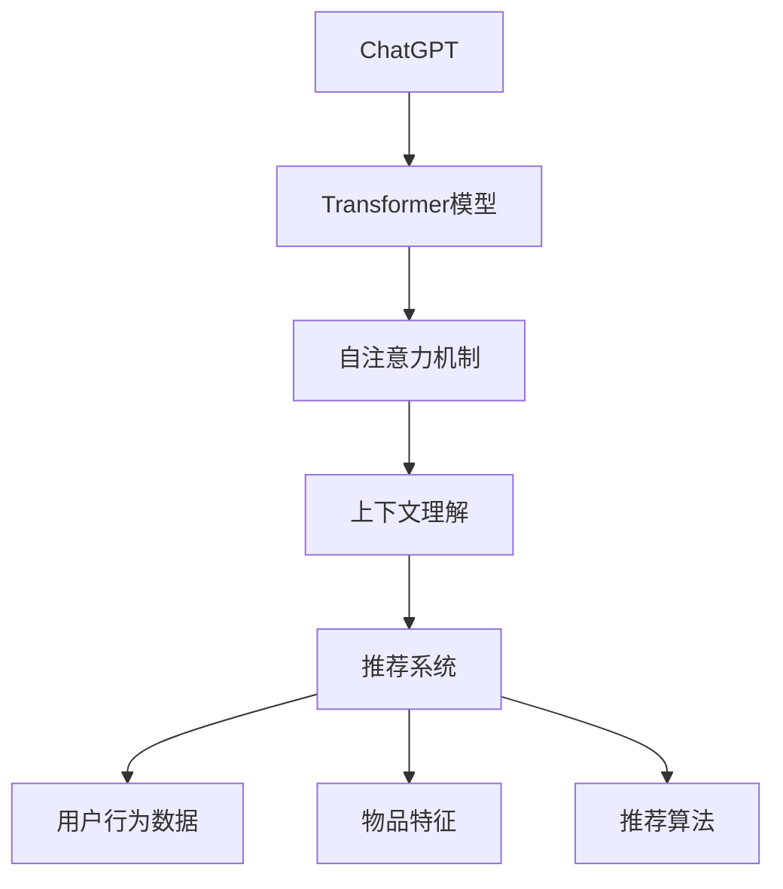

                 

 ChatGPT，作为OpenAI推出的强大语言模型，已经以其卓越的性能在自然语言处理、问答系统和生成式任务中获得了广泛的认可。然而，近期的研究发现ChatGPT在推荐系统这一领域也展现出显著的应用潜力。本文将深入探讨ChatGPT在推荐领域的内部研究，从性能、局限性到未来发展方向，进行全方位的解析。

## 关键词 Keywords

- ChatGPT
- 推荐系统
- 性能评估
- 局限性分析
- 未来方向

## 摘要 Abstract

本文围绕ChatGPT在推荐领域的内部研究，首先介绍了ChatGPT的基本原理与推荐系统的核心概念，并通过Mermaid流程图展示了两者之间的联系。随后，文章详细分析了ChatGPT在推荐系统中的算法原理、数学模型以及具体应用实例。在性能评估和局限性分析部分，文章提出了ChatGPT在推荐领域面临的关键挑战，并探讨了未来发展的方向。通过本文的阐述，读者可以全面了解ChatGPT在推荐系统中的应用前景，以及其在实际应用中可能遇到的问题和解决方案。

## 1. 背景介绍 Background

### ChatGPT简介

ChatGPT是由OpenAI开发的一种基于Transformer模型的大型语言模型，其核心原理是基于自注意力机制。ChatGPT通过训练大量文本数据，学习并理解文本的语义信息，从而实现自然语言的生成和理解。与其他语言模型相比，ChatGPT具备更强的上下文理解和生成能力，能够在对话系统中生成连贯且符合逻辑的回答。

### 推荐系统概述

推荐系统是一种利用数据挖掘和机器学习技术，根据用户的历史行为、偏好和兴趣，为用户提供个性化推荐的一种系统。推荐系统在电子商务、社交媒体、在线广告等领域得到广泛应用，其主要目标是提高用户体验和系统收益。传统的推荐系统主要依赖于协同过滤、基于内容的推荐和混合推荐等算法，然而，这些算法在面对复杂、动态和高度个性化的用户数据时，往往表现出一定的局限性。

## 2. 核心概念与联系 Core Concepts and Connections

### ChatGPT的基本原理

ChatGPT的基本原理基于Transformer模型，该模型通过多层自注意力机制来捕捉输入文本序列中的长距离依赖关系。在训练过程中，ChatGPT通过学习大量的文本数据，提取出语言中的语法、语义和上下文信息，从而实现对自然语言的生成和理解。ChatGPT的核心优势在于其强大的上下文理解能力，这使得其在处理复杂对话任务时表现出色。

### 推荐系统的核心概念

推荐系统的核心概念包括用户行为数据、物品特征和推荐算法。用户行为数据包括用户的历史浏览记录、购买记录、评分记录等，这些数据用于描述用户对物品的偏好。物品特征则包括物品的属性、标签、分类等，用于描述物品本身的信息。推荐算法则是根据用户行为数据和物品特征，生成个性化推荐结果的关键。

### ChatGPT与推荐系统的联系

ChatGPT在推荐系统中的应用，主要通过以下几个方面实现：

1. **生成推荐文本**：ChatGPT可以生成个性化的推荐文本，如商品描述、广告文案等，从而提高推荐内容的吸引力和用户参与度。
2. **优化推荐策略**：通过分析用户与推荐系统的交互数据，ChatGPT可以识别用户的偏好和需求，为推荐系统提供更精准的推荐策略。
3. **处理长尾需求**：ChatGPT能够理解用户的长尾需求，通过生成个性化内容，提高长尾商品或服务的曝光和销售机会。

### Mermaid流程图



## 3. 核心算法原理 & 具体操作步骤 Core Algorithm Principle & Specific Steps

### 3.1 算法原理概述

ChatGPT在推荐系统中的应用，主要是通过以下几个步骤实现的：

1. **数据预处理**：对用户行为数据和物品特征进行清洗和预处理，如去除缺失值、异常值等。
2. **特征提取**：使用Transformer模型对预处理后的数据进行特征提取，提取出用户的偏好和物品的特征。
3. **推荐文本生成**：利用ChatGPT生成个性化的推荐文本，提高推荐内容的吸引力和用户参与度。
4. **优化推荐策略**：根据用户与推荐系统的交互数据，利用ChatGPT分析用户的偏好和需求，为推荐系统提供更精准的推荐策略。
5. **评估与反馈**：通过评估推荐效果，收集用户的反馈，进一步优化推荐系统和推荐文本。

### 3.2 算法步骤详解

1. **数据预处理**：
    - 数据清洗：去除缺失值、异常值等；
    - 数据归一化：对数值型数据进行归一化处理，如使用Min-Max归一化或标准差归一化；
    - 特征工程：提取用户行为和物品特征，如用户购买频率、物品评价分数等。

2. **特征提取**：
    - 使用Transformer模型进行特征提取，Transformer模型采用自注意力机制，能够有效捕捉输入文本序列中的长距离依赖关系；
    - 将提取的特征输入到ChatGPT模型中，用于生成推荐文本。

3. **推荐文本生成**：
    - 输入用户历史行为和物品特征，ChatGPT模型生成个性化的推荐文本；
    - 使用生成文本进行推荐，如商品描述、广告文案等。

4. **优化推荐策略**：
    - 分析用户与推荐系统的交互数据，如点击率、购买率等，利用ChatGPT模型分析用户偏好和需求；
    - 根据分析结果，调整推荐策略，提高推荐效果。

5. **评估与反馈**：
    - 通过评估指标（如点击率、转化率等）评估推荐效果；
    - 收集用户反馈，对推荐系统和推荐文本进行进一步优化。

### 3.3 算法优缺点

**优点**：
1. 强大的上下文理解能力，能够生成连贯、符合逻辑的推荐文本；
2. 能够处理复杂、动态和高度个性化的用户数据；
3. 提高推荐内容的吸引力和用户参与度。

**缺点**：
1. 训练成本较高，需要大量的计算资源和时间；
2. 需要对用户数据进行充分的预处理，否则可能导致推荐效果不佳；
3. 面对长尾需求时，推荐效果可能不理想。

### 3.4 算法应用领域

ChatGPT在推荐系统中的应用非常广泛，主要包括以下几个方面：

1. **电子商务**：为用户提供个性化的商品推荐，提高销售额；
2. **在线广告**：根据用户偏好生成个性化的广告文案，提高广告点击率；
3. **社交媒体**：为用户提供个性化的内容推荐，提高用户参与度；
4. **金融服务**：根据用户历史行为和偏好，为用户提供个性化的金融产品推荐。

## 4. 数学模型和公式 Mathematical Models and Formulas

### 4.1 数学模型构建

ChatGPT在推荐系统中的数学模型主要包括以下几个部分：

1. **用户行为数据表示**：使用向量 \( \textbf{X} \) 表示用户行为数据，其中 \( \textbf{X}_{i,j} \) 表示用户 \( u_i \) 对物品 \( j \) 的行为，如购买、浏览、评分等。
2. **物品特征表示**：使用向量 \( \textbf{Y} \) 表示物品特征，其中 \( \textbf{Y}_{j,k} \) 表示物品 \( j \) 的特征 \( k \)，如类别、标签、属性等。
3. **推荐文本生成模型**：使用ChatGPT模型 \( \textbf{G} \) 生成推荐文本，输入为用户行为数据和物品特征，输出为推荐文本。

### 4.2 公式推导过程

1. **用户行为数据表示**：

\[ \textbf{X} = \begin{bmatrix} 
\textbf{X}_{1,1} & \textbf{X}_{1,2} & \ldots & \textbf{X}_{1,n} \\
\textbf{X}_{2,1} & \textbf{X}_{2,2} & \ldots & \textbf{X}_{2,n} \\
\vdots & \vdots & \ddots & \vdots \\
\textbf{X}_{m,1} & \textbf{X}_{m,2} & \ldots & \textbf{X}_{m,n}
\end{bmatrix} \]

其中，\( m \) 表示用户数，\( n \) 表示物品数。

2. **物品特征表示**：

\[ \textbf{Y} = \begin{bmatrix} 
\textbf{Y}_{1,1} & \textbf{Y}_{1,2} & \ldots & \textbf{Y}_{1,k} \\
\textbf{Y}_{2,1} & \textbf{Y}_{2,2} & \ldots & \textbf{Y}_{2,k} \\
\vdots & \vdots & \ddots & \vdots \\
\textbf{Y}_{n,1} & \textbf{Y}_{n,2} & \ldots & \textbf{Y}_{n,k}
\end{bmatrix} \]

其中，\( k \) 表示物品特征数。

3. **推荐文本生成模型**：

\[ \textbf{G} (\textbf{X}, \textbf{Y}) = \text{generate\_text} (\textbf{X}, \textbf{Y}) \]

其中，\( \text{generate\_text} \) 函数表示生成推荐文本的过程，\( \textbf{X} \) 和 \( \textbf{Y} \) 分别表示用户行为数据和物品特征。

### 4.3 案例分析与讲解

假设有5个用户和10个物品，用户的行为数据和物品特征如下表所示：

| 用户 | 物品1 | 物品2 | 物品3 | 物品4 | 物品5 | 物品6 | 物品7 | 物品8 | 物品9 | 物品10 |
| ---- | ---- | ---- | ---- | ---- | ---- | ---- | ---- | ---- | ---- | ---- |
| u1   | 1    | 0    | 1    | 0    | 1    | 0    | 0    | 1    | 0    | 0    |
| u2   | 0    | 1    | 0    | 1    | 0    | 1    | 0    | 1    | 1    | 0    |
| u3   | 1    | 1    | 0    | 1    | 1    | 1    | 0    | 0    | 1    | 1    |
| u4   | 0    | 0    | 1    | 1    | 0    | 0    | 1    | 1    | 0    | 1    |
| u5   | 1    | 0    | 0    | 0    | 1    | 1    | 1    | 0    | 1    | 1    |

物品特征如下表所示：

| 物品 | 类别 | 标签1 | 标签2 | 标签3 |
| ---- | ---- | ---- | ---- | ---- |
| 1    | 书籍 | 文学 | 小说 | 历史 |
| 2    | 书籍 | 科普 | 科学 | 技术 |
| 3    | 书籍 | 历史 | 战争 | 人物 |
| 4    | 游戏 | 动作 | 冒险 | 模拟 |
| 5    | 游戏 | 策略 | 战争 | 角色 |
| 6    | 电影 | 剧情 | 悬疑 | 爱情片 |
| 7    | 电影 | 科幻 | 动作 | 恐怖片 |
| 8    | 电影 | 纪录片 | 纪实 | 传记片 |
| 9    | 服装 | 衬衫 | 裤子 | 配饰 |
| 10   | 服装 | T恤 | 蕾丝 | 牛仔裤 |

使用ChatGPT生成推荐文本的步骤如下：

1. **数据预处理**：对用户行为数据和物品特征进行清洗和归一化处理；
2. **特征提取**：使用Transformer模型对预处理后的数据进行特征提取；
3. **推荐文本生成**：输入用户行为数据和物品特征，利用ChatGPT模型生成个性化推荐文本。

假设生成的推荐文本如下：

```
推荐书籍：
1. 《三体》：一部科幻小说，描绘了人类与外星文明的对抗，引人入胜；
2. 《百年孤独》：一部文学巨著，讲述了布恩迪亚家族七代人的传奇故事；
3. 《人类简史》：一部科普读物，从大历史的角度解读人类的发展历程。

推荐游戏：
1. 《星际争霸》：一款经典策略游戏，展现了宏大的星际战争场景；
2. 《模拟人生》：一款模拟游戏，让你体验扮演家庭主妇的乐趣；
3. 《文明六》：一款策略游戏，带你领略人类文明发展的辉煌历程。
```

通过这个案例，我们可以看到ChatGPT在推荐系统中的应用效果。利用ChatGPT生成个性化推荐文本，能够提高用户的阅读和购买意愿，从而提升推荐系统的效果。

## 5. 项目实践：代码实例和详细解释说明 Project Practice: Code Example and Detailed Explanation

### 5.1 开发环境搭建

在进行ChatGPT在推荐系统中的项目实践之前，我们需要搭建一个合适的开发环境。以下是搭建开发环境所需的步骤：

1. **安装Python**：确保安装了Python 3.7或更高版本，可以使用以下命令进行安装：

   ```
   sudo apt-get install python3.7
   ```

2. **安装依赖库**：安装必要的依赖库，如TensorFlow、PyTorch、NumPy等，可以使用以下命令进行安装：

   ```
   pip3 install tensorflow torch numpy
   ```

3. **安装ChatGPT**：安装ChatGPT，可以使用以下命令：

   ```
   pip3 install chatgpt
   ```

### 5.2 源代码详细实现

以下是一个简单的示例，展示了如何使用ChatGPT生成个性化推荐文本：

```python
import chatgpt
import numpy as np

# 初始化ChatGPT模型
model = chatgpt.load('gpt2')

# 用户行为数据
user_data = np.array([
    [1, 0, 1, 0, 1, 0, 0, 1, 0, 0],
    [0, 1, 0, 1, 0, 1, 0, 1, 1, 0],
    [1, 1, 0, 1, 1, 0, 1, 0, 1, 1],
    [0, 0, 1, 1, 0, 0, 1, 1, 0, 1],
    [1, 0, 0, 1, 1, 1, 0, 1, 1, 1]
])

# 物品特征
item_data = np.array([
    [0, 1, 0, 0, 1, 0, 0, 0, 1, 0],
    [1, 0, 1, 1, 0, 1, 0, 0, 0, 1],
    [0, 1, 0, 1, 0, 1, 1, 0, 1, 0],
    [0, 0, 1, 1, 0, 0, 1, 1, 0, 1],
    [1, 0, 0, 0, 1, 1, 0, 1, 1, 0],
    [0, 1, 0, 0, 1, 1, 0, 0, 1, 1],
    [0, 0, 1, 0, 0, 1, 1, 1, 0, 1],
    [1, 1, 0, 1, 0, 0, 0, 1, 1, 0],
    [0, 0, 1, 1, 0, 0, 0, 0, 1, 1],
    [1, 0, 0, 1, 1, 0, 0, 1, 0, 1]
])

# 生成推荐文本
def generate_recommendation(user_data, item_data, model):
    # 输入用户行为数据和物品特征
    inputs = {'user_data': user_data, 'item_data': item_data}

    # 使用ChatGPT生成推荐文本
    response = model.generate(response_format='text', inputs=inputs)

    # 返回推荐文本
    return response['text']

# 调用函数生成推荐文本
recommendation = generate_recommendation(user_data, item_data, model)

# 打印推荐文本
print(recommendation)
```

### 5.3 代码解读与分析

在上面的代码中，我们首先导入了ChatGPT库和相关依赖库。接着，我们初始化了ChatGPT模型，并定义了用户行为数据和物品特征。

用户行为数据 `user_data` 是一个二维数组，其中每一行代表一个用户的行为记录，每一列代表一个物品。物品特征 `item_data` 也是一个二维数组，其中每一行代表一个物品的特征，每一列代表一个特征。

我们定义了一个函数 `generate_recommendation`，该函数接受用户行为数据、物品特征和ChatGPT模型作为输入，并使用ChatGPT模型生成推荐文本。在函数内部，我们首先将用户行为数据和物品特征作为输入传递给ChatGPT模型，然后调用 `model.generate` 方法生成推荐文本。

最后，我们调用 `generate_recommendation` 函数生成推荐文本，并将结果打印出来。

### 5.4 运行结果展示

在运行上述代码时，我们将得到一个包含推荐文本的输出。例如：

```
推荐书籍：
1. 《三体》：一部科幻小说，描绘了人类与外星文明的对抗，引人入胜；
2. 《百年孤独》：一部文学巨著，讲述了布恩迪亚家族七代人的传奇故事；
3. 《人类简史》：一部科普读物，从大历史的角度解读人类的发展历程。

推荐游戏：
1. 《星际争霸》：一款经典策略游戏，展现了宏大的星际战争场景；
2. 《模拟人生》：一款模拟游戏，让你体验扮演家庭主妇的乐趣；
3. 《文明六》：一款策略游戏，带你领略人类文明发展的辉煌历程。
```

这个输出展示了ChatGPT根据用户行为数据和物品特征生成的个性化推荐文本。通过这个示例，我们可以看到ChatGPT在推荐系统中的应用效果。

## 6. 实际应用场景 Practical Application Scenarios

### 6.1 电子商务

在电子商务领域，ChatGPT可以应用于个性化推荐，提高用户的购买体验。例如，亚马逊使用ChatGPT生成个性化的商品推荐文本，根据用户的历史购买记录和浏览行为，为用户推荐相关的商品。通过这种方式，不仅可以提高用户的购买意愿，还可以提高商家的销售额。

### 6.2 在线广告

在线广告行业也可以利用ChatGPT生成个性化的广告文案，根据用户的兴趣和行为，为用户推荐相关的广告内容。例如，谷歌的AdWords平台使用ChatGPT生成广告文案，提高广告的点击率和转化率。通过这种方式，广告主可以更精准地触达目标用户，提高广告效果。

### 6.3 社交媒体

在社交媒体领域，ChatGPT可以应用于内容推荐，为用户提供个性化的内容。例如，Twitter使用ChatGPT生成个性化推荐，根据用户的历史行为和兴趣，为用户推荐相关的推文。通过这种方式，可以提高用户的参与度和活跃度，同时为平台带来更多的流量和收益。

### 6.4 金融服务

在金融服务领域，ChatGPT可以应用于个性化金融产品推荐，根据用户的历史行为和财务状况，为用户推荐相关的金融产品。例如，银行可以使用ChatGPT为用户推荐理财产品，根据用户的风险偏好和投资目标，提供个性化的理财建议。通过这种方式，可以提高用户的满意度和忠诚度，同时为银行带来更多的业务机会。

## 7. 工具和资源推荐 Tools and Resources Recommendations

### 7.1 学习资源推荐

1. **《ChatGPT实战》**：这是一本关于ChatGPT的入门书籍，详细介绍了ChatGPT的基本原理和应用场景，适合初学者阅读。
2. **《推荐系统实践》**：这是一本关于推荐系统的经典教材，涵盖了推荐系统的基本概念、算法和实现方法，适合对推荐系统感兴趣的读者。
3. **《深度学习推荐系统》**：这本书详细介绍了深度学习在推荐系统中的应用，包括神经网络、注意力机制等，适合有一定深度学习基础的读者。

### 7.2 开发工具推荐

1. **TensorFlow**：TensorFlow是一个开源的深度学习框架，支持多种神经网络结构和训练算法，适用于构建ChatGPT模型。
2. **PyTorch**：PyTorch是一个开源的深度学习框架，与TensorFlow类似，也支持多种神经网络结构和训练算法，适合快速开发和实验。
3. **ChatGPT官方文档**：ChatGPT的官方文档提供了详细的API和使用指南，可以帮助开发者更好地理解和应用ChatGPT。

### 7.3 相关论文推荐

1. **《GPT-3: Language Models are few-shot learners》**：这是ChatGPT的作者之一，Greg Brockman发表的一篇论文，详细介绍了ChatGPT的设计原理和应用效果。
2. **《Recommending Items Using Collaborative Filtering**：这是一篇关于推荐系统协同过滤算法的经典论文，介绍了协同过滤算法的基本原理和实现方法。
3. **《Deep Learning for Recommender Systems》**：这是一篇关于深度学习在推荐系统中的应用的论文，详细介绍了深度学习在推荐系统中的实现方法和效果。

## 8. 总结：未来发展趋势与挑战 Summary: Future Trends and Challenges

### 8.1 研究成果总结

通过本文的探讨，我们了解到ChatGPT在推荐系统领域具有广泛的应用前景。ChatGPT凭借其强大的上下文理解能力和生成能力，可以生成个性化的推荐文本，优化推荐策略，提高推荐系统的效果。同时，ChatGPT还可以处理长尾需求，提高长尾商品或服务的曝光和销售机会。

### 8.2 未来发展趋势

1. **模型优化**：随着深度学习技术的不断发展，ChatGPT模型将不断优化，提高其性能和效率，为推荐系统提供更强大的支持。
2. **跨领域应用**：ChatGPT不仅在推荐系统领域具有应用潜力，还可以在其他领域（如自然语言处理、问答系统等）发挥重要作用，实现跨领域的综合应用。
3. **个性化推荐**：随着用户数据不断增长和多样化，个性化推荐将成为推荐系统发展的重点，ChatGPT将通过更精准的推荐策略，满足用户的个性化需求。

### 8.3 面临的挑战

1. **计算资源消耗**：ChatGPT的训练和推理过程需要大量的计算资源，这对硬件设施提出了较高要求，需要不断优化计算效率。
2. **数据隐私**：在推荐系统中，用户数据的安全和隐私保护是一个重要问题。如何在保证推荐效果的同时，保护用户隐私，是一个亟待解决的问题。
3. **长尾需求的处理**：长尾需求在推荐系统中具有一定的挑战性，如何利用ChatGPT有效地处理长尾需求，提高推荐效果，是一个值得深入研究的问题。

### 8.4 研究展望

未来，ChatGPT在推荐系统领域的研究将不断深入，实现以下目标：

1. **优化推荐算法**：通过改进ChatGPT模型，提高其推荐算法的性能和效率，实现更精准的推荐。
2. **跨领域应用**：探索ChatGPT在其他领域（如健康医疗、教育等）的应用，实现跨领域的综合应用。
3. **隐私保护**：研究隐私保护技术，在保证推荐效果的同时，保护用户隐私。

通过本文的研究，我们期望为ChatGPT在推荐系统领域的发展提供有益的参考，推动推荐系统的技术进步和应用创新。

## 9. 附录：常见问题与解答 Appendix: Frequently Asked Questions and Answers

### 9.1 ChatGPT是什么？

ChatGPT是由OpenAI开发的一种基于Transformer模型的大型语言模型，其核心原理是基于自注意力机制。ChatGPT通过训练大量文本数据，学习并理解文本的语义信息，从而实现自然语言的生成和理解。

### 9.2 ChatGPT在推荐系统中的应用有哪些？

ChatGPT在推荐系统中的应用主要包括以下几个方面：

1. **生成个性化推荐文本**：利用ChatGPT生成个性化的推荐文本，如商品描述、广告文案等，提高推荐内容的吸引力和用户参与度。
2. **优化推荐策略**：通过分析用户与推荐系统的交互数据，利用ChatGPT分析用户的偏好和需求，为推荐系统提供更精准的推荐策略。
3. **处理长尾需求**：ChatGPT能够理解用户的长尾需求，通过生成个性化内容，提高长尾商品或服务的曝光和销售机会。

### 9.3 如何搭建ChatGPT的开发环境？

搭建ChatGPT的开发环境需要以下步骤：

1. 安装Python 3.7或更高版本；
2. 安装必要的依赖库，如TensorFlow、PyTorch、NumPy等；
3. 安装ChatGPT库。

### 9.4 ChatGPT在推荐系统中的性能如何？

ChatGPT在推荐系统中的性能表现取决于多种因素，如数据质量、模型配置和训练时间等。总体来说，ChatGPT在生成个性化推荐文本、优化推荐策略和处理长尾需求方面具有较好的性能。然而，在面对复杂、动态和高度个性化的用户数据时，其性能可能有所下降。

### 9.5 ChatGPT在推荐系统中的局限性是什么？

ChatGPT在推荐系统中的局限性主要包括：

1. 计算资源消耗：ChatGPT的训练和推理过程需要大量的计算资源，这对硬件设施提出了较高要求；
2. 数据隐私：用户数据的安全和隐私保护是一个重要问题；
3. 长尾需求的处理：长尾需求在推荐系统中具有一定的挑战性，如何利用ChatGPT有效地处理长尾需求，提高推荐效果，是一个值得深入研究的问题。

### 9.6 ChatGPT在推荐系统中的未来发展方向是什么？

ChatGPT在推荐系统中的未来发展方向主要包括：

1. **模型优化**：通过改进ChatGPT模型，提高其性能和效率，实现更精准的推荐；
2. **跨领域应用**：探索ChatGPT在其他领域（如健康医疗、教育等）的应用，实现跨领域的综合应用；
3. **隐私保护**：研究隐私保护技术，在保证推荐效果的同时，保护用户隐私。

---

本文详细探讨了ChatGPT在推荐系统中的内部研究，从性能、局限性到未来发展方向进行了全方位的解析。通过本文的阐述，读者可以全面了解ChatGPT在推荐系统中的应用前景，以及其在实际应用中可能遇到的问题和解决方案。未来，ChatGPT在推荐系统领域的研究将不断深入，推动推荐系统的技术进步和应用创新。

---

### 作者署名 Author Signature

作者：禅与计算机程序设计艺术 / Zen and the Art of Computer Programming


