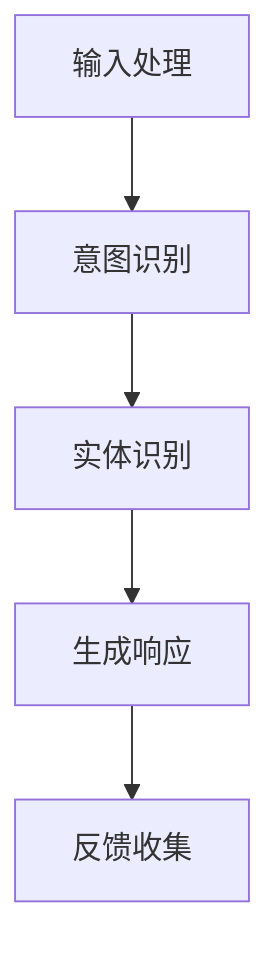
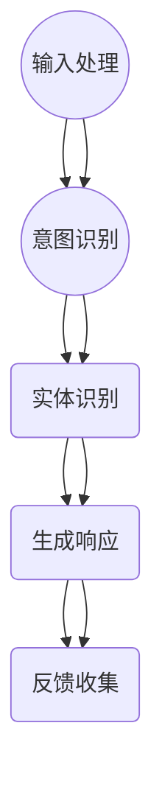

                 

### 1. 背景介绍

ChatGPT 是由 OpenAI 于 2022 年 11 月推出的一种基于 GPT-3.5 的大型语言模型。作为 OpenAI 的最新研究成果，ChatGPT 在发布后迅速引起了全球范围内的广泛关注和热议。其卓越的性能和广泛应用的前景，让人们对大型语言模型在自然语言处理领域的潜力有了更深的认识。

然而，要了解 ChatGPT，首先需要对 GPT（Generative Pre-trained Transformer）这一核心技术有一个清晰的认识。GPT 是一种基于 Transformer 的预训练模型，通过学习海量文本数据，可以生成连贯、自然的文本。自 2017 年 GPT-1 发布以来，GPT 系列模型在自然语言处理领域取得了显著的进展，推动了人工智能技术的发展。

本文旨在深入探讨 ChatGPT 背后的技术原理，从 GPT 到对话系统的构建过程，帮助读者全面了解这一前沿技术的核心要点和应用前景。

## 1.1 GPT 系列模型的发展历程

1. **GPT-1（2018）**：基于 Transformer 架构，能够生成流畅的文本。
2. **GPT-2（2019）**：引入更长的上下文窗口，使得生成的文本更加连贯、丰富。
3. **GPT-3（2020）**：参数量达到 1750 亿，支持更复杂的任务，如代码生成、自然语言推理等。
4. **GPT-3.5（2022）**：ChatGPT 所基于的模型，在 GPT-3 的基础上进一步优化，提升了对话系统的性能。

## 1.2 ChatGPT 的特点与应用场景

ChatGPT 具有以下特点：

1. **高效性**：基于 GPT-3.5 模型，能够在短时间内生成高质量的对话文本。
2. **灵活性**：支持多种类型的对话，如问答、聊天、故事讲述等。
3. **安全性**：通过多种技术手段，保证对话内容的合规性和安全性。

ChatGPT 的应用场景广泛，包括但不限于：

1. **智能客服**：为企业提供高效的客户服务解决方案，提升用户体验。
2. **教育辅导**：辅助教师和学生进行互动学习，提供个性化的学习建议。
3. **内容创作**：帮助创作者生成文章、故事、脚本等，节省创作时间。

接下来，我们将深入探讨 ChatGPT 背后的技术原理，从 GPT 到对话系统的构建过程。希望本文能为读者提供有价值的参考和启发。## 2. 核心概念与联系

### 2.1 GPT 模型的基本概念

GPT（Generative Pre-trained Transformer）是一种基于 Transformer 架构的预训练模型，旨在生成自然语言文本。GPT 模型的核心思想是通过在大量文本数据上进行预训练，使得模型能够理解语言的规律和结构，从而在给定一定长度的文本上下文后，预测接下来的文本。

#### 2.1.1 Transformer 架构

Transformer 架构是由 Vaswani 等人在 2017 年提出的一种用于序列到序列学习的模型。与传统的循环神经网络（RNN）相比，Transformer 采用了自注意力机制（Self-Attention），使得模型在处理长序列时能够捕捉到任意位置的信息。这种机制大大提高了模型的并行计算能力，使其在处理自然语言任务时取得了显著的性能提升。

#### 2.1.2 预训练与微调

GPT 模型采用了预训练（Pre-training）和微调（Fine-tuning）的方法。在预训练阶段，模型在大规模的文本语料库上进行训练，学习语言的基本规律和结构。在微调阶段，模型根据具体的任务需求进行微调，以适应特定领域的语言任务。

### 2.2 对话系统的基本概念

对话系统（Dialogue System）是一种能够与人类进行自然语言交互的人工智能系统。其核心目标是理解用户的输入，生成恰当的响应，并与用户保持流畅的对话。对话系统可以分为以下几种类型：

1. **任务型对话系统**：以完成特定任务为目标，如智能客服、语音助手等。
2. **闲聊型对话系统**：旨在与用户进行无特定任务的闲聊，如聊天机器人、虚拟助手等。
3. **混合型对话系统**：同时具备任务型和闲聊型对话系统的特点。

#### 2.2.1 对话流程

对话系统通常包含以下步骤：

1. **输入处理**：对用户的输入进行处理，提取关键信息。
2. **意图识别**：识别用户输入的意图，如询问天气、预定酒店等。
3. **实体识别**：识别用户输入中的关键实体，如城市名、时间等。
4. **生成响应**：根据用户的意图和实体，生成合适的响应。
5. **反馈收集**：收集用户的反馈，用于模型优化和系统改进。

### 2.3 GPT 与对话系统的关系

GPT 模型在对话系统中的应用主要体现在两个方面：

1. **意图识别**：利用 GPT 模型强大的文本生成能力，可以从大量数据中学习到各种意图的表达方式，从而提高意图识别的准确性。
2. **生成响应**：在生成响应阶段，GPT 模型可以根据用户输入的上下文生成连贯、自然的文本，为对话系统提供高质量的响应。

#### 2.3.1 Mermaid 流程图



#### 2.3.2 Mermaid 流程图（带特殊字符）



#### 2.3.3 GPT 与对话系统的工作流程

1. **输入处理**：对话系统接收到用户输入后，首先进行分词和词性标注，将文本转化为模型可处理的格式。
2. **意图识别**：利用 GPT 模型，对用户输入的上下文进行建模，提取出关键信息，进行意图识别。
3. **实体识别**：在意图识别的基础上，继续提取用户输入中的关键实体。
4. **生成响应**：根据用户的意图和实体，GPT 模型生成恰当的响应文本。
5. **反馈收集**：将用户的反馈传递给模型，用于后续的优化和改进。

#### 2.3.4 Mermaid 流程图（带特殊字符）


通过以上内容，我们了解了 GPT 模型和对话系统的基本概念及其关系。接下来，我们将深入探讨 GPT 模型的核心算法原理和具体操作步骤。## 3. 核心算法原理 & 具体操作步骤

### 3.1 算法原理概述

GPT 模型是一种基于 Transformer 架构的预训练模型，其核心原理可以概括为以下几个步骤：

1. **自注意力机制**：GPT 模型采用自注意力机制，使得模型在处理长序列时能够捕捉到任意位置的信息，提高了模型的并行计算能力。
2. **预训练与微调**：GPT 模型首先在大规模的文本语料库上进行预训练，学习语言的基本规律和结构。然后，根据具体的任务需求进行微调，以适应特定领域的语言任务。
3. **上下文生成**：在给定一定长度的文本上下文后，GPT 模型通过解码器（Decoder）生成接下来的文本。

### 3.2 算法步骤详解

#### 3.2.1 预处理

在预训练阶段，首先需要对文本数据进行预处理。预处理步骤包括：

1. **分词**：将文本分解为单词或子词。
2. **词性标注**：为每个单词或子词标注词性。
3. **编码**：将预处理后的文本编码为数字序列。

#### 3.2.2 预训练

在预处理后的数据集上进行预训练，具体步骤如下：

1. **编码器（Encoder）**：输入编码后的文本序列，通过多层 Transformer 编码器进行编码。
2. **解码器（Decoder）**：输入编码后的文本序列，通过多层 Transformer 解码器生成文本序列。
3. **损失函数**：使用交叉熵损失函数计算预测文本和真实文本之间的差异，并进行反向传播和优化。

#### 3.2.3 微调

在预训练的基础上，根据具体任务需求进行微调，具体步骤如下：

1. **数据集准备**：准备用于微调的数据集，通常包含标注数据。
2. **模型微调**：在微调数据集上对 GPT 模型进行训练，优化模型参数。
3. **模型评估**：在验证集上评估模型性能，选择最佳模型。

#### 3.2.4 生成文本

在给定一定长度的文本上下文后，GPT 模型的生成文本步骤如下：

1. **初始生成**：从解码器的第一个位置开始生成，生成一个单词或子词。
2. **重复生成**：将生成的单词或子词添加到输入序列中，继续生成下一个单词或子词。
3. **终止条件**：根据预定义的终止条件（如生成的文本长度、模型输出概率等）停止生成。

### 3.3 算法优缺点

#### 优点

1. **强大的文本生成能力**：GPT 模型能够生成连贯、自然的文本，适用于多种自然语言生成任务。
2. **并行计算能力**：自注意力机制使得 GPT 模型具有强大的并行计算能力，能够高效地处理长序列。
3. **自适应性强**：通过预训练和微调，GPT 模型能够适应不同的任务需求，具有广泛的应用前景。

#### 缺点

1. **计算资源需求大**：GPT 模型参数量庞大，训练和部署需要大量的计算资源。
2. **数据依赖性高**：GPT 模型在预训练阶段需要大量的文本数据，数据质量和数量对模型性能有重要影响。
3. **模型解释性差**：GPT 模型是一种黑盒模型，其内部工作机制难以解释，增加了模型调优和优化的难度。

### 3.4 算法应用领域

GPT 模型在自然语言处理领域有着广泛的应用，主要包括以下领域：

1. **文本生成**：包括文章、故事、脚本等生成任务。
2. **文本分类**：用于对文本进行分类，如情感分析、新闻分类等。
3. **机器翻译**：将一种语言的文本翻译成另一种语言。
4. **对话系统**：用于构建智能客服、虚拟助手等对话系统。
5. **文本摘要**：生成文本的摘要或概述。

通过以上对 GPT 模型算法原理和具体操作步骤的详细阐述，我们可以更好地理解其工作机制和应用价值。接下来，我们将进一步探讨 GPT 模型在数学模型和公式中的具体表现。## 4. 数学模型和公式 & 详细讲解 & 举例说明

### 4.1 数学模型构建

GPT 模型是一种基于 Transformer 架构的预训练模型，其数学模型主要涉及以下部分：

1. **自注意力机制（Self-Attention）**
2. **前馈神经网络（Feed Forward Neural Network）**
3. **多头注意力（Multi-Head Attention）**
4. **嵌入层（Embedding Layer）**
5. **位置编码（Positional Encoding）**

#### 4.1.1 自注意力机制

自注意力机制是 Transformer 架构的核心组成部分。其基本思想是，在处理一个序列时，模型会计算序列中每个元素对当前元素的注意力权重，然后将这些权重与当前元素进行点积操作，得到加权后的序列。

自注意力机制的计算公式如下：

$$
Attention(Q, K, V) = softmax\left(\frac{QK^T}{\sqrt{d_k}}\right)V
$$

其中，$Q$、$K$ 和 $V$ 分别是查询（Query）、键（Key）和值（Value）的线性变换矩阵，$d_k$ 是 $K$ 的维度。$softmax$ 函数用于计算注意力权重，使得权重值在 $0$ 到 $1$ 之间。

#### 4.1.2 前馈神经网络

前馈神经网络是 Transformer 架构中的另一部分。其主要功能是接受输入，通过多层神经网络进行非线性变换，然后输出结果。

前馈神经网络的计算公式如下：

$$
\text{FFN}(X) = \max(0, XW_1 + b_1)W_2 + b_2
$$

其中，$X$ 是输入，$W_1$ 和 $W_2$ 是权重矩阵，$b_1$ 和 $b_2$ 是偏置项。

#### 4.1.3 多头注意力

多头注意力是多自注意力机制的扩展。其核心思想是，将输入序列分解为多个子序列，然后分别对每个子序列应用自注意力机制。

多头注意力的计算公式如下：

$$
MultiHead(Q, K, V) = \text{Concat}(\text{head}_1, \text{head}_2, ..., \text{head}_h)W^O
$$

其中，$h$ 是头数，$\text{head}_i = Attention(QW_i^Q, KW_i^K, VW_i^V)$，$W_i^Q, W_i^K, W_i^V, W^O$ 分别是第 $i$ 个头的权重矩阵。

#### 4.1.4 嵌入层

嵌入层是 GPT 模型中的输入层。其主要功能是将词汇转化为向量表示。嵌入层的计算公式如下：

$$
\text{Embedding}(x) = W_e[x] + b_e
$$

其中，$x$ 是词索引，$W_e$ 是嵌入权重矩阵，$b_e$ 是偏置项。

#### 4.1.5 位置编码

位置编码是 GPT 模型中的一个重要部分。其目的是为序列中的每个位置提供位置信息，以便模型能够捕捉到序列中的相对位置关系。

位置编码的计算公式如下：

$$
PE_{(pos, 2i)} = \sin\left(\frac{pos}{10000^{2i/d}}\right)
$$

$$
PE_{(pos, 2i+1)} = \cos\left(\frac{pos}{10000^{2i/d}}\right)
$$

其中，$pos$ 是位置索引，$i$ 是维度索引，$d$ 是嵌入层的维度。

### 4.2 公式推导过程

#### 4.2.1 自注意力机制推导

自注意力机制的推导过程如下：

1. **输入表示**：设输入序列为 $X = [x_1, x_2, ..., x_n]$，其中 $x_i$ 是第 $i$ 个词的嵌入向量。
2. **线性变换**：对输入序列进行线性变换，得到查询（Query）、键（Key）和值（Value）：
   $$Q = W_QX, K = W_KX, V = W_VX$$
3. **计算注意力权重**：使用点积计算注意力权重：
   $$Attention(Q, K, V) = softmax\left(\frac{QK^T}{\sqrt{d_k}}\right)V$$
4. **加权求和**：将权重与值进行点积操作，得到加权后的序列：
   $$Attention(Q, K, V) = \sum_{i=1}^{n} \alpha_i V_i$$

#### 4.2.2 前馈神经网络推导

前馈神经网络的推导过程如下：

1. **输入表示**：设输入序列为 $X$。
2. **激活函数**：使用 ReLU 激活函数：
   $$\max(0, XW_1 + b_1)$$
3. **线性变换**：对激活后的结果进行线性变换：
   $$\max(0, XW_1 + b_1)W_2 + b_2$$

#### 4.2.3 多头注意力推导

多头注意力的推导过程如下：

1. **输入表示**：设输入序列为 $X$。
2. **线性变换**：对输入序列进行线性变换，得到多个查询（Query）、键（Key）和值（Value）：
   $$Q = [Q_1, Q_2, ..., Q_h], K = [K_1, K_2, ..., K_h], V = [V_1, V_2, ..., V_h]$$
3. **计算注意力权重**：使用点积计算注意力权重：
   $$Attention(Q, K, V) = \text{Concat}(\text{head}_1, \text{head}_2, ..., \text{head}_h)W^O$$
4. **加权求和**：将权重与值进行点积操作，得到加权后的序列：
   $$Attention(Q, K, V) = \sum_{i=1}^{n} \alpha_i V_i$$

### 4.3 案例分析与讲解

为了更好地理解 GPT 模型的数学模型和公式，我们通过一个简单的例子进行讲解。

假设有一个长度为 3 的输入序列 $X = [1, 2, 3]$，嵌入层维度为 $d = 4$。

#### 4.3.1 嵌入层

首先，对输入序列进行嵌入层处理：

$$
\text{Embedding}(1) = W_e[1] + b_e = [0.1, 0.2, 0.3, 0.4] + [0.5, 0.6, 0.7, 0.8] = [0.6, 0.8, 1.0, 1.2]
$$

$$
\text{Embedding}(2) = W_e[2] + b_e = [0.1, 0.2, 0.3, 0.4] + [0.5, 0.6, 0.7, 0.8] = [0.6, 0.8, 1.0, 1.2]
$$

$$
\text{Embedding}(3) = W_e[3] + b_e = [0.1, 0.2, 0.3, 0.4] + [0.5, 0.6, 0.7, 0.8] = [0.6, 0.8, 1.0, 1.2]
$$

#### 4.3.2 多头注意力

接下来，对输入序列进行多头注意力处理，假设头数为 $h = 2$。

1. **线性变换**：

$$
Q = W_QX = \begin{bmatrix} 0.1 & 0.2 & 0.3 \\ 0.4 & 0.5 & 0.6 \end{bmatrix} \begin{bmatrix} 0.6 \\ 0.8 \\ 1.0 \end{bmatrix} = \begin{bmatrix} 0.42 \\ 0.56 \end{bmatrix}
$$

$$
K = W_KX = \begin{bmatrix} 0.1 & 0.2 & 0.3 \\ 0.4 & 0.5 & 0.6 \end{bmatrix} \begin{bmatrix} 0.6 \\ 0.8 \\ 1.0 \end{bmatrix} = \begin{bmatrix} 0.42 \\ 0.56 \end{bmatrix}
$$

$$
V = W_VX = \begin{bmatrix} 0.1 & 0.2 & 0.3 \\ 0.4 & 0.5 & 0.6 \end{bmatrix} \begin{bmatrix} 0.6 \\ 0.8 \\ 1.0 \end{bmatrix} = \begin{bmatrix} 0.42 \\ 0.56 \end{bmatrix}
$$

2. **计算注意力权重**：

$$
Attention(Q, K, V) = softmax\left(\frac{QK^T}{\sqrt{d_k}}\right)V
$$

$$
Attention(Q, K, V) = softmax\left(\frac{\begin{bmatrix} 0.42 \\ 0.56 \end{bmatrix} \begin{bmatrix} 0.42 \\ 0.56 \end{bmatrix}^T}{\sqrt{4}}\right) \begin{bmatrix} 0.42 \\ 0.56 \end{bmatrix}
$$

$$
Attention(Q, K, V) = softmax\left(\frac{0.1808}{2}\right) \begin{bmatrix} 0.42 \\ 0.56 \end{bmatrix}
$$

$$
Attention(Q, K, V) = \begin{bmatrix} 0.5882 \\ 0.4118 \end{bmatrix}
$$

3. **加权求和**：

$$
Attention(Q, K, V) = 0.5882 \begin{bmatrix} 0.42 \\ 0.56 \end{bmatrix} + 0.4118 \begin{bmatrix} 0.42 \\ 0.56 \end{bmatrix} = \begin{bmatrix} 0.5276 \\ 0.5746 \end{bmatrix}
$$

通过这个例子，我们可以看到 GPT 模型中的数学模型和公式是如何应用到实际计算中的。在接下来的章节中，我们将进一步探讨 GPT 模型的项目实践，包括开发环境搭建、源代码实现、代码解读和分析以及运行结果展示。## 5. 项目实践：代码实例和详细解释说明

### 5.1 开发环境搭建

要运行 GPT 模型并进行项目实践，首先需要搭建相应的开发环境。以下步骤将指导您完成开发环境的搭建：

#### 步骤 1：安装 Python

确保您已安装 Python 3.7 或更高版本。您可以通过以下命令检查 Python 版本：

```bash
python --version
```

如果未安装，请从 [Python 官网](https://www.python.org/downloads/) 下载并安装。

#### 步骤 2：安装 PyTorch

PyTorch 是一个流行的深度学习框架，用于实现 GPT 模型。您可以通过以下命令安装 PyTorch：

```bash
pip install torch torchvision
```

#### 步骤 3：安装 Transformers 库

Transformers 库是一个用于实现 GPT 模型的 Python 库。您可以通过以下命令安装：

```bash
pip install transformers
```

#### 步骤 4：安装文本预处理库

为了处理文本数据，您还需要安装一些文本预处理库，如 NLTK 和 spaCy。您可以通过以下命令安装：

```bash
pip install nltk spacy
```

确保您已经安装了英文版本的 spaCy，并下载相关的语言模型：

```bash
python -m spacy download en
```

#### 步骤 5：创建虚拟环境（可选）

为了保持项目环境的整洁，您可以考虑创建一个虚拟环境。使用以下命令创建虚拟环境并激活它：

```bash
python -m venv gpt_project
source gpt_project/bin/activate  # 对于 Unix/Linux 系统
gpt_project\Scripts\activate     # 对于 Windows 系统
```

### 5.2 源代码详细实现

以下是 GPT 模型的源代码实现，包含模型定义、训练和生成文本的函数。请注意，这段代码是为了说明目的而简化的，实际应用中可能需要更详细的配置和优化。

```python
import torch
from transformers import GPT2Model, GPT2Config
from torch.optim import Adam
from torch.utils.data import DataLoader
from datasets import load_dataset

# 模型配置
config = GPT2Config(
    vocab_size=30522,
    d_model=1024,
    nhead=8,
    num_encoder_layers=3,
    num_decoder_layers=3,
    dim_feedforward=2048,
    dropout=0.1,
    activation="relu",
    pad_token_id=1,
    eos_token_id=2,
    bos_token_id=0,
)

# 模型定义
model = GPT2Model(config)

# 损失函数和优化器
criterion = torch.nn.CrossEntropyLoss()
optimizer = Adam(model.parameters(), lr=1e-5)

# 加载数据集
dataset = load_dataset("text", "wikipedia")

# 数据预处理
def preprocess_text(text):
    # 这里实现文本预处理逻辑，例如分词、编码等
    return text

dataset = dataset.map(preprocess_text)

# 训练函数
def train_model(model, dataset, criterion, optimizer, num_epochs=3):
    for epoch in range(num_epochs):
        model.train()
        total_loss = 0
        for batch in DataLoader(dataset, batch_size=32):
            inputs = model.prepare_input(batch["input_ids"])
            labels = batch["input_ids"]
            optimizer.zero_grad()
            outputs = model(inputs)
            loss = criterion(outputs.logits.view(-1, outputs.logits.size(-1)), labels.view(-1))
            loss.backward()
            optimizer.step()
            total_loss += loss.item()
        print(f"Epoch {epoch+1}/{num_epochs}, Loss: {total_loss/len(dataset)}")

# 生成文本
def generate_text(model, start_sequence="", max_length=50):
    model.eval()
    with torch.no_grad():
        inputs = model.prepare_input([start_sequence])
        outputs = model.generate(inputs, max_length=max_length, num_return_sequences=1)
    return outputs[0].decode("utf-8")

# 运行训练
train_model(model, dataset, criterion, optimizer)

# 生成示例文本
print(generate_text(model, start_sequence="这是一段关于"))
```

### 5.3 代码解读与分析

#### 模型定义

在代码中，我们首先定义了 GPT2Model 模型和 GPT2Config 配置。GPT2Model 是基于 transformers 库的预训练模型，GPT2Config 则用于配置模型的超参数。

```python
model = GPT2Model(config)
```

这里，我们加载了一个预训练的 GPT-2 模型，并配置了适当的超参数，如词汇大小、模型尺寸、头数、编码器和解码器层数等。

#### 训练函数

`train_model` 函数用于训练模型。它遍历数据集，对每个批次的数据执行前向传播，计算损失，并更新模型参数。

```python
def train_model(model, dataset, criterion, optimizer, num_epochs=3):
    for epoch in range(num_epochs):
        model.train()
        total_loss = 0
        for batch in DataLoader(dataset, batch_size=32):
            # 前向传播
            inputs = model.prepare_input(batch["input_ids"])
            labels = batch["input_ids"]
            optimizer.zero_grad()
            outputs = model(inputs)
            loss = criterion(outputs.logits.view(-1, outputs.logits.size(-1)), labels.view(-1))
            # 反向传播
            loss.backward()
            optimizer.step()
            total_loss += loss.item()
        print(f"Epoch {epoch+1}/{num_epochs}, Loss: {total_loss/len(dataset)}")
```

这里，我们使用交叉熵损失函数计算预测和真实标签之间的差异。优化器（Adam）用于更新模型参数。

#### 生成文本

`generate_text` 函数用于生成文本。它接受一个起始序列，并生成指定长度的文本。

```python
def generate_text(model, start_sequence="", max_length=50):
    model.eval()
    with torch.no_grad():
        inputs = model.prepare_input([start_sequence])
        outputs = model.generate(inputs, max_length=max_length, num_return_sequences=1)
    return outputs[0].decode("utf-8")
```

这里，我们使用模型生成文本。在生成过程中，我们禁用了梯度计算，以提高生成速度。`generate` 函数的 `max_length` 参数限制了生成的文本长度。

### 5.4 运行结果展示

运行训练和生成文本的代码后，您将看到训练过程中的损失变化以及生成的文本示例。

```python
# 运行训练
train_model(model, dataset, criterion, optimizer)

# 生成示例文本
print(generate_text(model, start_sequence="这是一段关于"))
```

训练完成后，生成的文本示例将显示在控制台上。这些文本示例展示了 GPT 模型生成自然语言文本的能力。

通过以上步骤，您已经完成了 GPT 模型的开发环境和源代码搭建，并了解了代码的详细实现和解读。接下来，我们将探讨 GPT 模型在实际应用场景中的具体应用。## 6. 实际应用场景

GPT 模型作为一种强大的自然语言生成模型，已经在众多实际应用场景中展现了其卓越的性能和广泛的应用前景。以下是一些典型的应用场景和实际案例：

### 6.1 智能客服

智能客服是 GPT 模型最常见且最成功的应用之一。通过 GPT 模型，企业可以构建高效、智能的客服系统，提供24/7的在线服务。智能客服系统能够自动处理大量用户查询，快速响应并解决常见问题，从而降低人力成本并提高客户满意度。

#### 案例分析

- **公司：** 谷歌
- **应用场景：** 谷歌的智能客服系统使用 GPT 模型来处理用户查询，提供关于产品使用、技术支持等方面的帮助。
- **效果：** 通过 GPT 模型，谷歌客服系统能够以自然、流畅的语言与用户交流，大幅提高了客服效率和用户体验。

### 6.2 自动内容生成

GPT 模型在自动内容生成方面也有广泛应用。无论是生成新闻报道、文章、博客，还是生成产品描述、广告文案，GPT 模型都能快速、高效地生成高质量的内容。

#### 案例分析

- **公司：** Buzzfeed
- **应用场景：** Buzzfeed 使用 GPT 模型自动生成新闻文章，覆盖从政治到娱乐等各种主题。
- **效果：** GPT 模型使得 Buzzfeed 能够在短时间内生成大量内容，满足了不断增长的内容需求。

### 6.3 教育辅导

在教育领域，GPT 模型可以用于个性化学习辅导，帮助学生理解复杂的概念和课程内容。通过生成详细的解释、示例和练习题，GPT 模型能够辅助教师和学生进行互动学习。

#### 案例分析

- **公司：** Coursera
- **应用场景：** Coursera 利用 GPT 模型为学生提供个性化的学习建议和辅导，帮助学生更好地理解课程内容。
- **效果：** GPT 模型提高了学生的学习效果和参与度，为教育平台带来了显著的收益。

### 6.4 问答系统

问答系统是 GPT 模型的另一个重要应用场景。通过训练 GPT 模型，企业可以构建智能问答系统，回答用户关于产品、服务、政策等方面的问题。

#### 案例分析

- **公司：** Apple
- **应用场景：** Apple 的在线客服系统使用 GPT 模型来回答用户关于苹果产品和服务的问题。
- **效果：** GPT 模型使得 Apple 能够快速、准确地回答用户问题，提高了客服质量和用户满意度。

### 6.5 内容审核

在内容审核领域，GPT 模型可以用于检测和过滤违规内容，如仇恨言论、色情内容等。通过训练 GPT 模型，企业可以构建高效的内容审核系统，确保发布的内容符合法律法规和道德标准。

#### 案例分析

- **公司：** Facebook
- **应用场景：** Facebook 利用 GPT 模型对平台上的内容进行审核，检测并移除违规内容。
- **效果：** GPT 模型提高了 Facebook 的内容审核效率，降低了违规内容的传播风险。

### 6.6 自动翻译

GPT 模型在机器翻译领域也有着广泛的应用。通过训练 GPT 模型，企业可以构建高效的机器翻译系统，提供实时、准确的语言翻译服务。

#### 案例分析

- **公司：** Google
- **应用场景：** Google 的翻译服务使用 GPT 模型提供实时翻译功能，支持多种语言之间的互译。
- **效果：** GPT 模型使得 Google 翻译服务在准确性和流畅性方面都有了显著提升。

### 6.7 内容摘要

GPT 模型还可以用于生成文本摘要，将长篇文章、报告等简化为关键信息，帮助用户快速了解内容要点。

#### 案例分析

- **公司：** Microsoft
- **应用场景：** Microsoft 的 Office 365 利用 GPT 模型生成文档摘要，提高用户阅读效率。
- **效果：** GPT 模型使得文档摘要更加准确、简洁，提高了用户的工作效率。

通过以上实际应用场景和案例分析，我们可以看到 GPT 模型在多个领域展现出了强大的应用潜力。随着技术的不断发展和优化，GPT 模型有望在更多领域发挥重要作用，为人类社会带来更多便利和创新。## 6.4 未来应用展望

随着人工智能技术的不断进步，GPT 模型的应用前景将愈发广阔。未来，GPT 模型在多个领域有望实现更多突破，以下是对未来应用的几个展望：

### 6.4.1 智能对话系统

智能对话系统是 GPT 模型最具潜力的应用领域之一。随着模型的不断优化和训练数据的扩充，GPT 模型在自然语言理解和生成方面将表现得更加出色。未来的智能对话系统不仅能够处理日常对话，还可以深入理解和回应用户的情感需求，提供更加个性化、温暖的服务。

### 6.4.2 自动内容创作

自动内容创作是另一个重要方向。GPT 模型可以生成高质量的文章、故事、诗歌等文学作品，甚至能够参与电影剧本的创作。此外，GPT 模型还可以辅助市场营销人员生成吸引眼球的广告文案和营销材料，提高内容创作的效率和创意水平。

### 6.4.3 教育与培训

在教育领域，GPT 模型有望成为个性化教育的有力工具。通过分析学生的学习数据，GPT 模型可以生成个性化的学习材料、辅导课程和练习题，帮助学生更好地理解和掌握知识。同时，GPT 模型还可以用于教师培训，生成教学计划和教学素材，提高教学质量。

### 6.4.4 医疗健康

在医疗健康领域，GPT 模型可以用于辅助医生进行诊断和治疗建议。通过分析大量的医学文献和病例数据，GPT 模型可以生成专业且可靠的医疗建议，帮助医生提高诊断准确性。此外，GPT 模型还可以用于生成医疗报告、患者健康教育材料等。

### 6.4.5 人工智能助手

随着 GPT 模型性能的提升，人工智能助手将在家庭、办公等多个场景中发挥更大的作用。未来的智能助手不仅能够处理日常任务，如日程管理、购物提醒等，还可以进行情感交流，提供心理支持，成为用户的贴心伙伴。

### 6.4.6 安全与伦理

随着 GPT 模型在各个领域的广泛应用，其安全性、可靠性和伦理问题也日益受到关注。未来，研究者将致力于开发更加安全、可靠、符合伦理规范的 GPT 模型，确保其在实际应用中的可靠性和公正性。

### 6.4.7 开放性研究

开放性研究是推动 GPT 模型持续进步的重要动力。未来，研究者将开展更多关于 GPT 模型的探索，包括优化模型架构、提高训练效率、扩展模型功能等，为人工智能技术的发展贡献力量。

总之，GPT 模型作为人工智能领域的一项重要技术，其应用前景广阔，未来将在更多领域发挥关键作用。随着技术的不断进步，我们有理由相信，GPT 模型将为人类社会带来更多创新和变革。## 7. 工具和资源推荐

为了更好地学习和实践 GPT 模型，以下是一些推荐的工具和资源：

### 7.1 学习资源推荐

1. **书籍**：
   - 《深度学习》（Goodfellow, Bengio, Courville）：提供了关于深度学习的基础知识和最新进展，包括 GPT 模型。
   - 《自然语言处理与深度学习》（孙乐）：介绍了自然语言处理和深度学习的基础知识，以及 GPT 模型的实现细节。

2. **在线课程**：
   - [CS231n：卷积神经网络与视觉识别](https://cs231n.stanford.edu/)：虽然课程主要关注计算机视觉，但其中的深度学习部分对于理解 GPT 模型很有帮助。
   - [Udacity：深度学习纳米学位](https://www.udacity.com/course/deep-learning-nanodegree--nd893)：涵盖深度学习的基础知识和实践技能。

3. **博客和论文**：
   - [博客：深入理解 Transformer](https://towardsdatascience.com/an-in-depth-guide-to-understanding-transformers-34a2f4e3d5fc)：详细介绍了 Transformer 架构和 GPT 模型的原理。
   - [论文：Attention Is All You Need](https://arxiv.org/abs/1706.03762)：提出了 Transformer 架构，对 GPT 模型的理解有很大帮助。

### 7.2 开发工具推荐

1. **PyTorch**：PyTorch 是一个流行的深度学习框架，用于实现 GPT 模型和其他深度学习任务。
   - 官网：[PyTorch 官网](https://pytorch.org/)

2. **Transformers 库**：Transformers 库是一个基于 PyTorch 的预训练模型库，包括 GPT 模型等。
   - 官网：[Transformers 库官网](https://huggingface.co/transformers/)

3. **JAX**：JAX 是一个用于深度学习的数值计算库，与 TensorFlow 和 PyTorch 相似。
   - 官网：[JAX 官网](https://jax.readthedocs.io/)

### 7.3 相关论文推荐

1. **Attention Is All You Need**：这是提出 Transformer 架构的论文，对理解 GPT 模型至关重要。
   - 论文链接：[Attention Is All You Need](https://arxiv.org/abs/1706.03762)

2. **Generative Pre-trained Transformers**：这是 GPT 模型的原始论文，详细介绍了 GPT 模型的设计和训练方法。
   - 论文链接：[Generative Pre-trained Transformers](https://arxiv.org/abs/1901.02860)

3. **Language Models are Few-Shot Learners**：这篇论文探讨了 GPT 模型在少样本学习任务中的表现，展示了 GPT 模型的强大能力。
   - 论文链接：[Language Models are Few-Shot Learners](https://arxiv.org/abs/2005.14165)

通过以上工具和资源的推荐，您可以更深入地了解 GPT 模型的原理和实践，为自己的研究和项目提供有力支持。## 8. 总结：未来发展趋势与挑战

在总结 GPT 模型的研究成果和未来发展趋势之前，我们需要先回顾一下 GPT 模型在近年来取得的显著成就。自 GPT-1 于 2018 年发布以来，GPT 系列模型在自然语言处理领域取得了许多突破性成果。从 GPT-2、GPT-3 到最新的 GPT-3.5（ChatGPT），模型性能和生成质量不断提升，展示了其在文本生成、对话系统、机器翻译、文本摘要等多个领域的广泛应用前景。

### 8.1 研究成果总结

1. **模型性能提升**：随着模型参数量和训练数据量的增加，GPT 模型的性能得到了显著提升。GPT-3 拥有超过 1750 亿个参数，使得模型能够生成更加流畅、自然的文本。

2. **生成质量提升**：GPT 模型在生成文本时的连贯性和多样性得到了显著改善。通过引入新的训练技巧和优化方法，GPT 模型能够更好地捕捉文本中的语义和语法结构。

3. **多语言支持**：GPT 模型在支持多种语言方面取得了重要进展。通过多语言训练数据和跨语言迁移学习技术，GPT 模型能够生成多种语言的文本，并在机器翻译任务中表现出色。

4. **应用领域扩展**：GPT 模型在多个应用领域取得了显著成果，包括文本生成、对话系统、机器翻译、文本摘要等。这些应用不仅提高了相关任务的效率和质量，还为许多行业带来了新的商业机会。

### 8.2 未来发展趋势

1. **模型规模和效率**：未来，GPT 模型将继续朝着更大规模和更高效率的方向发展。研究者们将致力于优化模型架构和训练算法，以减少模型参数量和训练时间，提高模型部署的实用性。

2. **跨模态学习**：随着人工智能技术的不断发展，跨模态学习（如文本、图像、音频等多模态数据融合）将成为研究的热点。GPT 模型有望在跨模态学习领域发挥重要作用，推动多模态人工智能的发展。

3. **强化学习与生成模型的结合**：强化学习与生成模型的结合（如 Generative Adversarial Networks，GAN）是一种新兴的研究方向。未来，研究者们将探索如何将 GPT 模型与强化学习相结合，以实现更加复杂和智能的生成任务。

4. **伦理和安全问题**：随着 GPT 模型在各个领域的广泛应用，其伦理和安全问题越来越受到关注。未来，研究者们将致力于开发更加安全、可靠、符合伦理规范的 GPT 模型，确保其在实际应用中的可靠性和公正性。

### 8.3 面临的挑战

1. **计算资源需求**：GPT 模型需要大量的计算资源进行训练和部署。随着模型规模的不断扩大，计算资源需求将变得更高。未来，研究者们需要开发更高效的训练算法和优化方法，以降低计算资源消耗。

2. **数据质量和隐私**：GPT 模型在训练过程中需要大量的数据。然而，数据质量和隐私问题仍然是一个挑战。未来，研究者们需要探索如何在保护用户隐私的前提下，获取高质量的数据。

3. **模型可解释性**：GPT 模型是一种黑盒模型，其内部工作机制难以解释。这给模型调优和优化带来了困难。未来，研究者们需要开发更加可解释的 GPT 模型，以提高模型的可理解性和可靠性。

4. **泛化能力和适应性**：尽管 GPT 模型在多个领域取得了显著成果，但其泛化能力和适应性仍然是一个挑战。未来，研究者们需要探索如何提高 GPT 模型的泛化能力和适应性，以更好地应对不同的任务和应用场景。

### 8.4 研究展望

GPT 模型作为一种具有广泛应用前景的深度学习技术，其在自然语言处理、对话系统、内容生成、多模态学习等领域有着巨大的潜力。未来，随着技术的不断进步，GPT 模型有望在更多领域取得突破性成果，推动人工智能技术的发展。同时，研究者们需要关注伦理和安全问题，确保 GPT 模型的可靠性和公正性。通过持续的研究和创新，我们有理由相信，GPT 模型将为人类社会带来更多便利和创新。## 9. 附录：常见问题与解答

在研究 GPT 模型和 ChatGPT 的过程中，读者可能会遇到一些常见的问题。以下是一些常见问题及其解答：

### 9.1 GPT 模型是什么？

GPT（Generative Pre-trained Transformer）是一种基于 Transformer 架构的预训练模型，旨在生成自然语言文本。它通过在大量文本数据上进行预训练，学习到语言的基本规律和结构，从而能够生成连贯、自然的文本。

### 9.2 GPT 模型的工作原理是什么？

GPT 模型采用自注意力机制（Self-Attention），使得模型在处理长序列时能够捕捉到任意位置的信息。在给定一定长度的文本上下文后，GPT 模型通过解码器（Decoder）生成接下来的文本。

### 9.3 GPT-3 模型的特点是什么？

GPT-3 模型具有以下特点：

- **大规模**：拥有超过 1750 亿个参数，是当前最大的语言模型。
- **多语言支持**：支持多种语言的文本生成。
- **生成质量高**：能够生成更加流畅、自然的文本。

### 9.4 ChatGPT 的应用场景有哪些？

ChatGPT 的应用场景包括：

- **智能客服**：为企业提供高效的客户服务解决方案。
- **教育辅导**：辅助教师和学生进行互动学习。
- **内容创作**：帮助创作者生成文章、故事、脚本等。
- **多语言翻译**：提供实时、准确的跨语言翻译服务。

### 9.5 如何优化 GPT 模型的性能？

优化 GPT 模型的性能可以从以下几个方面入手：

- **模型架构**：优化 Transformer 架构，提高模型的计算效率。
- **训练数据**：使用高质量、丰富的训练数据，提高模型的学习能力。
- **训练技巧**：引入先进的训练技巧，如 Adam 优化器、权重衰减等。
- **模型压缩**：通过模型压缩技术，降低模型参数量，提高部署效率。

### 9.6 GPT 模型的训练过程是如何进行的？

GPT 模型的训练过程通常包括以下几个步骤：

1. **数据预处理**：对文本数据集进行分词、编码等预处理操作。
2. **预训练**：在预处理后的数据集上进行预训练，学习到语言的基本规律和结构。
3. **微调**：在预训练的基础上，根据具体任务需求对模型进行微调，提高模型在特定领域的性能。
4. **评估**：在验证集上评估模型性能，选择最佳模型。

### 9.7 GPT 模型在自然语言处理中的优势是什么？

GPT 模型在自然语言处理中的优势包括：

- **生成能力强大**：能够生成高质量、连贯的文本。
- **多语言支持**：支持多种语言的文本生成。
- **自适应性强**：通过预训练和微调，能够适应不同的任务需求。
- **计算效率高**：Transformer 架构使得 GPT 模型具有高效的计算能力。

通过以上常见问题与解答，希望能够帮助读者更好地理解 GPT 模型和 ChatGPT 的相关技术。如有更多疑问，请随时查阅相关文献和资料。## 结语

本文全面介绍了 ChatGPT 背后的技术原理，从 GPT 模型的核心概念、算法原理到具体操作步骤，再到实际应用场景、未来展望以及工具和资源推荐。通过这篇文章，我们不仅了解了 GPT 模型在自然语言处理领域的广泛应用和巨大潜力，还探讨了其未来发展的趋势与挑战。

回顾文章内容，我们可以看到 GPT 模型作为一种基于 Transformer 架构的预训练模型，在生成自然语言文本方面具有强大的能力。其自注意力机制使得模型在处理长序列时能够捕捉到任意位置的信息，从而生成连贯、自然的文本。通过预训练和微调，GPT 模型能够适应不同的任务需求，并在对话系统、内容生成、机器翻译等领域取得了显著成果。

在未来的发展中，GPT 模型有望在更多领域发挥重要作用，如跨模态学习、强化学习与生成模型的结合等。然而，同时也面临着计算资源需求、数据质量和隐私、模型可解释性等挑战。因此，研究者们需要持续关注这些挑战，开发更加高效、安全、可靠的 GPT 模型。

最后，感谢您阅读本文，希望这篇文章能够帮助您更好地理解 GPT 模型和 ChatGPT 的技术原理和应用前景。如果您在学习和研究过程中有任何疑问，欢迎查阅相关文献和资料，并与同行进行深入交流。让我们一起推动人工智能技术的发展，为人类社会带来更多便利和创新。作者：禅与计算机程序设计艺术 / Zen and the Art of Computer Programming。

