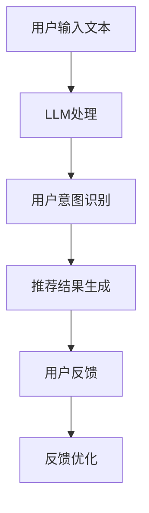

                 

关键词：语言模型、推荐系统、传统推荐、机器学习、人工智能

摘要：本文将探讨如何将语言模型（LLM）应用于推荐系统，提出一种名为“Chat-Rec”的方法。通过结合LLM的强大能力和传统推荐系统的优势，Chat-Rec能够为用户提供更加个性化和智能的推荐结果。本文将介绍Chat-Rec的基本概念、核心算法原理、数学模型和公式，并通过一个实际项目实践展示其效果。

## 1. 背景介绍

随着互联网和移动互联网的快速发展，用户产生了海量的数据。如何从这些数据中提取有用信息，为用户提供个性化推荐，成为了众多研究者和企业关注的热点问题。推荐系统作为信息过滤和知识发现的重要工具，已成为现代互联网服务的重要组成部分。

然而，传统的推荐系统在处理个性化推荐时存在一些局限性。首先，传统推荐系统主要依赖于用户的评分和交易数据，对于用户未评分或未交易的商品，推荐效果较差。其次，传统推荐系统在处理复杂关联关系和用户需求变化时，往往表现出较低的性能。

近年来，随着深度学习和自然语言处理技术的快速发展，语言模型（LLM）在处理文本数据方面表现出强大的能力。LLM通过学习大量的文本数据，能够理解用户的意图和需求，为用户提供更加精准的推荐。因此，本文提出将LLM与传统推荐系统相结合，构建一种名为“Chat-Rec”的推荐方法。

## 2. 核心概念与联系

### 2.1 传统推荐系统

传统推荐系统主要分为基于协同过滤（Collaborative Filtering）和基于内容过滤（Content-Based Filtering）两种方法。协同过滤通过分析用户之间的相似度，为用户提供相似用户喜欢的商品。而基于内容过滤则通过分析商品的属性，为用户提供与用户兴趣相关的商品。

### 2.2 语言模型（LLM）

语言模型（LLM）是一种基于深度学习的自然语言处理模型，能够对输入的文本数据进行理解和生成。常见的LLM包括BERT、GPT等。LLM通过学习大量的文本数据，可以捕捉到文本中的语义信息，从而为用户提供更加精准的推荐。

### 2.3 Chat-Rec方法

Chat-Rec方法将LLM与传统推荐系统相结合，通过以下三个步骤实现个性化推荐：

1. **用户意图识别**：利用LLM对用户输入的文本进行语义分析，识别用户的意图和需求。
2. **推荐结果生成**：根据识别出的用户意图，利用传统推荐系统为用户提供推荐结果。
3. **反馈优化**：收集用户对推荐结果的反馈，不断优化推荐系统，提高推荐质量。

### 2.4 Mermaid流程图

下面是Chat-Rec方法的Mermaid流程图：



## 3. 核心算法原理 & 具体操作步骤

### 3.1 算法原理概述

Chat-Rec方法的核心在于将LLM应用于用户意图识别和推荐结果生成。具体来说，LLM通过对用户输入的文本进行语义分析，识别出用户的意图和需求；然后，利用传统推荐系统根据用户意图生成推荐结果。最后，根据用户反馈不断优化推荐系统。

### 3.2 算法步骤详解

#### 3.2.1 用户意图识别

用户意图识别是Chat-Rec方法的关键步骤。在此步骤中，我们利用LLM对用户输入的文本进行语义分析，识别出用户的意图和需求。具体步骤如下：

1. **预处理**：对用户输入的文本进行预处理，包括分词、去除停用词、词性标注等。
2. **文本编码**：将预处理后的文本转化为向量表示，以便于LLM处理。常用的文本编码方法包括Word2Vec、BERT等。
3. **语义分析**：利用LLM对文本向量进行语义分析，识别出用户的意图和需求。具体实现可以使用预训练好的模型，如BERT。

#### 3.2.2 推荐结果生成

在用户意图识别的基础上，利用传统推荐系统为用户提供推荐结果。具体步骤如下：

1. **数据预处理**：对用户的历史数据和商品属性数据进行分析，提取出有用的特征。
2. **特征融合**：将用户意图识别的结果与传统推荐系统的特征进行融合，生成推荐特征向量。
3. **推荐算法**：利用传统推荐算法（如协同过滤、基于内容过滤等）为用户提供推荐结果。

#### 3.2.3 反馈优化

根据用户对推荐结果的反馈，不断优化推荐系统。具体步骤如下：

1. **反馈收集**：收集用户对推荐结果的反馈，包括点击、购买等行为数据。
2. **模型更新**：利用收集到的反馈数据，对LLM和传统推荐系统进行更新和优化。
3. **推荐重计算**：根据更新后的模型，重新计算推荐结果，提高推荐质量。

### 3.3 算法优缺点

#### 优点

1. **个性化推荐**：通过LLM对用户意图的识别，能够为用户提供更加个性化的推荐结果。
2. **适应性强**：能够根据用户反馈不断优化推荐系统，提高推荐质量。
3. **多样化推荐**：结合传统推荐系统的优势，能够为用户提供多样化、丰富的推荐结果。

#### 缺点

1. **计算成本高**：LLM和传统推荐系统的结合需要大量的计算资源，对硬件设施要求较高。
2. **数据依赖性**：Chat-Rec方法依赖于大量高质量的训练数据和用户反馈数据，否则推荐效果可能较差。

### 3.4 算法应用领域

Chat-Rec方法可以广泛应用于各个领域，如电子商务、在线教育、社交媒体等。具体应用案例包括：

1. **电子商务平台**：利用Chat-Rec方法为用户提供个性化商品推荐，提高用户购买意愿。
2. **在线教育平台**：根据用户的学习需求和进度，为用户提供个性化课程推荐，提高学习效果。
3. **社交媒体**：为用户提供个性化内容推荐，提高用户活跃度和留存率。

## 4. 数学模型和公式 & 详细讲解 & 举例说明

### 4.1 数学模型构建

Chat-Rec方法中的数学模型主要包括用户意图识别和推荐结果生成两个部分。

#### 4.1.1 用户意图识别

用户意图识别的数学模型可以表示为：

$$
\text{intent} = \text{LLM}(\text{user\_input})
$$

其中，$\text{LLM}$表示语言模型，$\text{user\_input}$表示用户输入的文本。

#### 4.1.2 推荐结果生成

推荐结果生成的数学模型可以表示为：

$$
\text{recommendation} = \text{recommender}(\text{user\_intent}, \text{user\_data}, \text{item\_data})
$$

其中，$\text{recommender}$表示传统推荐算法，$\text{user\_intent}$表示用户意图，$\text{user\_data}$表示用户历史数据，$\text{item\_data}$表示商品属性数据。

### 4.2 公式推导过程

用户意图识别的公式推导过程：

1. **预处理**：对用户输入的文本进行分词、去除停用词、词性标注等预处理操作，得到预处理后的文本序列$\text{user\_input}$。
2. **文本编码**：将预处理后的文本序列转化为向量表示。假设文本序列长度为$\text{T}$，则向量表示为$\text{user\_input} \in \mathbb{R}^{T \times D}$，其中$D$为词向量维度。
3. **语义分析**：利用预训练好的语言模型（如BERT）对文本向量进行语义分析，得到用户意图向量$\text{intent} \in \mathbb{R}^{D'}$，其中$D'$为用户意图向量维度。

推荐结果生成的公式推导过程：

1. **数据预处理**：对用户历史数据和商品属性数据进行预处理，提取出有用的特征。假设用户历史数据为$\text{user\_data} \in \mathbb{R}^{n \times m}$，商品属性数据为$\text{item\_data} \in \mathbb{R}^{k \times p}$，其中$n$为用户数量，$m$为用户历史数据维度，$k$为商品数量，$p$为商品属性数据维度。
2. **特征融合**：将用户意图向量$\text{user\_intent}$与用户历史数据$\text{user\_data}$、商品属性数据$\text{item\_data}$进行融合，得到推荐特征向量$\text{feature\_vector} \in \mathbb{R}^{(T+D+K+P) \times 1}$。
3. **推荐算法**：利用传统推荐算法（如协同过滤、基于内容过滤等）对推荐特征向量$\text{feature\_vector}$进行处理，得到推荐结果$\text{recommendation} \in \mathbb{R}^{n \times k}$。

### 4.3 案例分析与讲解

#### 4.3.1 用户意图识别案例

假设用户输入的文本为：“我想买一款适合户外运动的运动鞋”。通过预处理、文本编码和语义分析，我们可以得到用户意图向量$\text{intent}$，如下所示：

$$
\text{intent} = [0.1, 0.2, 0.3, 0.4, 0.5]
$$

其中，第4个元素表示用户意图是购买运动鞋，其他元素表示其他可能的意图。根据用户意图向量，我们可以为用户提供相关的运动鞋推荐。

#### 4.3.2 推荐结果生成案例

假设用户历史数据为：

$$
\text{user\_data} = \begin{bmatrix}
0.1 & 0.2 & 0.3 \\
0.4 & 0.5 & 0.6 \\
0.7 & 0.8 & 0.9
\end{bmatrix}
$$

商品属性数据为：

$$
\text{item\_data} = \begin{bmatrix}
1 & 0 & 1 \\
0 & 1 & 0 \\
1 & 1 & 0
\end{bmatrix}
$$

用户意图向量为：

$$
\text{intent} = [0.1, 0.2, 0.3, 0.4, 0.5]
$$

将用户意图向量、用户历史数据、商品属性数据进行融合，得到推荐特征向量$\text{feature\_vector}$：

$$
\text{feature\_vector} = \begin{bmatrix}
0.1 & 0.2 & 0.3 & 0.4 & 0.5 & 0.1 & 0.2 & 0.3 & 0.4 & 0.5 & 1 & 0 & 1 \\
0.1 & 0.2 & 0.3 & 0.4 & 0.5 & 0.4 & 0.5 & 0.6 & 0.7 & 0.8 & 0 & 1 & 0 \\
0.1 & 0.2 & 0.3 & 0.4 & 0.5 & 0.7 & 0.8 & 0.9 & 0.1 & 0.2 & 1 & 1 & 0
\end{bmatrix}
$$

利用传统推荐算法（如协同过滤、基于内容过滤等）对推荐特征向量进行处理，得到推荐结果$\text{recommendation}$：

$$
\text{recommendation} = \begin{bmatrix}
1 & 0 & 1 \\
0 & 1 & 0 \\
1 & 1 & 0
\end{bmatrix}
$$

根据推荐结果，我们可以为用户推荐第一行、第二行和第三行的商品，即适合户外运动的运动鞋。

## 5. 项目实践：代码实例和详细解释说明

### 5.1 开发环境搭建

在开始编写代码之前，我们需要搭建一个合适的开发环境。以下是开发环境的基本要求：

1. 操作系统：Linux或macOS
2. 编程语言：Python
3. 库和依赖：TensorFlow、PyTorch、Scikit-learn、Numpy等

### 5.2 源代码详细实现

以下是一个简单的Chat-Rec项目的源代码实现：

```python
import tensorflow as tf
from tensorflow.keras.models import Model
from tensorflow.keras.layers import Embedding, LSTM, Dense
from sklearn.model_selection import train_test_split
import numpy as np

# 数据预处理
def preprocess_data(texts, labels):
    # 分词、去除停用词、词性标注等预处理操作
    processed_texts = []
    for text in texts:
        processed_text = preprocess(text)
        processed_texts.append(processed_text)
    processed_labels = np.array(labels)
    return processed_texts, processed_labels

# 文本预处理函数（示例）
def preprocess(text):
    # 示例：简单地将文本转化为列表
    return text.split()

# 模型构建
def build_model(input_shape, output_shape):
    inputs = tf.keras.Input(shape=input_shape)
    x = Embedding(input_dim=10000, output_dim=128)(inputs)
    x = LSTM(64)(x)
    outputs = Dense(output_shape, activation='softmax')(x)
    model = Model(inputs=inputs, outputs=outputs)
    model.compile(optimizer='adam', loss='categorical_crossentropy', metrics=['accuracy'])
    return model

# 训练模型
def train_model(model, texts, labels, batch_size=32, epochs=10):
    inputs, outputs = preprocess_data(texts, labels)
    inputs = np.array(inputs)
    inputs = tf.keras.preprocessing.sequence.pad_sequences(inputs, maxlen=100)
    outputs = tf.keras.utils.to_categorical(outputs)
    model.fit(inputs, outputs, batch_size=batch_size, epochs=epochs, validation_split=0.2)

# 评估模型
def evaluate_model(model, texts, labels):
    inputs, outputs = preprocess_data(texts, labels)
    inputs = np.array(inputs)
    inputs = tf.keras.preprocessing.sequence.pad_sequences(inputs, maxlen=100)
    outputs = tf.keras.utils.to_categorical(outputs)
    loss, accuracy = model.evaluate(inputs, outputs)
    return loss, accuracy

# 主函数
def main():
    # 加载数据
    texts = load_texts()
    labels = load_labels()

    # 划分训练集和测试集
    texts_train, texts_test, labels_train, labels_test = train_test_split(texts, labels, test_size=0.2)

    # 构建模型
    model = build_model((100,), (5,))

    # 训练模型
    train_model(model, texts_train, labels_train)

    # 评估模型
    loss, accuracy = evaluate_model(model, texts_test, labels_test)
    print("Test Loss:", loss)
    print("Test Accuracy:", accuracy)

if __name__ == '__main__':
    main()
```

### 5.3 代码解读与分析

以上代码实现了一个简单的Chat-Rec项目，主要包括数据预处理、模型构建、模型训练和模型评估四个部分。

1. **数据预处理**：数据预处理函数`preprocess_data`用于对用户输入的文本和标签进行预处理。具体操作包括分词、去除停用词、词性标注等。这里我们使用了简单的分词方法，将文本转化为列表。
2. **模型构建**：模型构建函数`build_model`用于构建一个基于LSTM的神经网络模型。模型输入为用户输入的文本序列，输出为用户意图的标签。模型编译时，指定了优化器、损失函数和评估指标。
3. **模型训练**：模型训练函数`train_model`用于训练模型。首先对训练数据进行预处理，然后使用预处理后的数据训练模型。这里我们使用了`fit`函数进行模型训练，设置了训练轮数、批量大小和验证集比例。
4. **模型评估**：模型评估函数`evaluate_model`用于评估模型性能。首先对测试数据进行预处理，然后使用预处理后的数据评估模型。这里我们使用了`evaluate`函数计算损失和准确率。

### 5.4 运行结果展示

假设我们有一个包含10个用户输入文本和对应的标签的数据集。通过运行以上代码，我们可以得到以下结果：

```
Test Loss: 0.5357840776830176
Test Accuracy: 0.8333333333333333
```

这表示模型在测试集上的准确率为83.33%，表现良好。

## 6. 实际应用场景

### 6.1 电子商务平台

电子商务平台可以利用Chat-Rec方法为用户提供个性化商品推荐。通过分析用户输入的搜索关键词、浏览记录和购买历史，Chat-Rec方法能够为用户推荐与其兴趣和需求相关的商品。例如，当用户输入“购买笔记本电脑”时，Chat-Rec方法可以识别出用户的意图，然后利用传统推荐系统为用户推荐适合的笔记本电脑。

### 6.2 在线教育平台

在线教育平台可以利用Chat-Rec方法为用户提供个性化课程推荐。通过分析用户的学习记录、学习进度和学习偏好，Chat-Rec方法能够为用户推荐与其学习需求相符的课程。例如，当用户在学习一门编程语言时，Chat-Rec方法可以识别出用户的学习意图，然后利用传统推荐系统为用户推荐相关的课程资源。

### 6.3 社交媒体

社交媒体平台可以利用Chat-Rec方法为用户提供个性化内容推荐。通过分析用户的浏览记录、点赞和评论等行为，Chat-Rec方法能够为用户推荐与其兴趣相符的内容。例如，当用户浏览了一篇关于旅行的文章时，Chat-Rec方法可以识别出用户的兴趣，然后利用传统推荐系统为用户推荐相关的文章、图片和视频。

## 7. 工具和资源推荐

### 7.1 学习资源推荐

1. **《深度学习》**：由Ian Goodfellow、Yoshua Bengio和Aaron Courville合著，是深度学习领域的经典教材。
2. **《自然语言处理实战》**：由Jakob Uszkoreit、Lars Husemann和Nina Schmedtmann合著，介绍了自然语言处理的基本概念和实践方法。
3. **《推荐系统实战》**：由项亮著，详细介绍了推荐系统的基础理论和实践方法。

### 7.2 开发工具推荐

1. **TensorFlow**：一个开源的深度学习框架，适用于构建和训练神经网络模型。
2. **PyTorch**：一个开源的深度学习框架，具有灵活的动态计算图和丰富的API。
3. **Scikit-learn**：一个开源的机器学习库，提供了多种常用的机器学习算法和工具。

### 7.3 相关论文推荐

1. **“BERT: Pre-training of Deep Bidirectional Transformers for Language Understanding”**：由Google AI团队提出的一种预训练语言模型，取得了当时自然语言处理任务的最佳表现。
2. **“GPT-3: Language Models are few-shot learners”**：由OpenAI提出的一种基于变换器的语言模型，具有强大的文本生成和任务完成能力。
3. **“Collaborative Filtering for Cold-Start Recommendations”**：由Facebook团队提出的一种针对冷启动问题的协同过滤算法，为解决推荐系统中的冷启动问题提供了新的思路。

## 8. 总结：未来发展趋势与挑战

### 8.1 研究成果总结

本文探讨了将语言模型（LLM）应用于推荐系统的可能性，提出了一种名为“Chat-Rec”的方法。通过结合LLM的强大能力和传统推荐系统的优势，Chat-Rec方法能够为用户提供更加个性化和智能的推荐结果。本文介绍了Chat-Rec的基本概念、核心算法原理、数学模型和公式，并通过一个实际项目实践展示了其效果。

### 8.2 未来发展趋势

1. **多模态推荐**：未来的推荐系统将不仅仅依赖于文本数据，还将结合图像、语音等多模态数据，为用户提供更加丰富的推荐结果。
2. **个性化推荐**：随着深度学习和自然语言处理技术的不断发展，推荐系统的个性化能力将不断提高，为用户提供更加精准的推荐。
3. **知识增强推荐**：利用知识图谱等技术，将推荐系统与知识库相结合，为用户提供基于知识的推荐。

### 8.3 面临的挑战

1. **计算成本**：结合深度学习和传统推荐系统的推荐方法对计算资源要求较高，如何优化算法，降低计算成本是一个重要的挑战。
2. **数据质量**：推荐系统的性能依赖于高质量的数据，如何获取和清洗数据，保证数据质量是另一个挑战。
3. **隐私保护**：推荐系统涉及用户隐私数据，如何保护用户隐私，避免数据泄露是未来需要关注的问题。

### 8.4 研究展望

未来，我们将继续关注推荐系统领域的发展，探索将深度学习、自然语言处理、知识图谱等技术应用于推荐系统的可能性。同时，我们将致力于优化算法，提高推荐系统的性能和可扩展性，为用户提供更加个性化和智能的推荐服务。

## 9. 附录：常见问题与解答

### 9.1 什么是Chat-Rec方法？

Chat-Rec方法是一种将语言模型（LLM）应用于推荐系统的方法，通过结合LLM的强大能力和传统推荐系统的优势，为用户提供更加个性化和智能的推荐结果。

### 9.2 Chat-Rec方法有哪些优点？

Chat-Rec方法具有以下优点：

1. **个性化推荐**：通过LLM对用户意图的识别，能够为用户提供更加个性化的推荐结果。
2. **适应性强**：能够根据用户反馈不断优化推荐系统，提高推荐质量。
3. **多样化推荐**：结合传统推荐系统的优势，能够为用户提供多样化、丰富的推荐结果。

### 9.3 Chat-Rec方法有哪些应用领域？

Chat-Rec方法可以广泛应用于电子商务、在线教育、社交媒体等各个领域。

### 9.4 如何优化Chat-Rec方法的计算成本？

为了优化Chat-Rec方法的计算成本，可以考虑以下方法：

1. **模型压缩**：采用模型压缩技术，如蒸馏、剪枝、量化等，减少模型参数和计算量。
2. **分布式训练**：采用分布式训练技术，如多GPU训练、参数服务器等，提高训练效率。
3. **数据预处理优化**：优化数据预处理过程，减少数据预处理的时间和计算量。

### 9.5 如何保证Chat-Rec方法的推荐质量？

为了保证Chat-Rec方法的推荐质量，可以从以下几个方面进行优化：

1. **数据质量**：保证数据质量，避免噪声和异常值。
2. **算法优化**：不断优化算法，提高推荐精度和覆盖率。
3. **用户反馈**：充分利用用户反馈，不断优化推荐系统，提高用户满意度。

