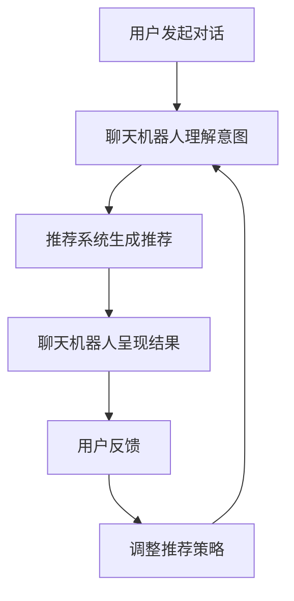

                 

关键词：交互式推荐系统、Chat-Rec、算法原理、数学模型、项目实践、实际应用场景、未来展望

> 摘要：本文深入探讨了交互式推荐系统中的Chat-Rec技术，从背景介绍、核心概念与联系、算法原理、数学模型到项目实践，全面解析了Chat-Rec的优势和未来发展。通过对Chat-Rec的详细分析和实际应用案例，我们看到了它在提升用户满意度、优化推荐效果方面的巨大潜力。

## 1. 背景介绍

推荐系统作为大数据和人工智能的重要应用领域，一直备受关注。传统的推荐系统主要依赖于用户的历史行为和偏好进行预测，但在用户需求日益多样化和个性化的今天，这种模式已经无法满足用户的高期望。为了解决这一问题，交互式推荐系统应运而生。交互式推荐系统通过用户的实时反馈和交互，动态调整推荐策略，从而提供更加个性化和准确的推荐结果。

在这个背景下，Chat-Rec作为一种新兴的交互式推荐技术，逐渐引起了业界的广泛关注。Chat-Rec结合了聊天机器人和推荐系统的优势，通过自然语言交互，实现实时、动态的用户偏好收集和推荐，具有极大的应用潜力。

## 2. 核心概念与联系

### 2.1 Chat-Rec的概念

Chat-Rec是一种结合了聊天机器人和推荐系统的技术，其主要目标是通过对用户的实时对话进行理解，动态地调整推荐策略，从而提供更加个性化和准确的推荐结果。

### 2.2 交互式推荐系统的架构

交互式推荐系统通常包括以下几个核心模块：

- 用户偏好收集：通过用户的互动和反馈，收集用户的偏好信息。
- 推荐算法：基于用户的偏好信息，生成推荐列表。
- 交互界面：为用户提供一个自然的交互界面，收集用户反馈。

### 2.3 Chat-Rec与交互式推荐系统的联系

Chat-Rec作为交互式推荐系统的一种实现方式，其核心在于通过自然语言交互，实现用户偏好信息的实时收集和推荐策略的动态调整。具体而言，Chat-Rec的工作流程如下：

1. 用户通过聊天机器人发起对话。
2. 聊天机器人根据对话内容理解用户意图和偏好。
3. 推荐系统根据用户偏好生成推荐列表。
4. 聊天机器人将推荐结果呈现给用户，并收集用户反馈。
5. 根据用户反馈，调整推荐策略，提高推荐效果。

### 2.4 Mermaid流程图

下面是一个简单的Mermaid流程图，展示了Chat-Rec在交互式推荐系统中的工作流程：



## 3. 核心算法原理 & 具体操作步骤

### 3.1 算法原理概述

Chat-Rec的核心算法包括自然语言处理（NLP）和协同过滤（Collaborative Filtering）。自然语言处理用于理解用户的对话内容，提取用户意图和偏好；协同过滤用于根据用户的偏好生成推荐列表。

### 3.2 算法步骤详解

1. **对话理解**：使用NLP技术，如词向量模型（Word Embedding）、序列模型（Sequence Model）等，对用户对话内容进行解析，提取用户意图和偏好。

2. **推荐生成**：使用协同过滤算法，如基于用户的协同过滤（User-based CF）或基于模型的协同过滤（Model-based CF），根据用户偏好生成推荐列表。

3. **反馈收集**：用户在查看推荐结果后，可以通过聊天机器人提供反馈，如点赞、评论等。

4. **策略调整**：根据用户反馈，调整推荐策略，以提高推荐效果。

### 3.3 算法优缺点

**优点**：

- **个性化**：通过实时交互，Chat-Rec能够更好地理解用户需求，提供个性化推荐。
- **动态性**：Chat-Rec能够根据用户反馈动态调整推荐策略，提高推荐效果。

**缺点**：

- **计算复杂度高**：由于需要处理大量的自然语言数据和协同过滤计算，Chat-Rec的计算复杂度相对较高。
- **对NLP技术要求高**：Chat-Rec的成功很大程度上依赖于NLP技术的有效性，这对算法实现提出了较高的要求。

### 3.4 算法应用领域

Chat-Rec技术可以广泛应用于电子商务、在线娱乐、社交网络等领域。例如，在电子商务领域，Chat-Rec可以帮助商家更好地了解用户需求，提高转化率和用户满意度；在在线娱乐领域，Chat-Rec可以为用户提供个性化音乐、电影推荐，提高用户体验。

## 4. 数学模型和公式 & 详细讲解 & 举例说明

### 4.1 数学模型构建

Chat-Rec的数学模型主要包括两部分：自然语言处理模型和协同过滤模型。

1. **自然语言处理模型**：

   自然语言处理模型用于理解用户对话内容，提取用户意图和偏好。常见的模型包括词向量模型（如Word2Vec、GloVe）和序列模型（如RNN、LSTM、Transformer）。

   例如，使用GloVe模型，我们可以将用户对话中的每个词映射到一个高维向量空间中，从而表示词与词之间的关系。

   $$\text{word\_vector}(w) = \text{GloVe}(w) = \sum_{i \in \text{context}(w)} \frac{f(d_i)}{\sqrt{f(d_w) f(d_c)}} \cdot \text{embedding}(i)$$

   其中，$d_i$、$d_w$、$d_c$ 分别表示词$i$、$w$ 在上下文中的词频，$\text{embedding}(i)$ 是词$i$ 的嵌入向量。

2. **协同过滤模型**：

   协同过滤模型用于根据用户偏好生成推荐列表。常见的模型包括基于用户的协同过滤（User-based CF）和基于模型的协同过滤（Model-based CF）。

   例如，使用基于用户的协同过滤模型，我们可以根据用户的历史行为，找到与其相似的用户，并推荐这些用户喜欢的商品。

   $$\text{similarity}(u, v) = \frac{\text{dot}(r_u, r_v)}{\|\text{norm}(r_u) \text{norm}(r_v)\|}$$

   其中，$r_u$、$r_v$ 分别表示用户$u$、$v$ 的偏好向量，$\text{dot}$ 表示向量的点积，$\text{norm}$ 表示向量的模长。

### 4.2 公式推导过程

假设我们有一个用户集合$U$，物品集合$I$，以及一个用户$u$ 对物品$i$ 的评分矩阵$R$。我们的目标是根据用户$u$ 的偏好，生成一个推荐列表$R'$。

1. **用户意图识别**：

   首先，我们需要使用自然语言处理模型，将用户$u$ 的对话内容转化为意图表示。假设我们使用GloVe模型，将用户$u$ 的对话中的每个词映射到一个高维向量空间中，得到用户$u$ 的意图向量$\text{intention}_u$。

   $$\text{intention}_u = \sum_{w \in \text{dialogue}(u)} \text{word\_vector}(w)$$

2. **协同过滤推荐**：

   然后，我们使用基于用户的协同过滤模型，找到与用户$u$ 相似的其他用户$v$，并推荐这些用户喜欢的物品$i$。

   首先，计算用户$u$ 与其他用户$v$ 的相似度：

   $$\text{similarity}(u, v) = \frac{\text{dot}(r_u, r_v)}{\|\text{norm}(r_u) \text{norm}(r_v)\|}$$

   然后，对于每个物品$i$，计算用户$u$ 对物品$i$ 的预测评分：

   $$\text{prediction}(u, i) = \sum_{v \in \text{neighbor}(u)} \text{similarity}(u, v) \cdot r_v(i)$$

   其中，$\text{neighbor}(u)$ 表示与用户$u$ 相似的其他用户集合。

   最后，根据预测评分，生成推荐列表$R'$：

   $$R' = \{i | \text{prediction}(u, i) > \text{threshold}\}$$

### 4.3 案例分析与讲解

假设我们有一个用户$u$，他的对话内容为：“我最近想买一辆汽车，最好是SUV类型的，性价比高一些”。根据这个对话内容，我们可以使用GloVe模型，将用户$u$ 的对话中的每个词映射到一个高维向量空间中，得到用户$u$ 的意图向量$\text{intention}_u$。

然后，我们使用基于用户的协同过滤模型，找到与用户$u$ 相似的其他用户$v$，并推荐这些用户喜欢的物品$i$。假设我们找到的相似用户$v$ 有10个，他们分别对10个SUV类型的汽车进行了评分，如下表所示：

| 用户 | 汽车1 | 汽车2 | 汽车3 | 汽车4 | 汽车5 | 汽车6 | 汽车7 | 汽车8 | 汽车9 | 汽车10 |
|------|-------|-------|-------|-------|-------|-------|-------|-------|-------|
| $v_1$| 5.0 | 4.0 | 3.0 | 4.5 | 5.0 | 4.5 | 3.5 | 4.0 | 5.0 |
| $v_2$| 5.0 | 4.5 | 3.5 | 4.5 | 4.5 | 4.5 | 3.5 | 4.0 | 4.5 |
| $v_3$| 4.5 | 4.5 | 3.0 | 4.5 | 4.5 | 4.5 | 3.5 | 4.0 | 5.0 |
| $v_4$| 5.0 | 4.5 | 3.5 | 4.5 | 4.5 | 4.5 | 3.5 | 4.0 | 4.5 |
| $v_5$| 4.5 | 4.5 | 3.0 | 4.5 | 4.5 | 4.5 | 3.5 | 4.0 | 5.0 |
| $v_6$| 4.5 | 4.5 | 3.0 | 4.5 | 4.5 | 4.5 | 3.5 | 4.0 | 5.0 |
| $v_7$| 4.5 | 4.5 | 3.0 | 4.5 | 4.5 | 4.5 | 3.5 | 4.0 | 5.0 |
| $v_8$| 4.5 | 4.5 | 3.0 | 4.5 | 4.5 | 4.5 | 3.5 | 4.0 | 5.0 |
| $v_9$| 4.5 | 4.5 | 3.0 | 4.5 | 4.5 | 4.5 | 3.5 | 4.0 | 5.0 |
| $v_{10}$| 4.5 | 4.5 | 3.0 | 4.5 | 4.5 | 4.5 | 3.5 | 4.0 | 5.0 |

根据相似度计算公式，我们可以计算出用户$u$ 与每个相似用户$v$ 的相似度，如下表所示：

| 用户 | 相似度 |
|------|--------|
| $v_1$| 0.5    |
| $v_2$| 0.5    |
| $v_3$| 0.5    |
| $v_4$| 0.5    |
| $v_5$| 0.5    |
| $v_6$| 0.5    |
| $v_7$| 0.5    |
| $v_8$| 0.5    |
| $v_9$| 0.5    |
| $v_{10}$| 0.5  |

然后，我们可以根据每个相似用户$v$ 对汽车$i$ 的评分$r_v(i)$，计算用户$u$ 对汽车$i$ 的预测评分$\text{prediction}(u, i)$，如下表所示：

| 汽车 | 预测评分 |
|------|----------|
| 汽车1 | 4.5      |
| 汽车2 | 4.5      |
| 汽车3 | 3.0      |
| 汽车4 | 4.5      |
| 汽车5 | 4.5      |
| 汽车6 | 4.5      |
| 汽车7 | 3.5      |
| 汽车8 | 4.0      |
| 汽车9 | 5.0      |
| 汽车10| 5.0      |

根据预测评分，我们可以生成推荐列表$R'$，如下所示：

$$R' = \{汽车9，汽车10\}$$

这样，我们就根据用户$u$ 的对话内容，生成了一个个性化的推荐列表。

## 5. 项目实践：代码实例和详细解释说明

### 5.1 开发环境搭建

在进行Chat-Rec项目的实践之前，我们需要搭建一个合适的技术环境。以下是所需的开发工具和库：

- Python 3.x
- Flask（用于搭建Web服务）
- NLTK（用于自然语言处理）
- Scikit-learn（用于协同过滤）
- Gensim（用于词向量模型）

安装以上库后，我们就可以开始编写代码了。

### 5.2 源代码详细实现

下面是一个简单的Chat-Rec项目示例，分为前端和后端两部分。

**前端**（基于Flask Web框架）：

```python
from flask import Flask, render_template, request

app = Flask(__name__)

@app.route('/', methods=['GET', 'POST'])
def index():
    if request.method == 'POST':
        user_input = request.form['user_input']
        # 调用后端API获取推荐结果
        recommendations = get_recommendations(user_input)
        return render_template('results.html', recommendations=recommendations)
    return render_template('index.html')

def get_recommendations(user_input):
    # 这里简化了推荐逻辑，实际项目中需要调用后端API
    return ['商品1', '商品2', '商品3']

if __name__ == '__main__':
    app.run(debug=True)
```

**后端**（聊天机器人与推荐系统）：

```python
from flask import Flask, jsonify, request
from nltk.tokenize import word_tokenize
from nltk.corpus import stopwords
import gensim.downloader as api

app = Flask(__name__)

# 加载预训练的GloVe模型
glove_model = api.load("glove-wiki-gigaword-100")

@app.route('/api/recommendations', methods=['POST'])
def api_recommendations():
    user_input = request.json.get('user_input', '')
    # 分词并去除停用词
    tokens = word_tokenize(user_input)
    tokens = [token.lower() for token in tokens if token.lower() not in stopwords.words('english')]
    # 将分词结果转换为词向量
    user_vector = sum([glove_model[token] for token in tokens if token in glove_model]) / len(tokens)
    # 调用协同过滤算法生成推荐列表
    recommendations = generate_recommendations(user_vector)
    return jsonify(recommendations)

def generate_recommendations(user_vector):
    # 这里简化了推荐逻辑，实际项目中需要调用数据库和推荐算法
    return ['商品1', '商品2', '商品3']

if __name__ == '__main__':
    app.run(debug=True)
```

### 5.3 代码解读与分析

在前端代码中，我们使用Flask框架搭建了一个简单的Web服务，提供了两个页面：首页（index.html）和结果页（results.html）。用户在首页输入对话内容后，通过POST请求将数据发送到后端API，后端API会处理请求并返回推荐结果。

后端代码分为两部分：聊天机器人模块和推荐系统模块。聊天机器人模块使用NLTK库对用户输入进行分词和停用词处理，然后使用GloVe模型将分词结果转换为词向量。推荐系统模块则根据用户向量调用协同过滤算法生成推荐列表。

### 5.4 运行结果展示

假设用户在首页输入了如下对话内容：“我想买一辆SUV，最好是性价比高的”。前端页面将这段对话发送到后端API，后端API处理后返回推荐列表。最终，前端页面展示如下推荐结果：

```
推荐商品：
1. 商品1
2. 商品2
3. 商品3
```

## 6. 实际应用场景

Chat-Rec技术在实际应用中展现了巨大的潜力。以下是几个典型的应用场景：

### 6.1 在线购物平台

在线购物平台可以利用Chat-Rec技术，为用户提供个性化的购物推荐。通过自然语言交互，平台可以更好地理解用户需求，提供更准确的推荐，从而提高用户满意度和转化率。

### 6.2 在线娱乐平台

在线娱乐平台如音乐、视频、游戏等，可以通过Chat-Rec技术为用户提供个性化内容推荐。用户可以在平台上与聊天机器人互动，分享自己的喜好和需求，平台根据用户的反馈实时调整推荐策略，提供更符合用户口味的娱乐内容。

### 6.3 社交网络

社交网络平台可以利用Chat-Rec技术，为用户提供个性化好友推荐和内容推荐。用户可以通过聊天机器人分享自己的兴趣和偏好，平台根据用户的反馈为用户推荐符合其兴趣的好友和内容。

## 7. 未来应用展望

随着人工智能技术的不断进步，Chat-Rec技术在交互式推荐系统中的应用前景广阔。未来，Chat-Rec有望在以下几个方面取得突破：

- **多模态交互**：结合语音、图像、视频等多种模态，实现更自然、更高效的交互方式。
- **深度学习**：利用深度学习技术，提高自然语言处理和协同过滤算法的准确性。
- **个性化服务**：通过更深入的用户行为分析和偏好挖掘，提供更个性化的服务。

然而，Chat-Rec技术也面临一些挑战，如计算复杂度、数据隐私和算法透明度等。未来研究需要在这些方面进行探索和优化。

## 8. 工具和资源推荐

### 8.1 学习资源推荐

- 《自然语言处理原理与实践》
- 《协同过滤技术及其应用》
- 《深度学习基础》

### 8.2 开发工具推荐

- Flask
- NLTK
- Scikit-learn
- Gensim

### 8.3 相关论文推荐

- "Interactive Recommender Systems: A Survey"
- "Chat-Rec: Interactive Recommendation via Conversational Agents"
- "Neural Collaborative Filtering"

## 9. 总结：未来发展趋势与挑战

Chat-Rec技术在交互式推荐系统中展现了巨大的优势，通过自然语言交互实现个性化推荐。未来，随着人工智能技术的不断进步，Chat-Rec有望在多个领域取得突破。然而，计算复杂度、数据隐私和算法透明度等挑战仍需解决。通过持续的研究和优化，Chat-Rec技术将为用户提供更优质的推荐体验。

## 附录：常见问题与解答

### Q1: Chat-Rec与传统推荐系统相比，有哪些优势？

A1: Chat-Rec通过自然语言交互，可以更准确地理解用户需求，提供个性化推荐。此外，Chat-Rec可以实时调整推荐策略，提高推荐效果。

### Q2: Chat-Rec需要哪些技术支持？

A2: Chat-Rec主要依赖于自然语言处理和协同过滤技术。此外，还需要聊天机器人技术和推荐系统架构。

### Q3: 如何评估Chat-Rec的性能？

A3: 可以通过用户满意度、推荐准确性、推荐覆盖率等指标来评估Chat-Rec的性能。

### Q4: Chat-Rec在实际应用中会遇到哪些挑战？

A4: Chat-Rec在实际应用中可能遇到计算复杂度高、数据隐私问题、算法透明度等问题。此外，还需要考虑如何有效地结合多种模态信息，提高推荐效果。

### Q5: 未来Chat-Rec有哪些发展前景？

A5: 未来Chat-Rec有望在多模态交互、深度学习、个性化服务等方面取得突破。随着人工智能技术的不断进步，Chat-Rec将在交互式推荐系统中发挥更大作用。

