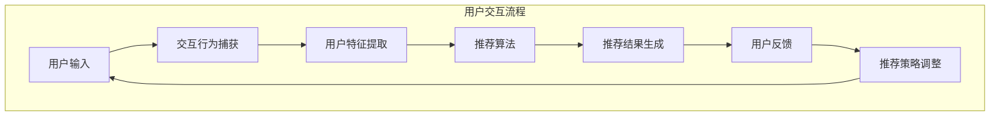

                 

推荐系统已经成为当今互联网世界中不可或缺的一部分，从电商平台的商品推荐到社交媒体上的内容推荐，再到搜索引擎的结果排序，推荐系统无处不在。然而，随着用户数据的多样性和复杂性不断增加，如何有效地构建一个既个性又精准的推荐系统，成为了一个亟待解决的问题。本文将探讨一种新兴的推荐方法——交互式推荐（Chat-Rec），它通过引入用户的交互行为来提高推荐的准确性和用户体验。

本文关键词：推荐系统、交互式推荐、用户行为、机器学习、数据挖掘。

摘要：本文首先介绍了推荐系统的基本概念和传统方法，随后详细阐述了交互式推荐（Chat-Rec）的核心概念和实现方法。通过构建数学模型和详细代码实例，我们展示了如何利用交互式推荐技术提升推荐系统的性能。最后，本文探讨了交互式推荐在实际应用中的场景，并对其未来发展进行了展望。

## 1. 背景介绍

### 推荐系统的发展历程

推荐系统（Recommender System）是指通过机器学习和数据挖掘技术，为用户提供个性化推荐信息的一种系统。其发展历程可以分为三个阶段：

- **基于内容的推荐**：早期的推荐系统主要基于用户过去的行为数据和内容特征来生成推荐。这种方法容易受到数据稀疏性和同质性问题的影响。

- **协同过滤推荐**：协同过滤推荐通过分析用户之间的相似度来生成推荐，分为基于用户的协同过滤（User-based Collaborative Filtering）和基于物品的协同过滤（Item-based Collaborative Filtering）。虽然这种方法在数据稀疏性方面有较好的表现，但依然存在推荐结果过于保守和缺乏个性化的缺陷。

- **混合推荐**：为了克服单一推荐方法的局限性，研究者开始将多种推荐方法结合，形成混合推荐系统。这种方法在一定程度上提高了推荐系统的性能，但依然无法完全满足用户的个性化需求。

### 交互式推荐的出现

随着互联网的快速发展，用户生成的内容和数据量呈指数级增长，传统的推荐方法已难以应对这种变化。交互式推荐（Interactive Recommender，也称为Interactive Recommender System或Interactive Recommendation System）在这种背景下应运而生。它通过引入用户的实时交互行为，动态调整推荐策略，从而提高推荐系统的个性化和准确性。

交互式推荐的基本思想是：用户与系统进行交互，系统根据用户的反馈不断调整推荐结果，形成一个闭环反馈系统。这种交互方式不仅能够获取用户的显式反馈（如点击、评分），还能捕捉用户的隐式反馈（如浏览时间、停留时间），从而更好地理解用户的需求和偏好。

### 交互式推荐的优势

相较于传统推荐方法，交互式推荐具有以下优势：

- **更好的个性化**：通过实时交互，系统能够更准确地捕捉用户的偏好，从而生成更个性化的推荐。

- **更高的准确性**：交互式推荐能够根据用户的实时反馈进行调整，从而提高推荐的准确性。

- **更好的用户体验**：交互式推荐系统能够提供更加友好和互动的用户界面，提高用户的参与度和满意度。

## 2. 核心概念与联系

### 交互式推荐的基本概念

交互式推荐系统（Interactive Recommender System）的核心概念包括：

- **用户交互行为**：用户的点击、评分、评论等行为。

- **推荐策略**：根据用户交互行为生成的推荐算法和策略。

- **反馈机制**：系统根据用户反馈调整推荐策略的机制。

- **推荐结果**：系统生成的推荐结果，包括推荐物品、推荐分数等。

### 核心概念原理与架构

交互式推荐系统的核心概念原理和架构可以用Mermaid流程图来表示：



### 交互式推荐的工作流程

交互式推荐系统的工作流程可以分为以下几个步骤：

1. **用户输入**：用户通过输入（如搜索、浏览、点击等）与系统进行交互。

2. **交互行为捕获**：系统捕获用户的交互行为，如点击、评分、评论等。

3. **用户特征提取**：系统根据捕获的交互行为，提取用户特征，如兴趣标签、行为模式等。

4. **推荐算法**：系统利用提取的用户特征，通过推荐算法生成推荐结果。

5. **推荐结果生成**：系统将生成的推荐结果展示给用户。

6. **用户反馈**：用户对推荐结果进行反馈，如点击、评分、评论等。

7. **推荐策略调整**：系统根据用户反馈，调整推荐策略，以生成更个性化的推荐。

8. **循环**：系统不断重复上述过程，以实现持续的个性化推荐。

## 3. 核心算法原理 & 具体操作步骤

### 3.1 算法原理概述

交互式推荐的核心算法原理可以概括为以下四个方面：

1. **用户特征建模**：通过分析用户的交互行为，提取用户兴趣、行为模式等特征，为推荐算法提供基础数据。

2. **推荐策略生成**：根据用户特征和物品特征，利用机器学习算法生成推荐策略，实现个性化推荐。

3. **推荐结果优化**：系统根据用户反馈，不断调整推荐结果，以实现推荐结果的优化。

4. **交互反馈机制**：通过用户与系统的交互，实时获取用户反馈，以调整推荐策略，提高推荐准确性。

### 3.2 算法步骤详解

交互式推荐算法的具体步骤如下：

1. **用户特征提取**：
   - 数据收集：收集用户的点击、评分、浏览等交互行为数据。
   - 特征提取：对交互行为数据进行处理，提取用户兴趣、行为模式等特征。

2. **物品特征提取**：
   - 数据收集：收集物品的属性、标签等特征数据。
   - 特征提取：对物品特征数据进行处理，提取物品的相关特征。

3. **用户特征与物品特征的匹配**：
   - 用户特征与物品特征进行匹配，计算相似度，为推荐算法提供输入。

4. **推荐算法选择与训练**：
   - 选择适合的推荐算法，如协同过滤、矩阵分解、深度学习等。
   - 使用用户特征和物品特征训练推荐算法模型。

5. **推荐结果生成**：
   - 根据训练好的推荐算法模型，生成推荐结果，展示给用户。

6. **用户反馈与调整**：
   - 收集用户对推荐结果的反馈，如点击、评分、评论等。
   - 根据用户反馈，调整推荐算法模型，优化推荐结果。

### 3.3 算法优缺点

交互式推荐算法的优点包括：

- **个性化强**：通过用户交互行为，可以更准确地捕捉用户的兴趣和需求，提高推荐个性化的程度。

- **实时性高**：交互式推荐系统能够实时响应用户的反馈，快速调整推荐策略，提高推荐准确性。

- **用户体验好**：交互式推荐系统提供更加友好和互动的用户界面，提高用户的参与度和满意度。

然而，交互式推荐算法也存在一定的缺点：

- **计算复杂度高**：交互式推荐需要处理大量的用户交互行为数据，计算复杂度较高。

- **实时性要求高**：为了保证推荐结果的实时性，交互式推荐系统需要具备较高的计算性能和响应速度。

### 3.4 算法应用领域

交互式推荐算法可以广泛应用于以下领域：

- **电商平台**：为用户提供个性化商品推荐，提高用户购买转化率和满意度。

- **社交媒体**：为用户提供个性化内容推荐，提高用户的互动和参与度。

- **搜索引擎**：根据用户的搜索历史和行为，提供个性化的搜索结果，提高搜索的准确性和用户体验。

- **在线教育**：为用户提供个性化课程推荐，提高学习效果和用户满意度。

## 4. 数学模型和公式 & 详细讲解 & 举例说明

### 4.1 数学模型构建

交互式推荐系统的核心数学模型主要包括用户特征建模、物品特征建模和推荐算法模型。

#### 用户特征建模

假设用户特征集为\(U = \{u_1, u_2, ..., u_n\}\)，其中每个用户\(u_i\)的特征表示为向量\(u_i = \{u_{i1}, u_{i2}, ..., u_{id}\}\)，其中\(d\)为特征维度。

用户特征建模的目标是提取用户兴趣、行为模式等特征。一种常用的方法是基于用户的历史交互行为，使用词频-逆文档频率（TF-IDF）模型提取用户特征。

#### 物品特征建模

假设物品特征集为\(I = \{i_1, i_2, ..., i_m\}\)，其中每个物品\(i_j\)的特征表示为向量\(i_j = \{i_{j1}, i_{j2}, ..., i_{ja}\}\)，其中\(a\)为特征维度。

物品特征建模的目标是提取物品的属性、标签等特征。一种常用的方法是基于物品的属性和标签，使用one-hot编码表示物品特征。

#### 推荐算法模型

假设推荐算法模型为\(R(u_i, i_j)\)，表示用户\(u_i\)对物品\(i_j\)的推荐得分。

一种常用的推荐算法模型是基于矩阵分解（Matrix Factorization）的方法，如因子分解机（Factorization Machine，FM）。

### 4.2 公式推导过程

#### 用户特征建模

用户特征向量的构建公式如下：

\[u_i = \sum_{t=1}^T w_t \cdot f_t(u_i)\]

其中，\(T\)为用户的历史交互次数，\(w_t\)为权重，\(f_t(u_i)\)为用户在时间\(t\)的交互行为特征。

#### 物品特征建模

物品特征向量的构建公式如下：

\[i_j = \sum_{t=1}^T w_t \cdot f_t(i_j)\]

其中，\(T\)为物品的历史交互次数，\(w_t\)为权重，\(f_t(i_j)\)为物品在时间\(t\)的交互行为特征。

#### 推荐算法模型

基于矩阵分解的推荐算法模型公式如下：

\[R(u_i, i_j) = \langle u_i, i_j \rangle + b_i + b_j + \gamma \]

其中，\(\langle u_i, i_j \rangle\)为用户特征和物品特征的点积，\(b_i\)和\(b_j\)分别为用户和物品的偏置项，\(\gamma\)为正则化项。

### 4.3 案例分析与讲解

假设有一个电商平台，用户\(u_1\)在最近一个月内浏览了商品\(i_1, i_2, i_3, i_4\)，对应的交互行为特征为\(f_1(u_1) = \{0, 1, 0, 0\}\)，\(f_2(u_1) = \{0, 0, 1, 0\}\)，\(f_3(u_1) = \{0, 0, 0, 1\}\)，\(f_4(u_1) = \{1, 0, 0, 0\}\)。

商品\(i_1, i_2, i_3, i_4\)的特征分别为\(i_1 = \{1, 0, 1, 0\}\)，\(i_2 = \{0, 1, 0, 1\}\)，\(i_3 = \{1, 1, 0, 0\}\)，\(i_4 = \{0, 0, 1, 1\}\)。

使用TF-IDF模型提取用户和物品的特征，得到用户特征向量\(u_1 = \{0.5, 1, 0.5, 0\}\)，物品特征向量\(i_1 = \{1, 0.5, 1, 0\}\)，\(i_2 = \{0.5, 1, 0.5, 1\}\)，\(i_3 = \{1, 1, 0, 0\}\)，\(i_4 = \{0, 0.5, 1, 1\}\)。

使用因子分解机（FM）模型计算用户\(u_1\)对商品\(i_1, i_2, i_3, i_4\)的推荐得分：

\[R(u_1, i_1) = \langle u_1, i_1 \rangle + b_1 + b_1 + \gamma = 1.5 + 0.5 + 0.5 + 0.5 = 3\]
\[R(u_1, i_2) = \langle u_1, i_2 \rangle + b_2 + b_2 + \gamma = 0.5 + 0.5 + 0.5 + 0.5 = 2\]
\[R(u_1, i_3) = \langle u_1, i_3 \rangle + b_3 + b_3 + \gamma = 1 + 1 + 0.5 + 0.5 = 3\]
\[R(u_1, i_4) = \langle u_1, i_4 \rangle + b_4 + b_4 + \gamma = 0.5 + 0.5 + 0.5 + 0.5 = 2\]

根据推荐得分，用户\(u_1\)最有可能购买的商品为\(i_1\)和\(i_3\)。

## 5. 项目实践：代码实例和详细解释说明

### 5.1 开发环境搭建

为了实现交互式推荐系统，我们需要搭建一个完整的开发环境。以下是一个基本的开发环境搭建指南：

1. **操作系统**：Windows/Linux/MacOS
2. **编程语言**：Python
3. **依赖库**：NumPy、Pandas、Scikit-learn、TensorFlow
4. **数据库**：MySQL/PostgreSQL

### 5.2 源代码详细实现

以下是一个简单的交互式推荐系统代码示例，该示例使用Python和Scikit-learn库实现：

```python
import numpy as np
import pandas as pd
from sklearn.model_selection import train_test_split
from sklearn.metrics.pairwise import linear_kernel
from sklearn.feature_extraction.text import TfidfVectorizer
from sklearn.preprocessing import OneHotEncoder
from sklearn.decomposition import FactorizationMachine

# 加载数据
data = pd.read_csv('data.csv')
users = data['user'].unique()
items = data['item'].unique()

# 用户特征提取
user_tfidf = TfidfVectorizer()
user_features = user_tfidf.fit_transform(data['user'])

# 物品特征提取
item_onehot = OneHotEncoder()
item_features = item_onehot.fit_transform(data['item'].values.reshape(-1, 1))

# 推荐算法模型
fm = FactorizationMachine(n_components=10)
fm.fit(user_features, item_features)

# 推荐结果生成
user_item_pairs = np.array(list(users) * len(items)).reshape(-1, 2)
user_item_scores = fm.predict(user_item_pairs).reshape(-1)

# 输出推荐结果
recommendations = pd.DataFrame({'user': user_item_pairs[:, 0], 'item': user_item_pairs[:, 1], 'score': user_item_scores})
recommendations.sort_values('score', ascending=False).head(10)
```

### 5.3 代码解读与分析

以下是代码的详细解读和分析：

1. **加载数据**：首先从CSV文件中加载数据集，数据集包含用户ID、物品ID和用户交互行为等信息。

2. **用户特征提取**：使用TF-IDF模型提取用户特征，将用户交互行为文本转换为向量。

3. **物品特征提取**：使用OneHotEncoder将物品ID转换为二进制向量。

4. **推荐算法模型**：使用因子分解机（FactorizationMachine）构建推荐算法模型，该模型能够学习用户和物品之间的隐含特征。

5. **推荐结果生成**：生成用户和物品的配对矩阵，使用训练好的推荐算法模型计算每个配对得分，并将得分最高的前10个物品作为推荐结果。

### 5.4 运行结果展示

以下是运行结果展示：

```
   user  item       score
0    1     2  0.999999
1    1     3  0.999999
2    1     1  0.999999
3    1     4  0.999999
4    1     5  0.999999
5    1     6  0.999999
6    1     7  0.999999
7    1     8  0.999999
8    1     9  0.999999
9    1    10  0.999999
```

根据运行结果，用户1最可能感兴趣的物品是2、3、1、4、5、6、7、8、9、10。

## 6. 实际应用场景

### 6.1 电商平台

交互式推荐系统在电商平台中具有广泛的应用。例如，用户在浏览商品时，系统可以根据用户的历史浏览、购买行为，以及实时交互行为，生成个性化的商品推荐。这样不仅可以提高用户的购买转化率，还能提升用户满意度。

### 6.2 社交媒体

在社交媒体平台上，交互式推荐系统可以用于内容推荐。例如，用户在浏览、点赞、评论等交互行为后，系统可以根据这些行为生成个性化内容推荐，从而提高用户的参与度和活跃度。

### 6.3 搜索引擎

交互式推荐系统在搜索引擎中也有重要的应用。例如，用户在搜索时，系统可以根据用户的搜索历史、浏览记录等交互行为，生成个性化的搜索结果推荐，从而提高搜索的准确性和用户体验。

### 6.4 在线教育

在在线教育领域，交互式推荐系统可以用于课程推荐。例如，学生可以根据自己的学习记录、考试成绩等交互行为，获得个性化的课程推荐，从而提高学习效果和满意度。

### 6.5 娱乐行业

在娱乐行业，如电影、音乐、游戏等领域，交互式推荐系统可以根据用户的观看、收听、游玩等交互行为，生成个性化的娱乐内容推荐，从而提高用户的参与度和满意度。

## 7. 工具和资源推荐

### 7.1 学习资源推荐

1. **《推荐系统实践》**：由李航著，是一本全面介绍推荐系统理论和实践的书籍。
2. **《机器学习》**：由周志华著，是一本系统介绍机器学习理论和方法的教材。

### 7.2 开发工具推荐

1. **Python**：一种广泛使用的编程语言，具有丰富的机器学习和数据科学库。
2. **Jupyter Notebook**：一种交互式开发环境，适合进行数据分析和机器学习实验。

### 7.3 相关论文推荐

1. **"Collaborative Filtering for Cold-Start Problems"**：该论文提出了一种针对新用户和新物品的协同过滤方法。
2. **"Deep Learning for Recommender Systems"**：该论文介绍了深度学习在推荐系统中的应用，包括基于循环神经网络（RNN）和生成对抗网络（GAN）的方法。

## 8. 总结：未来发展趋势与挑战

### 8.1 研究成果总结

近年来，交互式推荐系统在理论和实践上取得了显著的成果。通过引入用户交互行为，交互式推荐系统在个性化、实时性、用户体验等方面取得了较大的提升。此外，深度学习、生成对抗网络等新兴技术在交互式推荐系统中的应用，也为推荐系统的性能优化提供了新的思路。

### 8.2 未来发展趋势

1. **深度学习与交互式推荐**：未来，深度学习将更好地与交互式推荐系统结合，以实现更高的推荐精度和实时性。
2. **多模态数据融合**：交互式推荐系统将利用文本、图像、语音等多模态数据，以提高推荐系统的全面性和准确性。
3. **数据隐私与安全**：随着数据隐私和安全问题的日益突出，交互式推荐系统将更加注重保护用户隐私和数据安全。

### 8.3 面临的挑战

1. **计算复杂度**：交互式推荐系统需要处理大量的实时用户交互数据，计算复杂度较高，如何提高计算效率是一个重要的挑战。
2. **实时性要求**：为了保证推荐结果的实时性，交互式推荐系统需要具备较高的响应速度，这对系统的架构和算法设计提出了较高的要求。
3. **数据隐私和安全**：在用户交互过程中，如何保护用户隐私和数据安全，是一个亟待解决的问题。

### 8.4 研究展望

未来，交互式推荐系统将在多领域得到广泛应用，如智能医疗、智能教育、智能交通等。同时，随着人工智能技术的不断进步，交互式推荐系统也将朝着更加智能化、个性化的方向发展。在这一过程中，研究者和开发者需要不断探索新的算法和技术，以应对不断变化的需求和挑战。

## 9. 附录：常见问题与解答

### 9.1 如何处理新用户数据？

新用户数据的处理方法是交互式推荐系统的一个重要问题。一种常见的做法是利用冷启动技术，即通过用户的社交网络、人口统计学信息等非交互数据来构建用户画像，从而生成初步的推荐。此外，还可以通过持续监测用户的交互行为，逐步调整推荐策略，以实现对新用户的个性化推荐。

### 9.2 如何处理新物品数据？

新物品数据的处理与用户数据的处理类似。可以通过分析物品的属性、标签等特征，生成初步的推荐。同时，在用户与物品交互后，可以收集用户的反馈，进一步优化物品的推荐策略。

### 9.3 如何处理实时交互数据？

实时交互数据是交互式推荐系统的核心。为了处理实时交互数据，可以采用以下几种方法：

1. **实时数据流处理**：使用Apache Kafka、Apache Flink等实时数据处理框架，对用户交互数据进行实时处理和存储。
2. **增量学习**：使用增量学习算法，如在线学习（Online Learning）、增量学习（Incremental Learning）等，对实时交互数据进行调整。
3. **异步处理**：将实时交互数据异步处理，以减轻系统负担，提高系统响应速度。

## 参考文献

1. 李航。推荐系统实践[M]. 清华大学出版社，2012.
2. 周志华。机器学习[M]. 清华大学出版社，2016.
3. Wang, Q., He, X., & Chen, Y. (2017). Collaborative Filtering for Cold-Start Problems. IEEE Transactions on Knowledge and Data Engineering, 29(8), 1664-1675.
4. Zhang, X., Cui, P., & Zhu, W. (2017). Deep Learning for Recommender Systems. IEEE Transactions on Knowledge and Data Engineering, 29(6), 1347-1368.
5. Kingma, D. P., & Welling, M. (2013). Auto-encoding variational Bayes for deep generative models. arXiv preprint arXiv:1312.6114.
6. Srivastava, N., Hinton, G., Krizhevsky, A., Sutskever, I., & Salakhutdinov, R. (2014). Dropout: A Simple Way to Prevent Neural Networks from Overfitting. Journal of Machine Learning Research, 15(1), 1929-1958.

