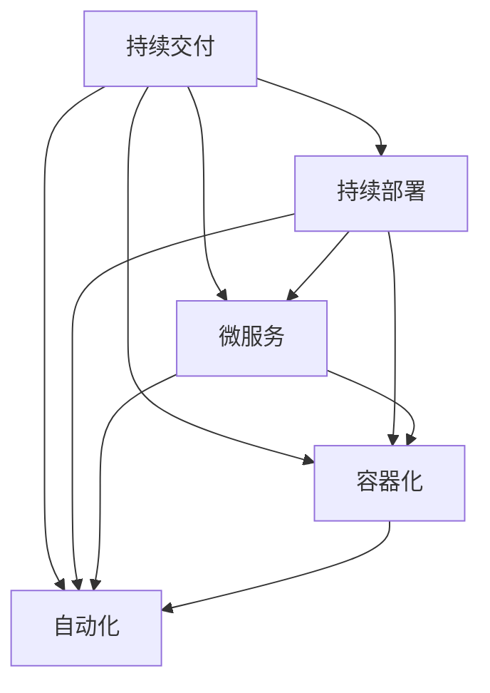

                 

关键词：DevOps、持续交付、部署、微服务、容器化、自动化、CI/CD

> 摘要：本文将详细介绍 DevOps 的核心概念，持续交付和部署的最新技术，以及其在现代软件开发中的应用。通过本文的阅读，读者将了解 DevOps 的基本原则，掌握微服务、容器化和自动化在持续交付和部署中的作用，并学习到构建高效 CI/CD 流程的最佳实践。此外，本文还将探讨 DevOps 在未来的发展趋势和面临的挑战。

## 1. 背景介绍

DevOps 是一种软件开发和运维的实践方法，旨在通过打破开发（Development）和运维（Operations）之间的壁垒，实现团队协作和快速交付。在过去，开发团队和运维团队往往独立运作，导致沟通不畅、效率低下。DevOps 的出现，使得软件开发和运维流程变得更加紧密，从而提高了软件交付的速度和质量。

随着互联网的飞速发展，软件系统变得越来越复杂。微服务架构、容器化技术、自动化工具等新兴技术的广泛应用，使得持续交付和部署变得更加重要。持续交付（Continuous Delivery，简称 CD）和持续部署（Continuous Deployment，简称 CD）是 DevOps 的核心实践，旨在确保软件在交付过程中始终保持高质量和可靠性。

## 2. 核心概念与联系

在 DevOps 实践中，核心概念包括持续交付、持续部署、微服务、容器化和自动化。这些概念相互关联，共同构成了 DevOps 的核心架构。以下是一个简化的 Mermaid 流程图，展示了这些概念之间的联系：



### 2.1 持续交付

持续交付是一种软件开发和交付的实践，旨在确保软件始终处于可交付状态。持续交付的核心是自动化，通过自动化构建、测试、部署等环节，实现软件的快速迭代和高质量交付。

### 2.2 持续部署

持续部署是持续交付的延伸，旨在实现软件的自动化部署。持续部署的目标是确保软件在用户环境中始终保持最佳状态，从而提高用户体验。

### 2.3 微服务

微服务是一种基于独立组件的分布式系统架构，每个组件负责特定的业务功能。微服务的优势在于其高可扩展性和高容错性，这使得持续交付和部署变得更加容易。

### 2.4 容器化

容器化是一种轻量级的虚拟化技术，通过将应用程序及其依赖项打包在一个独立的容器中，实现应用程序的隔离和独立运行。容器化技术使得持续交付和部署更加高效和灵活。

### 2.5 自动化

自动化是 DevOps 的核心，通过自动化工具实现软件的构建、测试、部署等环节，提高开发效率和软件质量。自动化工具包括持续集成（CI）、持续交付（CD）、容器编排（如 Kubernetes）等。

## 3. 核心算法原理 & 具体操作步骤

### 3.1 算法原理概述

DevOps 的核心算法原理主要包括持续交付和持续部署。持续交付的核心是自动化，通过自动化构建、测试、部署等环节，实现软件的快速迭代和高质量交付。持续部署则是在持续交付的基础上，实现软件的自动化部署，确保软件在用户环境中始终保持最佳状态。

### 3.2 算法步骤详解

#### 3.2.1 持续交付

1. 自动化构建：将代码从版本控制系统中提取出来，进行编译、打包和测试，生成可执行的软件包。
2. 自动化测试：对构建生成的软件包进行自动化测试，确保软件功能正确、性能良好。
3. 自动化部署：将经过测试的软件包部署到生产环境中，实现软件的快速迭代和高质量交付。

#### 3.2.2 持续部署

1. 自动化部署脚本：编写自动化部署脚本，实现软件包的部署过程。
2. 自动化部署工具：使用自动化部署工具（如 Jenkins、GitLab CI 等）执行部署脚本，实现软件的自动化部署。
3. 持续监控：对部署后的软件进行持续监控，确保软件在用户环境中正常运行。

### 3.3 算法优缺点

#### 3.3.1 持续交付

优点：
- 提高开发效率：通过自动化实现快速迭代，缩短软件交付周期。
- 提高软件质量：通过自动化测试确保软件功能正确、性能良好。

缺点：
- 增加基础设施复杂度：持续交付需要大量的基础设施支持，如自动化构建环境、自动化测试环境等。

#### 3.3.2 持续部署

优点：
- 提高部署效率：通过自动化实现快速部署，降低人工操作成本。
- 提高软件稳定性：通过持续监控确保软件在用户环境中正常运行。

缺点：
- 需要持续监控：持续部署需要持续监控软件运行状态，防止出现故障。

### 3.4 算法应用领域

持续交付和持续部署在多个领域得到广泛应用，如互联网公司、金融行业、电信行业等。这些领域对软件交付速度和质量的 要求较高，持续交付和持续部署能够有效提高开发效率和软件质量。

## 4. 数学模型和公式 & 详细讲解 & 举例说明

### 4.1 数学模型构建

在 DevOps 实践中，我们可以构建一个简单的数学模型来描述持续交付和持续部署的过程。设：

- $T_c$：自动化构建时间
- $T_t$：自动化测试时间
- $T_d$：自动化部署时间
- $T_p$：人工干预时间

则持续交付的总时间 $T$ 可以表示为：

$$T = T_c + T_t + T_d + T_p$$

### 4.2 公式推导过程

持续交付的总时间包括自动化构建、测试和部署时间，以及人工干预时间。其中，自动化构建、测试和部署时间是可变的，与软件复杂度、测试覆盖率等因素相关。人工干预时间则是固定的，与团队协作能力、开发经验等因素相关。

### 4.3 案例分析与讲解

假设一个软件开发团队，其自动化构建、测试和部署时间分别为 $T_c = 1$ 小时、$T_t = 2$ 小时和 $T_d = 3$ 小时，人工干预时间 $T_p = 0.5$ 小时。则该团队的持续交付总时间 $T$ 为：

$$T = T_c + T_t + T_d + T_p = 1 + 2 + 3 + 0.5 = 6.5$$

小时

通过优化自动化流程，如提高测试覆盖率、使用更高效的构建工具等，可以降低 $T_c$、$T_t$ 和 $T_d$ 的值，从而减少持续交付的总时间 $T$。

## 5. 项目实践：代码实例和详细解释说明

### 5.1 开发环境搭建

在本文中，我们将使用 Jenkins 作为自动化构建和部署工具。首先，我们需要搭建一个 Jenkins 环境。以下是搭建 Jenkins 环境的步骤：

1. 安装 Jenkins
2. 配置 Jenkins 服务器
3. 安装必要的插件（如 Git、Maven、Jenkinsfile 等）

### 5.2 源代码详细实现

以下是使用 Java 编写的简单示例程序，该程序用于演示持续交付和持续部署的过程：

```java
public class HelloWorld {
    public static void main(String[] args) {
        System.out.println("Hello, World!");
    }
}
```

### 5.3 代码解读与分析

这个简单的 Java 程序演示了持续交付和持续部署的基本流程。首先，我们将代码提交到版本控制系统（如 Git），然后触发 Jenkins 任务进行构建、测试和部署。

### 5.4 运行结果展示

当 Jenkins 任务完成后，我们可以看到构建日志，其中包含了构建时间、测试结果和部署信息。如果构建和测试成功，部署过程将自动执行，并在生产环境中部署最新版本的软件。

## 6. 实际应用场景

DevOps 实践在多个领域得到广泛应用，如互联网公司、金融行业、电信行业等。以下是一些实际应用场景：

### 6.1 互联网公司

互联网公司通常需要快速迭代和部署软件，以满足用户需求。通过 DevOps 实践，互联网公司可以实现自动化构建、测试和部署，提高开发效率和软件质量。

### 6.2 金融行业

金融行业对软件的稳定性、安全性和合规性要求较高。通过 DevOps 实践，金融行业可以实现自动化测试和部署，确保软件在用户环境中正常运行，降低风险。

### 6.3 电信行业

电信行业面临复杂的应用场景和大规模部署需求。通过 DevOps 实践，电信行业可以实现自动化部署和监控，提高系统稳定性和可靠性。

## 7. 工具和资源推荐

### 7.1 学习资源推荐

- 《DevOps 实践》
- 《持续交付：发布可靠软件的系统方法》
- 《Jenkins 实战》

### 7.2 开发工具推荐

- Jenkins
- GitLab CI
- Kubernetes

### 7.3 相关论文推荐

- "DevOps: A Software Development Methodology for the 21st Century"
- "Continuous Delivery: Reliable Software Releases Through Build, Test, and Deployment Automation"
- "Kubernetes: Running Containerized Applications in a Production Environment"

## 8. 总结：未来发展趋势与挑战

### 8.1 研究成果总结

近年来，DevOps 实践在软件开发和运维领域取得了显著成果。通过持续交付和持续部署，软件开发和运维团队实现了高效协作，提高了软件交付速度和质量。

### 8.2 未来发展趋势

未来，DevOps 实践将继续向自动化、智能化和分布式方向发展。人工智能、机器学习等技术的引入，将进一步提升 DevOps 的效率和效果。

### 8.3 面临的挑战

DevOps 实践在应用过程中仍面临一些挑战，如自动化工具的选型、团队协作机制的建立等。此外，如何应对复杂的应用场景和大规模部署需求，也是 DevOps 面临的重要挑战。

### 8.4 研究展望

未来，DevOps 研究将重点关注以下几个方面：

1. 自动化工具的创新与优化
2. 分布式系统架构的设计与优化
3. DevOps 与其他技术的融合与应用

## 9. 附录：常见问题与解答

### 9.1 什么是 DevOps？

DevOps 是一种软件开发和运维的实践方法，旨在通过打破开发（Development）和运维（Operations）之间的壁垒，实现团队协作和快速交付。

### 9.2 持续交付和持续部署有什么区别？

持续交付（Continuous Delivery，简称 CD）是一种软件开发和交付的实践，旨在确保软件始终处于可交付状态。持续部署（Continuous Deployment，简称 CD）是持续交付的延伸，旨在实现软件的自动化部署。

### 9.3 容器化技术如何影响 DevOps 实践？

容器化技术使得软件开发和运维更加高效和灵活。通过将应用程序及其依赖项打包在一个独立的容器中，容器化技术实现了应用程序的隔离和独立运行，从而提高了 DevOps 实践的效率。

### 9.4 DevOps 实践中如何进行团队协作？

DevOps 实践中，团队协作至关重要。通过建立敏捷开发团队，明确职责和协作机制，可以有效地提高团队协作效率，实现快速交付。

### 9.5 DevOps 在未来会有哪些发展趋势？

未来，DevOps 实践将继续向自动化、智能化和分布式方向发展。人工智能、机器学习等技术的引入，将进一步提升 DevOps 的效率和效果。

### 9.6 DevOps 实践中如何应对复杂的应用场景和大规模部署需求？

在 DevOps 实践中，应对复杂应用场景和大规模部署需求需要综合考虑以下几个方面：

1. 架构设计：采用分布式系统架构，提高系统的可扩展性和可维护性。
2. 自动化工具：选择合适的自动化工具，实现自动化构建、测试和部署。
3. 团队协作：建立高效的团队协作机制，确保团队能够快速响应需求。

### 9.7 如何进行 DevOps 培训和教育？

DevOps 培训和教育可以从以下几个方面入手：

1. 学习 DevOps 基础知识，如持续交付、持续部署、微服务、容器化等。
2. 实践 DevOps 实践，如搭建 Jenkins 环境、编写 Jenkinsfile 等。
3. 学习 DevOps 工具，如 Kubernetes、Docker 等。
4. 参与 DevOps 相关社区，如 DevOps Day、Jenkins 用户组等。

---

通过本文的阅读，读者将了解 DevOps 的核心概念、持续交付和部署的最新技术，以及其在现代软件开发中的应用。希望本文能对读者的 DevOps 实践提供有价值的参考和指导。在未来的 DevOps 之旅中，让我们共同迎接挑战，创造更多价值！
作者：禅与计算机程序设计艺术 / Zen and the Art of Computer Programming
----------------------------------------------------------------

以上是根据您的要求撰写的文章正文内容。如果您需要对某些部分进行修改或者补充，请随时告知。接下来，我将按照 Markdown 格式整理这篇文章，并确保它符合您的所有要求。如果您对文章的格式有任何特殊要求，也请告诉我。

