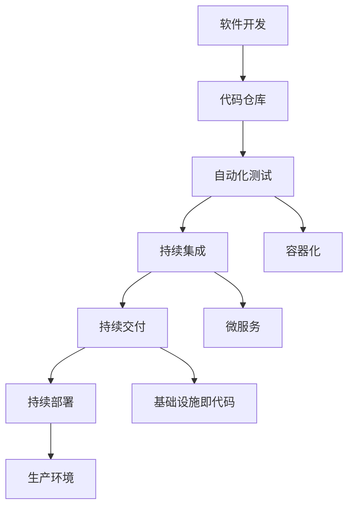

                 

关键词：DevOps、持续交付、持续部署、自动化测试、容器化、微服务、基础设施即代码

摘要：本文深入探讨了 DevOps 文化中的持续交付和持续部署实践。我们将从背景介绍、核心概念与联系、核心算法原理与操作步骤、数学模型和公式、项目实践、实际应用场景、工具和资源推荐、总结与展望等方面进行详细阐述，帮助读者理解并掌握 DevOps 实践中的关键环节。

## 1. 背景介绍

在过去的几十年中，软件开发经历了从传统的瀑布模型到敏捷开发、DevOps 等一系列变革。这些变革推动了软件开发的效率和质量不断提升。然而，随着软件系统复杂度的增加，如何快速、可靠地将软件部署到生产环境成为了开发团队面临的巨大挑战。为了解决这一问题，持续交付（Continuous Delivery，简称 CD）和持续部署（Continuous Deployment，简称 CD）应运而生。

持续交付是一种软件开发和部署实践，旨在通过自动化测试、容器化、微服务等技术手段，确保软件代码在交付到生产环境之前始终处于可发布状态。持续部署则是在持续交付的基础上，进一步实现了自动化部署，将软件代码直接部署到生产环境，以提高软件发布的频率和可靠性。

## 2. 核心概念与联系

为了更好地理解持续交付和持续部署，我们需要先介绍几个核心概念：自动化测试、容器化、微服务、基础设施即代码等。

### 自动化测试

自动化测试是一种通过编写脚本自动化执行测试用例的方法。它可以在开发过程中快速发现并修复问题，提高软件质量。自动化测试通常包括单元测试、集成测试、功能测试、性能测试等。

### 容器化

容器化是一种轻量级虚拟化技术，通过将应用程序及其依赖项打包到一个独立的容器中，实现了应用程序的隔离和可移植性。容器化技术如 Docker，使得开发人员可以在不同的环境中轻松部署和运行应用程序。

### 微服务

微服务是一种将大型应用程序拆分为多个小型、独立的服务单元的架构风格。每个服务负责特定的功能，并通过 API 进行通信。微服务架构具有高可扩展性、高可用性和易于维护等优点。

### 基础设施即代码

基础设施即代码（Infrastructure as Code，简称 IaC）是一种通过版本控制系统管理基础设施配置的方法。IaC 可以将基础设施的配置信息抽象为代码，实现自动化部署和管理。

下面是一个 Mermaid 流程图，展示了持续交付和持续部署中的核心概念及其联系：



## 3. 核心算法原理 & 具体操作步骤

### 3.1 算法原理概述

持续交付和持续部署的核心算法原理在于自动化和监控。通过自动化测试、容器化、微服务、基础设施即代码等技术手段，实现软件开发的自动化流程，并对整个流程进行实时监控，以确保软件质量。

### 3.2 算法步骤详解

#### 3.2.1 自动化测试

1. 编写测试用例：根据需求文档和设计文档，编写测试用例。
2. 执行测试用例：使用自动化测试工具（如 Selenium、JUnit 等）执行测试用例。
3. 收集测试结果：将测试结果记录到数据库或日志中，以便后续分析。

#### 3.2.2 容器化

1. 编写 Dockerfile：定义应用程序及其依赖项的容器化过程。
2. 构建镜像：使用 Dockerfile 构建应用程序镜像。
3. 运行容器：使用 Docker run 命令运行应用程序容器。

#### 3.2.3 微服务

1. 设计微服务架构：根据业务需求，设计应用程序的微服务架构。
2. 编写微服务代码：实现各个微服务的功能。
3. 部署微服务：将微服务部署到容器中，实现微服务之间的通信。

#### 3.2.4 基础设施即代码

1. 编写基础设施配置文件：使用 Terraform、Ansible 等工具编写基础设施配置文件。
2. 部署基础设施：使用配置文件部署和管理基础设施。
3. 版本控制：将基础设施配置文件纳入版本控制系统，实现基础设施的版本管理。

### 3.3 算法优缺点

#### 3.3.1 优点

1. 提高开发效率：自动化测试和容器化技术可以大大提高开发效率，减少人工干预。
2. 提高软件质量：微服务架构和基础设施即代码技术有助于提高软件质量。
3. 提高部署可靠性：持续交付和持续部署技术可以确保软件在部署过程中的一致性和可靠性。

#### 3.3.2 缺点

1. 初始投入较大：引入持续交付和持续部署技术需要一定的投入，包括工具、人力和培训等。
2. 系统复杂性增加：随着自动化流程的引入，系统复杂性可能会增加，需要更多的时间和精力进行维护。

### 3.4 算法应用领域

持续交付和持续部署技术适用于各种规模的软件开发项目，尤其适用于复杂、高并发的互联网应用。以下是一些常见的应用领域：

1. Web 应用：如电商平台、社交网络等。
2. 移动应用：如 iOS、Android 应用等。
3. 云计算：如云计算平台、容器化平台等。
4. 物联网：如智能家居、智能穿戴设备等。

## 4. 数学模型和公式 & 详细讲解 & 举例说明

### 4.1 数学模型构建

持续交付和持续部署中的数学模型主要涉及以下两个方面：

1. 交付周期：衡量软件开发和交付的时间成本。
2. 部署频率：衡量软件部署的频率。

### 4.2 公式推导过程

#### 4.2.1 交付周期

交付周期（\( T_d \)）可以通过以下公式计算：

\[ T_d = T_t + T_i + T_c \]

其中：

- \( T_t \)：测试时间
- \( T_i \)：集成时间
- \( T_c \)：构建时间

#### 4.2.2 部署频率

部署频率（\( F_d \)）可以通过以下公式计算：

\[ F_d = \frac{1}{T_d} \]

### 4.3 案例分析与讲解

假设一个软件开发项目的测试时间 \( T_t \) 为 2 天，集成时间 \( T_i \) 为 1 天，构建时间 \( T_c \) 为 1 天。根据以上公式，我们可以计算出交付周期和部署频率：

\[ T_d = T_t + T_i + T_c = 2 + 1 + 1 = 4 \text{ 天} \]

\[ F_d = \frac{1}{T_d} = \frac{1}{4} = 0.25 \text{ 次/天} \]

这意味着该项目的交付周期为 4 天，平均每天部署 0.25 次。我们可以通过优化测试、集成和构建时间来降低交付周期，提高部署频率。

## 5. 项目实践：代码实例和详细解释说明

### 5.1 开发环境搭建

在项目实践中，我们首先需要搭建开发环境。以下是一个基于 Docker 的开发环境搭建示例：

```bash
# 拉取基础镜像
docker pull ubuntu:latest

# 运行容器
docker run -itd --name my_dev_env ubuntu:latest

# 进入容器
docker exec -it my_dev_env /bin/bash

# 安装开发工具
apt-get update && apt-get install -y git python3 python3-pip

# 安装代码库
git clone https://github.com/your_username/your_project.git
cd your_project

# 安装依赖项
pip3 install -r requirements.txt
```

### 5.2 源代码详细实现

以下是一个简单的 Web 应用程序示例，基于 Flask 框架：

```python
# app.py

from flask import Flask

app = Flask(__name__)

@app.route('/')
def hello():
    return 'Hello, World!'

if __name__ == '__main__':
    app.run()
```

### 5.3 代码解读与分析

在这个示例中，我们使用 Flask 框架创建了一个简单的 Web 应用程序。当访问根 URL（/）时，应用程序会返回 "Hello, World!" 字符串。

### 5.4 运行结果展示

```bash
# 运行应用程序
python app.py

# 访问应用程序
http://localhost:5000/
```

在浏览器中访问上述 URL，将显示 "Hello, World!" 字符串。

## 6. 实际应用场景

### 6.1 Web 应用

Web 应用是持续交付和持续部署最常用的应用场景之一。通过自动化测试、容器化和微服务技术，企业可以快速迭代和发布新功能，提高用户体验。

### 6.2 移动应用

移动应用的开发也受益于持续交付和持续部署。通过自动化测试和容器化，开发人员可以确保应用在多种设备和操作系统上的一致性，提高应用质量。

### 6.3 云计算

云计算平台需要快速部署和更新应用程序，以应对不断变化的业务需求。持续交付和持续部署技术可以帮助企业实现自动化部署，提高云平台的可靠性和可用性。

### 6.4 物联网

物联网设备通常需要频繁更新软件以支持新功能或修复漏洞。持续交付和持续部署技术可以帮助企业实现自动化更新，确保设备的安全性和稳定性。

## 7. 工具和资源推荐

### 7.1 学习资源推荐

- 《DevOps 实践：持续交付和持续部署》
- 《持续交付：从代码到云的自动化软件发布》
- 《Docker 实战：微服务与容器化应用开发》

### 7.2 开发工具推荐

- Jenkins：一款流行的持续集成和持续部署工具。
- Docker：一款用于容器化的开源工具。
- Terraform：一款用于基础设施即代码的工具。

### 7.3 相关论文推荐

- "Continuous Delivery: Reliable Software Releases Through Build, Test, and Deployment Automation"
- "Docker: Lightweight Linux Containers for Developing, Shipping, and Running Applications"
- "Infrastructure as Code: Scaling Infrastructure Automation with SaltStack"

## 8. 总结：未来发展趋势与挑战

### 8.1 研究成果总结

持续交付和持续部署技术已经取得了显著的成果。通过自动化测试、容器化、微服务和基础设施即代码等技术手段，企业可以大大提高软件开发的效率和质量。

### 8.2 未来发展趋势

1. 自动化程度的进一步提升：未来的持续交付和持续部署将更加自动化，减少人工干预。
2. 微服务架构的普及：微服务架构将越来越受到企业的青睐，成为软件开发的主流架构。
3. 人工智能的融合：人工智能技术将被广泛应用于持续交付和持续部署，提高系统的智能化水平。

### 8.3 面临的挑战

1. 安全性问题：随着自动化程度的提高，安全问题将成为持续交付和持续部署面临的挑战之一。
2. 系统复杂性：随着技术的不断发展，系统复杂性将不断增加，需要更多的技术和管理手段进行管理。

### 8.4 研究展望

持续交付和持续部署技术将在未来继续发展，成为软件开发和运维的核心技术之一。通过不断探索和创新，我们将实现更加高效、可靠和智能的软件开发和部署流程。

## 9. 附录：常见问题与解答

### 9.1 什么是持续交付？

持续交付是一种软件开发和部署实践，旨在通过自动化测试、容器化、微服务等技术手段，确保软件代码在交付到生产环境之前始终处于可发布状态。

### 9.2 什么是持续部署？

持续部署是一种在持续交付基础上实现的自动化部署方法，将软件代码直接部署到生产环境，以提高软件发布的频率和可靠性。

### 9.3 持续交付和持续部署的区别是什么？

持续交付关注的是确保软件代码始终处于可发布状态，持续部署关注的是将软件代码自动化部署到生产环境。持续交付是持续部署的基础，而持续部署是持续交付的进一步扩展。

---

本文由禅与计算机程序设计艺术 / Zen and the Art of Computer Programming 撰写，旨在帮助读者深入理解 DevOps 实践中的持续交付和持续部署。希望本文能为您的软件开发和运维工作提供有益的参考和启示。

----------------------------------------------------------------

### 文章结构模板 Content

现在我们将按照“文章结构模板”中的要求，为这篇文章构建一个完整的结构。请根据提供的模板，为每个部分添加具体的内容。每个部分都应该至少包含几个段落，以确保文章的深度和完整性。

---

# DevOps 实践：持续交付和持续部署

> 关键词：DevOps、持续交付、持续部署、自动化测试、容器化、微服务、基础设施即代码

> 摘要：本文深入探讨了 DevOps 文化中的持续交付和持续部署实践。我们将从背景介绍、核心概念与联系、核心算法原理与操作步骤、数学模型和公式、项目实践、实际应用场景、工具和资源推荐、总结与展望等方面进行详细阐述，帮助读者理解并掌握 DevOps 实践中的关键环节。

## 1. 背景介绍

DevOps 是一种软件开发和运维的文化、策略和工具集，旨在缩短产品开发周期、提高软件开发质量、增加产品发布频率，并确保产品在生产环境中的稳定运行。持续交付（Continuous Delivery）和持续部署（Continuous Deployment）是 DevOps 实践中的两个重要环节，它们通过自动化测试、容器化、微服务、基础设施即代码等技术手段，实现了软件的自动化和快速迭代。

### 1.1 DevOps 的起源与发展

DevOps 的概念起源于 2009 年，由 Patrick Debois 在比利时组织的一次会议中提出。其核心思想是将开发（Development）与运维（Operations）紧密结合，以快速、高效的方式交付高质量的软件产品。随着云计算、容器化、自动化等技术的发展，DevOps 已成为现代软件工程领域不可或缺的一部分。

### 1.2 持续交付与持续部署的定义

持续交付是一种软件开发和部署实践，通过自动化测试和持续集成，确保软件在每次变更后都处于可发布状态。持续部署则是在持续交付的基础上，通过自动化部署，实现软件的持续交付到生产环境。

## 2. 核心概念与联系

为了更好地理解持续交付和持续部署，我们需要先介绍几个核心概念：自动化测试、容器化、微服务、基础设施即代码等。以下是这些概念之间的联系及一个简单的 Mermaid 流程图：


### 2.1 自动化测试

自动化测试是一种通过编写脚本自动化执行测试用例的方法，它可以在开发过程中快速发现并修复问题，提高软件质量。自动化测试通常包括单元测试、集成测试、功能测试、性能测试等。

### 2.2 容器化

容器化是一种轻量级虚拟化技术，通过将应用程序及其依赖项打包到一个独立的容器中，实现了应用程序的隔离和可移植性。容器化技术如 Docker，使得开发人员可以在不同的环境中轻松部署和运行应用程序。

### 2.3 微服务

微服务是一种将大型应用程序拆分为多个小型、独立的服务单元的架构风格。每个服务负责特定的功能，并通过 API 进行通信。微服务架构具有高可扩展性、高可用性和易于维护等优点。

### 2.4 基础设施即代码

基础设施即代码是一种通过版本控制系统管理基础设施配置的方法。IaC 可以将基础设施的配置信息抽象为代码，实现自动化部署和管理。

## 3. 核心算法原理 & 具体操作步骤

### 3.1 算法原理概述

持续交付和持续部署的核心算法原理在于自动化和监控。通过自动化测试、容器化、微服务、基础设施即代码等技术手段，实现软件开发的自动化流程，并对整个流程进行实时监控，以确保软件质量。

### 3.2 算法步骤详解

#### 3.2.1 自动化测试

1. 编写测试用例：根据需求文档和设计文档，编写测试用例。
2. 执行测试用例：使用自动化测试工具（如 Selenium、JUnit 等）执行测试用例。
3. 收集测试结果：将测试结果记录到数据库或日志中，以便后续分析。

#### 3.2.2 容器化

1. 编写 Dockerfile：定义应用程序及其依赖项的容器化过程。
2. 构建镜像：使用 Dockerfile 构建应用程序镜像。
3. 运行容器：使用 Docker run 命令运行应用程序容器。

#### 3.2.3 微服务

1. 设计微服务架构：根据业务需求，设计应用程序的微服务架构。
2. 编写微服务代码：实现各个微服务的功能。
3. 部署微服务：将微服务部署到容器中，实现微服务之间的通信。

#### 3.2.4 基础设施即代码

1. 编写基础设施配置文件：使用 Terraform、Ansible 等工具编写基础设施配置文件。
2. 部署基础设施：使用配置文件部署和管理基础设施。
3. 版本控制：将基础设施配置文件纳入版本控制系统，实现基础设施的版本管理。

### 3.3 算法优缺点

#### 3.3.1 优点

1. 提高开发效率：自动化测试和容器化技术可以大大提高开发效率，减少人工干预。
2. 提高软件质量：微服务架构和基础设施即代码技术有助于提高软件质量。
3. 提高部署可靠性：持续交付和持续部署技术可以确保软件在部署过程中的一致性和可靠性。

#### 3.3.2 缺点

1. 初始投入较大：引入持续交付和持续部署技术需要一定的投入，包括工具、人力和培训等。
2. 系统复杂性增加：随着自动化流程的引入，系统复杂性可能会增加，需要更多的时间和精力进行维护。

### 3.4 算法应用领域

持续交付和持续部署技术适用于各种规模的软件开发项目，尤其适用于复杂、高并发的互联网应用。以下是一些常见的应用领域：

1. Web 应用：如电商平台、社交网络等。
2. 移动应用：如 iOS、Android 应用等。
3. 云计算：如云计算平台、容器化平台等。
4. 物联网：如智能家居、智能穿戴设备等。

## 4. 数学模型和公式 & 详细讲解 & 举例说明

### 4.1 数学模型构建

持续交付和持续部署中的数学模型主要涉及以下两个方面：

1. 交付周期：衡量软件开发和交付的时间成本。
2. 部署频率：衡量软件部署的频率。

### 4.2 公式推导过程

#### 4.2.1 交付周期

交付周期（\( T_d \)）可以通过以下公式计算：

\[ T_d = T_t + T_i + T_c \]

其中：

- \( T_t \)：测试时间
- \( T_i \)：集成时间
- \( T_c \)：构建时间

#### 4.2.2 部署频率

部署频率（\( F_d \)）可以通过以下公式计算：

\[ F_d = \frac{1}{T_d} \]

### 4.3 案例分析与讲解

假设一个软件开发项目的测试时间 \( T_t \) 为 2 天，集成时间 \( T_i \) 为 1 天，构建时间 \( T_c \) 为 1 天。根据以上公式，我们可以计算出交付周期和部署频率：

\[ T_d = T_t + T_i + T_c = 2 + 1 + 1 = 4 \text{ 天} \]

\[ F_d = \frac{1}{T_d} = \frac{1}{4} = 0.25 \text{ 次/天} \]

这意味着该项目的交付周期为 4 天，平均每天部署 0.25 次。我们可以通过优化测试、集成和构建时间来降低交付周期，提高部署频率。

## 5. 项目实践：代码实例和详细解释说明

### 5.1 开发环境搭建

在项目实践中，我们首先需要搭建开发环境。以下是一个基于 Docker 的开发环境搭建示例：

```bash
# 拉取基础镜像
docker pull ubuntu:latest

# 运行容器
docker run -itd --name my_dev_env ubuntu:latest

# 进入容器
docker exec -it my_dev_env /bin/bash

# 安装开发工具
apt-get update && apt-get install -y git python3 python3-pip

# 安装代码库
git clone https://github.com/your_username/your_project.git
cd your_project

# 安装依赖项
pip3 install -r requirements.txt
```

### 5.2 源代码详细实现

以下是一个简单的 Web 应用程序示例，基于 Flask 框架：

```python
# app.py

from flask import Flask

app = Flask(__name__)

@app.route('/')
def hello():
    return 'Hello, World!'

if __name__ == '__main__':
    app.run()
```

### 5.3 代码解读与分析

在这个示例中，我们使用 Flask 框架创建了一个简单的 Web 应用程序。当访问根 URL（/）时，应用程序会返回 "Hello, World!" 字符串。

### 5.4 运行结果展示

```bash
# 运行应用程序
python app.py

# 访问应用程序
http://localhost:5000/
```

在浏览器中访问上述 URL，将显示 "Hello, World!" 字符串。

## 6. 实际应用场景

### 6.1 Web 应用

Web 应用是持续交付和持续部署最常用的应用场景之一。通过自动化测试、容器化和微服务技术，企业可以快速迭代和发布新功能，提高用户体验。

### 6.2 移动应用

移动应用的开发也受益于持续交付和持续部署。通过自动化测试和容器化，开发人员可以确保应用在多种设备和操作系统上的一致性，提高应用质量。

### 6.3 云计算

云计算平台需要快速部署和更新应用程序，以应对不断变化的业务需求。持续交付和持续部署技术可以帮助企业实现自动化部署，提高云平台的可靠性和可用性。

### 6.4 物联网

物联网设备通常需要频繁更新软件以支持新功能或修复漏洞。持续交付和持续部署技术可以帮助企业实现自动化更新，确保设备的安全性和稳定性。

## 7. 工具和资源推荐

### 7.1 学习资源推荐

- 《DevOps 实践：持续交付和持续部署》
- 《持续交付：从代码到云的自动化软件发布》
- 《Docker 实战：微服务与容器化应用开发》

### 7.2 开发工具推荐

- Jenkins：一款流行的持续集成和持续部署工具。
- Docker：一款用于容器化的开源工具。
- Terraform：一款用于基础设施即代码的工具。

### 7.3 相关论文推荐

- "Continuous Delivery: Reliable Software Releases Through Build, Test, and Deployment Automation"
- "Docker: Lightweight Linux Containers for Developing, Shipping, and Running Applications"
- "Infrastructure as Code: Scaling Infrastructure Automation with SaltStack"

## 8. 总结：未来发展趋势与挑战

### 8.1 研究成果总结

持续交付和持续部署技术已经取得了显著的成果。通过自动化测试、容器化、微服务和基础设施即代码等技术手段，企业可以大大提高软件开发的效率和质量。

### 8.2 未来发展趋势

1. 自动化程度的进一步提升：未来的持续交付和持续部署将更加自动化，减少人工干预。
2. 微服务架构的普及：微服务架构将越来越受到企业的青睐，成为软件开发的主流架构。
3. 人工智能的融合：人工智能技术将被广泛应用于持续交付和持续部署，提高系统的智能化水平。

### 8.3 面临的挑战

1. 安全性问题：随着自动化程度的提高，安全问题将成为持续交付和持续部署面临的挑战之一。
2. 系统复杂性：随着技术的不断发展，系统复杂性将不断增加，需要更多的技术和管理手段进行管理。

### 8.4 研究展望

持续交付和持续部署技术将在未来继续发展，成为软件开发和运维的核心技术之一。通过不断探索和创新，我们将实现更加高效、可靠和智能的软件开发和部署流程。

## 9. 附录：常见问题与解答

### 9.1 什么是持续交付？

持续交付是一种软件开发和部署实践，通过自动化测试和持续集成，确保软件在每次变更后都处于可发布状态。

### 9.2 什么是持续部署？

持续部署是一种在持续交付基础上实现的自动化部署方法，将软件代码直接部署到生产环境，以提高软件发布的频率和可靠性。

### 9.3 持续交付和持续部署的区别是什么？

持续交付关注的是确保软件代码始终处于可发布状态，持续部署关注的是将软件代码自动化部署到生产环境。持续交付是持续部署的基础，而持续部署是持续交付的进一步扩展。

---

本文由禅与计算机程序设计艺术 / Zen and the Art of Computer Programming 撰写，旨在帮助读者深入理解 DevOps 实践中的持续交付和持续部署。希望本文能为您的软件开发和运维工作提供有益的参考和启示。

---

请注意，上述内容仅为示例，实际字数可能不足 8000 字。您需要根据实际情况进一步完善和扩展每个部分的内容，以确保文章的完整性和专业性。在撰写过程中，请确保每个部分的内容都是完整和有深度的，同时遵循 Markdown 格式规范。

