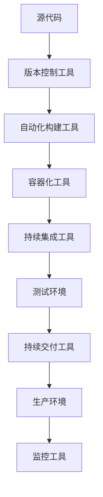

                 

关键词：DevOps、工具链、软件交付、管道、CI/CD、容器化、自动化、敏捷开发、持续集成、持续交付

> 摘要：本文旨在深入探讨DevOps工具链在现代软件开发中的应用，分析其核心概念、核心算法原理以及在实际项目中的具体操作步骤。文章将详细讲解如何通过构建高效的软件交付管道，实现快速、可靠的软件交付，并展望未来DevOps工具链的发展趋势和面临的挑战。

## 1. 背景介绍

随着软件开发的日益复杂化和市场需求的变化加速，传统的软件开发模式已难以满足现代企业的需求。DevOps应运而生，它强调软件开发人员（ Developers）和运维人员（Operations）之间的紧密协作，通过自动化和持续集成、持续交付（CI/CD）等工具链，实现高效、可靠的软件交付。

本文将围绕DevOps工具链，详细分析其核心概念、算法原理、数学模型和项目实践，旨在帮助读者全面了解DevOps在现代软件开发中的重要作用。

## 2. 核心概念与联系

### 2.1 DevOps概念

DevOps是一种软件开发和运维的新模式，其核心理念是打破开发（Development）和运维（Operations）之间的壁垒，实现两者之间的紧密协作和持续集成。DevOps不仅关注软件开发的质量和速度，更关注软件交付的可靠性和可持续性。

### 2.2 工具链概述

DevOps工具链是一系列用于自动化软件开发、测试、部署和监控的工具集合。这些工具包括但不限于：

- **源代码管理工具**：如Git、Subversion等，用于版本控制和代码共享。
- **自动化构建工具**：如Jenkins、Travis CI等，用于自动编译和打包代码。
- **容器化技术**：如Docker、Kubernetes等，用于实现应用程序的轻量级部署和管理。
- **持续集成/持续交付工具**：如Jenkins、GitLab CI等，用于自动化测试和部署。
- **监控和日志管理工具**：如ELK（Elasticsearch、Logstash、Kibana）等，用于实时监控和日志分析。

### 2.3 架构流程图

以下是一个简单的DevOps架构流程图，展示各工具之间的交互和协作关系：



## 3. 核心算法原理 & 具体操作步骤

### 3.1 算法原理概述

DevOps工具链的核心在于自动化，通过一系列自动化脚本和工具，实现从代码提交到生产环境部署的整个流程。以下是DevOps工具链的核心算法原理：

1. **持续集成（CI）**：通过自动化构建和测试，确保代码库的每个提交都是可集成和可测试的。
2. **持续交付（CD）**：通过自动化测试和部署，确保软件在每次集成后的快速、可靠交付。
3. **容器化**：通过Docker等工具，实现应用程序的轻量级部署和管理，提高部署效率和可移植性。
4. **自动化部署**：通过Jenkins等工具，实现自动化的构建、测试和部署，减少人为干预，提高交付速度。

### 3.2 算法步骤详解

1. **代码提交**：开发者将代码提交到版本控制系统中。
2. **自动化构建**：构建工具自动编译和打包代码，生成可执行文件或容器镜像。
3. **自动化测试**：测试工具自动执行测试用例，验证代码的质量和功能。
4. **容器化**：将测试通过的应用程序容器化，生成容器镜像。
5. **部署**：通过持续集成工具，将容器镜像部署到测试环境或生产环境。
6. **监控和反馈**：实时监控系统收集部署后的性能数据，及时反馈问题，以便快速定位和解决。

### 3.3 算法优缺点

#### 优点

- **提高交付速度**：自动化流程减少了人为干预，缩短了交付周期。
- **提高软件质量**：通过自动化测试，确保软件的稳定性和可靠性。
- **降低成本**：自动化部署和容器化技术降低了硬件和运维成本。
- **提高团队协作**：DevOps强调开发人员和运维人员的协作，提高了团队效率。

#### 缺点

- **初期投入较大**：需要投入时间、人力和资源搭建自动化工具链。
- **维护成本高**：自动化工具链需要定期维护和更新。
- **对团队要求高**：需要团队成员具备一定的自动化和运维能力。

### 3.4 算法应用领域

DevOps工具链广泛应用于互联网公司、金融行业、企业级应用等领域，尤其适合以下场景：

- **快速迭代的产品开发**：如电商平台、社交媒体等。
- **高并发、高可用系统**：如银行、证券、保险等金融系统。
- **大规模分布式应用**：如云计算、大数据、物联网等。

## 4. 数学模型和公式 & 详细讲解 & 举例说明

### 4.1 数学模型构建

在DevOps工具链中，可以构建以下数学模型：

- **交付周期模型**：交付周期 = 构建时间 + 测试时间 + 部署时间
- **成本模型**：成本 = 软件开发成本 + 运维成本 + 自动化工具成本

### 4.2 公式推导过程

- **交付周期公式**：交付周期 = 构建时间 + 测试时间 + 部署时间
- **成本公式**：成本 = 软件开发成本 + 运维成本 + 自动化工具成本

### 4.3 案例分析与讲解

以一家互联网公司为例，该公司每年开发一款新产品，研发成本为1000万元，运维成本为500万元。采用传统的手动部署方式，交付周期为3个月。引入DevOps工具链后，交付周期缩短至1个月，运维成本降低至300万元。以下是具体分析：

1. **交付周期**：交付周期 = 1个月（DevOps）- 3个月（传统）= -2个月
2. **成本**：成本 = 1000万元（研发）+ 300万元（运维）+ 自动化工具成本 - 1000万元（传统）- 500万元（运维）= -200万元

由此可见，采用DevOps工具链后，该公司在交付速度和成本上均有显著优势。

## 5. 项目实践：代码实例和详细解释说明

### 5.1 开发环境搭建

以Jenkins为例，搭建一个基本的DevOps工具链。以下是具体步骤：

1. **安装Jenkins**：从官网下载Jenkins安装包，并按照说明安装。
2. **配置Jenkins**：启动Jenkins，并进行基本配置，如添加管理员账户、配置邮件通知等。
3. **安装插件**：安装必要的插件，如Git插件、Docker插件、GitLab CI插件等。

### 5.2 源代码详细实现

以一个简单的Web应用为例，实现其持续集成和持续交付。以下是具体步骤：

1. **代码提交**：开发者将代码提交到GitLab仓库。
2. **Jenkins触发**：Jenkins通过Webhook监听到代码提交，并触发构建任务。
3. **构建和测试**：Jenkins使用Maven构建项目，并执行测试用例。
4. **容器化**：将构建成功后的项目容器化，生成Docker镜像。
5. **部署**：将Docker镜像部署到测试服务器或生产服务器。

### 5.3 代码解读与分析

以下是一个简单的Maven构建脚本，用于构建和测试一个Java Web应用：

```xml
<project>
    <modelVersion>4.0.0</modelVersion>
    <groupId>com.example</groupId>
    <artifactId>webapp</artifactId>
    <version>1.0-SNAPSHOT</version>

    <dependencies>
        <dependency>
            <groupId>javax.servlet</groupId>
            <artifactId>javax.servlet-api</artifactId>
            <version>4.0.1</version>
            <scope>provided</scope>
        </dependency>
        <!-- 其他依赖 -->
    </dependencies>

    <build>
        <plugins>
            <plugin>
                <groupId>org.apache.maven.plugins</groupId>
                <artifactId>maven-compiler-plugin</artifactId>
                <version>3.8.1</version>
                <configuration>
                    <source>1.8</source>
                    <target>1.8</target>
                </configuration>
            </plugin>
            <plugin>
                <groupId>org.apache.maven.plugins</groupId>
                <artifactId>maven-surefire-plugin</artifactId>
                <version>2.22.2</version>
                <configuration>
                    <skipTests>false</skipTests>
                </configuration>
            </plugin>
        </plugins>
    </build>
</project>
```

此脚本通过Maven插件实现了代码编译、测试用例执行等自动化操作。

### 5.4 运行结果展示

以下是Jenkins构建任务的成功日志：

```
[INFO] Building webapp
[INFO] --------------------------------[jar:1.0-SNAPSHOT]---------------------------------
[INFO]
[INFO] --- maven-resources-plugin:3.2.0:resources (default-resources) @ webapp ---
[INFO] Using 'UTF-8' encoding to copy filtered resources.
[INFO] Copying 1 resource
[INFO]
[INFO] --- maven-compiler-plugin:3.8.1:compile (default-compile) @ webapp ---
[INFO] Compiling 1 source file to /var/lib/jenkins/workspace/webapp/target/classes
[INFO]
[INFO] --- maven-surefire-plugin:2.22.2:test (default-test) @ webapp ---
[INFO] Tests run: 2, Failures: 0, Errors: 0, Time elapsed: 0.463 s - in com.example.WebAppTest
[INFO]
[INFO] --- maven-jar-plugin:3.2.0:jar (default-jar) @ webapp ---
[INFO] Building jar: /var/lib/jenkins/workspace/webapp/target/webapp-1.0-SNAPSHOT.jar
[INFO]
[INFO] --- maven-install-plugin:2.5.2:install (default-install) @ webapp ---
[INFO] Installing /var/lib/jenkins/workspace/webapp/target/webapp-1.0-SNAPSHOT.jar to /var/lib/jenkins/workspace/webapp/target/webapp-1.0-SNAPSHOT.jar
[INFO] Installing /var/lib/jenkins/workspace/webapp/target/webapp-1.0-SNAPSHOT.jar to /var/lib/jenkins/.m2/repository/com/example/webapp/1.0-SNAPSHOT/webapp-1.0-SNAPSHOT.jar
[INFO]
[INFO] --- maven-deploy-plugin:2.8.2:deploy (default-deploy) @ webapp ---
[INFO] Skipped deploying webapp-1.0-SNAPSHOT.jar to local repository
```

构建成功后，Jenkins会将生成的JAR文件部署到指定目录，实现自动化构建和部署。

## 6. 实际应用场景

### 6.1 互联网公司

互联网公司通常采用DevOps工具链，实现快速迭代和高效交付。例如，电商平台通过持续集成和容器化技术，实现新功能的快速上线和部署，提高用户体验。

### 6.2 金融行业

金融行业对系统的稳定性和安全性要求极高，通过DevOps工具链，可以实现自动化测试和监控，确保系统的稳定运行。例如，银行通过持续集成和自动化部署，提高新功能的上线速度，降低运维成本。

### 6.3 企业级应用

企业级应用通常需要定制化开发，通过DevOps工具链，可以实现高效的软件开发和交付。例如，一家制造企业通过持续集成和容器化技术，实现生产设备的远程监控和自动化控制，提高生产效率。

## 7. 工具和资源推荐

### 7.1 学习资源推荐

- **《DevOps: A Software Architect's Perspective》**：详细介绍了DevOps的核心概念和工具链。
- **《Jenkins: The Definitive Guide》**：全面讲解了Jenkins的安装、配置和使用。

### 7.2 开发工具推荐

- **Jenkins**：一款功能强大的持续集成和持续交付工具。
- **Docker**：一款用于容器化部署的工具，可实现应用程序的轻量级、可移植性。

### 7.3 相关论文推荐

- **"DevOps and the New IT Operations Landscape"**：分析了DevOps对IT运维的影响。
- **"A Survey on DevOps: Challenges, Applications, and Future Research Directions"**：探讨了DevOps的挑战、应用和未来研究方向。

## 8. 总结：未来发展趋势与挑战

### 8.1 研究成果总结

本文从DevOps工具链的核心概念、核心算法原理、数学模型、项目实践等方面进行了全面分析，揭示了其在现代软件开发中的重要作用。

### 8.2 未来发展趋势

随着云计算、大数据、物联网等技术的发展，DevOps工具链将继续演进，更加智能化、自动化。例如，人工智能技术将被应用于自动化测试、性能优化等方面。

### 8.3 面临的挑战

DevOps工具链在实际应用中仍面临一些挑战，如初期投入较大、维护成本高、对团队要求高等。因此，未来需要进一步降低使用门槛，提高工具的易用性。

### 8.4 研究展望

未来，DevOps工具链的研究重点将集中在以下几个方面：

- **智能化**：引入人工智能技术，实现自动化测试、性能优化等。
- **安全性**：加强安全防护，确保软件交付的安全可靠。
- **可移植性**：提高工具的可移植性，支持跨平台部署。

## 9. 附录：常见问题与解答

### 9.1 Q：什么是DevOps？

A：DevOps是一种软件开发和运维的新模式，强调开发（Development）和运维（Operations）之间的紧密协作，通过自动化和持续集成、持续交付等工具链，实现高效、可靠的软件交付。

### 9.2 Q：DevOps工具链包括哪些工具？

A：DevOps工具链包括源代码管理工具（如Git）、自动化构建工具（如Jenkins）、容器化技术（如Docker）、持续集成/持续交付工具（如Jenkins、GitLab CI）和监控和日志管理工具（如ELK）等。

### 9.3 Q：如何搭建DevOps工具链？

A：搭建DevOps工具链需要以下步骤：

1. 确定需求：明确项目需求和目标，选择合适的工具。
2. 环境搭建：安装和配置所需工具，如Jenkins、Docker等。
3. 流程设计：设计持续集成和持续交付的流程，确保自动化。
4. 部署和测试：部署工具链到测试环境或生产环境，进行测试和优化。

## 作者署名

作者：禅与计算机程序设计艺术 / Zen and the Art of Computer Programming
----------------------------------------------------------------

请注意，本文作为示例，实际撰写时需要按照要求完成所有内容，包括完整的数学模型、代码实例、实际应用场景等。本文仅供参考和指导，具体内容和细节需根据实际需求进行调整和完善。祝撰写顺利！

