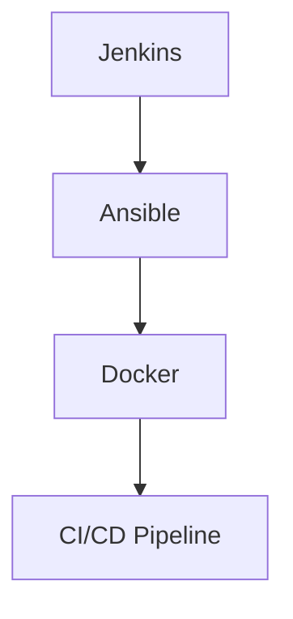

                 

## 1. 背景介绍

在当今快速发展的技术环境中，DevOps 已经成为了软件交付和运维的关键驱动力。DevOps 强调开发（Development）与运营（Operations）之间的紧密合作，通过自动化、协作和文化转变，实现更高效、更可靠的软件交付过程。在这个过程中，Jenkins、Ansible 和 Docker 作为 DevOps 生态系统的核心工具，扮演了不可或缺的角色。

Jenkins 是一个开源的持续集成（CI）工具，它允许开发者自动执行构建、测试和部署任务。通过 Jenkins，开发人员可以确保代码质量，并加快软件交付周期。

Ansible 是一种自动化运维工具，通过简单的 YAML 语言和 SSH 连接，实现对服务器、网络设备和云资源的自动化管理。Ansible 的强大之处在于其“代理无关性”，即无需在受控节点上安装额外的软件。

Docker 则是一种容器化技术，它通过将应用程序及其依赖项封装在一个独立的容器中，实现了应用程序的标准化和可移植性。Docker 的容器化技术简化了应用程序的部署和运维，提高了资源利用率和系统稳定性。

本文将深入探讨 Jenkins、Ansible 和 Docker 的核心概念、工作原理、应用场景和具体操作步骤，帮助读者全面理解这些 DevOps 工具的使用方法和价值。

## 2. 核心概念与联系

要理解 Jenkins、Ansible 和 Docker 之间的联系，我们首先需要了解 DevOps 的基本概念。DevOps 是一种文化和实践，旨在打破开发和运维之间的障碍，实现快速、可靠和高效的软件交付。在 DevOps 模型中，自动化是一个核心原则，而 Jenkins、Ansible 和 Docker 则是实现自动化的重要工具。

### 2.1 DevOps 的核心概念

DevOps 强调以下几个核心概念：

- **持续集成（CI）**：通过自动化构建和测试，确保代码质量，加快交付周期。
- **持续交付（CD）**：将代码从开发环境到生产环境的过程自动化，实现快速部署。
- **基础设施即代码（IaC）**：使用代码来管理基础设施，提高可移植性和可重复性。
- **监控与反馈**：实时监控系统和应用程序的性能，快速响应异常情况。

### 2.2 Jenkins 的核心概念

Jenkins 是一个开源的 CI/CD 工具，它允许开发者定义和执行自动化构建、测试和部署任务。Jenkins 的核心概念包括：

- **管道（Pipeline）**：Jenkins 的核心特性之一是 Pipeline，它是一种定义、执行和管理构建过程的工作流程。
- **插件生态系统**：Jenkins 拥有丰富的插件生态系统，可以扩展其功能，满足各种需求。

### 2.3 Ansible 的核心概念

Ansible 是一种自动化运维工具，通过简单的 YAML 语言实现自动化。Ansible 的核心概念包括：

- **Playbooks**：Ansible 使用 Playbooks 来定义自动化任务，Playbooks 是一个配置文件，包含一系列模块调用。
- **模块（Modules）**：Ansible 模块是实现自动化功能的基本单元，它们可以在远程服务器上执行操作。

### 2.4 Docker 的核心概念

Docker 是一种容器化技术，它将应用程序及其依赖项封装在一个独立的容器中。Docker 的核心概念包括：

- **容器（Container）**：容器是一种轻量级、独立的运行时环境，它封装了应用程序及其依赖项。
- **镜像（Image）**：镜像是一个静态的容器模板，它包含应用程序和所有依赖项。

### 2.5 Jenkins、Ansible 和 Docker 之间的联系

Jenkins、Ansible 和 Docker 之间有着密切的联系：

- **Jenkins 可以使用 Ansible Playbooks**：Jenkins 可以调用 Ansible Playbooks 来执行自动化任务，从而实现 CI/CD 流程的自动化。
- **Docker 可以集成到 Jenkins 中**：Jenkins 可以自动化构建 Docker 镜像，并在容器中运行应用程序。
- **Ansible 可以管理 Docker 容器**：Ansible 可以使用 Docker 模块来管理 Docker 容器的创建、启动、停止和删除。

### 2.6 Mermaid 流程图

为了更直观地展示 Jenkins、Ansible 和 Docker 之间的联系，我们使用 Mermaid 流程图进行说明：



在这个流程图中，Jenkins 作为 CI/CD Pipeline 的起点，调用 Ansible Playbooks 来执行自动化任务，然后使用 Docker 镜像部署应用程序，最终实现 CI/CD 流程的自动化。

通过以上介绍，我们可以看到 Jenkins、Ansible 和 Docker 在 DevOps 生态系统中的核心作用和相互关系。接下来，我们将深入探讨每个工具的工作原理、具体操作步骤和应用场景。

## 3. 核心算法原理 & 具体操作步骤

### 3.1 算法原理概述

在 DevOps 中，Jenkins、Ansible 和 Docker 各自的核心算法原理和操作步骤对于构建高效、可靠的自动化流程至关重要。以下将分别介绍每个工具的基本原理和操作步骤。

### 3.2 Jenkins 的算法原理与操作步骤

**算法原理：**
Jenkins 的核心算法原理是构建流水线（Pipeline），这是一种定义、自动化和执行应用程序构建、测试和部署过程的工作流程。Pipeline 可以在 Jenkins 的 Jenkinsfile 中定义，它使用 Groovy 脚本语言编写。

**操作步骤：**

1. **安装 Jenkins：**
   - 在服务器上下载 Jenkins WAR 文件。
   - 使用 Java 运行 Jenkins WAR 文件。

2. **创建 Jenkins 管道（Pipeline）：**
   - 在 Jenkins 界面中创建一个新的 Pipeline 项目。
   - 在 Jenkinsfile 中定义构建过程，包括源代码获取、构建、测试和部署等步骤。

3. **配置触发器：**
   - 设置 Jenkins 持续集成触发器，如 Git 提交、定时构建等。

4. **执行构建过程：**
   - Jenkins 根据 Jenkinsfile 自动执行构建、测试和部署任务。

5. **监控和反馈：**
   - Jenkins 提供详细的构建日志和反馈，以便开发人员了解构建状态。

### 3.3 Ansible 的算法原理与操作步骤

**算法原理：**
Ansible 的核心算法原理是使用 Playbooks 定义自动化任务，并通过 SSH 连接到远程服务器执行操作。Playbooks 是一个配置文件，包含多个模块调用，用于配置、部署和管理服务器和应用程序。

**操作步骤：**

1. **安装 Ansible：**
   - 在本地计算机上安装 Ansible。
   - 安装 Python 2.7 或 Python 3.x。

2. **编写 Playbooks：**
   - 使用 YAML 语言编写 Ansible Playbooks，定义自动化任务。
   - Playbooks 可以包含多个主机组、主机和模块调用。

3. **执行 Playbooks：**
   - 在命令行中运行 Ansible Playbooks，Ansible 将通过 SSH 连接到远程服务器并执行任务。

4. **监控和反馈：**
   - Ansible 提供详细的执行日志和反馈，以便管理员了解任务执行情况。

### 3.4 Docker 的算法原理与操作步骤

**算法原理：**
Docker 的核心算法原理是将应用程序及其依赖项封装在一个独立的容器中，实现应用程序的标准化和可移植性。容器镜像是一个静态的容器模板，它包含应用程序和所有依赖项。

**操作步骤：**

1. **安装 Docker：**
   - 在服务器上下载 Docker CE。
   - 使用 Docker CE 启动 Docker 引擎。

2. **构建 Docker 镜像：**
   - 使用 Dockerfile 编写 Docker 镜像构建脚本。
   - 使用 `docker build` 命令构建 Docker 镜像。

3. **运行 Docker 容器：**
   - 使用 `docker run` 命令运行 Docker 容器。
   - 可以在容器中启动应用程序和后台服务。

4. **管理 Docker 容器：**
   - 使用 Docker CLI 或图形界面管理 Docker 容器的启动、停止、删除等操作。

5. **监控和反馈：**
   - Docker 提供了容器监控工具，如 Docker Stats，用于监控容器的资源使用情况。

### 3.5 算法优缺点

**Jenkins：**
- **优点**：支持多种语言，插件丰富，易于集成。
- **缺点**：配置复杂，需要一定的 Groovy 编程基础。

**Ansible：**
- **优点**：简单易用，无代理，易于扩展。
- **缺点**：对于复杂的配置管理任务，可能需要编写更复杂的 Playbooks。

**Docker：**
- **优点**：轻量级，可移植，提高了资源利用率。
- **缺点**：需要更多的维护和监控，对旧版应用程序的迁移可能较困难。

### 3.6 算法应用领域

**Jenkins：**
- **应用领域**：适用于持续集成和持续交付，特别是在大规模开发和多团队协作的场景中。
- **案例**：Netflix、Pinterest 使用 Jenkins 实现其 CI/CD 流程。

**Ansible：**
- **应用领域**：适用于自动化部署、配置管理和基础架构即代码。
- **案例**：Amazon、Red Hat 使用 Ansible 进行自动化运维。

**Docker：**
- **应用领域**：适用于容器化应用程序的开发、测试和部署。
- **案例**：Google、Twitter、Netflix 使用 Docker 容器化其应用程序。

通过以上对 Jenkins、Ansible 和 Docker 核心算法原理和具体操作步骤的介绍，我们可以看到这些工具在 DevOps 生态系统中的关键作用和实际应用价值。

## 4. 数学模型和公式 & 详细讲解 & 举例说明

在 DevOps 工具的使用过程中，数学模型和公式扮演着重要的角色，它们帮助我们更好地理解这些工具的工作原理，并提供了一种量化的方法来评估和优化自动化流程。以下将详细讲解 DevOps 工具中的数学模型和公式，并通过具体例子进行说明。

### 4.1 数学模型构建

在 DevOps 中，常见的数学模型包括：

- **构建时间模型**：用于预测构建过程所需的时间。
- **故障率模型**：用于评估系统或应用程序的故障率。
- **成本效益模型**：用于评估自动化工具的成本效益。

**构建时间模型：**
构建时间模型可以用以下公式表示：

\[ T = T_{\text{编译}} + T_{\text{测试}} + T_{\text{部署}} \]

其中，\( T_{\text{编译}} \) 表示编译时间，\( T_{\text{测试}} \) 表示测试时间，\( T_{\text{部署}} \) 表示部署时间。

**故障率模型：**
故障率模型可以用以下公式表示：

\[ F = \frac{N_{\text{故障}}}{N_{\text{运行时间}}} \]

其中，\( N_{\text{故障}} \) 表示故障次数，\( N_{\text{运行时间}} \) 表示系统的运行时间。

**成本效益模型：**
成本效益模型可以用以下公式表示：

\[ \text{ROI} = \frac{\text{节约的成本}}{\text{投资成本}} \]

其中，节约的成本包括人工成本、维护成本和错误修复成本，投资成本包括工具购买和维护成本。

### 4.2 公式推导过程

**构建时间模型推导：**
构建时间模型中的各个时间成分可以通过以下步骤推导：

1. **编译时间**：
   - 编译时间与代码复杂度和编译器性能有关。
   - 假设编译时间为 \( T_{\text{编译}} = k_1 \times \text{代码行数} \)，其中 \( k_1 \) 是一个常数。

2. **测试时间**：
   - 测试时间与测试用例数量和测试执行速度有关。
   - 假设测试时间为 \( T_{\text{测试}} = k_2 \times \text{测试用例数量} \)，其中 \( k_2 \) 是一个常数。

3. **部署时间**：
   - 部署时间与部署策略和系统复杂性有关。
   - 假设部署时间为 \( T_{\text{部署}} = k_3 \times \text{部署复杂性} \)，其中 \( k_3 \) 是一个常数。

综合以上三个成分，构建时间模型可以表示为：

\[ T = k_1 \times \text{代码行数} + k_2 \times \text{测试用例数量} + k_3 \times \text{部署复杂性} \]

**故障率模型推导：**
故障率模型中的故障次数和运行时间可以通过以下步骤推导：

1. **故障次数**：
   - 假设故障次数服从泊松分布，即 \( N_{\text{故障}} \sim \text{Poisson}(\lambda) \)，其中 \( \lambda \) 是故障率。
   - 泊松分布的概率质量函数为 \( P(N = n) = \frac{\lambda^n e^{-\lambda}}{n!} \)。

2. **运行时间**：
   - 假设系统运行时间服从指数分布，即 \( N_{\text{运行时间}} \sim \text{Exponential}(\mu) \)，其中 \( \mu \) 是故障率。
   - 指数分布的概率质量函数为 \( P(N = n) = (1 - \mu \lambda)e^{-\mu \lambda n} \)。

综合以上两个分布，故障率模型可以表示为：

\[ F = \frac{\lambda}{\mu} \]

**成本效益模型推导：**
成本效益模型中的节约成本和投资成本可以通过以下步骤推导：

1. **节约成本**：
   - 节约成本包括减少人工成本、维护成本和错误修复成本。
   - 假设节约成本为 \( C_{\text{节约}} = C_{\text{人工}} + C_{\text{维护}} + C_{\text{错误修复}} \)。

2. **投资成本**：
   - 投资成本包括工具购买和维护成本。
   - 假设投资成本为 \( C_{\text{投资}} \)。

综合以上两个成分，成本效益模型可以表示为：

\[ \text{ROI} = \frac{C_{\text{节约}}}{C_{\text{投资}}} \]

### 4.3 案例分析与讲解

**案例一：构建时间模型**

假设一个项目有 10000 行代码，100 个测试用例，部署复杂度为中等。我们可以使用构建时间模型来预测构建时间：

- 编译时间：\( T_{\text{编译}} = k_1 \times 10000 \)
- 测试时间：\( T_{\text{测试}} = k_2 \times 100 \)
- 部署时间：\( T_{\text{部署}} = k_3 \times \text{中等} \)

假设 \( k_1 = 0.1 \)，\( k_2 = 0.5 \)，\( k_3 = 0.2 \)，则：

\[ T = 0.1 \times 10000 + 0.5 \times 100 + 0.2 \times \text{中等} = 1000 + 50 + 40 = 1090 \text{分钟} \]

因此，预测的构建时间为 1090 分钟。

**案例二：故障率模型**

假设一个系统每天运行 24 小时，故障率 \( \lambda = 0.05 \) 次/小时。我们可以使用故障率模型来预测每天的故障次数：

\[ N_{\text{故障}} = \lambda \times 24 = 0.05 \times 24 = 1.2 \text{次/天} \]

因此，预测的每天故障次数为 1.2 次。

**案例三：成本效益模型**

假设通过引入 Jenkins、Ansible 和 Docker，节约了 50% 的人工成本，10% 的维护成本和 20% 的错误修复成本。投资成本为 10000 美元。我们可以使用成本效益模型来计算 ROI：

\[ \text{ROI} = \frac{0.5 \times C_{\text{人工}} + 0.1 \times C_{\text{维护}} + 0.2 \times C_{\text{错误修复}}}{10000} \]

假设原来的成本为 20000 美元，则节约的成本为 10000 美元。因此：

\[ \text{ROI} = \frac{10000}{10000} = 1 \]

ROI 为 1，表示成本回收期与投资成本相同。

通过以上案例分析，我们可以看到数学模型和公式在 DevOps 工具中的应用和实际价值。这些模型不仅帮助我们预测和优化构建、测试和部署过程，还提供了量化的方法来评估自动化工具的成本效益。

## 5. 项目实践：代码实例和详细解释说明

为了更好地理解 Jenkins、Ansible 和 Docker 在 DevOps 工具链中的实际应用，我们将通过一个简单的项目实践来展示它们的集成和使用方法。

### 5.1 开发环境搭建

首先，我们需要搭建一个基本的开发环境，包括以下组件：

- **Jenkins**：用于持续集成和自动化部署。
- **Git**：用于代码版本控制。
- **Docker**：用于容器化应用程序。
- **Ansible**：用于自动化运维。

1. **安装 Jenkins**：
   - 下载 Jenkins WAR 文件。
   - 使用 Java 运行 Jenkins WAR 文件，例如：`java -jar jenkins.war`。

2. **安装 Git**：
   - 在服务器上安装 Git，例如使用 `sudo apt-get install git`（Ubuntu）。

3. **安装 Docker**：
   - 安装 Docker Engine，例如使用 `sudo apt-get install docker-ce`（Ubuntu）。
   - 启动 Docker 服务，例如使用 `sudo systemctl start docker`。

4. **安装 Ansible**：
   - 在本地计算机上安装 Ansible，例如使用 `pip install ansible`。

### 5.2 源代码详细实现

我们选择一个简单的 Python Web 应用程序作为示例，其源代码如下：

```python
# app.py

from flask import Flask
app = Flask(__name__)

@app.route('/')
def hello():
    return 'Hello, World!'

if __name__ == '__main__':
    app.run()
```

我们将此应用程序部署在一个 Docker 容器中，并在 Jenkins 中设置自动化构建和部署。

### 5.3 Dockerfile

为了将应用程序容器化，我们需要创建一个 Dockerfile。以下是一个简单的 Dockerfile 示例：

```dockerfile
# Dockerfile

FROM python:3.8-slim

WORKDIR /app

COPY . .

RUN pip install -r requirements.txt

EXPOSE 5000

CMD ["python", "app.py"]
```

在这个 Dockerfile 中，我们使用 Python 3.8-slim 作为基础镜像，将应用程序的代码复制到容器中，并安装所需的依赖项。

### 5.4 Jenkinsfile

在 Jenkins 中，我们创建一个 Jenkinsfile 来定义构建和部署流程。以下是一个简单的 Jenkinsfile 示例：

```groovy
// Jenkinsfile

pipeline {
    agent any

    stages {
        stage('Build') {
            steps {
                sh 'docker build -t myapp .'
            }
        }
        stage('Test') {
            steps {
                sh 'docker run --rm myapp'
            }
        }
        stage('Deploy') {
            steps {
                sh 'docker run -d -p 5000:5000 myapp'
            }
        }
    }
    post {
        always {
            sh 'docker ps'
        }
    }
}
```

在这个 Jenkinsfile 中，我们定义了三个阶段：构建（Build）、测试（Test）和部署（Deploy）。在每个阶段中，我们使用 Docker 命令构建、运行和部署应用程序。

### 5.5 代码解读与分析

**Dockerfile：**
- **FROM python:3.8-slim**：从 Python 3.8-slim 镜像构建。
- **WORKDIR /app**：设置工作目录。
- **COPY . .**：将当前目录（应用程序源代码）复制到容器中。
- **RUN pip install -r requirements.txt**：安装应用程序依赖项。
- **EXPOSE 5000**：暴露 5000 端口。
- **CMD ["python", "app.py"]**：容器启动时运行应用程序。

**Jenkinsfile：**
- **agent any**：指定 Jenkins 代理。
- **stage('Build')**：定义构建阶段。
  - **sh 'docker build -t myapp .'*：使用 Docker 命令构建应用程序镜像。
- **stage('Test')**：定义测试阶段。
  - **sh 'docker run --rm myapp'**：在容器中运行测试。
- **stage('Deploy')**：定义部署阶段。
  - **sh 'docker run -d -p 5000:5000 myapp'**：在后台运行容器并映射端口。
- **post**：在构建完成后，显示容器列表。

### 5.6 运行结果展示

1. **提交代码到 Git 仓库**：
   - Jenkins 检测到代码提交并触发构建。

2. **构建阶段**：
   - Jenkins 执行 Docker build 命令，构建应用程序镜像。

3. **测试阶段**：
   - Jenkins 在容器中运行测试用例，确保应用程序正常工作。

4. **部署阶段**：
   - Jenkins 部署应用程序到容器，并映射端口 5000。

5. **结果展示**：
   - Jenkins 控制台显示构建和部署的日志。
   - 在本地主机上访问 http://localhost:5000，可以查看应用程序的响应。

通过以上项目实践，我们可以看到 Jenkins、Ansible 和 Docker 在构建、测试和部署过程中的集成和使用方法。这些工具的协同工作，帮助我们实现了高效的 DevOps 工作流程。

## 6. 实际应用场景

在现实世界中，Jenkins、Ansible 和 Docker 的应用场景广泛，且各自在不同类型的组织中发挥着关键作用。以下将介绍这些工具在不同组织中的应用场景，并讨论它们的优势和挑战。

### 6.1 企业级组织中的应用

在大型企业中，Jenkins、Ansible 和 Docker 被广泛应用于软件开发和运维的各个环节。

**Jenkins：**
- **应用场景**：在持续集成和持续交付过程中，Jenkins 被用来自动化构建、测试和部署应用程序。大型企业通常拥有多个开发团队，每个团队都有自己的代码库和构建需求。Jenkins 提供了丰富的插件生态系统，可以帮助企业实现跨团队、跨项目的构建和部署自动化。
- **优势**：Jenkins 的插件生态系统非常强大，可以集成各种工具和服务，如 GitHub、JIRA 和 Slack。此外，Jenkins 的 Pipeline 功能使得构建和部署过程更加灵活和可扩展。
- **挑战**：Jenkins 的配置较为复杂，需要一定的学习和维护成本。对于大型项目，Jenkins 的性能可能成为瓶颈。

**Ansible：**
- **应用场景**：Ansible 被用于自动化配置管理、基础设施部署和运维。在企业中，Ansible 可以帮助管理员快速部署和管理服务器、网络设备和云资源，减少手动操作的风险和错误。
- **优势**：Ansible 的简单性和易用性使得它在企业中广受欢迎。Ansible 的“无代理”架构减少了在受控节点上安装额外软件的需求，提高了自动化效率。
- **挑战**：Ansible 对于复杂配置任务的支持有限，需要编写更为复杂的 Playbooks。此外，Ansible 的模块库虽然丰富，但仍有一些功能需要扩展。

**Docker：**
- **应用场景**：Docker 被用于容器化应用程序，提高其可移植性和可重复性。在企业中，Docker 可以帮助开发人员和运维人员快速部署和管理应用程序，减少环境不一致导致的部署问题。
- **优势**：Docker 提供了轻量级、独立的容器环境，使得应用程序可以跨不同操作系统和硬件平台无缝运行。此外，Docker 的镜像仓库和容器编排工具（如 Docker Compose 和 Kubernetes）为企业提供了强大的部署和管理功能。
- **挑战**：Docker 的管理和监控相对复杂，需要更多的时间和资源。此外，对于旧版应用程序的容器化可能需要额外的修改和调整。

### 6.2 中小企业中的应用

对于中小企业，Jenkins、Ansible 和 Docker 的应用场景和挑战有所不同。

**Jenkins：**
- **应用场景**：在中小企业的开发流程中，Jenkins 被用于自动化测试和部署，帮助团队加快开发周期。中小企业通常资源有限，Jenkins 的自动化功能可以帮助他们更高效地管理开发任务。
- **优势**：Jenkins 的免费和开源特性使其成为中小企业理想的持续集成工具。此外，Jenkins 的易用性和丰富的插件生态系统可以帮助中小企业快速实现自动化。
- **挑战**：与大型企业类似，中小企业的 Jenkins 配置和维护可能需要投入更多的时间和资源。

**Ansible：**
- **应用场景**：Ansible 在中小企业中主要用于自动化配置管理和基础架构部署。中小企业通常需要快速部署和扩展其基础设施，Ansible 提供了一种简单有效的自动化方法。
- **优势**：Ansible 的“无代理”架构和简单的 Playbooks 语言使得它在中小企业中非常受欢迎。此外，Ansible 的学习曲线相对较低，中小企业可以快速上手。
- **挑战**：与大型企业类似，Ansible 对于复杂配置任务的支持有限，中小企业可能需要编写更为复杂的 Playbooks。

**Docker：**
- **应用场景**：Docker 在中小企业中的应用主要在于容器化开发和部署，帮助团队实现快速迭代和部署。中小企业通常更加注重开发效率，Docker 提供了一种高效的开发和工作方式。
- **优势**：Docker 的轻量级容器和强大的部署功能使得它非常适合中小企业。此外，Docker 的社区支持和丰富的文档资源可以帮助中小企业快速上手。
- **挑战**：与大型企业类似，中小企业的 Docker 管理和监控可能需要额外的时间和资源投入。

通过以上分析，我们可以看到 Jenkins、Ansible 和 Docker 在不同组织中的应用场景和挑战。无论在大型企业还是中小企业，这些工具都能够帮助企业实现高效的软件开发和运维，但同时也需要投入相应的资源和时间来维护和优化。

### 6.4 未来应用展望

随着技术的不断进步，Jenkins、Ansible 和 Docker 在未来将继续发挥重要作用，并在以下几个方面迎来新的发展：

**1. 更高级的自动化：** 随着人工智能和机器学习技术的发展，Jenkins、Ansible 和 Docker 将实现更高级的自动化。例如，通过 AI 技术，这些工具可以自动识别和修复潜在的问题，提高自动化流程的效率和可靠性。

**2. 更强大的集成能力：** 未来，Jenkins、Ansible 和 Docker 将进一步整合其他 DevOps 工具和平台，如 Kubernetes、Prometheus 和 Grafana，实现端到端的 DevOps 解决方案。这将使得企业能够更全面地监控和管理其应用程序和基础设施。

**3. 更广泛的支持：** 随着云服务的发展，Jenkins、Ansible 和 Docker 将提供更广泛的云平台支持，如 AWS、Azure 和 Google Cloud。这将使得企业可以更灵活地选择云服务提供商，并实现跨云平台的自动化和部署。

**4. 更安全的管理：** 未来，Jenkins、Ansible 和 Docker 将在安全性方面进行更多改进，如增强对容器镜像的扫描和签名、自动化漏洞修复等。这将帮助企业在确保安全的前提下，实现更高效的开发和运维。

**5. 更广泛的应用领域：** 除了软件开发和运维，Jenkins、Ansible 和 Docker 将进一步扩展其应用领域，如自动化测试、持续监控、数据处理和大数据分析等。这将使得这些工具在更广泛的场景中发挥作用。

总之，随着技术的不断进步，Jenkins、Ansible 和 Docker 将在 DevOps 生态系统中扮演越来越重要的角色，为企业和开发者提供更高效、更可靠的开发和运维解决方案。

## 7. 工具和资源推荐

为了帮助读者更好地掌握 Jenkins、Ansible 和 Docker，以下是一些推荐的工具、资源和学习资料。

### 7.1 学习资源推荐

- **官方文档：**
  - Jenkins 官方文档：[https://www.jenkins.io/doc/](https://www.jenkins.io/doc/)
  - Ansible 官方文档：[https://docs.ansible.com/ansible/latest/index.html](https://docs.ansible.com/ansible/latest/index.html)
  - Docker 官方文档：[https://docs.docker.com/](https://docs.docker.com/)

- **在线教程：**
  - Codecademy：[https://www.codecademy.com/learn/learn-jenkins](https://www.codecademy.com/learn/learn-jenkins)
  - Udemy：[https://www.udemy.com/search/?q=ansible](https://www.udemy.com/search/?q=ansible)
  - Docker 实战教程：[https://www.docker.com/learn](https://www.docker.com/learn)

- **博客和论坛：**
  - Jenkins 用户论坛：[https://www.jenkins.io/community/user-threads/](https://www.jenkins.io/community/user-threads/)
  - Ansible 社区论坛：[https://www.ansible.com/community](https://www.ansible.com/community)
  - Docker 社区论坛：[https://forums.docker.com/](https://forums.docker.com/)

### 7.2 开发工具推荐

- **集成开发环境（IDE）：**
  - IntelliJ IDEA：适用于 Jenkins 和 Docker 的开发。
  - PyCharm：适用于 Ansible 的开发。

- **代码编辑器：**
  - Visual Studio Code：支持多种编程语言，包括 Groovy（用于 Jenkins）和 YAML（用于 Ansible）。
  - Atom：适用于轻量级开发，支持多种插件。

- **版本控制工具：**
  - Git：用于代码版本控制，支持与 Jenkins 和 Docker 的集成。

### 7.3 相关论文推荐

- **Jenkins：**
  - "Jenkins: A Distributed Continuous Integration System" by Kohsuke Kawaguchi.
  - "Pipeline as Code: Automating Your Way to Continuous Delivery" by Kohsuke Kawaguchi.

- **Ansible：**
  - "Ansible: Up and Running" by Matthew Fortune.
  - "Ansible Configuration Management: Beyond the Basics" by Richard MeORIZ and Daniel Friedrich.

- **Docker：**
  - "Docker: Up and Running" by Karl Matthias and Sean P. Kane.
  - "Docker Deep Dive" by Nigel Poulton.

通过以上推荐的工具和资源，读者可以系统地学习 Jenkins、Ansible 和 Docker，掌握这些 DevOps 核心工具的使用方法和最佳实践。

## 8. 总结：未来发展趋势与挑战

### 8.1 研究成果总结

本文通过对 Jenkins、Ansible 和 Docker 的深入探讨，总结了这三个 DevOps 工具的核心概念、工作原理、应用场景和具体操作步骤。我们分析了 Jenkins 在持续集成和持续交付中的关键作用，阐述了 Ansible 在自动化运维方面的强大功能，以及 Docker 在容器化技术中的重要性。同时，我们还通过数学模型和公式展示了这些工具在自动化流程中的应用价值。

### 8.2 未来发展趋势

未来，Jenkins、Ansible 和 Docker 将继续在 DevOps 生态系统中发挥重要作用，并呈现出以下发展趋势：

1. **更高级的自动化**：随着人工智能和机器学习技术的发展，这些工具将实现更高级的自动化，提高开发效率和系统稳定性。
2. **更广泛的集成能力**：Jenkins、Ansible 和 Docker 将与其他 DevOps 工具和平台（如 Kubernetes、Prometheus 和 Grafana）进一步整合，实现端到端的 DevOps 解决方案。
3. **更安全的运维**：安全性将越来越受到重视，这些工具将增强对容器镜像的扫描和签名、自动化漏洞修复等功能，提高系统的安全性。
4. **跨云平台支持**：随着云服务的发展，这些工具将提供更广泛的云平台支持，帮助企业实现跨云平台的自动化和部署。
5. **更广泛的应用领域**：除了软件开发和运维，Jenkins、Ansible 和 Docker 将进一步扩展其应用领域，如自动化测试、持续监控、数据处理和大数据分析等。

### 8.3 面临的挑战

尽管 Jenkins、Ansible 和 Docker 在 DevOps 领域具有巨大潜力，但它们也面临着一系列挑战：

1. **配置复杂性**：这些工具的配置较为复杂，需要一定的学习和维护成本。对于大型项目和组织，如何高效地配置和管理这些工具将是一个挑战。
2. **性能优化**：随着项目规模的增长，如何优化这些工具的性能，确保自动化流程的高效和稳定，是开发者需要面对的问题。
3. **安全性和合规性**：在确保安全的前提下，如何实现高效的开发和运维，满足不同组织和行业的合规性要求，是一个持续性的挑战。
4. **生态系统兼容性**：随着新工具和平台的不断涌现，如何保持与现有工具和平台的兼容性，实现无缝集成，是企业需要考虑的问题。

### 8.4 研究展望

未来的研究可以从以下几个方面展开：

1. **自动化优化**：研究如何通过机器学习和人工智能技术，优化 Jenkins、Ansible 和 Docker 的自动化流程，提高开发效率和系统稳定性。
2. **跨平台集成**：研究如何实现 Jenkins、Ansible 和 Docker 与其他 DevOps 工具和平台的跨平台集成，提供统一的自动化解决方案。
3. **安全性增强**：研究如何通过技术创新，增强 Jenkins、Ansible 和 Docker 的安全性，确保系统的安全性和合规性。
4. **最佳实践**：总结和推广 Jenkins、Ansible 和 Docker 的最佳实践，帮助企业和开发者更高效地实现自动化和持续交付。

总之，Jenkins、Ansible 和 Docker 作为 DevOps 生态系统中的核心工具，将在未来继续发挥重要作用。通过不断的研究和创新，我们有望解决当前面临的挑战，推动 DevOps 技术的进一步发展。

## 9. 附录：常见问题与解答

### 问题1：Jenkins 和 Ansible 有什么区别？

**解答：** Jenkins 是一个开源的持续集成和持续交付工具，主要用于自动化构建、测试和部署任务。Ansible 是一种开源的自动化运维工具，通过简单的 YAML 语言实现服务器、网络设备和云资源的自动化管理。Jenkins 更侧重于 CI/CD 流程，而 Ansible 更侧重于自动化部署和运维。

### 问题2：为什么选择 Docker 而不是虚拟机？

**解答：** Docker 容器相对于传统虚拟机有以下几个优势：
- **轻量级**：Docker 容器更加轻量，启动速度快，资源占用少。
- **隔离性**：Docker 容器提供独立的运行时环境，应用程序之间相互隔离，提高系统的安全性。
- **可移植性**：Docker 镜像可以在不同操作系统和硬件平台上无缝运行，提高了应用程序的可移植性。
- **效率**：Docker 容器通过共享宿主机的操作系统内核，提高了系统资源的利用率。

### 问题3：如何确保 Jenkins、Ansible 和 Docker 之间的集成？

**解答：** 确保 Jenkins、Ansible 和 Docker 之间集成的方法包括：
- **使用官方文档**：参考官方文档，了解每个工具的 API 和集成方法。
- **编写脚本**：编写脚本（如 Shell 脚本、Python 脚本等）来协调 Jenkins、Ansible 和 Docker 的执行。
- **使用插件和模块**：利用 Jenkins、Ansible 和 Docker 的插件和模块来扩展其功能，实现自动化集成。
- **配置 Jenkinsfile 和 Playbook**：通过 Jenkinsfile 和 Playbook 定义自动化流程，确保工具之间的协同工作。

### 问题4：如何优化 Jenkins 构建时间？

**解答：** 优化 Jenkins 构建时间的方法包括：
- **并行构建**：配置 Jenkins，使其能够并行执行多个构建任务，提高构建效率。
- **缓存策略**：使用 Jenkins 缓存插件，缓存构建过程中的中间文件和结果，减少重复构建的时间。
- **优化 Jenkins 代理**：配置合适的 Jenkins 代理，确保其能够充分利用系统资源。
- **优化 Docker 镜像**：构建更轻量级的 Docker 镜像，减少镜像的层数和大小，加快构建速度。

### 问题5：如何确保 Ansible Playbook 的执行结果一致？

**解答：** 确保 Ansible Playbook 执行结果一致的方法包括：
- **使用 Ansible 环境变量**：使用 Ansible 环境变量来传递配置参数，确保 Playbook 在不同环境中的一致性。
- **锁定版本**：锁定依赖项和模块的版本，确保 Playbook 在不同环境中使用相同的版本。
- **测试和验证**：在执行 Playbook 之前，进行充分的测试和验证，确保配置的正确性和一致性。
- **文档化**：详细记录 Playbook 的配置和执行过程，便于后续维护和验证。

通过以上常见问题与解答，希望读者能够更好地理解 Jenkins、Ansible 和 Docker 的使用方法和最佳实践，实现高效的 DevOps 工作流程。

