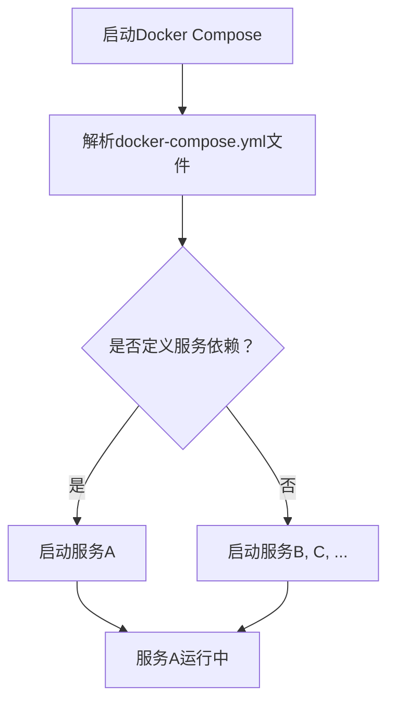
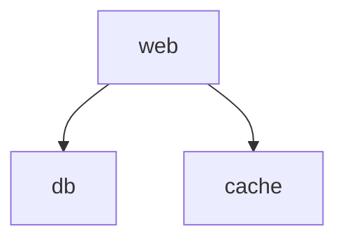

                 

 > **关键词：** Docker Compose，多服务编排，容器化，微服务架构，持续集成/持续部署。

> **摘要：** 本文将深入探讨Docker Compose的多服务编排技术，介绍其核心概念、原理、操作步骤，并通过数学模型和实际项目实例，分析其在微服务架构中的应用和优势。

## 1. 背景介绍

在当今的云计算和容器化技术领域中，微服务架构（Microservices Architecture）已经成为一种流行的设计模式。微服务允许开发人员将应用程序拆分为一组小的、独立的、可协作的服务，每个服务负责实现特定的业务功能。这种架构模式有助于提高系统的可维护性、可伸缩性和容错性。

Docker作为容器技术的引领者，提供了一个强大的平台，使开发者能够轻松地构建、部署和管理容器化应用程序。而Docker Compose则是一个用于定义和编排多容器Docker应用程序的工具，它基于YAML文件描述服务之间的依赖关系和配置，大大简化了多容器应用的部署和管理。

本文将围绕Docker Compose的多服务编排展开，首先介绍其核心概念和原理，然后通过具体的操作步骤来展示如何使用Docker Compose进行多服务部署。此外，还将探讨Docker Compose在微服务架构中的应用，并总结其优缺点和未来发展趋势。

## 2. 核心概念与联系

### 2.1 Docker Compose简介

Docker Compose是基于YAML文件定义和运行多容器Docker应用程序的工具。通过定义一个`docker-compose.yml`文件，开发者可以描述服务（Services）、网络（Networks）和卷（Volumes）的配置，并使用一条简单的命令来启动、停止、重启或切换服务。

### 2.2 微服务架构

微服务架构是一种基于服务划分的应用程序设计方法，每个服务都是独立部署和扩展的，它们通过轻量级的通信机制（如HTTP/REST API）进行交互。微服务架构的特点包括：

- **独立部署：** 每个服务可以独立部署和更新，不影响其他服务的运行。
- **高可伸缩性：** 根据业务需求，可以独立调整每个服务的实例数量。
- **高容错性：** 单个服务的故障不会影响整个系统的稳定性。

### 2.3 Mermaid流程图

以下是一个使用Mermaid绘制的流程图，展示了Docker Compose在微服务架构中的应用：



### 2.4 核心概念原理

- **服务（Services）：** Docker Compose中的基本构建块，每个服务代表一个单独的容器。
- **依赖（Dependencies）：** 服务之间的依赖关系，用于确保在启动服务时，依赖服务已经运行。
- **容器（Containers）：** Docker Compose基于Docker容器来部署服务。

## 3. 核心算法原理 & 具体操作步骤

### 3.1 算法原理概述

Docker Compose的核心算法主要基于YAML文件中的服务定义和依赖关系。其工作原理可以概括为以下几个步骤：

1. 解析`docker-compose.yml`文件，提取服务定义和依赖关系。
2. 按照依赖关系排序，确保依赖服务先于其他服务启动。
3. 启动每个服务，并创建对应的容器。
4. 在服务运行期间，监控容器的状态，并在容器出现故障时重启。

### 3.2 算法步骤详解

1. **定义服务：** 在`docker-compose.yml`文件中定义每个服务，包括容器名称、镜像、环境变量、端口映射等。

```yaml
version: '3'
services:
  web:
    image: webapp
    ports:
      - "5000:5000"
    depends_on:
      - db
      - cache
```

2. **解析配置文件：** Docker Compose解析`docker-compose.yml`文件，提取服务定义和依赖关系。

3. **启动服务：** 按照依赖关系排序，依次启动每个服务。Docker Compose使用Docker API来创建和管理容器。

4. **监控和重启：** Docker Compose监控容器的状态，并在容器出现故障时自动重启。

### 3.3 算法优缺点

**优点：**

- **简化部署和管理：** Docker Compose通过一个简单的YAML文件定义服务，简化了多容器应用的部署和管理。
- **依赖管理：** Docker Compose自动处理服务之间的依赖关系，确保服务按顺序启动。
- **弹性伸缩：** Docker Compose支持自动重启容器，提高了系统的可用性和容错性。

**缺点：**

- **单点故障：** 如果Docker Compose服务本身出现故障，可能导致整个应用程序无法运行。
- **性能影响：** Docker Compose在启动和关闭容器时可能引入额外的性能开销。

### 3.4 算法应用领域

Docker Compose广泛应用于微服务架构的部署和管理，特别是在持续集成/持续部署（CI/CD）流程中。它可以帮助开发者快速搭建和测试应用程序的环境，确保服务之间的依赖关系得到正确处理。

## 4. 数学模型和公式 & 详细讲解 & 举例说明

### 4.1 数学模型构建

在Docker Compose中，服务之间的依赖关系可以用图论中的有向无环图（DAG）来表示。每个节点表示一个服务，边表示服务之间的依赖关系。我们可以用以下公式来表示DAG：

\[ G = (V, E) \]

其中：

- \( V \)：节点集合，表示所有服务。
- \( E \)：边集合，表示服务之间的依赖关系。

### 4.2 公式推导过程

给定一个服务集合 \( S = \{ s_1, s_2, ..., s_n \} \)，我们可以使用拓扑排序来推导出服务之间的依赖关系。拓扑排序的基本思想是：

1. 从没有前驱节点的节点开始。
2. 每次选择一个当前没有后继节点的节点，将其加入排序结果。
3. 删除该节点及其所有后继节点。

### 4.3 案例分析与讲解

假设我们有一个包含三个服务的Docker Compose应用程序，其中`web`服务依赖于`db`和`cache`服务。以下是一个具体的案例：

1. **服务定义：**

```yaml
version: '3'
services:
  web:
    image: webapp
    ports:
      - "5000:5000"
    depends_on:
      - db
      - cache
  db:
    image: postgres:latest
  cache:
    image: redis:latest
```

2. **依赖关系图：**



3. **拓扑排序：**

- 没有前驱节点的节点：`db`、`cache`
- 选择`db`，加入排序结果：`db`
- 选择`cache`，加入排序结果：`db`、`cache`
- 选择`web`，加入排序结果：`db`、`cache`、`web`

排序结果：`db`、`cache`、`web`

根据拓扑排序结果，Docker Compose将按照以下顺序启动服务：

1. `db`
2. `cache`
3. `web`

## 5. 项目实践：代码实例和详细解释说明

### 5.1 开发环境搭建

1. 安装Docker：

```bash
# Ubuntu 18.04
sudo apt-get update
sudo apt-get install docker-ce docker-ce-cli containerd.io
```

2. 安装Docker Compose：

```bash
sudo curl -L "https://github.com/docker/compose/releases/download/1.29.2/docker-compose-`uname -s`-`uname -m`" -o /usr/local/bin/docker-compose
sudo chmod +x /usr/local/bin/docker-compose
```

### 5.2 源代码详细实现

1. **创建`docker-compose.yml`文件：**

```yaml
version: '3'
services:
  web:
    image: webapp
    ports:
      - "5000:5000"
    depends_on:
      - db
      - cache
  db:
    image: postgres:latest
  cache:
    image: redis:latest
```

2. **创建`webapp` Dockerfile：**

```Dockerfile
FROM python:3.8
WORKDIR /app
COPY . .
RUN pip install -r requirements.txt
EXPOSE 5000
CMD ["python", "app.py"]
```

3. **创建`app.py` 应用程序：**

```python
from flask import Flask

app = Flask(__name__)

@app.route('/')
def hello():
    return 'Hello, World!'

if __name__ == '__main__':
    app.run(host='0.0.0.0', port=5000)
```

### 5.3 代码解读与分析

1. **`docker-compose.yml`文件解读：**
   - `version`：指定Docker Compose版本。
   - `services`：定义服务，包括`web`、`db`和`cache`。
   - `web`、`db`和`cache`：分别定义了服务名称、镜像、端口映射和依赖关系。

2. **`webapp` Dockerfile解读：**
   - `FROM python:3.8`：基于Python 3.8镜像。
   - `WORKDIR /app`：设置工作目录。
   - `COPY . .`：复制当前目录下的所有文件到容器内的`/app`目录。
   - `RUN pip install -r requirements.txt`：安装依赖项。
   - `EXPOSE 5000`：暴露5000端口。
   - `CMD ["python", "app.py"]`：运行应用程序。

### 5.4 运行结果展示

1. 启动Docker Compose：

```bash
docker-compose up -d
```

2. 访问Web服务：

```bash
curl localhost:5000
```

输出：

```
Hello, World!
```

## 6. 实际应用场景

### 6.1 微服务架构

Docker Compose非常适合微服务架构的应用场景。通过定义多个服务，可以轻松地将应用程序拆分为独立的模块，实现快速开发和部署。

### 6.2 持续集成/持续部署

Docker Compose可以与CI/CD工具（如Jenkins、GitLab CI等）集成，实现自动化测试和部署。通过编写简单的YAML文件，可以自动化部署整个应用程序。

### 6.3 云原生应用

Docker Compose适用于云原生应用，支持在云平台上（如Kubernetes、AWS、Azure等）部署和管理容器化应用程序。

## 7. 工具和资源推荐

### 7.1 学习资源推荐

- 《Docker实战》
- 《Docker Compose官方文档》
- 《微服务设计》

### 7.2 开发工具推荐

- Docker Desktop
- Docker Hub
- Kubernetes

### 7.3 相关论文推荐

- 《Microservices: A Definition of a New Architecture Style》
- 《Docker: Open Source Container Engine for Mesos and Swarm》

## 8. 总结：未来发展趋势与挑战

### 8.1 研究成果总结

Docker Compose作为一种强大的容器编排工具，已经在微服务架构和持续集成/持续部署中得到广泛应用。通过简化多容器应用程序的部署和管理，它大大提高了开发效率和系统稳定性。

### 8.2 未来发展趋势

- **更高级的编排能力：** Docker Compose可能会增加更多高级功能，如服务发现、负载均衡等。
- **与其他容器编排工具的集成：** Docker Compose可能会与Kubernetes等更先进的容器编排工具进行集成。

### 8.3 面临的挑战

- **性能优化：** 随着服务数量的增加，Docker Compose的性能可能成为瓶颈。
- **安全性增强：** 容器化应用程序的安全性需要得到进一步保障。

### 8.4 研究展望

Docker Compose有望在未来继续发展，成为容器化应用程序部署和管理的主要工具之一。随着微服务架构的普及，Docker Compose将在持续集成/持续部署和云原生应用领域发挥更大的作用。

## 9. 附录：常见问题与解答

### 9.1 Docker Compose与Docker Swarm的区别

- **Docker Compose**：主要用于定义和编排多容器Docker应用程序，适用于单机环境。
- **Docker Swarm**：Docker内置的容器编排系统，可以管理多个Docker主机上的容器，适用于集群环境。

### 9.2 Docker Compose与Kubernetes的区别

- **Docker Compose**：主要用于单机上的容器编排，适合小型和简单的容器化应用程序。
- **Kubernetes**：是一个开源的容器编排平台，可以管理和扩展容器化应用程序，适用于大规模集群环境。

### 9.3 Docker Compose的最佳实践

- **保持配置简洁：** 尽量减少`docker-compose.yml`文件的复杂度。
- **使用最新版本：** 保持Docker和Docker Compose的版本更新，以获得最新的功能和改进。
- **隔离服务：** 将不同的服务部署在不同的容器中，以提高系统的稳定性和安全性。

---

作者：禅与计算机程序设计艺术 / Zen and the Art of Computer Programming

