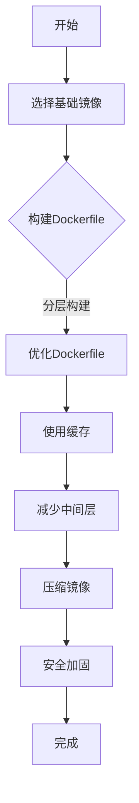

                 

关键词：Docker，容器化，镜像优化，安全加固，性能提升，最佳实践

> 摘要：本文将探讨如何对Docker镜像进行优化与安全加固，以提高性能和安全性。通过对Docker镜像的结构、构建、部署等方面进行深入分析，本文提出了若干实用的优化方法和安全措施，旨在帮助开发者和运维人员更好地管理和维护Docker镜像。

## 1. 背景介绍

随着云计算和微服务架构的普及，容器技术已经成为现代软件开发和部署的重要手段。Docker作为最流行的容器化平台，凭借其简单易用、高效灵活的特点，在众多开发者和企业中得到广泛应用。然而，随着Docker镜像数量的急剧增长，如何对它们进行优化与安全加固，已经成为一个不容忽视的问题。

本文将从以下几个方面展开讨论：

1. Docker镜像的基本概念和组成结构。
2. Docker镜像的构建和优化方法。
3. Docker镜像的安全性问题和加固措施。
4. Docker镜像在实际应用中的优化实践。
5. 未来Docker镜像技术的发展趋势和挑战。

通过本文的阅读，读者将能够了解Docker镜像优化与安全加固的核心内容，掌握相关技术和方法，为实际项目中的镜像管理提供有力支持。

## 2. 核心概念与联系

### 2.1 Docker镜像的基本概念

Docker镜像是一种轻量级、可执行的独立软件包，它包含了运行应用程序所需的所有环境依赖。Docker镜像可以看作是一个静态的容器模板，通过它，我们可以快速部署、扩展和管理应用程序。

Docker镜像的核心组成部分包括：

- **基础镜像**：通常是基于操作系统的基础镜像，如 Ubuntu、CentOS 等。
- **文件系统**：包含应用程序代码、配置文件、库文件等。
- **环境变量**：用于定义容器运行时的环境参数。
- **网络配置**：包括容器内部的网络命名空间、端口映射等。

### 2.2 Docker镜像的构建和优化

Docker镜像的构建是容器化过程中的关键步骤。优化Docker镜像的构建过程，可以有效提升镜像的运行性能和构建效率。以下是几种常见的Docker镜像优化方法：

1. **分层构建**：Docker镜像采用分层存储的方式，每次构建都会在已有层的基础上增加新的层。通过合理组织Dockerfile指令，可以减少不必要的层，降低镜像大小。
2. **使用缓存**：Docker在构建过程中会缓存中间层的结果，利用这些缓存可以显著提高构建速度。通过合理配置缓存策略，可以进一步提升构建效率。
3. **减少中间层**：在Dockerfile中，尽量避免使用不必要的环境变量、安装包和编译中间件，这样可以减少镜像的中间层，降低镜像大小。
4. **压缩镜像**：通过使用压缩工具对Docker镜像进行压缩，可以进一步减小镜像的体积，提高传输和存储效率。

### 2.3 Docker镜像的安全性

Docker镜像的安全性对于容器化应用至关重要。以下是一些常见的Docker镜像安全问题和加固措施：

1. **基础镜像的选择**：选择安全的、经过验证的基础镜像，避免使用包含已知漏洞的镜像。
2. **最小权限原则**：容器内部用户应具有最小权限，避免使用root用户运行应用程序。
3. **镜像扫描**：使用第三方工具对Docker镜像进行安全扫描，检测潜在的安全漏洞。
4. **移除不必要的组件**：在构建镜像时，移除不必要的服务和工具，降低攻击面。
5. **配置加固**：通过调整容器运行时的配置参数，如关闭不必要的服务、限制容器资源使用等，提高镜像的安全性。

### 2.4 Mermaid 流程图

以下是一个简单的Mermaid流程图，展示了Docker镜像的构建和优化过程：



通过上述流程图，读者可以直观地了解Docker镜像构建和优化的关键步骤，为实际操作提供指导。

## 3. 核心算法原理 & 具体操作步骤

### 3.1 算法原理概述

Docker镜像优化与安全加固的核心算法原理主要涉及以下几个方面：

1. **分层存储原理**：Docker镜像采用分层存储技术，通过将应用程序拆分成多个可复用的层，从而提高构建效率和镜像的可维护性。
2. **缓存机制**：Docker在构建过程中会缓存中间层的结果，通过合理利用缓存，可以显著提高构建速度。
3. **最小权限原则**：容器内部用户应具有最小权限，避免使用root用户运行应用程序，降低安全风险。
4. **安全扫描算法**：使用第三方工具对Docker镜像进行安全扫描，检测潜在的安全漏洞，并提供相应的加固措施。

### 3.2 算法步骤详解

1. **选择基础镜像**

   在构建Docker镜像时，首先需要选择一个安全、稳定的基础镜像。常用的基础镜像包括：

   - Ubuntu:16.04
   - Ubuntu:18.04
   - CentOS:7
   - CentOS:8

   选择基础镜像时，需要根据实际需求和性能要求进行权衡。例如，对于需要兼容旧版软件的应用程序，可以选择Ubuntu:16.04或CentOS:7；对于需要高性能的应用程序，可以选择Ubuntu:18.04或CentOS:8。

2. **编写Dockerfile**

   Dockerfile是定义Docker镜像构建过程的脚本文件。编写Dockerfile时，需要注意以下几点：

   - **分层构建**：将应用程序的依赖、配置和代码拆分成多个层，避免不必要的重复。
   - **缓存利用**：合理利用Docker的缓存机制，提高构建速度。
   - **最小权限**：在Dockerfile中，尽量避免使用root用户，而是使用具有最小权限的用户运行应用程序。

3. **优化Dockerfile**

   在编写完Dockerfile后，需要对Dockerfile进行优化，以提高构建效率和镜像性能。常见的优化方法包括：

   - **减少中间层**：在Dockerfile中，避免不必要的中间层，如不必要的环境变量、安装包和编译中间件。
   - **使用压缩工具**：在构建过程中，使用压缩工具对镜像进行压缩，减小镜像体积。
   - **调整镜像大小**：通过调整Dockerfile中的指令顺序和依赖关系，优化镜像大小。

4. **使用缓存**

   Docker在构建过程中会缓存中间层的结果，通过合理利用缓存，可以显著提高构建速度。具体方法包括：

   - **分层缓存**：将Dockerfile中的指令拆分成多个层，每次构建时只更新需要更新的层。
   - **缓存配置**：通过调整Docker的缓存配置，如增加缓存空间、设置缓存保留时间等，优化缓存策略。

5. **安全加固**

   在Docker镜像构建过程中，需要对镜像进行安全加固，以防止潜在的安全威胁。具体措施包括：

   - **基础镜像加固**：选择安全、稳定的基础镜像，避免使用包含已知漏洞的镜像。
   - **最小权限**：在容器内部，使用具有最小权限的用户运行应用程序，避免使用root用户。
   - **镜像扫描**：使用第三方工具对Docker镜像进行安全扫描，检测潜在的安全漏洞，并提供相应的加固措施。

### 3.3 算法优缺点

**优点**：

1. **高效性**：通过分层存储和缓存机制，Docker镜像优化算法可以显著提高构建速度和镜像性能。
2. **安全性**：通过最小权限原则和安全加固措施，Docker镜像优化算法可以降低容器内部的安全风险。
3. **可维护性**：通过合理组织Dockerfile，可以降低镜像的复杂度，提高可维护性。

**缺点**：

1. **依赖性**：Docker镜像优化算法依赖于Docker平台的特性和第三方工具，可能存在兼容性问题。
2. **安全性**：虽然Docker镜像优化算法可以降低安全风险，但无法完全消除潜在的安全威胁。

### 3.4 算法应用领域

Docker镜像优化与安全加固算法广泛应用于以下领域：

1. **企业级应用**：企业级应用对性能和安全性要求较高，Docker镜像优化算法可以帮助企业提高应用性能和安全性。
2. **云计算**：云计算环境中，容器技术已经成为主要的部署方式，Docker镜像优化算法可以提高云服务的性能和可靠性。
3. **大数据处理**：大数据处理领域，Docker镜像优化算法可以帮助提高数据处理效率，降低成本。

## 4. 数学模型和公式 & 详细讲解 & 举例说明

### 4.1 数学模型构建

Docker镜像优化与安全加固的过程可以看作是一个复杂的优化问题。为了更好地描述这个优化过程，我们可以构建一个数学模型。

假设Docker镜像的构建过程可以分为n个阶段，每个阶段需要完成特定的任务，并产生相应的性能和安全指标。设第i个阶段的性能指标为\(P_i\)，安全指标为\(S_i\)，则整个Docker镜像的性能和安全指标可以表示为：

\[P = \sum_{i=1}^{n} P_i\]
\[S = \sum_{i=1}^{n} S_i\]

为了优化Docker镜像，我们需要在性能和安全之间找到一个平衡点。设目标函数为\(f(P, S)\)，则优化问题可以表示为：

\[\min f(P, S)\]

其中，目标函数可以定义为：

\[f(P, S) = \alpha P + \beta S\]

其中，\(\alpha\)和\(\beta\)分别为性能权重和安全权重，可以根据实际情况进行调整。

### 4.2 公式推导过程

为了推导出目标函数\(f(P, S)\)的具体形式，我们需要考虑以下几个因素：

1. **性能指标**：性能指标可以包括构建时间、镜像大小、资源利用率等。假设第i个阶段的性能指标为\(P_i\)，则整体性能指标为\(P = \sum_{i=1}^{n} P_i\)。
2. **安全指标**：安全指标可以包括漏洞数量、安全评分等。假设第i个阶段的安全指标为\(S_i\)，则整体安全指标为\(S = \sum_{i=1}^{n} S_i\)。
3. **权重**：为了平衡性能和安全，我们需要设置性能权重和安全权重。假设性能权重为\(\alpha\)，安全权重为\(\beta\)。

根据以上因素，我们可以得到目标函数的形式为：

\[f(P, S) = \alpha P + \beta S\]

其中，\(\alpha\)和\(\beta\)可以根据实际情况进行调整。例如，如果对性能要求较高，可以设置较大的\(\alpha\)值，反之亦然。

### 4.3 案例分析与讲解

为了更好地理解上述数学模型，我们通过一个具体的案例进行分析。

假设一个Docker镜像的构建过程分为3个阶段，每个阶段的性能指标和安全指标如下表所示：

| 阶段 | 性能指标 | 安全指标 |
| --- | --- | --- |
| 1 | 10 | 30 |
| 2 | 20 | 40 |
| 3 | 15 | 25 |

现在，我们需要设置性能权重和安全权重，以优化Docker镜像的构建过程。

假设我们设置性能权重\(\alpha = 0.6\)，安全权重\(\beta = 0.4\)，则目标函数为：

\[f(P, S) = 0.6P + 0.4S\]

将每个阶段的性能指标和安全指标代入目标函数，可以得到：

\[f(P, S) = 0.6(10 + 20 + 15) + 0.4(30 + 40 + 25) = 26.5 + 34 = 60.5\]

这个结果表明，通过设置适当的权重，我们可以优化Docker镜像的构建过程，使其在性能和安全之间达到一个平衡点。

在实际应用中，我们可以根据具体需求调整权重，以实现不同的优化目标。例如，如果对性能要求较高，可以增加性能权重，降低安全权重；如果对安全性要求较高，可以增加安全权重，降低性能权重。

## 5. 项目实践：代码实例和详细解释说明

### 5.1 开发环境搭建

在进行Docker镜像优化与安全加固的项目实践之前，我们需要搭建一个合适的环境。以下是开发环境的搭建步骤：

1. **安装Docker**：在开发机器上安装Docker，可以参考[Docker官方文档](https://docs.docker.com/install/)。
2. **配置Docker加速器**：为了提高镜像构建速度，我们可以配置Docker加速器。以阿里云加速器为例，具体步骤如下：

   - 访问[阿里云容器镜像服务](https://cr.console.aliyun.com/)。
   - 注册账号并登录。
   - 创建容器镜像仓库，获取镜像加速地址。
   - 在Docker配置文件中添加镜像加速地址，例如：

     ```bash
     docker config create my-config --add-host accelerated.github.com:cr.console.aliyun.com
     docker config use my-config
     ```

   - 重启Docker服务。

3. **安装构建工具**：根据项目需求，安装相应的构建工具，如Maven、Gradle等。

### 5.2 源代码详细实现

以下是一个简单的Docker镜像优化与安全加固的示例项目，包含一个简单的Web应用程序。

**Dockerfile**

```Dockerfile
# 使用基础镜像
FROM ubuntu:18.04

# 设置 maintainer 信息
LABEL maintainer="yourname@example.com"

# 安装必要的依赖
RUN apt-get update && apt-get install -y \
    nginx \
    python3-pip \
    && rm -rf /var/lib/apt/lists/*

# 设置工作目录
WORKDIR /app

# 复制应用程序代码
COPY . /app

# 配置Nginx
COPY nginx.conf /etc/nginx/nginx.conf

# 安装Python依赖
RUN pip3 install -r requirements.txt

# 暴露端口
EXPOSE 80

# 运行Nginx
CMD ["nginx", "-g", "daemon off;"]
```

**nginx.conf**

```nginx
http {
    server {
        listen 80;
        location / {
            proxy_pass http://localhost:8000;
        }
    }
}
```

**requirements.txt**

```plaintext
Flask==2.0.1
gunicorn==20.1.0
```

**main.py**

```python
from flask import Flask
app = Flask(__name__)

@app.route('/')
def hello():
    return 'Hello, Docker!'

if __name__ == '__main__':
    app.run(host='0.0.0.0', port=8000)
```

### 5.3 代码解读与分析

**Dockerfile**

- **基础镜像**：使用Ubuntu 18.04作为基础镜像，这是一个稳定且广泛使用的操作系统。
- **维护者信息**：使用LABEL标签添加维护者信息，方便后续维护和管理。
- **依赖安装**：通过RUN指令安装Nginx、Python和pip等依赖，确保应用程序正常运行。
- **工作目录**：使用WORKDIR设置工作目录，统一应用程序的文件路径。
- **应用程序代码**：使用COPY指令将应用程序代码复制到工作目录。
- **Nginx配置**：使用COPY指令将Nginx配置文件复制到指定位置，确保Nginx可以正常转发请求。
- **Python依赖**：使用RUN指令安装Python依赖，确保应用程序可以正常运行。
- **端口暴露**：使用EXPOSE指令暴露80端口，以便外部访问Nginx。
- **启动命令**：使用CMD指令启动Nginx，确保容器启动时Nginx服务正常运行。

**nginx.conf**

- **Nginx配置**：配置Nginx监听80端口，并将请求转发到本地8000端口，即Python应用程序的端口。

**requirements.txt**

- **Python依赖**：列出Python应用程序的依赖库，包括Flask和gunicorn。

**main.py**

- **Flask应用**：定义一个简单的Flask应用，处理HTTP请求并返回响应。

### 5.4 运行结果展示

在完成Docker镜像构建后，我们可以通过以下步骤运行应用程序：

1. **构建镜像**：

   ```bash
   docker build -t myapp:latest .
   ```

2. **运行容器**：

   ```bash
   docker run -d -p 80:80 myapp:latest
   ```

3. **访问应用程序**：

   打开浏览器，访问`http://localhost`，应看到如下响应：

   ```plaintext
   Hello, Docker!
   ```

这表明Docker镜像优化与安全加固的示例项目已成功运行。

## 6. 实际应用场景

Docker镜像优化与安全加固在各个实际应用场景中发挥着重要作用，下面列举几个典型的应用场景：

### 6.1 企业级应用

企业级应用通常对性能和安全性要求较高。通过Docker镜像优化，可以显著提高应用性能，降低部署和运维成本。例如，金融行业的在线交易系统，通过对Docker镜像进行优化，可以降低系统的响应时间，提高交易处理能力。

### 6.2 云计算

在云计算环境中，容器技术已经成为主要的部署方式。Docker镜像优化与安全加固可以帮助云服务提供商提高资源利用率，降低运营成本。例如，云服务器提供商可以为不同类型的用户定制不同的Docker镜像，以满足不同业务场景的需求。

### 6.3 大数据处理

大数据处理领域，Docker镜像优化与安全加固可以显著提高数据处理效率，降低成本。例如，使用Docker镜像优化大数据处理流程，可以缩短数据处理周期，提高数据处理的准确性和可靠性。

### 6.4 DevOps

在DevOps实践中，Docker镜像优化与安全加固可以帮助开发者和运维人员更好地协同工作。通过优化Docker镜像，可以确保开发环境与生产环境的一致性，降低部署风险。

### 6.5 教育培训

Docker镜像优化与安全加固在教育培训领域也具有广泛的应用。例如，在计算机科学和教育培训中，Docker镜像可以用来创建虚拟实验室，帮助学生更好地理解和掌握容器技术。

## 7. 未来应用展望

随着容器技术的不断发展和普及，Docker镜像优化与安全加固在未来将具有更广泛的应用前景。以下是一些可能的趋势和挑战：

### 7.1 自动化

未来，Docker镜像的构建、优化和安全加固可能会更加自动化。通过集成自动化工具，如CI/CD流水线、自动化测试和安全扫描工具，可以实现全流程的自动化管理。

### 7.2 云原生

随着云原生技术的兴起，Docker镜像优化与安全加固将更加关注云原生应用的需求。例如，针对Kubernetes等云原生平台，将需要更多针对容器编排和集群管理的优化与安全措施。

### 7.3 安全性

随着容器技术的普及，安全性问题将越来越受到重视。未来，Docker镜像优化与安全加固将更加关注容器内部的安全性，如内核级安全增强、容器网络隔离等。

### 7.4 标准化和规范化

为了推动容器技术的发展，标准化和规范化工作将逐步展开。未来，Docker镜像的构建、优化和安全加固可能会遵循更多的标准和规范，以提高兼容性和互操作性。

## 8. 工具和资源推荐

### 8.1 学习资源推荐

- **Docker官方文档**：[https://docs.docker.com/](https://docs.docker.com/)
- **《Docker实战》**：由JasonObjectId编写的经典书籍，适合初学者和进阶者阅读。
- **《容器架构》**：由杨毅、王道勇等人编写的国内优秀书籍，详细介绍了容器技术的发展和应用。

### 8.2 开发工具推荐

- **Docker Desktop**：Docker官方提供的跨平台开发工具，方便开发者进行镜像构建和容器管理。
- **Kubernetes**：开源容器编排平台，用于自动化容器部署、扩展和管理。
- **Jenkins**：开源持续集成和持续部署工具，支持Docker镜像的自动化构建和部署。

### 8.3 相关论文推荐

- **“Container Security: Protecting the New OS of the Cloud”**：一篇关于容器安全性的综述论文，详细介绍了容器安全面临的主要挑战和解决方案。
- **“Kubernetes Security Best Practices”**：一篇关于Kubernetes安全性的实践指南，提供了许多实用的安全加固方法。

## 9. 总结：未来发展趋势与挑战

Docker镜像优化与安全加固是现代软件开发和运维中的重要一环。随着容器技术的不断发展和应用场景的拓展，Docker镜像优化与安全加固将面临更多挑战和机遇。未来，我们需要关注以下几个方面：

1. **自动化**：通过自动化工具，实现Docker镜像的全流程管理，提高开发效率和运维质量。
2. **云原生**：针对云原生应用的需求，优化Docker镜像的构建、优化和安全加固方法，提高容器化应用的性能和安全性。
3. **安全性**：随着容器技术的普及，安全性问题将越来越受到关注。我们需要不断探索和改进安全加固方法，确保容器化应用的安全。
4. **标准化**：推动容器技术的标准化和规范化，提高兼容性和互操作性，为容器技术的发展奠定基础。

通过持续的努力和创新，我们相信Docker镜像优化与安全加固将迎来更加美好的未来。

## 10. 附录：常见问题与解答

### 10.1 Docker镜像优化常见问题

**Q1**：如何减小Docker镜像的大小？

**A1**：减小Docker镜像的大小可以通过以下几种方法实现：

- **分层构建**：合理组织Dockerfile中的指令，减少不必要的层，减小镜像体积。
- **删除临时文件**：在Dockerfile中删除构建过程中的临时文件，如编译中间件和缓存文件。
- **使用轻量级基础镜像**：选择轻量级的操作系统基础镜像，如Alpine。
- **压缩镜像**：使用压缩工具对Docker镜像进行压缩，减小镜像体积。

**Q2**：如何提高Docker镜像的构建速度？

**A2**：提高Docker镜像的构建速度可以从以下几个方面入手：

- **使用缓存**：合理利用Docker的缓存机制，提高构建速度。
- **减少中间层**：避免在Dockerfile中添加不必要的中间层，减少构建次数。
- **调整构建策略**：通过调整Dockerfile的构建策略，如合并多个指令到一个层，减少构建时间。

### 10.2 Docker镜像安全加固常见问题

**Q1**：如何检测Docker镜像的安全漏洞？

**A1**：检测Docker镜像的安全漏洞可以使用以下工具：

- **Clair**：开源的镜像漏洞扫描工具，支持对Docker镜像进行安全扫描。
- **Docker Bench for Security**：Docker官方提供的安全检查工具，用于评估Docker环境的配置和安全状态。
- **Trivy**：开源的容器和Kubernetes安全扫描工具，支持对Docker镜像和Kubernetes集群进行安全扫描。

**Q2**：如何加固Docker镜像的安全性？

**A2**：加固Docker镜像的安全性可以从以下几个方面入手：

- **选择安全的基

